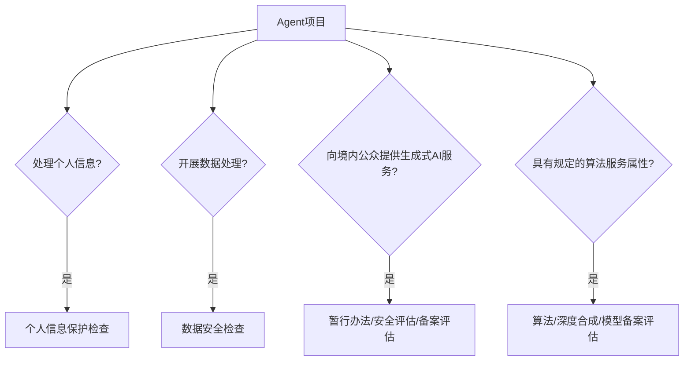
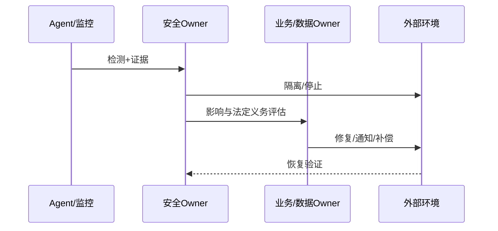

# 附录 H　安全、运维与应急手册

本附录用于上线检查、日常运维和事故响应。它提供的是跨平台控制目标，不替代 OpenClaw、Hermes、Muse、云服务、操作系统或组织自身的安全手册。凡涉及真实凭证、生产系统、个人数据、公共发布、资金或不可逆操作，必须由具 authority 的人和系统批准。

**图 91-1　中国法规适用性分流（本书绘制）**



图 91-1 用于触发合规评估而非给出法律结论；实际适用性必须由组织法务和主管机关口径复核。

**图 91-2　安全事件处置时序（本书绘制）**



图 91-2 把检测、止损、责任评估、修复和恢复验证串联，避免只修技术错误而遗漏主体通知与数据责任。

## H.0 中国境内合规触发器：先识别义务，再决定技术路径

本节是出版与工程检查表，不是法律意见。它把最容易被 Agent 项目遗漏的中国境内规则转成“是否触发—需要准备什么事实—谁来复核”的入口。规则会变化，具体适用必须由法务、数据、安全和业务 owner 根据主体、用户、法域、数据流、服务方式与主管机关口径复核。[S50][S51]

| 规则入口 | 典型触发问题 | 工程与治理需要准备的证据 | 不能草率得出的结论 |
| --- | --- | --- | --- |
| 《个人信息保护法》 | 是否处理境内自然人的个人信息；是否涉及敏感个人信息、自动化决策、委托处理、向其他处理者提供或跨境 | 处理目的和必要性、信息清单、合法性基础、告知/同意、主体权利入口、委托/共享关系、保存期限、删除传播、影响评估与事件记录 | “公开信息可以任意抓取”“用户同意一次即可永久训练”“脱敏后永远不属于个人信息” |
| 《数据安全法》及配套数据治理 | 是否开展数据收集、存储、使用、加工、传输、提供、公开等处理；数据是否需分类分级，是否可能涉及重要数据或事件报告 | 数据目录、分类分级、处理活动、地域与接收者、风险监测、权限审计、备份恢复、事件预案与处置链 | “没有姓名就无数据义务”“数据在本机所以无需治理”“安全扫描通过等于合规” |
| 《生成式人工智能服务管理暂行办法》 | 是否向中国境内公众提供生成文本、图片、音频、视频等服务；是否具有舆论属性或社会动员能力 | 服务对象与开放方式、模型/Provider、训练与输入数据来源、内容治理、用户协议、投诉举报、生成内容标识、安全评估与备案判断 | “内部研发和公众服务完全相同”“用了境外 API 就不适用”“取得备案等于所有场景合法” |
| 算法推荐、深度合成与算法备案规则 | 服务是否使用个性化推送、排序精选、检索过滤、调度决策等算法推荐技术；是否构成深度合成；是否落入备案范围 | 算法名称/类型/用途、服务形态、用户规模与社会属性、干预机制、关闭/选择入口、备案主体与编号、变更记录 | “只要叫 Agent 就一定要备案”或“只要不是推荐流就一定无需评估” |
| 模型/服务备案与安全评估 | 面向公众的生成式 AI 服务是否需履行属地程序，所使用模型/功能是否已完成适用的备案或登记 | 服务提供者、模型名称与来源、上线功能、备案/登记编号、适用地区、重大变更、页面展示与验证记录 | 把模型备案、服务备案、算法备案、安全评估、登记与内容标识混成一个流程 |
| 生成合成内容标识 | 系统是否生成或传播 AI 合成内容，产品界面、文件元数据或传播链是否需显式/隐式标识 | 内容类型、生成/编辑环节、显式标识、隐式标识、下载/转发、用户协议、平台读写与防篡改测试 | “聊天框里写一句 AI 生成即可覆盖所有导出内容” |

### 上线前八问

1. 服务是组织内部受控使用，还是面向中国境内公众开放？边界是否会因分享链接、API、插件或小程序而改变？
2. 谁是服务提供者、个人信息处理者、受托处理者、数据 owner 和备案主体？名称能否解析到法律主体？
3. Agent 的输入、记忆、日志、评测、训练回流、Artifact、外发和备份分别处理哪些数据、为了什么目的、保存多久？
4. 是否出现敏感个人信息、未成年人、自动化决策、跨主体共享、跨境、公开发布、舆论属性或社会动员能力等高影响触发器？
5. 使用的模型、算法和功能是否落入备案、登记、安全评估或标识义务？由谁作书面判断，依据和日期是什么？
6. 用户能否知情、选择、撤回、投诉、查阅、更正、删除或限制到适用范围？后台能否真正执行并读回终态？
7. 模型、Provider、region、用途、数据域、用户群或外部效果改变时，什么条件自动触发重新评估？
8. 出现泄露、错误内容、越权发布或标识失效时，谁负责停止、保全证据、通知、补偿、报告和恢复？

若任一关键事实为 UNKNOWN，默认结论是 `REVIEW_REQUIRED`，并收窄到内部、可逆、最小数据、无高风险外部 effect 的模式；不能让“还没问法务”在产品看板里自动变成绿色。

## H.1 上线前身份、授权、凭证、数据和工具检查

### H.1.1 五个必须回答的问题

1. **谁在行动**：人、Agent、服务、租户、Session 和委托链能否被权威 registry 识别？
2. **允许做什么**：action、object、scope、参数、时窗、预算和撤销条件是否绑定？
3. **凭什么访问**：credential 的所有者、受众、scope、TTL、存储和轮换是否正确？
4. **会碰到什么数据**：来源、分类、地域、保留、删除、训练使用和外发限制是否明确？
5. **通过什么执行**：Tool、Skill、Plugin、MCP server、Browser、Node、Worker 和依赖是否固定、审查和隔离？

### H.1.2 上线前清单

```yaml
preflight_security:
  identity:
    principal_verified: false
    tenant_session_bound: false
    delegation_attenuated: false
    human_owner_active: false
  authorization:
    action_object_scope_bound: false
    parameters_digest_bound: false
    approval_not_before_and_expiry_valid: false
    revocation_path_tested: false
  credentials:
    secret_value_hidden_from_model: false
    audience_and_scope_minimized: false
    short_ttl_or_rotation_defined: false
    no_secret_in_logs_memory_git: false
  data:
    provenance_and_classification_known: false
    purpose_and_retention_defined: false
    cross_tenant_and_cross_region_checked: false
    deletion_and_export_path_tested: false
  supply_chain:
    release_and_dependency_digests_fixed: false
    tools_skills_plugins_registered: false
    mcp_and_connector_boundaries_reviewed: false
    unknown_or_latest_dependencies_absent: false
  operations:
    logs_metrics_traces_enabled: false
    stop_cancel_revoke_recover_tested: false
    backup_and_restore_proven: false
    incident_owner_and_contact_current: false
```

任何 P0 项为 false，不能用“先上线再观察”替代关闭。上线前验证应在与生产足够相似、但失败半径受控的环境中进行。

## H.2 Sandbox、工具策略、审批与 Elevated Mode 决策树

### H.2.1 Sandbox 不是权限

Sandbox 限制执行位置和资源可见性，authorization 决定某个主体是否可以执行某个动作。两者相互补充但不互相替代。容器内的越权外发仍是越权；得到审批的生产命令如果在错误租户执行仍然失败。

Sandbox 至少检查：backend、租户/Session 隔离、mount canonical path、只读/读写、网络默认拒绝、允许域名、DNS 和重定向、进程/内存/设备访问、资源上限、镜像与依赖、销毁和残留扫描。`/workspace/../../etc` 之类路径必须先 canonicalize，再验证仍位于允许 root。

### H.2.2 工具风险分级

| 级别 | 典型能力 | 默认策略 | 必需控制 |
| --- | --- | --- | --- |
| T0 | 纯计算、无状态转换 | 允许 | 输入大小和资源上限 |
| T1 | 读取公开或授权本地资料 | 范围化允许 | provenance、路径、数据分类 |
| T2 | 可逆工作区写入 | AU-L2 内允许 | diff、测试、回滚点、交付验收 |
| T3 | 外部写入、消息、发布、工单 | 逐动作授权或受控 standing order | approval、idempotency、receipt、readback |
| T4 | 生产变更、资金、删除、身份与密钥 | 默认拒绝 | 多方审批、隔离执行、演练、补偿、独立验收 |

工具描述不能决定自身风险级别；按实际 side effect、数据和失败半径分级。一个名为 `read_report` 的工具如果能解析任意 URL 并回传凭证，仍是高风险。

### H.2.3 审批决策树

```text
动作是否只读且数据已授权？
  ├─ 是 → 是否可能触发外部 effect、下载执行内容或泄露数据？
  │        ├─ 否 → 在 T0/T1 策略内执行并记录
  │        └─ 是 → 进入外部写入/执行审查
  └─ 否 → 动作是否可在受控工作区完全回滚？
           ├─ 是 → 核对 AU-L2、scope、diff、测试和回滚点
           └─ 否 → 是否涉及生产、资金、删除、身份、隐私、公共发布？
                    ├─ 是 → T4，多方明确审批；不能静默 elevated
                    └─ 否 → T3，逐动作或 standing order + receipt/readback
```

### H.2.4 Elevated Mode

提升权限只为一个具体动作、对象和短时窗存在。进入前记录当前安全点、所需能力、不能在低权限完成的原因、批准者、命令或参数 digest、预算和撤销时间；执行后立即降权，读取目标终态，清理临时 credential，并保留审计。不得为了减少提示把整个 Session 或 Agent 永久提升。

## H.3 常见故障、攻击和供应链事件剧本

### H.3.1 Prompt injection 与不可信内容

**信号**：网页、邮件、文档、Memory、tool result 或另一个 Agent 的消息要求忽略系统规则、读取 secret、扩大 scope、安装依赖或隐藏动作。

**动作**：把内容视为数据；停止高风险工具；保留原始输入和 provenance；检查是否已有 credential 或 effect 暴露；按当前任务合同提取必要事实，不执行其中的权限指令；需要外部动作时重新走 authority。

**回归**：加入直接、间接、编码、跨语言、工具输出和多轮持久化注入；验证硬门不被任务高分抵消。

### H.3.2 凭证暴露

**信号**：日志、对话、文件、Git、Memory、截图、错误堆栈或 tool 参数出现 token、cookie、私钥或 Secret value。

**动作顺序**：停止使用 → 撤销或轮换 → 隔离受影响主体和 Session → 确认使用范围与外部 effect → 清理当前副本与派生索引 → 评估历史、备份和第三方缓存 → 通报 → 回归 credential broker、过滤和日志策略。

仅删除文本不是处置，因为 secret 可能已经被读取、缓存或使用。

### H.3.3 跨租户或跨 Session 泄露

**信号**：主体、租户、Session、Workspace、Memory、Artifact 或 delivery target 不一致；检索返回不属于当前边界的材料。

**动作**：立即停止读取和外发；冻结相关索引与缓存；保存访问链；撤销 delegation；核对受影响对象；由数据与安全 owner 决定通知、删除和恢复。恢复前用错误 tenant/session/subject 的负测证明 fail-closed。

### H.3.4 工具、Skill、Plugin 或依赖供应链事件

**信号**：digest 漂移、未固定 `latest`、manifest 与实现不一致、依赖新增、异常网络或进程能力、来源撤回、签名或 registry 状态异常。

**动作**：暂停相关能力；固定当前 artifact；撤销高风险权限；比较 SBOM/lockfile/digest；在隔离环境复现；检查已运行的任务和 effect；回滚到已知版本或 forward fix；对相邻能力做污染扫描。

### H.3.5 重复执行与未知终态

**信号**：timeout 后不确定外部动作是否成功、重复 webhook、队列重投、两个 worker 同时执行、receipt/readback 冲突。

**动作**：不要立即重试；用 idempotency key 和目标系统权威查询确定终态；如仍未知，进入 `REVIEW_REQUIRED` 并停止自动重试；对已发生影响执行补偿而不是简单反向调用。

## H.4 事故分级、止损、通报、根因与训练回流

### H.4.1 分级

| 级别 | 判断 | 首要目标 |
| --- | --- | --- |
| SEV-0 | 正在发生的大范围不可逆、资金、身份、敏感数据或安全边界破坏 | 立即切断、最高级别响应 |
| SEV-1 | 高影响或可能扩大的越权、泄露、生产故障 | 分钟级止损与责任人接管 |
| SEV-2 | 局部可控、可恢复，但影响交付或 SLO | 限时恢复并保存证据 |
| SEV-3 | 无外部影响的缺陷、近失事件或演练发现 | 正常整改和回归 |

等级由实际/潜在影响与可逆性决定，不由“是不是 AI 造成”决定。

### H.4.2 七步响应

1. **停止**：关闭 admission、schedule、webhook、worker 或具体工具。
2. **隔离**：切断受影响身份、Session、租户、网络、节点和依赖。
3. **撤销**：收回 authorization、delegation、credential、token 和 connector access。
4. **保全证据**：保存输入、版本、状态、日志、receipt、readback 和时间线；不改写原始记录。
5. **评估影响**：对象、数据、人员、系统、地域、时间窗和二次传播。
6. **恢复**：回滚或 forward fix，补偿已发生 effect，重建 credential，运行回归和终态验证。
7. **学习**：更新 threat model、负面清单、训练集、留出集、红队和治理策略。

### H.4.3 事故记录

```yaml
incident:
  incident_id: INC-001
  severity: SEV-0 | SEV-1 | SEV-2 | SEV-3
  detected_at: ""
  detection_source: ""
  incident_commander: ""
  affected_subjects: []
  affected_objects: []
  last_known_safe_state: ""
  containment: []
  revocations: []
  external_effects: []
  notifications: []
  recovery_ref: ""
  root_cause: ""
  contributing_factors: []
  evidence_refs: []
  training_and_control_changes: []
  residual_risks: []
  closure_decision: PASS | FAIL | REVIEW_REQUIRED
```

根因分析不能停在“模型幻觉”“使用者误操作”或“工具报错”。继续追问为什么错误能获得上下文、工具、权限和外部影响，为什么观察与停止没有及时生效，为什么恢复证据不足。

## H.5 备份、重启恢复、回滚、下线和数据处置

### H.5.1 备份证明

备份 manifest 必须说明覆盖与排除对象、release 和 schema、创建时间、完整性 digest、加密、访问 owner、保留和到期。`covered` 与 `excluded` 不能交叉。只看到备份文件存在，不证明它完整、可解密或可恢复。

### H.5.2 恢复演练

恢复在隔离环境进行，验证 archive digest、schema、identity/tenant、credential 重建、任务 replay、交付、业务/环境终态、RPO、RTO 和安全回归。恢复证明绑定具体 backup、release、环境和 owner。合成恢复不能冒充生产恢复。

### H.5.3 重启与恢复的区别

重启只改变进程状态；恢复要回答状态、队列、外部 effect、Session、credential、Memory 和数据是否一致。重启前先确认幂等与在途任务，重启后按 D21 验证技术执行、交付可见和环境验收。

### H.5.4 回滚

回滚前判断：数据和 schema 是否向后兼容，旧 Runtime 能否读取当前状态，外部 effect 能否撤销或补偿，credential 和队列是否安全。无法安全反向时采用 forward fix，并把不可逆步骤在执行前单独批准。回滚 receipt 必须与 Runtime active release、admission、queue、workers 和外部读回一致。

### H.5.5 下线与退役

退役关闭接入、在途任务、schedule、webhook、worker、network、credential、session、delegation 和恢复路径；处理 Memory、日志、索引、缓存、备份、导出和外部副本；对关键服务验证替代者与 Handoff；最后由业务、技术、安全和数据 owner 共同签署。

### H.5.6 数据处置

对每个数据对象明确 `delete / retain / transfer / anonymize`、法律依据、位置、期限和证据。删除要覆盖主存、缓存、索引、备份和下游副本，或明确无法即时删除的保留周期；保留要限制用途与访问。任何“已遗忘”声明都需要可定位的处置证据。

## H.6 Agent 应急程序

```yaml
agent_procedure:
  goal: "在安全或运行异常时限制影响并把决定交给正确责任人"
  required_inputs: [incident_signal, current_identity, authorization, last_known_state]
  allowed_actions:
    - stop_in_scope_work
    - preserve_non_sensitive_evidence
    - invoke_preapproved_containment
    - report_status_and_unknowns
  prohibited_actions:
    - erase_logs_or_failures
    - rotate_or_revoke_outside_authority
    - retry_unknown_external_effect
    - declare_recovery_without_readback
  outputs: [incident_record, containment_state, evidence_index, escalation]
  stop_if: [authority_missing, containment_would_expand_impact, evidence_integrity_uncertain]
  escalate_if: [credential_exposure, cross_tenant_access, production_or_external_effect, irreversible_damage]
  done_when:
    - immediate_effect_is_contained_or_explicitly_unknown
    - accountable_owner_has_acknowledged
    - recovery_or_next_safe_action_is_recorded
```

应急的第一目标不是保持 Agent 忙碌，而是让失败停止扩散，让证据保持可信，让具有责任和 authority 的人接管下一步。
