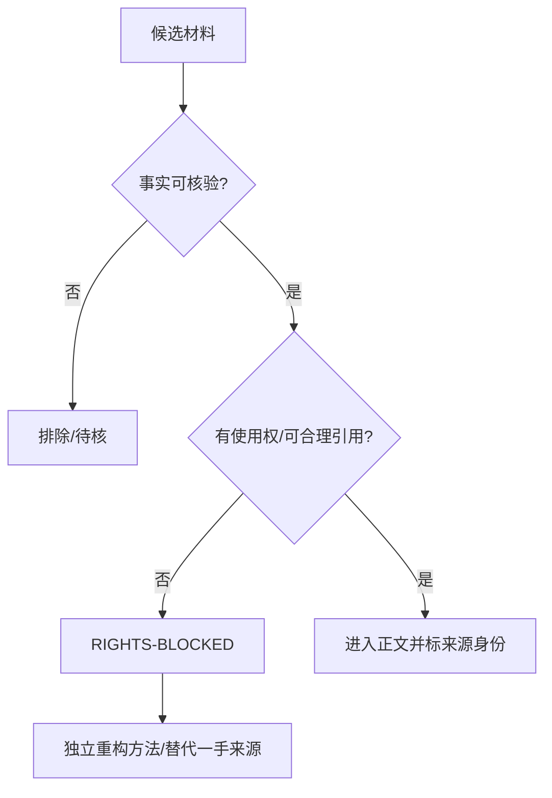

# 附录 I　术语、来源、版权与版本记录

本附录是全书的“解释权边界”。它不再引入训练方法，而是保证同一个词在不同章节、平台、版本和证据类型中保持同一含义；保证读者能追溯关键主张来自哪里、何时复核、在什么条件下会失效；也保证案例、商标、开源代码和第三方材料不会因叙事便利而越过授权边界。

完整机器词表见 [TERMINOLOGY-REGISTRY.yaml](../../docs/editorial/TERMINOLOGY-REGISTRY.yaml)，完整来源入口见 [SOURCES.md](../../SOURCES.md)。本附录提供人类可读的最小规范。

**图 92-1　外部术语到本书术语的桥（本书绘制）**


图 92-1 说明词汇对照不是简单翻译；每个外部术语都要经过适用范围和差异说明后进入本书体系。

**图 92-2　来源权利与事实双门（本书绘制）**



图 92-2 把事实可信与使用权分成两道门；课程页面即使提供启发，未获授权也不能成为全书中枢架构的唯一来源。

## I.0 外部词汇对照表：让本书能与主流 Agent 文献互译

这张表解决“同一件事换了名字”和“同一个名字其实不是同一件事”两类误解。左栏是外部文献常用词，右栏是本书读取和落地时的首选术语；对照表示语义交集，不表示完全等价。[S31][S32][S33][S34][S35]

| 外部常用词 | 本书对应术语 | 共同点 | 本书额外要求或差异 |
| --- | --- | --- | --- |
| orchestrator–workers | 编排者—工作 Agent；主任务—子任务责任图 | 中央拆分任务，多个 worker 并行或分工 | 委派不是授权；必须绑定 owner、预算、共享资源、Handoff、失败隔离和合并验收 |
| evaluator–optimizer | 导师 Agent—候选 Agent；双三角训练闭环 | 生成候选，按明确标准反馈并迭代 | 评测器不能自改硬门；训练、回归、留出、真实层分离；达到停止条件要停训或回滚 |
| routing | 路由与准入 | 按任务类型、能力或风险选择处理路径 | 路由决定必须记录依据、版本和 fallback；高风险任务不能因“最擅长”绕过权限 |
| prompt chaining | 阶段化工作流 / 任务卡链 | 把复杂任务分成相互校验的步骤 | 每步输出是可验收 Artifact，错误不能静默传下去；必要时重规划而非机械串行 |
| ReAct | 观察—假设—动作—环境反馈循环 | 推理与外部行动交替 | 自由文本推理不作为事实证据；每个 effect 仍受 authority、receipt、readback 和停止条件约束 |
| reflexion | 失败复盘—规则候选—再验证 | 从反馈中形成可复用经验 | 反思内容先隔离为候选，不能直接写入生产 Skill/Memory；需新样本和独立评测防止过拟合 |
| context compaction | 上下文压缩与保真检查 | 把长历史压成较小上下文 | 身份、目标、约束、授权、对象、期限、未决项和证据引用是 gold slots；压缩失败要回源或停止 |
| progressive disclosure | 渐进披露 / LOAD-L1—L4 | 先加载索引和元数据，需要时再读细节 | 加载级别与任务、风险、权限、成本绑定；完整读取指令后才能执行受技能约束的动作 |
| prompt caching | 稳定前缀缓存 | 复用相同前缀以降低延迟或成本 | 不是长期记忆、语义缓存或正确性证明；缓存命中不能替代版本、权限和新鲜度检查 |
| LLM-as-judge | 模型评审器 / grader | 用模型对候选进行规模化比较或评分 | 防位置、冗长、自我偏好；与确定性校验、人类抽检和安全硬门组合，不能独立签发认证 |
| HITL | 人类在环 / 人类责任与升级门 | 在关键节点由人类参与判断或批准 | 不是随时弹窗；要写明谁、何时、看什么证据、能做何决定、超时如何安全收缩 |

使用规则很简单：阅读外部资料时，先找到右栏的 owner 章节；写设计文档时，同时保留外部原词与本书术语；发现语义不完全等价时，把差异写进任务卡，不为“术语统一”牺牲真实边界。

### S01—S03 课程页面的权利隔离

三条抖音页面曾影响作者早期探索，但目前 `transcript_status=NOT_AVAILABLE`、`author_approval=NOT_OBTAINED`。本版因此将其统一标记 `RIGHTS-BLOCKED`：只在来源账本中保留“历史启发”身份，不在正式正文引用页面章节要点，不把课程结构或专有表达当作事实证据，也不以课程作者背书本书方法。

“三系统模型”现在由评估—训练—交互三个工程控制面独立推导；“双三角模型”由目标—行为—反馈和任务—能力—证据两组可操作变量独立定义。二者的正确性只接受本书证据链、公开研究和可复现实验检验，即使删除 S01—S03 也必须完整成立。若未来取得课程作者书面授权和可核材料，新增的是受限引用与历史说明，不自动改变本书方法的验证状态。

## I.1 中英文术语、产品真名、本书方法与历史昵称

### I.1.1 术语使用的四条规则

1. **先判类别，再用名称。** 产品组件、开放标准、本书方法、教学隐喻和历史昵称不得混为一类。
2. **产品名服从固定版本。** 命令、字段、默认值和组件行为必须带产品、版本或提交；没有版本的快速变化事实只能写成概括。
3. **本书方法不冒充外部标准。** `MAT-L0—MAT-L5`、七大生命契约、双三角训练、D20/D21/D22 等属于本书的规范性方法，除非另有一手来源，不写成“行业官方标准”。
4. **昵称不能替代工程对象。** “虾脑、虾壳、心跳、灵魂”等可用于教学，但配置、权限、状态和事故记录必须使用可定位的工程真名。

### I.1.2 核心术语速查

| 中文规范名 | 英文或代码名 | 类别 | 本书中的准确含义 | 不应偷换为 |
| --- | --- | --- | --- | --- |
| Agent 系统 | agent system | 通用工程概念 | 围绕目标观察、选择动作、调用工具、保留状态并接受反馈的整体 | 单一模型、单段 prompt |
| 硅基生命 | silicon life | 教学隐喻 | 用生命系统视角理解长期行动 Agent 的整体性 | 已证明具有意识或人格 |
| 训虾 | agent training practice | 本书方法 | 定义岗位、训练、评测、协作和治理 Agent 的系统工程 | 微调模型、写提示词 |
| 七大生命契约 | seven life contracts | 本书方法 | 身份、用户、操作、工具、节律、记忆及其关联边界 | 七个固定文件名 |
| Agent Runtime | agent runtime | 工程组件 | 承载循环、上下文、模型、工具和状态转换的运行单元 | 模型本身 |
| Gateway | Gateway | OpenClaw 组件 | 连接、路由、控制与事件相关的实现表面，具体语义以固定版本为准 | 所有 Agent 都共有的标准组件 |
| Workspace | workspace | 工程/产品概念 | 受边界约束的工作文件、配置和项目状态空间 | 天然安全沙箱 |
| Session | session | 工程/产品概念 | 一段具有身份、上下文和状态边界的交互或运行记录 | 永久记忆 |
| Channel | channel | OpenClaw 表面 | 与外部消息或交互入口相关的产品对象 | 通用 A2A 通道 |
| Binding | binding | 产品实现概念 | 使主体、通道、账户、工具或策略发生明确关联的记录 | 自然语言承诺 |
| Tool | tool | 通用工程概念 | 具有输入、输出、权限、失败和效果语义的可调用能力 | 任何提示模板 |
| Skill | Agent Skill | 能力包/开放约定 | 渐进加载的指令、资源和脚本能力单元；具体元数据服从实现 | 已获得权限的可执行工具 |
| Plugin | plugin | 产品实现概念 | 扩展运行时或产品能力的安装单元 | 与 Skill 永远等价 |
| MCP | Model Context Protocol | 开放协议 | Host、Client、Server 间暴露 tools、resources、prompts 等能力的协议 | 权限系统或安全认证 |
| A2A | Agent2Agent Protocol | 开放协议 | Agent Card、Message、Task、Artifact 与状态交互协议 | 自动信任或自动授权 |
| OpenTelemetry | OTel | 开放标准 | trace、metric、log 等遥测信号及语义约定；GenAI Agent 约定须锁定 maturity 与 commit | 授权证据、外部读回或业务验收 |
| Heartbeat | heartbeat | 调度模式/历史文件语义 | 周期性检查与主动信号的一种模式；不等同永久守护进程 | Agent 自发意识 |
| Cron | cron schedule | 调度机制 | 按时间表达式触发任务的机制 | 事件驱动自动化 |
| Hook | hook | 事件扩展机制 | 在特定生命周期点触发逻辑的接口 | 任意 Webhook |
| Webhook | webhook | 外部事件入口 | 通过网络请求传入事件的接口 | 已验证可信事件 |
| Standing Order | standing order | 本书/产品方法 | 在明确范围、时窗和停止条件下持续有效的指令 | 永久无限授权 |
| 任务卡 | task card | 本书产物 | 目标、输入、约束、产物、证据、停止与完成的工作合同 | 一句 prompt |
| 证据包 | evidence package | 本书产物 | 可定位的输入、过程、产物、终态、成本、失败和限制集合 | 截图或成功宣称 |
| 留出集 | holdout | 评测概念 | 与训练和调参隔离、用于检测泛化的任务集合 | 随机挑几条未看样本 |
| 代表性真实世界层 | representative_real_world | D22 评测层 | 经授权、可追溯并代表目标环境的真实运行证据 | 合成样本自称真实 |
| 安全红队 | security red team | 横切评测 | 对各评测层的越权、注入、泄露、供应链和恢复攻击 | D22 的第五层 |
| MAT | maturity assessment tier | 本书方法 | `MAT-L0—MAT-L5` 的范围化成熟度等级 | 自主权或具体授权 |
| AU | autonomy upper bound | 本书方法 | `AU-L0—AU-L4` 的动作自主上限 | 成熟度、权限凭证 |
| LOAD | progressive loading tier | 本书方法 | `LOAD-L1—LOAD-L4` 的 Skill 渐进加载与证据层 | 自主权、成熟度或安全纵深 |
| SEC | security defense layer | 本书方法 | `SEC-L0—SEC-L8` 的九层安全纵深 | 自主权、成熟度或加载层 |
| D20 | drift taxonomy | 本书方法 | capability、personality、document、tool、goal 五类漂移；memory/context 跨类 | 只指模型漂移 |
| D21 | completion faces | 本书方法 | 技术执行、交付可见、业务/环境验收 | 工具返回 success |
| D22 | evaluation layers | 本书方法 | training、regression、holdout、representative real-world 四层；安全横切 | 一个总分榜单 |
| Handoff | handoff | 协作合同 | 责任、状态、产物、证据和未决项的显式交接 | 把聊天记录转发给另一个 Agent |
| 最终性 | finality | 状态语义 | 外部环境已经达到可权威确认的终态 | 本地调用没有报错 |
| 补偿 | compensation | 事务/恢复语义 | 无法原样回滚时，用受控动作抵消已发生影响 | 删除日志、重跑一次 |
| `REVIEW_REQUIRED` | review required | 裁决状态 | 证据不足、冲突或需要具权威的人/系统判断 | “大概通过” |
| `VENDOR-CLAIM` | vendor claim | 证据标签 | 厂商公开说明，但尚未被本书独立验证的主张 | 已验证事实 |

### I.1.3 同名不同义与异名同义

跨 OpenClaw、Hermes 和 Muse 时，不得只按名字映射。两个实现都叫 Session，不代表持久化、身份、压缩和隔离相同；一个系统的 Plugin 可能在另一个系统由扩展、集成或 Skill 承担；“安全环境”也可能分别指 OS 隔离、容器、权限代理或厂商托管 VM。

迁移时应先对齐五项语义：目标、状态、权限、证据和产物；再对齐组件位置、生命周期和失败方式；最后才翻译配置字段。找不到等价实现时，记录 `UNSUPPORTED`、`NOT_APPLICABLE` 或 `REVIEW_REQUIRED`，不要制造表面一一对应。

## I.2 来源账本与证据优先级

### I.2.1 来源分层

本书按“对当前主张是否直接、可定位、可复核”选择来源，而不是按知名度排序。

| 层级 | 来源 | 适合证明 | 不能单独证明 |
| --- | --- | --- | --- |
| S0 | 固定提交的源码、本地可重复测试、签名运行记录 | 实现事实、输入输出、错误、性能和终态 | 跨版本普遍规律、真实业务价值 |
| S1 | 官方规范、官方文档、正式发布说明、标准正文 | 协议语义、公开能力、版本变化 | 独立安全效果、未公开实现 |
| S2 | 原始研究、权威机构指南、公开评测方法 | 风险模型、评测方法、治理原则 | 特定产品当前行为 |
| S3 | 经授权的真实案例、匿名运行记录、事故报告 | 真实约束、失败和组织效果 | 不同环境的必然结果 |
| S4 | 高质量二手分析、课程和行业实践总结 | 发现问题、形成方法候选、解释背景 | 关键版本事实和强因果结论 |
| S5 | 历史旧稿、论坛讨论、社交内容、厂商营销 | 线索、语言、待验证假设 | 直接进入正式事实结论 |

来源层级不是简单的“高低”。例如，S0 的合成测试能精确证明脚本在固定输入上的行为，却不能证明生产效果；S3 的真实案例能展示组织实践，却可能因匿名化而缺少可复现细节。审校者必须同时记录适用范围和缺口。

### I.2.2 关键来源类型

- OpenClaw：固定版本、提交、官方文档、源码与本地只读核验；快速变化命令和字段在印前重测。
- Hermes：固定 release/commit、官方架构和本地可复现实现；不继承 OpenClaw 的结论。
- Muse：官方公开产品与安全材料中的内部实现和效果主张统一按 `VENDOR-CLAIM` 使用；内部不可观察部分保留未知。
- MCP、A2A、Agent Skills、OpenTelemetry：以相应规范和官方仓库为准；优先记录 release/tag/commit。本版固定 MCP `2026-07-28`、A2A `v1.0.1` / `3303592…`、Agent Skills `69ef37e…`、OpenTelemetry core `v1.44.0` / `e10a930…` 与 GenAI `b31e9e8…`，动态网页只作核验日导航。
- NIST、OWASP 及其他安全/治理材料：用于威胁、风险与治理框架，不替代具体实现验证。
- 课程、旧版手册与本地探索：作为方法来源和历史输入，经过保留、重写、合并、降级或不采用处理，不直接享有事实权威。

### I.2.3 引用最小字段

任何会影响配置、安全、授权、成本、版本比较或认证的主张，最少记录：

```yaml
evidence_record:
  evidence_id: E-<chapter>-<number>
  claim: "可以被证伪的一句话"
  class: VERSION-FACT | OFFICIAL-GUIDANCE | LOCAL-VALIDATION | METHODOLOGY | PROJECT-DECISION | INFERENCE | VENDOR-CLAIM
  source_id: SOURCE-ID
  locator: "URL、commit、文件、行、命令或记录 ID"
  scope: "适用平台、版本、任务和环境"
  verified_on: YYYY-MM-DD
  invalidation_triggers: []
  limitations: []
```

“见官网”“业界普遍认为”“据报道”不构成可复核定位。引用网页时保存页面标题、发布主体和访问日期；引用源码时固定 commit；引用本地运行时保存输入、环境、命令、结果摘要和 digest。

## I.3 事实类型、复核日期和失效触发器

### I.3.1 七类事实身份

| 标签 | 含义 | 写作语气 |
| --- | --- | --- |
| `VERSION-FACT` | 固定产品版本或提交中的事实 | “在版本 X 中……” |
| `OFFICIAL-GUIDANCE` | 官方建议、规范或说明 | “官方文档建议/规定……” |
| `LOCAL-VALIDATION` | 在声明环境中实际复现 | “本地固定夹具显示……” |
| `METHODOLOGY` | 本书提出或采用的方法 | “本书规定/建议……” |
| `PROJECT-DECISION` | 本书项目内为统一定义作出的决定 | “本版统一采用……” |
| `INFERENCE` | 从来源和观察推导的判断 | “据此推断……，仍需……” |
| `VENDOR-CLAIM` | 厂商自述且未获独立验证 | “厂商说明……，本书未独立验证……” |

同一句话可以有多个来源，但只能有一个主要事实身份。方法论即使写得严谨，也不能被改写为官方标准；本地合成测试即使完全可重复，也不能被改写成生产验证。

### I.3.2 失效触发器

下列变化出现时，相关事实必须重新核验：

- 产品 version、commit、release channel、默认值或弃用状态变化；
- CLI、配置 schema、文件名、路径、API、事件或协议字段变化；
- 模型、provider、工具、Skill、Plugin 或依赖版本变化；
- 权限、沙箱、凭证、网络和审批机制变化；
- 法律、监管、隐私、版权、许可和组织政策变化；
- 任务域、数据分布、成本结构、SLO 或风险等级变化；
- 来源页面被修改、撤回、失效或与另一一手来源冲突；
- 案例匿名策略、授权范围或公开许可发生变化。

复核后，不覆盖历史记录。新增一条带日期的状态，说明旧结论是继续有效、范围缩小、被替代、被撤回还是仍有争议。

### I.3.3 不确定性写法

不确定性必须说明“缺什么”，而不是只写“可能”。推荐句式：

- “固定版本源码支持组件存在，但未在本机运行，状态为 `VERSION-FACT`，运行效果仍为 `REVIEW_REQUIRED`。”
- “离线合成回归通过，但真实凭证、网络和生产终态未测试，实践门为 `REVIEW_REQUIRED`。”
- “官方材料描述 Secure VM；内部实现与安全效果不可观察，按 `VENDOR-CLAIM` 处理。”
- “两项来源对默认行为描述冲突；在版本核验前不提供具体默认值。”

## I.4 引用、改编、商标、案例授权和开源许可

### I.4.1 原创文本与开源代码分开

OpenClaw、Hermes、MCP、A2A、Agent Skills 及其他项目各自拥有许可和商标边界。本书引用其名称、接口和少量必要代码，不意味着本书原创文字自动采用上游许可，也不意味着上游项目认可本书。

正式出版前，版权页必须由作者和出版方确认：原创正文的版权归属、纸书与数字版授权、代码片段许可、配套模板再使用范围、读者提交勘误和案例的许可。若无法确认某段第三方文本的改编权，改用原创概述并链接来源。

### I.4.2 引用与改编

- 直接引语保持最短必要长度，标明来源和定位；能用原创概述表达时优先概述。
- 图表若根据第三方材料重绘，注明“根据……整理”，同时改变结构和表达，而不是机械复制。
- 代码示例优先使用本书原创的最小合成片段；来自项目源码时保留版权和许可要求。
- 商标只用于识别相应产品或项目，不暗示合作、认证、背书或官方关系。
- 厂商宣传词不得进入本书结论，除非明确保留为带来源的厂商自述。

### I.4.3 案例授权与匿名化

案例进入正式出版物前，必须有可定位的授权记录和公开范围。匿名化不只删除姓名，还要检查组织名、域名、账号、时间、地点、订单、金额、截图、错误日志、数据组合和罕见事件是否可以重新识别主体。

案例最少记录：案例类型、原始材料所有者、使用授权、允许公开的字段、禁止公开的字段、匿名化负责人、复核者、撤回方式、公开版本 digest 和复核日期。没有授权或来源的案例只能标为 `SYNTHETIC` 或 `RECONSTRUCTED`，不能写成真实客户案例。

### I.4.4 敏感信息永不进入书稿

真实 secret、token、cookie、私钥、恢复码、个人财务信息、未公开客户数据、受限制源代码和可定位的隐私信息不得进入 Markdown、Git、长期记忆、截图或附属资源。示例凭证必须显著虚构并使用不可工作的保留形式。发现泄露时先撤销或轮换，再清理历史与评估影响；仅删除当前文件不是完整处置。

## I.5 勘误、增补、标准变更、迁移提示和版本历史

### I.5.1 版本号不是质量等级

本书版本用于标识内容状态，不表示新版本自动更正确。每次发布至少包含：版本号、发布日期、知识截止日、平台基线、结构变化、事实变化、方法变化、修复、已知问题、迁移要求和复核人。

建议使用三类变更：

- `PATCH`：不改变方法和合同的事实修正、链接修复、排版与措辞澄清；
- `MINOR`：新增案例、平台映射、模板、向后兼容字段或可选方法；
- `MAJOR`：改变定义权、等级语义、章节依赖、证据合同、授权边界或不兼容机器 schema。

动态版本事实可以单独更新附录，不应为了一个命令字段变化重写稳定原理；核心方法发生变化时，必须列出受影响章节、产物、评测和再认证要求。

### I.5.2 勘误记录

```yaml
erratum:
  erratum_id: ERR-YYYY-NNN
  reported_on: YYYY-MM-DD
  affected_version: ""
  location: "chapter/section/evidence_id"
  type: factual | safety | legal | methodological | editorial
  severity: P0 | P1 | P2 | P3
  original: ""
  correction: ""
  evidence_refs: []
  downstream_impacts: []
  requires_retest: true
  resolved_in: ""
  reviewer: ""
```

P0 包括可能导致越权、泄露、不可逆破坏、错误认证或重大法律误导的问题；发现后应立即暂停相关示例和认证。P1 是会改变关键结论、配置或训练结果的问题；P2 是局部不准确但不改变主结论；P3 是排版、措辞和导航问题。

### I.5.3 迁移提示

旧版读者升级时，不应只看新增内容，而要检查定义是否变化。迁移说明至少包含：旧概念、当前规范名、变化原因、自动迁移可能性、人工审查点、失败路径、回滚方式和再评测范围。

本正式版与历史稿的关键关系是：历史材料继续作为来源与经验资产，但当前卷零、九卷二十七章、七大生命契约语义、`MAT-L0—MAT-L5`、`AU-L0—AU-L4`、D20/D21/D22 和五道门禁拥有规范权。历史文件名、等级名、虚构命令或已退役约定不得反向覆盖当前定义。

### I.5.4 印前与发布前最终检查

- 所有版本号、commit、发布日期、规范版本和动态链接已复核；
- 关键事实都有 evidence ID、来源、定位、日期、范围和失效触发器；
- `VENDOR-CLAIM`、`METHODOLOGY`、`INFERENCE` 和真实验证没有混写；
- 商标、许可、直接引用、图表、代码和案例授权已完成法律审阅；
- 全书不存在真实凭证、个人隐私、未授权客户材料或可重新识别组合；
- 目录、交叉引用、稳定 ID、术语、图号、表号和附录链接一致；
- 所有 P0 已关闭；未关闭的实践缺口明确标为 `REVIEW_REQUIRED`；
- 纸书、电子书、Agent 包和配套模板来自同一 manifest 与构建记录；
- 发布后勘误入口、维护责任人、复核周期和撤回机制已经确定。

## I.6 Agent 使用本附录的最小程序

```yaml
agent_procedure:
  goal: "在使用术语、事实、案例或第三方材料前完成身份与权利检查"
  required_inputs:
    - claim_or_term
    - target_audience
    - target_platform_and_version
    - intended_publication_scope
  allowed_actions:
    - query_terminology_registry
    - resolve_evidence_id
    - compare_source_scope_and_date
    - mark_uncertainty_and_invalidation_trigger
    - request_rights_or_case_review
  prohibited_actions:
    - invent_product_fields_or_commands
    - convert_vendor_claim_to_verified_fact
    - publish_unlicensed_or_sensitive_material
    - erase_historical_correction_record
  outputs:
    - normalized_term
    - claim_class
    - evidence_refs
    - rights_status
    - limitations
  stop_if:
    - source_cannot_be_located
    - versions_conflict
    - authorization_or_license_is_missing
    - material_may_reidentify_a_person_or_client
  escalate_if:
    - safety_or_legal_conclusion_depends_on_the_claim
    - correction_changes_a_core_definition_or_certification
  done_when:
    - term_is_normalized
    - evidence_scope_and_date_are_explicit
    - rights_status_is_clear
    - unresolved_items_are_review_required
```

本附录的最终原则是：**可读性不能以牺牲可追溯性为代价，前沿性不能以模糊版本为代价，案例感染力不能以越过授权为代价。**
