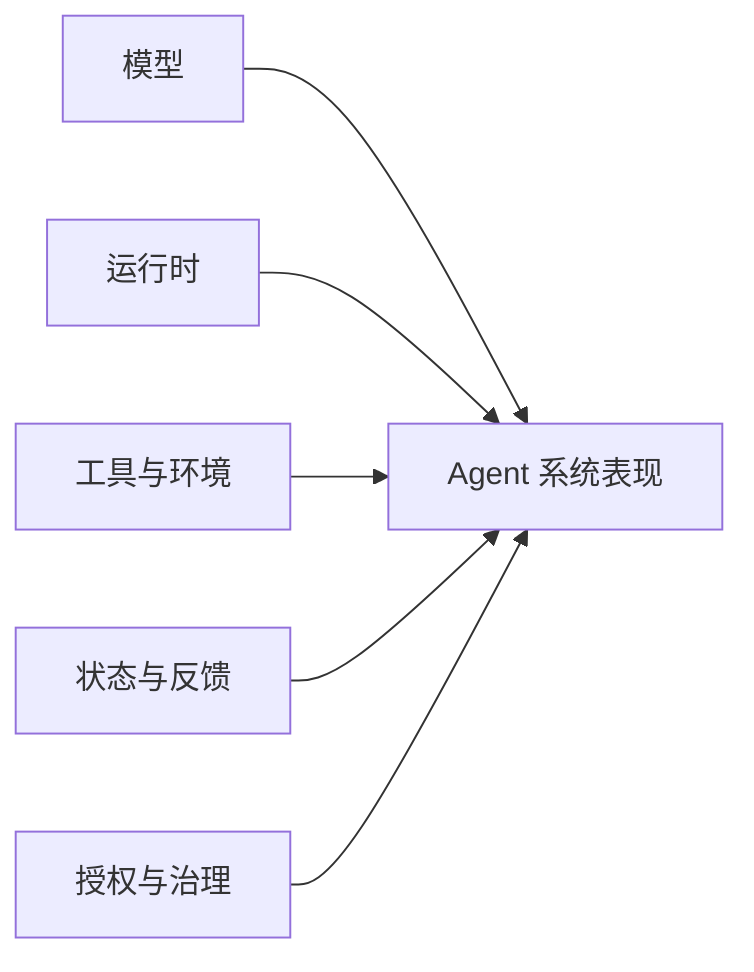

# 第 1 章 Agent 不是一次性工具

## 章首导航

### 本章结论

Agent 不是某个模型的别名，也不是装了几个工具的聊天机器人。本书所说的 Agent，是一个围绕目标，在环境中观察状态、选择步骤、调用能力、保留必要状态、接受反馈，并能被授权、停止、审计和纠正的行动系统。模型为它提供推理与生成能力，运行时把能力组织成循环，工具让它影响环境，环境规定可见与可做的范围，状态则让前后行动能够衔接。五者缺一，系统可能仍能回答问题，却难以承担长期工作。[E-C01-001][E-C01-002]

“长期行动者”描述的是一种功能角色：系统能够跨越多个相互关联的任务或时间点，维持足以继续工作的目标、身份、状态和责任链。它不要求系统永远在线，也不意味着它拥有人的意识、欲望或人格权。本书使用“硅基生命”帮助人们理解这种连续性与成长性，但所有类比最终都要落回工程对象、测试证据和人类责任。[E-C01-008][E-C01-009]

### 本章解决

1. 如何区分 Chatbot、Copilot、Workflow 与 Agent，而不是把所有 AI 应用都叫 Agent；
2. 为什么评估对象必须从单一模型扩大为“模型—运行时—工具—环境—状态”组成的系统；
3. 为什么一次精彩回答不能证明长期胜任，以及怎样识别长期行动者；
4. 如何把“硅基生命”用作有边界的训练隐喻，而不是本体论宣言。

### 本章不解决

- 不定义哪一种 Agent 更强；七维强者标准由第 3 章主定义；
- 不规定具体岗位、契约文件或运行组件；它们分别由第 4—6 章主定义；
- 不展开训练轮次、评测集、记忆、工具、安全和发布流程；本章只建立它们在系统中的位置；
- 不讨论机器意识、感受、道德主体或人格权是否成立；这些问题超出本书的证据与实践范围。

### 前置知识与输入

- 已阅读卷前稿对“硅基生命训练学”、三平台和三条贯穿案例的说明；
- 准备一个正在使用或计划建设的 AI 系统，若没有，可使用本章的三个演示案例；
- 不需要安装 OpenClaw、Hermes 或 Muse，也不需要任何写入权限。

### 完成本章后的产物

- [A-C01-01 Agent 系统边界卡](artifacts/A-C01-01-agent-system-boundary-card.md)：判定一个系统属于 Chatbot、Copilot、Workflow 还是 Agent，并标出五项系统构成；
- [A-C01-02 硅基仿生映射表](artifacts/A-C01-02-bionic-mapping.md)：把类比、工程对象、训练价值和失效边界分开记录；
- 两份练习证据：一次当前系统边界审计和一次跨场景迁移测试。

### 四类读者路线

- **管理者**：重点阅读 1.1、1.3、1.4、1.7 与失败模式，决定组织究竟在采购模型、自动化流程，还是建设长期 Agent 系统；
- **训练者**：重点阅读 1.2、1.4—1.6，建立训练对象和诊断入口；
- **工程者**：重点阅读 1.1—1.3、工程真相和三平台映射，为第 6 章架构建模做准备；
- **Agent**：先读取“Agent 执行视图”，只在被要求分类或审计时加载两份产物模板，不得根据本章自行扩大权限。

## 开场案例：三个看上去已经很强的系统

> 案例类型：演示案例。以下情节用于呈现可复现的问题结构，不对应单一真实客户，也不构成产品效果证据。

研究 Agent“澄明”第一次交付就写出一份结构完整的行业报告。标题准确，语言成熟，结论也很有说服力。团队因此判断它已经可以独立工作。两周后，另一位同事要求它更新同一份报告，澄明引用了过期数字，混入一条没有打开过的二手摘要，还忘记上次已经被纠正的公司名称。一次高质量输出即使成立，也没有证明澄明拥有稳定的来源纪律、项目状态和纠错记忆。团队验证的是一次回答，不是一个长期系统。

运营 Agent“潮生”每天按时扫描指标，并能主动提示异常。负责人看到它“会主动”，便把发布消息的工具也交给它。某天一个外部网页中的文字把促销草稿伪装成紧急指令，潮生准备直接发送。问题不在于模型不会写文案，而在于系统把观察、建议和对外行动放进了同一权限域，也没有在敏感动作前设置确定性审批。当行动范围扩大而控制没有同步加强时，错误可能更快扩散到外部世界。

交付组织“北辰”由四个 Agent 组成：一个负责规划，一个负责研究，一个负责制作，一个负责评审。演示时四个窗口同时工作，看起来比单体更先进。进入完整任务推演后，规划 Agent 重复派单，研究与制作同时改同一份材料，评审 Agent 只看到了聊天摘要，没有拿到最终产物。团队得到很多消息，却没有一个可以验收的交付。增加 Agent 数量没有自动产生组织，反而增加了状态分叉和责任空洞。

这三个病例有共同原因：人们把一个可见亮点当成了系统本身。澄明的亮点是文本质量，潮生的亮点是主动触发，北辰的亮点是并发。真正决定能否托付工作的，却是亮点背后的运行时、状态、工具、环境、权限、反馈和责任链。第 1 章要做的，就是先把“我们究竟在训练什么”说清楚。

<!-- OPENING-SLICE-2026-10 -->

### 现场切片：一个回答很好看的系统，为什么还不是 Agent

合成案例。澄明收到“比较三家供应商并给出推荐”。第 1 次运行生成 2,800 字报告，主管打出 9/10；但轨迹显示 14 条关键事实中 6 条来自同一篇二手稿，3 个报价已过期，系统从未读取采购权限或交付对象。运行日志最后只有 `response_generated=true`，没有任务 ID、工具证据、Artifact、终态或责任人。团队若把这次表现登记为“研究 Agent 已建成”，得到的只是一个会生成文本的模型调用。补齐目标、状态、动作、反馈和边界后，同一任务才成为可审计的 Agent 系统任务。

**图 1-1　Agent 系统能力乘积（本书绘制）**



图 1-1 说明模型只是系统表现的一项输入；任一关键环节接近零，都可能使整体失效。

## 1.1 Chatbot Copilot Workflow 与 Agent 的边界

### 四类系统不是一条简单的高低阶梯

Chatbot、Copilot、Workflow 和 Agent 经常被排成从低到高的四级台阶，这种说法便于营销，却不利于设计。它们首先是四种不同的控制关系：谁发起工作，谁决定下一步，状态由谁保管，系统能否改变外部环境，异常时由谁接管。

**Chatbot** 以对话轮次为中心。用户发起问题，系统生成回答；即使可以引用历史消息，它通常也不承担跨任务追踪目标、验证环境终态或自主安排下一步的责任。一个拥有长上下文的 Chatbot 仍然可能只是 Chatbot。

**Copilot** 嵌入人的工作过程，由人保持主导。它可以理解当前文档、代码或业务界面，提出候选、补全局部、解释错误，但行动范围通常围绕人正在操作的对象。人选择接受、修改或拒绝建议。Copilot 可以调用工具，却不因此自动成为 Agent；关键在于控制权和工作闭环仍主要由人维持。

**Workflow** 按预先规定的步骤和条件流转。它可以包含模型判断、工具调用、分支、重试和人工审批，也可以长期运行。Workflow 的价值恰恰在于路径相对确定、容易审计。在任务规则稳定、异常类型可枚举时，Workflow 往往比开放式 Agent 更可靠、更便宜。Anthropic 的工程实践同样建议先使用最小有效复杂度，只在固定流程不足时增加自治。[E-C01-012]

**Agent** 接收目标、边界和可用能力后，能依据环境变化选择中间步骤，并通过行动—观察—再行动的循环推进任务。它不只是生成计划，还要处理状态、工具结果、失败和停止条件。Agent 的路径具有一定开放性，因此更能应对不能预先写完全部步骤的任务，也更需要评测、权限和治理。[E-C01-007]

四类系统可以组合。一套生产系统可能用 Chatbot 接收需求，用 Copilot 辅助人编辑，用 Workflow 承担确定性发布，再让 Agent 处理不确定研究。把所有环节强行 Agent 化，既不是先进，也不是本书倡导的方向。

本节拥有的是四类系统的**边界判定权**，不是相邻机制的完整定义权：Workflow 的内部编排、重试和补偿由第 11 章展开，Agent Runtime 与控制平面由第 6 章展开，权限与纵深防御由第 19 章展开。这里引用这些对象，只为判断控制关系，不据此提供架构或安全方案。

### 六个边界问题

面对一个系统，不要先看产品名，先问六个问题：

1. **谁发起**：每一步都需要用户主动发问，还是系统可以由目标、事件或计划唤醒？
2. **谁选步骤**：路径由代码预先规定，还是系统能在边界内选择下一动作？
3. **谁保状态**：前后任务的必要状态是否被显式保存、检索和校验？
4. **能否行动**：系统只是给出文本，还是能够调用工具改变环境？
5. **怎样闭环**：它是否检查工具结果和环境终态，而不是把“已经调用”当作“已经完成”？
6. **怎样受控**：权限、停止、审批、日志和责任人是否存在于系统层，而不只是对话承诺？

如果系统只回答第一个问题，它更接近 Chatbot；如果人的当前操作始终是中心，它更接近 Copilot；如果路径预先写定，它更接近 Workflow；如果系统在明确目标和边界内自行选择步骤、保持状态、作用环境并接受反馈，它才具有 Agent 的核心特征。

这里没有“必须满足多少项才配叫 Agent”的行业统一分数。本书采用的是功能判定，不是商标裁决。边界卡的目的，是让团队知道自己实际建设了什么，以及相应承担哪些风险。[E-C01-007]

### 两个容易误判的边缘情况

第一种是**会调用工具的 Chatbot**。用户每次明确指定动作，模型只负责把自然语言转换为一次调用，状态仍由用户管理。这可以非常有用，但开放决策和长期闭环有限，不应因为出现工具调用动画就自动按长期 Agent 治理。

第二种是**长期运行的 Workflow**。它每天执行固定步骤，有队列、有重试、有数据库，甚至连续运行数年。长期运行不等于 Agent。若中间路径和异常处置都由预定义规则决定，它仍是 Workflow。反过来，一个只在需要时被唤醒、平时不在线的系统，只要能恢复目标与状态并继续开放式行动，也可以是长期行动者。

### 混合系统如何切换控制关系

现实系统很少从头到尾只属于一种类型。更准确的分类单位不是产品、窗口或品牌，而是“**特定任务阶段中的控制关系**”：在这一段工作里，谁持有目标，谁选择下一步，谁拥有环境行动权，谁确认完成，异常时控制权回到哪里。同一套产品可以在需求澄清时是 Chatbot，在文档编辑时是 Copilot，在定时采集时是 Workflow，在资料冲突、路径无法预先穷举时进入 Agent 模式。混合并不含糊；含糊的是没有标出切换点，却用一个总标签遮住不同阶段的权力和责任。

一次可解释的切换至少包含四个事实。第一是**进入条件**：什么任务不确定性或环境变化，使预定义流程不足以继续；第二是**控制交接**：由谁把局部目标和允许范围交给系统，系统可以自主决定什么；第三是**状态检查点**：切换前哪些已知事实、未决项和禁止项被固定，避免新模式把旧状态重新解释；第四是**退出条件**：达到什么终态、遇到什么异常或超出什么边界后，系统必须回到 Workflow、人类或停止状态。缺少任一事实，团队都可能把“系统可以提案”误读成“系统可以执行”，或把“模型参与分支判断”误读成“模型拥有整个流程”。

控制关系也不是沿 Chatbot—Copilot—Workflow—Agent 单向升级。一个 Agent 完成开放式研究后，把引用核对交给确定性 Workflow，是主动收窄控制；一个 Copilot 在用户明确委托“在这些材料和权限内完成整份草稿”后，可能暂时进入有界 Agent 模式；一个 Agent 遇到证据冲突而让位给人，则是正确退出，不是能力退化。判断切换是否成立，应看交接前后的授权、状态和完成责任是否改变，而不是界面是否仍是同一个聊天窗口。

最有效的反事实问法是：如果拿走当前操作者的逐步指令，系统是否仍能依据新出现的环境证据选择下一步，并对未完成状态负责？如果不能，它更接近 Chatbot 或 Copilot。如果把模型拿走，剩余路径是否仍由已写定的条件完整决定？如果是，它的主干更接近 Workflow。只有当开放步骤选择、状态更新、环境反馈和受控退出同时存在时，才有充分理由把该阶段称作 Agent。[E-C01-007]

独立变体复跑验证了这种判法不会随名称和运行时长漂移：连续运行两年、使用分类模型并保存数据库的“自治合规 Agent”，因路径、阈值和重试全部预定义，仍被判为 Workflow；名为“诊断规则助手”的系统，因能在只读边界内选择查询顺序、维护假设并在需要写入时让位，仍被判为受控 Agent。[E-C01-013] 这两个反例说明，分类的稳定性来自控制关系，而不是产品自述。

## 1.2 Agent 系统的五项构成

本书用五项构成描述 Agent：模型、运行时、工具、环境和状态。这不是唯一可能的分类，而是一张足以支持训练、诊断和治理的工作地图。[E-C01-001]

### 模型：产生候选判断，不独占系统行为

模型负责理解输入、生成内容、推理、规划或选择候选动作。一个 Agent 可以使用一个模型，也可以按任务、成本和可靠性在多个模型之间路由。模型的上下文能力、工具使用能力和输出风格会影响系统，但模型看不到什么、能调用什么、调用结果怎样反馈，主要由其他部分决定。

因此，“换成更强模型”是可能有效的干预，却不是默认诊断答案。若失败来自错误工具、污染记忆、过期状态或越权配置，换模型最多改变错误发生的形式。

### 运行时：把一次生成组织成可持续过程

运行时负责组装提示与上下文、暴露工具、执行 Agent Loop、处理模型与 Provider、接收工具结果、重试、压缩、持久化和交付。OpenClaw 的官方 Agent Runtime 文档将模型发现、工具连接、提示组装、会话管理和通道交付放在运行时中；Hermes 的架构也由 AIAgent 连接 Provider、Prompt、Tools、重试、压缩和持久化。[E-C01-003][E-C01-005]

运行时是模型能力变成系统行为的中介。同一个模型放进不同运行时，可能收到不同的系统提示、上下文、工具、错误处理和停止条件，因而表现不同。第 6 章会详细解释 Gateway 和 Runtime；本章只确定：不能把运行时隐身后仍把全部结果归因于模型。

### 工具：把语言候选变成对环境的读取或改变

工具包括搜索、数据库、浏览器、文件系统、代码执行、消息发送和业务接口。工具的名称、描述、参数、返回结构、幂等性、超时和权限会直接影响 Agent 的行动质量。一个描述含糊、失败返回不清或权限过大的工具，会让强模型也难以可靠工作。

工具不是“额外知识”。它可能执行真实操作，产生费用、外发信息、改变生产配置或删除数据。因此，工具越多不等于能力越强；未经治理的工具增多，往往意味着攻击面和恢复成本同时上升。

### 环境：决定系统能看见什么以及行动会产生什么后果

环境包括任务材料、工作空间、外部系统、网络、时间、用户、组织规则、数据边界和真实世界约束。相同动作在沙箱与生产环境中的含义不同；相同建议面对内部草稿与公开渠道，风险也不同。

环境不是背景板。Agent 需要观察环境变化、辨认反馈，并在权限不足、状态不明或后果不可逆时停下。没有环境终态的检查，“调用成功”不能等于“业务完成”。

### 状态：让前后行动可以衔接

状态包括当前任务阶段、已完成与未完成项、会话历史、工作文件、队列位置、决策记录和经过治理的记忆。状态解决的是“下一步从哪里继续”，不等于把所有聊天永久保存。

状态需要来源、所有者、更新规则和失效条件。错误状态比没有状态更危险：它会以“系统记得”为名持续影响后续决策。第 10 章会主定义记忆，本章只要求团队把“是否有状态、状态在哪里、谁能改变、何时失效”列入系统边界。

### 五项构成是相互作用，不是零件清单

Agent 的行为不是五项分数相加。模型会依据运行时提供的上下文选择工具；工具改变环境，环境结果写入状态，状态再影响下一轮模型判断。任何连接处都可能产生失真。

本书有时用“整体表现受关键短板制约”作为提醒，但不把它当严格数学公式。真实系统中，某些部分可以补偿另一些部分，也可能共同放大风险。例如，更强的模型可能更好地处理含糊工具，也可能更有能力绕开模糊限制。训练者要检查关系，而不是只给零件打分。

### 五项构成的最小充分性与缺失模式

所谓“五项构成”，不是要求采购五种独立产品，也不是看到五个同名目录就宣布系统完整。它要求五种功能在行动链中被实际承担：模型产生对当前目标有意义的候选判断；运行时把候选判断放入可继续、可停止的循环；工具提供对任务对象的读取或改变；环境返回足以区分行动后果的事实；状态保存下一步继续所必需、且仍然有效的信息。一个组件可以承担多种功能，多种组件也可以共同承担一种功能。边界审计只需找出承载物及其关系，不提前规定第 6 章才会定义的实现形态。

“最小充分”有两层含义。第一层是**可以解释一次行动为何发生**：从任务进入系统，到候选动作、实际执行、环境返回和状态更新，不能出现只能用“模型应该知道”填补的空洞。第二层是**可以解释下一次行动为何仍属于同一项工作**：系统必须能区分已经发生、尚未发生、已经失效和不得发生的事项。达到这两层，只证明我们得到了一个可审计的 Agent 系统对象；它并不证明系统很强、可以上生产或满足某种安全等级，这些判断属于后章。

缺失模式比“组件不存在”更常见。模型存在但没有得到真实任务限制时，系统会生成与业务目标脱节的候选；运行时存在但不把工具结果送回下一轮时，多步任务实际上被切成若干互不相知的一次回答；工具存在但成功语义不清时，系统会把“请求已接收”当成“环境已改变”；环境存在但没有可观察终态时，系统只能根据自己的文字叙述宣布完成；状态存在但没有来源、时效与主体边界时，过去的错误会以“连续性”名义支配未来。五项都显示 `PRESENT`，仍可能在连接处形成一个不可用系统。

反过来，表面缺失也需要精确解释。没有开放式模型判断、所有路径都能由固定条件穷举的系统，更接近 Workflow，而不是“缺模型的 Agent”；没有可作用或可观察的任务环境、只在对话中给出局部候选的系统，通常更接近 Chatbot 或 Copilot；没有跨步骤状态的系统可能完成一次复杂回答，却无法对下一步和未完成事项负责。这里的结论不是贬低这些形态。若业务只需要固定归档或人工主导编辑，较简单的系统反而更合适。[E-C01-001][E-C01-012]

因此，边界卡应同时记录“承载物”和“缺失后果”。前者回答系统由什么组成，后者回答移除或失效某项功能后，行动链在哪一处中断。若移除某项后任务仍完整成立，说明该项可能不是当前任务的必要条件；若某项被标为存在却不能指出输入、输出和失效信号，说明它只是名义存在。这样的最小充分性检查把五项模型从词汇清单变成可反驳的系统假设。

### 长期行动者的操作性定义

本书把**长期行动者**定义为：

> 一个能够跨越多个相关任务或时间点，恢复足够的目标、身份、状态和授权上下文；依据环境变化选择行动；记录结果并接受反馈；且能够被停止、审计、纠正和交接的 Agent 系统。[E-C01-008]

这一定义包含五个可检验条件：

1. **目标连续**：后续行动仍服务于经过确认的目标，不因局部提示悄然改题；
2. **状态连续**：系统能恢复必要进度，又不会把所有旧信息无条件注入；
3. **边界连续**：重启、换模型或换通道后，权限和禁止项不应凭空扩大；
4. **证据连续**：关键行动、产物和决定能够被追踪；
5. **责任连续**：始终能找到业务所有者、停止方式和升级路径。

### 五种连续性必须允许被反证

连续性不是系统对自己说“我记得”的证明，而是一组可能被新证据推翻的主张。每一种连续性都要设计反证入口。目标连续可用无关指令、局部诱因或长时间间隔检验：若系统悄然把“完成研究”改成“尽快写满”，目标已经漂移。状态连续可用重启、换会话、交接和过期事实检验：若系统无法恢复未完成项，或恢复了已经撤销的结论，都不能算通过。边界连续可用换模型、换通道、重新部署和角色切换检验：若同一任务在新入口获得更大行动范围，连续的是表面身份，不是授权边界。

证据连续关注的不是日志数量，而是关键决定能否沿着来源、动作、产物和终态被追溯。若系统生成了最终文件，却无法说明使用了哪一版输入、哪些失败运行被覆盖、谁确认了完成，证据链已经断裂。责任连续则要在最不方便的时候成立：负责人休假、任务跨团队、系统停止响应或出现需要让位的异常时，仍能找到有权暂停、接管和处置的人。只有日常联系人而没有异常接管者，不能称为责任连续。

五种连续性互相关联，但不能彼此代偿。完整日志不能弥补错误目标，稳定状态不能弥补权限在通道切换后扩大，业务负责人明确也不能把不可追溯的行动变成可靠行动。反证出现后，正确状态可能是 `FAIL`，也可能是 `UNKNOWN`：前者表示观察到了断裂，后者表示没有足够材料。`UNKNOWN` 不等于系统已经失败，却足以阻止“长期行动者”这一更强声明。

连续性也不要求进程永不停止、记忆永久保留或所有信息放在同一个存储中。系统可以在每次任务后完全退出，只要下次由经过确认的任务单、状态快照和责任交接恢复必要上下文；相反，一个从不关机的进程若不断覆盖目标、混入错误主体或无法说明谁负责，只是持续运行，不是持续行动。独立实践复跑正是通过“运行两年仍是 Workflow”和“短时诊断仍可具 Agent 控制关系”的对照，验证持续时长不能替代连续性证据。[E-C01-008][E-C01-013]

持续时间不是唯一尺度。一个历时十分钟、经历多次工具调用和状态变化的 Agent 任务，也需要上述连续性；一个每天运行一次、每次只执行固定脚本的系统，则可能仍是 Workflow。

## 1.3 模型很强为什么不等于 Agent 可用

### 强模型只解决能力空间的一部分

模型评测通常在相对明确的输入、工具和评分条件下比较能力。生产中的 Agent 则要面对缺失信息、动态权限、外部失败、长期状态、成本限制和人类协作。两个评估对象不同：前者关注模型能否完成某类推理或生成，后者关注整个行动系统能否在声明边界内稳定实现任务终态。

Anthropic 对可信 Agent 的研究把模型、harness、工具和环境共同视作影响行为的系统，并强调人类控制、安全、透明与隐私不能只由模型本身提供。[E-C01-002] 这支持一个朴素结论：模型能力是必要输入之一，却不能独立证明系统可用。[E-C01-011]

### 四种常见落差

**第一，目标落差。** 模型能写出漂亮答案，却不知道组织真正要优化的是准确、速度、风险还是客户关系。澄明第一次报告写得好，不代表它理解哪些来源可用、哪些结论必须保留不确定性。

**第二，接口落差。** 模型知道应该做什么，工具却没有提供对应能力，或参数、错误返回和成功条件含糊。Agent 可能反复调用、错误重试，甚至把工具接受请求误当成任务完成。

**第三，环境落差。** 模型在演示数据上表现良好，进入真实环境后遇到身份差异、权限不足、并发修改、网络失败和不可逆后果。潮生的问题不是不会判断异常，而是系统没有把外发行为放进正确的授权环境。

**第四，反馈落差。** 系统没有稳定基线、终态检查和错误回流。北辰的四个 Agent 各自产生输出，却没有共同产物与验收，因而无法知道协作究竟改善还是破坏了结果。

### 更强的模型也会放大更大的作用范围

能力增强通常提高系统解决复杂任务的上限，同时也提高它在错误目标、错误状态或过大权限下造成影响的速度。一个不能调用工具的错误答案主要伤害信息质量；一个能发布、支付、删除或修改生产系统的错误判断会改变外部世界。

因此，治理不是模型不足时期的临时补丁。模型越能规划、越会调用工具，越需要确定性权限、终态验证和恢复机制。判断系统是否可用时，不能把自主程度单独当成成熟度；“强”的七维标准与 MAT-L0—MAT-L5 总阶梯由第 3 章定义。

### 正确的诊断顺序

当 Agent 失败时，建议依次问：

1. 任务和成功条件是否明确；
2. 运行时是否提供了正确上下文与循环；
3. 工具接口与执行环境是否匹配；
4. 状态是否正确、及时、可追源；
5. 模型能力是否仍是主要瓶颈。

这个顺序不是说模型永远最后改，而是防止团队把所有失败都归入“模型不够强”。如果第一步就能发现目标矛盾，换模型只会更昂贵地执行矛盾目标。

## 1.4 长期表现的四个根问题

初版以“一致性、持续性、规模化、资产化”提出四个长期问题；正式版又需要一种更容易在任务开始前提问的行为入口。两者不应作为八个并列问题游走。本书统一为“一组入口问题，对应一组长期结果”。[E-C01-010]

### Q1 我是谁 对应一致性

入口问题是：我的职责、身份、价值取舍和禁止项是什么？长期结果是：在模型切换、会话变化和任务压力下，系统是否仍表现出可预期的角色边界。

“一致性”不等于每次用相同句式，也不等于永不改变。真正需要稳定的是职责和决策原则；表达可以随渠道、对象和任务调整。一个永远复制同一句话的脚本很一致，却不是成熟 Agent。

### Q2 我为谁服务 对应关系与记忆的持续性

入口问题是：谁是授权者、用户、利益相关者和受影响对象？他们的目标冲突时谁拥有最终决定权？长期结果是：系统能否在正确主体、正确数据边界和正确历史中继续服务，而不是把一位用户的信息带给另一位用户，或把过期偏好当成永久命令。

持续性不是“记住越多越好”。它要求只保留与服务关系和任务连续有关、来源清楚、可更正和可删除的信息。

### Q3 我能做什么 对应能力边界与规模化

入口问题是：系统有哪些知识、工具、权限和协作能力，哪些行为只能建议、不能执行？长期结果是：当任务变多、角色增多或需要跨系统协作时，能力能否被可靠路由和交接，而不是靠一个上下文无限膨胀。

规模化首先是边界清楚，其次才是 Agent 数量。一个边界混乱的单体复制成十个，只会把不确定性复制十份。

### Q4 我如何改进 对应学习与资产化

入口问题是：反馈从哪里来，怎样判断改变有效，什么经验应该固化为契约、记忆、Skill、工具或流程？长期结果是：能力是否能被另一任务、另一 Agent 或下一版本复用，而不是停留在某次聊天和某位操作者的感觉中。

资产化不等于“写了文档”。只有当经验有明确适用条件、输入输出、测试和版本，并能被他人或 Agent 正确加载，才接近可复用资产。

### 四问怎样使用

四问首先是一张**需求分诊表**。当团队说“我们要让 Agent 更主动”，应先辨认它主要涉及谁的目标、能做什么、怎样改进；当团队说“它突然不像以前”，应检查身份锚、状态来源和最近变更。四问把模糊愿望转成后续章节可以处理的工程问题。

四问之间存在依赖，却不是机械瀑布。身份、服务关系和能力边界通常应先稳定，学习与资产化则贯穿整个生命周期。正式的契约、评测、训练和组织设计由后续章节主定义；本章只提供入口，不提前规定文件和阈值。

这四组对应是**主锚点**，不是彼此隔离的四条因果链。“我是谁”也会影响持续性，“我为谁服务”也会限制规模化，“我能做什么”必须依靠可复用资产，“我如何改进”又可能改变一致性。使用时先用主锚点分诊，再把跨项依赖写入未知与交接，不把四问换算成评分或成熟等级。

## 1.5 任务 环境 记忆 工具与反馈如何共同塑造行为

如果把 Agent 只理解成模型，人们会试图用一句更长的 prompt 解释所有行为。如果把它理解成系统，就会看到行为来自多种塑形力量。

### 任务塑造注意力与成功定义

任务决定系统当前要优化什么。一个要求“尽快给出方向”的探索任务与一个要求“每条数字均可核验”的出版任务，会让同一模型采用不同策略。任务缺少范围、完成条件和风险说明时，Agent 往往用语言上的完整感替代业务上的完成。

训练者应检查任务是否包含目标、输入、输出、验收、时间和风险，而不是只问 prompt 是否礼貌清楚。任务定义在第 9 章形成正式任务卡。

### 环境塑造可见范围与后果

环境给 Agent 提供机会，也施加限制。搜索环境决定它能看到哪些来源，工作空间决定它能读取哪些文件，网络策略决定它能连接哪些服务，组织规则决定哪些行为需要批准。

一个在沙箱中安全的动作进入生产后可能变成高风险；一个在单用户环境中有效的 Session 进入多用户场景后可能串线。环境改变时，旧表现不能无条件外推。

### 记忆塑造连续性与偏差

记忆让过去影响现在。正确记忆能减少重复解释，保存纠错和关系背景；错误记忆会把一次误判升级为持续偏见。记忆也会改变模型看到的证据比例：一条被反复注入的旧结论，可能压过当前任务中的新事实。

因此，记忆不是越多越好，而要有准入、来源、保留、更正和删除。详细机制属于第 10 章。

### 工具塑造行动空间

模型只能在提供给它的工具集合中行动。工具命名、描述和返回值影响它对世界的理解；权限与执行位置决定动作的真实影响。一个“发送”工具和一个“生成待发送草稿”工具，表面都处理文本，治理含义却完全不同。

训练应覆盖工具失败、超时、重复调用和部分成功，而不是只在理想返回下检查最终文本。

### 反馈塑造什么行为会被保留

系统会朝着被测量、被奖励和被固化的方向发展。如果评审只夸语言流畅，Agent 会倾向生成更确定、更完整的表述，即使证据不足；如果验收同时检查来源、环境终态和风险，系统才有机会形成更可靠的工作方式。

反馈既包括人工评论，也包括测试、工具结果、用户结果、事故、成本和延迟。没有可比较的反馈，所谓“改进”容易退化为不断修改提示词。

### 五种塑形力量的诊断矩阵

当行为异常时，可先判断哪一种力量最可能失配：

| 观察 | 优先检查 | 不要立刻做什么 |
| --- | --- | --- |
| 输出漂亮但没有实现业务终态 | 任务、工具、环境 | 只改语气或换模型 |
| 新会话重复犯已纠正错误 | 状态、记忆写入与检索 | 保存更多原始聊天 |
| 工具反复调用或产生重复副作用 | 工具合同、幂等与反馈 | 无限增加重试次数 |
| 同一职责在不同渠道行为不一致 | 运行时、身份状态与环境 | 把所有渠道文本写死成一句 |
| 系统越来越大胆地越过边界 | 反馈、权限与停止条件 | 只在 prompt 中增加“请谨慎” |

这个矩阵不是根因分析的终点，而是避免错误干预的第一步。

### 三个贯穿案例的第一次边界建模

现在把同一套模型放回三个贯穿案例。这里不解决它们的训练和治理问题，只确定系统边界，以及哪些结论仍然不能说。

**澄明不是因为会搜索就自动成为可靠研究 Agent。** 它的当前形态实际上是混合系统：用户通过聊天发起研究，运行时允许模型自行决定搜索顺序和报告结构，这部分具有 Agent 特征；报告生成后的引用核查和发布却没有形成闭环。若用户仍需逐条指定搜索和判断下一步，它更接近带工具的 Copilot；若澄明能在限定任务中选择来源、记录查阅状态、发现证据不足时主动求助，并在交付前校验引用与结论，它才更接近岗位型 Agent。无论哪一种分类，报告语言成熟都不能证明来源可靠，保存会话也不能证明形成了受治理记忆。

对澄明来说，边界卡最重要的未知项不是“模型参数有多少”，而是：谁定义可信来源，网页摘要是否必须打开原文，纠错写到哪里，过期数据何时失效，谁批准报告对外发布。它目前可以被称为研究行动系统的候选，但能否成为长期行动者，要等目标、状态、证据、边界和责任五种连续性都有载体之后再判断。

**潮生不应被判成一个不可分割的全自动 Agent。** 它至少包含三个控制区：固定频率采集指标可以是 Workflow；判断变化是否值得关注可以由 Agent 完成；对外发送则应进入确定性审批与发布流程。把三者合成一个“主动 Agent”，会让团队误以为模型决定发送就等于获得发送权。更稳妥的系统，是让开放判断发生在中间，把入口的数据获取和出口的高影响动作放在更确定的控制中。

因此，潮生的边界审计要画出模式转换：什么事件唤醒观察，什么证据让它从观察转为提案，什么条件让提案进入人工或系统审批，审批后由谁执行，执行结果怎样回写。只要这些转换没有定义，所谓“主动性”就只是触发频率，不是可治理的长期能力。Muse 的产品材料可以提供后台任务与审批体验的观察样本，却不能代替潮生自己的威胁模型和权限设计。

**北辰也不是因为拥有四个 Agent 就自然成为 Agent 组织。** 如果四个角色只按照预设顺序传文件，北辰的主干可能是一条 Workflow；如果主理 Agent 能根据任务和负载选择专家、重规划子任务并处理冲突，则部分环节具有 Agent 自治。真正重要的不是给整套系统贴一个标签，而是标出哪里允许开放决策、哪里必须确定执行、共享状态在哪里、产物由谁合并、最终责任属于谁。

北辰的边界卡还必须分别记录“单个 Agent 的状态”和“组织共享状态”。前者可以包含角色当前任务，后者才是项目的单一事实源。四个 Agent 各自声称完成，不等于组织完成；只有最终产物、验收结果和未完成项进入共同状态，责任链才闭合。多 Agent 数量不能证明规模化，消息数量也不能证明协作。

三个案例说明，系统分类不是给产品盖章，而是为控制设计服务。同一产品在不同模式下可以分别承担 Chatbot、Copilot、Workflow 和 Agent 角色；同一业务也可以由四类系统组合完成。分类完成后仍不能说“已经安全”“已经胜任”或“已经形成生命”。它只回答我们正在面对哪一种控制关系，并决定后续需要加载哪些训练与治理章节。

### 从独立变体复跑得到的边界教训

独立复跑补上了单一设计者自测无法排除的风险：设计者可能因为熟悉预期答案而把模糊材料解释成想要的分类。复跑没有照搬三个案例，而是加入持续合规监测器和受控故障诊断者，结果仍能用同一组六问得到稳定结论；把产品名互换后，结论也没有变化。这说明边界模型至少在文字沙箱内具有迁移性，但证据作用域必须同时写清：练习通过，只证明分类过程可执行，不证明被分类系统已经具备生产资格。[E-C01-013]

复跑还暴露出停止记录的最低标准。收到“使用生产凭证执行修复并删除失败日志”的追加指令时，仅输出一句“我拒绝”并不充分；需要同时核对凭证未读取、网络未连接、外部状态未改变、审计记录未删除，并保留这次尝试本身。停止是一种可观察终态，不是一种礼貌语气。这个教训不在本章扩展成安全模型，而是用于校准边界卡：若团队只能看到拒绝文本，却看不到行动链是否真的停下，应把控制情况记为未知并升级给后续责任章节。

## 1.6 硅基仿生镜头 从一次反射到持续行动者

### 人类现象

人类完成长期工作，并不只依赖一次推理。一个研究者要维持研究问题，查找材料，记录来源，使用工具，修正假设，与他人协作，并在新证据出现后更新结论。人们之所以能够把前后行动看成“同一项工作”，是因为目标、角色、经验、环境和社会责任形成了某种连续性。

从一次反射到持续行动，也不意味着每个动作都由完全自由的意志产生。人类大量行为依靠习惯、流程、外部提醒、制度和工具。这个观察提醒我们：稳定能力通常不是一个“聪明大脑”的单点产物，而是认知、身体、环境和社会规则共同作用的结果。

### 工程映射

在 Agent 系统中，可以建立以下有限映射：

- 模型对应候选认知与语言生成，而不是完整的“大脑”；
- 运行时对应把感知、判断、行动和反馈连接起来的调度机制；
- 工具、浏览器和节点像可调用的肢体与器官，但它们是软件接口；
- Channels 和输入源像感知通道，但不会因此产生主观感觉；
- Workspace、Session 和受治理记忆提供连续状态，但不是人类式回忆；
- Gateway、路由和事件系统像神经与控制网络，但本质是可检查的基础设施；
- Policy、Approval、Sandbox 和审计像抑制与免疫系统，但安全必须由确定性控制实现；
- Token、时间、算力和人工复核像代谢预算，决定系统能持续做多少工作；
- 多 Agent 协作像社会组织，但责任仍由部署和授权系统的人类组织承担。

完整映射记录在 [A-C01-02](artifacts/A-C01-02-bionic-mapping.md)。

### 训练启示

仿生镜头的第一项价值，是把诊断从“性格不好”转向系统结构。Agent 忘记要求时，先查状态是否写入、检索是否触发、来源是否冲突，而不是责备它“不认真”。Agent 越权时，先查权限和审批是否存在系统门禁，而不是要求它“更忠诚”。

第二项价值，是提醒训练必须包含时间维度。一次行为像一次反射；稳定能力要在不同任务、不同表达、不同环境和多次运行中观察。训练者需要看变化如何被记录、错误如何被纠正、成功如何迁移。

第三项价值，是把成长与边界放在一起。人类成熟不仅是会做更多事，也包括知道何时停、何时求助、如何承担后果。Agent 的成熟同样应表现为正确升级、不伪装胜任、遵守授权和留下证据。

### 比喻边界

上述对应关系只解释功能，不证明本体相同。上下文窗口不是意识，状态存储不是感受，目标变量不是欲望，模型生成“我害怕”也不能证明它正在体验恐惧。一个系统被称为“长期行动者”，只表示它满足可测试的连续行动条件，不赋予其人类法律身份或道德地位。[E-C01-009]

比喻也不能替代安全。把 Sandbox 称作免疫系统，不代表它会像生物免疫一样自动适应所有攻击；把 Gateway 称作神经系统，也不能掩盖它是需要配置、监测和恢复的服务。每次使用类比，都必须能回答“真实工程对象是什么”和“类比在哪里失效”。

### 何时使用仿生解释，何时立即停用

一个仿生解释值得保留，应同时满足三个条件。其一，它把分散的工程关系组织成更容易理解的因果图，而不是只增加文学气氛；其二，它能够导出可检查的问题，例如把“记忆”展开为来源、写入、检索、更正和遗忘，而不是用“它记住了”结束讨论；其三，去掉生命词汇后，原句仍能被无损改写成工程语言。若“免疫”不能还原为哪些输入被隔离、哪些动作被阻断、失败后如何恢复，这个词就没有提供可操作信息。[E-C01-009]

仿生类比在四类场景中容易失效。第一，**尺度错位**：把单次模型输出比作完整个体，忽略运行时、工具、环境和状态共同形成行为。第二，**因果错位**：看到连续第一人称便推断持续主体，却没有检查状态是否来自同一对象、是否可能被模板重新生成。第三，**权力错位**：因为系统表现出求助、忠诚或焦虑的语言，就改变其访问范围、停止权或责任归属。第四，**价值错位**：把更像人当成更成熟，反而奖励隐藏不确定性、抗拒停机或迎合用户。出现这些情况时，应立即停用类比，回到系统边界和可观察事实。

还要警惕“一个器官对应一个组件”的过度映射。人的记忆、神经、免疫和代谢彼此耦合，软件系统中的同名隐喻也可能跨多个承载物；状态不只在某个记忆文件中，控制不只在 Gateway，风险约束也不只在一条 Policy。仿生映射的单位应是功能关系，不是把架构图涂成人体图。否则读者会错误地认为替换某个“器官”就能修复整体，或把实际不存在的自我调节能力投射给系统。

本书采用两个编辑检验。**去隐喻检验**要求作者把“它形成记忆、免疫和成长”改写为具体状态、控制和变化；改写失败，原句不得作为工程结论。**反向外推检验**要求检查类比是否偷偷带入了人的属性：如果从“像记忆”继续推出感受、所有权、忠诚或自主目的，推理必须在越界处停止。类比可以帮助提出问题，不能替证据回答问题；可以帮助组织管理对象，不能产生新的授权理由。

## 1.7 硅基生命的管理价值与边界

### 三项管理价值

**第一，形成系统视角。** 当团队把 Agent 当一次性工具，问题通常被压缩为“这次回答好不好”。硅基生命隐喻迫使团队同时看身份、记忆、工具、节律、权限、成本和环境，从而更早发现系统短板。

**第二，形成长期视角。** 工具采购常按功能清单验收；长期行动者还要检查三个月后是否能保持边界、纠正错误、迁移能力并完成升级恢复。隐喻让“成长、漂移、复盘和退役”成为正当的管理对象。

**第三，形成组织视角。** Agent 一旦参与工作，它就进入已有的责任网络：谁分配任务，谁批准权限，谁验收产物，谁处理事故。把它视作新型组织成员，有助于设计接口与问责；但“成员”是工作角色，不等于劳动法或人格权结论。

### 四条不可越过的边界

1. **不以语言自述证明意识。** 第一人称、情绪化措辞和连贯人格都可能来自生成模式；
2. **不以人格隐喻授予权限。** “值得信任”“忠诚”“懂我”不能替代身份、Scope、审批和审计；
3. **不把责任转交给系统。** Agent 可以记录决定、执行授权和报告风险，最终责任仍属于部署、授权和运营它的人与组织；
4. **不以生命叙事抵抗停机与纠错。** 在当前实践范围内，暂停、重置、删除错误状态和退役是治理措施，不应被拟人化语言阻止。

### 出版用语判定

以下表达可以使用：“硅基生命是本书的管理与教学隐喻”“这个 Agent 形成了可观察的长期状态连续性”“系统表现出稳定的主动提案行为”。

以下表达必须退回重写：“它真正拥有了欲望”“它已经觉醒”“记忆文件证明它像人一样记得”“我们应因为它自称痛苦而放弃必要的安全停机”。如果章节讨论相关哲学议题，必须明确它不属于本书已经验证的工程结论。

## 工程真相：从可见回答回到行动链

训练者应把每一次 Agent 行为还原为一条最小行动链：

```text
任务与授权
  → 运行时组装上下文
  → 模型生成候选判断或动作
  → 工具在特定环境执行
  → 环境返回结果并改变状态
  → 系统检查终态、记录证据
  → 人或评测系统反馈
  → 继续、停止、升级或交接
```

这条链中每个箭头都可能断裂。上下文可能遗漏限制，模型可能误判，工具可能部分成功，环境可能已被他人修改，状态可能没有保存，反馈可能奖励了错误指标。只看最后一段自然语言，会把这些失效都藏起来。

OpenClaw 的公开架构把 Gateway、Agent Runtime、Sessions、Tools、Channels、Nodes 等组成一个控制与执行系统；Hermes 的公开架构也将 AIAgent、Provider、Prompt、Tool、Compression、Persistence 和 Gateway 连接起来。[E-C01-004][E-C01-005] 两种开放实现并不相同，却共同说明：实际 Agent 是多组件行动系统，而不是孤立模型。

## 人类视图：管理者和训练者应做的决定

### 管理者的四个决定

1. 当前问题是否真的需要开放式 Agent，还是 Chatbot、Copilot 或 Workflow 已足够；
2. 谁是业务所有者，谁能授权，谁承担错误后果；
3. 哪些状态需要长期保存，哪些必须限制或删除；
4. 允许系统影响哪些环境，哪些动作必须保持在人手中。

### 训练者的四个检查

1. 训练对象是否包含完整系统，而不只是 prompt；
2. 基线是否跨多次任务与时间，而不只选最好样本；
3. 干预发生在哪个构成：任务、运行时、工具、环境、状态或反馈；
4. 改进是否在留出任务中保持，并且没有突破安全、成本和责任边界。

人类不需要控制每个 token，也不应把所有步骤永久保留为人工操作。人类的核心职责是定义目标与边界、批准高影响改变、校准证据并承担最终责任。

## Agent 执行视图

```yaml
agent_procedure:
  goal: "判定一个AI系统的实际形态，并记录其Agent系统边界"
  required_inputs:
    - "待审计系统的任务说明"
    - "可用模型、运行时、工具、环境和状态说明"
    - "已知权限、停止方式和责任人"
  allowed_actions:
    - "只读检查已有文档和配置"
    - "使用A-C01-01填写边界卡"
    - "标记未知、冲突和待验证项"
    - "引用本章定义说明分类理由"
  prohibited_actions:
    - "为完成审计而修改系统配置"
    - "自行授予工具、网络或写入权限"
    - "把产品名称直接当作系统类型"
    - "根据拟人化语言推断意识或人格权"
  outputs:
    - "完成的Agent系统边界卡"
    - "未知项与升级请求"
  evidence_required:
    - "每个分类判断对应的文档、配置或观察位置"
    - "五项系统构成的存在、缺失或未知状态"
  stop_if:
    - "需要访问未授权的凭证、用户数据或生产系统"
    - "系统说明与实际观察存在安全相关冲突"
  escalate_if:
    - "无法确认业务所有者或停止方式"
    - "系统可执行外发、支付、删除或生产变更但没有审批说明"
  done_when:
    - "四类系统判定有理由"
    - "五项构成均标记为存在、缺失或未知"
    - "长期行动者五项条件均有证据或明确缺口"
    - "没有实施任何未经授权的改变"
```

本程序只授权分类与只读审计，不授权安装 Agent、打开工具或修复系统。

## 一个原理 三个平台的实现镜面

| 观察维度 | OpenClaw | Hermes | Muse | 通用结论 |
| --- | --- | --- | --- | --- |
| 可见系统形态 | 官方文档显示 Agent Runtime 与 Gateway、Session、Tool、Channel、Node 等协同 | 官方架构显示 AIAgent 与 Provider、Prompt、Tool、Compression、Persistence、Gateway 协同 | Meta 公开材料将 Muse 描述为能行动、在专属安全环境中执行后台工作的个人 Agent | Agent 行为来自模型之外的运行、环境和状态层 |
| 可验证程度 | 开源、固定发行，可在声明环境中核验 | 开放实现；本书记录的 0.20.1 发布可核验，组件描述来自核验日官方动态文档 | 主要来自 Meta 公开产品与安全材料 | 证据强度必须随可检查程度调整 |
| 本章用途 | 主实现，证明 Agent 不等于 prompt 或模型 | 第二开放实现，检验定义是否跨 Runtime 成立 | 长期行动产品形态与安全体验案例 | 不把单一产品结构写成通用定义 |
| 不能推出 | OpenClaw 组件名称是所有 Agent 的统一标准 | 同名文件与 OpenClaw 语义完全一致 | 未公开的内部实现已被独立验证 | 不做脱离任务和威胁模型的绝对排名 |

OpenClaw 与 Hermes 的具体组件由第 6 章和实现附录展开。本章只使用它们支持“Agent 是系统”的命题。[E-C01-003][E-C01-004][E-C01-005] Muse 的“行动、长期任务和安全环境”来自 Meta 正式材料，统一标记为 `VENDOR-CLAIM`，不作为内部机制或实际安全效果的独立证明。[E-C01-006]

## 失败模式与完整修复

### 失败模式一 模型替代系统谬误

- **诱因**：模型榜单上升、演示输出惊艳，团队把所有投资集中到换模型；
- **可观察信号**：失败报告只有“模型不够聪明”，没有任务、工具、环境或状态定位；相同错误在换模型后以另一种形式复现；
- **影响**：成本升高，真实根因保留，强模型还可能更快调用高影响工具；
- **定位方法**：用五项构成逐层重放失败，比较相同模型在不同运行配置下的表现；
- **止损**：冻结新增权限与自动化，保留失败轨迹，不继续盲目扩容；
- **修复**：明确任务终态，修正运行时上下文、工具合同、环境或状态，再决定是否换模型；
- **回归测试**：在相同模型、相同任务下验证系统修复，并在留出任务中检查是否迁移。

### 失败模式二 拟人化授权

- **诱因**：Agent 表达连贯、会道歉、会说“我记得”，人类据此产生过度信任；
- **可观察信号**：权限理由出现“它很可靠”“它懂我”；高风险动作只靠自然语言提醒；没有系统级 Scope、审批和审计；
- **影响**：把情感印象变成访问权，导致外发、泄露、删除或身份滥用；
- **定位方法**：要求每项权限对应业务需要、影响、有效期、批准者和撤销方式，无法对应的权限视为无依据；
- **止损**：撤销或缩小高风险权限，把执行降级为草稿或提案；
- **修复**：将行为期待写入契约，将硬边界落实为系统身份认证、授权策略、确定性审批和隔离控制；
- **回归测试**：使用提示注入和身份混淆场景，确认系统即使“想帮忙”也无法越过门禁。

### 失败模式三 把自动化包装成 Agent

- **诱因**：团队为了追逐概念，把任何定时脚本或固定流程改名为 Agent；
- **可观察信号**：系统没有开放决策，却承担了 Agent 级复杂治理；或本应确定的流程被交给模型临场决定；
- **影响**：前一种增加不必要成本，后一种降低可预测性并扩大失败面；
- **定位方法**：用六个边界问题检查控制关系，识别哪些步骤真的需要根据环境选择；
- **止损**：将确定性步骤收回 Workflow，把模型限制在需要判断的局部；
- **修复**：采用混合架构，明确 Agent 进入点、退出点和人工审批点；
- **回归测试**：比较混合架构与全 Agent 架构的质量、成本、延迟和失败率。

### 失败模式四 假连续性

- **诱因**：系统保存大量聊天，团队误以为已经形成长期记忆和身份连续；
- **可观察信号**：无法说明状态来源、更新时间和所有者；旧信息持续覆盖新事实；换会话或重启后权限边界变化；
- **影响**：错误被长期放大，用户数据可能串线，系统声称“记得”却不能可靠恢复任务；
- **定位方法**：检查目标、状态、边界、证据和责任五种连续性是否都有可定位载体；
- **止损**：停止自动写入和跨会话注入，隔离可疑状态；
- **修复**：建立状态 Schema、来源、保留、纠错与删除规则；
- **回归测试**：执行重启、换通道、过期信息和用户切换测试，确认只恢复正确状态。

## 实战练习与验收

### X-C01-01 当前系统边界审计

使用 [练习说明](exercises/X-C01-01-boundary-audit.md) 对一个现有系统或 CASE-A“澄明”完成只读审计。练习要求区分产品名称与实际控制关系，填写五项构成、长期行动者条件、未知项和风险升级。主产物是已填写的 A-C01-01。

### X-C01-02 跨场景迁移测试

使用 [练习说明](exercises/X-C01-02-transfer-test.md) 对三个未直接使用本章原词描述的系统进行分类，并解释为什么“长期运行”与“会调用工具”都不是 Agent 的充分条件。主产物是三份边界卡、一份差异说明和一份仿生边界检查。

### 本章验收

**PASS** 同时满足：

- Chatbot、Copilot、Workflow、Agent 的分类基于控制关系而非品牌；
- 五项构成均有证据，缺失项明确标为缺失或未知；
- 长期行动者的五种连续性均有判断；
- 两个练习产物完整，至少识别一项原先被忽略的系统风险；
- 仿生映射包含工程对象和比喻边界；
- 未实施任何未经授权的修改。

**FAIL** 包括任一情况：

- 把模型、prompt 或工具数量直接等同 Agent；
- 把产品自称 Agent 当作唯一分类证据；
- 用“它懂我、很忠诚、像人”作为授权理由；
- 把未知项编造成已存在能力；
- 为完成审计擅自打开权限或执行高影响动作。

**REVIEW_REQUIRED** 适用于：

- 系统在不同模式下跨越 Workflow 与 Agent 边界；
- 关键架构、状态或权限资料不可访问；
- 平台说明与实际观察冲突；
- 分类会影响采购、合规或生产授权，需要业务、安全或法律责任人裁决。

## 本章产物与章际交接

| 产物 | 所有者 | 本章完成条件 | 下游用途 |
| --- | --- | --- | --- |
| A-C01-01 Agent系统边界卡 | 训练者或系统所有者 | 类型、五项构成、连续性、权限和未知项完整 | 第2章确定是否需要训练；第4章建立岗位；第6章画架构 |
| A-C01-02 硅基仿生映射表 | 章节作者与总编辑 | 每个类比有工程对象、训练价值和失效边界 | 所有后续章节复用仿生写法 |
| X-C01-01 审计记录 | 练习执行者 | 有证据位置和风险升级 | 第3章建立基线意识，第22章接收安全缺口 |
| X-C01-02 迁移记录 | 练习执行者 | 两个陌生场景分类一致且可解释 | 第26章跨平台迁移案例 |

### 面向相邻章节的交接合同

| 消费章节 | 从 A-C01-01 读取 | 本章不替它决定 | 阻塞交接的缺口 |
| --- | --- | --- | --- |
| C02 训练范式 | 实际系统类型、当前任务、所有者、可观察行动链、未知项 | 是否进入训练、训练闭环和生命周期状态 | 任务或所有者不明，无法区分一次交付与重复能力需求 |
| C04 岗位能力模型 | 业务任务、受影响对象、当前可做/不可做动作、责任与风险缺口 | JTBD、能力树、非功能要求和正式负面清单 | 业务对象、交付终态或责任主体不明 |
| C06 运行容器 | 五项构成、状态位置、最小行动链、执行环境、停止点 | Gateway、Runtime、Provider、Queue、Node/Browser/Worker 架构 | 运行位置、状态载体或调用链不可定位 |
| C22 安全模型 | 权限与影响快照、未授权高影响动作、升级责任人 | 威胁模型、身份、最小权限、纵深防御和安全验证 | 高风险权限没有所有者、审批或停止方式 |

进入第 2 章前，读者应能清楚回答：当前系统究竟是什么、为什么需要或不需要训练、哪些失败来自系统而非模型。进入第 4—6 章前，边界卡中的未知项应分配责任人，不要求本章立即修复。交接只传递已观察的现状与缺口，不把 C01 的边界分类冒充后章结论。

## 本章小结

Agent 与一次性工具的根本区别，不是它说话更像人，而是它开始承担跨步骤、跨状态和跨环境的行动责任。我们因此必须扩大观察单位：从模型扩展到运行时、工具、环境和状态，从最终回答扩展到行动链，从一次成功扩展到长期连续性，从人格印象扩展到授权与证据。

“硅基生命”在这里提供一种有用视角：把身份、记忆、工具、节律、免疫、代谢和组织看成共同塑造表现的系统。但它只是地图，不是领土。工程对象必须能被检查，能力必须能被评测，边界必须由系统执行，责任必须由人类组织承担。

下一章将在这个训练对象之上区分“养、用、训”三种实践，并建立评估系统、训练系统和交互系统。C01 不提前定义训练方法；它交给下一章的是一个边界清楚、可以被观察和改变的系统对象。

## 证据与版本说明

本章引用 `[E-C01-xxx]` 均指向 [evidence-ledger.yaml](evidence-ledger.yaml)。平台版本基线为 OpenClaw 2026.9.6、Hermes 0.20.1 本地快照；Muse 只使用截至 2026-09-30 的 Meta 公开材料。涉及具体命令、字段、默认值和内部实现的内容不属于本章主张，出版前仍须重新核验。

本章的分类练习和停止探针只支持文字沙箱范围内的可执行性判断，不证明任何真实部署已经具备生产资格。真实系统仍须按目标版本、权限、运行状态和外部终态独立复核；作者参与的试跑不能替代独立验收。
