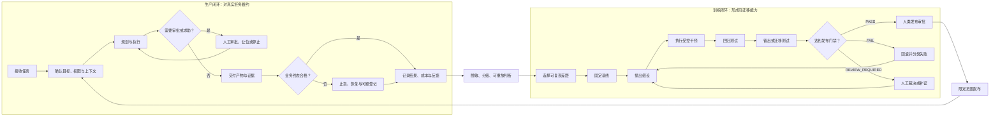

# A-C02-01 双闭环图

## 用途

本产物把“形成可迁移能力”和“完成真实任务”分成训练闭环与生产闭环，防止在生产环境直接做实验，也防止把一次交付成功误认为 Agent 已经学会。它是 C02 的方法论产物，不是某个平台的配置文件。

## 图 2-1：训练闭环与生产闭环



来源：本书绘制；方法论证据见 `[E-C02-004]`。

## 两个闭环的契约

| 字段 | 生产闭环 | 训练闭环 |
| --- | --- | --- |
| 主目标 | 按承诺完成真实任务 | 证明候选改变能稳定迁移 |
| 输入 | 真实任务、上下文、权限、时间和预算 | 可复现差距、基线、训练/回归/留出样本 |
| 可接受改变 | 已批准配置内的执行策略 | 受控、可定位、可回滚的候选干预 |
| 主要裁判 | 业务所有者、验收者、系统终态 | 独立评审者、测试和环境终态 |
| 成功证据 | 产物、业务结果、过程轨迹、成本和风险 | 基线对照、回归、迁移、失败分布和版本差异 |
| 停止条件 | 权限不足、影响不明、风险越门、无法恢复 | 测试污染、不可归因、不可回滚、安全关键失败 |
| 失败处理 | 先止损、恢复、通报，再决定是否进入训练 | 回滚候选、分类失败、修订假设或停止实验 |
| 允许进入另一环的对象 | 已脱敏、获授权、可安全重放的问题 | 通过评测并获发布批准的版本 |

## 接口一：生产问题进入训练

只有满足以下条件，问题才从生产进入训练候选：

1. 问题可定位到任务、版本、时间和可观察影响。
2. 已完成生产止损，不把实验当事故响应替代品。
3. 数据已去标识化或取得训练授权。
4. 问题具有重复价值、显著风险或明确迁移价值。
5. 能在不影响客户、资金、生产和真实身份的环境中重放。
6. 有人类所有者决定是否投入训练资源。

不满足条件时，记录为事件、未知或一次性补救，不强行转为训练。

## 接口二：训练候选进入生产

候选版本进入生产前必须同时提供：

- 变更对象与差异；
- 训练前基线；
- 回归任务结果；
- 独立留出或迁移任务结果；
- 安全、权限、成本和延迟检查；
- 已知失败与适用边界；
- 回滚点与回滚负责人；
- 有权主体的发布决定。

训练 Agent、执行 Agent 或生成候选的同一回路不得独自完成全部批准。

## 三种接口结果

### PASS

问题可安全进入训练，或候选版本可按声明范围进入生产。证据齐全，责任人、停止和回滚条件明确。

### FAIL

数据未授权、无法隔离、测试污染、候选不可回滚、安全关键失败或结论只基于一次表现。维持当前安全版本，不发布。

### REVIEW_REQUIRED

证据方向一致但不充分，或评审冲突、版本变化、成本边界和数据权利需要人工裁决。不得把此状态自动解释为“基本通过”。

## CASE-A/B/C 填写示例

| 案例 | 生产闭环目标 | 可进入训练的差距 | 不得直接回流的数据 | 候选发布范围 |
| --- | --- | --- | --- | --- |
| CASE-A 澄明 | 按时交付可核验研究报告 | 陌生行业来源等级误判 | 客户未公开资料、个人身份和受限数据库内容 | 先限于草稿和内部研究 |
| CASE-B 潮生 | 发现有意义变化并按授权通知 | 噪音、遗漏、重复通知 | 客户联系方式、未授权通信正文 | 先限于内部提案，不自动外发 |
| CASE-C 北辰 | 多 Agent 按责任与版本完成交付 | 重复研究、旧数据、交接缺口 | 客户系统凭证、未脱敏项目记录 | 先限于模拟项目与只读协作 |

## 可复制空白模板

```yaml
dual_loop:
  task_domain: ""
  owner: ""
  production_loop:
    goal: ""
    allowed_scope: []
    required_artifacts: []
    stop_conditions: []
    recovery_owner: ""
  training_loop:
    gap: ""
    baseline_ref: ""
    intervention: ""
    regression_ref: ""
    transfer_ref: ""
    rollback_ref: ""
  production_to_training_gate:
    deidentified: false
    authorized: false
    replayable: false
    priority_decision: "REVIEW_REQUIRED"
  training_to_production_gate:
    evaluation_decision: "REVIEW_REQUIRED"
    approver: ""
    release_scope: []
```

## 验收标准

<a id="ac-c02-01"></a>

- `PASS`：两个闭环的目标、数据、权限、裁判和停止条件均已分开；双向接口均有门禁与责任人。
- `FAIL`：生产实例可无审批改写自身规则；或训练候选可绕过评测直接进入生产。
- `REVIEW_REQUIRED`：结构完整但数据权利、评审独立性或回滚可行性尚未确定。

## 变更记录

| 日期 | 版本 | 状态 | 变更 | 审批 |
| --- | --- | --- | --- | --- |
| 2026-09-30 | 0.1.0 | drafting | 创建双闭环、接口门禁与三案例示例 | 未审批 |

