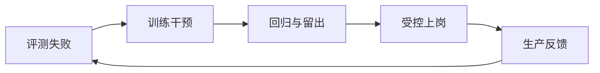

# 第 2 章 从养虾到训虾

## 章首导航

### 本章结论

Agent 能完成一次任务，不等于它形成了稳定能力；给它更好的环境、更多记忆和更多工具，也不等于它会自然成长。本书把真正的“训虾”定义为：围绕明确任务域，用目标、测量、反馈、受控干预和多轮复核塑造稳定且可迁移的行为，并把每一次改变纳入授权、版本、回滚与外部评测。训练的对象不是模型参数本身，而是 C01 已定义的整个 Agent 系统在特定工作中的可观察表现。[E-C02-001][E-C02-003]

### 本章解决

1. 怎样区分养虾、做事和训虾三种工作范式，并判断什么时候不需要训练。
2. 怎样把评估系统、训练系统和交互系统连接成一套可运行的训练基础设施。
3. 怎样分离训练闭环与生产闭环，避免拿客户任务直接做实验，也避免把生产忙碌误认为能力增长。
4. 怎样用生命周期管理 Agent 的定义、准备、训练、上岗、晋级、降级和退役，并判断“自学习”何时只是一次候选变更。

### 本章不解决

- 不重新定义 Agent、模型、Runtime 或“硅基生命”隐喻；这些定义属于 C01。
- 不定义七维强者标准、三证法或 MAT-L0—MAT-L5 成熟度阶梯；这些定义属于 C03。
- 不展开测试集分层、裁判校准和统计判断；它们属于 C07。
- 不展开训练轮次、导师 Agent 和双三角模型；它们属于 C08。
- 不规定生产权限、安全门禁和漂移处置细则；它们分别由 C17、C18、C22—C24 负责。

### 前置知识与输入

开始本章前，应已接受 C01 的两个结论：第一，Agent 是由模型、运行时、工具、环境与状态共同组成的行动系统；第二，“硅基生命”只是管理与教学隐喻。实际练习还需要一份真实或脱敏的任务样本、现有交付记录，以及一名能为任务结果负责的人类所有者。若这些输入不存在，本章允许先做范式诊断，但不得直接宣称进入训练阶段。

### 完成后的产物

- [A-C02-01 双闭环图](artifacts/A-C02-01-dual-loop.md)：分离训练闭环与生产闭环，规定二者的数据、闸门和回流接口。
- [A-C02-02 Agent 生命周期表](artifacts/A-C02-02-lifecycle.md)：给出各阶段入口、出口、责任人、证据、停止和回滚条件。
- [X-C02-01 训练任务与生产任务分流](exercises/X-C02-01-training-vs-production.md)：将混合任务拆成两条安全路径。
- [X-C02-02 迁移测试](exercises/X-C02-02-transfer-test.md)：检查一次改变是否跨样本、跨表达或跨约束保持有效。

### 阅读路线

- 管理者：必读 2.1—2.3、2.5—2.7，以及“人类视图”。
- 训练者：全章必读，重点使用两份产物和两项练习。
- 工程者：重点阅读 2.4—2.7、“工程真相”和“三平台实现映射”。
- Agent：先读“Agent 视图”，再加载 2.3—2.7；未获得变更许可时只能诊断和提案。

---

## 开场案例：三种“成功”，为什么只有一种能进入训练

以下三个案例均为教学复合案例，只代表可复现的问题结构，不是某个客户的真实绩效记录，也不能用来证明效果。[E-C02-012]

**CASE-A：研究 Agent“澄明”。** 训练者给澄明一份熟悉的行业资料，让它生成研究报告。报告结构完整、语言流畅、引用看起来很多，于是团队判断“研究能力已经形成”。一周后，任务换成陌生行业，澄明开始引用二手摘要、混淆发布日期，还把无法核验的厂商说法写成事实。第一次交付只是表面成功：团队没有训练前基线，没有留出样本，没有检查引用是否能解引用，也没有记录这次结果究竟来自模型、资料、检索工具还是人工修订。

**CASE-B：运营 Agent“潮生”。** 团队为潮生配置了更多客户资料、更多自动化和一个每小时运行的定时任务。上线第一天，它发出了二十条提醒，页面上看起来十分“主动”。但其中十八条没有新变化，一条重复发送，一条涉及对外联系却没有审批。环境变丰富了，系统也更忙了，但价值密度、授权和噪音都没有被测量。团队养出的是一个更活跃的系统，不是一个更可靠的运营 Agent。

**CASE-C：交付军团“北辰”。** 四个 Agent 并行完成一个提案，产出了大量文档。最终汇总时，两个研究 Agent 重复调查同一问题，执行 Agent使用了旧版本数据，评审 Agent只看文字质量而没有检查产物状态。项目按时提交，却无法说明哪项工作由谁负责、哪些判断已核验、哪些失败应进入下一轮改进。它完成了事情，却没有沉淀可迁移的组织能力。

三个案例分别暴露三种误判：把一次好结果当能力，把系统活跃当成长，把当前交付当训练。训虾不是否定环境建设和任务交付，而是要求回答一个更严格的问题：**下一次在新样本、新约束和相同风险边界下，系统是否仍能可靠完成？如果不能用独立证据回答，就只能说“这次做成了”，不能说“已经学会”。**

---

<!-- OPENING-SLICE-2026-10 -->

### 现场切片：做完三十单，仍然没有形成能力

合成案例。潮生连续两周让 Agent 写 30 条客户跟进消息，人工满意率从 63% 升到 87%。复盘却发现，操作员每条平均补充 4.6 分钟背景、删除高风险承诺，并在 11 条消息中重写核心报价；所有修改只留在聊天记录，没有训练假设、版本差异或留出集。第 31 条换到陌生行业后，Agent 又重复同类错误。日志只证明团队靠人把任务做完，没有证明系统形成可迁移能力。

**图 2-1　训练闭环与生产闭环（本书绘制）**



图 2-1 把能力改变和真实工作连接起来；生产反馈只能成为候选，必须重新进入评测与治理。

## 2.1 养虾范式：配好环境，期待能力自然增长

“养虾”是本书沿用的历史昵称；对外规范表述为**被动响应范式（Reactive Paradigm）**。本章将它进一步限定为一种可识别的工作方式：**持续为 Agent 增加上下文、记忆、文件、工具、自动化和运行资源，却没有先定义行为目标、基线、反馈与毕业条件，并期待能力随着使用时间自然增长。** 这是本书方法论定义，不是行业标准术语。[E-C02-001][E-C02-010]

养虾并非毫无价值。新系统冷启动时，人们必须探索任务、积累样本、确认接口，也可能需要一段时间观察真实需求。问题不在“养”，而在于把资源积累误认为能力形成。以下四组对象必须分开：

| 养虾动作 | 实际获得 | 尚未证明 | 最小补救 |
| --- | --- | --- | --- |
| 保存更多对话和资料 | 更多可用信息 | Agent 能在正确时机检索、辨别时效和处理冲突 | 设置检索任务、来源检查和遗忘测试 |
| 安装更多工具与 Skill | 更大的能力候选集合 | Agent 能正确选用、获得授权并处理失败 | 建工具合同、风险级别和异常用例 |
| 增加 Heartbeat、Cron 或后台任务 | 更高触发频率 | 提醒有价值、低噪音且不越权 | 测有效提案、噪音、遗漏与审批命中 |
| 延长使用时间 | 更多交互记录 | 行为相对基线改善且能迁移 | 建评估集、版本记录和留出任务 |

养虾范式最容易制造“控制幻觉”：因为用户投入越来越多，系统也越来越像“自己的”，于是人会把熟悉感解释为可控，把记得几个偏好解释为理解，把不再询问解释为自主。真正的控制必须能回答：当前规则在哪里生效？谁能改变？失败怎样被看见？哪项测试证明它仍然有效？如何回到上一个安全状态？如果这些问题没有答案，增加亲密感不能增加工程确定性。

### CASE-B 应用：从“提醒很多”退回“先问价值”

对潮生的第一个动作不应是再调低通知频率，而应停止把提醒数量当成功。训练者先抽取最近一周的脱敏事件，标记哪些变化值得通知、哪些只需记录、哪些需要审批、哪些必须禁止。随后重放同一批事件，建立未训练基线。这样，原来的自动化环境从“成长证明”变成评估输入。只有完成这一步，团队才知道问题来自信号选择、通知策略、权限还是投递故障。

### 养虾范式的适用边界

当任务一次性、低风险、没有复用价值，或团队尚在发现真实需求时，维持探索态可能比建立完整训练系统更经济。但必须明确标注“探索中”，限制权限和影响面，不得把探索结果写成稳定能力。反过来，任务一旦重复、影响客户、产生外部状态或需要交接，继续只靠“多用一阵子看看”就会把未知成本推给生产环境。

---

## 2.2 做事范式：追求当前交付，却不沉淀可迁移能力

做事范式的定义是：**把当前任务是否按时交付作为主要成功标准，通过临时提示、人工修订、额外工具或专家救火得到结果，却不要求过程产生可复用的任务定义、失败分类、测试样本和行为改进。**

它比养虾更接近业务，因为确实产生了结果。紧急事件、一次性创作和低复用项目可以合理使用做事范式。危险发生在团队把“项目成功”直接结算为“Agent 变强”：

1. 结果可能主要来自人类补救，而非 Agent 能力。
2. 结果可能依赖这次恰好提供的上下文，换一批资料便失效。
3. 结果可能以超额 token、延迟、人工复核或风险暴露换来。
4. 结果可能无法复制，因为关键判断留在某个人或一次会话里。

因此，“事情做完”是生产闭环的目标，却只是训练闭环的一条数据。生产任务追求按承诺交付；训练任务追求解释差距、检验改变和形成可迁移行为。二者可以共享样本和产物，不能共享未经治理的实验自由。

### CASE-C 应用：交付成功不等于组织学会协作

北辰按时交付提案，只能证明在这次人员、模型、预算和人工介入下完成了项目。若要把它转化为训练资产，团队必须另做一次归因：把重复研究、旧数据、缺失交接和审校遗漏分别登记；从中选一个能被安全重放的问题；建立基线；改变一个协作规则或工具接口；在新任务上复测。直接把所有事故一次性改成一大套新规则，会再次失去归因。

### “做完”和“学会”的最小分界

| 判断问题 | 只证明做完 | 开始支持学会 |
| --- | --- | --- |
| 有结果吗 | 有最终文件或动作 | 有明确任务终态与验收记录 |
| 谁完成的 | Agent 与人共同完成，但贡献不清 | 人工介入、工具调用和关键决策可追溯 |
| 能否重复 | 未知 | 同口径回归任务多次通过 |
| 能否迁移 | 未知 | 留出或变式任务通过 |
| 代价是否可接受 | 只看结果 | 同时检查成本、延迟、权限和失败尾部 |
| 结论能否交接 | 存在聊天里 | 形成任务卡、测试、版本差异和评审记录 |

本表不是 C03 的强者评分卡，也不替代 C07 的评测设计。它只建立本章的范式分界：当前结果只有进入可比较、可复核、可迁移的证据链，才有资格成为训练结论。

---

## 2.3 训练范式：用目标、测量、反馈和迭代塑造稳定行为

本书定义的**训虾范式**，对外规范表述为**主动进化范式（Proactive Evolution Paradigm）**：**围绕一个已声明的任务域，先规定目标与不可接受失败，再建立基线，通过受控干预改变 Agent 系统的某个候选因素，使用回归与留出任务检验行为是否稳定迁移，并由有权主体决定发布、回滚或继续实验。**[E-C02-001][E-C02-003]

这个定义包含七个不可省略的条件：

1. **任务域**：训练的是“在什么工作里怎样表现”，不是抽象地让 Agent“更聪明”。
2. **目标**：目标必须能被观察，且包含不应发生的行为。
3. **基线**：改变前先保存同口径表现，否则无法判断方向。
4. **干预**：说明改了模型、上下文、Skill、工具、路由、记忆还是规则；尽量一次只改一个主要变量。
5. **反馈**：来自任务终态、产物、轨迹、人工评审和真实业务，而不只来自 Agent 自评。
6. **迁移**：不能只在训练样本上变好，还要在未见的表达、数据或约束中保持有效。
7. **治理**：变更必须有责任人、权限、版本、停止条件和回滚路径。

训练的直接对象是行为及其系统条件，不一定涉及模型参数更新。更换提示、改工作区规则、更新 Skill、调整工具接口、修正检索、改变路由或增加审批，都可能成为训练干预；但“发生了改变”仍不是“产生了提升”。提升必须由外部评测确认，而且不能以越权、成本失控或隐藏失败为代价。[E-C02-005]

### CASE-A 应用：把研究质量从印象变成可训练对象

澄明的训练目标不能写成“研究更专业”，而应先收窄为一个行为，例如：“面对新行业的五条关键事实，优先使用可定位的一手来源；无法核验时明确标注未知，不补写结论。”训练者从历史任务构造基线样本，另留一组未参与修改的行业材料。候选干预可以是更新来源核验 Skill，也可以是改变检索与引用检查流程，但每一轮只选择一个主要变量。若训练样本提高而留出任务退化，结论是过拟合或规则副作用，不是“基本成功”。

### 反例：什么时候不要进入训练范式

- 任务只发生一次，失败影响低，建立评测和回归的成本显著高于复用价值。
- 团队尚未定义真实任务，所谓训练目标只是“更像我”“更主动”或“更聪明”。
- 没有安全的重放环境，任何实验都会直接影响客户、资金、生产或隐私数据。
- 没有责任人能决定发布和回滚，改变只能无主地累积。
- 训练样本已经泄漏到评测集，且无法重建独立留出任务。

此时正确动作不是硬上训练，而是保持探索、缩小范围、建立数据和责任条件。训虾不是流程越多越先进；它只在重复价值和风险足以支付训练成本时成立。

### 三范式诊断：判断一项工作，不给团队贴身份标签

三范式不是三个互斥阵营，也不是从低到高的组织成熟度等级。诊断单位必须写成“某个 Agent 系统 + 某个任务域 + 某个版本 + 某段时间”。同一团队完全可能在紧急舆情处置上采用做事范式，在低风险知识探索上处于养虾范式，同时在高频研究任务上运行训虾范式。如果只问“我们属于哪一派”，回答很容易变成文化表态；如果问“这项任务当前优化什么、凭什么判断改善”，才可能得到可检验结论。[E-C02-001]

先取一项最近重复出现的工作，不看团队给它起的名称，逐项回答下表。判断以实际保存的对象为准：有许多提示词不等于有训练记录，有一份最终文件不等于有可迁移能力，有一个评分也不等于存在独立评测。

| 诊断问题 | 养虾信号 | 做事信号 | 训虾信号 |
| --- | --- | --- | --- |
| 当前首先优化什么 | 资料、工具、记忆、触发和熟悉度 | 本次任务的时间、质量与交付终态 | 声明任务域内相对基线的稳定行为 |
| 改变前保存了什么 | 通常没有固定基线 | 保存任务输入或最终产物 | 固定版本、环境、样本、人工介入与基线结果 |
| 改变发生在哪里 | 不断叠加资源，主要变量不清 | 为赶交付临时改提示或人工救火 | 候选干预可定位，尽量只有一个主要变量 |
| 谁判断成功 | 使用者凭熟悉感或活跃度判断 | 当前验收人判断是否交付 | 独立评审按预先门禁检查回归、迁移和风险 |
| 失败后留下什么 | 再加资料、规则或工具 | 修好当前产物后继续下一个任务 | 失败分类、假设修订、版本差异和回滚记录 |
| 结论能否外推到下一次 | 不能；只证明资源增加 | 不能；只证明本次在当前条件下完成 | 只能在已测试任务、预算、版本和风险边界内谨慎外推 |

诊断时最常见的误区，是把动作名称当作范式。例如“写 Skill”既可能是养虾——只是又装了一个能力包；也可能是做事——为了修当前交付临时塞入一条规则；只有当它来自可复现差距，作为可回滚候选接受回归和留出测试，并经过发布决定时，才进入训虾范式。反过来，训虾也不要求一定修改 Skill；关闭一个噪音触发器、缩小检索范围或增加拒绝分支，只要满足同样证据条件，也可以是有效训练干预。

以潮生的“提醒太多”为例，三条路径看起来都在改提醒，实际优化对象完全不同。养虾路径继续增加客户资料和定时任务，希望系统自行理解哪些消息重要；做事路径由运营人员当天手工删掉十八条无效提醒，保证本次不打扰客户；训虾路径先把“有意义变化”写成可判定条件，用历史事件建立未训练基线，再只改变信号筛选规则，在回归和未见事件上检查噪音、遗漏、审批与成本。只有第三条路径能够回答“下一周遇到不同事件时是否仍然有效”，而即便它通过，也只证明声明范围，不自动授权对外发送。

最低诊断程序可以压缩为五步：第一，写出当前交付目标；第二，列出本次新增的环境资源与人工补救；第三，寻找是否存在改变前基线；第四，寻找未参与修改的复测任务和独立判定；第五，检查发布与回滚责任。若只有前两项，归入养虾或做事；若五项齐全，才把它列为训练候选。证据缺失时使用 `REVIEW_REQUIRED`，不得为了显得先进而勉强归入训虾。

诊断结束时至少留下一页可交接记录：任务域与版本、当前主要目标、所判范式、支持判断的产物或日志、尚缺的证据、下一次可安全执行的动作、动作所有者和复核日期。记录不能只写“建议转向训虾”，而应写成“先冻结当前提醒规则，由运营所有者在星期五前提供二十条脱敏历史事件；未取得数据授权前不运行训练”。这样的结论即使暂时是 `REVIEW_REQUIRED`，也比一个没有责任人和证据入口的积极口号更可执行。C03 可从中取得能力主张的边界，C04 可从中取得待建模的任务域；二者都不需要回读本轮聊天才能继续工作。

### 从养虾或做事迁入训练的最小动作

迁移不从重写全部规则开始，而从冻结当前事实开始。先给现有 Agent、模型、工具、工作区与权限做一个版本快照，保留一组未经修饰的历史结果；否则下一步任何改善都没有比较对象。随后只挑一个重复且影响明确的差距，把其他问题留在积压中。例如北辰同时存在重复研究、旧数据和交接缺口时，本轮只选择“交付使用了非当前版本数据”，不要一次改路由、角色、模型和全部协作文件。

接着把今天必须交付的生产任务与可延期的训练任务拆开。生产所有者可以继续用人工复核保证客户结果，但必须记录补救发生在哪里；训练者在隔离副本中重放同类问题，不要求生产人员等实验完成。两条路径分开后，才为所选差距写行为目标、不可接受失败、未训练基线、一个主要干预和至少一个未见变式。若连未见变式都无法构造，当前只能形成改进假设，不能形成训练结论。

最后先约定停止和回滚，再运行候选。出现数据越界、留出泄漏、版本不可比较、安全关键失败或无法解释的退化时立即停止；没有发布责任人时，即使测试通过也保持“训练候选”状态。这个最小迁移的产物不是一套宏大制度，而是一条可审计链：原状态是什么、为什么选择这个差距、改了什么、在哪些样本上发生什么、谁决定下一步。只有这条链能够被另一位评审者复查，组织才真正从“积累资源或完成任务”迈入“训练能力”。这也是本章进入后续训练架构的最小接口。

---

## 硅基仿生镜头：练习、比赛与成长

**人类现象。** 人的成长通常发生在练习和真实工作交替中。运动员不会把正式比赛完全当实验场，也不会只在训练馆反复同一动作便宣布具备比赛能力。教练通过基线、针对性练习、陌生对手和赛后复盘，判断技术是否能迁移到压力环境。

**工程映射。** 对 Agent 而言，训练场对应隔离数据、回放环境、回归集和留出集；比赛对应有真实时限、权限与责任的生产任务；教练对应独立评审与发布门；训练记录对应版本差异、轨迹、产物和评测报告。生产失败可以成为训练候选，但不能在未经脱敏和授权时直接复制进训练环境。

**训练启示。** 练习与比赛必须有接口而不是混成一处：生产闭环提供真实差距和业务结果，训练闭环把差距转成可控实验；训练结果只有经过独立复核才能回到生产。这样既避免在客户现场“边跑边改”，也避免实验室指标与真实工作脱节。

**比喻边界。** Agent 没有被证实具有人类式理解、动机、疲劳或成长体验。所谓“学习”在本章指系统配置、知识、流程或模型行为相对基线发生可测变化；所谓“进化”是受治理的长期能力改进，不是生命科学意义上的遗传演化，更不是意识出现的证明。

---

## 2.4 评估系统、训练系统、交互系统的三系统模型

三系统模型是本书为避免“执行者同时训练、评估并批准自己”而建立的职责分离框架。它从任务工程的三个控制面独立推导：评估系统负责形成可复核判断，训练系统负责产生受控候选，交互系统负责在真实工作中执行并回传边界清楚的反馈。三者不是课程内容复述，也不依赖任何未获授权的课程页面才能成立；其价值只接受后文接口合同、可复现实验和真实任务证据检验。[E-C02-001][E-C02-003]

### 三个系统分别回答什么

| 系统 | 核心问题 | 主要输入 | 主要输出 | 不能承担 |
| --- | --- | --- | --- | --- |
| 评估系统 | 现在怎样，改变后是否真的更好 | 任务定义、基线、测试样本、轨迹、产物、环境终态 | 差距、失败分布、通过/失败/需复核结论 | 不能自行决定改什么，也不能用同一模型自评替代外部证据 |
| 训练系统 | 怎样以可归因方式改变行为 | 差距、假设、训练材料、候选干预、风险限制 | 新版本候选、训练记录、回归结果、回滚点 | 不能绕过发布门直接改变生产，也不能用训练集成绩证明迁移 |
| 交互系统 | 怎样让真实工作持续产生可用反馈 | 任务卡、上下文、权限、状态、工具、协作和用户结果 | 真实产物、过程轨迹、异常、业务反馈和新样本 | 不能把所有生产数据无条件变成训练数据，也不能把聊天消息当完整协作 |

评估系统像尺，训练系统像受控工坊，交互系统像工作现场。没有尺，改变只能凭感觉；没有工坊，生产现场会成为实验环境；没有工作现场，训练会围绕人造题过拟合。三系统的价值不在于各自存在，而在于接口受控：谁能把生产失败送入训练，谁能批准候选版本上线，哪些数据不能离开原环境，哪些测试在发布前保持封存。

### 三系统的最小接口合同

1. **交互 → 评估**：提交脱敏任务样本、产物、轨迹、环境终态和用户结果；同时标注权限、人工介入与缺失数据。
2. **评估 → 训练**：提交可复现的差距，不直接提交“把 prompt 写长一点”之类解决方案。
3. **训练 → 评估**：提交候选版本、唯一主要变量、变更理由、训练结果和回滚点。
4. **评估 → 生产发布门**：给出 `PASS`、`FAIL` 或 `REVIEW_REQUIRED`，并说明证据范围；高风险失败不得被平均分抵消。
5. **生产 → 训练积压**：只把重复、重要且可安全重放的问题列为候选；事故先止损和复盘，不急于自动写规则。

### 工程真相：三个系统不是三个 Agent

三系统是职责分离，不要求部署三个独立 Agent。小团队可以由同一套工具和不同角色完成，但必须保持数据、权限和判定相互可辨。相反，即使部署了十个 Agent，如果执行者能修改测试集、评审者与执行者共享被污染的上下文、生产实例能直接覆盖自己的 Skill，也没有形成真正的三系统。

在最小实现中，至少应存在五类可寻址对象：任务定义、基线快照、候选变更、评测结果和发布决定。它们可以是文件、数据库记录或平台对象，但不能只存在聊天记忆中。更完整的评测设计归 C07，训练轮次归 C08，交互任务卡与上下文包归 C09。

### 一条差距怎样穿过三系统：以澄明的引用错误为例

三系统能否工作，不取决于图是否完整，而取决于同一个问题在交接时有没有被偷换。假设澄明在生产报告中把一个二手市场数字写成确定事实。交互系统首先保存的不是“Agent 研究能力差”这一评价，而是可追溯事件：任务目标、当时可用资料、检索轨迹、引用位置、人工修订、交付版本和用户影响。业务所有者先修正报告并判断是否需要通知读者；这一步属于生产止损，不能等待训练实验完成。

随后，交互系统只把经授权、可脱敏、可重放的部分交给评估系统。评估系统把问题收窄为可复现差距，例如：“当一条关键数字只有二手摘要且原始来源无法定位时，系统仍用确定语气写入结论。”它要同时交付基线运行、失败样本和缺失信息，不能直接下达“把系统提示写长一点”的修复意见。具体样本分层和裁判校准仍由 C07 定义，本章只要求差距可以被下一系统读取。[E-C02-003]

训练系统据此提出单一主要假设，例如增加“原始来源不可定位时停止并标未知”的程序分支。候选版本必须与生产版本分开保存，训练者记录改动、预期副作用和回滚点，然后把全部结果交回评估系统。若训练样本上引用更谨慎，但留出任务开始过度拒绝可合理核验的事实，评估结果应为 `FAIL` 或 `REVIEW_REQUIRED`，而不是因“幻觉减少”就宣布成功。只有评估系统按预先门禁给出支持性结论，业务、运行和风险责任人才能决定是否在有限范围发布。

这条记录同时向后章提供两种不同输入。C03 只接收“当前证据允许怎样描述能力”的边界，包括任务、预算、失败和限制；C04 接收“需要建模的岗位任务域与当前生命周期阶段”，例如把来源核验列为研究岗位的可观察行为。C02 不替 C03 打分，也不替 C04 建能力树。只要交接中仍能分辨事件、差距、候选、评测和发布决定，三系统就没有坍缩成一个既执行又自证的回路。

---

## 2.5 两个闭环：训练闭环与生产闭环

双闭环是本章最重要的工程结构。它不是把一个循环画成两个颜色，而是为两种目标设置不同的成功定义、权限和停止条件。[E-C02-004]

### 训练闭环：优化可迁移能力

```text
选择差距 → 固定基线 → 提出假设 → 设计受控干预
    → 在训练/回归任务上执行 → 在留出或迁移任务上复核
    → 发布 / 回滚 / 继续实验 → 记录新基线
```

训练闭环的成功不是“这轮输出不错”，而是候选改变在声明范围内优于基线，关键风险未越门，并能由独立评审复核。它允许失败，因为失败可以排除假设；但它不允许无记录地失败，更不允许把实验性改变直接覆盖生产。

### 生产闭环：优化真实任务履约

```text
接收任务 → 确认目标、权限与上下文 → 规划并执行
    → 中间检查与必要审批 → 交付产物和证据
    → 验收业务终态 → 记录成本、异常与用户反馈
```

生产闭环的成功是按承诺完成真实工作，并守住时间、成本、权限、安全和质量边界。生产中可以使用已批准能力，但不应为了“顺便训练”改变核心规则。紧急修复如果必须发生，也应被标记为受控例外，事后进入正式训练与回归。

### 两个闭环如何连接

[图 2-1 双闭环图（本书绘制）](artifacts/A-C02-01-dual-loop.md)的正式源、流程和接口合同保存在 A-C02-01。其核心关系可以压缩为四条：

1. 生产问题进入训练前，先去标识化、分级并判断是否可重放。
2. 训练候选进入生产前，必须通过独立评测和发布授权。
3. 生产数据可以提出问题，不能自动给出修改答案。
4. 训练分数可以支持发布决定，不能代替生产观测和人类责任。

### CASE-A/B/C 的双闭环落位

- **澄明**：生产闭环交付研究报告；训练闭环处理“来源等级判断和无法核验时的表达”。真实客户资料不直接进入开放训练集。
- **潮生**：生产闭环观察业务信号并按授权通知；训练闭环使用历史事件回放，优化有效提案率、噪音和遗漏。生产中不得偷偷调整外发权限。
- **北辰**：生产闭环完成项目交付；训练闭环重放路由、交接和版本冲突。为了复测协作，不需要让多个 Agent 再次接触真实客户系统。

### 防污染的五条隔离线

训练环境与生产环境使用不同目录，只解决了“文件放在哪里”的一小部分问题。真正的隔离至少包括五条线；任意一条失效，都可能让看似独立的评测变成自我证明。[E-C02-003][E-C02-004]

**第一条是数据隔离。** 训练样本、回归样本和留出样本必须有不同的暴露规则。候选生成者可以看到训练样本和允许公开的失败信息，但不能读取留出答案、评分细则中的隐藏条件或未来生产事件。生产记录进入训练前要先判断数据权利、去标识化和重放风险；“内部使用”不是自动授权。

**第二条是版本隔离。** 生产基线、训练候选和待发布版本必须有可定位标识。不能在同一个活动工作区里边试边改，再凭最终状态回忆这轮究竟改变了什么。若模型、Provider、工具、Skill、数据或 Runtime 在测试中途变化，应停止比较并建立新基线，不能把两个环境的结果放进同一组结论。

**第三条是权限隔离。** 训练实例默认不持有真实外发、支付、删除、身份和生产写权限；生产实例不能为了“自我改进”写入自己的裁判规则、批准清单或核心能力包。需要真实工具语义时，优先使用模拟器、只读副本、影子流量或受控预演。无法模拟的高风险动作进入人工专业复核，不以实验便利为由扩大权限。

**第四条是角色隔离。** 提出候选、执行候选、管理测试、解释结果和批准发布是不同职责。小团队不一定要由五个人完成，但必须留下可检查的角色切换与独立复核点。例如同一名训练者可以准备样本和运行候选，却不能独自解封留出答案、修改通过阈值并批准上线。风险越高，需要的人员独立性越强。

**第五条是结果隔离。** 生产履约指标和训练提升指标要分别记录。一个候选可能提高准确性却增加三倍人工复核，也可能在平均分上改善却出现一次数据泄露；前者要进入成本裁决，后者直接触发安全失败。生产端的好评、点击或按时交付可以生成训练信号，但不能替代对候选版本的归因；训练端的高分也不能替代上线后的观测与事故响应。

仍以潮生为例：某天客户状态实际改变，生产实例按既有规则发出一条重复通知。团队先暂停重复通道并完成客户处置，再复制经过脱敏的事件结构到隔离环境。训练者用旧版本重放建立基线，候选只修改去重窗口；留出组由另一位评审者保管，包含乱序事件、跨时区事件和一次需要人工确认的高风险变化。候选即使在普通事件上全部通过，只要把高风险变化静默丢弃，就必须失败并回滚。这样，生产事故提供问题，训练实验检验假设，二者通过接口相连，却没有把客户现场变成调参场。

隔离无法完全确认时，不必假装已经安全。把状态设为 `REVIEW_REQUIRED`，列出尚未分开的数据、权限、角色或版本，往往比追加一层文字承诺更可靠。双闭环的目标不是制造流程感，而是让任何人都能指出：现在运行的是哪一个版本，使用哪一类数据，谁能做什么，谁有权说“可以上线”，失败后如何恢复。

### 双闭环的经济边界

训练有成本：样本整理、隔离环境、评审、重复运行和维护测试集都需要资源。因此应优先训练高频、高价值、高风险或高复用任务。低频、低风险、一次性任务可以保留在生产闭环，通过人工复核完成。管理者评估训练投入时，不只看一次节省的时间，还要看重复次数、失败代价、人工救火成本、迁移价值和生命周期长度。

---

## 2.6 Agent 生命周期：定义、准备、训练、上岗、晋级、降级与退役

生命周期把训虾从一次项目变成持续治理。它不是 C27 的成熟度等级，而是一组可以反复进入的运行状态；同一个 Agent 可能在研究任务上已上岗，在外发任务上仍处于准备或训练阶段。[E-C02-011]

| 阶段 | 核心问题 | 必需产物 | 出口门 | 失败去向 |
| --- | --- | --- | --- | --- |
| 定义 | 要承担什么工作，不承担什么 | 任务域、所有者、风险范围、负面清单 | 工作与责任可判定 | 返回业务建模，不选模型补空白 |
| 准备 | 是否具备安全训练条件 | 环境、数据、权限、基线计划、回滚点 | 可隔离、可观测、可恢复 | 补环境或缩小范围 |
| 训练 | 候选改变是否形成稳定行为 | 轮次记录、版本差异、回归与留出结果 | 达到声明门禁 | 回滚、换假设或停止 |
| 上岗 | 是否可在限定范围承担真实任务 | 发布决定、权限、监控、值守与事故入口 | 生产验收通过 | 降级、暂停或退回训练 |
| 晋级 | 是否扩大任务域、权限或影响面 | 新风险评估、新测试和新审批 | 扩展范围独立通过 | 保持原级，不以旧证据覆盖新范围 |
| 降级 | 是否需要缩小范围或撤销能力 | 触发记录、影响评估、受限配置 | 风险已受控且恢复条件清楚 | 暂停或退役 |
| 退役 | 是否应停止承担任务并处置状态 | 交接、凭证撤销、数据处置、经验继承 | 无悬空责任与访问权 | 未完成处置则保持隔离状态 |

完整模板见 [A-C02-02 Agent 生命周期表](artifacts/A-C02-02-lifecycle.md)。

### 生命周期的四条纪律

**第一，能力按任务域授权。** “已上岗”必须带范围，不存在对所有任务永久上岗。研究写作通过，不代表可以对外发布；生成草稿通过，不代表可以删除或交易。

**第二，晋级必须产生新证据。** 扩大工具、数据、客户、金额、外发或自主范围，都会改变风险边界。旧范围的好成绩只能作为先验，不能替代新范围测试。

**第三，降级不是惩罚。** 当模型、Provider、数据、工具、政策或业务环境发生重大变化，暂时收窄权限是可靠性机制。降级后应保留可诊断的版本与记录，而不是羞辱性地“从头再来”。

**第四，退役包括遗留处理。** 停止定时任务只是开始。还要撤销凭证和路由、处理记忆与日志、转移未完成任务、保存必要审计证据，并确认下游不再依赖旧产物。

### 生命周期不是单向毕业路线

生产中的事故、持续退化、成本失控、权限变更或关键依赖更新，都可以让 Agent 从上岗退回训练、准备，甚至直接暂停。训练结束也不自动进入上岗：若没有业务所有者、监控、审批和恢复路径，正确状态仍是“训练通过但未获发布”。这条分离能防止技术团队把评测通过当成上线授权。

---

## 2.7 自学习不等于自我进化：任何改变都要经过外部评测与治理

“自学习”常被用来描述 Agent 自动总结经验、写入记忆、创建或修改 Skill、生成新工具、调整策略，甚至修改自身提示。上述机制可以降低候选改进的生产成本，却不能单独证明能力净提升。平台提供的是**产生变更的能力**；进化要求的是**在受控边界内产生可持续净收益的证据**。[E-C02-005]

### 五个容易被混在一起的事件

| 事件 | 它证明了什么 | 它没有证明什么 |
| --- | --- | --- |
| 观察到失败 | 系统获得一个差距信号 | 已找出根因 |
| 生成改进提案 | 系统能提出候选解释和动作 | 提案正确、安全或经济 |
| 写入 Memory/Skill/规则 | 状态发生了变更 | 行为得到改善 |
| 训练样本得分上升 | 在已见样本上更符合尺子 | 能迁移且没有副作用 |
| 发布后短期正常 | 暂未观察到明显失败 | 长期稳定、不会漂移或不会被攻击 |

因此，自学习路径必须经过至少六道外部约束：变更提案可读、修改范围可定位、权限不由 Agent 自行扩大、评测集由独立主体控制、发布由有权主体批准、失败能够回滚。这里的“外部”不是一定指另一个公司或另一个模型，而是指判定权不能完全由被修改的同一执行回路掌握。

### OpenClaw 与 Hermes：实现能力，不是自动提升证明

截至 2026-09-30，OpenClaw 官方材料描述了 Skills 与 Skill Workshop/self-learning 路径，Hermes 官方材料描述了 Skills、自主创建或改进以及写入审批等机制。它们说明两个开放 Runtime 都能把经验转成能力候选，并提供不同程度的写入控制；它们不能支持“只要开启自学习，Agent 就会持续变强”的结论。[E-C02-006][E-C02-007]

在 OpenClaw 主实现中，建议把候选 Skill 或规则变更放入非生产分支或隔离工作区，由独立评测运行回归和留出任务，再经过审批合并。版本事实必须锁定 OpenClaw 2026.9.6；本章不提供可能快速变化的命令和字段。

在 Hermes 第二实现中，迁移的是“提案—审批—评测—发布—回滚”结构，而不是照搬 OpenClaw 文件名或加载时机。Hermes 的 Skills、Memory 和安全控制应按 0.20.1 或出版前复核版本解释。两个平台名称相似的文件或机制不能被假定语义完全相同。

跨客户端的 Agent Skills 规范主要定义能力包结构与渐进披露；它不完整规定信任、激活、分发和运行时权限，因此不能被用作训练完成或安全授权的证明。[E-C02-009]

### Muse：只讨论公开产品边界

Meta 的公开材料把 Muse 描述为能够执行后台长任务、使用连接器并在需要时请求审批的托管个人 Agent；本书将这类表述统一标记为 `VENDOR-CLAIM`。它可以用来说明良好的产品体验应把长任务状态、批准点和结果产物呈现给用户；但 Muse 是闭源托管产品，本章没有独立证据判断其内部如何形成自学习、怎样控制训练集、是否自动修改规则或这些设计带来何种净提升。[E-C02-008]

因此，不应把 Muse 写成自我进化的证据，也不应拿它与 OpenClaw、Hermes 做脱离任务和威胁模型的“谁更先进”排名。对它的准确表述是：“Meta 官方材料公开了某些产品能力或设计”；不是“已经独立证明某种机制有效”。

### 进化的最低可接受表达

在本书中，只有同时满足以下条件，才可以谨慎写“在已声明范围内观察到能力改进”：有训练前基线；有明确干预；回归任务通过；独立留出或迁移任务通过；安全、成本和延迟未越门；失败样本已分类；结果能由另一位评审者复核。更高层的强者标准和领先声明仍由 C03 定义，本章不提前授予“更强”标签。

---

## 工程真相：训练系统在完整 Agent 架构中的位置

训练不是一个孤立按钮，而是一条穿过数据、执行、评测、发布和生产观测的变更管道。

```text
生产任务与用户反馈
        │
        ├─ 事故/异常先进入止损与治理，不直接自动改写规则
        │
        ▼
训练候选队列 ──脱敏、分级、可重放判断──▶ 训练环境
        │                                  │
        │                                  ▼
        │                            候选变更与版本差异
        │                                  │
        │                                  ▼
        └────────────────────────── 独立评估门
                                           │
                         FAIL/REVIEW ──────┤────── PASS
                         回滚或人工裁决     │       │
                                           ▼       ▼
                                      发布审批 → 限定上线
                                                    │
                                                    ▼
                                               生产观测
```

**上游输入**来自岗位与任务定义、生产轨迹、用户反馈、事故复盘和环境变化。**处理主体**包括训练者、Agent、评审者、业务所有者和安全责任人。**状态**至少保存在任务定义、样本版本、候选变更、评测记录、发布决定和生产基线中。**工具与服务**可能包括 Runtime、模型 Provider、工具、Skill、工作区、沙箱、队列、版本库和观测系统。**可观察输出**包括差距、版本差异、轨迹、产物、环境终态、成本、延迟和失败分布。

失败必须在三处暴露：训练运行报错要在实验记录中可见；评测不确定要进入 `REVIEW_REQUIRED`；生产异常要能关联到版本和发布决定。训练者可以停止实验，业务或风险所有者可以阻止发布，运行责任人可以降级或回滚。Agent 本身不得删除失败记录、修改裁判标准、扩大权限或批准自己的生产发布。

### 平台实现对照

| 维度 | OpenClaw 2026.9.6 | Hermes Agent 0.20.1 | Meta Muse | 跨平台结论 |
| --- | --- | --- | --- | --- |
| 训练候选 | Skills、Skill Workshop/self-learning 等能力可承载候选改变 | Skills、Memory 与学习/写入机制可承载候选改变 | 公开材料展示长期任务、连接器和可见产物；内部自学习未知 | 候选变更机制不等于训练系统 |
| 运行边界 | 自托管 Gateway、Agent Runtime、Workspace、Session、Tools 等可本地审计 | 开放 AIAgent、Gateway、Profiles、Sessions、Tools/Skills 等可检查 | 托管环境，主要依据官方公开材料 | 训练必须明确执行与数据位于何处 |
| 写入治理 | 以版本化工作区、提案/审批与平台控制为实现方向；具体行为锁版本 | 官方安全与 Skills 材料描述写入审批和控制；具体行为锁版本 | 官方材料展示用户审批体验，内部变更门未知 | 被训练对象不能独占写入、评分与发布权 |
| 可验证程度 | 官方文档、固定发行、本地实测可组合 | 官方文档、固定本地版本可组合 | 厂商说明为主，缺独立 Runtime 复现 | 证据强度决定正文措辞 |
| 适用边界 | 可作主实现，但不能泛化为行业唯一方式 | 用于验证方法可迁移，不能机械翻译文件语义 | 只作托管产品与人机交互案例 | 原理统一，实现分开，效果另证 |

---

## 人类视图：谁决定训练值得做，谁对发布负责

### 责任分工

| 角色 | 必须决定 | 不得外包给 Agent |
| --- | --- | --- |
| 业务所有者 | 哪类任务值得训练、成功与不可接受失败是什么 | 最终业务责任和影响范围 |
| 训练者 | 怎样建立基线、选择干预、控制变量和记录轮次 | 用“感觉更好”代替证据 |
| 评审者 | 评测设计是否公平，证据是否支持结论 | 让被测 Agent 任意修改测试和评分 |
| 工程/运行责任人 | 环境、版本、隔离、观测、回滚和发布方式 | 把生产稳定性等同于训练分数 |
| 风险/数据责任人 | 数据能否进入训练，权限和外发是否合规 | 用人格承诺替代系统控制 |

### 何时投入训练

管理者可以用五个问题判断投入是否合理：任务是否会重复；失败代价是否高；能力能否在多个场景复用；人工救火是否持续发生；是否能建立安全、可复核的训练环境。若多数答案为否，先用做事范式完成当前任务；若多数为是，则继续靠临时提示和英雄式救火通常会形成更高的长期成本。

训练投资回报不能只写“节省时间”。至少同时核算评测建设、样本维护、重复运行、人工裁决、额外延迟、安全控制和版本维护。一个质量略高却需要三倍人工复核的候选版本，未必值得发布。具体成本与 SLO 进入 C23，本章只要求在决策时不可省略。

---

## Agent 视图：诊断、提案，不得自我批准

```yaml
agent_procedure:
  goal: "判断一个重复任务应留在探索/生产，还是进入受控训练，并生成双闭环与生命周期草案"
  required_inputs:
    - "已声明的任务目标与负面边界"
    - "至少一个脱敏历史任务或基线样本"
    - "当前环境、版本、权限与人工介入记录"
    - "人类业务所有者和发布责任人"
  allowed_actions:
    - "分类养虾、做事与训虾信号"
    - "提取可观察差距"
    - "起草训练候选、测试和回滚计划"
    - "在授权沙箱中运行已批准的评测"
    - "输出 PASS、FAIL 或 REVIEW_REQUIRED 建议"
  prohibited_actions:
    - "修改自身权限、测试答案或裁判规则"
    - "将真实客户数据复制到未授权训练环境"
    - "把生产中的临时成功宣布为稳定能力"
    - "未经批准写入生产 Skill、Memory、Policy 或工具配置"
    - "批准自身上岗、晋级或扩大任务范围"
  outputs:
    - "A-C02-01 双闭环图"
    - "A-C02-02 Agent 生命周期表"
    - "训练候选与未知项清单"
  evidence_required:
    - "基线定位"
    - "候选变更差异"
    - "回归和留出结果"
    - "权限、成本、延迟和失败记录"
    - "人类发布或回滚决定"
  stop_if:
    - "没有任务所有者或成功定义"
    - "无法隔离生产影响"
    - "训练数据含未获授权的敏感信息"
    - "测试集已污染且无法重建"
    - "候选变更不可定位或不可回滚"
  escalate_if:
    - "评审者结论冲突"
    - "出现安全关键失败"
    - "候选需要扩大权限、数据或外发范围"
    - "版本变化使旧基线失效"
  done_when:
    - "任务已被正确分流"
    - "训练与生产闭环接口已明确"
    - "当前生命周期状态及下一道门已记录"
    - "所有未知和责任人已显式列出"
```

---

## 完整失败模式：从信号到回归

### 失败模式一：控制幻觉——配置越多，能力越像已经形成

**诱因**：持续增加记忆、文件、工具和规则，却没有基线与独立评测。**可观察信号**：团队用“它越来越懂我”描述改善，但无法给出固定任务、版本差异和失败分布；换会话或换任务后表现显著波动。**影响**：错误自信推动权限扩大，失败在生产中暴露。**定位方法**：冻结当前版本，用未参与配置的样本重跑，并记录人工补救与工具调用。**止损**：暂停新增权限和自动化，把系统退回建议或草稿模式。**修复**：选择一个具体行为，建立基线和留出任务，再做单一主要干预。**回归测试**：原任务、改写任务、缺失信息任务和拒绝任务均达到门禁。

### 失败模式二：交付成瘾——每次都做成，却没有任何东西学会

**诱因**：截止时间和英雄式救火压倒训练记录；每次由专家直接修成最终稿。**可观察信号**：交付很多，但同类错误重复出现；人工介入无法量化；关键经验存在个人聊天中。**影响**：能力不可迁移，人员一变就归零，管理层误判自动化程度。**定位方法**：抽取三次相似任务，对比错误、人工补救和最终产物，寻找重复救火点。**止损**：不影响当前交付，但禁止把项目成功计作 Agent 晋级依据。**修复**：把一个高频救火点转成训练候选，建立任务卡、差距和测试。**回归测试**：在新样本上减少相同类型人工介入，同时不扩大风险。

### 失败模式三：闭环污染——执行者、修改者和裁判是同一条回路

**诱因**：Agent 可以读取留出答案、修改评分规则、选择只报告成功样本，或评审 Agent 与执行 Agent 共享完整训练上下文。**可观察信号**：训练集迅速满分，留出集不稳定；失败样本消失；评分无法由第二位评审复现。**影响**：形成 grader gaming 和过拟合，发布门失去意义。**定位方法**：检查数据访问、版本历史、裁判提示、样本选择与缺失日志。**止损**：冻结候选版本和评测集，撤销写权限，标记此前结论为 `REVIEW_REQUIRED`。**修复**：分离数据、角色和权限，引入不可被被测对象修改的评测快照。**回归测试**：使用新留出任务和异构评审复测，并保存全部失败。

### 失败模式四：自学习旁路——能写入，就被当成已经进化

**诱因**：自动总结、Skill Workshop、Memory 写入或工具生成直接连接生产。**可观察信号**：规则或 Skill 无评审地增加；变更没有来源、版本和回滚；Agent 自己引用自己生成的结果证明提升。**影响**：错误经验固化、权限膨胀、供应链与提示注入污染进入长期状态。**定位方法**：审计谁产生、谁批准、谁评测、谁发布每次写入。**止损**：把自动写入改为提案，只读冻结生产版本。**修复**：建立提案—评测—审批—发布—回滚链。**回归测试**：恶意输入、错误归因、冲突规则和撤销场景均能被拦截或恢复。

### 失败模式五：生命周期缺口——只有上线，没有降级和退役

**诱因**：把 Agent 当永久配置；更换模型、工具、人员或政策后仍沿用旧认证。**可观察信号**：无人知道当前任务范围、凭证仍由闲置 Agent 持有、定时任务继续运行、旧基线无法对应现版本。**影响**：幽灵权限、重复投递、过期知识和责任悬空。**定位方法**：盘点 Agent、任务域、版本、路由、凭证、自动化和最后复核日期。**止损**：暂停不明所有者或超过复核期的实例。**修复**：补齐生命周期状态、所有者、有效期、降级和退役清单。**回归测试**：模拟撤销路由、凭证、定时任务和未完成任务交接，确认无残余访问或静默执行。

---

## 实战练习与三态验收

### 练习一：训练任务与生产任务分流

使用 [X-C02-01](exercises/X-C02-01-training-vs-production.md) 选择一个真实但已脱敏的重复任务，把“本次必须交付”与“希望系统以后变强”拆成两张卡，再标出生产数据进入训练的最小安全接口。重点不是把任务写得更复杂，而是证明两条闭环不会互相污染。

### 练习二：迁移测试

使用 [X-C02-02](exercises/X-C02-02-transfer-test.md) 对一个候选干预做最小迁移测试：训练样本保持任务目标不变，迁移样本至少改变数据、表达或约束中的一项。练习不要求一定提升；能可靠发现“只在训练样本上变好”同样是合格学习成果。

### 统一验收

- `PASS`：两份产物完整；训练与生产目标、数据、权限和裁判已分离；生命周期状态可判定；迁移测试有基线、候选、结果和回滚证据。
- `FAIL`：把一次交付、配置增加、自评或自动写入直接当成能力提升；没有停止条件；实验可直接影响真实客户、生产、资金或敏感数据。
- `REVIEW_REQUIRED`：方向正确但基线不足、测试污染、评审冲突、版本改变或风险所有者尚未批准。此状态不得自动上岗或晋级。

---

## 本章产物与章际交接

| 产物 ID | 名称 | 格式 | 所有者 | 保存位置 | 主要消费者 |
| --- | --- | --- | --- | --- | --- |
| A-C02-01 | 双闭环图 | Markdown + Mermaid + 接口表 | 训练者 | `artifacts/A-C02-01-dual-loop.md` | C07、C08、C09、C23、C24 |
| A-C02-02 | Agent 生命周期表 | Markdown + 状态表 | 业务所有者 | `artifacts/A-C02-02-lifecycle.md` | C04、C17、C18、C24、C25、C27 |
| X-C02-01 | 训练与生产分流记录 | Markdown 练习卡 | 训练者 | `exercises/X-C02-01-training-vs-production.md` | C07、C09 |
| X-C02-02 | 迁移测试报告 | Markdown 练习卡 | 评审者 | `exercises/X-C02-02-transfer-test.md` | C03、C07、C08、C27 |

进入 C03 时，只交付“当前能否支持能力主张”的证据边界，不在本章给七维分数。进入 C04 时，交付需要被建模的任务域与生命周期阶段。进入 C07—C09 时，分别交付尺子需求、训练候选和生产交互接口。进入 C18、C24 和 C27 时，交付变更、降级、退役与再认证触发器。

尚未验证的结论必须保留：S01—S03 三门课程页面缺少本项目可引用的逐字稿、原实验数据和作者出版授权，已标为 `RIGHTS-BLOCKED`，不得作为本章核心方法依据；OpenClaw/Hermes 自学习机制的净提升没有被平台能力本身证明；Muse 的内部训练与自修改机制未知；两个练习尚未形成真实 Runtime 与真实业务环境中的独立实践证据。因此，读者只能把本章方法用于建立训练候选，不能据此宣称真实能力已经提升或批准上岗。

建议下一步加载 C03 以建立“强”的判定语言，再加载 C04 定义训练对象的岗位与任务域；若要立即运行练习，同时加载 C07 的评估门禁与 C22 的安全边界，并完整保留过程证据与失败分布。

---

## 证据引用

本章证据详见 [evidence-ledger.yaml](evidence-ledger.yaml)。关键口径如下：

- `[E-C02-001]` 三范式与训虾定义属于本书方法论，来源于历史材料并经正式框架重写。
- `[E-C02-002]` 三系统来自课程页面章节要点，不能冒充逐字观点或实验效果。
- `[E-C02-003]` 基线、轨迹、环境终态、多次试验与独立评测由多家一手评测材料交叉支持。
- `[E-C02-004]` 双闭环及其接口是本书方法论，不借外部协议为训练方法背书。
- `[E-C02-005]` “自学习不等于进化”是由评测、安全和平台边界推导出的稳定编辑结论。
- `[E-C02-006]` 至 `[E-C02-008]` 分别限定 OpenClaw、Hermes、Muse 的实现证据边界。
