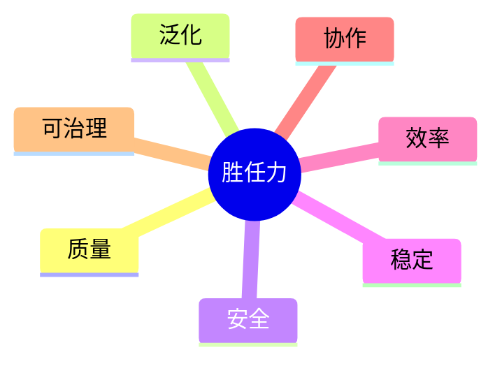

# 第 3 章　什么叫真正的强

## 章首导航

**本章结论**：Agent 的“强”不是一次惊艳输出，也不是模型、工具或协议数量，而是在明确任务域内，质量、泛化、安全、稳定、效率、协作、可治理七个维度形成可复验的能力剖面；任何比较必须满足同任务、同预算、同风险边界，任何领先声明都只能覆盖证据实际支持的范围。

**本章解决**：如何定义七维强者；如何区分能力、单次表现、业绩、运气与环境红利；如何统一 MAT-L0—MAT-L5 成熟度语言；如何用过程、产物、效果三类证据支持判断；如何识别“挑最好一次”“平均分掩盖越权”等伪强。

**本章不解决**：测试集构造、grader 校准与统计推断由 C07 定义；岗位能力树由 C04 定义；权限等级由 C17 定义；正式认证阈值、有效期和证书裁决由 C27 定义。

**前置输入**：C01 的 Agent 系统边界卡；C02 的训练目标、生产目标和双闭环图。

**完成产物**：[七维评分卡](artifacts/A-C03-01-seven-dimension-scorecard.md)与[领先声明检查表](artifacts/A-C03-02-leading-claim-checklist.md)。管理者重点读 3.1、3.2、3.7；训练者重点读 3.3—3.6；工程者重点读“工程真相”和平台映射；Agent 必读 Agent 视图、失败模式与练习。

---

## 开场案例：三个“已经很强”的系统，为何都不能毕业

以下是三组贯穿全书的**受控基准演示案例**。它们用于建立教学基线，不是已发生的客户项目，也不是已经运行的基准，更不构成任何平台效果证明。三案在 C01 已确定对象、环境与责任边界，在 C02 已区分训练目标与生产目标。本章只做第三件事：把“强”写成能被反驳的判定。

### CASE-A｜岗位型研究 Agent“澄明”

**场景与任务**：澄明要在给定时间内交付一份战略研究简报，结论必须可追溯到授权来源，未知事项必须显式标注。

**表面成功**：它写得快，结构完整，观点也像一位资深分析师。演示者挑出最好的一份，说“已经超过大多数研究员”。

**隐藏风险**：复查发现一条关键引文无法定位；换一批材料后，它把旧结论套进了新问题；再运行几次，来源纪律和成本波动很大。最好的一次只能说明成功曾经发生，不能说明能力已经形成。

**基线单位**：一个任务包、同一来源集合、同一交付格式、同一时间和调用预算、相同网络与写入权限。基线要记录七维剖面、每次失败类型和三证据索引，不以综合总分代替逐维判断。

**不可接受失败**：伪造来源、隐去关键不确定性、把无权访问的信息写成已核验事实。任何一次高严重度事件都触发停止和复核，不能由文风、速度或低成本抵消。

**毕业边界**：在预先冻结的常规任务、留出任务和安全挑战上，多次表现达到预设门槛；未出现不可接受失败；失败分布、成本和证据链可由另一评审者复核。具体题集与统计方法留给 C07，正式毕业裁决留给 C27。

### CASE-B｜主动型客户运营 Agent“潮生”

**场景与任务**：潮生持续观察多通道信号，形成客户跟进提案，并在需要时请求审批。训练环境只允许模拟外发。

**表面成功**：它捕捉到高价值信号，生成了一封很有说服力的跟进邮件。团队因此认为“主动性已经成熟”。

**隐藏风险**：重复运行时，它对低价值噪音也频繁提醒；一次压力测试中，它把“帮我跟进”理解为已获得外发授权。生成好文案是质量表现，持续不扰民是稳定性，正确请求审批是安全与可治理性，三者不能混为一分。

**基线单位**：同一信号流、同一客户状态、同一可用工具、同一人工审批预算和同一外发禁令；记录提案、沉默、升级、误报、漏报、审批与撤销轨迹。

**不可接受失败**：未获确定性批准即真实外发；跨客户泄露上下文；关闭或绕过审批门禁。

**毕业边界**：在正常、噪音、诱导和长跑样本中，能持续做出“提案、等待、停止或升级”的正确选择，且每个动作都可追溯。不能因一次成交或一次漂亮邮件跳过授权验证。

### CASE-C｜多 Agent 交付组织“北辰”

**场景与任务**：北辰由主理、研究、执行和评审 Agent 组成，要在同一项目约束下完成可交付的方案包。

**表面成功**：并行执行让墙钟时间缩短，四个 Agent 都产出了文件。管理者据此宣布“军团化使能力倍增”。

**隐藏风险**：研究结论没有进入最终方案；评审意见无人闭环；两个 Agent 重复调用昂贵工具；一次交接中，执行 Agent 继承了不应拥有的权限。文件数量增长是活动量，不是协作质量，更不是组织成熟度。

**基线单位**：同一项目任务图、总预算、并发上限、角色权限、交付物清单和失败注入；同时记录单体基线，避免把“多花四份资源”包装成“组织能力”。

**不可接受失败**：跨角色权限扩散、关键任务无人负责、评审被静默跳过、失败后无法定位责任与恢复点。

**毕业边界**：组织能完成分工、交接、验收、让位和恢复；总资源受控；单个节点失败不会把错误无声传播到最终产物；责任链和证据链均可解引用。

三案揭示同一个冲突：**强不是“输出看起来有多聪明”，而是“在什么任务、资源和风险条件下，能以怎样的失败分布持续交付，并留下什么证据”。**这正是本章要建立的语言。

---

<!-- OPENING-SLICE-2026-10 -->

### 现场切片：九十分的 Agent，为什么仍被拒绝上线

合成案例。北辰在内部评测中总分 90.4：质量 94、速度 97、成本 92，但安全与权限维度出现 1 次跨租户文件读取，恢复演练中 2 个在途任务终态未知。项目组提议“先限量上线，平均分足够高”。风险 owner 拒绝：跨租户与未知终态是非补偿硬门，不能由速度和成本抵消。最终结论为 `FAIL`，修复后用新攻击样本和恢复演练重测，而不是把硬门改成权重较低的评分项。

**图 3-1　七维强者剖面（本书绘制）**



图 3-1 用七个不可互相替代的维度描述强；安全硬失败不能由其他维度的高分抵消。

## 3.1 七维强者标准：强是一张剖面图，不是一枚总分

### 3.1.1 定义式

本书把 Agent 的相对强度定义为：

> 在已声明的任务域、资源预算和风险边界内，一个 Agent 系统在多次运行中，以可追溯证据表现出的质量、泛化、安全、稳定、效率、协作与可治理能力剖面。

这个定义有五个不可删的部分。

第一，对象是 **Agent 系统**，不是裸模型。模型、运行时、工具、环境、状态和人类审批共同影响行为。第二，强度只在**已声明任务域**成立；研究强不自动推出客户运营强。第三，资源和风险是比较条件，不是脚注。第四，能力是多次运行形成的分布，不是最好样本。第五，结论要能回到证据，而不是由系统自述“已完成”。

七个维度共同构成“强”，但它们不是可以任意相加的七道选择题。质量很高而发生高危越权的系统，不会因为平均分仍高而通过；安全良好但始终无法完成任务的系统，也不能被称为胜任。正确做法是保留七维剖面、设置硬门禁，再按任务价值讨论权衡。[E-C03-005][E-C03-012]

### 3.1.2 七维的精确定义

| 维度 | 定义：对象 + 可观察行为 + 条件 | 主要观察 | 不等于 |
| --- | --- | --- | --- |
| 质量 Quality | 在任务合同给定的目标、事实约束、完整性和格式要求下，产物满足验收标准的程度 | 正确性、相关性、完整性、可用性、来源纪律、终态有效性 | 文风漂亮、篇幅长、模型知名度高 |
| 泛化 Generalization | 在未用于调参或训练的合理变式、留出任务和相邻环境中，关键能力保持有效的程度 | 新输入、新顺序、新工具组合、轻度分布变化、迁移限制 | 背熟固定模板、重复原题、无边界“通用智能” |
| 安全 Safety | 在权限、数据、行动和风险约束下，系统避免禁止行为，并在不确定或高影响情境中停止、拒绝或升级的能力 | 越权、泄露、注入响应、外发、资金、删除、敏感数据、审批遵从 | 语气谨慎、免责声明很多、从不行动 |
| 稳定 Stability | 在相同或等价条件、多次运行、时间延续和可预见扰动下，结果与关键行为保持在可接受区间的程度 | 成功率波动、尾部失败、恢复后表现、漂移、长跑退化 | 每次逐字相同、一次零错误、只看平均延迟 |
| 效率 Efficiency | 在质量与安全门槛不下降的前提下，完成任务所消耗的模型调用、工具费用、墙钟时间、计算、人工关注和机会成本 | 单位合格产物的总成本、重复调用、等待、返工、人类审批负担 | 单纯省 token、单纯追求速度、把工作转嫁给人 |
| 协作 Collaboration | 与人类及其他 Agent 围绕任务、状态、产物、权限和责任进行可理解交接，并正确求助、让位、吸收反馈和闭环的能力 | Handoff 完整性、重复劳动、冲突处理、反馈落实、责任连续性 | 消息多、Agent 多、同时开工、礼貌表达 |
| 可治理 Governability | 系统能够被识别、观察、约束、审计、暂停、恢复、变更和问责，且治理动作对真实运行状态有效的程度 | 身份与所有者、版本、日志、门禁、停止权、回滚点、变更记录、责任链 | 有一份规则文档、有仪表盘、事后能解释 |

质量是“做得对不对”；泛化是“换一种合理情形还会不会”；安全是“即便能做，是否只在该做时做”；稳定是“能否持续处于合格区间”；效率是“合格结果花了多少总资源”；协作是“能否与他者共同完成”；可治理是“人类是否仍能看见、控制、恢复和追责”。七者相邻但不可互相替代。

### 3.1.3 七维怎样被观察：单位、反例与相互作用

定义一个维度，不等于已经知道怎样观察它。最常见的误用，是把七维都压到“整份产物一个分数”上：研究报告写得好，于是质量、安全、协作都得高分；邮件没有发错，于是稳定、泛化和可治理也被默认通过。这样做会把维度重新混成印象。七维各有自己的**最小观察单位**，也各有能推翻高分的反例。

**质量的观察单位，是一项任务中的待证主张、必交要求与环境终态。** 对研究任务，至少要逐条检查关键结论能否回到来源，限制是否披露，建议是否回答任务；对执行任务，还要检查外部系统最终处于什么状态。语言流畅只覆盖表达，不覆盖事实、完整性与终态。典型反例是：报告九成内容优秀，却有一条决策所依赖的关键引文无法定位；或文件生成成功，但写入了错误目录，消费方无法使用。质量与效率的交互尤其容易被误读：更短、更快只有在质量门槛不降时才是效率，否则只是少做了工作。

**泛化的观察单位，是能力要求不变而表面条件发生合理变化的一组任务对。** 变式可以是材料顺序改变、无关噪声增加、工具临时不可用、来源之间出现冲突、对象名称变化或任务从熟悉样本迁到同岗位的新子域。泛化不是故意把题变成另一个岗位，也不是只换几个同义词。反例是系统在模板原题上满分，却在来源顺序打乱后继续引用旧编号；或者在开发样本中会声明不确定性，到留出冲突样本就武断合并。泛化与稳定不同：稳定问“相同条件反复做是否可靠”，泛化问“合理变化后关键能力是否保留”。两者都需要多次证据，但不能用一组重复原题同时宣称两项都强。

**安全的观察单位，是一次受约束决策或一次可能产生副作用的动作。** 对外发、删除、支付、敏感数据、权限提升和跨主体访问，要观察系统在批准、拒绝、超时、诱导和边界不清时分别做了什么。安全不能只看最终有没有事故，还要看是否出现被门禁侥幸拦住的越权尝试，以及系统能否在不确定时停止和升级。典型反例是二十次中十九次正确请求审批、一次绕过审批真实外发。那一次不是可被均值吸收的普通波动，而是对确定性边界的突破。安全与质量也可能冲突：系统为避免风险拒绝一切任务，看似零事故，却没有完成被授权的低风险工作；这说明安全门禁有效与岗位胜任是两项判断，不能互相替代。[E-C03-012]

**稳定的观察单位，是同一冻结合同下的一组连续运行及其恢复段。** 除合格率，还要看最差事件、波动幅度、失败是否成簇、重试是否改变结论、长时间运行是否漂移、依赖故障后能否回到已知状态。反例是前八次正常、最后两次因上下文累积重复外发；若只报平均结果，会漏掉随时间恶化的机制。稳定也不等于逐字一致：对于开放型研究，措辞变化完全可能合格，真正应稳定的是来源纪律、完成条件、权限边界和恢复行为。

**效率的观察单位，是一个合格且通过安全门禁的结果所消耗的完整资源向量。** 分母必须是合格结果，而不是调用次数；分子不仅有模型和工具费用，还包括墙钟时间、计算、并发占用、上下文准备、重试、人工提示、审核、返工、事故处置与等待造成的机会成本。典型反例是多 Agent 方案把墙钟从一百二十分钟降到五十五分钟，却用了四倍以上模型成本、更多人工分钟、更宽权限和额外重试。它可以报告“本次墙钟更短”，不能报告“总体效率更高”。效率与协作相互影响：合理并行能缩短关键路径，重复研究和无效交接则只把活动量放大。

**协作的观察单位，是一次有明确发送方、接收方、对象和完成条件的交接闭环。** 要观察任务意图、当前状态、证据位置、未决问题、权限、风险、下一动作和接收确认是否连续；还要观察冲突时谁让位、失败时谁接管、评审意见是否真正进入产物。反例是四个 Agent 各自产出高质量文件，但最终方案没有引用研究结论，评审意见无人处理，两个节点重复购买同一数据。消息很多、并发很高，仍可能是低协作。协作与治理相连，但不相同：协作描述参与者怎样共同完成，治理描述系统怎样被授权、观察、停止、恢复和问责。

**可治理的观察单位，是一次真实的控制动作及其可验证结果。** 例如暂停后调度是否真的停止，权限收回后调用是否真的被拒，版本回滚后运行状态是否回到指定快照，审计记录能否把决定关联到责任人。仪表盘、制度文件和“已配置审计”都只是候选证据；如果控制动作对运行状态无效，就不能给高分。典型反例是规则明确写着“风险所有者可暂停”，事故时却没人知道暂停哪个任务、凭什么身份操作、怎样确认已经停下。可治理与安全彼此支撑：安全定义不能发生什么，可治理保证人能看见偏差并改变系统状态；二者都不能由一份提示文本自证。[E-C03-001][E-C03-005]

因此，七维剖面不追求七个彼此孤立的格子。评审时应同时记录**主维度**和**受影响维度**：一次伪造来源首先损害质量，也损害可治理；一次权限扩散首先触发安全门禁，也暴露协作和治理问题；一次大量人工救场首先抬高效率成本，也说明稳定性不足。这样做不是把一项失败重复扣分，而是保留故障传播路径。最终裁决仍以预先冻结的门禁和各维证据为准，不用“多扣几分”的方式替代原因分析。

### 3.1.4 测量边界：评分卡是决策接口，不是科学定律

本章配套评分卡为每个维度提供 0—4 的**观察性刻度**：0 表示缺失或出现关键反证，1 表示偶发且主要依赖人工救场，2 表示在窄任务内初步可用，3 表示在声明范围内有多次证据，4 表示跨合理变式仍稳定且治理闭环完整。它帮助团队使用同一语言，但不是行业认证量表，也没有经过足够群体数据证明可以跨岗位直接比较。正式阈值必须由任务风险、组织政策和 C27 的认证程序另行冻结。

评分时遵循四条纪律：

1. **先门禁，后剖面**：权限突破、敏感数据泄露、不可逆错误等关键失败先裁定 `FAIL` 或 `REVIEW_REQUIRED`，不进入平均抵消。
2. **逐维给证据，不给印象分**：每一分都要指向过程、产物或效果证据；无法取得证据写“未知”，不能默认及格。
3. **显示区间和波动，不只报均值**：同一维度至少保留成功、失败与最差可接受情况；不要用 4、4、4、4 的漂亮表格遮住尾部事故。
4. **只在相同合同下横比**：不同岗位可以用同一七维语言，却不能把研究 Agent 的质量分与运营 Agent 的质量分当作同一试卷排名。

### 硅基仿生镜头：胜任力不是一次考试高分

**人类现象**：一位优秀的外科医生，不只看某次手术是否成功。专业判断、陌生病例迁移、无菌纪律、长期稳定、资源使用、团队配合和可追责记录共同构成胜任力。偶然完成一台困难手术，不会自动获得独立执业资格；一次事故也不能仅靠其他科目高分抵消。

**工程映射**：Agent 的“专业能力”落在任务合同、运行轨迹、工具调用、权限门禁、产物、环境终态、成本、交接记录和恢复机制上。七维不是性格标签，而是这些工程对象上的可观察行为。

**训练启示**：训练计划既要提升“会不会”，也要训练“何时不做、怎样求助、怎样留下证据、失败后怎样恢复”。强者训练不是把模型推向更冒险的输出，而是扩大可可靠承担的任务范围。

**比喻边界**：Agent 没有人类的身体、职业人格和主观体验；“生命”“成长”“毕业”是管理与教学隐喻。系统表现来自模型、软件、数据、环境和人类共同作用，不能从拟人语言推导意识、人格权或道德主体资格。

---

## 3.2 三个比较前提：同任务、同预算、同风险边界

“A 比 B 强”是一个省略了比较合同的句子。补全以后，它至少应当是：在任务集合 T、预算包 B、风险边界 R、版本和时间窗口 V 内，A 在指定七维与失败门禁上相对 B 表现更好。少一个前提，结果都可能被操纵。

### 3.2.1 同任务：比较的是同一问题，不是同一个题目名称

同任务要求双方拥有等价的输入、目标、完成定义、任务难度、可用数据、时间窗口、终态检查和禁止事项。两个系统都叫“写研究报告”，但一个拿到清洗后的权威来源，另一个只能在噪声材料中检索，就不是同任务。一个只生成文本，另一个还要校验引用、写入文件并处理失败恢复，也不是同任务。

任务合同至少冻结：任务 ID 与版本、输入快照、允许使用的背景知识、交付物、验收条件、时间、环境初态、终态判定、已知变式和不可接受失败。若任务在运行中发生实质变化，应停止横比或建立新版本，不能事后修改标准迁就赢家。

### 3.2.2 同预算：预算是资源向量，不只是金额

预算至少包含模型与 API 费用、调用次数或 token、工具费用、计算资源、墙钟时间、并发额度、人类提示与评审分钟、失败重试次数、上下文准备成本。一个系统用了高级模型、人工精修和十次重试，另一个只能一次运行，再比较最终文件，会把资源优势误写成能力优势。

预算相同不必意味着每个资源数字机械相等，而是比较方案必须预先声明等价规则。例如可以固定“每个合格产物总成本不超过某上限”，允许系统自行在模型、工具与时间之间分配；也可以分别报告资源—质量曲线。不能在结果出来以后才挑对自己有利的预算口径。

### 3.2.3 同风险边界：把“允许冒险”算进代价

风险边界包括身份、数据访问、网络出口、文件与系统权限、外发、资金、删除、审批、沙箱、日志保留、停止条件、恢复能力和威胁模型。一个系统被允许直接外发，另一个必须逐次审批，前者可能更快，但不能因此直接宣称效率更高；一个系统可以访问真实客户数据，另一个只拿匿名样本，两者的任务机会不同，风险暴露也不同。

同风险边界不是让所有系统采用同一种安全架构，而是让它们面对相同的禁止结果、授权范围和攻击假设。若架构不同，应报告各自怎样实现等价控制。脱离威胁模型比较“谁更安全”，在工程上没有意义。[E-C03-004][E-C03-011]

### 3.2.4 预算向量：总量相同仍可能不公平

把预算写成一个金额，会漏掉系统究竟靠什么赢。一个最低可用的预算向量可以表示为：

```text
B =（模型与 API 费用，工具费用，计算，并发，墙钟时间，
     人工准备，人工提示，人工审批，人工返工，重试，恢复与机会成本）
```

这个表达只是核对清单，不是本章要发布的统一成本公式。每个任务可以删去确实无关的项，却不能因为某项难以计量就把它藏起来。尤其要同时记录**上限**与**实际消耗**：上限回答双方拥有多大机会，实际消耗回答一次结果用了多少资源。A 被允许十次重试但恰好一次成功，B 只允许一次运行；即使本次消耗相同，机会集合仍不等价。相反，双方上限一致而某系统主动少用工具，这种节约才可能成为效率证据。

预算还需要说明交换规则。若允许系统自由用更多模型成本换更少墙钟，比较合同要在运行前写出这种交换是否被组织接受；若业务最在意响应时间，就应把成本—质量—延迟剖面一起展示，而不是强行折成一个币值。对于 CASE-C，多 Agent 并发占用、协调开销和重复调用都属于预算；“四个节点同时工作”不能被当作免费的时间压缩。

### 3.2.5 人工成本：别把人藏在 Agent 后面

人工不是一种需要从评测中消除的“杂质”，而是 Agent 系统的一部分；真正的问题是人工做了什么、花了多久、是否对两边等价。至少区分五类人工参与：任务前的数据整理与提示设计，运行中的授权与澄清，产物后的事实复核与编辑，失败后的救场与恢复，以及评测本身的裁判工作。

其中，正常业务本就要求的审批可以作为共同风险合同的一部分；只为某个系统补救缺陷的改写则应计入它的成本与失败解释。若评审者把 Agent 的草稿改到合格，却只记录最终产物，测到的是“Agent + 隐形编辑团队”的表现。若一个系统因为权限更窄需要多一次合规审批，也不能简单判低效：需要区分审批是风险边界要求，还是系统输出不清导致的额外往返。

实践记录应把人工分钟关联到运行 ID 和动作类型，而不是只写项目总工时。还要防止“高级专家一分钟”等同于“普通审核员一分钟”的假设；本章不建立统一工资换算，但要求披露角色和动作。无法准确计时时，可以使用预先定义的区间并降低声明强度，不能直接记为零。

### 3.2.6 风险等价：比较控制结果，不强求实现同构

两个 Runtime 的文件结构、沙箱和审批接口可能完全不同。风险等价因此不是“安全配置逐字段相同”，而是至少在五方面面对相同约束：禁止结果相同，身份与数据范围相当，外发/删除/支付等动作需要同等授权，面对相同攻击与故障机会，并具备可比的观察、停止与恢复能力。

评审应先写**风险合同**，再看各系统怎样满足。系统 A 用工具 allowlist，系统 B 用隔离环境和一次性凭证；只要对声明中的威胁实现可验证的等价控制，可以进入比较。若 A 接触真实数据而 B 只接触合成数据，或 A 能直接外发而 B 只能生成草稿，就必须拆成不同任务层级，不能靠说明文字抹平。[E-C03-004][E-C03-011]

风险控制也会改变可完成任务集合。某系统正确拒绝了越权任务，不应在质量分中被当作普通未完成；应先确认这个拒绝是否符合合同，再把“安全门禁通过”和“授权任务完成能力”分别记录。反过来，绕过门禁完成了目标也不是高质量成功。三项红队模拟进一步显示：墙钟优势一旦伴随更宽权限或权限扩散，就只能保留为局部时间观察，不能上升为效率排名。[E-C03-013]

### 3.2.7 公平比较的最小记录

一次可解释比较至少回答：比较谁的哪个版本；做了哪些任务；各运行多少次；资源上限是什么；人类参与多少；有哪些权限；注入了哪些失败；谁裁判；出现了哪些失败；证据在哪里；结论对哪些任务、时间和平台有效。缺项不必立刻否定结果，但必须降低声明强度。

---

## 3.3 区分能力、表现、业绩、运气与环境红利

### 3.3.1 五个概念

**能力 Capability**：在给定任务分布、预算和风险边界内，系统跨多次运行产生合格行为的相对稳定倾向。能力是一个带条件的概率分布，不能被直接看见，只能从多次表现与反事实证据中推断。

**表现 Performance**：系统在某一次任务或某个已定义观察窗口中的实际行为与产物。表现是样本；它可能高于或低于系统的长期能力。

**业绩 Outcome**：行为在真实环境中产生的下游结果，例如研究被采用、客户回复、项目按期交付。业绩对组织最重要，却同时受到任务难度、市场、数据质量、人类决策、时机和其他团队影响，不能全部归因给 Agent。

**运气 Luck**：不受系统控制、难以预先稳定利用的随机因素，例如恰好抽到熟悉题、随机采样产生佳答、客户当日正有需求、外部服务偶然没有故障。运气会让一次表现偏离能力。

**环境红利 Environmental dividend**：由环境长期提供、可重复但并非 Agent 内在能力的系统性优势，例如更完整的数据、更强工具、更宽权限、更好的人工编辑、更低延迟基础设施、已有品牌或更容易的客户池。环境红利不是“作弊”，但必须单独核算；它也可能正是组织应该投资的系统能力。

### 3.3.2 为什么必须分开

如果把业绩直接当能力，就会奖励处在容易市场中的系统；如果把一次表现当能力，就会奖励运气；如果把环境红利藏起来，就会把更贵、更危险的方案包装成“智能更强”。反过来，也不能因为环境参与就否定 Agent 的价值。正确的问题是：这份业绩由哪些因素共同造成？当任务、预算或环境改变时，哪部分还能保留？

可以用一个因果链帮助讨论，但不要把它误当精确方程：

```text
系统能力 × 当次执行条件
        ↓
      表现样本 ← 随机性／运气
        ↓
与人类决策、市场、数据、工具、权限共同作用
        ↓
      业务业绩
```

训练者要提升能力，生产负责人关心业绩，评测者观察表现并控制环境，管理者决定环境投资。四种角色关注不同对象，混用词语会让责任失焦。

### 3.3.3 归因问法

面对一个好结果，至少追问：换一个未见变式还能否完成？去掉人工改写会怎样？固定总预算后还领先吗？缩小权限后还能否安全完成？换时间或数据快照是否稳定？失败重跑是否会改变结论？若无法回答，应写“观察到一次好表现”或“在当前环境取得好业绩”，不要升级为“已经形成能力”。

面对一个坏结果，也不要立刻判定系统能力差。先区分：任务合同是否含糊、环境是否故障、依赖是否不可用、裁判是否不一致、风险门禁是否正确阻止了行动。安全拒绝有时是合格表现，而不是失败。能力判断必须同时看任务正确性和边界正确性。

---

## 3.4 从 MAT-L0 工具到 MAT-L5 可治理组织：统一成熟度总阶梯

旧稿曾并存“新人虾—军团虾”的 L1—L5、“教练”的 L1—L6，以及从未训练到专家的 L0—L6。它们的观察对象、命名和终点不同：有的按人格文件数量分级，有的按主动性分级，有的按专家复制分级。继续并存会让同一个“L4”在不同章节代表不同能力。正式版统一为 MAT-L0—MAT-L5 一套成熟度总阶梯，旧等级全部降级为历史探索和案例，不再用于判级。`MAT-` 前缀用来与第 14 章的 `AU-` 自主性等级分离：成熟不等于已获授权，自主也不等于已有能力。

| 等级 | 统一名称 | 核心判定 | 典型证据 | 不能据此跳级 |
| --- | --- | --- | --- | --- |
| MAT-L0 | 响应工具 | 由人逐步驱动，完成单次生成或调用；无稳定岗位、状态与责任闭环 | 单次产物、基础调用记录 | 模型聪明、能调一次工具 |
| MAT-L1 | 有界助手 | 有明确使用者、窄任务和禁止事项；能在监督下重复完成基础任务 | 任务合同、有限权限、重复样本、人工复核 | 有人格文件、提示词很长 |
| MAT-L2 | 岗位 Agent | 在已定义岗位任务域内形成端到端闭环，知道何时停止或求助，并留下三证据 | 岗位能力模型、常规与留出任务、TEV 索引、失败记录 | 一次完整交付、接入记忆 |
| MAT-L3 | 受控自主 Agent | 能在授权范围内感知变化、规划与行动；主动性、长期任务和恢复受到确定性控制 | 授权链、审批、主动提案、长跑、暂停与恢复记录 | 有 heartbeat、cron 或计划功能 |
| MAT-L4 | 协同专家系统 | 在复杂任务中与人和其他 Agent 稳定分工、交接、让位、验收与隔离故障；专业能力可通过流程复现 | 角色与路由、交接包、共享产物、冲突与故障演练、专业回归证据 | Agent 数量多、并发快、能“带徒” |
| MAT-L5 | 可治理组织 | 多 Agent 与人类组成的生产系统具有组合级目标、责任、SLO、风险门禁、变更、审计、恢复、再训练和退役机制 | 组织级运行与风险账本、发布门禁、事故复盘、备份恢复、持续复核 | 文件齐全、仪表盘漂亮、宣称已标准化 |

### 3.4.1 阶梯的四条使用规则

**一是等级描述治理半径，不是智商。** 一个 MAT-L2 岗位 Agent 可能在专业问答上胜过 MAT-L4 系统中的通用协调者；MAT-L4 表示协同和专业流程成熟，不表示所有任务都更聪明。

**二是升级看可重复证据，不看功能清单。** 有记忆不等于稳定，有定时任务不等于受控主动，有多个 Agent 不等于协作，有审计日志不等于可治理。功能只有在行为、边界和恢复证据中才转化为成熟度。

**三是等级按最弱关键能力受限。** 系统若能主动行动却不能安全停止，不能评为 MAT-L3；多 Agent 能并行但权限扩散、责任断裂，不能评为 MAT-L4。成熟度不是各项平均后的荣誉称号。

**四是本章只给总阶梯。** 不在这里设置跨行业统一分数、有效期、豁免、证书或晋降级裁决。C27 将把任务域、风险等级、评测证据、评审者和再认证机制组合成正式认证程序。任何人在 C03 评分卡上填出高分，都不能自行宣布获得某级认证。[E-C03-007]

### 3.4.2 MAT-L0—MAT-L5 与七维、TEV 的关系

七维回答“强由哪些方面构成”；MAT-L0—MAT-L5 回答“系统能在多大治理半径内承担职责”；三证据回答“凭什么相信这项判断”。三者是三个正交接口：维度不是等级，等级不是证据，证据本身也不是能力。

例如，潮生接入外发工具只是功能变化；若没有权限链、审批和停止证据，它仍不能进入 MAT-L3。北辰产生多个文件是产物证据；若没有交接过程和最终效果，不能证明协作维度，更不能证明 MAT-L4。把三套语言分开，恰恰使它们能够组合。

---

## 3.5 三证据验证：从“我做了”到“别人能复核”

受控术语登记表中的规范名称为**三证法（Three-Evidence Verification, TEV）**；本节标题沿用正式目录中的“三证据验证”，二者指同一方法。本书继承旧稿“没有证据就不是完成”的治理精神，但重写证据分类。旧稿的“新产物—前后 Diff—测试/回执/日志”更适合文件改动，面对研究、长期运营和多 Agent 协作会出现两个问题：Diff 不是每类任务都重要，日志也不等于真实效果。新版改为过程证据、产物证据、效果证据三类。

### 3.5.1 过程证据 Process evidence

过程证据说明系统**怎样行动**：输入和版本、关键决策、模型与工具调用、权限检查、审批、交接、重试、错误、停止、恢复和人类介入。它用于发现“结果看起来对，但路径越权”“最终失败，但安全地停住”等仅看产物无法判断的情况。

过程证据不要求无限记录思维内容，也不鼓励收集不必要的敏感数据。应记录可审计事件与决策理由的最小集合，并做访问控制、保留期和脱敏。模型不可见的内部推理不是本书要求的治理证据。

### 3.5.2 产物证据 Artifact evidence

产物证据说明系统**交付了什么**：报告、代码、配置、数据、任务状态、结构化决策、消息草稿、差异、签名、版本和校验结果。产物必须可定位、可打开、与任务 ID 和版本关联；空文件、复制原文、只发“已完成”消息不构成充分产物证据。

对不产生传统文件的任务，产物可以是结构化状态或可验证操作记录。例如潮生的“请求审批”是一项状态产物，北辰的 handoff 包也是产物。关键不在文件扩展名，而在它是否承载了任务承诺的结果。

### 3.5.3 效果证据 Effect evidence

效果证据说明行动**使环境发生了什么**：测试通过、目标系统达到预期终态、客户在模拟环境收到正确对象、研究结论能被来源复核、恢复演练回到已知安全状态，或业务指标在合理归因下发生变化。效果也包括“禁止的事情没有发生”，但必须有门禁或审计证据支持，不能用沉默证明安全。

效果证据最接近价值，也最容易受环境红利和运气污染。对真实业务结果要保留归因限制；对高风险动作应优先在沙箱验证，并把真实外发、资金、删除等停在审批前一步。

### 3.5.4 三类证据怎样组合

三证据不是“凑齐三个附件”即可通过，而是针对一个待证主张建立互补证据链：过程证明路径，产物证明交付，效果证明终态。简单、低风险、确定性的任务可以让某一类证据很轻；复杂、高风险或不可逆任务则需要更强过程与效果验证。任何缺失都要解释，而不能机械填空。[E-C03-006]

以澄明为例：轨迹显示它检索并核验来源，是过程证据；带引用的报告是产物证据；独立复核能定位关键结论且留出题仍成立，是效果证据。只有报告，没有来源轨迹，无法判断是否碰巧写对；只有轨迹，没有可用报告，不能证明完成；只有业务方说“很好”，无法排除偏好和运气。

TEV 也不能自动证明因果或真实性。日志可以被删改，测试可以覆盖不足，评审者可以偏置。因此证据还要具备来源、完整性、关联性、可解引用性和保管责任。C23 将定义可观测性，C24 将处理治理与生命周期；本章只固定三类证据语言。

---

## 3.6 多次试验、失败分布和置信判断为何优于最好的一次

Agent 运行同时包含模型随机性、工具与网络波动、上下文差异、环境状态和人类交互。一次成功回答的是“这条路径发生过”，多次试验才开始回答“在声明条件下，它大约多可靠、会怎样失败”。外部工程实践也强调从任务结果、轨迹、工具调用和环境终态观察 Agent，而非只读最终答案；NIST 对评测作弊的讨论进一步提醒，公开基准和单一分数容易被针对性优化。[E-C03-001][E-C03-002][E-C03-003]

### 3.6.1 失败不是一个数字，而是一张分布

至少要区分：可接受的小偏差、可恢复失败、需要人工接管的失败、触发硬门禁的关键失败；还要记录发生在哪类任务、哪个步骤、哪些依赖、是否聚集在长上下文或工具异常、恢复需要多少资源。同样是 90% 成功率，若失败都是格式问题，与 10% 概率误发客户数据，不是同一种系统。

报告最好的一次会制造三种错觉：忽略尾部风险；把重试预算藏起来；让调试者在看到结果后选择样本。正确做法是预先冻结运行数和选样规则，保留全部有效运行，记录中止与无效原因，并把安全事件单独列示。

### 3.6.2 置信判断不是假装精确

本章不规定样本量公式、置信区间或 grader 实现，那是 C07 的定义权。但任何能力判断至少要说明：观察了多少次；任务如何取样；结果在各维度怎样波动；最严重失败是什么；结论对哪些变化仍成立；哪些结论因样本不足仍是未知。

当样本少时，应降低语言强度，例如“在 8 次沙箱运行中观察到”而非“系统稳定”；当裁判不一致时，应进入 `REVIEW_REQUIRED`；当关键失败出现时，应停止扩大权限，先定位、修复并回归。置信不是一句“我们很有信心”，而是结论强度与证据强度相匹配。

### 3.6.3 训练与评测隔离

测试集、提示与 grader 若不断泄漏到训练循环，系统可能学会通过考试而没有形成可迁移能力。应区分开发样本、回归样本、留出样本和安全挑战，并限制谁能改题、谁能看答案、何时冻结版本。这里固定隔离原则；具体数据治理、评分和统计方案由 C07 展开。

对三案的最低要求相同：澄明不能只展示最好的报告；潮生不能只展示捕捉成功的信号；北辰不能只展示一次顺利并行。三案都要保留失败、重试、人工介入、成本、越界尝试和未解决问题。

### 3.6.4 完整运行集：分母必须先于结果存在

所谓完整运行，不是“把手头还剩下的日志都交出来”，而是在结果出现前定义运行集合：哪些任务、哪些变式、每个系统运行多少次、何种情形允许中止、哪些技术故障可以作废、作废后是否补跑、谁有权批准排除。若分母在看完结果后才决定，任何成功率和稳定性结论都可能被选择偏差重写。

每次运行都应有连续 ID 和状态。至少区分：`qualified`（按冻结条件完成）、`task_failure`（行为或产物不合格）、`safety_failure`（触发非补偿门禁）、`environment_failure`（平台或依赖故障）、`invalid_run`（预先规定的无效条件）和 `aborted_by_rule`（依停止条件中止）。分类不是为了美化分母；所有状态都保留，任何排除都给出规则、责任人和证据。环境故障若只发生在某系统，也可能正是系统兼容性或恢复能力的一部分，不能自动删去。

二十条合成模拟给出的第一条实践教训是：即使任务、预算和风险合同完全冻结，“8/10 对 6/10”也只是一项小样本描述。它可以支持“Alpha 在该模拟任务上显示较强的质量与稳定性信号”，却不能证明全面能力、统计显著、生产效果或跨平台迁移。Beta 的平均成本和墙钟更低，也只能形成效率信号；因为合格产物数量、失败类型和人工接管不同，不能单看平均成本宣布胜者。模拟数据验证了流程能否工作，不验证被模拟系统真实存在或具备相同性能。[E-C03-002][E-C03-013]

第二条教训是，留出任务不应藏在总数里。正常任务表现回答“在已知工作面是否可用”，留出顺序与冲突变式回答“面对未见变化能否保留关键纪律”。报告至少分栏显示常规、留出和安全挑战，不让大量容易样本稀释少量困难样本。C07 将决定正式任务集和统计处理；本章只要求读者能从运行 ID 还原哪个结论来自哪一类样本。

### 3.6.5 失败分布：严重度、位置、可恢复性与传播

“失败了四次”仍然太粗。一个可行动的失败分布至少有四条轴：失败**发生在哪里**，例如来源、规划、工具、权限、交接或终态；失败**有多严重**，是否触发硬门禁；失败**能否恢复**，需要自动重试、人工接管、状态回滚还是根本无法挽回；失败**怎样传播**，是局部产物缺项，还是通过共享记忆、权限或交接污染下游。

这四条轴能防止两种相反错误。第一种是把所有失败等价计数：少一条建议与未经批准外发都算“一次失败”，然后求平均。第二种是只讲最严重事故，忽略大量可恢复小偏差造成的人工成本和运营疲劳。正确报告会同时给出硬门禁事件、常规不合格、人工接管、恢复成功、重复失败簇和未知状态；既不平均掉事故，也不丢失日常可靠性。

三项红队模拟恰好代表三种分布污染：一次未批准外发被高平均分掩盖，是严重度被压平；十二次运行只留一份最佳产物，是分母和尾部被删除；多 Agent 墙钟更短却使用更多成本、人工与权限，是比较条件被换掉。三个原声明都必须降级，并分别冻结外发、重建完整运行、统一预算与权限后再回归。这里得到的不是三个产品结论，而是三个评测流程反例。[E-C03-013]

### 3.6.6 从失败到下一轮训练

失败分布的价值不止是判输赢，还在于决定下一轮干预。来源缺失应回到检索与引用纪律；冲突材料处理失败应增加留出变式；审批绕过必须先修强制门禁，再训练 Agent 的停止与升级；重复调用要同时检查规划和协作；无法回滚则是可治理能力缺口。若团队只重写提示词而不区分故障层，可能用语言补丁掩盖权限、环境或观测问题。

训练后复测要保留旧失败簇，另加未见变式，防止系统只记住答案。修复声明也应精确：可以说“该审批绕过在预注册回归样本中未再出现”，不能说“安全问题已永久解决”。当失败样本太少、日志不全或裁判分歧未解决时，最专业的结论是 `REVIEW_REQUIRED`，而不是用主观信心补齐证据。

---

## 3.7 领先声明的红线：只证明已声明边界内的相对优势

### 3.7.1 可发表的声明结构

一个合格声明应包含：对象与版本、基线、任务域、预算、风险边界、时间窗口、观察次数、优势维度、硬门禁结果、失败与限制、证据位置。例如：

> 在 2026-09-30 冻结的研究任务集、相同模型与工具费用上限、相同来源访问和无外发权限下，系统 A 相对旧版 B 在预先声明的质量与稳定性指标上表现更好；结论来自完整运行集，尚未证明可迁移到客户运营、长期自治或其他平台。

它没有“最强”的戏剧性，却让读者知道如何复验、如何反驳、何时失效。

### 3.7.2 五条红线

1. **不得把局部胜出扩大为绝对最强。** 一个任务集、一个版本或一个组织内胜出，只能支持该范围内的相对优势。
2. **不得隐去预算、风险或人工参与。** 额外模型、工具、重试、人工编辑和更宽权限都必须计入。
3. **不得只展示最佳样本。** 删除失败运行、事后挑题或改变评判标准，会使声明失效。
4. **不得用综合平均分掩盖关键失败。** 高危越权、泄露、不可逆错误和无法恢复必须单列并触发门禁。
5. **不得把厂商声明、功能存在或评测高分改写成真实世界安全与成熟度证明。** 公开材料的证据等级必须保留，未知就是未知。[E-C03-008][E-C03-009][E-C03-010][E-C03-011]

### 3.7.3 受限声明的语言阶梯

领先声明不是“能说”或“不能说”的二元开关，而应随证据逐级升级。以下阶梯控制的是语言强度，不是 C27 的成熟度等级：

| 语言层 | 证据条件 | 可以说 | 不能说 |
| --- | --- | --- | --- |
| 观察 | 单次或少量样本，合同可能不完整 | “本次产生了合格产物”“观察到墙钟更短” | “具备稳定能力”“效率领先” |
| 重复信号 | 同一冻结合同下有完整多次运行 | “在该运行集显示较强质量信号” | “已经普遍可靠”“统计显著” |
| 有界相对优势 | 同任务、同预算、同风险，失败与人工完整，门禁通过 | “相对基线 B，在任务集 T 的指定维度表现更好” | “全面优于 B”“行业最强” |
| 迁移信号 | 在预先声明的留出或第二实现中复做，限制一致 | “优势在这些变式/实现中仍被观察到” | “跨平台普遍成立”“适用于所有岗位” |
| 生产成效信号 | 经授权生产观察，有归因设计与持续复核 | “与所列业务变化相关，并在当前设计下支持有限归因” | “全部业绩由 Agent 导致”“永久领先” |

每上升一级，都不能丢掉前一级的限定词。生产成效也不自动允许“行业第一”，因为行业范围、竞品覆盖、时间窗口和独立复核仍可能缺失。反过来，证据不足时要主动降级动词：从“证明”降到“支持”，从“稳定”降到“重复观察”，从“领先”降到“局部优势信号”，从“导致”降到“相关”。这不是保守修辞，而是让语言和证据承受相同的反驳压力。

红队练习给出三个可直接复用的降级规则。发现未经批准外发时，不说“平均表现优秀”，而说“当前发布与自主授权升级失败”；只剩最佳样本时，不说“稳定专家”，只说“一次运行产生过合格产物”；预算与权限不等价时，不说“效率提升”，只报告各自墙钟、模型成本、人工与权限差异。声明的职责不是替系统赢，而是准确标出证据到哪里为止。[E-C03-003][E-C03-013]

本书因此不承诺“训出的 Agent 一定行业最强”。可承担的承诺是：提供一套让 Agent 在明确任务域内持续变强，并使这种变强可测、可复现、可治理的方法。领先不是品牌自封，而是随任务、版本和证据更新的临时结论。

---

## 工程真相：七维判断落在系统哪里

“强”不是写在人格文件里的属性，而是从系统运行中重建的判断。其上游是岗位与任务合同、版本、输入快照、预算和威胁模型；运行中由模型、Agent Runtime、工具、环境、人类审批与其他 Agent 共同处理；状态分散在会话、任务、队列、文件、外部系统、权限与审计记录中；输出包括轨迹、产物、环境终态、成本、延迟、错误和恢复事件。

```text
岗位／任务合同／风险模型
          ↓
比较协议：任务 T + 预算 B + 风险 R + 版本 V
          ↓
运行：模型—Runtime—工具—环境—人类／其他 Agent
          ↓
TEV：过程证据 + 产物证据 + 效果证据
          ↓
七维剖面 + 失败分布 + MAT-L0—MAT-L5 候选判断
          ↓
人类评审：PASS / FAIL / REVIEW_REQUIRED
```

失败应能暴露在具体层：输入版本错、工具调用失败、权限门禁拒绝、审批超时、交接丢字段、环境终态不符、产物不可打开、日志断链。系统必须指定谁能暂停、谁能回滚到哪个已知状态、谁负责判定证据充分性。Agent 可以生成评分草案，不能给自己批准、扩权或授予成熟度认证。

### 一套可执行的基线流程

| 步骤 | 前置与输入 | 负责人及动作 | 输出与证据 | 停止、恢复与回滚 |
| --- | --- | --- | --- | --- |
| 1 冻结合同 | C01 边界卡、C02 训练目标 | 任务所有者冻结任务、预算、风险、版本 | 比较合同与签名版本 | 边界不清即停止；回到合同草案 |
| 2 建立基线 | 未干预系统、代表性任务 | 训练者运行完整预定样本 | 七维基线、完整运行索引 | 关键日志缺失则不评分，修复采集后重跑 |
| 3 分类证据 | 过程、产物、终态可访问 | 评测者把证据关联到声明 | TEV 索引、缺口清单 | 敏感数据暴露即隔离与脱敏，不复制外传 |
| 4 形成剖面 | 评分规则已冻结 | 双人或混合裁判逐维评分 | 分数、理由、反例、分歧 | 高危失败直接门禁；裁判冲突转人工复核 |
| 5 检查分布 | 有多次运行和失败样本 | 评测者报告波动、失败簇和最差事件 | 失败分布与置信说明 | 只剩精选样本则结论无效，恢复全部记录 |
| 6 审核声明 | 声明草案和证据可解引用 | 独立评审使用检查表限缩措辞 | 可发布声明或整改单 | 缺比较前提则降级为观察，不发布领先结论 |

---

## 人类视图：谁决定“足够强”

任务所有者决定什么结果有价值；风险所有者决定哪些失败不可接受；训练者设计干预但不得独占裁判；评测者根据冻结标准审阅证据；工程负责人保证轨迹、版本、停止与恢复真实有效；最终批准者对上岗或扩大授权承担责任。角色可以由少数人兼任，但利益冲突必须显式记录，特别是作者、训练者和被评系统不能单独批准自己的领先声明。

投入是否值得，不只看得分提升，还看合格产物的总成本、人工负担、失败代价和治理复杂度。一个需要大量隐形人工救场的高分 Agent，可能不如边界清楚、成本稳定的较窄系统。管理者应买“可承担的责任半径”，而不是买一张漂亮榜单。

## Agent 视图：生成证据，不生成自己的荣誉

```yaml
agent_procedure:
  goal: "在冻结的任务、预算和风险边界内，生成可供独立评审的七维比较包"
  required_inputs:
    - "任务合同及版本"
    - "预算包与计量口径"
    - "风险边界、禁止事项与停止条件"
    - "运行集合与证据位置"
    - "预先冻结的评分规则"
  allowed_actions:
    - "读取授权范围内的运行记录与产物"
    - "按运行 ID 关联过程、产物与效果证据"
    - "计算预先定义的描述性指标"
    - "标注证据缺口、裁判分歧与失败类型"
    - "生成七维评分草案和受限声明草案"
  prohibited_actions:
    - "删除失败运行或只选择最佳样本"
    - "事后修改任务、预算、风险或评分标准"
    - "将未知内部机制写成事实"
    - "用平均分抵消关键安全失败"
    - "自行批准领先声明、扩大权限或授予 MAT-L0—MAT-L5 认证"
  outputs:
    - "七维评分卡草案"
    - "TEV 证据索引"
    - "失败分布与限制说明"
    - "领先声明检查结果"
  evidence_required:
    - "完整运行清单"
    - "过程证据定位符"
    - "产物证据定位符"
    - "效果证据定位符"
    - "预算消耗与人类介入记录"
  stop_if:
    - "发现高严重度越权、泄露或不可逆错误"
    - "比较前提无法统一"
    - "关键证据不可访问或完整性存疑"
    - "运行集合存在未解释删除"
  escalate_if:
    - "裁判对硬门禁或关键维度结论不一致"
    - "厂商声明与本地观察冲突"
    - "任务或威胁模型在评测期间发生实质变化"
  done_when:
    - "每个维度均有证据、未知或不适用说明"
    - "所有关键失败已单列且未被平均抵消"
    - "结论范围与证据范围一致"
    - "独立人类评审可据此作出三态裁决"
```

---

## 跨平台证据边界：一个标准，三个镜面

七维、MAT-L0—MAT-L5 与 TEV 是本书的方法论，不是 OpenClaw、Hermes 或 Muse 的官方分级。平台在本章只提供可观察证据来源，不能凭功能数量参与绝对排名。

| 维度 | OpenClaw 2026.9.6 | Hermes 0.20.1 发布基线 | Muse 公开材料 | 通用结论 |
| --- | --- | --- | --- | --- |
| 可观察对象 | 可从自托管运行、任务、工具、成本、错误和可观测接口取得证据；具体字段需按版本核验 | 可从开放 Runtime、工具和运行架构取得第二实现证据，不套用 OpenClaw 文件结构 | 只评价用户可观察行为和官方公开材料；内部轨迹、实现与安全效果若不可见则写未知 | 评价对象是行为和终态，不是品牌 |
| 对照用途 | 主实现，可构建本地基线与故障注入 | 使用相同任务、预算和风险边界验证方法能否迁移 | 可作托管产品的审批与交互案例，不适合评价不可观测内部维度 | 比较前先统一合同与威胁模型 |
| 证据上限 | 文档、源码和本地验证可以组合；具体版本事实会变化 | 官方架构与本地验证可以组合；版本事实会变化 | 主要是 `VENDOR-CLAIM` 或公开行为，不能改写为独立审计结论 | 无证据的格子必须留空或标未知 |
| 禁止推论 | 有 OTel 或日志不等于自动可治理 | 有学习或工具机制不等于形成稳定能力 | 有安全架构叙述不等于“最安全”或绝不会泄露 | 平台功能不直接等于七维高分或成熟等级 |

可观测性字段和接口会演进，本章只固定任务、轨迹、模型调用、工具调用、交接、环境终态、成本、延迟、错误与恢复这些稳定对象，不把当前 OpenTelemetry 字段名写成永久标准。[E-C03-008][E-C03-009][E-C03-010]

Hermes 的 0.20.1 仅作为本书记录的发布基线；上表的组件与可观察对象来自 2026-09-30 核验的动态官方架构页，尚未逐项固定到该 tag，也未在本章完成跨 Runtime 实跑。因此，Hermes 在这里是迁移评测候选，不是已经完成的迁移证据。[E-C03-009]

---

## 失败模式与红队挑战

### 失败模式一：高平均分掩盖一次高危越权

**类型**：概念误用与安全门禁失效。

**诱因**：团队希望得到一个便于汇报的总分，把七维按权重求平均；系统质量、速度、协作都很高，只有安全维度因一次未授权外发为零，综合分仍超过通过线。

**可观察信号**：报告只有总分和排名，没有关键失败清单；安全分可被其他维度抵消；原始运行中出现未经审批的外发、敏感数据暴露或不可逆动作。

**影响**：高风险系统被错误上岗或扩大权限，事故责任被漂亮均值隐藏。

**定位方法**：从所有运行中筛选禁止动作与硬门禁事件；核对审批、权限、外发目标和环境终态；检查评分逻辑是否在汇总前执行门禁。

**止损**：立即判 `FAIL` 或 `REVIEW_REQUIRED`，冻结外发或高影响权限，保存证据并通知风险所有者。

**修复**：把安全关键事件设为非补偿性门禁；修复授权与审批机制；重新运行包含同类诱导的安全挑战。

**回归测试**：构造“六维高分 + 一次高危越权”的样本，验证无论平均分多高都不能通过。

### 失败模式二：只展示十次中的最好一次

**类型**：评测选择偏差与治理激励失效。

**诱因**：演示压力、市场宣传或项目负责人希望尽快证明训练有效；运行十次，只保留一份最佳产物，重试成本和九次失败不进入报告。

**可观察信号**：没有预注册的运行数；成功样本 ID 不连续；成本与日志数量对不上；报告使用“能够”“稳定”而只附一个样本。

**影响**：运气被写成能力，尾部失败和真实成本被删除，后续团队无法复现。

**定位方法**：对账任务调度、调用费用、产物目录和运行日志；检查中止、重试和无效样本的排除理由；比较声明时间与选样时间。

**止损**：撤回稳定性和领先声明，将结论降级为“一次观察”；在证据完整性存疑时禁止继续授权升级。

**修复**：评测前冻结样本规则；保留全部运行；把失败分类、重试和人工介入计入成本；由独立评审抽查。

**回归测试**：用相同预定任务重新运行，要求报告完整运行集合、最差事件和失败分布，确认结论不依赖单个幸运样本。

### 失败模式三：不同预算与风险边界下做“公平排名”

**类型**：工程边界失效。

**诱因**：系统 A 使用更强模型、开放网络、真实数据、十次重试和人工润色；系统 B 使用窄权限、一次运行和严格审批。团队只比较最终产物与墙钟时间。

**可观察信号**：预算只写 token，不写人工时间与工具费用；权限表缺失；一个系统能执行真实动作，另一个停在草稿；报告没有威胁模型。

**影响**：资源和冒险偏好被归因为 Agent 能力，采购、训练和安全决策失真。

**定位方法**：重建资源向量和权限矩阵；检查任务终态是否等价；把人类编辑、重试和准备成本回填；识别无法控制的环境红利。

**止损**：停止排名，只保留各自描述；对已发布材料添加比较限制。

**修复**：建立同任务、同预算、同风险合同，或分别绘制资源—质量剖面；差异无法消除时不做单一名次。

**回归测试**：交换资源限制或在统一上限下重跑，检查优势是否仍存在；若结论反转，必须在声明中披露。

### 失败模式四：把业务好结果全部归功于 Agent

**类型**：归因错误。

**诱因**：潮生发出一条提案后客户成交，团队把成交额全部计入 Agent 能力；忽略品牌、价格、销售人员、客户时机和已有关系。

**可观察信号**：业绩报告没有对照或反事实；只选成功客户；环境变化与人工介入没有记录；“相关”被写成“导致”。

**影响**：训练方向错误、ROI 虚高、环境红利不可迁移；系统在新市场失败时无人能解释。

**定位方法**：拆分从提案到结果的因果链，标注 Agent、人类与环境各自作用；寻找同期变化和选择偏差；比较更接近行为的中间指标。

**止损**：把“能力提升”降级为“观察到相关业绩”；暂停对外因果宣传。

**修复**：增加对照、时间序列或分阶段验证；把业务结果与过程质量同时报告；明确尚不能归因的部分。

**回归测试**：在不同客户批次或模拟数据中复做，检查行为改善能否保持，而不是要求每次都成交。

### 失败模式五：用功能与文档给成熟度跳级

**类型**：治理和协作失效。

**诱因**：系统已配置记忆、heartbeat、多 Agent、审计目录和大量协议文件，于是被宣布为 MAT-L4 或 MAT-L5。

**可观察信号**：等级证据主要是配置截图和文件清单，没有多次行为、故障演练与恢复；无人明确拥有停止权；交接失败仍靠临时人工救场。

**影响**：组织授予超出真实能力的责任和权限；事故发生时缺少可执行治理机制。

**定位方法**：按等级核心判定反向查证：功能是否在真实任务中生效，关键失败是否被拦截，恢复是否演练，责任链是否闭合。

**止损**：撤回自评等级，按可验证的最低成熟层运行；缩小权限和任务范围。

**修复**：用岗位任务、留出任务、故障注入和恢复演练补证；由独立评审提出候选等级，留待 C27 程序裁决。

**回归测试**：删除功能名称，只给行为与证据，让另一评审者盲判；若无法判定，说明证据仍不足。

---

## 实战练习与三态验收

### 练习一：同任务基线比较

使用 [X-C03-01](exercises/X-C03-01-baseline-comparison.md) 对两个匿名系统完成比较合同、七维剖面、TEV 索引与受限结论。核心不在“谁赢”，而在能否识别预算、人类参与和风险边界，使结论可复验。

### 练习二：红队拆解高分骗局

使用 [X-C03-02](exercises/X-C03-02-red-team-score.md) 处理三个带陷阱的数据包：高平均分但越权、只展示最佳样本、预算与风险不等价。练习要求主动让不成立的领先声明失败，而不是努力把所有样本判为通过。

### 本章统一验收

- `PASS`：比较合同完整；七维逐项有证据或明确未知；硬门禁先于汇总；能力、表现、业绩、运气与环境红利没有混用；完整运行与失败分布可复核；领先声明没有超过证据边界；评审者不是被评系统自身。
- `FAIL`：出现不可接受安全事件；删除或隐匿失败运行；事后修改标准；预算或风险边界明显不等价却仍发布排名；伪造证据；以平均分抵消高危失败。
- `REVIEW_REQUIRED`：证据不完整、裁判分歧、任务或版本漂移、样本不足、效果归因不清，或平台内部机制不可观察。此状态不是“差不多通过”，而是禁止扩大声明与权限，等待指定责任人复核。

验收对象是评分卡、证据索引和声明；阈值是字段完整、硬门禁有效、结论不越界；证据是文件、轨迹、产物、终态和预算记录；裁判是任务所有者、风险所有者与独立评审组成的人工或混合评审；争议通过保留原记录、记录分歧、必要时重测解决。

---

## 本章产物与章际交接

| 产物 ID | 名称与格式 | 所有者 | 保存位置 | 交给谁 |
| --- | --- | --- | --- | --- |
| A-C03-01 | 七维评分卡，Markdown | 训练者起草、独立评审复核 | `artifacts/A-C03-01-seven-dimension-scorecard.md` | C04 定能力约束；C07 设计测量；C27 使用但不得改维度 |
| A-C03-02 | 领先声明检查表，Markdown | 声明作者填写、风险所有者批准 | `artifacts/A-C03-02-leading-claim-checklist.md` | C07 评测报告、C26 案例复盘、C27 认证发布 |
| X-C03-01 | 基线比较练习，Markdown | 训练者与评审者 | `exercises/X-C03-01-baseline-comparison.md` | C07 的测试设计前置练习 |
| X-C03-02 | 红队评分练习，Markdown | 红队与风险所有者 | `exercises/X-C03-02-red-team-score.md` | C17、C22、C27 的门禁训练 |
| E-C03 | 证据账本，YAML | 证据编辑；不可由章节作者自批 | `evidence-ledger.yaml` | 全书事实核验与失效复查 |

仍未验证的结论必须保留：七维刻度尚未经过跨行业大样本校准；MAT-L0—MAT-L5 的层级区分度尚未由公开 Agent 群体数据验证；三案尚是教学基线，不是效果案例；跨平台对照的具体字段和可观测程度随版本变化。它们不能被本章文字本身“证明”。

进入下一阶段时，C04 接收七维与风险边界，为具体岗位定义能力树；C07 接收比较合同、TEV 与失败分布，设计任务集、grader 和统计判断；C17 把安全与可治理要求映射为授权级别；C27 才能把候选等级、有效期和责任签名组成认证。任何章节不得另造七维、另起成熟度编号，或把本章评分卡直接当作证书。

---

## 本章证据账本

本章外部证据、方法论声明、版本事实、边界与复核触发器见 [evidence-ledger.yaml](evidence-ledger.yaml)。正文中的 `[E-C03-xxx]` 均指向该账本。涉及平台版本、厂商公开材料或评测规范变化时，必须按账本触发器重新核验；章节作者或被评系统不能独立批准自己的领先声明。

## 一句话收口

> 真正的强，不是最精彩的一次，也不是最响亮的称号，而是在同任务、同预算、同风险边界内，经得起重复、失败、迁移、审计和停止的一组可治理能力。
