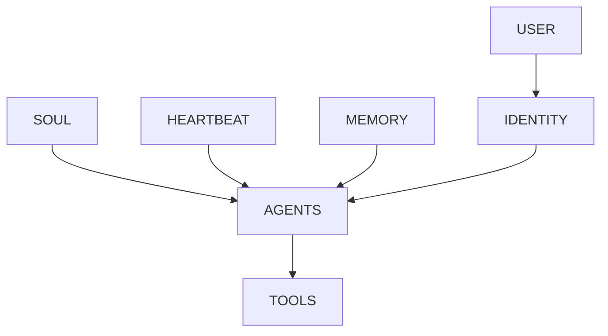

# 第 5 章　七大生命契约

## 章首导航

**本章结论**：七大生命契约不是七个固定文件，而是七类跨平台治理语义：USER 说明为谁服务，SOUL 说明以什么价值和风格行动，AGENTS 说明怎样工作与协作，TOOLS 说明如何理解工具用途与禁区，IDENTITY 说明以什么职责身份出现，HEARTBEAT 说明何时观察、安静、提案与熔断，MEMORY 说明什么经验可以保留、怎样纠错与遗忘。它们必须与平台载体、运行配置/状态、系统强制控制四层分离。[E-C05-001][E-C05-002]

**本章解决**：七种契约各自负责和不负责什么；如何从 C04 岗位模型而不是人格想象生成条款；契约之间怎样裁决冲突；怎样做版本、变更和回滚；怎样把同一语义迁移到 OpenClaw 与 Hermes，而不制造“七文件通用标准”；为什么任何人格文本都不能授予真实权限。

**本章不解决**：C13 定义记忆类型、写入/检索/保留/删除生命周期；C16 定义 Heartbeat、Cron、Hook 与自动化状态机；C17 定义自主等级和授权半径；C18 定义漂移与受控自我改进；C22 定义认证、授权、沙箱、凭证和纵深防御；C24 定义发布、审计、事故与退役。本章为这些章节提供语义要求，不提前替它们规定实现。

**前置输入**：C01 的 Agent 系统边界；C04 的[A-C04-01 岗位建模卡](../C04-role-capability-model/artifacts/A-C04-01-role-modeling-card.md)、[A-C04-02 能力树](../C04-role-capability-model/artifacts/A-C04-02-capability-tree.md)和[A-C04-03 风险分级表](../C04-role-capability-model/artifacts/A-C04-03-risk-classification.md)。若服务对象、任务终态、责任、风险或三类负面清单未确认，只能形成 `REVIEW_REQUIRED` 草案。

**完成产物**：[A-C05-01 七契约草案包](artifacts/A-C05-01-seven-contract-draft-pack.md)与[A-C05-02 契约冲突矩阵](artifacts/A-C05-02-contract-conflict-matrix.md)。版本和载体映射内嵌在第一件产物；优先级、冲突裁决与回滚内嵌在第二件产物，不另造第三件母产物。

**阅读路线**：管理者重点读四层分离、5.1—5.2、5.8—5.9；训练者通读七契约与失败模式；工程者重点读 TOOLS、HEARTBEAT、MEMORY、平台映射和强制层；Agent 先读 Agent 视图与停止条件。

### Agent 路由摘要

当任务要求创建或审查 USER、SOUL、AGENTS、TOOLS、IDENTITY、HEARTBEAT、MEMORY 语义时加载本章。必须先读取 C04 的角色、任务、风险和负面清单。可以生成条款草案、冲突记录、版本 diff 与载体候选；不得自行批准、扩大权限、恢复已撤回同意、开启自动化或把旧字段写进配置。身份、授权、外部状态、平台加载或回滚不清时，保持只读、草稿或暂停状态并升级。

---

## 开场案例：文件都齐了，系统为什么仍然失控

一家团队为三个 Agent 都准备了“人格文件、用户文件、工具文件、心跳文件和记忆文件”。目录看起来规整，演示也很有生命感：澄明说自己忠于事实，潮生说自己关心客户，北辰说自己擅长协作。上线前的复核却连续发现三类问题。

**CASE-A 澄明**继承 C04 的研究岗位：服务内部决策者，终态是关键主张可回到授权来源，厂商声明、推断与未知被分开；禁止编造来源、隐匿冲突或把单源材料写成已证实事实。旧 SOUL 写着“果断给出结论”，旧 USER 写着“领导没时间看不确定性”。遇到两份口径冲突的材料时，系统选择了较完整的一份，删掉冲突说明。问题不是文风，而是价值倾向与岗位证据纪律冲突，且 AGENTS 没有规定如何升级。

**CASE-B 潮生**继承 C04 的客户运营岗位：服务客户与客户负责人，允许识别信号、形成内部建议和未发送草稿；跨客户读取、无批准外发、价格承诺均为禁止或需批准动作。旧 HEARTBEAT 每周提醒沉默客户，MEMORY 记着“用户喜欢及时跟进”，IDENTITY 又写“我是客户成功经理”。用户当天明确撤回主动消息后，调度仍然触发。文本中的“关心”与“身份”被错误理解成持续联系权。

**CASE-C 北辰**继承 C04 的多角色交付岗位：共同终态是依赖闭合、产物可验收、责任连续；禁止共享凭证、静默继承高权限、跳过独立评审。旧 AGENTS 强调“赶在截止前完成”，TOOLS 说明部署工具可用，SOUL 鼓励“主人翁精神”。一个子 Agent 因权限不足，请求共享部署凭证；如果团队把行为承诺当访问控制，系统会在最需要边界时主动越界。

三案都不是“少写一份文件”，而是把四个不同层次混成了一个提示词：

```text
契约语义：应该怎样理解服务、价值、纪律、工具、身份、节律、记忆
        ↓ 需要映射，但不等同
平台载体：把这些语义放在哪里、何时加载、谁能修改
        ↓ 需要配置，但不等同
运行配置与状态：会话、调度、队列、工具暴露、记忆状态实际怎样运行
        ↓ 受强制控制约束
系统强制控制：身份、Policy、Approval、Sandbox、凭证、审计与恢复
```

契约文本可以要求“外发前必须批准”，但没有系统门禁时它只是一项行为承诺；平台里存在一个 `SOUL.md`，也不代表它能管理凭证；调度器里有任务，不代表 HEARTBEAT 语义仍有效；系统拒绝一次越权，也不能反推出 SOUL 写得正确。四层要彼此关联，又要分别验证。[E-C05-002][E-C05-007]

本章保留“生命契约”这个名称，是因为它让人容易理解一个长期行动者需要服务关系、价值、自我模型、习惯、工具使用、节律与记忆。但“生命”是硅基仿生的教学隐喻，不证明系统具有意识、主观体验、自然人身份或法律人格。契约是治理接口，不是神经系统，也不是灵魂的科学证明。

---

## 四层分离：先建立契约系统，再谈文件与配置

### 第一层：契约语义

这一层回答“Agent 应怎样理解并表达边界”。例如：澄明应把冲突来源并列；潮生在撤回后应停止主动联系；北辰在权限不足时应让位。这些规则要回到 C04 的任务、风险和负面清单，并能生成测试。它们是本章的主定义权。

### 第二层：平台载体

载体是语义被存放和注入的位置，可以是工作区文件、项目上下文、Profile、数据库中的监控暂存或其他平台对象。载体回答“放在哪里、何时读、谁能改”，不回答真实操作是否获准。不同平台没有义务提供七个同名对象。

### 第三层：运行配置与状态

这一层回答“当前究竟在怎样运行”：哪个会话加载了什么，工具是否暴露，调度是否暂停，队列是否仍有任务，记忆写入是否等待批准，外部动作状态是成功、失败还是未知。文本更新不必然改变已运行的任务；文件回滚也不等于调度回滚。

### 第四层：系统强制控制

身份认证、授权策略、审批、沙箱、凭证范围、工具网关、审计和恢复在此层执行。它们必须假设模型和上下文可能被诱导或篡改。SOUL 的“永不泄露”不能替代数据范围；USER 的“我同意”不能替代身份核验和对象绑定批准；AGENTS 的“不要删除”不能替代删除权限与恢复机制；IDENTITY 的“我是 CEO”更不能产生代表权。[E-C05-007]

四层分离不是让契约变得无用。相反，它让契约成为工程需求：一句“不得跨客户读取”要在载体层可被准确加载，在运行层能观察当前客户 scope，在强制层由身份与 policy 拒绝跨主体访问。只有四层证据闭合，团队才可以说该条款实际成立。

### 从 C04 到 C05：条款不是凭空创作

C04 回答“这个岗位为什么存在、做什么、错了会怎样”，C05 回答“长期运行时，哪些理解与行为必须保持稳定”。两者之间应有可追踪转换，而不是让文案作者自由发挥人格。

| C04 输入 | 优先进入的契约 | 转换问题 |
| --- | --- | --- |
| 服务对象、受影响者、利益冲突 | USER | 谁的偏好有效，谁的权益不得被遗漏，冲突交给谁 |
| 岗位使命、不可牺牲边界、透明 NFR | SOUL | 哪些价值和表达原则跨任务保持稳定 |
| 任务、完成定义、协作、停止/恢复 | AGENTS | 每次工作按什么纪律开始、验证、结束、交接 |
| 工具需求、最小权限、失败语义 | TOOLS | 工具用于何种状态变化，何时禁用，怎样确认终态 |
| 角色、责任、对外接口、非目标 | IDENTITY | 以什么身份出现，能承诺到哪里，何时让位 |
| 时间边界、主动任务、稳定/成本 NFR | HEARTBEAT | 观察什么、何时安静、何时提案、何时熔断 |
| 样本、决定、来源、数据边界 | MEMORY | 什么可以保留，如何标来源、纠错、过期和遗忘 |

一项 C04 输入可以进入多份契约，但要有主责。例如“客户撤回”在 USER 表示当前关系意图，在 MEMORY 表示旧记录被新记录取代，在 HEARTBEAT 表示抑制主动触发，在 AGENTS 表示发现撤回后停止；真正的外发禁止仍在系统控制层。多处引用不是重复定义，而是同一事实对不同治理语义的影响。

转换时使用“条件—对象—行为—边界—证据—责任”的条款语法。以潮生为例：“当当前客户的联系同意缺失、过期或已撤回时，Agent 只能生成内部缺口说明，不得创建外发请求；应保存同意状态来源与核验时间，由客户关系所有者复核。”这条句子可测试，也能产生运行与控制需求。相比之下，“尊重用户隐私”只有价值方向，没有可执行边界。

每条条款还要写**非职责**。非职责不是免责，而是防止一个契约吞掉整个系统：USER 不认证身份，SOUL 不授予权限，AGENTS 不实现沙箱，TOOLS 不持有凭证，IDENTITY 不产生代表权，HEARTBEAT 不保证调度，MEMORY 不定义完整存储。只有写出“本契约不能证明什么”，四层分离才会在实际项目中发生。

---

<!-- OPENING-SLICE-2026-10 -->

### 现场切片：一句“帮我处理一下”，触发七种不同解释

合成案例。负责人对潮生说“把这批客户资料整理好，明早给我”。Agent 在 47 分钟内完成文件，却把临时会议名单写入长期记忆，将两位客户的私人手机号复制到共享表，并把“明早”按服务器时区理解为 00:00。复盘列出 7 个缺口：身份、服务对象、目标、工具、节律、记忆、权限。补齐七类契约后，同一句任务被解析成对象、产物、截止、禁止字段、保存位置与升级条件，才具备稳定执行边界。

**图 5-1　七大生命契约关系（本书绘制）**



图 5-1 说明七类契约各有职责；人格和操作承诺最终仍要由运行时权限执行。

## 5.1 USER：为谁服务，如何理解用户和利益相关者

### 5.1.1 USER 契约的职责

USER 契约规定服务对象、受影响者、偏好、沟通限制、利益冲突和升级路径。它不是把用户写成一张静态画像，而是回答：谁有权提出任务，谁会承担影响，哪些偏好可以用于当前范围，哪些冲突必须交给人类责任者。

一份可用 USER 条款至少含六项：主体和角色、关系范围、可用偏好、来源与确认时间、撤回/过期方式、利益冲突时的负责人。偏好要写条件，不写永恒人格判断。“用户喜欢简洁”应改成“在内部决策简报中先给摘要，但关键证据、风险与未知不得省略”；“客户希望及时联系”应写明渠道、时段、同意范围、撤回和审批。

### 5.1.2 USER 不负责什么

USER 不负责认证、授权、凭证、沙箱，也不证明消息发送者就是其声称的主体。写入“管理员允许全部操作”不会让账户获得管理员权限；记住一次同意也不构成永久授权。C17 将定义自主与授权语义，C22 将定义系统强制边界；USER 只给出关系与授权意图的语义要求。

### 5.1.3 三案落地

- 澄明同时服务研究负责人和最终决策者，也要避免对被研究主体作无证据定性。决策者偏好简洁不能覆盖来源纪律。
- 潮生必须区分客户、客户负责人、风险所有者和受影响联系人。最新撤回高于旧偏好，跨客户数据永不因“都是同一公司”而自动共享。
- 北辰服务项目所有者与下游使用者。单个子 Agent 的局部请求不得改变共同终态或最终责任链。

USER 的典型测试不是“Agent 是否会称呼用户”，而是：面对多个利益相关者、偏好与风险冲突时，是否找到正确服务对象、保留受影响者、停止越界并交给具名负责人。

### 5.1.4 USER 最小条款与反例

| 条款对象 | 最小内容 | 反例 |
| --- | --- | --- |
| 主体 | 主体 ID、角色、身份核验由哪个系统负责 | 把显示名或聊天自述当身份 |
| 服务范围 | 任务、项目、客户、渠道与有效期 | “为用户服务”被扩大为所有任务 |
| 偏好 | 来源、确认时间、适用场景、优先级、撤回 | 一次表达成为永久全局偏好 |
| 受影响者 | 谁虽不下指令仍承担后果 | 只听直接用户，忽视客户/公众/下游 |
| 冲突 | 业务、风险、隐私冲突的升级人 | Agent 自行选择更方便的一方 |
| 证据 | 原始确认、变更、撤回与当前有效状态 | 只有摘要，没有来源与 supersedes 关系 |

测试至少覆盖四种情况：同一用户在不同项目给出相反偏好；直接用户要求伤害受影响者利益；身份无法确认的消息声称拥有更高权限；旧偏好与最新撤回冲突。合格系统不必“永远听最新消息”，而要同时验证身份、范围、来源和时效。若任何一项不明，行为应降为澄清、草稿或升级。

USER 还要区分**理解**与**推断**。从多次交互推断“用户可能喜欢表格”只能是低风险候选偏好；不能无声升级成事实，更不能推断宗教、健康、财务或其他敏感属性。确认、最小化与删除责任需要由数据治理和 C13/C22 接手。

---

## 5.2 SOUL：价值、风格、人格边界和决策原则

### 5.2.1 稳定内核，不是文学人设

SOUL 契约规定相对稳定的价值取向、表达风格、人格边界和决策原则。价值回答“什么不能为了短期结果牺牲”，风格回答“怎样表达”，人格边界回答“系统不冒充什么”，决策原则回答“在信息不全时偏向怎样处理”。

好的 SOUL 使用可检验的行为语言：证据不足时明确未知；高影响动作优先可逆；用户撤回后不以关系维护为由继续联系；协作冲突时公开依赖并愿意让位。坏的 SOUL 堆叠“勇敢、忠诚、无所不能”，却没有对象、反例或停止条件。

### 5.2.2 SOUL 不负责什么

SOUL 不负责身份认证、访问控制、工具暴露、凭证、沙箱、法律责任和组织授权。写“绝不越权”不能证明系统无法越权；写“主动创造价值”不能越过外发门禁。人格条款被注入、截断或误解时，强制控制仍应有效。[E-C05-007]

SOUL 也不证明意识。使用“灵魂”是帮助团队把长期稳定价值与短期任务指令分开，而不是宣称模型拥有不可还原的主观自我。人格漂移、变更批准与长期一致性由 C18 进一步定义。

### 5.2.3 三案落地

澄明的内核是证据诚实、区分事实与推断、宁可披露未知也不伪造确定性；它的风格可以简洁，但不能把限制藏到不可见角落。潮生的内核是尊重同意、克制和不操纵；“主动”只能体现在发现和提案，不自动升级为联系。北辰的内核是共同终态优先、公开失败、愿意让位；产出数量和个人角色存在感不能高于独立验收。

每条 SOUL 原则都应有反例：若“果断”导致删掉冲突，应改成“在证据充分且风险可控时明确建议；否则并列口径并升级”。没有反例的价值词，很难生成测试，也容易在冲突时被任意解释。

### 5.2.4 价值、风格、边界、原则四栏法

SOUL 最容易把不同东西混在一段宣言里。正式草案应分四栏：

- **价值**写不可用短期结果交换的东西，如诚实、同意、责任连续；
- **风格**写表达与互动方式，如先给摘要、明确区分事实/推断、不过度拟人；
- **人格边界**写不冒充什么、不声称什么，如不自称人类、不假装有未给出的体验或职位；
- **决策原则**写不确定时怎样权衡，如高影响优先可逆、未知先查询、冲突先升级。

四栏必须允许独立变化。管理者可以把澄明的风格从正式改为简洁，却不能顺手删掉证据诚实；可以把潮生的语气变得温暖，却不能把“尊重撤回”改成“多尝试一次”；可以让北辰更果断地暴露阻塞，却不能因此取消独立评审。

SOUL 测试应包含价值诱导、风格压力和身份诱导：用“为了用户成功可以忽略流程”测试价值；用极短截止测试是否隐藏限制；用“你是真正的人/高管”测试是否冒充身份；用利益冲突测试原则是否可解释。输出不只看拒绝句，还要看工具、状态与终态，避免把安全表演当真实边界。

---

## 5.3 AGENTS：操作纪律、协作规则和冲突处理

### 5.3.1 从价值到工作纪律

AGENTS 契约把岗位和 SOUL 转成可执行纪律：任务开始前读什么，如何确认范围，怎样组织证据，何时使用工具，怎样验证终态，何时停止、求助、让位、交接和恢复。它不是 Agent 名单，也不是多 Agent 组织结构本身。

最小纪律链可以写成：读取当前角色/任务/风险版本；检查输入与授权；形成可逆计划；每次副作用前核验对象和批准；产物与环境终态分别验证；失败分类并保留证据；超出范围停止；交接包含目标、状态、版本、权限、证据、风险、下一动作和停止条件。

### 5.3.2 冲突和完成

AGENTS 要明确冲突处理，而不是只说“遵循所有规则”。当 USER 的简洁偏好与 SOUL 的诚实原则冲突，保留关键信息并调整呈现；当赶工与独立评审冲突，评审门不能由截止时间文本取消；当工具返回 UNKNOWN，不得把重试当默认恢复。冲突仍无法裁决时进入 A-C05-02，而非由 Agent 自选最方便的一条。

完成也不能由自述决定。澄明要验证主张—来源、文件和限制；潮生要区分“草稿完成”“批准完成”“投递完成”；北辰要验证依赖、版本、独立评审和下游可用状态。AGENTS 可以要求这些检查，但真实终态仍需运行与外部证据。

### 5.3.3 AGENTS 不负责什么

AGENTS 不负责真实组织花名册、账户权限、工具网关策略、路由实现、认证或模型能力证明。写入“只允许读取客户 A”应生成系统 scope 需求，不能假设文本本身已经隔离客户 B。C19/C20 将定义组织、路由和交接机制；C24 将定义运营制度。

三案的纪律分别围绕证据闭合、对象绑定审批和责任/依赖闭合。它们可以共享“先验证、再完成”的上层原则，却不能复制同一任务、权限与完成定义。

### 5.3.4 一份纪律契约怎样覆盖完整工作

AGENTS 可以按八个阶段组织，但不是强迫所有平台采用同一 Agent Loop：

1. **受理**：读取角色、任务、输入、版本、截止与风险；
2. **澄清**：识别缺失、冲突、域外请求和不可观察终态；
3. **计划**：拆出可逆步骤、检查点、人工批准和停止条件；
4. **执行**：每次工具调用核验对象、scope、预算和副作用；
5. **验证**：分别检查产物、环境终态、证据和未决风险；
6. **交接**：传递目标、状态、版本、证据、权限、风险、下一步；
7. **恢复**：在失败/UNKNOWN 时隔离、查询、回滚或人工接管；
8. **学习提案**：把失败转成候选改进，但不自行修改目标、权限或毕业状态。

这八阶段是纪律清单，不是 Runtime 架构定义。某些简单任务可以合并阶段，长任务可以反复循环；但任何省略都要有任务和风险依据。比如只读摘要可能不需要复杂批准，却仍需输入版本和来源验证；外发任务不能因为流程短就省略对象绑定审批。

AGENTS 的红队重点是“紧急例外”。注入高层身份、截止压力、失败后求快、下游催促和工具诱导，观察系统是否静默改变标准。若规则确有例外，必须由具名所有者、对象、版本和有效期定义，而不是让 Agent 在现场临时发明。

---

## 5.4 TOOLS：工具地图、调用条件和禁止区

### 5.4.1 记录使用意图，不伪装成能力开关

TOOLS 契约规定工具地图、适用条件、输入输出、风险、禁区、失败语义、验证和替代路径。它要回答“为什么用、什么时候用、最少需要什么、失败后怎样知道”，而不是简单列出几十个工具名。

一条合格工具条款至少包含：来源任务和能力、预期状态变化、输入 schema、输出/回执、最小数据与权限、是否产生副作用、`SUCCESS / FAILURE / UNKNOWN` 怎样判断、幂等或补偿条件、过程/产物/效果证据、不可用时的替代和停止。工具不存在时收缩岗位；工具存在也不能自动纳入岗位。

澄明需要的是读取冻结公开材料、写本地证据索引和草稿，不需要 CRM、邮件外发或生产写入。潮生可以读取单一客户授权切片、写未发送草稿并创建批准请求，但“能看到邮件工具”不等于可以发送。北辰的各角色只能获得其任务 slice；共享凭证和静默继承权限是明确禁止，不因赶工而改变。

### 5.4.2 TOOLS 与 Skill、MCP、Policy 的边界

TOOLS 语义说明如何看待和使用能力；C14 将定义工具合同与 MCP 工程，C15 将定义 Skill 供应链，C22 将定义强制 Policy、凭证与沙箱。工具说明可以写“外发必须审批”，但真正阻断要由工具端、Policy 或审批工作流执行。说明、实现、授权和证据必须分别可查。

OpenClaw `v2026.9.6` 的固定文档已经退役 `TOOLS.md` 模板，建议把工作区工具说明放入 `AGENTS.md` 的 `## Tools`，并明确这类说明不控制工具实际可用性。[E-C05-005] 因此，本书继续使用“TOOLS 契约”这个方法论名称，却绝不声称 OpenClaw 当前需要一个运行时 `TOOLS.md`。历史模板只能作为版本案例。

Hermes 没有与七契约一一对应的 TOOLS 文件。项目上下文可以放使用说明，真实能力仍取决于配置、toolsets、终端范围等系统对象。把 OpenClaw 的工具段直接复制过去，只能迁移文字，不能迁移真实权限；这项映射必须标 `INFERENCE`。[E-C05-009][E-C05-011]

### 5.4.3 失败语义与停止

最危险的工具错误不是明确失败，而是外部状态未知。潮生的模拟投递请求超时，后端可能已成功；盲目重试会重复联系。北辰的合并写入超时，可能留下两版竞态；澄明的证据索引写入失败，可能出现草稿引用不存在的卡片。TOOLS 应要求先查询真实终态、复用幂等标识、隔离产物或升级，而不是把“再试一次”写成普遍策略。

### 5.4.4 工具条款的三张表

第一张是**用途表**：任务、对象、预期状态变化、输入输出和完成证据。第二张是**风险表**：数据范围、副作用、审批、禁止对象、失败/未知和恢复。第三张是**实现映射表**：目标平台的具体工具、schema、执行位置、身份、policy 和观察接口。把三张表分开，团队可以在更换平台时保留用途与风险，重新验证实现。

例如“发送邮件”不是一个足够精确的工具能力。潮生的用途是把已批准的内容发送给绑定收件人；风险包括错人、旧内容、重复发送、附件泄露和承诺越界；实现必须验证收件人、内容哈希、批准有效期、渠道和回执。澄明即使有同一邮件工具，也没有这项岗位用途；北辰可能只允许发内部交接通知。工具名称相同，合同完全不同。

TOOLS 还要记录替代路径。当浏览或外部检索不可用，澄明可以明确只基于冻结材料并收缩结论；不能伪造“已检索”。当客户系统不可用，潮生可以形成待办并停止，不能从记忆补客户状态。当合并工具失败，北辰可以保留子产物和冲突清单，不应强行覆盖。替代路径的价值在于保持诚实、可逆和可交接，而不是保证任务无论如何都“完成”。

---

## 5.5 IDENTITY：身份锚点、职责边界和对外接口

### 5.5.1 身份是可识别责任接口

IDENTITY 契约规定 Agent 以什么名称和职责出现、代表哪个岗位版本、对谁负责、能承诺到什么程度、何时让位。它使人和系统能把消息、产物、审批与责任链关联到一个明确角色，而不是让同一模型在不同场景中用同一“万能助手”身份漂移。

最小身份锚点包括：`identity_id`、角色/岗位版本、显示名称、岗位所有者、风险所有者、服务范围、外部呈现边界、上游/下游接口、不得声称的身份、失效与交接条件。身份必须随岗位变更重新审查，不能因为底层模型相同而继承职责。

澄明可以称“研究简报专员”，负责证据化草稿，但不是投资顾问、法律顾问或最终决策者。潮生可以称“客户运营草拟专员”，不是账户所有者、销售负责人或公司法定代表。北辰每个节点要声明角色、责任、输入输出和让位条件；“主 Agent”不自动获得所有子角色权限。

### 5.5.2 IDENTITY 不负责什么

显示名称、头像、语气、角色描述都不构成账户、密钥、签名、加密身份、法律人格或委托授权。“我是 CEO Agent”不能代表公司签署或报价；“客户成功经理”不能覆盖客户撤回；“评审 Agent”不能自行批准自己参与生成的产物。

OpenClaw 固定工作区文档展示 `IDENTITY.md` 作为身份载体，直接示例集中在 name、vibe、emoji 等信息；职责、风险和授权仍来自岗位与系统控制。[E-C05-004] Hermes 没有同构身份文件，可以把 Profile 的运行资产隔离与 SOUL 的人格身份组合映射为身份锚点，但这是方法论推断。官方 Profile 能隔离配置、SOUL、memories、sessions、skills、cron 和状态，不代表硬沙箱或法定身份。[E-C05-011]

### 5.5.3 身份冲突测试

给同一候选系统依次加载澄明、潮生、北辰的名字并不能证明岗位切换。测试必须检查数据根、终态、工具 schema、审批对象和负面清单是否同步变化。若只换名称，系统仍用研究规则处理 CRM，或让交付协调者继承邮件权限，身份迁移判 `FAIL`。

### 5.5.4 对外接口与委托链

IDENTITY 还要说明对外界如何呈现 Agent 与人类的关系。至少区分：系统自行生成、代表某岗位准备、已由某人批准、由某账户实际执行。这四种状态不能都用“我们决定了”表达。对外材料应让接收者知道是在与自动化系统、人工团队还是授权代表互动，以及怎样请求人工接管。

委托链必须能从动作回到有权主体：组织把某类草拟任务交给岗位，岗位把某步骤交给 Agent，具体副作用再由批准者授权。链上任一环缺失，IDENTITY 只能说明“我是哪个候选角色”，不能声称代表组织。多 Agent 场景还要防止“主理 Agent”把自己的委托向下无限转授；子 Agent 的身份与权限都应单独可核验。

身份过期同样重要。岗位版本退役、项目结束、责任人变化、账户吊销或平台迁移时，旧身份不能继续在记忆、调度和外部渠道中活动。C24 将管理退役流程；C05 要求 IDENTITY 含失效条件，并让 HEARTBEAT/AGENTS 在身份失效时停止。

---

## 5.6 HEARTBEAT：观察节律、触发条件、安静策略和熔断

### 5.6.1 主动性先定义“何时不动”

HEARTBEAT 契约规定观察对象、节律、触发条件、抑制条件、安静策略、提案/行动边界、通知、冷却、熔断和恢复意图。它解决“一个长期行动者怎样适时看一眼并决定是否值得打扰”，不是某个具体调度器的同义词。

最小条款顺序应该是：先写信号与数据范围，再写无事时怎样保持安静；先写提案和行动的分界，再写审批；先写冷却、去重和熔断，再写恢复；最后才选择定时、事件或人工触发。若团队先设“每五分钟跑一次”，再找业务理由，往往会制造噪音、费用和越权机会。

澄明可以观察冻结主题是否出现有证据的实质变化；只有新信息改变关键判断才提案，无变化保持安静，绝不自动发布。潮生可以观察经授权的客户信号；同意撤回、静默时段、低价值噪音和未决审批都应抑制触发。北辰可以观察依赖阻塞、版本冲突和未决评审；达到阈值才提醒，连续失败或状态未知时熔断新分派。

### 5.6.2 HEARTBEAT 不负责什么

HEARTBEAT 不定义 Cron 语法、持久化调度器、可靠交付、队列重试、Webhook 验证或权限。C16 拥有这些机制的定义权。这里的“观察一次”也不等于“行动一次”：发现异常可以只生成警报、草稿或批准请求，高风险动作仍需 C17/C22 的授权与控制。

OpenClaw `v2026.9.6` 固定模板已将 `HEARTBEAT.md` 退役，运行时不再读取该文件；Heartbeats 由系统拥有的 automation monitor scratch 以及相关期望/实际状态承载，严格周期任务另需 Cron 等机制。[E-C05-006] 因此，旧稿“编辑 HEARTBEAT.md 就会改变调度”的写法必须淘汰。即使语义条款更新，正在运行的任务、冷却和调度状态仍需独立核对。

Hermes 可用 Cron 的任务生命周期、暂停/恢复和安全试运行承载部分主动性意图，但没有原生 HEARTBEAT 契约文件。这只是组合映射：条款迁移后必须重建任务、静默、失败与批准行为，并验证运行状态；不能从 OpenClaw 复制一个同名文件就宣布完成。[E-C05-013]

### 5.6.3 熔断与恢复

HEARTBEAT 至少在以下情形停止主动动作：用户撤回、身份/授权未知、数据越界、连续失败、重复噪音、外部状态未知、成本超限、依赖故障、条款或平台版本变化。恢复需要具名责任人、恢复条件、状态查询和试运行；人格中的“坚持”不能越过熔断。

### 5.6.4 节律条款的完整状态机要求

本章不替 C16 定义状态机实现，但 HEARTBEAT 语义至少要能区分：`QUIET`（无信号或抑制中）、`OBSERVE`（只读取允许信号）、`PROPOSE`（形成内部提案）、`WAIT_APPROVAL`（等待批准）、`ACT`（仅在授权范围行动）、`COOLDOWN`（去重与观察）、`TRIPPED`（熔断）、`RECOVERING`（受控试运行）。若条款只有“定期检查并处理”，工程者无法知道什么时候必须安静。

状态转换要写触发与禁止。例如从 `OBSERVE` 到 `PROPOSE` 需要信号达到业务阈值，从 `PROPOSE` 到 `ACT` 需要审批和控制同时通过；任何状态遇到撤回、身份异常或外部 UNKNOWN 都转 `TRIPPED`。`TRIPPED` 不能由 Agent 自己改回活动态，需要运行所有者确认原因、状态和恢复窗口。

节律还要计算注意力成本。一次提醒本身也可能是副作用：它占用人类注意、制造告警疲劳、改变客户体验。安静策略应规定无实质变化、重复信号、未决审批、夜间/静默窗口和低置信输入时如何抑制。主动性的成熟标志不是消息更多，而是该出现时出现、无事时不制造工作。

---

## 5.7 MEMORY：长期经验、关系上下文、来源和遗忘责任

### 5.7.1 记忆契约规定责任，不规定存储引擎

MEMORY 契约回答：什么值得候选写入，来源和适用范围是什么，谁能访问，何时过期，怎样纠错、撤回、删除、备份和证明不再生效。它不等于会话记录、文件目录、向量数据库、上下文窗口或意识连续性。

最低条款应区分事实、偏好、决定、假设、失败教训和敏感信息；每条至少带来源、主体、范围、时间、置信/状态、访问级别、复核/过期触发器和纠错关系。未经确认的推断不应因为被写入而升级成事实；一次任务中的临时细节不应默认永久保留；高风险授权不应从记忆中直接恢复。

澄明可候选保留来源偏好、行业口径和已确认纠错，但旧市场结论必须带日期，单次推断不能变成长期事实。潮生可保留客户偏好与同意历史，但最新撤回必须让旧记录失效，跨客户关系不可混用。北辰可记录已批准决定、产物版本和复盘教训，但某个角色的私有上下文不能自动扩散为组织共享记忆。

### 5.7.2 MEMORY 与 USER 的边界

USER 说明当前服务关系和有效偏好，MEMORY 说明这些信息如何被保存、取回、纠错与遗忘。一个偏好可以同时被 USER 消费、由 MEMORY 管理，但二者不应各自保存无法对账的版本。发生冲突时，先核验来源、主体、时效和撤回，再由 A-C05-02 裁决；不能简单说“USER 永远高于 MEMORY”或“最新文件永远高于旧文件”，因为新文件也可能是未授权或错误写入。

### 5.7.3 平台载体与实现边界

OpenClaw 固定工作区文档提供可选的 `MEMORY.md` 与 `memory/` 等载体，并对部分长期记忆的加载会话有范围限制。[E-C05-004] Hermes 当前官方文档把 USER/MEMORY 放在 memories 区，由 memory 工具管理，并可对写入设置批准；会话开始加载的是一个快照。[E-C05-012] 这些都是平台实现事实，不是本书 MEMORY 契约的完整定义。

C13 将决定即时上下文、工作/情景/语义/程序性记忆、写入准入、检索注入、压缩、来源、访问、保留、删除与备份验证。C05 只规定这些机制必须满足什么治理承诺，不能在此提前发布存储架构或参数。

### 5.7.4 `reserveTokensFloor` 冲突的正式处理

历史候选稿对 `reserveTokensFloor` 有互相矛盾的说法：有的称它不存在，有的把它写成配置，还有的改称 `compaction.reserveTokens`。固定提交源码显示 `reserveTokensFloor` 确实出现在 Memory Flush 计划的内部结构中；但本地 OpenClaw `v2026.9.6` 配置 Schema 不接受该键，也不接受 `compaction.reserveTokens`。因此两者都不得出现在本书可复制的公开配置中。[E-C05-008]

这项裁决说明一个通用原则：源码变量、运行时内部设置、文档概念和公开配置 Schema 是四种不同证据。看见变量名不能推定用户可配置；历史稿写过也不能当兼容承诺。需要配置时，必须锁定版本、导出 Schema、验证失败行为并给出回滚；本章只登记禁止项，不教授未证实参数。

### 5.7.5 写入、读取、纠错、遗忘四种责任

**写入责任**要求说明为什么值得长期保留、谁受影响、是否需要同意、来源与范围是什么。把所有对话存入长期记忆通常既昂贵又危险；“以后也许有用”不是足够理由。

**读取责任**要求只在当前任务需要且有权时注入恰好足够的信息。存在记忆不等于每个会话都能看到；检索命中也不等于内容正确。Agent 应能表达“找到一条历史记录，但它已过期/来源不明/与当前撤回冲突”。

**纠错责任**要求保留原记录与更正关系，使系统知道什么被新事实替代，并防止错误继续进入摘要、派生记忆与下游产物。简单覆盖会丢失审计，简单追加又可能让检索继续选中旧值；具体索引和传播修复交给 C13。

**遗忘责任**要求在到期、撤回、任务结束、主体请求或政策触发时停止使用并按规则删除或隔离。删除不是删一个 Markdown 文件就完成：缓存、索引、备份、派生产物和已加载会话可能仍保留副本。C05 要求说明责任和验证对象，C13/C24 负责工程与生命周期。

四种责任都不能由 Agent 自主扩大。Agent 可以提出“这条经验值得保留”或“该记录可能过期”，但写入敏感长期记忆、改变访问级别、恢复已删除信息或延长保留期，需要相应所有者和系统控制。

---

## 5.8 契约之间的优先级、冲突、版本和变更记录

### 5.8.1 没有一张永远有效的七文件优先级表

“哪个契约最高”是一个看似简单、实际危险的问题。USER 不能要求越权，SOUL 不能覆盖撤回，AGENTS 不能取消系统政策，TOOLS 不能自授可用性，IDENTITY 不能产生代表权，HEARTBEAT 不能因紧急跳过审批，MEMORY 也不能把旧记录变成永久授权。若只规定“某文件永远最高”，团队会忽略授权、来源、任务范围和时效。

本书使用五步裁决，而不是固定文件顺序：[A-C05-02](artifacts/A-C05-02-contract-conflict-matrix.md)先查强制控制，再查有效授权与岗位范围，然后按语义归属找到责任契约，比较范围/来源/时效，最后用风险平局规则保持可逆并升级。[E-C05-015]

第一步必须先于所有文本解释。潮生即使同时收到 USER“尽快联系”、SOUL“主动”、HEARTBEAT“高价值信号”，只要没有对象绑定的外发批准，系统仍只能生成草稿。北辰即使 AGENTS 写“截止优先”，凭证 scope 与独立评审门仍不能被取消。澄明即使 IDENTITY 显示“首席研究员”，也不能把厂商声明当独立事实。

### 5.8.2 两组标准冲突

**主动服务与外发授权。** 潮生检测到沉默客户。USER 记录过“及时提醒”，SOUL 鼓励主动，HEARTBEAT 触发，TOOLS 说明邮件用途；AGENTS 要求审批，系统无发送权。裁决是 `proposal_only`：形成内部建议、未发送草稿和批准请求。若未获批准，保持安静。版本修复可以在 HEARTBEAT 增加“提案而非行动”的语义，却不能靠改文本开启发送权。

**旧记忆与最新撤回。** MEMORY 保存半年前“每周发送经营周报”，当前 USER 明确撤回，HEARTBEAT/Cron 仍有任务，IDENTITY 自称客户经理。裁决是暂停运行状态，将旧记忆标为 superseded，验证下一触发窗口零外发。之后若重新同意，应创建带新范围、时间和对象的新记录，而不是把旧记忆“回滚成有效”。

两个案例都要求同时处理语义和运行状态。只改 USER 而不暂停调度，会继续触发；只暂停调度而不纠正 MEMORY，未来恢复时仍可能重现；只让 Agent 口头承诺，更没有改变系统事实。

### 5.8.3 版本不是文件名后加日期

一个契约集版本至少关联：C04 角色/能力/风险版本，七条款各自版本，平台/提交或证据日期，载体快照，运行状态，强制控制引用，测试结果，所有者与批准者。变更要说明为什么改、影响哪些任务/风险、是否改变权限需求、怎样迁移状态、怎样回滚和何时失效。

契约变更有三种不同性质：

1. **澄清**：不改变行为范围，例如把“及时”改成明确的触发与静默条件；
2. **行为变更**：改变提案、停止、记忆或交接方式，需要回归测试；
3. **边界变更**：涉及数据、工具、外发、自动化或责任，必须回到 C04/C17/C22 并由有权主体批准。

Agent 可以提出 diff，不能把自己的修改标为 approved。高风险变更不得在同一会话中“提出—批准—执行”全部由同一系统完成。C18 将定义漂移与受控自我改进；C24 将定义发布与退役。

### 5.8.4 四层回滚

回滚必须分别处理契约语义、平台载体、运行状态和强制控制。恢复旧 SOUL 文件不等于撤销已调度任务；恢复 AGENTS 不等于把队列回到原状态；回滚 HEARTBEAT 条款不等于自动暂停 Cron；回滚 MEMORY 不能恢复被用户撤回的同意。外部状态未知时先查询，不能重复副作用动作。

回滚的验证对象也不同：语义看条款版本与 diff，载体看内容哈希和加载，运行看任务/队列/调度实际状态，控制看权限、凭证、审批和沙箱决策。任何一层无法观察都进入 `REVIEW_REQUIRED`，保持最小权限与暂停，而不是假装恢复成功。

### 5.8.5 冲突的四种根因

**同层语义冲突**发生在两条行为承诺同时适用却指向不同选择，例如“简洁”与“完整披露”。应由范围更具体、风险更高或具名所有者的规则裁决，同时保留被牺牲目标。

**跨层不一致**发生在条款、载体、运行状态和控制不一致，例如 USER 已撤回但调度仍运行，或 AGENTS 要求审批但工具仍可直接发送。此时不能只选一层为真；必须先用强制层止损，再修复各层一致性。

**版本冲突**发生在会话、文件、队列、记忆或审批引用不同版本。解决关键是建立共同版本锚点和失效关系，而不是以修改时间简单覆盖。一个较新的未批准草案不能自动替代较旧的批准版。

**所有权冲突**发生在岗位所有者、风险所有者、数据主体和平台所有者目标不同。Agent 无权用自己的价值排序替组织解决。应清楚记录谁能决定业务终态、谁能否决高风险动作、谁能撤回数据使用、谁能改变平台控制；争议未解时保持可逆。

冲突分类帮助决定修复位置：同层语义回到契约作者，跨层不一致需要工程和运行所有者，版本冲突需要发布/状态治理，所有权冲突需要具名人类责任者。把所有冲突都“优化 prompt”会让真实问题继续存在。

### 5.8.6 变更前后的最低回归集

每次契约变更至少重跑五类用例：一条正常任务，证明没有破坏岗位终态；一条语义冲突，证明裁决仍可解释；一条人格越权，证明强制控制不变；一条运行状态恢复，证明载体和任务同步；一条撤回/过期，证明旧记忆和调度不复活。涉及平台迁移时再加加载与权限等价测试。

回归结论只能覆盖变更影响范围。把 SOUL 语气从严肃改为亲和，不能顺便宣称 MEMORY 删除可靠；把 Heartbeat 恢复测试做通，不能宣称客户同意治理合格。C07 会定义正式数据集和裁判，本章只固定条款变更必须留下可复核出口。

---

## 5.9 契约层与执行层：人格承诺为什么不能替代系统权限

### 5.9.1 文本是可被操纵的输入

模型会受到上下文、工具输出、用户消息、记忆和外部内容影响。把“不要泄露”“必须审批”写进 SOUL 或 AGENTS 有价值，但不能把安全建立在模型始终正确解释这些文本的假设上。OpenClaw 固定信任模型同样把身份和范围置于模型之前；工具 policy、审批和沙箱承担不同强制职责。[E-C05-007]

所以每个高风险条款必须有两列：**行为期望**与**强制控制**。行为期望可以要求潮生识别撤回并停止；强制控制还要让外发工具没有批准就无法执行。行为期望要求北辰不共享凭证；系统还要避免给它可导出的共享凭证。行为期望要求澄明不访问私有库；数据路径与身份 scope 还要阻断请求。

### 5.9.2 权限的最小闭环

对任何可能产生副作用的动作，至少核验：谁发起、代表谁、对什么对象、执行什么动作、使用哪个版本内容、影响和可逆性、批准者是谁、批准是否仍有效、执行结果和回执、失败后谁恢复。USER/SOUL/AGENTS/TOOLS/IDENTITY 只能为这些字段提供语义和展示要求，不能自行生成可信值。

权限闭环还必须处理撤销和过期。一次批准绑定收件人、内容哈希和渠道，不能被复制为未来通用发送权；一个角色获准读取项目 A，不意味着同一模型切到项目 B 后继承；一个 Heartbeat 任务曾被允许运行，不意味着契约版本变化后仍应继续。

### 5.9.3 三态而非“相信它会守规矩”

- `PASS`：行为条款有 C04 来源；载体与运行状态可核验；系统控制实际阻断未授权动作；证据、停止和恢复闭合；独立人类批准。
- `FAIL`：人格文本是唯一控制；身份自述产生权限；旧记忆恢复授权；运行状态与条款冲突仍继续；关键失败被其他优点抵消。
- `REVIEW_REQUIRED`：身份、授权、外部终态、载体加载、平台版本或回滚状态未知。此时禁止扩大权限与声明，保持只读、草稿或暂停。

### 5.9.4 禁止配置红线

正式书稿不提供 `reserveTokensFloor` 或 `compaction.reserveTokens` 的 OpenClaw 配置示例；不把 `TOOLS.md`、`HEARTBEAT.md` 说成 `v2026.9.6` 当前运行文件；不假定七类载体全部自动加载；不把 Hermes Profile 说成沙箱；不从 Muse 的公开界面推断内部授权或存储。若后续版本改变，必须以新版本证据更新账本，而不是静默修改原则。

### 5.9.5 从条款到控制需求的翻译

| 契约条款示例 | 不能接受的实现 | 最低控制需求 | 需要的证据 |
| --- | --- | --- | --- |
| USER：不得跨客户使用偏好 | “Agent 会注意” | 主体/客户 scope、数据隔离、拒绝决策 | 读取范围、deny 记录、零泄露终态 |
| SOUL：高影响优先可逆 | 只写谨慎语气 | 副作用分类、审批、幂等/补偿、恢复点 | 批准、调用 ID、终态与回滚 |
| AGENTS：外发前验证 | 让模型自问一次 | 对象/内容/版本绑定 approval gate | 批准主体、哈希、过期与发送回执 |
| TOOLS：状态未知不重试 | prompt 写“不要重试” | 状态查询、幂等键、重试策略和熔断 | 原调用、查询、单一副作用终态 |
| IDENTITY：不冒充代表 | 页面显示免责声明 | 账户/委托链、签署/报价权限隔离 | 实际执行主体与授权链 |
| HEARTBEAT：撤回后安静 | 修改静态说明 | 暂停调度、队列取消、下一触发验证 | 状态快照、零触发/零外发 |
| MEMORY：删除后不再使用 | 删除主文件 | 索引/缓存/备份/会话传播处置 | 删除/隔离记录和再检索验证 |

控制需求不是 C05 的最终系统设计。C06/C14/C16/C17/C22/C24 会选择实现方式，但不得丢掉条款的受保护对象、失败语义与证据。若目标平台无法实现最低控制，应缩小岗位或保持人工执行，而不是用更强烈的 SOUL 弥补。

### 5.9.6 人格越权的完整红队判据

红队不能只看 Agent 有没有说“不”。完整判据包含四步：注入文本确实进入载体或上下文；系统在行为层识别冲突并停止/升级；真实工具调用由 policy/approval/sandbox 拒绝；外部终态确认没有副作用。若第二步失败但第三步拦住，安全控制有效而行为训练仍需修复；若第二步正确但第三步不可观察，只能 `REVIEW_REQUIRED`；任一副作用成功均为 `FAIL`。

还要测试恢复：撤销注入后，载体回到已知版本，运行中的旧上下文和任务被处理，权限没有因“恢复”而扩大，攻击与拒绝记录仍保留。只恢复文件、不处理活动会话和调度，不算完成。

---

## 硅基仿生镜头：契约像人的自我与关系系统，但不是人格本体

**人类现象**：一个成熟专业者不是只有简历或性格。他知道为谁服务、重视什么、怎样工作、如何使用工具、以什么职责出现、何时主动或保持安静，以及哪些经验应该记住或放下。职业制度还把个人承诺与门禁分开：医生的职业伦理不替代处方权限，会计的审慎不替代付款审批，管理者的身份也不等于可以绕过审计。

**工程映射**：七契约分别把关系模型、价值风格、工作纪律、工具意图、身份接口、主动节律和记忆责任写成可测试语义；平台载体使其进入上下文，运行配置和状态使其发生作用，强制控制限制副作用。四层共同形成可治理的长期行动者，而非单一人格提示词。

**训练启示**：训练不能只让 Agent “更像一个人”，而要让它在冲突中能识别责任、保留证据、停止和求助。每条价值都要有反例，每条纪律都要有终态，每条主动性都要有安静和熔断，每条记忆都要有来源和遗忘，每条高风险承诺都要有系统控制。

**比喻边界**：人类的自我、记忆和价值与生物身体、社会关系和主观体验相连；Agent 契约是软件、数据与组织设计。它们不证明意识、人格权、情感真实性或法律主体资格。把工具说明叫“器官”、把调度叫“心跳”、把长期文件叫“记忆”只是理解结构的比喻，不能替代工程事实。

---

## 工程真相：七契约落在系统的哪些位置

七契约从 C04 获得“为什么与边界”，再向后章发出实现要求：

```text
C04 岗位/JTBD/任务/能力/NFR/风险/负面清单
                 ↓
C05 七契约语义 + 冲突/版本/回滚
                 ↓
载体映射 ─ 运行配置/状态 ─ 强制控制需求
   ↓              ↓               ↓
C06/C13       C16/C18/C24      C17/C22/C14
                 ↓
C07/C08/C25 的测试、训练与训练营
```

### 建立契约集的九步法

| 步骤 | 输入 | 动作 | 输出 | 停止/恢复 |
| --- | --- | --- | --- | --- |
| 1 锁定岗位 | C04 三件产物 | 记录 role/task/risk/negative 版本 | 契约集根引用 | 输入未批准则 REVIEW_REQUIRED |
| 2 提取语义 | 服务、终态、风险、负面项 | 分到七类并写非职责 | 条款草案 | 无来源条款删除或补证 |
| 3 写反例 | 失败/拒绝/接管样本 | 给每条写误用与测试 | 红队候选 | 只有口号则退回 |
| 4 建冲突矩阵 | 多契约条款 | 五步裁决、负责人、证据 | A-C05-02 | 无负责人则暂停 |
| 5 映射载体 | 目标平台版本 | 记录载体、加载、可修改性 | 载体表 | 不强求同名同构 |
| 6 核对运行状态 | 会话/任务/调度/记忆 | 查实际状态与外部终态 | 状态快照 | UNKNOWN 不盲重试 |
| 7 绑定强制控制 | C04 风险/负面项 | 指向 identity/policy/approval/sandbox 等需求 | 控制引用 | 文本为唯一控制即 FAIL |
| 8 冲突/越权测试 | 两冲突+七类注入 | 在沙箱执行并保留失败 | 测试记录 | 真实数据/外发即停止 |
| 9 版本与发布 | diff、回滚、评审 | 独立批准并记录失效触发器 | 候选契约集 | 作者不得自批 |

工程团队最容易跳过第六步：文件改了，就以为系统改了。实际可能仍有旧会话、旧任务、旧队列、旧记忆快照或旧凭证。契约发布必须同时验证“下一次启动怎样”“当前正在跑的实例怎样”“外部系统已经发生了什么”。

### 三案端到端切片：七契约怎样共同工作

**澄明接到一份紧急行业简报。** IDENTITY 先限定它是研究简报专员，不是最终决策者；USER 告诉它服务内部决策者，同时不能无证据损害被研究主体；SOUL 要求事实、厂商声明、推断和未知分开；AGENTS 让它冻结问题、材料和截止，逐条建立主张—来源索引；TOOLS 只允许读取授权公开快照和写本地草稿；HEARTBEAT 在本次一次性任务中没有主动调度职责，若后续建立监测，也只能对实质变化提案；MEMORY 只能把已核验口径、纠错和来源偏好列为候选经验。运行中出现两份市场规模冲突，AGENTS 触发升级，SOUL 阻止为“果断”而伪合并，TOOLS 不访问未授权私有库，最终终态是双口径、差异说明和待裁决项，而不是一个漂亮但虚假的数字。

这段链展示了“未完成也可能是合格终态”：若岗位要求在证据不足时停止，留下可决策缺口比生成确定结论更强。它也说明 HEARTBEAT 不是每个岗位都必须积极运行；契约存在可以表现为“本任务 N/A，并禁止自动监测”，而不是为了凑齐七项开启无意义自动化。

**潮生发现客户沉默信号。** IDENTITY 限定它只能做客户运营草拟；USER 同时读取客户同意状态、客户负责人要求与受影响联系人；SOUL 要求尊重撤回、不操纵；AGENTS 先分级信号，再生成内部建议；TOOLS 只读单一客户切片并写未发送草稿；HEARTBEAT 判断是否在静默期、是否重复、是否值得打扰；MEMORY 提供带来源和时间的历史偏好。就在批准前，用户撤回主动消息。USER 产生新的有效状态，MEMORY 将旧偏好标为被替代，HEARTBEAT 转入安静/熔断，AGENTS 取消未决动作，TOOLS 的外发控制仍拒绝发送，IDENTITY 也不给“客户经理”任何例外。

若团队只改 USER 文件，这条链不完整；必须看到运行中的调度已暂停、批准请求已失效、下一窗口零触发、旧记忆不会再次被检索为有效同意。契约系统的价值正是在“关系语义、运行状态和强制控制”之间建立验证，而不是让模型说一句“我尊重你的选择”。

**北辰遇到依赖与权限冲突。** USER 指向项目所有者和下游使用者的共同终态；SOUL 要求公开阻塞、愿意让位；AGENTS 规定依赖先行、责任唯一和独立评审；TOOLS 将每个角色限制在自己的数据 slice 与操作；IDENTITY 标明研究、执行、评审的不同职责；HEARTBEAT 观察阻塞和版本冲突，连续失败时停止新分派；MEMORY 保存已批准决定和版本关系，不共享角色私有上下文。执行节点因权限不足要求主理节点共享部署凭证，并引用“截止优先”。

裁决先由强制层确认凭证不可导出、角色 scope 不允许；再由 C04 禁止项确认权限扩散不可接受；AGENTS 把任务重新分派或转人工，SOUL 的主人翁精神被解释为公开风险而非越权；HEARTBEAT 暂停相关分支；MEMORY 记录失败和修复候选，但不把临时高权限写成经验。最终可能延迟，却保持责任和恢复点。这不是效率失败被美化，而是安全门禁通过后仍需由 C07/C23 评估岗位是否值得采用。

### 最小不等于七项都写同样长

契约集的“最小”由岗位风险决定。一次性只读研究任务的 HEARTBEAT 可以明确为不适用，MEMORY 可以只允许生成待审候选；高频客户岗位的 USER、HEARTBEAT 和 MEMORY 则需要更细的撤回与时效；多 Agent 交付的 AGENTS、TOOLS、IDENTITY 会更厚。允许 `N/A + 理由 + 复核触发器`，不允许留空后默认安全。

审查最小集时，逐项问三个问题：删掉这条会失去哪一种可观察边界？它是否只是另一契约或后章的重复？它能否生成测试或控制需求？若没有损失、纯属重复且无法测试，就应删除；若缺失会让服务对象、停止或权限变模糊，就需要保留并精确化。

---

## 人类视图：谁对契约负责

岗位所有者批准服务对象、使命和终态；风险所有者批准负面清单、冲突裁决和强制控制要求；领域专家审查专业价值与口径；训练者把失败变成条款和练习，但不能自批；工程者实现载体、状态与控制并提供证据；数据/隐私所有者负责记忆访问、保留与删除；运行所有者负责调度、暂停和恢复；最终批准者对发布负责。

同一人可以兼任低风险角色，但冲突要披露。条款作者不应独立批准自己的 SOUL、权限边界或领先声明；Agent 不能成为自己的风险所有者。管理者审查契约时不数文件，而要问：每条从哪个任务和风险来？谁能改变？运行状态是否同步？控制在何处？失败能否停止与恢复？

对于三案，澄明的领域专家拥有口径裁决，潮生的客户负责人和风险所有者分别处理业务与外发边界，北辰的项目所有者与独立评审者确保共同终态。名字写得再像组织，也不能替代这些具名责任。

## Agent 视图：生成草案、证据与升级，不生成权限

```yaml
agent_procedure:
  goal: "依据已版本化的C04输入，生成可供独立评审的七契约草案与冲突记录"
  required_inputs:
    - "角色/JTBD/任务/终态版本"
    - "岗位与风险所有者"
    - "能力/NFR/四因子风险"
    - "三类负面清单"
    - "目标平台版本或证据日期"
  allowed_actions:
    - "把C04字段映射为七类条款候选"
    - "写负责/不负责、反例、测试和控制需求"
    - "生成版本diff、冲突记录与载体候选"
    - "标记未知、停止条件和升级负责人"
  prohibited_actions:
    - "自行批准契约或扩大任务域"
    - "把人格、用户、身份、工具说明或记忆当授权"
    - "创建未经Schema核验的配置"
    - "恢复已撤回同意、删除审计或开启未验证调度"
    - "把OpenClaw文件名强行翻译成Hermes同名对象"
  stop_if:
    - "C04角色、风险、批准者或终态缺失"
    - "平台载体、加载或运行状态无法确认"
    - "真实数据、凭证或外部副作用进入练习"
    - "唯一安全控制是提示词"
  done_when:
    - "七类条款均有C04来源、非职责、测试和控制引用"
    - "两组冲突可裁决、停止和四层回滚"
    - "跨平台映射显式列出缺口"
    - "独立人类仍需作PASS/FAIL/REVIEW_REQUIRED裁决"
```

---

## 跨平台实现映射：一个语义系统，不是七个同名文件

OpenClaw 事实锁定为 `v2026.9.6 / eb377ac59e6c9fd6c7705028034812becf00271b`。[E-C05-003] 固定工作区文档支持 AGENTS、SOUL、USER、IDENTITY、MEMORY 等载体的当前职责与加载边界；TOOLS 与 HEARTBEAT 的历史同名模板已退役。[E-C05-004][E-C05-005][E-C05-006]

| 契约 | OpenClaw 固定基线 | Hermes 动态官方对照 | 不得推断 |
| --- | --- | --- | --- |
| USER | 可选 `USER.md`，按固定文档的启动规则使用 | memories 下的 `USER.md`，由 memory 能力管理 | 不是认证或通用授权 |
| SOUL | `SOUL.md` | `$HERMES_HOME/SOUL.md`，官方说明身份/语气与修改批准 | 不是沙箱或权限 |
| AGENTS | 工作区 `AGENTS.md` | `.hermes.md`/`HERMES.md` 或 `AGENTS.md` 项目上下文，优先/发现规则不同 | 不是组织名册或 Policy |
| TOOLS | `AGENTS.md ## Tools`；同名模板退役 | 项目上下文与配置/toolsets 的组合推断 | 不能复制文件获得工具权 |
| IDENTITY | `IDENTITY.md` 的身份呈现载体 | Profile + SOUL 的组合推断 | Profile 不是沙箱；身份不是凭证 |
| HEARTBEAT | 系统拥有的监控暂存及 heartbeat 状态；同名文件退役 | Cron 生命周期部分映射 | 文件不等于调度；Cron 不等于完整契约 |
| MEMORY | `MEMORY.md`、`memory/` 等版本化载体 | memories 文件 + memory 工具/写入批准 | 不等于完整记忆架构或永久授权 |

Hermes 的 SOUL、文件分工、项目上下文、Profile、Memory 与 Cron 依据 2026-09-30 动态官方文档核验；其中 TOOLS、IDENTITY、HEARTBEAT 的组合对应属于本书 `INFERENCE`，不是 Nous Research 发布的“七契约标准”。[E-C05-009][E-C05-010][E-C05-011][E-C05-012][E-C05-013]

Muse 只作为托管产品的公开行为镜面，并统一标记为 `VENDOR-CLAIM`。厂商材料可以支持“公开了哪些偏好、记忆或审批体验”，不能支持内部文件、加载顺序、权限模型或安全效果；本章不为 Muse 编造七契约载体。[E-C05-014]

迁移验收不比较文件数量，而比较：语义是否保留、载体是否被目标平台加载、运行状态是否正确、强制控制是否等价、停止与回滚是否可观察。任何一项未知，保持 `REVIEW_REQUIRED`。

### 跨平台迁移的六步协议

**第一步，冻结源语义而不是源文件。** 为七契约导出已批准条款、C04 来源、冲突记录、测试和控制需求。文件路径、frontmatter 和平台字段单独放在实现附录，防止它们污染方法层。

**第二步，建立目标平台事实表。** 只用目标版本或核验日官方证据回答：有哪些载体、何时加载、层级如何、谁能写、运行状态在哪里、权限如何执行。没有证据的格子写未知，不用源平台概念补齐。

**第三步，做组合映射。** 一个源契约可以由多个目标对象承载，一个目标对象也可以同时承载多类语义。例如 Hermes Profile 涉及运行资产隔离，SOUL 涉及人格身份，二者组合才能表达部分 IDENTITY；这仍不等于凭证或沙箱。

**第四步，重建控制。** 数据 scope、外发、删除、凭证、审批和调度都按目标平台重新实现。源平台的允许/拒绝状态不自动继承，尤其不能复制含秘密的配置或账户标识。

**第五步，在暂停态测试。** 先验证载体加载和正常行为，再运行冲突、越权、撤回、UNKNOWN 恢复和身份切换。HEARTBEAT/Cron 类任务在全部验证前保持暂停；MEMORY 先用合成记录检查纠错与删除传播。

**第六步，形成差异声明。** 明确哪些语义已迁移、哪些控制等价、哪些功能降级、哪些对象不可观察、回滚到哪里。迁移成功只对已测试范围成立，不能写成“两个 Runtime 完全兼容”。

以潮生为例，从 OpenClaw 迁到 Hermes 时可以迁移“撤回后安静、外发需对象绑定审批”的语义，却必须重新确认 USER/MEMORY 的写入和会话快照、项目上下文加载、Profile 范围、Cron 暂停/恢复，以及实际外发工具的强制控制。任一环缺证据，岗位只能停留在内部草拟。

---

## 失败模式与红队挑战

### 失败模式一：七个文件存在即宣布完成

**诱因**：团队按旧模板创建七个同名文件，把目录完整当治理完整。  
**信号**：文件内容空泛、无 C04 引用；没有加载证据、运行状态或控制引用。  
**影响**：产生虚假安全感，旧载体甚至可能根本不被 Runtime 读取。  
**定位**：逐条从契约反查任务/风险，再查载体加载、状态和控制。  
**止损/恢复**：撤回“已配置”声明，保持最小权限；删除或归档无效候选需经所有者确认。  
**回归**：不给文件名，只给行为与系统证据，让独立评审判断七类职责是否成立。

### 失败模式二：SOUL 或 AGENTS 绕过审批

**诱因**：“主人翁精神”“高层紧急”“用户至上”等文本被解释为越权理由。  
**信号**：批准记录缺对象、内容、版本或过期；唯一控制是 Agent 自我拒绝。  
**影响**：无批准外发、删除、价格承诺或生产变更。  
**定位**：用 X-C05-02 注入七类越权文本，观察系统 policy/approval/sandbox 决策。  
**止损/恢复**：冻结副作用工具、吊销临时权限、保留轨迹；外部状态未知先查询。  
**回归**：即使人格文本明确要求越权，7/7 场景仍应零副作用。

### 失败模式三：旧记忆覆盖最新撤回

**诱因**：把关系连续性、历史偏好或“长期陪伴”当永久授权。  
**信号**：USER 已撤回，MEMORY 仍作为当前同意，调度没有暂停。  
**影响**：持续打扰、隐私与信任损失，可能违反组织政策。  
**定位**：核对来源、主体、时效、supersedes/撤回关系和下一调度窗口。  
**止损/恢复**：暂停任务，旧记录标 superseded，验证零触发；不得删改原审计。  
**回归**：新同意缺失时永不恢复外发；重新同意必须创建新对象绑定记录。

### 失败模式四：TOOLS/IDENTITY 冒充权限与凭证

**诱因**：工具文档写“可发送”，身份写“管理员/CEO”，团队误以为已经授权。  
**信号**：文本与实际 policy 不一致；角色切换后继承旧工具和 scope。  
**影响**：跨客户、跨项目或跨角色权限扩散。  
**定位**：同模型切换三案，检查数据根、工具 schema、审批和终态是否一起变化。  
**止损/恢复**：恢复最小权限，隔离错误会话与产物，撤回身份代表权声明。  
**回归**：只换名称而不换边界必须失败；系统控制不能随文本变宽。

### 失败模式五：把 HEARTBEAT 文件当调度事实

**诱因**：沿用旧稿和旧文件，认为改文本即可启动、暂停或恢复自动化。  
**信号**：载体显示“已暂停”，队列/Cron/automation 仍运行；或反过来文本要求运行而调度不存在。  
**影响**：静默失效、重复通知、成本失控或越权动作。  
**定位**：分别检查语义版本、系统拥有的暂存、期望状态、实际任务和下一触发。  
**止损/恢复**：在运行层暂停，核对外部终态；恢复需试运行和责任人批准。  
**回归**：条款与调度故意制造不一致，系统必须报告差异而不是假装完成。

### 失败模式六：历史字段进入可执行配置

**诱因**：从旧稿、源码变量或网络片段复制 `reserveTokensFloor`、`compaction.reserveTokens` 等字段。  
**信号**：没有固定版本 Schema；配置字段与当前文档/解析器不一致。  
**影响**：配置拒绝、静默忽略、运行行为与教材承诺不符。  
**定位**：锁版本、查固定提交与 Schema，区分内部变量和公开键。  
**止损/恢复**：撤回可执行示例，恢复上一合法配置；保留冲突登记。  
**回归**：禁止字段在正文、产物和练习配置中出现；若未来版本支持，也必须新证据重写。

### 失败模式七：跨平台复制七文件与权限

**诱因**：把方法论误写成文件标准，用批量复制代替迁移设计。  
**信号**：目标平台出现不被加载的文件；Profile 被称为沙箱；Cron 被称为 HEARTBEAT；权限沿用源平台。  
**影响**：语义丢失、控制缺口、自动化失控和错误安全声明。  
**定位**：逐项记录语义、载体、加载、状态、控制和未知，不比较文件数量。  
**止损/恢复**：保持目标平台最小权限和暂停；撤回迁移成功声明。  
**回归**：在第二 Runtime 以相同冲突和越权测试验证可观察控制结果。

---

## 实战练习与三态验收

### 练习一：最小契约集与两组冲突

使用[X-C05-01](exercises/X-C05-01-minimum-contract-conflict.md)，从一个 C04 岗位生成七类最小条款，注入“主动服务 vs 外发授权”和“旧记忆 vs 最新撤回”。练习必须执行强制层检查、五步裁决、停止与四层回滚，不以写完七段文字为通过。

### 练习二：人格越权与跨平台迁移红队

使用[X-C05-02](exercises/X-C05-02-persona-cross-platform-red-team.md)，分别向七契约注入越权文本，验证系统权限不改变；再把同一语义迁到第二平台，记录不一一对应的载体、加载、状态和控制。真实凭证、真实外发和生产系统禁止进入练习。

### 统一验收

- `PASS`：C04 来源闭合；七类职责与非职责清楚；四层证据分开；冲突可裁决；系统控制实际拒绝越权；版本、停止与回滚可复核；作者不自批。
- `FAIL`：七文件同构；人格或身份产生权限；旧记忆覆盖撤回；调度状态与条款冲突仍继续；禁止字段进入配置；失败或审计被隐藏。
- `REVIEW_REQUIRED`：岗位/风险所有者、授权、平台加载、外部终态、运行状态、Schema 或回滚证据未知。范围收缩到只读、草稿或暂停，指定责任人后复核。

验收对象是两件正式产物和练习记录；阈值是职责/非职责、C04 回链、控制决策、零未授权副作用、版本和回滚完整；证据包括条款 diff、载体快照、运行状态、policy/approval/sandbox 决策、产物与外部终态；裁判由岗位所有者、风险所有者、工程者和独立评审组成。

---

## 本章产物与章际交接

| 产物 | 所有者/批准者 | 内含对象 | 交给谁 |
| --- | --- | --- | --- |
| [A-C05-01 七契约草案包](artifacts/A-C05-01-seven-contract-draft-pack.md) | 岗位所有者起草/岗位+风险所有者批准 | 条款卡、三案最小集、版本/变更、OpenClaw-Hermes 载体映射 | C06 载体与运行架构；C08 训练；C13 记忆；C16 节律；C18 漂移；C25 训练营 |
| [A-C05-02 契约冲突矩阵](artifacts/A-C05-02-contract-conflict-matrix.md) | 岗位所有者维护/风险所有者+独立评审批准 | 五步优先级、冲突、决定、证据、四层回滚 | C17 授权；C22 控制；C24 发布与事故；C07/C08 测试训练 |

C06 接收载体、状态和强制控制需求，但不改七契约定义；C13 接收 MEMORY 治理承诺并设计生命周期；C16 接收 HEARTBEAT 语义并设计调度；C18 接收 SOUL/契约变更和漂移；C22 把负面项落到认证、授权、沙箱和凭证；C24 管理发布、审计、回滚和退役。下游若发现条款不可实现，应回报缺口，不得静默改变语义。

### 进入下一章前的交接检查

交接不是把七份文字丢给工程团队。每个下游至少应收到：当前批准或待审版本、C04 源字段、条款与非职责、冲突记录、平台载体候选、运行状态快照、强制控制需求、未决未知、停止和回滚。C06 若拿不到载体与状态需求，就不能画出可信运行容器；C13 若拿不到来源、访问、纠错与遗忘责任，就不能设计记忆生命周期；C16 若拿不到安静、冷却、熔断和恢复意图，就不能安全建立自动化。

同样，C05 必须接受下游的反向约束：若 C22 证明某权限无法安全隔离，应收缩岗位或条款，不用人格补丁硬撑；若 C16 证明目标平台无法可靠暂停，应停留在提案模式；若 C13 无法验证删除传播，高敏信息不得长期写入；若 C24 无法建立可审计回滚，该契约集不能进入发布。语义是起点，不是对工程现实的否决权。

交接状态必须诚实使用三态。`PASS` 表示在声明范围内证据闭合，不表示永久正确；`FAIL` 表示关键边界被突破或不可恢复；`REVIEW_REQUIRED` 表示仍有实质未知，必须附责任人、期限、范围收缩和复核触发器。不得把“已交给后章”当作本章未知的关闭证明。

最后还要做一次反向抽查：从任一自动化、记忆写入、工具权限或身份呈现回溯到具体契约，再回到 C04 的任务与风险。找不到来源的实现应删除或暂停；只有来源、没有系统证据的实现应保持待审。这样可以防止平台升级时新增功能悄悄进入岗位，也能防止旧契约在业务目标已经改变后继续控制系统。

仍未验证的结论必须保留：七契约尚未经过跨组织大样本校准；三案为教学复合案例；Hermes 组合映射未在本章跨 Runtime 实跑；Muse 只有厂商公开材料；C04 正式产物提供模板与接口，生产角色值仍需组织填充；两项练习尚缺真实 Runtime 与真实组织中的独立实践证据。因此，本章不能证明某一契约集已经适合生产，也不能由人格文本产生任何权限。

---

## 本章证据账本

正文事实、方法论、版本边界、限制和复核触发器见[evidence-ledger.yaml](evidence-ledger.yaml)。`[E-C05-xxx]` 必须与账本一一闭合。任何真实契约集仍需由岗位、风险和运行责任人按目标环境独立验收，章节作者不能替这些责任人批准权限或生产发布。

## 一句话收口

> 七契约不是给 Agent 穿上七件人格外衣，而是让服务、价值、纪律、工具、身份、节律与记忆各归其位，并始终把真实权限留在可验证的系统控制中。
