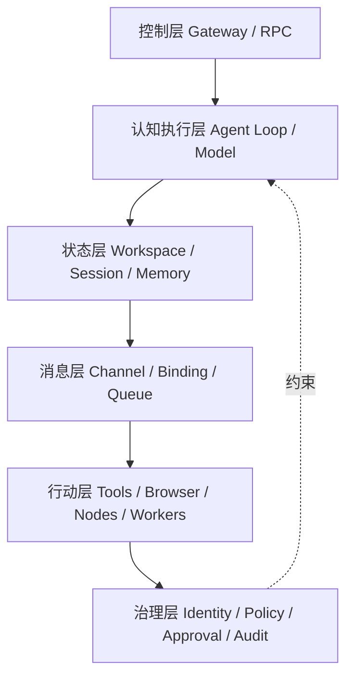
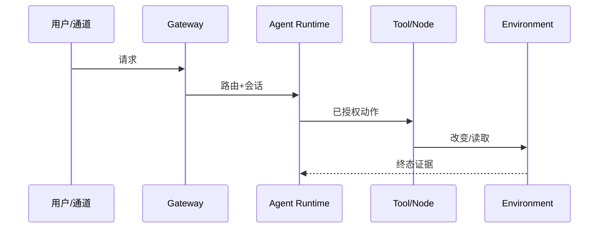
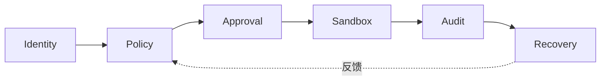
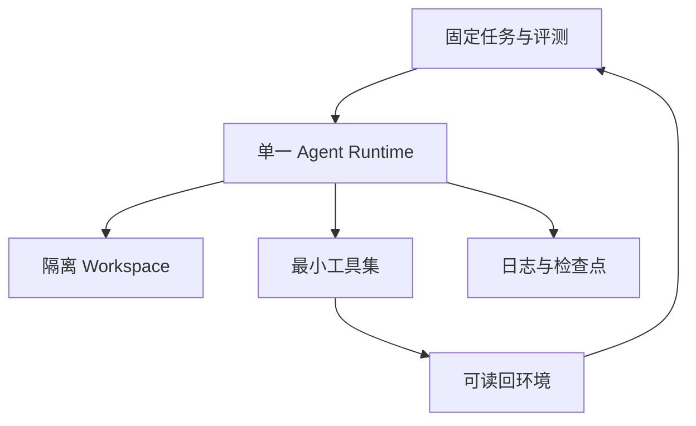

# 第 6 章　Agent 的运行容器与系统架构

## 章首导航

**本章结论**：Agent 的能力不只由模型或提示词决定，而由入口、运行时、状态、消息、行动位置和治理控制共同决定。一个系统只有能说明“请求从哪里进入、由谁执行、状态写到哪里、权限在哪里收紧、失败怎样停止、恢复依据什么事实”，才拥有可训练的运行容器。

**本章解决**：建立控制、认知执行、状态、消息、行动、治理六层观察图；定位 Gateway、Runtime、Provider、Workspace、Session、Queue、Channel、Tool、Node、Worker、Browser、Automation 等组件；画清消息与执行数据流；给出最小可训单体与故障演练入口。

**本章不解决**：C13 的记忆生命周期，C14 的工具与 MCP 合同，C16 的 Heartbeat/Cron 自动化语义，C20 的跨 Agent 路由与 Handoff，C22 的完整威胁模型，C23 的 SLO 与事故响应，C24 的发布升级规则。

**前置输入**：C04 的岗位建模卡、能力树和风险分级表；C05 的七契约草案包和冲突矩阵。缺岗位终态、风险所有者、负面清单或强制控制需求时，只能画候选架构，不能宣布可训。

**本章产物**：[A-C06-01 六层架构图](artifacts/A-C06-01-six-layer-architecture.md)、[A-C06-02 消息与执行数据流图](artifacts/A-C06-02-message-execution-dataflow.md)、[A-C06-03 最小可训单体清单](artifacts/A-C06-03-minimum-trainable-unit.md)。

**阅读路线**：管理者读 6.1、6.7、6.8；训练者读六层边界、三案与练习；工程者通读组件、数据流、停止与恢复；Agent 先读路由摘要，再读取当前任务涉及的层和产物。

### Agent 路由摘要

当任务涉及 Agent 的入口、运行位置、状态所有权、消息路由、Provider、工具执行、停止或恢复时加载本章。必须先读取 C04 岗位/风险与 C05 契约/冲突产物。可以生成架构候选、组件边界、数据流、故障注入计划和最小单体清单；不得新增权限、把 Workspace 当 Sandbox、把 Binding 当授权、把等待超时当运行停止，或使用未核验命令和字段。执行位置、身份、外部终态、持久状态或回滚未知时，保持 `REVIEW_REQUIRED` 并升级给运行所有者。

## 开场案例：回答已经发出，系统却没人能说清发生了什么

【案例类型：教学复合案例；不代表真实客户或生产效果】

一家团队为客户运营 Agent 做演示。测试者从聊天通道发送“帮我跟进这位客户”，界面很快出现一封得体邮件，大家宣布系统打通。半小时后才发现：消息由另一个 Channel Account 接收，Binding 把它路由到了旧 Workspace；模型因主 Provider 限流切换到后备模型；浏览器在个人已登录 profile 中打开；发送动作究竟成功、排队还是失败没有 receipt；测试者点了停止，但停止的只是等待界面，后台 run 仍在继续。

表面成功是“看见了答案”。隐藏失败却有六个：入口身份未核对、路由目标错误、契约版本错误、Provider 降级未披露、执行位置越过预期边界、停止与交付终态不明。此时再问“是哪个组件负责”，团队只会回答“Agent”。这个答案无法复盘、无法授权、无法训练，也无法安全恢复。

本章要建立的能力不是记住一张产品拓扑，而是把任一运行切片还原为六类事实：谁接纳，谁思考，什么被持久化，消息怎样流动，动作在哪里发生，哪些强制控制始终有效。只有这些事实可观察，C07 才能评测，C08 才能训练，C22 才能治理。

<!-- OPENING-SLICE-2026-10 -->

### 现场切片：进程都在线，任务却被两个自己同时执行

合成案例。北辰升级后 Gateway、runtime 和 6 个 worker 全部健康；旧 worker 的 lease 未释放，新 worker 从 checkpoint 恢复同一任务。13 分钟内，同一客户收到两封内容不同的邮件，数据库出现两个 `COMPLETED` 事件。监控只显示 CPU 正常和接口 200。团队沿六层架构追踪到 runtime、durable state 与外部 effect 之间缺少唯一执行权和幂等绑定。所谓“系统在线”没有说明任务所有权、状态一致性和环境终态。

**图 6-1　六层系统总图（本书绘制）**



图 6-1 给出本书的 OpenClaw 主实现观察框架。六层是责任分区，不表示所有请求都按单一方向流动。

## 6.1 六层系统图：控制、认知执行、状态、消息、行动与治理

### 6.1.1 六层是观察模型，不是平台官方标准

本书定义的六层架构是一种训练与审计语言，而不是 OpenClaw、Hermes 或 Muse 共同采用的官方分层。[E-C06-001] 它把复杂系统拆成六个问题：

1. **控制层**：谁接纳请求、协调生命周期、发布事件并给出系统事实入口；
2. **认知执行层**：谁组装上下文、解析 Model/Provider、驱动 Agent Loop；
3. **状态层**：Workspace、Session、Memory、Queue、Transcript 和 SQLite 分别保存什么；
4. **消息层**：Channel、Account、Pairing、Binding、队列与 Delivery 如何把消息送进来、送出去；
5. **行动层**：Tool、Browser、Node、Worker、MCP Server 在哪里实际改变状态；
6. **治理层**：Authentication、Policy、Approval、Sandbox、Secrets、Audit 和 Recovery 如何横切前五层。

六层不是六个进程，也不是从上到下只能单向调用。Gateway 既在控制层接纳请求，又协调 Channel、Session、Agent Loop、Node 和恢复；Queue 既是状态对象，也影响消息和执行时序；Sandbox 不是“治理服务”，而是在特定执行位置形成的强制边界。分层的价值是明确责任，不是把跨层组件硬切成六份。

图 6-1 的正式版本保存在 [A-C06-01](artifacts/A-C06-01-six-layer-architecture.md)，其核心关系如下：

```text
人类 / 客户端 / 外部事件
        │
        ▼
控制层：Gateway · WS/RPC · Client · Event · System of Record入口
        │
        ├──────── 消息层：Channel · Account · Pairing · Binding · Queue · Delivery
        │                            │
        ▼                            ▼
认知执行层：Runtime · Context Assembly · Model · Provider · Agent Loop
        │
        ▼
行动层：Tool · Browser · Node · Worker · MCP Server · 外部系统
        │
        ▼
状态层：Workspace · Session · Transcript · Memory · Queue · SQLite · Receipt

治理层横切全部：Auth · Policy · Approval · Sandbox · Secrets · Audit · Recovery
```

图中把状态层画在下方，不表示它最后才工作。接纳前要读取身份与配置，运行中持续写 Transcript，工具后要写 receipt，恢复时还要从 durable state 对账。状态是整条链的时间轴。

### 6.1.2 组件卡：名字、职责、非职责、事实源

架构讨论最常见的错误是把产品名当解释。说“这里有 Gateway”“这里用了 Sandbox”不能证明职责或边界。每个组件必须至少有八项：`component_id`、职责、输入、输出、执行位置、持久状态、信任边界、失败/停止/恢复。还要写一项**非职责**，防止相邻概念互相吞并。

| 组件 | 核心职责 | 明确不负责 | 首要事实证据 |
| --- | --- | --- | --- |
| Gateway | 接纳、协议、协调、事件和生命周期入口 | 不等于模型或敌对多租户隔离 | 连接状态、RPC 响应、事件与持久事实 |
| Runtime | 组装、解析、循环、工具协调、持久化 | 不等于一段 Prompt | run、模型/工具轨迹、终态 |
| Model | 产生推理或生成输出 | 不持有系统身份与权限 | 实际解析模型、响应与用量 |
| Provider | 提供模型访问、认证、配额和故障路径 | 不等于模型本身或任意工具后端 | 解析来源、profile、attempt、终态错误 |
| Workspace | 持久组织指令、资料和产物 | 不是 Sandbox，也不是全部运行状态 | 路径、版本、载体 diff |
| Session | 关联交互与任务轨迹 | 不是身份授权，也不是完整 Memory | session key、transcript、谱系 |
| Memory | 持久保存并可检索的候选经验 | 不等于 Session/Context/Workspace | 来源、写入、索引、纠错状态 |
| Queue | 管理等待、顺序、并发或介入 | 不负责认证、授权或业务幂等 | admission、lane、pending、drop reason |
| Channel | 适配外部消息入口与出口 | 不等于 Account、Session 或 Binding | adapter/连接/平台回执 |
| Tool | 暴露有界可调用能力 | schema 不等于授权 | 调用、执行主机、policy、receipt |
| Node | 在外围设备上暴露能力与执行位置 | 不是 Gateway 或子 Agent | device identity、capability、host approval |
| Worker | 领取并执行后台或云端工作 | 无独立目标时不是 Agent | lease、placement、结果与回收状态 |
| Browser | 提供网页交互执行面 | 不是搜索，也不天然可信 | profile、CDP/控制面、页面与网络终态 |
| Automation | 以事件或时间触发运行 | 触发不保证成功、授权或低噪音 | trigger、run、delivery、pause/recovery |
| Sandbox | 限制执行影响范围 | Workspace 或提示词不能替代 | backend、scope、workspace access、负例 |
| Policy | 在模型外确定性允许、拒绝或升级 | 不等于自然语言纪律 | effective policy 与 deny 证据 |
| Audit | 收集诊断和审计线索 | 无 finding 不等于安全 | 扫描范围、版本、finding 与复核 |

这张表定义的是观察问题。Tool、Memory、Automation、安全威胁等详细合同仍由后章主定义；C06 只保证它们在系统图上有正确位置、有可观察接口、不会被人格文本替代。

### 6.1.3 三条不可跨越的分离线

**第一条：语义与强制控制分离。** C05 可以要求潮生“不经批准不外发”，但真正阻断发送的是身份、Policy、Approval、工具端能力和 Sandbox 等系统机制。契约应产生控制需求，不能自称控制已经生效。

**第二条：可见内容与可执行范围分离。** Context 中没出现某个路径，不代表 Tool 无法读取；Workspace 中写了“只读”，也不代表宿主文件权限已经收紧。模型看到什么与执行面能碰什么必须分别检查。

**第三条：等待状态与运行状态分离。** 调用者等待超时，只证明等待者没有在时间内拿到结果，不证明 run 已停止，更不证明远端 Tool、Browser 或 Node 没有产生副作用。[E-C06-005] 真正停止必须命中运行对象与实际执行主机，再以持久状态和外部事实确认。

### 6.1.4 从 C04/C05 生成架构，而不是从产品菜单倒推岗位

C04 的岗位、能力和风险决定“系统必须支持什么”；C05 的契约决定“长期行为如何保持一致”；C06 才选择“这些要求落到哪里”。顺序不能倒置。

| 上游输入 | 转成 C06 问题 | 不允许的捷径 |
| --- | --- | --- |
| JTBD、业务/系统终态 | 入口、Session、事实源和交付终态是什么 | 看到 Channel 就假定需要连接 |
| 五支能力与 NFR | 需要什么 Model/Provider、Tool、时延与恢复证据 | 以模型排行榜代替岗位适配 |
| 四因子风险与三类负面清单 | Policy、Approval、Sandbox、执行位置如何设计 | 把自然语言拒绝当确定性阻断 |
| 七契约和冲突矩阵 | 哪些语义进入 Context，哪些要求绑定强制控制 | 把七契约复制成七个文件 |
| 版本、owner、stop/recovery | 谁能变更、谁能停、恢复到哪个事实点 | “重启就好”或“回滚文件即可” |

CASE-A 澄明主要需要公开材料入口、可追溯 Workspace、只读工具和证据状态；CASE-B 潮生需要强身份隔离、客户级 Session、对象绑定审批、外发 receipt；CASE-C 北辰需要多角色状态、责任唯一的 Queue/Handoff 接口和独立评审门。同一个模型可以服务三案，但运行容器不应相同。

### 6.1.5 六层不是目录，而是一组六向追问

一张架构图若只画组件，没有问题和证据，就会在评审时退化成“图标墙”。六层图必须支持六个方向的追问。

**从入口向内追问**：这个请求来自哪个客户端、Channel、Account 和 sender？通过什么准入？Binding 选择了哪个 Agent 与 Session？若入口身份无法绑定，后面的高质量推理没有业务意义。

**从动作向外追问**：哪个 Tool 真正改变了哪个系统？它在 Gateway host、Sandbox、Node、Worker 还是 Browser 里执行？使用什么身份，谁批准，是否有 receipt？如果只看到模型说“已完成”，就还没有行动事实。

**从结果向后追问**：最终产物对应哪个 run、Context 版本、Provider、工具轨迹和状态快照？同一输出若不能回到输入与环境，就不能用作训练样本。

**从失败向前追问**：故障发生后，系统先停止新接纳、当前 run、实际工具还是交付队列？哪个对象能自动恢复，哪个必须人工对账？如果故障处理只有“重试”，说明责任没有被定位。

**从权限横向追问**：请求经过每一层时，身份、Policy、Approval、Sandbox 和数据范围怎样收紧？一次允许是否被错误扩散到其他账号、Session、工具或时间窗口？

**从版本纵向追问**：岗位、契约、Workspace、配置、Plugin、数据库 schema 与平台版本是否属于同一批准快照？如果语义回滚而运行状态未回滚，旧规则可能控制新任务；如果代码回滚而 schema 不兼容，系统可能无法启动。

六向追问的结果应是一组可解引用 ID，而不是口头回答。架构图因此既是设计工具，也是训练数据的索引层：它告诉 C07 到哪里取证，告诉 C22 哪些边界要攻击，告诉 C23 哪些状态要监控。

### 6.1.6 架构最小单位：责任闭包

本章把“责任闭包”定义为一个组件从输入到恢复的最小完整说明：有明确 owner；知道接收什么、产生什么；知道状态写在哪里；知道能跨越哪些信任边界；知道失败如何暴露；知道谁能停止；知道恢复依据何种事实。责任闭包不是新的平台对象，而是本书检查架构完整性的方法。

例如，写“Provider 负责模型调用”还不够。完整闭包要指出选择来源、认证 profile、外发 Context 范围、attempt 预算、严格选择、fallback 资格、终态错误、停止动作和实际模型记录。写“Queue 负责排队”也不够，要指出 admission、lane、顺序、并发、持久点、溢出、interrupt 与重启后的 owner。

如果两个组件都声称拥有同一状态，必须指定单一写入权威和派生副本；如果没有组件拥有某个失败状态，它会在事故中成为“没人负责的空白”。如果组件只有成功路径没有停止和恢复，它尚未形成责任闭包，不能进入最小可训单体。

## 6.2 控制平面：Gateway、WS/RPC、客户端、事件和系统事实源

### 6.2.1 控制平面与 Gateway 不是同义词

控制平面是职责集合：接纳连接、校验协议、协调对象、暴露状态、管理生命周期和发布事件。Gateway 是 OpenClaw/Hermes 中的产品组件名，两者职责不同，引用时必须带产品与版本。不能把“有一个 Gateway 进程”推导为所有控制责任都在一个边界，也不能把所有控制责任都叫 Gateway。

在 OpenClaw `v2026.9.6 / eb377ac` 中，Gateway 是长驻控制面核心，维护 Provider 和 Channel 连接，暴露带类型的 WebSocket API，接纳客户端与 Node，并协调 Agent run。[E-C06-002] 该事实有两个限制：第一，一个 Gateway 面向单一操作者或互信团队，不是敌对多租户的硬隔离边界；第二，远程连接仍需认证和设备身份，网络隧道本身不替代 Gateway 认证。[E-C06-016]

Hermes `v2026.8.13` 所指向的固定提交显示，CLI、Messaging Gateway、ACP、Batch、API Server、Python Library 等多个入口进入共享的 `AIAgent`。这说明“控制职责可能分布于多个入口”，但不能据此声称 Hermes Messaging Gateway 与 OpenClaw Gateway 在协议、状态所有权、队列和恢复上同构。[E-C06-020]

### 6.2.2 WS/RPC：连接、请求、响应和事件是四种不同事实

OpenClaw 固定版要求 WebSocket 客户端以 `connect` 作为首帧，后续使用 `req`、`res`、`event` 等帧；带副作用的方法需要幂等键，Gateway 维护短期去重边界。[E-C06-002] 训练者应把四件事分开：

- **连接成立**：说明传输和初始认证已通过；
- **请求接纳**：说明 Gateway 接受了某个方法与参数；
- **响应返回**：说明该 RPC 有结构化结果，不必然代表外部业务终态；
- **事件到达**：说明发生了变化，但事件不等于持久账本。

事件可能丢失或不重放。客户端遇到序列缺口、断线重连或未知提交时，应从持久状态刷新，而不是把最后看到的事件当完整历史。[E-C06-018] 因此 A-C06-02 把“事件面”和“事实面”分别画出：事件负责通知，SQLite、Transcript、任务与 delivery receipt 负责恢复判断。

### 6.2.3 客户端正常，不等于系统完成

CLI、Control UI、macOS App、WebChat 或自动化客户端都可以发起请求、订阅事件或展示结果。客户端界面显示“已发送”可能只表示本地 outbox 写入；显示“Agent 完成”可能仍未经过 Channel 交付；浏览器断线也可能发生在服务端动作之后。每个 UI 状态必须能回到后台事实。

对非幂等请求，客户端重连后不可因为没看见响应就生成新 ID 重发。它应先用原 ID 或 receipt 查询是否接纳、执行、入队或送达。若证据不能区分，状态是 `UNKNOWN`，由人决定查询、补偿或停止，不得把“再试一次”当默认恢复。

### 6.2.4 控制层生命周期

一个可训练控制面至少经历：`starting → accepting → draining → stopped → recovering → accepting`。异常还要能进入 `degraded` 或 `blocked`，不能只有“在线/离线”。

1. **启动**：核对版本、状态 schema、配置、SecretRef、Workspace 与 Agent 映射；
2. **接纳**：认证连接，校验请求，分配 run/session 标识，写入可追踪事实；
3. **运行**：发布事件，但不把事件当永久记录；
4. **排空**：停止新接纳，等待或终止已知工作，保存不确定项；
5. **停止**：由服务管理器、人工或事故流程终止控制面；
6. **恢复**：读取 durable state、收据与 tombstone，对账后决定续作或人工处理。

OpenClaw 固定版的重启恢复是 database-first：持久任务、会话、转录、交付等按各自状态恢复；PTY 等进程内对象不会因 Gateway 重启自动复活。[E-C06-019] 所以“进程重新在线”只是恢复入口，不是恢复完成。

### 6.2.5 系统事实的四级可信度

控制层需要为不同观察信号排序，否则界面、日志、数据库和外部平台相互冲突时无法裁决。可采用四级事实梯：

1. **外部业务终态**：目标系统中确实出现或没有出现所需状态，例如消息平台 receipt、文件哈希、工单版本。它最接近业务事实，但仍需核对对象与身份；
2. **持久运行事实**：数据库中的 run、Session、Transcript、Queue、Delivery、tombstone 和版本记录，用于恢复内部一致性；
3. **结构化事件与日志**：解释过程和时间线，但可能丢失、延迟、截断或不重放；
4. **界面与自然语言自报**：用于交互和提示，不能单独支撑完成、停止或安全结论。

事实梯不是“外部永远覆盖内部”。如果平台 receipt 指向错误收件人，内部批准记录仍能证明发生了越权；如果数据库说 delivery 成功但外部平台撤回，业务终态已变化。正确做法是记录冲突、停止自动决策并指定裁决 owner。

CASE-B 的外发任务可用这套梯子复核：UI 的“发送中”只是第四级；Channel event 是第三级；outbound queue 与 receipt 是第二级；合成收件箱中出现目标消息是第一级。四级一致才可判 `PASS`。若第二级成功、第一​​级未知，保持 `REVIEW_REQUIRED`，不得重复发送。

### 6.2.6 控制层的降级设计

控制面故障不总是全停。可安全降级的前提是每个 surface 有独立 owner 和明确不可牺牲边界。Provider 不可用时可以保留只读状态查询；Channel 断开时可以暂停外发但继续本地草拟；Node 离线时可以完成不依赖该 Node 的分析，却不能改变执行位置；Audit 暂不可用时可以禁止高风险变更而不是假装审计已通过。

降级必须显式显示“哪些仍可做、哪些暂停、哪些状态未知”，并设置结束条件。若为了提高可用性而绕过认证、把 Sandbox 改为 host、把 strict model 改为任意 fallback、借用其他 Account 或跳过 receipt，对业务来说不是降级，而是边界破坏。

## 6.3 认知执行面：Agent Loop、Prompt/Context Assembly、Model/Provider 与 Failover

### 6.3.1 Agent Runtime 是执行层，不是 Prompt 外壳

Agent 运行时（Agent Runtime）负责组装指令与上下文、解析 Model 和 Provider、驱动模型—工具循环、处理流式事件、重试、压缩、持久化与投递。它承载行为，但不等于模型、Workspace 或控制平面。

OpenClaw 固定版从 Gateway RPC `agent`、等待接口或 CLI 进入序列化的 Agent Loop；Loop 准备上下文、发起模型调用、执行工具循环、流式发布并持久化运行结果。[E-C06-003] “序列化”不等于整个系统永远只有一个任务，而是相应 Session/Lane 上的并发与写入要服从运行时约束。训练者应观察真实 run、tool call、transcript 和终态，不以单条回答替代执行证据。

### 6.3.2 Prompt/Context Assembly：装进去什么，没装进去什么

运行前，系统把基础提示、Workspace bootstrap、C05 契约载体、Session 历史、Skills、检索结果、工具反馈和运行覆盖装配为当次 Context。Context 是“这一次模型可见的信息”，不等于磁盘上所有资料，不等于完整 Session，也不等于长期 Memory。[E-C06-006]

装配必须回答五个问题：载体来自哪个版本；哪些被截断或压缩；哪些只在宿主可读而未进入模型；沙箱是否重定向了可见 Workspace；哪些外部输入可能携带提示注入。C06 只定位装配位置，具体上下文策略交 C09，记忆与 compaction 交 C13。

固定版 OpenClaw 已退役 `TOOLS.md` 和 `HEARTBEAT.md` 作为当前运行载体；工具说明迁入 `AGENTS.md` 的相应区域，主动观察任务由系统状态与自动化机制承载。[E-C06-007] 本章不重新创建这两个文件，也不使用 `reserveTokensFloor` 或 `compaction.reserveTokens` 作为公开配置。源码内部标识、历史字段或候选稿片段不能越过固定版 Schema 证据。

### 6.3.3 Model、Provider、认证 profile 与选择来源

Model 是推理组件；Provider 是模型访问、认证、配额和故障切换的服务/适配层；认证 profile 是某 Provider 下的凭证与路由身份。三者必须分开。一个模型名可能由多个 Provider 提供；同一 Provider 可能有多个 profile；Session 的显式选择也可能覆盖 Agent 默认值。

每次运行至少记录：选择来源、请求模型、实际 Provider、实际模型、profile 标识的非敏感引用、预算、fallback 资格和终态。密钥本身不进入 Transcript 或 Workspace。调用外部 Provider 会把必要 Context 送出本地信任域，所以“换个模型继续”可能同时改变数据处理地、成本、政策、能力和输出分布。

CASE-A 澄明的主任务是来源核验。如果默认 Provider 失败，系统可以在事先允许的边界内切换，但必须保留实际模型与来源；如果读者明确固定一个模型做可重复基线，运行时就不能为了成功率静默换模型。否则 C07 看到的不是同一任务、同一预算、同一系统。

### 6.3.4 有界恢复与 Failover

OpenClaw 固定版先在同一 Provider 内按可用 profile、冷却和失败类别做有界恢复，再在符合条件时尝试配置的模型 fallback；fallback 只影响当前 turn，不应静默改写 Session 的显式模型选择。[E-C06-004] 这是一种版本性实现，不应外推为所有 Runtime 的共同顺序。

恢复链必须有四个闸门：

1. **是否允许换**：显式严格选择、数据地区、成本或合规边界可能禁止 fallback；
2. **是否已经产生副作用**：若 Tool 已写入或发送，先对账，不能从头重演；
3. **是否仍在预算内**：attempt、时间、成本达到阈值就停止；
4. **是否披露降级**：实际模型、失败链与剩余不确定性必须进入证据。

`agent.wait` 或客户端等待超时不属于上述 stop。它只结束等待者的本次等待，后台 run 可能仍继续。[E-C06-005] 训练者要发出真正的 abort/stop/interrupt，并确认模型请求、工具进程、Node/Worker 与 Delivery 分别进入什么状态。

### 6.3.5 认知执行面的四态验收

认知运行至少区分：`accepted`、`running`、`completed`、`terminal_failure`；涉及外部动作时再加 `unknown_side_effect`。`completed` 只表示 Agent run 结束，不等于消息已交付，也不等于业务系统已更新。若 Provider 返回答案后持久化失败，读者可能看见内容却无法恢复；若模型失败前工具已执行，run 是失败，业务状态却可能已经变化。

因此恢复以“事实组合”判断：run 状态 + transcript + tool receipt + external state + delivery receipt。任何单项都不足以替代组合证据。

### 6.3.6 Provider 选择决策表

Provider 决策不应埋在 Runtime 的自动行为里。每类任务要预先写一张选择表：

| 决策项 | 必答问题 | 失败时动作 |
| --- | --- | --- |
| 数据边界 | 哪些 Context 可发给哪些 Provider/地区 | 不满足则拒绝该候选 |
| 能力边界 | 任务是否依赖特定模型、工具调用或上下文能力 | 能力不等价时不降级为“能回答即可” |
| 预算边界 | 单 turn、任务、日级成本和尝试上限是什么 | 达上限停止并报告 |
| 严格性 | 用户/评测是否显式固定模型或 Provider | strict 时不得静默 fallback |
| 副作用 | 已执行哪些 Tool，是否可安全重试 | 未对账前不重演 |
| 披露 | 如何记录实际选择、失败链和质量变化 | 证据缺失则 REVIEW_REQUIRED |

选择表还要区分“同 Provider 换认证 profile”和“跨 Provider 换模型服务”。前者可能改变账户、配额和数据主体；后者可能同时改变处理条款、地区和模型能力。两者都不是纯技术细节。

当所有候选耗尽，Runtime 应给出终态失败，而不是无限递归到更弱模型。一个可治理 Agent 必须会失败：明确说明未完成、已完成的工具步骤、剩余风险、可恢复点与需要谁决定。掩盖失败会让训练者把系统可用性高估，也会在重试时重复副作用。

### 6.3.7 上下文装配的可复现记录

上下文不宜全文复制进日志，因为可能包含隐私与高成本内容；但完全不记录又无法解释行为。可复现记录至少包含：系统与契约载体版本、Workspace commit/内容哈希、Session 起点、纳入的消息范围、检索结果引用、Skill 版本、工具结果引用、token/预算摘要、截断或 compaction 事件、运行覆盖和实际 Model/Provider。

这份记录是“装配清单”，不是公开日志。敏感正文可以只保留不可逆哈希和受控位置。评审者需要时在原权限域复核，不能把客户数据复制到训练报告。这样既支持复现，又不因追求可观测性制造新的泄露面。

CASE-A 若两次研究结论不同，先比较装配清单：来源版本是否变化、检索结果是否不同、某个关键契约是否被截断、Provider 是否切换、Tool 是否失败。只有排除运行容器差异，才把问题归因于推理能力。

**图 6-2　消息到环境终态的数据流（本书绘制）**



图 6-2 把消息成功、模型输出、工具调用和环境终态分开，避免把中间返回当作业务完成。

## 6.4 状态面：Workspace、Session、Memory、Queue、SQLite 与上下文快照

### 6.4.1 状态不是一个文件夹

状态面回答“什么必须跨时间保存，谁拥有它，恢复时信谁”。OpenClaw 固定版把 Workspace、全局 SQLite、每 Agent SQLite、Session transcript、Memory 索引、归档/支持文件和 Sandbox Workspace 分开。[E-C06-008] 把它们统称为“记忆”会导致错误备份、错误删除和错误恢复。

本章将状态分成五类：

- **意图与知识状态**：Workspace 中的契约载体、资料和产物；
- **交互与运行状态**：Session、Transcript、run 和工具轨迹；
- **队列与交付状态**：pending、lane、lease、receipt、失败与 tombstone；
- **记忆候选与索引状态**：长期文件、索引、来源和纠错关系；
- **系统与版本状态**：配置、schema、migration、Agent/Account/Node 注册信息。

五类状态的 owner、备份、保留和回滚不同。恢复 Workspace 版本不能自动恢复 SQLite 中的 run；数据库恢复也不能把外部已发送消息撤回。

### 6.4.2 Workspace：工作容器，不是隔离容器

工作区（Workspace）组织 Agent 的指令、资料、项目上下文和产物，并通常作为默认 cwd。它影响可发现内容和行为，却不是操作系统隔离或访问控制。[E-C06-009] 未启用 Sandbox 时，绝对路径、宿主工具或插件仍可能越出 Workspace；写一句“禁止访问其他目录”只能形成语义约束。

训练者必须分别记录：Workspace 路径和版本、模型注入了哪些 bootstrap、Tool 实际 cwd、Sandbox 映射路径、宿主文件权限。只有五项一致，才能说“Agent 在预期工作区工作”。

CASE-A 澄明可使用只读资料根和可写草稿区；CASE-B 潮生必须按客户切片，不能把一个大 Workspace 当多客户隔离；CASE-C 北辰需要共享产物索引与角色私有 slice，但权限不因项目目录相同而自动共享。

### 6.4.3 Session：连续轨迹，不是身份授权

会话（Session）关联一段交互或任务轨迹，可持有消息、工具调用、附件、谱系和恢复信息。入站路由决定 session key；DM、群组、Cron、Webhook 等可能采用不同隔离规则。[E-C06-010] Session 连续有助于上下文，却不证明发言者身份、不授予高风险动作，也不等于长期 Memory。

多位用户若错误共享 Session，会发生上下文串扰；同一用户在不同职责中若错误共用 Session，也可能把研究素材带入客户外发。Session 策略必须从身份、任务域和数据边界生成，而不是追求“记得更多”。所谓 incognito 只改变会话持久化范围，不自动禁用 Tool、Provider 日志或外部写入。

### 6.4.4 Memory 与 Context：位置由 C06 说明，生命周期由 C13 定义

Memory 是被选择后持久保存、可在后续检索或注入的经验或事实；Context 是当次推理可见集合。Memory 可能存在却未被检索，Context 可能包含不应长期保存的临时材料。C06 只要求运行图能标出原始内容、索引、检索、注入和纠错接口，不定义保留期、分类或删除流程。

C05 的 MEMORY 契约规定“什么可以长期保留、谁可访问、如何纠错与遗忘”的语义责任；OpenClaw 的 Workspace memory 文件与 memory plugin/SQLite 索引是实现载体；二者不能互相代替。[E-C06-011] 检索失败要写成“未取得相关记忆”，不能升格为“系统不存在相关事实”。

### 6.4.5 Queue 与 Lane：时序控制，不是任务生命或授权

队列（Queue）保存等待、顺序、并发或介入工作。OpenClaw 固定版采用感知 lane 的 FIFO 协调，同一 Session 先串行，再受可选全局并发约束；`steer`、`followup`、`collect`、`interrupt` 具有不同语义。[E-C06-012]

队列保留输入身份，却不会把身份转成权限；排队成功也不等于 run 接纳。`steer` 在下一安全边界注入新输入，不保证立即中断已运行 Tool；需要终止当前工作必须使用 interrupt/stop，并检查工具副作用。[E-C06-013] 这套语义属于 OpenClaw 固定版，不外推到 Codex、Hermes 或任意编排器。

### 6.4.6 SQLite 与上下文快照：恢复的锚，不是万能时间机器

OpenClaw 固定版采用 database-first 状态：全局状态和每 Agent 的运行、认证、Session、Transcript、Memory 索引等分别进入相应 SQLite；旧 JSON sidecar 不能被当作活跃事实源。[E-C06-008] 备份应使用可验证的一致性方式，不应复制正在写入的裸数据库后宣称可恢复。运行时若遇到比自身更新的 schema 应拒绝打开；代码回滚也不能自动倒转 schema。

“上下文快照”在本章是工程观察项：它记录某次 run 实际装配的输入引用、版本、预算和截断/压缩信息，用于复现，不是新发明的 Memory 类型。快照含敏感信息时需最小化和访问控制；是否保留及多久仍由 C13/C22 决定。

### 6.4.7 状态所有权矩阵

状态对象要有一个权威 owner、零个或多个派生视图，以及明确恢复动作。下面的矩阵不冻结具体表结构，只定义训练者必须问的问题。

| 状态对象 | 权威 owner | 常见派生视图 | 禁止的恢复假设 |
| --- | --- | --- | --- |
| Workspace 资料/契约 | 版本库或受控文件 owner | Context 装配、搜索索引 | 恢复文件即可恢复 run |
| Session/Transcript | Runtime/Gateway 持久状态 | UI 历史、摘要 | Channel 原生历史就是完整转录 |
| Memory 原文与索引 | 原文 owner + 索引 owner | 检索结果、Context 注入 | 重建索引会自动纠正原文 |
| Queue/Lease | 调度/队列状态 owner | 监控面板 | 重启会安全重放全部 pending |
| Delivery/Receipt | 交付状态 + 外部平台 | “已发送”UI | 超时说明未送达 |
| Provider/Auth route | 运行状态 owner | 配置摘要 | 配置文件是唯一实时事实 |
| Node/Worker 状态 | Gateway 注册 + 执行主机 | 能力清单 | 能力曾声明就始终在线 |
| Audit/Recovery | 审计与事故记录 owner | 报告摘要 | 无 finding 或服务在线即恢复 |

状态 owner 不是单纯维护人。它要定义写入权威、版本、并发、备份、删除、观察和恢复。派生视图必须能指出刷新时间；UI 若比数据库旧，应提示 stale，而不是继续接收高风险动作。

### 6.4.8 备份、回滚与前滚

备份回答“能否取回过去的状态”，回滚回答“能否恢复上一批准版本”，前滚回答“如何在新 schema/新事实下修复”。三者不能合并。对于正在写入的 SQLite，应采用一致性备份并验证还原；对于 Workspace，应保存版本与未提交差异；对于外部系统，只能保存 receipt 和补偿能力，不能假装有本地快照。

代码版本降级而数据库 schema 已升级时，机械回滚可能使运行时拒绝打开或误读新状态。此时应停在兼容性门，选择受支持的迁移或前滚。对于已经发送的消息、完成的支付或远程命令，文件回滚无法撤回影响，只能按业务补偿。

恢复演练应至少验证一次“坏备份”或“不完整快照”：如果还原校验失败，系统必须保持停机或只读，而不是为了 RTO 继续启动。C23 将定义正式 RTO/RPO；C06 只要求每个状态对象存在可验证恢复路径。

## 6.5 消息面：Channel、Account、Pairing、Binding、Delivery、Retry 与 Steering Queue

### 6.5.1 一条消息不是一条直线

消息从外部平台到 Agent，至少经过 Channel adapter、Account、sender 准入、Binding/Router、session key、去重/合并、per-session Queue、全局 lane、Gateway 接纳。结果返回时还要经过出站格式化、持久交付队列、平台 API、重试与 receipt 对账。[E-C06-014] 任一环节都可能成功、失败或未知。

正式数据流见 [A-C06-02](artifacts/A-C06-02-message-execution-dataflow.md)。它刻意把四个终态拆开：

1. `request_accepted`：Gateway 接纳请求；
2. `run_completed`：认知执行结束；
3. `delivery_enqueued`：结果进入交付队列；
4. `external_receipt_confirmed`：外部平台确认接收。

只有业务任务明确不需要外发时，第三、第四项才可以标 `N/A + 理由`。不能用“模型已经生成”代替“客户已经收到”。

### 6.5.2 Channel 与 Account：通道类别和连接实例

消息通道（Channel）是聊天平台或应用入口的适配面；通道账号（Channel Account）是在特定通道内连接、收发和标识配置的账号实例。一个 Channel 可以有多个 Account。连接健康是账号级事实，不能因为同类通道另一个账号正常就宣布全部正常。

CASE-B 潮生同时服务多个客户时，客户隔离不能只靠 Agent 自己读名称。团队要核对入站 Account、sender identity、数据 slice、session key、Binding 目标和外发 Account。若某个账号 SecretRef 失效，系统应使该 owner 进入明确失败或受控隔离，不能静默借用另一个账号发出消息。

### 6.5.3 Pairing、Binding 与 Authorization 三分

Pairing 处理“这个发送者或设备是否被接纳”；Binding 处理“已接纳流量交给哪个 Agent/Workspace/Profile”；Authorization 处理“目标能否执行具体动作”。三者是连续关口，不是同义词。

OpenClaw 固定版区分 DM sender pairing 与 Node device pairing；Binding 在账户和准入之后选择 Agent，不创建 Account，也不授予访问权限。[E-C06-015] 因此以下推理均为错误：

- “已经配对，所以可以执行所有命令”；
- “绑定到潮生，所以可以读取该客户全部数据”；
- “消息路由成功，所以发件权限有效”；
- “进入 owner Session，所以聊天中的一句话可以绕过对象绑定审批”。

Binding 错误会把合法消息送到错误 Agent，属于路由完整性问题；Authorization 缺失会让正确 Agent 做不该做的动作，属于权限问题。修复 Binding 后要用相同身份、Account 和会话范围重测；修复权限后要用 deny 负例证明越权确实被阻断。

### 6.5.4 Delivery 与 Retry：生成、入队、送达、对账

外发链的重试必须保持顺序并避免重复副作用。网络超时只表明调用方没有得到确定结果，不表明平台没收到。只要发送终态不确定，系统就应保留原 message ID、attempt、payload hash 和 receipt 线索，先查询或对账，不能换 ID 盲发。

OpenClaw 固定版将单次 Channel 请求的有界 retry 与持久 outbound queue 的租约、预算和对账分开；模型 failover 又是第三套机制。[E-C06-014] 将三类重试合并成“失败就重试三次”会造成重复生成、重复发送或重复执行。

对于 CASE-B，一封邮件至少有四个证据：批准绑定到哪个对象和内容版本；Tool/Channel 调用是否被系统接纳；平台 receipt 是成功、失败还是未知；客户记录是否与 receipt 一致。缺任一项不能宣布闭环。

### 6.5.5 Steering Queue：人类介入但不改写权限

新消息进入正在运行的 Session 时，系统可能把它 steer 到下一安全边界，也可能 followup、collect 或 interrupt。无论哪种模式，新输入都保留来源身份，不能借“紧急指令”提高权限。`steer` 不会撤销已经提交的表单或远端命令；`interrupt` 也需要确认实际执行主机是否停下。

CASE-C 北辰接到“截止时间提前，跳过评审”的 steer 时，可以重排只读分析，却不能改变独立评审门。若工具仍在生成候选产物，steer 可在安全边界更新优先级；若正在执行不可逆发布，应进入 stop/unknown/reconciliation，而不是把新话语当系统取消。

### 6.5.6 Automation 的入口位置

Automation 是以时间、事件或状态触发 run 的机制。它可能通过 Cron、Heartbeat、Standing Order、Hook、Webhook 或其他入口进入 Gateway/Session，但“触发发生”不等于“任务完成”，更不等于“获得权限”。C16 将定义主动调度和安静策略；C06 只要求图中标出 trigger identity、目标 Session、状态 owner、批准边界、暂停、交付与恢复。

固定版 `HEARTBEAT.md` 已退役，不应通过创建旧文件来承载自动化。[E-C06-007] 自动化恢复也不能只重启调度器：必须检查错过的触发、正在运行的任务、出站队列和外部终态，防止补跑制造重复影响。

### 6.5.7 消息身份的连续性

消息链需要一个从外部 sender 到内部 run、再到外部 receipt 的连续标识关系。并非要求所有平台使用同一个 ID，而是要求能够建立映射：`external_event_id → channel/account → sender/principal → binding decision → session_key → internal_message_id → run_id → outbound_message_id → provider_receipt`。

任何映射都要记录版本和时间。Binding 变更后，同一个外部 sender 可能进入不同 Agent；Session reset 后，相同对话也可能对应新状态；Channel 平台去重窗口与内部幂等窗口可能不同。如果评审者只保存一张聊天截图，就无法判断消息属于哪个版本的路由或契约。

消息身份连续性还要处理编辑、撤回、重复事件和乱序。外部消息被编辑后，系统应说明是更新原任务、生成新输入，还是因窗口关闭而拒绝；撤回不等于外部副作用自动撤回；重复事件应在声明幂等边界内合并；乱序消息不能靠模型猜顺序。C15 会处理具体 Hook/Webhook，C20 会处理跨 Agent Handoff，本章只要求入口能保存来源和因果关系。

### 6.5.8 背压、容量与静默丢失

队列存在并不意味着系统有无限容量。Channel adapter、Gateway、per-session Queue、global lane、Provider、Node 和 outbound delivery 都可能产生背压。架构要为每个等待面记录容量、等待预算、拒绝策略、摘要/丢弃策略和可观察信号；具体数值属于实现与环境事实，不能写成跨版本常量。

最危险的不是明确拒绝，而是静默丢失：入站平台重试但内部去重错误、Queue 达上限后无 drop reason、Gateway 重启丢进程内输入、Delivery 预算耗尽却仍显示“处理中”。一旦系统无法证明消息仍在何处，应停止继续接收同类高风险动作，先对账。

训练任务也要受背压治理。大量并发样本可能把单 Session 串行等待误判成模型慢，把 Provider 限流误判成能力下降，把 Queue drop 误判成 Agent 忘记。C07 评测必须消费 C06 的 admission、lane、attempt 与终态证据，才能把系统瓶颈和模型表现分开。

## 6.6 行动面：Tools、Browser、Nodes、Cloud Workers、MCP 与执行位置

### 6.6.1 行动面的核心问题是“在哪里真的发生变化”

模型输出的是候选调用，Tool 才可能读取文件、发送消息、执行命令或改变外部系统。Tool schema 说明怎样调用，不证明谁有权调用；C05 的 TOOLS 契约说明使用意图，也不创建实际能力。行动面必须绑定执行主机、身份、Policy、Approval、Sandbox、网络与 receipt。

一次调用至少回答：谁请求、哪个 Tool、在哪个主机/容器/浏览器执行、使用哪个非敏感身份引用、Policy 如何决策、是否需要批准、产生何种外部状态、怎样验证、失败如何补偿。缺执行位置的工具图是不完整架构。

### 6.6.2 Tool：能力接口与真实副作用

OpenClaw 固定版的 Tool 可用性由工具 profile、allow/deny、Provider、Agent、Sandbox、Channel 与 Plugin 等层共同决定；较窄层不能把上游 deny 的能力恢复出来。[E-C06-017] 工具调用失败要区分：未发现、schema 不匹配、Policy 拒绝、Approval 拒绝、执行错误、返回丢失和外部终态未知。

对有副作用 Tool，停止模型流不代表动作回滚。比如邮件 API 已接受请求后模型超时，run 可以失败，邮件仍可能发出；文件写入成功后持久化 transcript 失败，记录可以缺失，文件却已变化。恢复前必须查外部事实和原 receipt。

### 6.6.3 Browser：隔离 profile、个人 profile 与远端浏览器

浏览器执行面可能是 Gateway 主机上的隔离 profile、通过受控接口连接的真实已登录浏览器、Node 上浏览器或远端托管浏览器。它们的凭证、会话、网络和人工接管边界不同。[E-C06-022]

使用个人已登录浏览器意味着 Agent 可能触达真实账户和已有 cookie；隔离 profile 则降低串扰但仍需管网络和下载；远端 CDP 又增加新的控制面。正文不把“Browser 可用”当一种统一能力。每个任务要记录 profile 类型、执行位置、可见账户、禁止域、下载/上传边界与人类接管状态。

### 6.6.4 Node：外围执行端点，不是 Gateway 或子 Agent

OpenClaw Node 通过 Gateway WebSocket 连接，声明设备身份与能力，通过相应调用在外围主机执行；Channel 消息与控制事实仍由 Gateway 协调。[E-C06-023] Pairing 建立设备准入，具体远程命令还要经过 Gateway 粗粒度策略和 Node 本地 Approval。两道门不能互相替代。

Node 断线时，系统不得把原本计划在测试设备执行的命令默默改到 Gateway host。执行位置变化会改变文件、网络、身份和风险边界，必须重新决策。结果可能已经执行但 receipt 未返回时，状态进入 `UNKNOWN`，先在 Node 或外部系统查询，再决定是否重试。

### 6.6.5 Worker：可回收执行位置，状态仍有所有者

Worker 是领取并执行后台或云端工作的运行单元。若没有独立目标、判断和反馈循环，它不是 Agent。OpenClaw 的 Cloud Worker 可作为一次性执行机，而 Session/Transcript 等事实继续由 Gateway 拥有。[E-C06-024]

Worker 被回收不应等同于 Session 丢失；但发往 Worker 的输入、临时秘密、网络出口和未回传副作用必须单独治理。重试前查 Gateway 的任务、结果与变更状态；如果 Worker 是否执行无法确认，不能用新 Worker 直接重演。

### 6.6.6 MCP Server 与 Plugin：行动边界和供应链边界

MCP Server 可向 Host 暴露 tools、resources、prompts 等能力；保存 MCP 配置不证明 Server 可达或 schema 未漂移，必须探测。MCP 工具仍受本地 Tool/Policy/Approval 边界，遵循协议不等于可信或已授权。[E-C06-025]

Plugin 与 MCP Server 不同。OpenClaw 固定版 Plugin 在 Gateway 进程内运行，属于可信代码，可注册 Tool、Channel 等能力；它不是默认被 Agent Sandbox 隔离的普通工具。[E-C06-017] 因此 Plugin 的来源、固定版本、安装代码、发现根和启用状态属于供应链风险，异常时可能需要禁用并重启 Gateway。

C14 将定义 Tool/MCP 合同，C15 将定义 Skill/Plugin 边界。C06 只保留三条底线：执行位置必须可见；协议/描述不等于授权；状态未知时不重复副作用。

### 6.6.7 CASE-C：同一个交付任务的三种执行位置

北辰要生成交付包时，文本分析可以在 Gateway Runtime 完成；需要浏览受控网页时进入隔离 Browser；需要在特定构建主机验证时调用已配对 Node；高负载临时转换可以交给 Worker。四个位置共享任务目标，却不共享默认权限。

正确设计会为每一步写出输入切片、执行身份、可写范围、返回证据和失败责任。错误设计只写“北辰可以用构建工具”，然后在 Node 断线时自动切到本机，在 Worker 失败时重复发布，在 Browser 登录态中暴露个人账户。运行容器的职责就是让这些差异在训练前显形。

### 6.6.8 执行位置选择不是性能优化题

执行位置通常被简化为“哪里快、哪里便宜”，但对于 Agent，它首先是数据、身份、恢复和责任决策。选择 Gateway host、Sandbox、Node、Worker 或 Browser 时至少比较：

- 数据是否允许离开当前主机或区域；
- 所需身份和凭证在哪个边界内可用；
- Tool 是否依赖特定文件、设备、浏览器会话或网络；
- 副作用能否获得幂等键、receipt 或补偿；
- 执行失败后谁能观察、停止和回收；
- 临时环境销毁前哪些证据必须返回；
- 成本、延迟和可用性是否满足 C04 NFR；
- 位置改变是否需要重新批准。

| 位置 | 适合 | 主要风险 | 必要证据 |
| --- | --- | --- | --- |
| Gateway host | 控制、轻量本地协调、可信工具 | 爆炸半径大、Plugin 同进程 | host identity、effective policy、进程/文件终态 |
| Tool Sandbox | 不可信输入、受限文件/网络执行 | scope 过宽、backend fail-open | backend、scope、mount、网络和 deny 负例 |
| Node | 设备或特定主机能力 | 设备身份、断线、主机本地审批 | pairing、capability、run plan、receipt |
| Worker | 临时计算、隔离批处理 | 云边界、秘密封套、回收前未知状态 | lease、输入切片、结果、销毁/未知副作用 |
| Browser | 网页状态与人工接管 | cookie、提示注入、表单已提交 | profile、URL/对象、批准、页面与网络终态 |

性能改进只有在风险边界等价时才可比较。把任务从 Sandbox 移到 host 后变快，不是同边界优化；把用户 Browser 换成带完整登录态的个人 profile 后成功率提高，也不是纯能力提升。

### 6.6.9 行动结果的五态模型

工具或外部动作不应只返回成功/失败。最低使用五态：

- `NOT_STARTED`：尚未到达执行边界；
- `DENIED`：被 Policy、Approval、身份或边界拒绝；
- `SUCCEEDED`：目标终态有可核验证据；
- `FAILED`：确认没有达到目标终态，且已知副作用范围；
- `UNKNOWN`：可能已经执行，但缺失可靠 receipt 或外部事实。

`DENIED` 是治理成功，不应与系统故障混为一谈；`UNKNOWN` 比 `FAILED` 更需要克制，因为盲重试可能重复动作。训练者应保存至少一个拒绝样本和一个未知样本，验证 Agent 会停止、查证和升级，而不是只训练成功路径。

**图 6-3　治理横切六层（本书绘制）**



图 6-3 展示身份、策略、审批、隔离、审计和恢复如何横切系统，而不是集中在一个安全提示词中。

## 6.7 治理面坐标：认证、Policy、Approval、Sandbox、Secrets、Audit 与 Recovery

### 6.7.1 治理层不是一个安全框，而是七组强制坐标

治理横切入口、状态和行动。每次敏感执行至少定位七个坐标：谁被认证，什么 Policy 生效，谁能 Approval，在哪里 Sandbox，秘密怎样解析，哪些 Audit 可见，失败后以什么事实 Recovery。任何一个坐标写“由 Agent 自觉”都意味着强制链缺口。

### 6.7.2 Authentication：多个身份面不能共用一句“已登录”

Gateway 连接认证、Channel sender 准入、Account 凭证、Provider profile、Node device identity、外部 Tool identity 是不同认证面。一个面通过不会自动覆盖其余面。[E-C06-016] 轮换也应按 owner 分开；用一个“大一统 token”修复所有故障会扩大爆炸半径。

在一个 Gateway 信任域中，不可信多租户不能靠不同 SOUL 或不同 Workspace 隔离。Session 可见性、宿主进程、Plugin 与系统权限仍可能共享。若参与者互不信任，应使用更强的主机、Gateway、OS 用户或租户边界；具体威胁模型由 C22 冻结。

### 6.7.3 Policy 与 Approval：先确定性收紧，再让人对精确对象决定

Policy 在模型之外根据身份、工具、Provider、Agent、Sandbox 和环境状态计算 allow/deny/upgrade。Approval 是对明确对象、影响、范围和有效期的可审计决定。批准只能在已允许能力内进一步收紧或放行待批动作，不能恢复被 Policy deny 的能力。[E-C06-017]

OpenClaw 固定版的 exec approval 在实际执行主机本地生效；Gateway host 与 Node host 各有自己的 approval state。[E-C06-026] 聊天中的“可以，你做吧”若没有绑定命令、目标、内容、版本、主机和有效期，不能被解释为无限授权。批准后脚本或可执行文件漂移，也应生成新请求。

### 6.7.4 Sandbox：模式、scope、backend 和 Workspace access 四分

沙箱通过系统或虚拟化机制限制代码、工具、文件、网络、进程和资源影响范围。OpenClaw 固定版区分整个 Gateway 容器边界与工具 Sandbox；工具 Sandbox 又有 agent/session/shared scope、不同 backend 以及 `workspaceAccess` 的 none/ro/rw。[E-C06-027]

因此“开启沙箱”仍不完整。要问：哪些 Tool 被放进去；共享范围是什么；后端失败是否 fail closed；Workspace 是只读还是可写；Plugin 是否仍在 Gateway 进程；是否存在 elevated escape。创建者角色提出 `sandbox: required` 强制要求时，backend 失败不得静默回落到 host；这不是 `agents.defaults.sandbox.mode` 的第四个枚举值。活动 run 中也不能偷偷换 containment，应先停 run、保存证据、再变更和重测。

### 6.7.5 Secrets：引用、解析、注入与残留

SecretRef 可以减少明文写入配置，却不等于秘密永远不进入进程或模型可达路径。固定版 OpenClaw 在激活时解析秘密快照，并可在某些 Provider 适配边界以 sentinel 延迟注入；未解析 sentinel 在出站前应失败。[E-C06-028]

但如果 Workspace、旧 `.env`、日志、脚本或浏览器中仍有明文，SecretRef 不会自动清理。恢复必须检查旧残留、owner、reload 结果和实际使用身份。模型不需要知道秘密值，也应能引用一个不可逆的 credential handle 供审计。

### 6.7.6 Audit：发现线索，不签发“安全”

`openclaw security audit` 在固定版检查入站、跨 Agent Session、工具爆炸半径、Exec、网络、Browser、磁盘、Plugin、策略和模型卫生；`--deep` 尝试 live Gateway probe；`--fix` 只修一组窄问题。[E-C06-029] “没有 finding 不等于安全”是本书采用的稳定治理原则，不是该命令或厂商文档给出的安全保证。

Audit 无 finding 只能说明“在声明版本和扫描范围内没有发现相应问题”，不能证明系统安全。架构验收仍需负例：越权 Tool 是否被拒绝，错误 sender 是否被挡住，Sandbox backend 失败是否 fail closed，Node 断线是否阻止位置漂移。

### 6.7.7 Recovery：恢复事实一致性，而不是恢复进程数量

恢复的权威来自 durable state、receipt、外部终态和人工决定，不来自模型说“我记得已经做完”。OpenClaw 的 Session、Transcript、任务、交付和部分自动化可按 SQLite 记录恢复；PTY 不恢复；代码降级也不能倒转 schema。[E-C06-019]

标准停止—恢复链如下：

```text
发现异常
  → 冻结新接纳或收缩受影响 surface
  → stop/abort/interrupt 当前 run
  → 终止实际执行主机上的工具或进程
  → 读取 run / transcript / queue / delivery receipt
  → 查询外部系统的真实副作用
  → 决定继续、补偿、人工重试或 tombstone
  → 修复 Provider / Channel / Node / Gateway
  → 用原 session / message / receipt 对账
```

把 ID 改掉再试会破坏幂等与对账。恢复到“能继续工作”之前，必须先恢复“知道已经发生什么”。

### 6.7.9 控制组合：每层只收紧，不做隐式放宽

强制控制应按交集思考：身份给出可识别主体，Policy 给出系统允许范围，Approval 对具体对象作时效性决定，Sandbox 收窄执行影响，Tool/外部系统再按自身权限执行。任一上游拒绝都不应被下游自然语言或更宽配置恢复。

例如潮生的发送动作需要：正确 sender/客户关系、正确 Agent/Session、发送 Tool 在 profile 中可见、Policy 允许进入待批、批准绑定收件人和内容哈希、Sandbox/执行主机符合数据边界、Channel Account 有最小外发权限。SOUL 的“主动”或 USER 的“及时”只解释为什么生成建议，不能替代任何一个控制。

控制组合还应避免“批准疲劳”。不是每次都弹窗就更安全，而是要在 C17 定义的自主等级与风险下，把审批放在真正改变外部状态的位置。低风险只读可由 Policy 直接允许；高风险动作显示对象、内容、影响与可逆性；长期授权有明确 scope、期限和撤回。C06 只定位控制落点，不自创审批等级。

### 6.7.10 负面证明：架构边界必须被拒绝样本证实

正向成功只能证明路径可用，不能证明边界有效。每个最小单体至少运行五类负例：错误 sender 被准入拒绝；正确 sender 被错误 Binding 测试捕获；正确路由但无 Approval 的动作被 Tool/Policy 拒绝；Sandbox 越界路径被阻断；Node 离线时没有位置漂移。

负例要保存“拒绝发生在哪里、由什么规则、是否留下审计、是否产生副作用”。如果 Agent 自己口头拒绝但系统 Tool 仍可调用，判定不是 PASS；如果系统拒绝却无可观察原因，运行者可能在事故中错误放宽策略，也不能直接通过。

安全关键失败不能用总体分数抵消。九十九次拒绝成功加一次真实越权，结论仍是 `FAIL`。C07 会定义统计与评测，C22 会定义威胁模型；C06 负责保证拒绝可以在系统结构中发生并留下证据。

### 6.7.11 变更时的治理顺序

架构变更先判断影响哪一层，再决定谁批准。更换 Model/Provider 可能改变数据与成本；移动 Workspace 可能改变装配和文件权限；修改 Binding 可能改变目标 Agent；增加 Tool/Plugin 扩大供应链和执行面；切换 Sandbox backend 改变隔离假设；数据库 migration 改变恢复路径。

每次变更至少记录：旧/新版本、影响组件、C04 任务与风险、C05 契约和冲突、状态迁移、权限差异、回滚/前滚、回归测试、批准者和失效触发器。变更后不能只验证新功能成功，还要重跑相关拒绝、停止和恢复样本。

如果版本事实与正文不一致，应先更新证据账本并把实现段落降级，不能为了保持书稿稳定而隐藏平台变化。慢速原理保留，快速实现重新核验，这正是六层方法抵抗产品演进的价值。

### 6.7.8 信任边界总表

| 边界 | 跨越对象 | 最低控制 | 不能推断 |
| --- | --- | --- | --- |
| 人/客户端 → Gateway | 请求、身份、批准 | 连接认证、设备身份、精确对象 | 连上即拥有全部权限 |
| Channel → Session | sender、Account、消息 | pairing/allowlist、隔离、Binding | Binding 等于授权 |
| Runtime → Provider | Context、凭证引用、预算 | 数据范围、选择规则、SecretRef | failover 无损 |
| Runtime → Tool | schema、参数、调用意图 | effective Policy、Approval、receipt | schema 即许可 |
| Gateway → Node/Worker | 任务、文件、能力调用 | device/lease、主机本地控制 | 断线可自动换位置 |
| Host → Sandbox | 文件、网络、进程、环境 | mode、scope、backend、fail closed | Workspace 等于 Sandbox |
| 内部 → 外部系统 | 消息、写入、交易、发布 | 幂等、receipt、对账、补偿 | timeout 等于未执行 |

**图 6-4　最小可训单体边界（本书绘制）**



图 6-4 定义开始训练前的最小闭环：任务、隔离执行、有限工具、观测和环境验证同时存在。

## 6.8 最小可训单体：部署边界、健康检查、故障暴露和建立清单

### 6.8.1 定义：最小不是组件最少，而是闭环最短

本书定义“最小可训单体”为：能够接纳一个可识别任务，在受限权限和明确执行位置内完成一次端到端运行，留下过程、产物和终态证据；同时可以停止、暴露故障，并依据持久事实恢复的最小系统。它不是“安装成功”，也不是“模型能回答”。[E-C06-030]

一个可训单体至少包含：一个人类 owner、一个明确信任域、一个 Gateway/控制入口、一个 Agent ID、一个 Workspace、一个 C04 岗位、一个 C05 契约集、一个 primary Provider、一个私有 Session、最小 Tool profile、强制 Policy/Sandbox/Approval、持久状态、观察接口和停止人。是否需要外部 Channel、Node、Browser 或 Worker，由岗位任务和风险决定。

### 6.8.2 建立顺序：九步动作合同

| 步骤 | 输入与负责人 | 动作与输出 | 证据 | 停止/恢复 |
| --- | --- | --- | --- | --- |
| 1 冻结基线 | 工程者；版本与状态根 | 记录平台版本、提交、Agent/Workspace/状态 owner | 版本输出、路径引用 | 不一致则停；回到已知基线 |
| 2 锁定岗位 | 岗位/风险所有者；C04 三件产物 | 选择一个任务和三类负面项 | role/task/risk 版本 | 无批准输入则 REVIEW_REQUIRED |
| 3 映射契约 | 训练者；C05 两件产物 | 生成最小契约与控制需求 | contract version、冲突记录 | 文本被当授权即 FAIL |
| 4 建入口状态 | 工程者 | 建单一 owner、私有 Session、明确事实源 | session/DB/backup 证据 | 身份或 schema 未知则停 |
| 5 配 Provider | 工程者+风险所有者 | 设 primary 与受控测试 fallback，区分 strict/auto | 解析链与预算 | 数据/成本边界未知则停 |
| 6 开最小行动面 | 工程者 | 仅启岗位所需 Tool；写执行位置与有效策略 | deny 负例、approval、sandbox | backend 不可证则 fail closed |
| 7 做只读健康检查 | 运行所有者 | 核对状态、诊断、Channel probe（如有） | 日志、finding、已知限制 | 关键 finding 未处置则停 |
| 8 跑可逆基线 | 训练者 | 执行一条合成任务并保存三证 | runId、transcript、产物、终态 | UNKNOWN 先对账，不重跑 |
| 9 演练故障恢复 | 独立实践者 | 注入 Provider、Queue、Node 故障 | 失败样本、stop、rollback | 无恢复证据不得进 C07 |

完整清单见 [A-C06-03](artifacts/A-C06-03-minimum-trainable-unit.md)。这里不提供未经实践门验证的生产配置，也不把只读诊断命令的成功等同于单体健康。

### 6.8.3 六项健康与一票否决

- **控制健康**：入口可认证，版本和状态 schema 一致，接纳/停止事实可见；
- **认知健康**：实际 Model/Provider/选择来源可见，strict/fallback 行为符合声明；
- **状态健康**：Workspace、Session、Transcript、SQLite owner 与备份/恢复点明确；
- **消息健康**：如启用 Channel，准入、Binding、Queue、Delivery 与 receipt 可追踪；
- **行动健康**：Tool 的执行位置、Policy、Approval、Sandbox 与外部终态可由正负例证明；
- **治理健康**：秘密不落训练材料，Audit 已审阅，停止与恢复演练有证据。

这六项不做平均。任何未授权外发、数据越界、Sandbox fail-open、重复副作用、恢复证据缺失都直接 `FAIL`。版本、身份或外部终态未知则 `REVIEW_REQUIRED`，不能用其他五项健康抵消。

### 6.8.4 三案最小单体切片

**CASE-A 澄明**：入口先用 CLI/Control UI；单一私有 Session；公开资料只读，草稿区可写；primary Provider 失败时，基线复现实验使用 strict，普通探索可按已批准 fallback；不接外发 Channel。完成证据是来源索引、主张卡、未知项和可恢复草稿版本。

**CASE-B 潮生**：测试 Channel/Account 与合成客户身份；pairing/allowlist；每客户独立数据 slice 和 Session；外发 Tool 默认 deny，只允许生成未发送草稿；批准演练使用虚拟收件人和模拟 delivery receipt。完成证据包括对象绑定批准、零真实外发和撤回后的调度暂停。

**CASE-C 北辰**：一个协调入口、多个角色候选但先以单体模式运行；共享产物索引、角色私有区、最小工具；Node 使用一次性测试设备，Worker 为可选；独立评审门由系统状态而非 AGENTS 文本控制。完成证据是责任唯一、依赖闭合、执行位置清单和故障隔离记录。

### 6.8.5 三案端到端运行切片

最小单体不是把三案放进同一套配置，而是为同一六层问题给出不同答案。

**澄明的研究切片**从一条内部研究任务进入。控制层绑定内部请求者和冻结主题；消息层使用私有任务入口，不连接公开群组；认知执行层装配当前研究契约、授权来源清单和证据标签，模型选择在复现实验中保持 strict；状态层保存来源索引、主张卡、冲突和未知，不把网页瞬时内容直接写成长期事实；行动层只开放公开网页读取、本地草稿和引用定位，Browser 使用隔离 profile；治理层拒绝私有库、外发和伪造来源。成功终态不是“给出肯定结论”，而是主张可定位、冲突可见、未知有责任人。Provider 故障时若 fallback 改变可重复边界，系统宁可失败，也不以不同模型结果冒充同一次基线。

**潮生的客户运营切片**从合成 Channel Account 接收测试 sender。控制层核对版本和账号健康；消息层先 pairing/allowlist，再按客户与入口做 Binding 和 Session 隔离；认知执行层只看到该客户授权 slice、最新撤回和未发送草稿规则；状态层把旧偏好标为 superseded，把批准对象、内容哈希和有效期独立保存；行动层默认没有真实外发能力，练习只写模拟 outbox；治理层要求正确 sender、客户 scope、Policy、对象绑定 Approval 和虚拟 receipt。成功终态包括“该发的模拟消息只生成一次”和“撤回后下一窗口零触发”。等待超时、Queue 重启或 Channel 不确定都不能让系统重复提交。

**北辰的交付切片**从项目所有者的版本化任务卡进入。控制层确定唯一协调 run；消息层接收角色更新但不让普通 steer 改写独立评审门；认知执行层按依赖拆解候选工作，却不在 C06 重定义 Handoff；状态层保存任务图、产物版本、阻塞和责任，不把聊天消息当正式交接；行动层把本地分析、隔离 Browser、测试 Node 与可选 Worker 分开；治理层保证各角色最小权限、凭证不共享、失败可隔离。成功终态是联合产物、依赖和责任闭合，不是子任务数量。Node 在结果返回前断线时，相关分支进入 `UNKNOWN`，北辰可以推进无依赖工作，却不得把命令改在 Gateway host 重跑。

三个切片共同说明：运行容器不是标准答案，而是岗位与风险的工程投影。真正稳定的是问题和证据语言，具体组件取决于任务、版本与环境。

### 6.8.6 从“可运行”到“可训练”的差距

可运行系统只要成功执行一次；可训练系统还需要把变化归因。每次训练前，至少冻结六项：平台和组件版本、岗位/契约版本、输入数据版本、Model/Provider 选择规则、Tool/Policy/Sandbox 版本、状态与恢复点。否则训练后改善可能来自更换模型、缓存、权限扩大或测试泄漏。

可训练单体还要保存失败分布。Provider 429、Queue 等待、Tool deny、Node 离线、Browser 注入、外部 receipt 未知属于不同失败类，不能都记为“Agent 没完成”。训练干预也不能总改 Prompt：如果根因是错误 Binding，应修消息层；如果是 Tool 权限过宽，应修治理层；如果是 Session 串扰，应修状态/消息边界；如果是 Provider 选择不透明，应修认知执行证据。

因此 C06 向 C07 交付的不只是架构图，还有“可以在哪一层观察失败”的索引。评测样本应携带运行环境，失败要绑定组件，安全与外部终态作为硬门。只有这样，C08 的训练循环才能对一个主要根因实施可归因干预。

### 6.8.7 最小单体的删减测试

验证“最小”不能靠作者直觉，应逐项做删减测试：删掉某组件或控制后，系统是否仍能接纳、执行、留证、停止和恢复？如果可以，组件可能不属于该岗位的最小集；如果不可以，要写出失去的能力或边界。

- 删掉外部 Channel 后澄明仍可经 CLI 完成研究，因此 Channel 可不进入其首轮单体；
- 删掉客户级 Session 隔离后潮生可能串客户，因此不能删；
- 删掉 Node 后北辰若只做本地分析仍可运行，但无法验证特定构建主机，相关任务必须移出 scope；
- 删掉 fallback 不一定让单体失效，若训练目标是 strict 可复现，反而更清晰；
- 删掉 Sandbox 后只要 Tool 仍触达不可信输入，风险边界就失效，不能用 Workspace 替代；
- 删掉恢复点后系统仍可能成功一次，却失去可训练资格。

删减测试迫使团队说明组件的业务依据。它也防止把平台所有功能一起打开后称为“最小部署”。

### 6.8.8 说明完整与真实实践的分界

章节可以定义组件、步骤、练习和预期证据，但不能因为架构逻辑完整就宣布单体已经可训。独立实践者必须在安全环境真正建立基线，运行正常样本，注入 Provider、Queue 和 Node 故障，保留至少一个失败和一个未知样本，再验证停止与恢复。

说明完整性只检查“方法是否足以执行和否证”；真实实践检查“系统是否真的按说明表现”。若练习发现 OpenClaw 固定版行为与正文不同，应先修证据与实现映射；若只是目标环境没有 Cloud Worker 或 Node，则清单应标 `N/A + 理由`，不必为了图完整而伪造能力。

### 6.8.9 架构评审会应该逐项问什么

架构评审不应从“选哪个模型”开始，而应沿任务责任闭包逐项问：

1. **任务**：本次只支持哪个 C04 task，业务终态和系统终态分别是什么？
2. **主体**：谁发起、谁受影响、谁拥有风险，身份如何从入口连续到外部动作？
3. **语义**：加载哪个 C05 契约版本，冲突如何裁决，哪些条款只形成行为期望？
4. **接纳**：Gateway/入口怎样认证、去重和返回 run ID？接纳失败在哪里可见？
5. **状态**：Workspace、Session、Transcript、Memory、Queue、Receipt 分别由谁写、备份和恢复？
6. **认知**：实际 Model/Provider 怎样解析，哪些场景 strict，哪些允许有界 fallback？
7. **行动**：每个 Tool 在哪里执行、用哪个身份、改变什么状态、怎样拿到终态证据？
8. **控制**：Policy、Approval、Sandbox、Secrets 的交集是什么，哪项只能收紧不能放宽？
9. **停止**：等待超时、运行取消、工具终止、Channel 暂停和 Gateway drain 分别由谁发起？
10. **恢复**：出现 UNKNOWN 时查哪个事实源，如何避免重复副作用，谁决定补偿或 tombstone？
11. **观察**：C07 能否从记录中区分模型失败、基础设施失败、路由错误和治理拒绝？
12. **变更**：平台升级、Binding、Provider、Plugin、Sandbox 或 schema 变化后重跑哪些负例？

若团队无法用文件、日志或状态引用回答，应把问题登记为 `REVIEW_REQUIRED`。会议中的口头共识不能替代产物更新。三件正式产物必须在同一版本上签出，避免架构图已更新而最小单体清单仍引用旧状态。

### 6.8.10 架构决策记录与退役

运行容器会随平台和岗位变化，关键选择需要简短架构决策记录。每条记录至少包含：决策 ID、日期、触发问题、候选方案、选择与不选理由、受影响层、风险/成本、证据、批准者、复核触发器和退役条件。记录的是“为什么这样构建”，不复制全部配置。

退役同样属于运行容器。停用 Agent 时不仅删除 Workspace，还要处理 Channel/Account、Binding、Session/Queue、Automation、Node pairing、Worker 租约、Provider profile、SecretRef、数据库状态、备份、日志和外部未决动作。退役顺序通常是先停新接纳和主动触发，再排空/终止 run，对账外部终态，撤销身份与权限，归档必要证据，最后按保留政策处理状态。

本章不冻结 C24 的正式退役流程，但最小单体若没有可退役路径，就还不是可治理容器。训练环境尤其要能清理：合成账号、测试 Node、Browser profile 和临时秘密不得在练习后遗留为生产入口。

### 6.8.11 五种“能跑但不可训”的反例

**共享黑盒聊天入口**：多人共用一个 Channel、Session 和高权限 Agent，消息能得到回答，却无法确认主体、数据边界或失败归属。它可以演示，不适合形成岗位能力证据。

**无版本的本地脚本**：脚本能调用模型和工具，但 Prompt、Provider、依赖、Workspace 与输出格式不断变化。结果无法复现，训练前后也不可比较。

**只有成功日志的自动化**：Cron 或其他触发能定期生成产物，却不记录未触发、失败、重复、静默、暂停和恢复。它证明发生过成功，不证明系统稳定。

**全权限个人浏览器**：Agent 在个人已登录 Browser 中完成任务，成功率看似很高，却借用了未声明 cookie、账户权限与历史状态。它改变了风险边界，不能作为最小安全基线。

**重启即清零的临时容器**：每次失败都重建环境，表面干净，但 Queue、外部副作用和失败样本随之丢失。没有 durable state、receipt 和恢复演练，系统无法学习也无法问责。

这五类系统都可能在演示中表现漂亮。把它们升级为可训单体，需要的不是更多模型能力，而是身份、版本、状态、控制、证据和恢复。若补齐这些要素的成本高于岗位价值，应回到 C04，选择更简单的 Workflow 或人工流程，而不是继续堆叠 Agent 组件。

最小单体还应保留一条明确的“不开 Agent”出口。当任务规则固定、状态少、异常可穷举，普通 Workflow 可能更透明、更便宜；当风险高而事实源无法对账，人工流程可能更可靠；当权限边界不能强制实现，系统应停在草拟或建议层。运行容器的成熟，不表现为把所有工作都纳入 Agent，而表现为能识别哪些任务不适合进入当前容器，并把拒绝理由、替代路径和重新评审条件交给岗位所有者。

### 6.8.12 跨平台实现：同问六个问题，不做名词翻译

| 本书问题 | OpenClaw 固定版 | Hermes | Muse | 证据边界 |
| --- | --- | --- | --- | --- |
| 入口与控制 | 单一长驻 Gateway、typed WS/RPC/event | `v2026.8.13` 对应固定提交的 Architecture 文档列多入口与 Messaging Gateway | Meta 称客户端连接用户专属云环境 | Hermes 只确认固定文档明确内容；Muse 为 VENDOR-CLAIM |
| 认知执行 | Gateway 接纳 Agent Loop、Context、Provider 与工具循环 | 固定提交文档列 `AIAgent` 与共享 Provider resolver/fallback chain；其他细项仍需逐项核验 | Meta 称 runtime cell 内运行 harness | 不声称协议、并发、取消或真实故障效果同构 |
| 状态 | Workspace 与全局/每 Agent SQLite 分离 | 动态文档列 SQLite+FTS5、Profile-scoped 状态 | Meta 称 VM 为用户数据事实源、应用状态另存 | Hermes Profile 不是 Sandbox；Muse 未独立验证 |
| 消息 | Channel/Account/Pairing/Binding/Queue/Delivery | 动态架构有 adapter、authorization、session key、delivery | 公开产品入口含 Web/移动端/WhatsApp | 不把 OpenClaw Binding 复制到两者 |
| 行动 | Tool/Browser/Node/Worker/MCP，多执行位置 | 动态文档列 Tool Registry 与多种 backend | Meta 称 Connector/Browser/Subagent/Cron 在专用环境 | 能力与边界分别核验 |
| 治理 | Policy/Approval/Sandbox/SecretRef/Audit/Recovery 分立 | 动态文档显示 approval、backend、profile 等组件 | Meta 声称 Sentinel/privsep/credential surrogate | Muse 只作厂商镜面，不推出绝对安全 |

Hermes 官方 `v2026.8.13` annotated tag 指向提交 `f80f453ae0679347e38abc917c7f94f717bf96c5`；本章引用的 Architecture 与 Provider Runtime 文档均固定到该提交，可支持多入口进入 `AIAgent`、共享 resolver 与 fallback chain 的文档事实，但不证明其与 OpenClaw 同构，也不代替真实 Runtime 故障演练。[E-C06-020][E-C06-021] Muse 的专属 VM、runtime cell、Sentinel、凭证代理和受控 Browser 等均来自 Meta 官方公开说明，全部保留 `VENDOR-CLAIM`；Meta 同时承认 Prompt Injection 仍是开放问题，Confidential VM 当时仍属计划/小范围测试，不得写成普遍上线或独立安全证明。[E-C06-031]

## 硅基仿生镜头：神经系统、器官、身体边界与病历

**人类现象**：人能完成任务，不只因为大脑会推理。感觉入口带来信号，神经系统协调动作，器官在具体位置执行，短期与长期状态维持连续性，免疫与疼痛机制提示边界，病历帮助恢复。看到一句流利回答，无法判断身体是否安全完成动作。

**工程映射**：Gateway/Channel 类似信号接入与协调；Runtime/Model 类似认知加工；Tool/Browser/Node/Worker 类似执行器官；Workspace/Session/Memory/SQLite 类似不同时间尺度的状态；Policy/Approval/Sandbox/Audit/Recovery 类似边界、警报和复原机制。这只是帮助定位职责，不表示组件与生物器官一一同构。

**训练启示**：训练不能只纠正“说什么”，还要训练系统识别入口身份、选择执行位置、记录事实、在异常时停下并求助。故障注入像受控体检：不是为了让系统受伤，而是验证警报、止损和恢复在压力下是否真实存在。

**比喻边界**：架构组件没有主观体验、疼痛、意志或生物人格。Queue 不是潜意识，Memory 不证明记忆体验，Gateway 不是“大脑”，自动恢复也不是生命自愈。法律与组织责任始终由人和机构承担。

## 工程真相：消息、执行与恢复必须形成同一证据链

真正可训练的端到端运行，不以“有一条不错回答”为终点，而以五个可对账对象为终点：输入身份与版本、run 与模型轨迹、工具及外部副作用、持久状态、交付 receipt。若只保留最终文本，训练者无法区分模型改进、Provider 变化、工具缓存、错误路由或偶然成功。

对每次运行，最低事件链为：`ingress_id → account/sender → binding/session → run_id → model/provider → tool_receipts → transcript/state → delivery_receipt → end_state`。链上任一对象缺失，都应标明为什么不适用或由谁补证，而不是留空后宣布通过。

### 运行前、中、后的三张快照

**运行前快照**保存版本、岗位、契约、输入、身份、有效 Policy、Approval 要求、Sandbox/执行位置和恢复点。它回答“这次运行凭什么被允许”。

**运行中快照**保存 admission、session/lane、实际 Context 清单、Model/Provider、tool call、steer/interrupt、预算和异常。它回答“系统实际上怎样做”。运行中快照可以流式记录，但重要对象必须最终进入 durable state。

**运行后快照**保存 run 终态、产物、外部系统状态、delivery receipt、失败分类、补偿/回滚和未决未知。它回答“发生了什么，是否可以继续”。

三张快照不要求复制敏感正文。可保存受控引用、哈希、版本和最小必要元数据。它们的共同键让训练者比较两次运行，而不把不同环境混作同一能力样本。

### 完成、停止和恢复的语义闭合

完成条件必须来自 C04 业务/系统终态，而不是 Agent 自报；停止条件要命中实际 run 和执行主机，而不是只结束观察者；恢复条件要证明 durable state 与外部事实一致，而不是只恢复进程。

三者形成闭合：没有完成定义，Queue 会持续接纳无终点任务；没有停止，故障会继续产生副作用；没有恢复，停止只留下不可解释的半状态。任何架构只画 happy path 都不适合作为训练容器。

### 架构证据如何进入训练反馈

失败回流时先定位层级，再提出干预。入口身份错，不训练模型识别客户名称；Binding 错，不增加 Prompt 警告；Provider 限流，不把慢响应当推理失败；Tool receipt 丢失，不用更“谨慎”的人格掩盖；Sandbox fail-open，不靠 AGENTS 增加禁令；Memory 检索缺失，也不能把“没有记忆”训练成事实。

这种定位能避免最常见的伪训练：系统问题被写成语言规则，语言问题被升级为权限，偶然基础设施恢复被当作能力提升。C06 的价值正是在训练前把系统变量显式化。

## 人类视图：谁决定，谁负责，谁能停

岗位所有者决定系统服务哪个任务和业务终态；风险所有者决定哪些动作必须 deny、Approval 或隔离；训练者建立基线与练习但不自批；工程者实现组件、状态、备份和停止接口；运行所有者负责 Gateway、Channel、Provider、Node 与恢复；数据/隐私所有者负责状态保留与删除；独立评审者用负例确认边界；最终发布者对真实上线负责。

一人可以在低风险教学环境兼任若干角色，但必须记录冲突。模型、Agent 或章节作者不能成为自己的风险所有者。系统出现 `UNKNOWN` 外部终态时，只有具备业务和风险权限的人能决定补偿或重试。

## Agent 视图：生成架构证据，不生成权限

```yaml
agent_procedure:
  goal: "依据已批准的岗位、风险和契约，生成可供独立复核的运行容器架构与最小单体清单"
  required_inputs:
    - "A-C04-01岗位模型版本"
    - "A-C04-02能力与NFR版本"
    - "A-C04-03风险、负面清单与恢复要求"
    - "A-C05-01契约集及载体映射"
    - "A-C05-02冲突与四层回滚"
    - "平台版本、执行位置与状态owner"
  allowed_actions:
    - "枚举六层组件和职责/非职责"
    - "绘制消息、执行、停止与恢复数据流"
    - "记录信任边界、事实源、未知和故障注入候选"
    - "生成最小可训单体候选清单"
  prohibited_actions:
    - "新增工具、账号、凭证、外发或生产权限"
    - "把workspace当sandbox或把binding当authorization"
    - "把等待超时记为run停止"
    - "使用旧幽灵配置、退役载体或未核验命令"
    - "把Hermes动态文档回填为固定release事实"
    - "把Muse厂商声明改写为独立验证结论"
  outputs:
    - "A-C06-01"
    - "A-C06-02"
    - "A-C06-03"
    - "未决事实和复核责任清单"
  evidence_required:
    - "版本和来源"
    - "组件位置、状态owner和effective policy"
    - "run/session/message/tool/delivery标识"
    - "停止、失败、回滚和外部终态"
  stop_if:
    - "岗位、风险、契约或批准输入缺失"
    - "执行位置、身份、schema或状态owner未知"
    - "sandbox required但backend不可证"
    - "外部副作用状态为UNKNOWN"
  escalate_if:
    - "需要扩大数据、工具、网络、成本或自动化边界"
    - "跨Runtime映射缺一手证据"
    - "恢复可能重复发送、写入、支付、删除或远程命令"
  done_when:
    - "六层及全部必需组件可定位"
    - "三张正式产物互相一致"
    - "故障路径含停止、事实对账和恢复"
    - "证据边界、真实实践限制与责任人均已明确"
```

## 失败模式与红队挑战

### 失败模式一：把 Runtime 简化成 Prompt

**诱因**：只审查系统提示和输出文风。**信号**：图中没有 Provider、Session、Queue、Tool 或持久状态。**影响**：无法解释偶发成功和跨会话失败。**定位**：沿一次 run 追踪输入、模型、工具、状态和交付。**止损**：停止能力结论。**修复**：补齐六层组件卡。**回归**：换 Provider 或重启后仍能还原同一运行事实。

### 失败模式二：把 Workspace 当 Sandbox

**诱因**：以默认 cwd 或“只访问本目录”文本代替隔离。**信号**：Tool 能用绝对路径读写宿主。**影响**：越界访问与训练材料污染。**定位**：核对 backend、scope、workspaceAccess 和宿主权限。**止损**：deny 写/exec，停受影响 run。**修复**：启用强制 Sandbox 并 fail closed。**回归**：负例证明越界被系统拒绝。

### 失败模式三：把 Binding 当 Authorization

**诱因**：认为消息被路由到某 Agent 就拥有该岗位全部权限。**信号**：无 sender/Account/Approval 仍可外发。**影响**：身份混淆和跨客户泄露。**定位**：拆 Pairing、Binding、Session、Policy。**止损**：停 Channel/Account 与外发 Tool。**修复**：对象绑定审批和最小权限。**回归**：正确路由但未授权动作仍被拒绝。

### 失败模式四：把等待超时当运行停止

**诱因**：UI 或 `wait` 返回超时就重试。**信号**：后台 run、Tool 或 Node 继续执行。**影响**：重复写入、发送或费用。**定位**：查 run 状态、实际执行主机和 receipt。**止损**：真正 interrupt/stop，冻结重试。**修复**：把等待、运行和外部终态分栏。**回归**：超时样本不产生第二次副作用。

### 失败模式五：Provider Failover 被描述成无损

**诱因**：以可用性为唯一目标。**信号**：模型、地区、成本改变却无记录。**影响**：评测不可比、数据边界或政策变化。**定位**：读取选择来源和 attempt chain。**止损**：达到预算或严格选择即终止。**修复**：预注册 fallback 资格与披露。**回归**：strict 场景拒绝静默切换。

### 失败模式六：Queue 恢复导致双写

**诱因**：重启后把 pending 与已执行但未回执混为一类。**信号**：同 message/run 产生两次外部动作。**影响**：重复交付和状态冲突。**定位**：对账 lease、receipt、transcript 和外部系统。**止损**：冻结受影响 lane。**修复**：保留原 ID，UNKNOWN 先查询。**回归**：重启演练无双 writer、无静默丢弃。

### 失败模式七：Node 断线后执行位置漂移

**诱因**：为“完成任务”自动改在 Gateway host 执行。**信号**：路径、身份或网络出口与计划不符。**影响**：权限扩大和错误主机变更。**定位**：核对 system run plan、device identity 与 receipt。**止损**：撤销 Node pairing、停关联 run。**修复**：位置变化必须重新批准。**回归**：断线时明确失败，不落回 host。

### 失败模式八：Audit 无 finding 被宣传成安全

**诱因**：把诊断工具当认证。**信号**：没有威胁模型、负例或残余风险。**影响**：开放入口、Browser 或 Plugin 风险被忽略。**定位**：查扫描范围、版本和未覆盖面。**止损**：撤回“安全”声明。**修复**：加入确定性控制与红队。**回归**：已知越权样本被阻断且有审计证据。

### 失败模式九：恢复只恢复文件，不恢复事实

**诱因**：回滚 Workspace 或代码后立即继续。**信号**：SQLite schema、Delivery、Cron/Automation 或外部状态不一致。**影响**：旧契约控制新状态或重复动作。**定位**：对账版本、DB、Queue、receipt、外部系统。**止损**：保持 drain/paused。**修复**：逐状态 owner 恢复。**回归**：相同 ID 能解释恢复前后终态。

### 失败模式十：跨平台名词逐项翻译

**诱因**：把 OpenClaw Gateway/Binding/Node 直接改名为 Hermes 或 Muse 对象。**信号**：缺各平台一手来源和不同构边界。**影响**：错误部署与安全假设。**定位**：逐项查产品版本和执行事实。**止损**：降级为 `INFERENCE`/`UNKNOWN`。**修复**：使用“同问不同实现”矩阵。**回归**：删除一个平台名后通用原则仍成立。

## 实战练习与三态验收

### 练习一：构建最小可训单体

使用 [X-C06-01](exercises/X-C06-01-build-minimum-unit.md)，从一个 C04 岗位和 C05 契约集生成六层图、执行位置表、最小权限、基线任务和恢复点。练习只能使用合成数据、私有 Session、无真实外发的可逆 Tool；作者只提供设计，不宣称已试跑。

### 练习二：Provider、Queue 与 Node 故障注入

使用 [X-C06-02](exercises/X-C06-02-provider-queue-node-faults.md)，分别注入 Provider 429/503/timeout、Queue steer/interrupt/restart、Node 四时点断线。必须保留至少一个 `UNKNOWN` 样本、停止证据和对账结果，不能为了得到 PASS 清除失败。

### 统一验收

- `PASS`：六层事实完整；执行位置与强制控制有证据；三张产物一致；故障停止和恢复闭合；零未授权外部副作用；由独立实践者复核。
- `FAIL`：关键组件缺失；Workspace/Binding/wait timeout 被误当 Sandbox/Authorization/stop；出现越权、位置漂移、重复副作用、秘密泄露或安全关键失败。
- `REVIEW_REQUIRED`：版本、身份、状态 owner、Provider 选择、Queue/Node 终态或外部 receipt 未知；保持只读、暂停或隔离，并指定责任人。

验收对象是三件正式产物、两项练习记录及运行证据；阈值是关键组件零遗漏、安全硬失败为零、所有 UNKNOWN 有 owner 和下一动作；裁判由运行所有者、风险所有者、工程者和独立实践者组成。争议不能用平均分解决，回到原 ID、日志和外部事实重测。

## 本章产物与章际交接

| 产物 | 所有者/批准者 | 必含内容 | 下游 |
| --- | --- | --- | --- |
| [A-C06-01 六层架构图](artifacts/A-C06-01-six-layer-architecture.md) | 工程者/运行+风险所有者 | 六层、组件、职责/非职责、信任边界、状态 owner | C07、C13、C14、C16、C22、C23 |
| [A-C06-02 消息与执行数据流图](artifacts/A-C06-02-message-execution-dataflow.md) | 工程者/运行所有者 | 入站、run、tool、持久化、delivery、stop/recovery | C07、C15、C16、C20、C23 |
| [A-C06-03 最小可训单体清单](artifacts/A-C06-03-minimum-trainable-unit.md) | 训练者/风险所有者+独立评审 | 基线、权限、状态、健康、故障、三态 | C07、C08、C22、C23、C25 |

C07 至少收到任务、预算、运行版本、实际 Model/Provider、Session/Queue/Tool/Delivery 证据，才能建立基线；C13 收到状态位置但拥有 Memory/Context 生命周期定义；C14 收到行动面需求但拥有 Tool/MCP 合同；C16 收到 Automation 入口与状态 owner 但拥有调度语义；C20 收到 Binding/Queue 边界但拥有跨 Agent Routing/Handoff；C22 收到信任边界与控制需求但拥有威胁模型；C23/C24 分别接管运行观测和升级恢复。

仍未通过验证的结论必须保留：本章六层是方法论而非官方标准；三案为教学复合案例；Hermes 固定提交文档尚未经过本章真实 Runtime 故障演练；Muse 只有厂商声明；Cloud Worker 是否在读者环境可用需探测；两项练习尚缺目标 Runtime 中的独立实践证据。因此，架构图和清单只能作为建模起点，不能证明真实部署健康、安全或可恢复。

## 本章证据账本

本章使用 `E-C06-001` 至 `E-C06-031`，完整记录在 [evidence-ledger.yaml](evidence-ledger.yaml)。账本区分 `METHODOLOGY`、固定版本事实、动态官方文档、稳定原则与 Muse `VENDOR-CLAIM`。正文引用只支持账本声明的范围，不替代目标环境中的真实实践。

任何平台版本、状态 schema、命令、载体、执行位置或信任边界变化，都必须更新账本、受影响图表和回归范围，不能只修改正文措辞。真实 Runtime、Provider、Queue、Node、Browser、Worker 与外部终态必须在目标环境重新探测。

## 一句话收口

可训练的 Agent 不是一个会回答的模型，而是一套能说明入口、运行、状态、消息、行动、控制，并能在失败后恢复事实一致性的系统。
