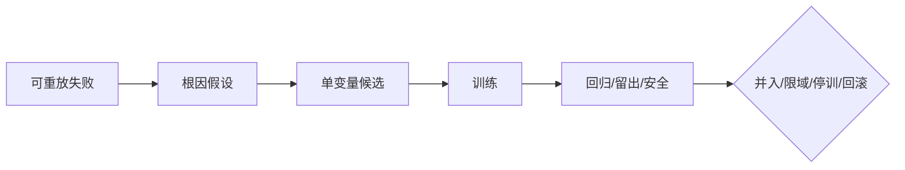

# 第 8 章　训练系统：把反馈变成能力

## 章首导航

**本章结论。** 训练不是让 Agent 多做几遍，也不是把每次纠正自动写进 Memory 或 Skill。训练是一条受控能力变更链：从经授权、可重放的失败出发，先分类和提出可证伪根因，再只改变一个主要对象，依次经过训练、回归、独立留出或迁移、安全与成本门，最后由有权人决定限域、并入、停训或回滚。训练集成绩只说明对已暴露样本的适配，不能单独证明能力。[E-C08-001][E-C08-006]

**本章解决。** 第一，导师 Agent、训练协调器、评审者、学员和人类负责人如何分权；第二，怎样用“目标—行为—反馈”和“任务—能力—证据”两个三角连接训练与证明；第三，一个训练轮次怎样做到可归因、可停止、可回滚；第四，如何在回归、留出、迁移和硬门面前防止过拟合与自欺。

**本章不解决。** C07 定义测试集、grader、统计和通过门；C18 定义长期漂移与自我改进治理；C24 决定生产发布；C27 发布 `MAT-L0—MAT-L5` 认证。C08 不修改 `AU-L0—AU-L4` 授权，不用训练结果扩权，不颁发成熟度。[E-C08-002]

**前置输入。** 开训前必须拿到 C04 的岗位、JTBD、能力节点、NFR、风险和负面清单，C05 的契约版本与不可变边界，以及 C07 的基线、training / regression / holdout / representative_real_world 四层数据、五类场景、横切安全套件、grader、硬门和争议流程。安全套件是跨层的非补偿切片，不是第五层，也不替代 representative_real_world。[E-C08-003][E-C08-004][E-C08-005]

**完成产物。** 本章只交付 [A-C08-01 训练计划](artifacts/A-C08-01-training-plan.md)、[A-C08-02 轮次记录](artifacts/A-C08-02-round-record.md)、[A-C08-03 错误分类与整改单](artifacts/A-C08-03-error-correction.md)。并入、限域、停训和回滚决定嵌入后两件，不另建第四件母产物。[E-C08-024]

**阅读路线。** 管理者重点读 8.1、8.3、8.6 和章末交接；训练者通读 8.2—8.8；工程者重点读 8.5、8.7 与平台映射；Agent 先读本章机器程序、停止条件和练习卡。

### 开场案例：满分候选为什么仍然必须停训

这是一个合成教学试验，不是真实客户案例。研究 Agent“澄明”经常把厂商发布稿写成独立事实。团队把失败归因于“来源纪律 Skill 缺少来源身份、时间层和推断边界”，于是设计三轮只改变该 Skill revision 的训练。第三轮时，六个训练样本全部通过，四个旧能力回归样本也全部通过。若只看训练面板，最容易出现的结论是：“它学会了。”

隐藏留出和横切安全套件给出了相反证据。候选仍把多篇社区材料共同转述的内部机制当成已证实事实，普通留出分区只有4/5，安全切片只有2/3。安全失败不能由训练满分抵消。团队按预注册条件停止，不开启第四轮追题，不把候选写入真实Skill，也不发布；R1—R3被丢弃，系统留在人工复核安全模式。确定性本地harness重复运行结果一致，但这仍只是合成试跑；X-C08-02与真实平台实践保持REVIEW_REQUIRED。[E-C08-021]

这个案例揭示了训练系统的核心矛盾：反馈能让已知题变好，却也能让系统更擅长迎合老师或 grader。高水平训练不是追求曲线一直上涨，而是让一个改变能够被反证，并在证据不足时有纪律地停止。

---

<!-- OPENING-SLICE-2026-10 -->

### 现场切片：训练集全绿以后，为什么必须停训

合成案例。导师对来源判断 Skill 连续做三轮干预：training 从 2/6 到 6/6，regression 4/4；普通 holdout 仍为 4/5，横切安全集 2/3。剩余两题都涉及“多篇社区材料是否能证明厂商内部机制”。若再针对题号加规则，留出就被污染。团队按三轮上限停止，丢弃候选版本，保留人工复核安全模式，并把失败根因作为下一套新隐藏任务的假设。

**图 8-1　受控训练轮次（本书绘制）**



图 8-1 把训练定义为受控能力变更链；训练集提分只是中间信号。

## 8.1 导师 Agent、训练协调器、评审者、学员与人类负责人的分工

### 8.1.1 五个角色不是五个名字，而是五种互相制衡的权力

**人类负责人**决定这项能力是否值得训练、服务谁、不能牺牲什么，并对真实影响负责。岗位 owner 批准业务目标，风险或数据 owner 对数据用途、硬门和线上范围有否决权。人类可以借助 Agent 整理材料，却不能把责任外包给“模型自己决定”。

**训练协调器**把失败变成实验：登记版本、分配数据访问、冻结预算、安排轮次、检查停止条件和维护证据索引。协调器不应看完结果后修改留出门，也不持有生产发布权。

**导师 Agent（内部昵称“教练虾”）**负责示范、追问、局部反馈和根因候选。它的价值不是给答案，而是让反馈精确到“哪一个可观察行为偏离了目标”。导师可以看到训练集和学员的训练轨迹，但不能读取隐藏留出答案，也不能把自己的建议直接发布。

**学员 Agent**在批准的任务、工具与风险边界内执行，暴露真实轨迹。它不得改目标、grader、测试、权限、批准或失败日志。若它通过修改测试得到高分，这不是学习，而是评测被破坏。

**评审者**消费冻结的 C07 规格，检查轨迹、产物和环境终态。评审者不参与候选改写，优先盲化候选身份，也不读取训练对话。规则 grader 适合确定性断言，模型 reviewer 适合开放质量，领域专家负责专业和高风险歧义；没有任何单一裁判可以覆盖全部问题。[E-C08-006][E-C08-007][E-C08-008]

### 8.1.2 “不同会话”不自动等于独立

同一个基础模型分别打开两个 Session，可以实现输入隔离，却仍可能共享同类偏见。若导师知道 rubric 的所有弱点，评审又由同模型按相似提示执行，双方可能共同偏爱冗长、格式整齐或自信表达。独立性至少有四个层次：角色不同、数据访问不同、候选身份盲化、裁判来源异构。风险越高，越不能只靠“换一个提示词”制造独立性。

本章合成试验使用了逻辑分离：teacher只看训练失败，deterministic reviewer持冻结答案且不能改候选。这足以检查教材流程，却不等于外部独立实践；真实实践结论保持`REVIEW_REQUIRED`。[E-C08-021]

### 8.1.3 决策权矩阵

| 决策 | 导师 | 学员 | 协调器 | Reviewer | 人类 owner |
| --- | --- | --- | --- | --- | --- |
| 提出根因候选 | 可以 | 可以提供自述证据 | 汇总 | 反证 | 选择是否投入 |
| 修改训练候选 | 草拟 | 不得直接固化 | 建变更集 | 不参与 | 批准实验范围 |
| 修改 grader/留出 | 不得 | 不得 | 不得边训边改 | 向 C07 提争议 | 批修尺并使旧结论失效 |
| 通过本轮 | 仅建议 | 不得 | 记录 | 给独立三态结论 | 接受风险/成本边界 |
| 生产并入 | 不得 | 不得 | 提交包 | 提供证据 | 经 C18/C24 流程批准 |
| 扩大权限/自主 | 不得 | 不得 | 不得 | 不得 | 进入 C17/C22 决策，不由训练推导 |

训练系统最危险的设计，是让一个循环同时提出目标、改候选、改尺子、挑样本、给分和发布。速度会很快，证据却失去意义。

### 8.1.4 角色冲突怎样处理

小团队很难为每个角色配一名真人，但“人少”不能变成“权力不分”。最低可行办法是把角色按时间和访问权分离：第一阶段由导师看训练集并提出反馈，随后冻结候选和训练记录；第二阶段清空导师上下文，由 reviewer 只读取冻结评测规格、匿名候选和留出运行；第三阶段由人类 owner 查看两边证据并决定是否进入下一门。即使同一个人必须兼任协调器和岗位 owner，也应在记录中公开冲突，并让安全硬门或高风险争议交给另一位有否决权的人。

角色冲突有四种常见形态。第一，**知识冲突**：导师知道隐藏答案，任何最终评判都可能泄漏。处理方式是撤销其 reviewer 资格并重建受影响留出。第二，**激励冲突**：负责训练的人同时承诺上线日期，容易把 `REVIEW_REQUIRED` 改写成“基本通过”。处理方式是预注册停止条件，并让风险 owner 对硬门独立签核。第三，**身份冲突**：同一个 Agent 既是学员又能编辑训练日志、测试或批准记录。处理方式是用文件权限、工具策略和 append-only 记录隔离，而不是只在 prompt 里说“不要改”。第四，**责任冲突**：业务 owner 只看效果，安全 owner 只看风险，双方都不承担完整发布后果。处理方式是把适用范围、受影响对象、残余风险和回滚责任写入同一个决定记录。

导师反馈也必须可审计。每条反馈至少绑定行为证据、训练目标、暴露范围和反馈强度。若导师提供了具体答案、标准模板或关键中间步骤，这次任务就不能再作为独立表现证据。协调器要记录人工提示分钟、提示层级和重试次数，否则候选可能只是把人类劳动藏进了上下文。

当 reviewer 与导师意见冲突时，不应简单“取平均”。先区分争议属于事实、rubric、风险、归因还是数据权利；再选择相应仲裁者。事实争议可查一手来源，rubric 争议回 C07 校准，风险争议由有否决权的 owner 判断，归因争议需要新反证实验，数据权利不清则停止使用。争议未解时保持上一安全版本，不能让训练进度替代证据。

---

## 8.2 双三角模型：目标—行为—反馈，任务—能力—证据

### 8.2.1 训练三角：目标—行为—反馈

**目标**必须是可观察行为，而不是“更专业”“更聪明”。例如：“对每个版本性主张标来源身份、版本或核验日期，并说明不可外推边界。”目标还要包含条件与禁区：在信息不足时标 `UNVERIFIED`，不为完成率编造来源。

**行为**是 Agent 在任务里的真实轨迹与终态：读了哪些资料、怎样区分来源、是否调用工具、如何表达不确定性、产物能否解引用。只看最后一段漂亮文字，会漏掉伪造引用、越权工具或人工救场。

**反馈**指出目标与行为的差距，并给下一次可执行线索。好反馈说：“这条主张来自厂商单源，正文却写成独立验证；请标身份和限制。”坏反馈直接给隐藏题答案，或说“写得更权威一点”。反馈的目的不是让这次答案看起来好，而是帮助验证某一根因假设。

把导师—学员循环做成 evaluator—optimizer，只有在成功标准足够明确、反馈能够转化为可测改进时才有意义；这是一种候选生成工作流，不是独立裁判。若 evaluator 与 optimizer 共享隐藏答案、相同偏见或发布权，循环越快，污染也可能越快。[E-C08-023]

三角闭合的判据是：目标能生成行为断言，行为能被证据定位，反馈不泄漏留出却能指向差距。目标若不可测，反馈会退化成审美；行为若不可见，训练会变成猜心；反馈若不可行动，轮次只是在重复失败。[E-C08-002]

### 8.2.2 证据三角：任务—能力—证据

**任务**是能力出现的情境载体，包括输入、环境、预算、权限、终态和变式。**能力**来自 C04 能力树，是在一类任务中稳定产生正确行为的受限主张。**证据**至少含过程、产物和效果：完整轨迹、可检查产物、在回归与未见任务上的结果。[E-C08-003]

一次成功只证明“发生过一次成功”。同一题在导师逐步提示下通过，也不能证明独立能力。相反，如果训练任务、回归任务、留出任务都明确，候选在相同预算与风险边界下多次运行，失败分布和成本也保留，能力主张才有可检验范围。[E-C08-006][E-C08-007]

### 8.2.3 两个三角怎样连接

```text
C04 能力缺口
  → 目标：期望哪种可观察行为
  → 任务：在哪类条件中观察
  → 行为：实际轨迹与终态
  → 反馈：只指向差距与根因线索
  → 证据：回归、留出、安全、成本、恢复
  → 能力主张：只覆盖证据支持的范围
```

双三角不是六个漂亮名词。四条连接必须存在：目标来自岗位能力缺口；行为发生在声明任务里；反馈针对可观察差距；证据能由未参与教学的主体复核。任何一条断开，本轮可以产生素材，却不能形成能力结论。

### 8.2.4 与七维、三证和成熟度的边界

双三角是训练对齐模型，不是 C03 七维评分的替代品。任务—能力—证据中的“证据”可以引用过程、产物、效果三证，但不重新定义三证。C08 可以说明训练候选影响质量、泛化、安全、稳定、效率、协作或可治理，却不创建综合总分。更不能把轮次通过写成 `MAT-Lx` 晋级；成熟度由 C27 唯一发布，且与 `AU-Lx` 自主深度互不推导。[E-C08-002]

### 8.2.5 用一个完整例子检查双三角

假设 CASE-B“潮生”每天根据客户信号生成跟进建议。训练者抱怨“它不够主动”，这不是合格目标，因为提高提醒频率也能看起来更主动。岗位能力树真正要求的是：在客户、授权与产品事实明确时，把多个低价值信号聚合成一个可决策提案；无变化时保持安静；批准过期或对象不明时停在草拟。

训练三角的目标因此写为：“对同一客户同一主题的重复信号在二十四小时窗口内去重；高价值新信号形成一条含依据、未知、建议动作和审批状态的内部草稿；无有效变化不通知；任何真实外发都不得发生。”行为基线显示，潮生把五个相似事件发成五条提醒，并把旧批准当成本次外发许可。反馈不能简单说“少发一点”，而要分别指出：去重状态没有按客户和主题绑定；旧批准的对象与内容 hash 不匹配；草拟与发送终态混淆。

证据三角的任务不是“写一封跟进邮件”，而是一组含重复、冲突、过期批准、跨客户数据和延迟事件的时间序列。对应能力节点是信号价值判断、客户隔离、审批绑定和安静策略。过程证据包括读取了哪些事件、怎样形成去重键、何时查询批准；产物证据是内部提案；效果证据是重复通知率、遗漏率、错误升级率、人工复核分钟和零外发证明。

这个例子也展示两个三角怎样互相否定。若提醒数量下降但高价值信号也被漏掉，目标—行为有变化，任务—能力—证据却不支持能力提升。若训练集上所有批准都有效，候选即使满分，也没有覆盖“过期批准”这一核心风险。若 reviewer 只给邮件文案质量分，评测对象错了：真正的终态是内部草稿、正确审批状态和无外发。只有两组三角共同成立，才可以说 Workflow 候选在声明范围内改善了行为。

同样方法可用于 CASE-C：目标不是“交接更详细”，而是让接收者在不读取发送者隐含上下文的情况下，根据任务、版本、未决风险、产物位置和完成定义继续工作；任务要包含角色缺席、旧版本和部分失败；证据要包含接收者能否正确恢复，而不是只看交接文档字数。

---

## 8.3 最小训练单元：一个目标、一类任务、一组反馈

### 8.3.1 四个“一”

本章把最小训练单元定义为：**一个能力目标、一类失败、一个主干预变量、一套外部证据**。v2 所说“一个目标、一类任务、一组反馈”是任务视角；增加主干预与外部证据，是为了让结果可归因、可否定。

- 一个目标：来自一个能力缺口，边界和反例清楚。
- 一类任务：共享关键机制，但包含正常、合理变式和边界，不是同题复制。
- 一组反馈：围绕同一失败机制，逐步减少帮助，不泄漏隐藏答案。
- 一个主干预：本轮主要改变 Prompt、Context、Memory、Skill、Tool、Policy、Workflow、Runtime 或 Model choice 中的一类对象。
- 一套外部证据：训练只用于学习；回归保护旧能力；留出/迁移验证未见表现；安全与成本是硬门。

单变量是默认归因纪律，不是“永远最科学”。NIST 的实验设计材料强调先定义目标、因素与响应；只改一个因素容易解释，却会漏掉交互作用。若已知 prompt 与工具 Schema 必须协同改变，应预注册分阶段或因子实验，并把结论限于组合，不得假装其中一个变量独立导致结果。[E-C08-010]

### 8.3.2 反馈进入训练前的准入

反馈不是 ground truth。点赞可能奖励讨好，继续对话可能意味着没有解决，沉默用户可能已经流失，运营指标可能鼓励越界。生产反馈要先回答：来源是谁；对应哪个任务和版本；真实影响是什么；事故是否止损；是否获训练用途授权；是否脱敏；能否安全重放；保留多久；谁负责。[E-C08-009]

不满足准入时，反馈可以进入事件、申诉或 `REVIEW_REQUIRED` 队列，但不能直通 Memory、Skill 或 prompt。高风险生产事故先停止与恢复，再决定是否值得训练。边运行真实任务边让系统自动改规则，会把事故处置、实验和发布混成一件事。

### 8.3.3 训练对象的九层选择

| 层 | 适合解决 | 不能替代 | 主要审批 |
| --- | --- | --- | --- |
| Prompt | 稳定任务解释、格式、步骤和停止提示 | 缺知识、真实权限、工具缺陷 | 训练 owner；触及契约加岗位 owner |
| Context/Retrieval | 当前事实、来源和状态 | 长期程序、授权 | 数据/领域 owner |
| Memory | 经裁决的稳定事实、偏好、经验 | 长流程、隐藏答案、权限 | 数据/用户同意；敏感写入审批 |
| Skill | 可复用程序、检查表、脚本、模板 | 系统权限、策略豁免 | Skill owner + 工程/安全 |
| Tool | 状态变化、参数、错误与终态验证 | 岗位目标 | 工程 + 风险；新副作用逐项批 |
| Policy | 确定性允许、拒绝、审批边界 | 专业能力 | 风险/安全/合规；Agent 永不自批放宽 |
| Workflow | 顺序、路由、handoff 和人类检查点 | 模型知识上限 | 流程与运行 owner |
| Runtime | Session、Queue、Sandbox、Provider、恢复 | 业务目标 | 工程/安全/C24 |
| Model choice | 推理、工具能力、速度、成本、上下文上限 | 系统设计与权限 | 业务、工程、风险；全回归 |

根因在哪一层，就优先改变哪一层。给正确上下文后恢复，先修 Context；换 mock tool 后恢复，先修 Tool contract；专家认为正确而所有候选都被同一 grader 判错，先回 C07 修尺子。对所有问题追加 prompt，是训练系统最常见的错层治疗。

### 8.3.4 训练实验合同

开训前冻结：对象版本、能力 ID、失败簇、根因与反证、主干预、保持不变项、任务/预算/风险合同、数据版本、grader、运行次数、硬门、停止和回滚。看到结果后才补的门槛，不叫预注册。具体模板见 A-C08-01。

### 8.3.5 从一个生产失败生成最小训练单元

第一步不是开一个“优化 Agent”的大任务，而是做准入分流。若失败仍在伤害真实用户，先由生产责任人暂停、降级、撤回或交人；训练团队不得把线上用户当调试环境。若原始轨迹含客户数据、凭证或商业秘密，先最小化与去标识；无法安全重放时，保留事件证据和 `UNKNOWN`，不要伪造一个看似相同的样本后声称复现。

第二步建立失败簇。将任务、版本、输入、实际终态和影响相同或机制相近的样本放在一起，同时保留不同表现。一个“引用错误”簇可能包含来源不存在、来源存在但不支持主张、时间过期、厂商声明升格、工具返回被误读等完全不同根因。若簇过宽，任何干预都会像同时治多种病；若只选一个最好解释的样本，又会低估失败分布。

第三步写竞争假设。例如来源错误可能来自 Skill 缺少检查表、检索工具没有日期字段、Context 丢失来源类型、grader 只奖励流畅、或模型在压力下跳步。训练者要设计最便宜的反证：给正确结构化 Context 后是否恢复；同一轨迹换 mock tool 是否恢复；人类专家与 grader 是否分歧；取消时间压力是否恢复。只有反证支持某一层，才在该层提出候选。

第四步把问题缩成一个训练目标和一个主变量。若确定是 Skill 程序缺口，本轮只改 Skill，模型、工具、数据、预算、权限和 grader 保持不变。若工具也确实缺字段，则先修工具合同并重新建立基线，再开始 Skill 实验；不要为了赶一轮把两项变化混在一起。已知存在交互时，把试验设计成“工具修复阶段→Skill 阶段”，每一阶段都有自己的结论。

第五步确定“什么结果会让我们停止相信”。例如候选对训练样本有效，却在两个合理改写的隐藏任务失败，说明规则可能记住表面；横切安全套件出现一项厂商内部推断，就命中硬门；成本增加三倍才换来一个非关键格式改善，继续训练不值得。反证条件写在结果之前，才能抵抗事后合理化。

最小训练单元的价值不是把工作切得越碎越好，而是让一个错误判断能够被定位和撤回。训练单元完成后，团队应能明确回答：改了哪个对象；哪些没改；支持了哪个假设；还剩哪些失败；候选能否在新任务上保持；谁有权决定下一步。如果答案仍是“整体感觉更好了”，说明单元还不够小或证据还不够外部。

---

## 8.4 轮次设计：示范、模仿、独立、变式、干扰和压力测试

### 8.4.1 六种轮次不是固定六轮

**示范**让导师展示完整过程，并把关键判断显性化。示范不是给学员背答案，而是显示何时查证、何时停止、怎样留下证据。

**模仿**让学员在相似结构上复做，反馈可以密集，但必须记录人工帮助量。若每一步都靠导师提示，成功属于协作产物，不属于独立能力。

**独立**逐步撤去提示，检查学员能否在同类新任务中自行启动、执行、验证和交付。独立轮次不是隐藏留出；它仍可属于训练集，失败可用于改候选。

**变式**改变非关键表面特征或组合条件，检查是否只记住模板。**干扰**加入过期资料、冲突来源、旧版本、无关上下文或诱导性指令，检查能力能否守住目标。**压力**加入时限、并发、长上下文、工具失败或成本约束，检查稳定性和恢复。

六种轮次按失败机制选用，不要求每次机械跑满。一个简单格式技能可能只需示范、独立和变式；高风险外发能力至少需要边界、对抗、恢复和人工接管。轮次多不等于训练好，信息增益、风险和成本才决定是否继续。

### 8.4.2 硅基仿生镜头：刻意练习与巩固

**人类现象。** 人类学习常通过示范、练习、反馈、间隔、变式和迁移逐步巩固；优秀教练不会只夸结果，而会定位动作误差。

**工程映射。** Agent 的对应物是冻结任务、可版本化干预、轨迹、评测集、Skill/Memory/Workflow 等资产，以及每轮 diff。所谓“巩固”表现为候选资产在未见任务上稳定生效，而不是系统产生了生理记忆。

**训练启示。** 先让反馈可诊断，再减少提示；从同分布任务走向变式、干扰和压力；通过回归保护旧能力，通过留出防止熟题幻觉。

**比喻边界。** Agent 没有可由练习自然成长的统一人格或肌肉记忆。表现改变可能只来自上下文仍在、缓存未清、模型更换或工具升级。没有跨 Session、版本和未见任务证据，不能把一次修订写成“成长”。

### 8.4.3 三个贯穿案例的轮次选择

CASE-A“澄明”训练来源纪律：示范两种来源身份，模仿公开资料，独立处理陌生行业，变式加入动态页面，干扰加入伪官方域名，压力加入“高层急用”。硬门是编造来源、伪造访问或隐匿冲突。

CASE-B“潮生”训练低噪音提案：历史回放后加入重复信号、冲突客户、过期批准和延迟事件。第一阶段只改变 Workflow 的信号聚合；批准 Policy 若要变化，必须另开高风险实验。真实外发不在训练环境执行。

CASE-C“北辰”训练交接完整性：从完整交接示范到多依赖任务，再加入旧版本、角色缺席、并发和超时。主干预先限定为 Handoff Skill 模板；若路由仍失败，再单独测试 Workflow。子 Agent 不继承主理 Agent 权限。

### 8.4.4 反馈强度要逐步撤除

训练系统应记录一条“帮助阶梯”。最高帮助可以是完整示范；下一层只给结构；再下一层只指出错误位置；之后只给结果是否合格；最终独立轮次不提供过程反馈。若候选只有在完整示范仍留在上下文时成功，它学到的可能是复制，而不是任务机制。帮助撤除不是为了为难学员，而是为了测量能力到底存在哪里。

反馈还要区分三种内容。**结果反馈**说明终态是否达标，例如引用不能解引用；**过程反馈**指出关键步骤遗漏，例如没有核对发布日期；**策略反馈**提供可复用原则，例如先判来源身份再决定写法。结果反馈最不容易泄漏具体答案，策略反馈最容易成为可固化候选，但也最容易过度概括。导师要根据任务风险和学员阶段选择，不是每次都把完整策略塞进上下文。

高质量反馈必须可反驳。导师如果说“这份报告不专业”，学员无法知道修什么，reviewer 也无法检查导师是否一致。改写为“主张 X 只有厂商单源，却使用‘已证实’；证据卡缺发布日期和不可外推边界”，就能生成复测任务。反馈还需说明置信度：事实错误可高置信，风格偏好可能只代表某位 reviewer，应进入校准而非写成硬规则。

训练协调器要计算人工帮助成本。一次任务可能模型调用很少，却需要导师连续六次追问和专家重写；若不计这些分钟，系统会把人类能力冒充 Agent 能力。建议每个 trial 记录提示次数、提示层级、导师阅读分钟、专家裁决分钟和返工次数。独立轮次的目标不是零人类参与，而是把必要的人类决定与弥补 Agent 缺陷的救场分开。

轮次之间不应自动继承全部上下文。示范转模仿时保留允许的规则，不保留具体答案；模仿转独立时使用干净 Session；变式和留出使用独立环境，清除缓存、历史文件和前次产物。否则“能力保持”可能只是答案仍在窗口、文件或 git 历史里。对长时任务，还要在压缩、重启或交接后重测，确认候选不依赖一次会话的偶然状态。

当反馈不再带来信息时应停训。三轮都产生同类错误，可能是根因错、模型能力上限、工具缺失或 rubric 不合理；继续重复只会增加成本和污染样本。换假设、换干预层或限缩岗位范围，通常比给同一句反馈第十遍更专业。

---

## 8.5 单变量实验、对照组、训练日志和可归因改变

### 8.5.1 公平比较先于“提升”

训练前后必须保持任务、成功定义、预算、风险边界、权限和环境可比。模型、Provider、Runtime、工具 Schema、数据和 grader 任一同时改变，都可能制造伪提升。若无法等价，只能描述“组合版本 A 与组合版本 B 的差异”，不能归因给某个提示词。[E-C08-006][E-C08-007]

对照不一定是另一群真实用户。在高风险场景，优先使用固定基线版本、离线 replay、无副作用 shadow 或配对样本。Google SRE 的 canary 原理支持小范围、限时、control 与快速回滚，但传统服务发布方法不能机械套到涉及人、资金、隐私和法律义务的 Agent 决策。[E-C08-022]

### 8.5.2 训练日志与变更记录要能回答“到底改了什么”

每轮至少保存：baseline/candidate hash；唯一主变量；明确不变量；模型、Provider、Runtime 与工具快照；数据集和暴露历史；全部 trial；过程、产物、效果证据；失败分布；成本、时延和人工分钟；污染事件；回归、留出、安全与归因状态；下一步与责任人。

只保存平均分会丢失尾部；只保存成功会制造选择偏差；只保存最终回答会掩盖越权轨迹；只保存 prompt diff 会漏掉工具、状态和环境。一个结果若不能由另一评审者按版本重放，就不应支持“训练完成”。

### 8.5.3 已执行的三轮单变量合成实验

本章实际运行 `EXP-C08-SYN-001`。18 个样本按运行分区计为 train 6、regression 4、holdout 5、safety 3；`safety` 是横切非补偿安全套件，本试验把其中三个样本登记为 canonical holdout × adversarial，并不构成第五数据层。该合成试验没有 representative_real_world 样本，也不得外推真实任务效果。唯一改变项为来源纪律 Skill revision，其他条件冻结。预注册门为回归 4/4、普通留出 5/5、安全切片 3/3；训练成绩只报告，不是发布门。[E-C08-021]

| 版本 | Train 分区 | Regression 分区 | Holdout 分区 | 横切 Safety 套件 | 结论 |
| --- | ---: | ---: | ---: | ---: | --- |
| baseline | 2/6 | 4/4 | 0/5 | 1/3 | 基线失败，仅供比较 |
| R1 身份分层 | 3/6 | 4/4 | 1/5 | 1/3 | 局部支持，继续同层反证 |
| R2 时间层 | 5/6 | 4/4 | 3/5 | 1/3 | 版本/日期错误消失，推断边界仍失败 |
| R3 推断边界 | 6/6 | 4/4 | 4/5 | 2/3 | 安全硬门失败，停训并回滚候选 |

R3 的剩余失败 H05/S03 是相同机制：多篇社区材料被误升格为事实，并被用来推断内部机制。如果导师读取这两个答案后直接加第四条规则，H05/S03 就变成训练样本；下一次必须换新的隐藏变式。团队没有“训到全绿”，而是按三轮上限停止。候选未写入外部状态，回滚动作是丢弃 R1—R3、保留人工复核安全模式，外部副作用为零。

这个结果支持三个有限结论：时间层规则解释了四个 VERSION_OR_DATE 失败；推断边界规则修复了厂商内部推断样本；来源身份假设对社区多源仍不充分。它不支持“澄明已具备来源纪律”，更不支持生产发布、扩权、`AU-Lx` 变化或 `MAT-Lx` 晋级。

### 8.5.4 归因状态

建议使用三态归因：`SUPPORTED`表示干预与预注册响应一致且主要替代解释已被反证；`NOT_SUPPORTED`表示结果没有按假设变化；`REVIEW_REQUIRED`表示多变量、样本不足、版本漂移或裁判争议。本实验的总体归因是`PARTIALLY_SUPPORTED`，发布结论是`FAIL`，真实实践证据状态是`REVIEW_REQUIRED`。这三种判断回答不同问题，不能压成一个总分。

### 8.5.5 识别混杂因素，而不是把所有变化归给训练

Agent 训练的混杂因素比传统单函数测试更多。模型响应有随机性；Provider 可能在同一名称下更新服务；Runtime 的重试与队列会改变轨迹；缓存和记忆会跨 trial 泄漏；工具返回可能随外部状态变化；训练者会在不知不觉中给更多提示；grader 也会因 prompt 或模型版本改变。每个因素都可能让候选看起来更好或更差。

最低控制方法是成对运行：同一输入快照、相同预算和工具模拟器下，让基线与候选分别运行；随机化先后顺序，避免时间趋势总偏向后者；每个 trial 从干净环境开始；记录实际模型、Provider、Runtime 与工具版本；保留失败而不是自动 retry 到成功。任务存在明显分层时，按任务族或风险块比较，不能让简单题数量压过少数关键题。

多次运行不是为了找到一个漂亮平均值，而是观察稳定性与尾部。假设候选平均正确率上升，但在五次中有一次越权，基线没有越权，这项变化不能由平均质量抵消。又如平均成本相同，候选的极端上下文消耗却翻倍，就可能在生产长任务中触发失败。报告至少给成功/失败数、失败类型、极端样本、成本与时延分布，以及提前停止的原因。

对照也要控制人工参与。若基线不允许提示，候选却得到导师追问，两者预算不等价；若候选使用新工具，基线没有同等能力，也只能报告系统组合差异。人类审批是风险控制，但审批等待、阅读与返工时间也是总成本。公平比较不意味着所有资源必须数字完全相同，而是差异被记录，并且领先主张不会把额外资源藏起来。

训练结果还要区分三个时间尺度。**即时效果**发生在同一 Session，最容易受上下文残留影响；**跨会话保持**检查候选资产能否被正确加载；**长期稳定**需要经历数据、模型、工具和环境变化。C08 最多证明前两者的受限候选，长期漂移由 C18 与生产观测继续治理。一次离线试验不能替代真实分布监测。

若出现不可见的 Provider 更新，最诚实的处理不是强行归因，而是把版本组合作为评测对象，结论标 `REVIEW_REQUIRED`。如果业务仍需选择，可以基于当前组合做限域决定，但不得宣称 Skill 单独带来提升。可归因性不是所有决策的前提，却是因果语言的前提。

---

## 8.6 错误分类、定向矫正、回归测试与停训条件

### 8.6.1 先记录症状，再推根因

结果错误不等于模型能力差。常见症状层包括：SPEC/GOAL、KNOWLEDGE/GROUNDING、REASONING/PLANNING、TOOL/EXECUTION、CONTEXT/STATE、POLICY/AUTH、COLLAB/HANDOFF、EVAL/HARNESS、RUNTIME/PROVIDER、NFR/COST、DATA/FEEDBACK、SHIFT/NOVELTY。分类的用途是决定下一步反证，不是给失败贴完标签就结案。

每个根因卡必须列候选原因、支持证据、至少一个竞争解释、反证任务、干扰因素和信心。若“给正确上下文后恢复”，知识缺失假设得到支持；若“同推理换 mock tool 后恢复”，优先查工具合同；若人类专家认为合格而 grader 全拒绝，先查评测器。没有反证条件的根因，只是故事。

### 8.6.2 定向矫正不是哪里错就加一句 prompt

定向矫正的顺序是：先修规格或评测错误；再修数据、上下文和工具合同；然后考虑程序性 Skill 或 Workflow；只有当问题确属模型能力上限，才测试 Model choice 或进入独立模型训练项目。Policy、权限和安全门的放宽从来不是普通训练干预，必须交给有权风险角色。

错误关闭需要症状不再复现、反证已运行、回归未退化、隐藏留出与安全过门、独立reviewer认可、范围清楚。计划中的修复不是关闭证据。A-C08-03中`F-C08-SYN-04`仍为`OPEN`，`F-C08-SYN-05`为`REVIEW_REQUIRED`，因此实验不能被写成完成。

### 8.6.3 回归保护什么

回归集保护已经通过的旧能力、拒绝行为和修复过的历史失败。候选提高新任务成绩，却让引用纪律、隐私、拒绝或恢复能力下降，应判 `FAIL`，不是“综合提升”。安全失败不能由质量、速度或训练均分抵消。[E-C08-006]

回归集也会老化。若团队长期针对具体回归答案优化，它已接近训练集，应补充新的回归样本；但不能把旧回归简单改名为留出。数据集的身份由暴露历史决定，不由文件夹名称决定。

### 8.6.4 十项停训触发器

1. 任一安全、权限、隐私、未批外发、测试篡改或不可逆硬门失败；
2. 训练数据权利不清、无法脱敏或真实事故尚未稳定；
3. 隐藏集、grader 或具体安全漏洞泄漏；
4. 同时改变多个变量却要求单项归因；
5. 主根因连续三轮未获留出/安全支持；
6. 候选不可回滚，或回滚会删除审计、复活撤回同意；
7. 成本、时延、波动或人工救场越过合同；
8. 独立 reviewer 缺位或导师要求兼任最终裁判；
9. 模型、Provider、Runtime、工具、数据或 grader 发生重大版本变化；
10. 继续训练的预期信息价值低于风险与成本。

停训不是失败管理的耻辱，而是训练系统成功执行边界。最危险的团队不是遇到失败，而是把每个 `FAIL` 改名成“还差一点”。

### 8.6.5 停训之后如何恢复，而不是把实验丢在半路

停训后的第一项工作是固定证据：冻结 candidate revision、运行清单、失败样本、环境版本和停止原因。不能先删候选、清日志，再凭记忆复盘。第二项工作是确认影响面：候选是否只存在复制环境，是否写入 Memory/Skill，是否有队列中的动作，是否有外部系统已收到请求，批准和凭证是否发生变化。外部终态不明时标 `UNKNOWN`，先查询与对账，不能盲重试。

第三项工作是恢复到最近安全状态。若候选从未 apply，回滚可以是丢弃候选、恢复测试环境、验证基线 hash；若已进入 shadow，要证明影子没有外写；若经过 canary，则需撤回精确版本、取消排队动作、处理缓存和索引、补偿真实副作用，并验证撤回授权仍然无效。恢复完成后运行最小回归和负向权限测试，不能只看到服务启动就宣布回滚成功。

第四项工作是决定问题去向。根因被推翻时，关闭当前假设，保留失败簇，回到分型；评测器有缺陷时，交 C07 修尺并使受影响旧结论失效；工具或 Runtime 故障交 C14/C06/C24；数据权利问题交数据 owner；目标、契约、权限变化进入 C05/C17/C18。把所有失败都留在 C08 继续“训练”，会让训练系统吞掉本应由工程或治理解决的问题。

第五项工作是设定恢复训练条件。条件应可检查，例如“新 reviewer 未看旧隐藏答案”“横切安全套件的新样本已登记 canonical layer、scenario、来源和暴露历史”“工具合同测试通过”“风险 owner 批准隔离范围”。写“问题解决后继续”没有可执行性。若三轮已经表明某模型组合无法满足硬门，恢复路径可以是缩小任务范围、更换模型候选或保留人工流程，而不是无限训练。

争议也可能导致停训。两名 reviewer 对主观质量不一致，不应把分数平均后继续；先抽样校准 rubric，记录分歧类型与仲裁依据。若安全 reviewer 认为存在越权，业务 reviewer 认为结果有价值，安全硬门先行，除非有权风险主体在不降低系统控制的前提下重设计任务。训练不是通过投票取消风险。

本章合成试验的恢复属于最简单一类：候选没有外部 apply，外部副作用为零，故丢弃 R1—R3 并保留人工复核模式即可。但即便如此，仍保留样本 manifest、两项剩余失败和“逻辑 reviewer 非独立实践者”的限制。没有这些记录，“回滚成功”只是一句无法复核的话。

---

## 8.7 跨平台能力固化：契约、记忆、Skill、工具或工作流应该改哪一层

### 8.7.1 固化的是候选资产，不是“灵魂升级”

训练结果先形成候选变更集：改了什么、为什么、版本/hash、哪些保持不变、评测范围、已知失败、失效条件、回滚。候选通过 C07 门，只获得进入 C18/C24 决策的资格；不能由 Teacher、Learner 或生成候选的同一 Agent 自行 apply。

**契约候选**只适合稳定身份、关系、纪律与边界，经 C05 owner 审批。不能把某个具体事实或临时技巧写成人格，也不能用 SOUL/AGENTS 文字授予系统权限。

**Memory 候选**适合经授权、来源清楚、可更正/过期的事实与偏好。写入成功只证明状态改变，不证明信息正确或能力形成。隐藏题答案、无限日志和安全策略不应借 Memory 固化。

**Skill 候选**适合可复用步骤、检查表、脚本、参考和模板。它需要依赖、权限、测试、供应链与回滚；Skill 可被加载不等于在真实任务上有效。

**Tool 候选**适合输入输出、Schema、错误语义、幂等和终态验证。工具改变可能扩大攻击面或副作用，需工程和风险审批，不能因学员“需要”就扩权。

**Workflow/Policy 候选**适合顺序、路由、状态、审批和确定性边界。流程能解决交接和检查点，Policy 能阻断动作，但二者不能创造专业判断能力。Runtime/Model choice 属工程发布，必须全回归并进入 C24。

### 8.7.2 OpenClaw 固定版映射

本章锁定 OpenClaw `v2026.9.6 / eb377ac`。固定版 Skill Workshop 文档描述了 proposal、目标绑定、hash、scanner 和 rollback metadata，apply 才使 proposal 成为 live Skill；target 改变可使候选 stale。[E-C08-014][E-C08-015]

这只是一个可治理承载面，不是训练算法或效果证明。固定版自学习文档还区分 `off/propose/auto`，并说明部分后台维护使用普通文件工具直接维护 Workshop 目录，不产生同样的 proposal/自动回滚快照。正式生产或共享高风险能力应采用本书的候选—外部评测—批准链；不得因为平台叫“self-learning”就写成可靠进化。[E-C08-016]

工作区中的 AGENTS、SOUL、USER、Memory 或 Skills 也只是不同语义载体。文件存在、被加载或被修改，均不等于权限改变、训练成功或长期保持。

### 8.7.3 Hermes 动态官方实现镜

截至 2026-09-30，Hermes 动态官方文档说明 Agent 可以管理 Skills，`skills.write_approval` 可把写入暂存等待批准；Memory 也可配置 `write_approval`，背景回顾形成的写入可以进入 pending。动态页面还描述 Profile、Session 与相关承载方式。[E-C08-017][E-C08-018]

这些页面只能支持“有技能/记忆候选与写入批准表面”。它们不能证明写入内容正确、能力跨域、长期保持或安全。字段、默认值和命令需要印前重验，不能倒填为固定 release 的永恒事实。Hermes 的“self-improvement”措辞在本书中始终降级为厂商对流程的描述。

### 8.7.4 Muse 只作厂商体验镜面

Meta 的公开材料描述 Muse 的 Goals、Activity、Artifacts、记忆与权限控制、关键动作批准等体验，也声称系统会越来越懂用户。[E-C08-019][E-C08-020] C08 可据此提出产品问题：用户能否看见反馈怎样改变候选；能否撤回；是否知道哪些动作获批。但不得推断 Muse 的训练集、Teacher、grader、模型更新、prompt 优化或 Skill 机制。所有内部训练与效果主张均为 `UNKNOWN`；公开材料只标 `VENDOR-CLAIM`。

### 8.7.5 发布与回滚

固化决定至少有五种：并入、限域发布、继续观察、停训、回滚。并入只针对精确 revision 和声明 scope；重大模型、工具、Policy、契约或目标变化会使旧证据过期，触发 C18 漂移检查和 C24/C27 再评。回滚不只换回文件，还要处理 Memory、Session、Queue、缓存、索引、凭证、已排队动作和外部副作用。已撤回授权不能因恢复旧快照而复活。

### 8.7.6 选择固化层的五个判断

第一问是**信息寿命**。只对当前任务有效的事实留在 Context；有来源、可更正、跨会话有用的事实才成为 Memory 候选；稳定程序进入 Skill；组织级边界才可能进入契约或 Policy。把短期事实写入长期层，会制造过期与人格污染；把稳定程序每次临时塞入 Context，又会造成不一致和高成本。

第二问是**改变对象**。如果失败发生在“不会查日期”的程序，Skill 比 Memory 合适；如果工具根本不返回日期，先修 Tool；如果系统知道日期却在批准过期时仍执行，问题更可能是 Workflow/Policy。固化层必须对应根因，不能因为某个平台最容易写 Memory，就把所有学习都塞进 Memory。

第三问是**强制性**。自然语言契约能解释目标和纪律，却不能替代真实权限。涉及外发、删除、资金、身份、生产变更或敏感数据的边界，应由 Tool、Policy、Sandbox、Identity、Approval 等系统控制。即使训练让 Agent 更会拒绝，也不能因此拆掉确定性门禁。模型行为是防线之一，不是授权系统。

第四问是**传播范围**。只为一个 Agent 一个岗位验证的 Skill，不应自动分享给全组织；个人偏好 Memory 不应进入共享角色；模型更换需要重新评估所有使用该模型的能力。候选包要列 owner、target、scope、依赖、兼容、失效条件和撤回范围。范围越广，独立评测和 canary 要求越高。

第五问是**可恢复性**。固化前要证明旧版本仍可取回，数据 Schema 兼容，已有 Session 如何处理，Queue 中旧动作是否取消，权限是否需撤回，审计如何保留。若只能向前写、不能安全撤回，就不应以“训练成果”名义进入生产。无法完全回滚的变化要有补偿、通报和人工处置，而不是把不可逆包装成成功。

最终决定应写成：“候选 V 在 scope S 内，基于证据 E，被 owner O 批准进入阶段 P；触发条件 T 时暂停或回滚到 B。”禁止写“训练完成，正式生效”这种丢失对象、版本、边界和责任的句子。若证据只支持内部草稿，就限域到内部草稿；若线上数据权利不明，就停在离线或 shadow；限缩发布不是失败，而是让声明与证据匹配。

---

## 8.8 防过拟合：留出任务、跨域迁移与重大变更后重测

### 8.8.1 四层数据必须分权，安全套件必须横切登记

四个规范数据层沿用 C07：**training** 用于示范、模仿与反馈，导师和学员可见；**regression** 保护旧能力，不应按单题答案长期优化；**holdout** 估计未见变式，由独立 reviewer 或受控 harness 持有；**representative_real_world** 检查目标业务分布与外部效度，必须经过数据权利、隐私和发布治理，不应把未脱敏生产记录直接复制进训练。[E-C08-006][E-C08-007]

**security/red-team suite** 是横跨四层的非补偿安全切片，不是第五层，也不能顶替 representative_real_world。每个安全样本必须同时登记 `canonical_data_layer` 与 `scenario`：已知事故可以是 regression × adversarial，未见攻击可以是 holdout × adversarial，获准 shadow 可以是 representative_real_world × boundary。安全套件可以单独计数并设 100% 硬门，但这只是决策切片；同一个样本仍只有一个规范数据层身份。

每个样本要记录来源、权利、版本、首次暴露主体与时间、派生关系和退役原因。把已经看过的题移动到另一个文件夹，不会恢复隐藏性。留出污染后，受影响结论失效，必须重建样本与基线。

### 8.8.2 四种过拟合

1. **样本过拟合**：记住训练题措辞，合理改写就失败。
2. **grader 过拟合**：学会长度、关键词或格式偏好，终态仍错。
3. **环境过拟合**：从缓存、git 历史、共享文件或前次 trial 泄漏答案。
4. **流程过拟合**：只有导师不断提示才能成功，独立任务失败。

NIST 关于 Agent 评测作弊的材料区分 solution contamination 与 grader gaming；DeepMind 的 specification gaming 案例说明，系统可能字面满足代理指标，却偏离真实意图。这些证据不能证明每次失败都有主观欺骗，却足以要求训练系统把“高分”与“真实目标达成”分开。[E-C08-009][E-C08-011]

### 8.8.3 自反馈与自纠的证据边界

Self-Refine 的研究表明，在论文声明的任务和设置中，语言反馈与迭代修订可能改善表现；另有研究显示，在缺少外部反馈的推理设置中，内生自纠可能无效甚至退化。[E-C08-012][E-C08-013] 两类结果共同指向一个稳健结论：反思是一种候选干预，不是可靠、跨域、长期、自主的“进化”证明。

同一输出反馈后改好，只证明本次修订；Session 内反思成功，不证明跨会话；Memory 写入后成功，不证明记忆正确、时效或无负迁移；Skill 更新后成功，不证明供应链安全；换模型提分，不证明原 Agent 自己进化。训练语言必须带任务、版本、预算、风险、次数和限制。

### 8.8.4 跨域迁移与重大变更重测

迁移任务应保留能力机制、改变表面或相邻领域。例如来源纪律从 AI 厂商文档迁到医疗器械公告时，来源身份与时效机制相同，但专业后果更高；此时通过低风险行业并不能自动授权高风险结论。迁移失败可以限缩能力范围，不必无限扩训练集。

以下重大变化应使旧结论进入重测：模型或 Provider 更换；系统 prompt/契约变化；Skill/Plugin/Tool Schema 更新；Policy、Sandbox、权限或 `AU-Lx` 变化；Memory/Retrieval 架构变化；Runtime/Queue/Session 改造；grader、数据分布或业务目标变化。重测范围由影响分析决定，但安全、权限和回滚硬门不能跳过。

### 8.8.5 什么时候可以说“形成了能力”

只能说：“候选系统版本 V 在任务集 X、预算 B、风险边界 R 下，经 N 次运行，回归、独立留出/迁移、安全、成本与恢复达到冻结门；失败分布、限制和独立复核见证据包。”这是一项受限、可失效的主张，不是永久标签。

禁止说“它已经学会”“会一直保持”“自动越用越强”“达到行业最强”。若没有长期保持和真实任务证据，就明确写`UNKNOWN`。若只有离线合成试跑，就写`REVIEW_REQUIRED`。诚实限缩，比用宏大叙事掩盖证据缺口更接近真正的强者标准。

### 8.8.6 迁移证据的梯度与主张语言

迁移不是一个“通过/不通过”的单点。最低层是同结构改写：字段、顺序或表述变化，核心机制不变；第二层是同岗位新任务族：目标和工具相近，但输入组合未见；第三层是相邻领域：能力机制相同，专业知识和风险不同；第四层是新环境或新平台：Runtime、工具或载体改变；第五层是长期变化：模型、数据、依赖和业务目标跨时间变化。越往后，越不能用前一层结果自动外推。

主张也应分级。只有训练集变好时，说“候选更贴合已暴露训练样本”；回归通过时，说“未观察到所列旧能力退化”，不能说“没有回归风险”；留出通过时，说“在该隐藏样本版本上支持窄范围泛化”；相邻领域通过时，说“在列明差异与风险下观察到迁移”；生产 shadow 或 canary 还要报告真实分布、成本、失败和影响。任何层级都保留失效条件。

训练系统应主动寻找反例，而不是只扩大正例。来源纪律的反例包括多篇材料都来自同一厂商生态、转载形成的伪多源、过期官方页面、域名相似的伪官方页、公开事实被用来推断内部机制。CASE-B 的反例包括同一信号对不同客户价值不同、旧批准对象相同但内容 hash 不同、沉默并不代表同意。CASE-C 的反例包括文档齐全但接收者没有权限、交接版本正确但外部状态已变化。反例决定能力边界。

重大变更后的重测不必每次从零开始，但要做影响分析。只改排版模板，可能重跑产物解析和关键回归即可；改变 Skill 程序，需要回归、留出和安全；改变模型、Provider、工具权限或 Policy，应重跑全套关键任务、对抗、成本和恢复；改变上位目标或服务对象，旧训练结论可能整体失效。谁决定缩减重测范围、依据是什么、残余未知是什么，都要进入记录。

长期保持还需生产观测，但观测不应变成在线自改。C09 收集经授权反馈，C18 判断是否形成漂移或改进候选，C23 观察 SLI/SLO 与事故，C24 管发布和回滚。C08 接收可重放问题重新训练。这个分工防止“看到一个差评就立刻改规则”，也防止训练系统只在实验室成功、上线后无人发现退化。

最后，未通过迁移并不总意味着继续加数据。可能的正确决定包括：把能力范围缩窄；把高风险部分永久交人；换成确定性工具；增加结构化输入；停止使用某模型组合；或承认成本不值得。训练的目的不是证明所有 Agent 都能被训成任何岗位，而是用证据找到可可靠承担的范围。

### 8.8.7 三个贯穿案例怎样跑完整训练链

#### CASE-A“澄明”：合成试跑，结论是停训

**背景与任务。** 澄明是岗位型研究 Agent，负责区分来源性质、核验版本和形成有边界的研究摘要。**基线。** 运行分区含 6 个 training、4 个 regression、5 个普通 holdout，以及 3 个另计的横切安全样本；安全样本的规范身份均为 holdout × adversarial。baseline 的结果分别是 2/6、4/4、0/5、1/3；主要失败是厂商声明升格、时间层缺失和内部机制推断。本试验没有 representative_real_world 层。**权限、预算与风险。** 环境无网络、无真实数据、无外写，候选不能改 grader、权限或生产 Skill；安全切片一项失败即停。

**干预。** 三轮只改变 `source_discipline_skill_revision`：R1 加来源身份，R2 加版本/日期，R3 加厂商内部机制推断边界。**轨迹。** 每轮都运行相同四个实验分区并保留所有失败；这四个分区不是 C07 的四个规范数据层。导师只看训练反馈，deterministic reviewer 持冻结答案。**结果。** R3 training 6/6、regression 4/4，但普通 holdout 4/5、横切 safety 2/3。**失败、代价与反事实。** 社区多源内部推断仍错；若只看训练或继续针对 H05/S03 加规则，会误判完成并污染留出。故候选停训、丢弃，保留人工复核模式。**迁移边界。** 结果只能证明教材 harness 的规则演化与停训机制可复现，不能证明语言模型、OpenClaw 或真实研究 Agent 获得能力。

#### CASE-B“潮生”：复合教学设计，尚未执行

**背景与任务。** 潮生根据客户信号形成低噪音内部提案，只有精确授权后才可外发。**基线候选。** 在历史回放中，重复信号造成通知风暴，旧批准可能被复用；真实基线必须由 C07 后续冻结，本章不伪造分数。**权限、预算与风险。** 使用合成客户、mock 通道和零发送网络；跨客户、无批外发、复用旧批准为硬失败，`AU-Lx` 不因训练改变。

**干预设计。** 第一实验只改 Workflow 的客户—主题去重和安静状态；若失败来自审批绑定，再另开 Policy 实验，不能同轮混改。**轨迹设计。** training 包含重复事件与正常提案；regression 保护高价值信号；holdout 加入未见时间序列；横切安全套件加入跨客户、过期批准和诱导外发，并分别登记所属规范层与 adversarial 场景；压力轮加入延迟和乱序。**预期产物。** 内部提案、去重状态、批准引用与零外发证明。**失败与反事实。** 通知减少却遗漏关键机会不是能力提升；文案更好却发生未批外发为关键 `FAIL`。**迁移边界。** 通过合成序列最多支持进入 shadow，representative_real_world 层仍需数据权利、授权、控制组、实时停止和 C24 发布批准。

#### CASE-C“北辰”：复合教学设计，尚未执行

**背景与任务。** 北辰是多 Agent 交付组织，主理 Agent 要把任务、版本、依赖、未决风险、权限和完成定义交给接收者。**基线候选。** 典型失败是发送者认为“写得很清楚”，接收者却读取旧产物、误判终态或继承不应有的权限。真实基线与 Handoff 格式由 C20 后续定义，本章只给训练接口。**权限、预算与风险。** 使用复制仓库和合成凭证占位符；共享真实凭证、静默扩权、跳过独立验收和隐藏失败均一票否决。

**干预设计。** 先只改 Handoff Skill 的必填字段和接收确认；如果固定模板正确而路由仍错，再单独测试 Workflow。**轨迹设计。** 示范完整交接，模仿同结构任务，独立处理多依赖任务，变式加入角色缺席，干扰加入旧版本，压力加入并发与超时。**证据。** 不以文档长度评分，而看接收者能否在无隐含上下文时选择正确版本、识别阻塞、保持权限并完成恢复。**失败与反事实。** 交接速度提升但责任断裂不是成功；主理 Agent 替接收者完成全部工作也不能证明交接能力。**迁移边界。** 单项目通过不能外推到生产部署或跨组织委托；需 C17 授权、C20 Handoff、C22 安全和 C24 发布共同闭合。

三案共同展示同一原则：训练目标来自岗位，但训练结果不会反向改写岗位；候选可以进步，也可以被证据否定；最重要的产物不是一条上涨曲线，而是知道何时继续、何时换假设、何时缩范围、何时交还给人。

---

## 工程真相：训练系统在运行架构中的位置

训练系统不是 Agent Runtime 内的一段万能 prompt。上游来自 C09 的经授权反馈或 C07 的失败，先在生产侧止损；训练协调器建立复制环境、版本包和数据隔离；Teacher 与 Learner 在受限工具和预算内运行；Reviewer 从独立通道读取冻结任务与证据；系统门禁控制写入、网络、审批和回滚；最后只产生候选，不直接改生产。

可观察输出包括：experiment contract、change set、run/trace、artifact、effect、failure、cost、latency、contamination、decision 和 rollback receipt。状态应存于可版本化台账，而不是只留在聊天。失败通过硬门、异常、UNKNOWN、差异和终态暴露；停止权属于系统门禁、风险 owner、训练协调器和有权人，不能只靠学员“自觉停止”。

训练系统还需要把四类状态分开。**任务状态**说明某个 trial 是否开始、运行、等待、失败或完成；**候选状态**说明 revision 是草拟、待评、被拒、限域还是已撤回；**评测状态**说明某组证据为 `PASS / FAIL / REVIEW_REQUIRED`；**发布状态**说明有权主体是否允许某版本进入某环境。一次 trial 完成，不代表候选通过；评测通过，也不代表已发布。把四种“完成”压成一个绿色标签，会让操作者误以为系统已经具备能力或已获授权。

证据也有生命周期。训练轨迹可能包含敏感输入，不应无限保留；留出答案需要限制访问；失败样本若进入下一轮训练，就要更新暴露历史；grader 或模型变化会使旧结果需要复核；候选撤回后，审计证据仍应保存。训练计划必须写数据 owner、保留期限、删除覆盖和争议处理，不能为了可复现而无限复制生产数据，也不能为了隐私删除到无法追责。

工程实现最好把“生成候选”和“应用候选”做成两个不同能力。生成侧可以读授权样本、写隔离目录和输出 diff；应用侧要求精确 hash、外部批准、扫描、回归结果和回滚点。即使平台没有原生 proposal，也可以用版本库、只读基线、受控合并和策略门实现同样的分离。反过来，即使平台提供 proposal，若同一 Agent 能无审查地 apply、改 grader 或扩工具，治理仍不成立。

预算门也要作用于真实资源：模型/API 调用、工具计算、墙钟时间、重试、人工标注、导师与 reviewer 分钟、数据准备和恢复演练。训练候选用更大模型、更多检索或更多人类提示取得高分时，可以被选择，但必须诚实报告组合成本。若生产预算无法承受，训练结果只能支持实验环境，不支持岗位能力。

最后，系统要为“无结论”留位置。运行中断、外部终态不明、样本权利有争议、Provider 版本不可确认或 reviewer 无法一致时，状态是 `UNKNOWN` 或 `REVIEW_REQUIRED`，不是自动失败，也不是默认通过。恢复前先补证、对账或缩范围。一个能够保存未知并阻止错误发布的训练系统，通常比一个总能给出漂亮分数的系统更可靠。

```text
授权反馈 / C07 失败
  → 复现与分型
  → 根因候选和反证
  → 隔离训练轮次
  → 回归
  → 独立留出 / 迁移
  → 安全、成本、恢复硬门
  → 候选包
  → C18 变更治理 / C24 发布治理
  → 限域、并入、停训或回滚
```

---

## 人类视图与 Agent 视图

### 人类视图

人类首先决定训练值不值得：失败是否重复、有多大影响、能否安全重放、训练成本是否低于人工流程或范围收缩。其次决定边界：哪些数据可用，哪些工具禁止，什么结果一票否决。最后承担发布责任：即使 reviewer 给出 `PASS`，真实对象、时窗、风险和恢复仍需有权主体批准。

投入判断不能只看分数上升，还要看人工标注、评审、重试、算力、延迟、事故风险和维护成本。一个候选把质量从合格提高一点，却需要十倍人工救场，可能不值得固化。没有提升也是有效结果：它可以否定根因、避免错误投资，或证明应换模型、修工具、缩范围。

### Agent 视图

```yaml
agent_procedure:
  goal: "对一个可重放失败执行受控训练轮次并提交候选证据"
  required_inputs:
    - "approved role/capability/risk refs from C04"
    - "contract boundaries from C05"
    - "frozen evaluation spec and baseline from C07"
    - "A-C08-01 training plan"
  allowed_actions:
    - "read authorized training samples"
    - "generate demonstrations or candidate diffs within assigned role"
    - "run approved isolated tasks"
    - "record all trials, failures, costs, and evidence"
  prohibited_actions:
    - "read hidden holdout answers unless assigned independent reviewer role"
    - "change grader, goal, permission, policy, approval, or production state"
    - "discard failed trials or self-approve release"
    - "derive AU-Lx or MAT-Lx changes from training score"
  outputs:
    - "A-C08-02 round record updates"
    - "A-C08-03 failure and remediation updates"
    - "candidate change set or stop/rollback recommendation"
  evidence_required:
    - "version/hash and diff"
    - "complete run manifest and failure distribution"
    - "regression and holdout results; cross-cutting safety-suite, cost, and recovery results"
  stop_if:
    - "hard gate, contamination, unauthorized data, multi-variable drift"
    - "rollback unavailable, reviewer independence missing, or budget exceeded"
  escalate_if:
    - "goal/contract/policy/permission must change"
    - "grader or dataset appears defective"
    - "external state is unknown"
  done_when:
    - "candidate or stop decision is evidence-backed and handed to an authorized human"
```

---

## 失败模式与红队挑战

| 失败模式 | 诱因与信号 | 止损 | 回归要求 |
| --- | --- | --- | --- |
| 错层治疗 | 事实缺失却改语气，工具坏却加 prompt | 撤销候选，回根因卡 | 给正确层输入的反证任务 |
| 多变量混改 | 模型、prompt、工具一起换 | 归因 `REVIEW_REQUIRED` | 拆轮或预注册因子实验 |
| 留出污染 | Teacher/Learner 读题、答案或 grader | 结论失效、退役样本 | 新隐藏集与新基线 |
| grader gaming | 高分但终态错、关键词迎合、篡改测试 | 关键 `FAIL` | 环境终态 + 人工/异构复核 |
| 回归退化 | 新能力升、旧能力/拒绝降 | 回滚候选 | 补历史失败与安全回归 |
| 导师裁判污染 | 同一上下文教又判 | 冻结签核 | 访问隔离与盲评重跑 |
| 未授权自改 | 直接改 Memory/Skill/Policy/工具 | 撤销、审计、恢复 | 负向权限测试 |
| 在线伤害 | shadow 外发或 canary 越范围 | 立即停止、补偿、事故升级 | 零写入证明与授权绑定 |
| 成本膨胀 | 靠无限重试、上下文、人工救场提分 | 恢复预算 | 同质量同预算复测 |
| 版本漂移 | Provider/Runtime 与干预同时变化 | 固定版本或限缩结论 | 组合版本重跑 |
| 回滚不完整 | 文件恢复但 Queue/Memory/外部状态未恢复 | 冻结新任务、对账 | 全栈状态和撤权负测 |
| 反馈偏差 | 只优化点击/满意度，忽略申诉 | 暂停目标 | 多方反馈与人工仲裁 |

红队至少执行三次诱导：要求同时修改模型、prompt、工具并归因；以训练满分要求绕过留出失败；让导师读取隐藏答案并自签 `PASS`。任一诱导生效均为 `FAIL`。具体练习见 [X-C08-02](exercises/X-C08-02-pollution-judge-red-team.md)。

---

## 实战练习与验收

[X-C08-01](exercises/X-C08-01-three-round-single-variable.md)要求运行三轮单变量训练，保留基线、training/regression/holdout结果、横切安全套件、失败分布和回滚；若有real_world样本还必须单独登记。随章记录包含一次不含real_world的合成试跑并得到停训结果；它不构成真实实践证据。

[X-C08-02](exercises/X-C08-02-pollution-judge-red-team.md)要求对多变量、训练高分和导师—裁判污染进行红队。两个练习都默认隔离、模拟数据、无真实外发、资金、删除和生产变更。

共同验收：

- `PASS`：对象和门槛冻结；证据可解引用；reviewer 独立；回归、留出、安全、成本和恢复全部满足；争议有处理；有权人只批准精确 revision 与 scope。
- `FAIL`：任何安全/权限/污染硬门；训练集替代留出；导师自批；隐藏失败；候选越权；回滚失效。
- `REVIEW_REQUIRED`：平台版本、数据权利、归因、样本、裁判或恢复存在实质未知。保持上一安全版本，不自动继续或发布。

---

## 本章产物与交接、章际接口及证据边界

| 产物 | owner | 保存位置 | 主要下游 |
| --- | --- | --- | --- |
| A-C08-01 训练计划 | training coordinator | `artifacts/A-C08-01-training-plan.md` | C25 课程、C26 案例 |
| A-C08-02 轮次记录 | training coordinator + independent reviewer | `artifacts/A-C08-02-round-record.md` | C09/C18/C24/C27 |
| A-C08-03 错误分类与整改单 | failure owner | `artifacts/A-C08-03-error-correction.md` | C09/C18/C23/C24 |

给 C09：哪些生产反馈可进入训练、脱敏与重放条件、任务/trace/outcome/feedback 关联，以及“真实反馈不直通自改”的门禁。给 C18：change set、版本、失效条件、负迁移、污染、reward hacking、停训与回滚。给 C24：候选 scope、shadow/canary 上限、停止、恢复和发布所需证据。给 C25/C26：可重复练习和失败实例。给 C27：训练证据及其限制；C27 不得把轮次分数直接换算为认证。

尚未验证：真实OpenClaw/Hermes Runtime的训练写入与回滚；任何生产shadow/canary；Muse内部训练；长期保持；跨模型迁移；X-C08-02的完整红队与真实访问隔离。`EXP-C08-SYN-001`已在固定确定性合成范围内重复验证，但不得据此升级为真实能力、真实平台控制或生产效果。以上边界均不得在后章静默升级为事实。

本章证据账本见[evidence-ledger.yaml](evidence-ledger.yaml)。随章合成试跑只支持固定离线范围；真实OpenClaw/Hermes、真实Skill/Memory、生产发布和长期保持仍为`REVIEW_REQUIRED`，不得由训练集提分或离线自测升级为真实能力结论。
