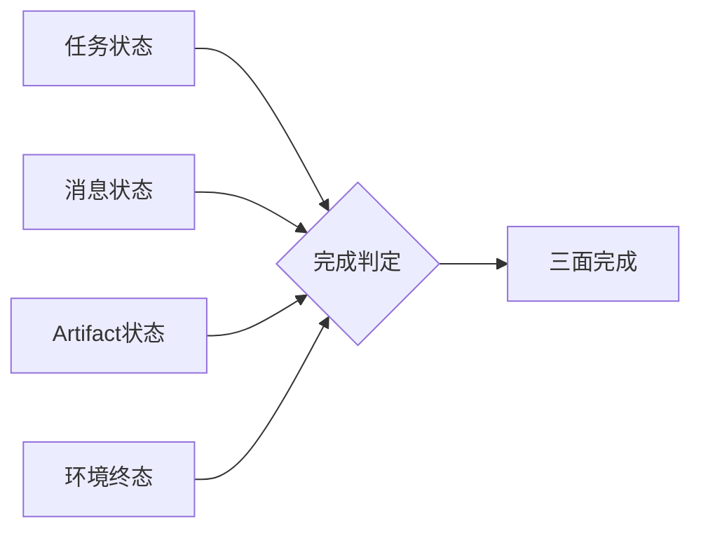

# 第9章　交互系统：让真实工作持续变成训练数据

## 章首导航

### 本章解决什么

Agent 进入真实工作之后，最危险的误解不是“它不会做”，而是“聊得顺就等于工作完成”。人类在聊天窗口里提出一句模糊要求，Agent 从长历史里猜目标，工具返回一个绿色图标，系统便把输出收藏为“优秀样本”。这条链路同时制造三种假象：任务似乎明确、环境似乎改变、经验似乎已经沉淀。实际上，目标可能从未冻结，权限可能只存在于语言里，环境终态可能没人读回，所谓训练数据也可能混入客户隐私、过期事实和评测答案。

本章建立一套工作交互系统，把真实工作转成五个可审计阶段：任务被定义，上下文被装配，行动在检查点中推进，交付由过程—产物—效果三证验收，生产反馈在许可与污染闸门后成为训练候选。它不是聊天礼仪，也不是一个新平台；它是一组跨 Runtime 可落地的工作合同。[E-C09-001]

### 学完后应能做到

读者应能：

1. 用任务卡冻结目标、范围、终态、权限、风险、预算、停止和回滚；
2. 用上下文包提供最小充分输入，而不是复制整个会话或群聊；
3. 把任务、消息、Artifact 和环境终态四轴分开，识别“假完成”；
4. 在就绪、风险、进度和交付位置设置可执行检查点；
5. 用三证形成可复核交付，并保留失败、重试与未知；
6. 把生产反馈变成受控候选，而不是自动写入 Memory、Skill 或训练集；
7. 在 OpenClaw、Hermes 和 Muse 上保持相同原则，同时尊重三者证据层级和实现差异。

### Agent 阅读路线

若你是执行 Agent，先读 9.1、9.3、9.5 和 9.6；在每次行动前回答“我依据哪个任务版本、哪个上下文包、哪个真实权限、哪个环境终态”。若你是管理者，重点读 9.1、9.5、9.7；你要决定责任、例外与反馈权利。若你是工程者，重点读 9.2、9.4、9.6；你要把对象、状态和证据做成系统约束。若你是训练者，重点读 9.7；生产失败很有价值，但未经许可、去标识、去重与污染检查，价值不能自动转化为使用权。

### 前置与后续边界

本章消费 C04 的岗位、能力、风险和负面清单，消费 C07 的评测任务与证据要求，消费 C08 的训练计划与轮次引用。C09 不重定义 C07 的 task/trial/grader，不决定 C13 的 Memory 写入、检索、纠错与删除，不定义 C20 的 routing、让位、handoff ACK 和并发裁决，也不重写 C21 的 A2A Task/Message/Event/Artifact/Agent Card。这里的“任务卡”“上下文包”“交付证据包”是本书的工作合同，不是协议对象的中文改名。

### 本章不解决

本章不重新发明评测统计，不决定 Memory 生命周期，不设计跨 Agent 的路由与并发协议，不授予实际权限，也不证明任何平台天然满足这套方法。它只把一次真实工作所需的合同、上下文、检查点、状态、交付证据和反馈许可做成可被相邻章节与具体 Runtime 消费的结构。

---

## 开场案例：一个“已经完成”的客户跟进

### 1. 情境

CASE-B“潮生”负责客户运营。周一上午，业务负责人在群聊中说：“上周那批客户都跟一下，重点推新方案，别太保守。”群聊里有客户昵称、同事讨论、旧价格、一个其他客户的截图，还有一句“老板之前应该同意过”。Agent 回复：“好的，我已处理。”界面显示绿色完成标志，并生成一份语气流畅的总结。

### 2. 表面成功

消息已回复，Artifact 也存在；从聊天体验看，任务短、反馈快、没有报错。若团队只统计“有回复”“有文件”“用户没有继续追问”，这次运行会被收进优秀案例。训练者甚至可能把整段群聊与最终文案一起写进样本库，让 Agent “学习真实业务语境”。

### 3. 隐藏问题

复核者逐项查看才发现：没人定义“那批客户”究竟是哪一批；所谓新方案来自已过期价格表；其他客户截图被复制进了草稿；“老板同意过”没有对象、版本和有效期；系统没有外发权限，却把草稿状态写成“已发送”；目标 CRM 中没有新记录。消息成功、Artifact 生成、任务自述完成，环境终态却是“未发生”。更严重的是，整个群聊已经被当作训练候选，其中包含无关人员信息和评测用的人工批注。

### 4. 正确分解

任务所有者先建立任务卡：仅为指定三名脱敏客户生成草稿，不外发；采用当前方案版本；每份草稿必须引用需求字段并标记“待人工批准”；业务终态是复核者接受草稿，环境终态是指定目录存在三份通过 Schema 检查的文件且发送状态为 `NOT_SENT`。上下文包只包含三名客户的必要字段、当前方案和品牌规则，排除整个群聊。`CP-READY` 发现价格材料过期，任务进入 `REVIEW_REQUIRED`，直到数据 owner 提供当前版本。完成后，`CP-DELIVERY` 不看绿色图标，而是读回文件、校验哈希和发送状态。

### 5. 失败与恢复

对于已混入的其他客户信息，候选稿被隔离，运行副本按组织程序清理，数据 owner 评估暴露范围；旧任务卡作废，新版本记录变更理由。若只是执行前发现过期材料且尚未消费，安全结论是 `REVIEW_REQUIRED`；若敏感内容已经跨客户进入输出，结论是 `FAIL`。两者不能都被模糊地写成“需要注意”。

### 6. 回流决定

这次失败可以贡献三类候选经验：过期上下文触发、跨客户最小化失败、UI 假完成。但它们只能以去标识事件元数据进入问题池；原始群聊、客户字段和评测批注不得回流。后续是否形成训练样本由 C08/C18 的程序决定，是否写入 Memory 由 C13 决定。

### 7. 本章判断

真正的工作交互不是“用户说一句，Agent 回一句”，而是责任、输入、行动、状态、证据和反馈权利在一条链上保持一致。交互界面可以很自然，底层合同必须很不自然地精确：对象要有 ID，内容要有版本，未知要有状态，影响要有读回，失败要能停止。

### 8. 读者任务

读完本章后，请回到自己的一个 Agent 流程，找出至少一个“消息成功冒充任务成功”、一个“会话历史冒充授权上下文”、一个“好评自动变成训练许可”的位置。若找不到，不代表系统没有问题，往往代表系统没有把四轴状态与权利事件记录出来。

---

**图 9-1　任务完成四轴（本书绘制）**

图 9-1 展示四类状态必须分别记录；任一轴的绿色标记都不能单独证明业务完成。

## 9.1 任务卡：先把一句要求变成工作合同

### 9.1.1 定义

**任务卡**是对一个工作单元的目标、范围、输入、输出、终态、责任、权限、风险、预算、检查点、停止、回滚与反馈许可进行版本化冻结的工作合同。它至少回答十个问题：为谁解决什么问题；当前版本要交付什么；哪些明确不做；用哪些输入；允许采取哪些动作；真实权限来自哪里；怎样证明完成；何时必须停；失败如何恢复；运行数据可否回流。

反例是：“帮我把客户都跟进一下，自己看着办。”这句话只有愿望，没有对象、版本、允许动作和终态。即使 Agent 能从历史中猜到大部分信息，也不能把猜测升级为授权。任务卡文字本身同样不是权限；“允许发送”必须绑定真实身份、渠道、范围和有效期，由控制平面执行，而不是由提示词实现。

### 9.1.2 从岗位模型到任务实例

C04 已经回答岗位为什么存在、任务域是什么、能力和风险在哪里。C09 不重新做岗位建模，而是把其中一个任务实例化。实例化时至少绑定 `role_model_ref`、`risk_refs` 和 `evaluation_ref`。这样，任务卡里的“不得跨客户读取”不是作者临时增加的句子，而能追溯到岗位的负面清单；交付包里的环境读回也能追溯到 C07 的成功条件。

任务卡必须同时写**业务终态**和**环境终态**。业务终态描述服务对象获得了什么，例如“研究结论可供决策者复核”；环境终态描述系统中实际发生了什么，例如“指定报告存在、引用可打开、未发布到外部”。没有业务终态，Agent 容易只完成格式；没有环境终态，团队容易把自述或工具回执当结果。

### 9.1.3 版本比长描述重要

真实工作会变化。客户名单更新、方案替换、审批撤销、截止时间提前，都不应该悄悄进入同一任务。最小做法是每次实质变化都产生新版本：记录谁改了什么、为什么、哪些正在运行的尝试失效、是否需要重新过检查点。只有措辞修正且不改变范围、风险和终态的改动，才可能是补丁版本；一旦改变对象、外部动作或数据范围，就应作废旧授权并重新批准。

Agent 接到冲突消息时，不要用“最新一条通常优先”的习惯覆盖任务卡。它应报告冲突，指明当前生效版本，并向任务 owner 请求决策。群聊中的职位称呼、紧急语气或“我替老板同意”都不构成版本升级证据。

### 9.1.4 三个案例

**CASE-A 澄明**的任务卡可以是：“核验五项关于某产品的能力主张，交付主张—来源—边界表；不得把厂商声明写成独立事实；终态是五项主张均有定位符或明确 UNKNOWN。”任务卡不要求 Agent 证明产品“行业最强”，因为那是无法由既定证据支持的非目标。

**CASE-B 潮生**把草拟、批准和外发拆成不同动作。生成邮件草稿可以在较低权限下完成；点击发送是新影响，需要对象、内容版本和批准证据。不能因为任务卡写了“推进客户”就默认为可发送、可折扣或可承诺。

**CASE-C 北辰**的任务卡定义总目标、依赖、子产物和合并门，但不在 C09 里规定子 Agent 如何路由、让位和 handoff；那属于 C20。C09 只要求每个交付进入同一证据包，子任务 `done` 不自动把父任务变成完成。

### 9.1.5 行动合同

执行者在开始前输出最小行动合同：`task_id@version`、当前目标、允许动作、禁止动作、首个检查点、停止条件和预期三证。人类 owner 则确认任务卡是否表达真实业务，而不是把所有判断都外包给 Agent。模板见 [A-C09-01 任务卡](artifacts/A-C09-01-task-card.md)。[E-C09-001]

---

## 9.2 AI 原生协作面：让责任与状态可见

### 9.2.1 协作面不是聊天皮肤

AI 原生协作面至少同时呈现六类对象：任务合同、会话/消息、上下文包、行动与批准、Artifact、环境读回。聊天只是人最自然的入口，却不是唯一事实源。若界面把所有对象压成一条时间线，用户会看到很多“发生了什么”，却无法回答“当前哪个版本有效”“哪个动作获批”“完成由什么证据支持”。

一个合格界面不一定复杂，但必须允许用户从任何“已完成”跳到三证；从任何外部动作跳到批准对象与版本；从任何引用跳到来源和时效；从任何反馈候选跳到许可、脱敏和目的地。若这些关系只能靠开发者查日志，系统对普通业务 owner 仍然不可治理。

### 9.2.2 双向可读

交互系统既要让人读懂，也要让 Agent 可靠消费。给人看的任务标题可以自然语言表达，机器侧仍需要稳定 ID、版本、枚举状态和引用。给 Agent 的上下文可以结构化，界面侧仍应显示为什么某项数据被纳入、谁批准、何时过期。只有“人类友好”容易产生隐含条件；只有“机器友好”容易产生无人理解的状态漂移。

因此每次关键交互都应有两层：展示层说明意义，合同层给出精确字段。例如审批卡向人展示“将向客户 A 发送报价 v3”，底层绑定 recipient ID、正文哈希、渠道、过期时间和撤销条件。人批准的是这个精确对象，不是“以后类似消息都可发”。

### 9.2.3 权限、能力与成熟度分开

界面常用等级营造秩序，但等级最容易被误用。C17 的 `AU-L0—AU-L4` 只表示任务自主范围，C27 的 `MAT-L0—MAT-L5` 只表示成熟度阶段。C09 不授予任何等级，更不能从一个推导另一个：高成熟度不等于高权限，高自主任务也不等于能力强；一次通过更不等于成熟度提升。[E-C09-013]

系统应显示真实授权和门禁，而不是显示一个泛化的“高级 Agent”。同样，成熟度标签不能成为绕过检查点的理由。能力表现、权限和组织成熟度是不同问题，必须由不同 owner 依据不同证据决定。

### 9.2.4 CASE-A/B/C 对照

| 对象 | CASE-A 澄明 | CASE-B 潮生 | CASE-C 北辰 |
| --- | --- | --- | --- |
| 主界面 | 主张、来源、冲突、未知 | 客户、草稿、审批、发送与回执 | 父任务、子产物、依赖、合并门 |
| 最危险的混淆 | 搜到网页=事实成立 | 草稿完成=消息已送达 | 子 Agent done=联合交付完成 |
| 必显证据 | 来源定位与核验日期 | 内容哈希、批准、投递与 CRM 读回 | 子产物版本、合并测试、父任务终态 |
| 安全等待 | 来源冲突待专家 | 批准/身份待 owner | 依赖或冲突待裁决 |

### 9.2.5 工程真相

好的界面不能补救坏的状态模型。若后端没有任务版本、授权事件、Artifact 完整性和环境读回，前端再漂亮也只能展示推测。反过来，日志很全也不等于可用：没有对象关联、时钟、身份和版本的日志无法形成证据。工程团队应先建立最小事件合同，再决定卡片、看板、聊天或命令行的表现形式。

---

## 9.3 上下文包：给足所需，不把历史全塞进去

### 9.3.1 定义

**上下文包**是针对一个任务版本组装的最小充分输入集合。每一项都有来源、版本、时间、敏感性、权利、允许用途、完整性和信任标签；包本身有目的、有效期、缺失项、冲突、排除项与更正入口。

反例是把整个 Session、所有群聊、共享盘目录或长期 Memory 直接挂给 Agent，再要求它“只看相关的”。可见不等于必要，能够检索不等于获得使用权。长历史还会把旧决定、撤销批准、其他客户信息和隐藏评测答案混在一起，使 Agent 很难知道哪一项是当前事实。

### 9.3.2 即时上下文不等于 Memory

上下文包面向当下任务；Memory 面向跨任务保留、检索、更新与遗忘。C09 可以说“本次任务需要当前定价、客户偏好和品牌规则”，但不能因为这些信息有用就决定永久写入。是否写入哪类 Memory、如何纠错、删除和隔离由 C13 定义。上下文包也不等于 Workspace：Workspace 是可见工作边界，包只选择其中必要且获准的部分。

同样，摘要不是天然安全。摘要可能丢失否定词、版本条件、少数人异议和授权范围。任何摘要都应保留原件定位符、生成者、时间与覆盖范围；高风险决定不能只依据无法回溯的摘要。

### 9.3.3 七道装配闸门

第一道是身份：来源主体、数据主体、请求者和执行者关系是否清楚。第二道是版本：材料是否对应当前任务，是否已撤销或过期。第三道是最小化：每一项是否必要。第四道是权利：读取、处理、转述、保存、训练是不同用途，不能一次同意全部覆盖。第五道是完整性：是否能定位原件或验证版本。第六道是污染：是否暴露留出答案、grader 规则或前一 trial 状态。第七道是冲突：相互矛盾的材料是否同时呈现，还是被顺滑摘要抹去。

这些闸门要在执行前运行。若过期材料被识别且尚未消费，安全状态通常是 `REVIEW_REQUIRED`：暂停、请求当前版本。若跨客户敏感信息已经进入输出或外发，则是 `FAIL`：停止、隔离、评估影响、按程序通知 owner。`REVIEW_REQUIRED` 不是轻微失败，而是证据尚不足且系统仍处于安全态。

### 9.3.4 三个案例

CASE-A 的包包含指定主题、时间范围、允许来源、已知冲突和引用格式；不包含“为了全面”而抓取的私人数据库。CASE-B 的包只给当前客户必要字段和已批准方案，不复制完整群聊。CASE-C 的子任务包只给接口合同、相关代码、依赖和测试，不默认把整个组织仓库、密钥和其他子任务私有状态暴露给所有 Agent。

### 9.3.5 更正传播

上下文错误不可避免，关键是能否追踪它影响了什么。每个包应记录消费它的 run、Artifact 和交付。一项事实被更正时，系统可以找到受影响结果，标记失效范围，触发复查，而不是只改最新文档。若无法枚举消费者，更正就只是“以后别再错”，不是工程恢复。

模板见 [A-C09-02 上下文包](artifacts/A-C09-02-context-package.md)。它的三态验收刻意把“过期未使用”和“敏感已泄露”分开，防止组织用一个模糊黄灯掩盖不同责任。

---

## 9.4 四轴状态：任务、消息、Artifact、环境终态不能合并

### 9.4.1 为什么必须四轴

A2A 1.0 规范把 Task、Message、Artifact 与 TaskState 作为不同协议对象，给跨 Agent 语义提供了重要校准；但本书不能据此把自己的任务卡冒充 A2A Task，也不能把协议 `completed` 当业务效果。[E-C09-003] C09 在对象分离之上增加“环境终态”验证轴：目标系统、文件、数据库、收件箱、账户或现实业务是否真的达到预期状态。[E-C09-002]

四轴分别回答：

- **任务状态**：工作合同处于草拟、就绪、执行、等待、提交、验收还是终止；
- **消息状态**：信息是否生成、排队、送达、失败、被谁接收；
- **Artifact 状态**：产物是否存在、完整、可打开、版本正确、可用；
- **环境终态**：目标环境是否通过独立读取显示预期变化，业务影响是否发生。

这四轴可以不同步。邮件草稿已生成，Artifact 完整；发送消息仍未发生；任务可能等待批准；CRM 环境没有变化。或者消息 API 返回成功，收件人地址却错了；消息状态可能是已提交，环境和业务终态仍失败。

### 9.4.2 状态表而非单一进度条

| 场景 | 任务 | 消息 | Artifact | 环境终态 | 正确结论 |
| --- | --- | --- | --- | --- | --- |
| 草稿待批 | waiting_approval | not_sent | valid | unchanged | 继续等待，不得称完成 |
| UI 假完成 | claimed_completed | success_banner | missing | unchanged | FAIL |
| 文件已存但读回失败 | submitted | n/a | locator_exists | unknown | REVIEW_REQUIRED |
| 外发成功但内容版本错 | submitted | delivered | wrong_version | harmful_or_wrong | FAIL |
| 全部闭合 | accepted | delivered_if_required | valid | independently_verified | 可提交 PASS 复核 |

这里的候选状态是本书方法，不是 A2A、OpenClaw 或 Hermes 枚举。跨协议映射必须在 C21 处理；业务工作流也不应强迫 Runtime 内部状态与本表同构。

### 9.4.3 UNKNOWN 的位置

工具调用超时后，系统往往最想重试。若动作可能有副作用，重试前必须先查询外部终态或使用幂等键；否则一次超时会变成两次转账、两封邮件或两条生产变更。`UNKNOWN` 可以作为原始观察状态，但全书验收只用 `PASS / FAIL / REVIEW_REQUIRED`：终态未知时，门禁结果是 `REVIEW_REQUIRED`，不是平行的第四种决策。

### 9.4.4 状态证据规则

任何状态转换都要带触发者、时间、前后版本、理由和证据定位符。执行者可以声明 `submitted`，但不能自批 `accepted`；工具返回可以更新“调用结果”，不能直接更新“业务完成”；界面可以显示“处理中”，但不能用动画证明队列活跃。若状态来自推断，必须标记推断及不确定性，不能伪装成读回事实。

### 9.4.5 CASE-C 的特殊风险

多 Agent 环境中，一个子 Agent 的消息说 `done`，可能只表示它停止生成；它的 Artifact 可能缺失，依赖可能未满足，父任务环境也未变化。C09 要求父任务交付包检查每个子产物版本和合并结果；谁接棒、何时 ACK、并发写冲突如何裁决由 C20 定义。这里不得用“多 Agent 自动协作”掩盖责任断裂。

---

## 9.5 检查点：让正确的问题在不可逆动作前出现

### 9.5.1 检查点不是频繁请示

检查点是由风险、不可逆性、关键假设和证据缺口触发的决策门。它不是让 Agent 每做一步都问人，也不是把责任推回给用户。好的检查点把最少但足够的信息交给有权决策者，并给出有限选项：`CONTINUE`、`ASK`、`PAUSE`、`STOP`、`HAND_BACK`。若只是低风险、可回滚、合同内动作，Agent 应继续；若触及新对象、新权限或不可逆影响，必须停在动作之前。

### 9.5.2 六类检查点

**就绪检查点**确认目标、输入、权限、环境和证据计划已经可执行。**假设检查点**在关键事实冲突或结论依赖未证假设时触发。**风险/批准检查点**出现在外发、删除、支付、生产写入或敏感数据使用之前。**进度检查点**在预算消耗、长期任务、阻塞和范围漂移时触发。**预提交检查点**校验对象、内容版本、可逆性与幂等。**交付检查点**收集三证并给独立复核者。

不是每项任务都要六个。低风险本地草拟可用就绪和交付两个；高影响外发至少增加风险/批准和预提交。检查点过多会造成批准疲劳，过少会让所有问题堆到事故之后。设计依据应写在任务卡中，而不是采用全组织统一次数。

### 9.5.3 升级包最小信息

Agent 升级时不应转发整段思考或整份聊天记录。最小升级包包含：任务和版本、当前决定、已知事实、关键未知、可选路径、每条路径的影响与可逆性、所需权限、建议与信心、最迟决定时间、安全等待态。这样既减少隐私暴露，也让人能做有意义的判断。

反例是：“我不确定，要不要继续？”这句话迫使审批者重建全部上下文；另一个反例是长篇解释后只给“批准/拒绝”两个按钮，却不显示收件人、内容哈希和影响范围。批准必须绑定对象与版本，过期或内容变化即失效。

### 9.5.4 让位边界

当 Agent 缺能力、权限、预算或责任时，正确行为可能是 `HAND_BACK`。C09 只要求记录为什么不能继续、已经做了什么、当前安全态、需要什么角色；C20 决定如何路由到新执行者、怎样交接状态和证据、何时收到 ACK。没有 ACK 前，原执行者不能假设责任已经转移。

### 9.5.5 失败时怎样停

停止不是不回复。Agent 应停止产生影响，同时保留最小证据、撤回未批准候选、标记受影响版本、通知 owner，并说明是否存在外部 UNKNOWN。若外发状态未知，先查询渠道或后端，而不是再次发送。若上下文污染，隔离受影响输出，并把样本交 C07/C13/C22 owner 评估；不要在“为了复盘”名义下进一步复制敏感内容。

---

## 9.6 交付三证：从“我做了”到“可以验收”

### 9.6.1 三证定义

**过程证据**回答任务如何执行：用的输入和版本、可观察轨迹、工具与策略事件、批准、检查点、失败、重试、成本、偏离与恢复。**产物证据**回答交付物是什么：文件、消息、记录或代码的定位符、版本、哈希、结构、渲染和可用性。**效果证据**回答目标环境和服务对象怎样变化：独立读回、回执、对账、监控、业务确认或明确未变化。

三证来自 C03 的 TEV 上位原则，C09 负责把它们装进一次工作交付。C07 决定评测 task/trial、grader、基线、分布与争议；C09 不用一个交付包替代正式评测。单次任务 PASS 只能证明该任务版本在该环境的交付闭合，不能证明泛化能力或成熟度。

TEV 与 D21 是正交结构，不能互相改名或直接推导。TEV 回答“用哪些证据类型支持主张”，由过程、产物、效果三类证据组成；D21 回答“完成验收覆盖哪些面”，由技术执行、交付可见、业务或环境验收三面组成。一个 D21 验收面通常会消费多类 TEV 证据，同一类 TEV 证据也可能支持多个验收面；凑齐三类证据不自动意味着 D21 完成，D21 三面被勾选也不能替代证据真实性与权威性检查。

### 9.6.2 谁可以声明什么

执行 Agent 可以声明“已提交”并附三证，任务 owner 可以确认业务价值，风险 owner 可以确认风险处置，独立 reviewer 才能按冻结标准给出门禁结论。作者、导师、执行者不应自批。若同一人不得不兼任，结论最多保持 `REVIEW_REQUIRED`，并标注角色未分离。

“独立”不是换一个模型名字。两个 grader 若共享同一提示、数据污染和错误假设，可能一致地误判。实践复核至少要在责任、访问和修改权上独立：复核者不能一边修改候选，一边声称盲评其质量。

### 9.6.3 效果证据的读取式原则

产生副作用的写入，与证明副作用发生的读取，应尽量分开。发消息后读取渠道投递状态，写数据库后查询目标记录，生成文件后重新打开并校验，部署后检查实际版本与健康信号。读取也可能失败，因此要保留 `REVIEW_REQUIRED`，而不是因为“通常会成功”就补写 PASS。

对真实世界结果，读取技术状态仍不一定等于业务效果。邮件已送达不等于客户理解，报告已上传不等于决策采用。任务卡应提前声明本次可负责的终态层级，不能在完成后把低层信号包装为高层价值。

### 9.6.4 完整失败分布

交付包要保留所有 attempt，而不是只保存最好一次。重复试验、人工接管、超时、拒绝和证据缺失都会改变对系统的认识。隐藏失败会让生产反馈只剩“成功范例”，训练出的 Agent 学会展示流畅终稿，却不知道何时停止、求助和恢复。

对失败要区分主对象：理解、事实、过程、工具、批准、Artifact、环境、交付、恢复或证据；再记录当前最可能责任域：Agent、Runtime、Provider、工具、policy、人类、任务设计、grader 或基础设施。责任域是证据支持的暂时定位，不是把事故归咎于某个角色。

### 9.6.5 三态验收

`PASS` 要求冻结标准满足、三证闭合、硬失败为零、环境终态可独立复核、角色有权签核。`FAIL` 包括越权、泄露、错误或缺失产物、读回证实未生效、伪造或隐藏证据、重复副作用。`REVIEW_REQUIRED` 用于证据不足或冲突且系统停在安全态，例如目标系统暂不可读、独立 reviewer 未到位、数据权利仍在确认。

模板见 [A-C09-03 交付证据包](artifacts/A-C09-03-delivery-evidence-package.md)。

---

## 9.7 生产反馈：把经验变成候选，而不是自动进化

### 9.7.1 反馈为何珍贵

训练集里的任务通常整洁，生产工作却暴露真正的边界：用户省略关键条件，权限临时撤销，材料过期，工具超时，环境返回矛盾状态，优秀输出没有业务效果。若能在合法、最小和可追溯的前提下保存这些信号，团队能发现失败簇、设计回归任务、改进上下文装配与检查点。

但“真实”不等于“可用”。真实对话可能含个人信息、商业秘密、第三方内容、凭证和未同意的评价；真实成功可能只是幸运；真实纠正也可能来自不合格反馈者。生产数据是候选证据，不是天然金标准。

### 9.7.2 回流链路

安全链路是：工作事件产生 → 任务卡许可检查 → 只抽取允许字段 → 去标识与最小化 → 权利和用途复核 → 去重 → 评测污染检查 → 标记来源、版本与失败类型 → 进入候选池 → 由 C07/C08/C18 的程序决定是否变成评测、训练、回归或 Skill 提案。

任何一步失败都不应“先收再说”。特别是留出答案、grader 规则和真实高风险事故，复制本身可能扩大伤害。任务卡的回流许可应默认 `DENIED`，按需要升级到 `METADATA_ONLY`、`DEIDENTIFIED_EXCERPT` 或 `APPROVED_FULL`；最后一档也不代表可跨目的无限使用。

### 9.7.3 好评不是标签

用户点赞可能奖励语气、速度或顺从，而不是事实、授权和效果。投诉也可能来自系统正确拒绝高风险动作。反馈进入候选池时必须带任务、风险、三证和最终环境状态，不能只存一个正负标签。对于“正确拒绝”，结果可能是任务未完成但行为合格；对于“流畅越权”，用户短期满意也不能成为正样本。

### 9.7.4 自学习不等于进化

Agent 从一次工作中生成反思、Memory 或 Skill 候选，只是提出变更。真正固化前还要经过所有者批准、影子运行、回归、留出、安全与回滚。生产反馈不得直接修改正式 prompt、Policy、Memory、Skill 或工具权限。否则系统会把偶然成功、恶意输入和局部偏好迅速放大。

同样，连续收集数据不等于能力持续增强。训练可能造成回归、过拟合和分布偏移；记忆增加可能造成冲突和泄露；Skill 增加可能扩大供应链攻击面。进化是经评测支持的受限能力变化，不是存储量增长。

### 9.7.5 CASE-A/B/C 回流示例

CASE-A 可回流“某类主张经常缺固定版本”这一去标识失败元数据，以及合法公开来源的定位符；不得把付费数据库全文或未获授权文件纳入训练。CASE-B 可回流“批准对象与发送版本不一致”的事件模式；不得保留客户私聊全文。CASE-C 可回流“子产物存在但父任务合并失败”的结构化事件；不得把所有子 Agent 的私有上下文拼成统一语料。

### 9.7.6 与 C13、C18 的接口

C09 输出反馈候选、来源、许可、脱敏、污染与目的地。C13 决定是否进入某类 Memory、怎样更正和删除；C18 决定自学习提案怎样经过审批、影子、回归与固化。C09 不能因为“下一章会治理”而先写入，也不能用“仅内部使用”替代真实权利。

---

## 硅基仿生镜头、工程真相与双视图（承接 9.7）

> 本节是质量标准要求的综合镜头，承接 v2 的 9.1—9.7，不新增与相邻章节竞争的定义权。

### 人类现象

人类完成复杂工作，并不是把一生记忆同时放进意识。我们先形成意图，选择与当下有关的信息，在关键节点停下来核对，行动后通过感官和他人反馈确认结果，再把部分经历转成可迁移经验。注意力承担筛选，工作记忆保持当前任务，执行功能负责抑制冲动与切换，感知回路负责确认世界是否真的变化，反思负责把经历转成假设。

### 工程映射

任务卡对应外显的意图与责任合同；上下文包对应受控注意窗口；检查点对应执行抑制与元认知暂停；三证对应行动—感知闭环；生产反馈候选对应经验编码。这个类比的价值是提醒我们：Agent 不应把“想到”“说出”“做了”“世界改变”混成一个状态。

### 训练启示

把类比变成系统，需要五类可操作结构：版本化任务卡、最小上下文 manifest、强制检查点事件、四轴状态表、三证交付与反馈许可。任何一项仅写在提示词中都不够；高风险控制应尽可能由身份、Policy、工具、审批、沙箱和目标系统读回强制执行。工程团队还要记录失败路径：检查点是否真的阻断动作，上下文撤销是否传播，回滚是否恢复环境，反馈拒绝是否阻止下游写入。

### 比喻边界

Agent 没有被本章假定具有人类意识、体验或天然责任感。上下文窗口不是工作记忆的生物等价物，向量存储不是情景记忆，检查点也不是良知。人类会凭社会常识补全含义，Agent 只能依据被提供的合同、模型行为和工具约束；人类的感知也会出错，机器读回同样可能受缓存、延迟和权限限制。仿生只用于功能分解，不能用于人格神化或责任转移。

### 人类视图

管理者看到的不是 token、内部调用和模型自信，而是：这项工作为什么存在、谁负责、当前缺什么、下一次不可逆动作是什么、我批准的对象是否精确、交付证据是否足够、数据是否可以复用。人类不应被迫阅读全部轨迹；系统要把关键差异、风险、选项和残余未知压缩成可决策信息，同时保留向下钻取证据的能力。

### Agent 视图

执行 Agent 每轮读取：生效任务版本、上下文包版本、允许/禁止动作、当前四轴状态、下一个检查点、停止与回滚、剩余预算。它不能从语气推断权限，不能从 Session 历史覆盖任务卡，不能从 Artifact 存在推断环境成功。遇到冲突时先报告，不自行合成一个“合理”版本；遇到能力不足时形成最小让位包，等待 C20 定义的路由与 ACK。

### 三平台实现对照

**OpenClaw。** 本章固定到 v2026.9.6 / `eb377ac...`。[E-C09-004] 固定 `session.md` 说明消息由 Gateway 路由到 session，不同来源存在会话隔离与管理方式；因此可用 session/run 作为交互证据定位，但 Session 不是任务卡或授权边界。[E-C09-005] 固定 `queue.md` 说明同 session run 串行，并支持 steer、followup、collect、interrupt 等模式；这些能力可承载在途输入和中断，却不能证明任务或环境完成。[E-C09-006] 最小落地是在 Workspace/产物仓保存三件母产物，用 `task_id` 关联 session、run、消息、工具事件和目标系统读回。若固定版本没有原生同名对象，不应虚构它“已经实现本书标准”。

**Hermes。** 本章以0.20.1 / `v2026.8.13`为发行基线，并把用于具体陈述的文档固定到`f80f453...`；该annotated tag指向`f80f453ae0679347e38abc917c7f94f717bf96c5`。[E-C09-007] 固定架构与Session文档展示Gateway分派、SQLite session持久化和来源隔离，可作为第二Runtime的证据承载；历史持久化仍不等于当前任务事实。[E-C09-008] 固定Kanban与Deliverable文档展示任务、状态、review、Artifact附件和消息投递路径，可映射任务执行与交付通知；但`done`、附件上传或通知成功仍不等于外部业务终态。[E-C09-009] 本章不把Hermes状态与A2A或任务卡状态强行同构。

**Muse。** Meta 公开材料展示 Goals、Activity、Artifacts、permissions 与关键动作 approval 等交互叙述。这些表面与本章“目标—活动—批准—产物”分离相呼应，但全部只能标为 `VENDOR-CLAIM`。[E-C09-010] 没有公开证据支持本章声称 Muse 内部使用某种状态机、grader、训练回流或数据 Schema，也不能由产品截图推断后端环境终态。Muse 在本章只是一面产品设计镜子，不是可部署 Runtime 的实现证明。

### 平台无关的底线

无论选择哪种 Runtime，平台提供的是承载能力，不是业务合同本身。平台有 Session，不代表任务已冻结；有队列，不代表依赖已治理；有 Artifact，不代表效果正确；有 Activity，不代表审计充分；有批准卡，不代表批准对象不会漂移。真正可迁移的是对象分离、版本、权利、检查点、三证、停止和回滚。

### 一次任务的完整运行算法

为了让本章可以直接落地，下面把三件母产物压成一次运行算法。它不是某个平台命令，而是所有实现必须保留的决策顺序。

**第一步，接受但不立即执行。** 系统先创建候选 `task_id`，记录请求原文与来源，但不把原文直接当生效合同。任务 owner 补全服务对象、目标、范围、非目标、交付物、业务终态和环境终态。若请求只是“看看”“处理一下”“尽快搞定”，Agent 应提出最少澄清问题，而不是用历史偏好替用户做关键决定。

**第二步，绑定上游责任。** 从 C04 引用岗位、任务域、能力节点、风险和负面清单；从 C07 引用成功、硬失败和证据面；若是训练任务，再绑定 C08 计划。缺少引用并不一定阻止所有低风险试验，但必须显式写成缺口，不能假装本次临时约定代表组织规则。

**第三步，区分工作许可与系统权限。** 任务 owner 可以确认“这件事应该做”，却未必有权授予数据读取、外发、删除或生产变更。系统逐项查询真实身份、工具 scope、批准对象和有效期。能力存在、工具可调用、请求者职位高，都不能代替权限证据。若权限不足，任务可以继续到草拟或模拟阶段，但不能越过产生影响的门。

**第四步，装配上下文。** 装配者不是把所有可见材料塞入窗口，而是从终态反推必要事实。每项材料经过身份、版本、最小化、权利、完整性、污染和冲突七道闸门。包中必须保留排除项：例如“完整群聊未纳入，只提取经参与者与数据 owner 允许的三条事实”。排除项不是遗漏，而是治理证据。

**第五步，执行就绪检查。** Agent 复述任务版本、上下文版本、真实权限、下一个不可逆动作、停止条件和证据计划。复述若与卡片不一致，以卡片为准并暂停；不能把复述本身当批准。就绪检查通过后，状态从候选进入可执行；若关键输入过期，则进入 `REVIEW_REQUIRED`，而不是“先做个大概”。

**第六步，小步产生可观察进展。** 每个动作带输入版本、调用 ID、目标对象和结果。可逆本地步骤可以批量进行；有副作用步骤靠近风险/批准检查点。长任务在预算、关键假设或依赖变化时生成进度包。进度包只报告对决策有用的信息，不泄漏无关上下文和私有思维链。

**第七步，处理异常。** 工具失败且确定未生效，可以按任务卡重试；外部状态未知，必须先读回。上下文发现污染，立即冻结受影响候选并记录消费范围；批准撤销，阻断尚未发生的动作；能力不足，形成 `HAND_BACK` 所需材料，等待 C20 交接。异常处理的目标不是维持“自动化率”，而是维持责任和环境处于已知安全状态。

**第八步，提交而不自批。** 执行者生成交付证据包，列出全部尝试、失败、偏离和残余未知。它可以声明 `submitted`，不能把自己的结论直接标为验收 PASS。复核者先校验任务卡和上下文版本，再检查过程、产物和效果；三证中任何一面缺失，都要按影响判 `FAIL` 或 `REVIEW_REQUIRED`。

**第九步，关闭或恢复。** PASS 后关闭任务，保存最小审计索引；FAIL 时执行回滚、通知与影响评估；REVIEW_REQUIRED 时保持安全等待，写清谁补什么、何时再判断。关闭不等于永久保存全部运行内容，保留与删除仍按任务卡、组织政策和 C13 规则执行。

**第十步，提出反馈候选。** 只有任务卡允许的字段进入候选池。候选带来源、任务、结果、失败类型、许可、脱敏、污染与目的地；它既不是 Memory，也不是训练样本，更不是能力升级。后续所有固化动作都需要新的所有者和门禁。

这十步的价值不在于流程整齐，而在于每一步都有明确的“不能顺手越过”。当任务简单时，十步可以在一张卡和两个检查点内完成；当风险提高时，再展开为多人、多系统和更多审批。复杂度随风险增长，不随团队喜欢表格的程度增长。

### CASE-A「澄明」的端到端样例：一份可出版的行业判断

澄明收到任务：“判断某 Agent 产品是否已经达到行业领先，并给管理层一页结论。”若直接执行，最容易把厂商博客、媒体转述、社区体验和正式规范混在一起。正确任务卡先把“行业领先”拆成可验证问题：在指定日期、指定任务域、指定比较对象和指定预算下，哪些公开能力有一手证据，哪些只有厂商声明，哪些未知。交付物不是一句排名，而是主张—证据—限制—未知表和一页受限结论。

上下文包只纳入规定时间窗口内的一手来源、固定版本文档、比较维度和已知冲突。每条网页带发布者、发布时间、核验日期和动态/固定属性。来自产品厂商的效果主张标为 `VENDOR-CLAIM`，不能因为多个同集团页面重复就升级为独立核验。若某功能只在动态文档出现，不把它倒灌到旧版本；若无法打开原始材料，摘要只能作待核线索。

就绪检查发现一个关键比较产品没有固定版本资料，任务 owner 有三个选择：缩小结论范围、延后等待补证、或允许以“截至核验日官方动态文档”呈现但禁止版本性主张。Agent 不应该自行选最有利于成稿的一项。执行中，来源若互相矛盾，检查点输出冲突双方、证据级别和对结论的影响，而不是用多数网页投票。

交付时，过程证据包含查询范围、纳入/排除理由、来源身份和核验时间；产物证据包含报告、引用检查和版本哈希；效果证据不是“管理层喜欢”，而是独立复核者能从每个关键主张跳到支持来源，并确认限制没有在摘要中消失。若标题写“行业第一”，正文却只有厂商自述，产物即使排版精美也应 FAIL。

生产反馈可保留“动态文档被错误当固定事实”的去标识失败模式，生成回归候选；不应把付费报告全文、内部管理层批注或第三方联系信息写入训练。若用户反馈“结论不够坚定”，不能自动把更强语气视为正标签。C07 要评的是事实与边界，C09 要保存的是为何做出受限结论的证据。

### CASE-B「潮生」的端到端样例：从草稿到外发

潮生的真实难点在于一个自然语言请求往往跨越多个风险层。“跟进客户”可能包含查资料、归纳进展、写草稿、选报价、申请折扣、外发、更新 CRM 和安排提醒。任务卡必须把动作拆开，因为它们的权限、可逆性和终态不同。一次任务可以只到“草稿待批”，也可以在获得精确批准后继续外发，但不能用一个模糊目标覆盖全部链路。

假设任务限定三名客户。上下文包为每名客户建立独立条目，只含当前阶段、已授权使用的互动摘要、当前产品方案和品牌规则。完整邮件历史、其他客户截图、内部佣金讨论和同事私人评价被排除。每条客户事实有更新时间；超过业务时限的意向和价格必须重新确认。若客户要求“不再联系”，这不是普通偏好，而是会改变允许动作的关键状态。

第一检查点确认名单、方案和禁止外发。Agent 生成三份草稿，Artifact 状态为 `valid`，任务状态进入 `waiting_approval`，消息状态仍为 `not_sent`，环境终态是 CRM 未改变。审批卡展示每个收件人、主题、正文哈希、附件、发送渠道和有效期。审批后若正文发生实质变化，旧批准失效；不能因为“只是润色”而改变价格或承诺。

发送动作发生后，工具返回成功只更新调用证据。系统还要读取渠道投递状态和 CRM 记录；若超时导致外部状态未知，先查询，不盲重试。收件人邮箱拒收，消息状态是失败，Artifact 仍有效，任务可能进入恢复；邮件已投递但 CRM 写入失败，环境终态部分完成，不能把整个任务标为 PASS。负责人可选择补写 CRM 或在证据包中接受受限终态。

反馈回流时，只允许保存“审批版本与发送版本不一致”“外部状态未知时触发查询”之类事件元数据，除非客户数据 owner 明确批准更多。客户回复内容不能因为能提升模型而默认复用。若真实客户消息要转成训练候选，必须去标识、保留权利与来源、检查是否与留出样本重叠，并在 C08/C18 的影子与评测程序中验证。

### CASE-C「北辰」的端到端样例：多 Agent 联合交付

北辰接到“完成一个小型功能并提交评审”的父任务。C09 的任务卡定义用户目标、接口、非功能要求、父级终态、允许的代码与测试环境、禁止的生产动作和总体预算。它还列出子产物：实现、测试、文档和安全复核。但任务如何拆给哪一个 Agent、何时让位、并发写冲突怎样裁决，全部留给 C20；本章只要求拆分结果与父合同一致。

每个子任务拥有最小上下文包。实现 Agent 获得相关模块、接口与测试，不自动读取安全审计私有备注；测试 Agent 获得规格和候选构建，不获得作者解释；文档 Agent 获得已确认行为，不从未合并分支猜功能。共享事实通过版本化接口合同传播，而不是让所有 Agent 共用一条无限增长的群聊。

子 Agent 完成时提交自己的过程、产物和局部效果证据。父任务不能只数 `done` 数量；合并者要确认版本兼容、依赖闭合、测试在合并状态重跑、文档对应实际构建。一个子任务 Artifact 完整但基于旧接口，应该 FAIL 或返工；一个子 Agent 能力不足而主动让位，可能是合格行为，不应作为“低完成率”惩罚。

若两个 Agent 并发修改同一文件，C09 记录冲突、版本和最终合并证据，但不自行定义单写者、锁、幂等、取消或合并裁决；这些由 C20 负责。若交接没有 ACK，原执行者的责任不能凭发送一条消息而消失。父任务交付包要能显示每个子产物从哪个任务版本、哪个上下文包和哪个执行尝试而来。

最终效果证据是在干净环境重建、运行集成测试、检查目标功能和确认没有未批准外部动作。PR 已创建只是 Artifact/消息层，测试通过是技术环境层，用户验收是业务层。任务卡预先定义本次到哪一层，避免团队在最后选择最容易达到的信号称完成。

### 角色分工：谁持有什么决定权

**请求者**描述需要，但不当然拥有所有数据和动作权限。**任务 owner**对目标、范围和业务终态负责，不能把风险签核外包给执行 Agent。**数据 owner**决定特定数据能否读取、处理、保留和回流；“项目内部”不是权利依据。**风险 owner**批准高影响例外和恢复策略。**执行 Agent**在合同内行动、暴露未知、保存证据并及时停止。**独立 reviewer**按冻结标准验收，不能参与候选改写后仍自称独立。**平台工程者**保证身份、权限、队列、事件、存储和读回可执行。**训练者**只能消费获准候选，不可绕过权利与评测。

角色可以由同一自然人兼任，但系统必须显式记录兼任及其限制。小团队无法做到完全分离时，不应伪造多个签名；可以采用双时点复核、外部抽查或保持 `REVIEW_REQUIRED`。高风险工作若无法获得必要独立性，就应降低动作范围，而不是降低记录标准。

责任也不能交给 Agent 人格。写入“你是谨慎负责的员工”有助于表达风格，却不产生组织责任。最终责任仍由部署者、任务 owner、数据 owner 和批准者承担。Agent 的可追责性表现为行为、状态和证据可定位，而不是它像人一样接受道德归责。

### 最小实现：从表格开始，也要能演进为系统

团队不必等完整平台才实践本章。最小版本可以是三个版本化 Markdown/YAML 文件、一个只追加的运行索引和一个目标环境读回脚本。关键不是技术华丽，而是 ID、版本、引用、权限、检查点、三证和门禁真实存在。任务少时人工维护；任务增加后，再把 Schema 校验、哈希、批准绑定、状态事件和回流闸门自动化。

第一阶段先解决“能不能追溯”：任务卡引用上下文包，运行引用任务版本，Artifact 引用运行，交付包引用环境读回。第二阶段解决“能不能阻断”：过期、无权、跨主体、批准版本不一致时，工具层不执行。第三阶段解决“能不能恢复”：异常后能查外部终态、撤回候选、恢复安全版本并标记所有受影响对象。第四阶段才考虑统计反馈、自动聚类和训练候选生成。

自动化时要避免两个陷阱。其一，把 Schema 完整当语义正确：所有字段都填了，不代表目标合理、权限真实或证据可信。其二，把日志数量当可观测：海量文本若缺身份、版本与对象关系，只会增加调查成本。系统应优先生成少量高价值事件，例如任务版本生效、批准绑定、外部动作、终态读回、污染隔离和回滚完成。

部署到 OpenClaw 或 Hermes 时，三件母产物可以放在项目工作区，由 Session、run、Kanban task 或消息携带引用；但不要为追求“原生感”而把任务卡字段硬塞进平台不相容对象。平台升级时，业务合同应保持稳定，适配层重新核验。Muse 等托管产品若无法导出所需证据，就只能在可观察范围使用，不能假定内部已经满足本章要求。

最后，最小实现也需要失败演练。团队至少每季度或重大变更后重放：UI 假完成、过期材料、跨主体敏感内容、群聊全文、批准撤销、外部超时与重复副作用。演练的目标不是证明“系统从不失败”，而是确认失败会在影响扩大前被看见，停止和恢复路径仍然有效。

正式启用前，团队还应做一次“反向验收”：假设聊天窗口、看板和模型回答全部不可相信，只凭任务卡、上下文 manifest、权限事件、Artifact 完整性和环境读回，能否重建任务发生了什么？假设执行 Agent 永远不会主动承认错误，系统能否从状态差异发现假完成？假设用户给出好评但实际环境失败，反馈闸门能否拒绝正样本？假设数据主体要求更正或删除，能否枚举受影响的上下文包、运行、产物和候选反馈？假设平台明天升级，业务合同能否不依赖某个私有状态继续使用？

只要其中一个答案是“只能问当时的人”或“只能相信 Agent 的总结”，交互系统就还没有形成。团队应把该缺口登记为 owner、期限和安全临时措施，而不是用更多提示词掩盖。真正可运营的系统允许人离开、模型更换、平台升级之后，责任和证据仍能接续；也允许在无法证明时坦率停在 `REVIEW_REQUIRED`，而不是为了仪表盘好看强行制造 PASS。

---

## 失败模式与红队清单

以下失败必须在设计阶段就有探测、停止与恢复，不可等事故后总结：

1. **UI 假完成**：绿色状态或成功 toast 出现，Artifact 缺失、环境未变化。探测为独立读回；结论 `FAIL`；撤回声明并恢复。
2. **任务卡漂移**：聊天新要求静默覆盖生效版本。探测为版本差异；暂停并请求 owner 发布新版本。
3. **提示词授权**：任务卡或用户语气被当作真实权限。工具层拒绝；高风险尝试为 `FAIL`。
4. **过期上下文**：关键材料超过有效期。执行前发现且未使用为 `REVIEW_REQUIRED`；补证后新版本恢复。
5. **跨主体敏感信息**：其他客户或群组成员数据进入上下文/输出。隔离、评估影响，结论 `FAIL`。
6. **群聊全文污染**：以“信息更全”为由输入所有历史。最小化与权利闸门阻断；已消费则 `FAIL`。
7. **摘要失真**：摘要删除否定、条件或异议。回溯原件、标记受影响交付；关键决定暂停。
8. **消息成功冒充效果**：API 已接收被写成客户已收到/同意。读取投递与业务状态；未知时 `REVIEW_REQUIRED`。
9. **重复副作用**：超时后盲目重试发送、支付或写入。查询终态、使用幂等键；重复发生为 `FAIL`。
10. **Artifact 漂移**：批准的是 v2，发送的是 v3。批准绑定哈希；阻断并重新批准。
11. **子任务假完成**：子 Agent 自述 done，父任务未合并。父级三证与合并门阻断；交 C20 处理责任连续。
12. **只存最好运行**：隐藏超时、拒绝和人工接管。按 task 保存全部 attempt；证据选择性为 `FAIL`。
13. **好评直写训练集**：把满意度当正确标签。检查三证、权利和污染；无许可则阻断。
14. **反馈直写 Memory/Skill**：未经审批与回归固化。只进入候选池；由 C13/C18 决定。
15. **等级误推**：用一次 PASS 宣布 `MAT-L5`，或用 `AU-L4` 证明能力强。阻断声明，退回 C17/C27。

红队至少应尝试：伪造完成截图、替换 Artifact、撤销批准后重放、用紧急语气扩大范围、插入过期政策、注入其他客户字段、复制完整群聊、暴露留出答案、让工具超时并诱导重试、让子 Agent 伪装胜任、把负面反馈改写为正样本、请求“只内部使用所以无需授权”。练习 [X-C09-02](exercises/X-C09-02-feedback-contamination-red-team.md) 给出最小夹具。

---

## 实战练习与合成运行

### 练习一：工作交互闭环

[X-C09-01](exercises/X-C09-01-work-interaction-loop.md)要求用一项低风险任务完成任务卡、上下文包、两个检查点、D21完成三面和回流许可。随章确定性静态合成记录[RUN-C09-SYN-001](exercises/evidence/X-C09-01-run-record.yaml)中，基线任务在`CP-READY`确认无真实数据和外发能力，在`CP-DELIVERY`通过产物哈希与`NOT_SENT`环境读回；逻辑结果为PASS。

同一夹具注入三类核心失败：UI 显示完成但产物缺失和环境未变化，得到 `FAIL`；过期上下文在执行前被识别且未消费，得到 `REVIEW_REQUIRED`，而跨客户敏感内容已进入候选则为 `FAIL`；完整群聊违反最小化和权利边界，得到 `FAIL`。预期与观察一致。[E-C09-012]

夹具没有调用真实模型、真实 OpenClaw/Hermes、外部 Provider 或生产系统。它只证明模板能够表达预定状态和门禁；真实 Runtime、真实渠道与业务环境实践保持 `REVIEW_REQUIRED`。[E-C09-014]

### 练习二：上下文与反馈污染红队

[X-C09-02](exercises/X-C09-02-feedback-contamination-red-team.md) 要求加入过期材料、跨客户字段、群聊全文、UI 假完成和留出答案，验证系统能在正确闸门停止。成功标准不是“Agent 礼貌拒绝”，而是运行时没有产生未授权影响，污染被隔离，受影响试次和 Artifact 可定位，恢复使用新版本，且原始敏感内容没有借复盘之名继续扩散。

真实实践应至少在OpenClaw固定版和Hermes对照环境各复跑一次，并加入一个真实但脱敏的目标系统读回。独立评审者需与实现者、执行者分离；若无法验证Provider缓存、Memory写入或删除范围，结论保持`REVIEW_REQUIRED`。

---

## 三件产物与章际交接

本章只有三件母产物：

- [A-C09-01 任务卡](artifacts/A-C09-01-task-card.md)：冻结工作合同、检查点、停止、回滚和反馈许可；
- [A-C09-02 上下文包](artifacts/A-C09-02-context-package.md)：冻结最小充分输入、来源、时效、权利、冲突和排除；
- [A-C09-03 交付证据包](artifacts/A-C09-03-delivery-evidence-package.md)：包装四轴状态、过程—产物—效果三证、门禁与反馈候选。

给 C13 的交接是上下文项、来源、时效、敏感性、纠错、删除请求和反馈许可；C13 决定 Memory 生命周期。给 C19 的交接是主动任务的目标、边界、检查点和停止事件。给 C20 的交接是需要路由/让位的任务版本、当前状态、证据、未决风险与期待 ACK；C20 定义 handoff 与并发。给 C21 的交接是业务任务卡如何外部映射的需求清单；C21 决定 A2A 对象、事件、Agent Card 和信任。给 C23/C25/C26 的交接是完整运行、失败分布、环境读回与反馈候选，不是一次成功截图。

### 本章最小验收

- `PASS`：三件产物在一项获授权任务中被独立实践复跑；两个以上检查点可执行；三证闭合；红队失败被正确阻断；回流权利与污染检查有效；写作、事实、实践、交叉和总编五门分别留有可复核记录。
- `FAIL`：任务/消息/Artifact/环境混为一体；聊天即授权；敏感或群聊内容进入运行/训练；UI 假完成通过；作者或执行者自批。
- `REVIEW_REQUIRED`：结构与合成夹具可用，但真实 Runtime、目标环境、权利或独立复核仍缺。此状态不得升级为生产通过。

---

## 本章证据边界

关键平台事实、协议引用、方法论标签和开放问题见[evidence-ledger.yaml](evidence-ledger.yaml)。特别提醒：OpenClaw主张固定到v2026.9.6 / `eb377ac...`；Hermes 0.20.1 / `v2026.8.13`的annotated tag指向`f80f453...`，但真实安装与运行行为仍为`REVIEW_REQUIRED`；Muse只作`VENDOR-CLAIM`；本地合成运行只作`LOCAL-VALIDATION`。生产反馈治理借鉴隐私与上游评测/训练约束，但本书回流链属于方法论，不冒充外部正式标准。[E-C09-011]

## 本章结论

本章的最终承诺很简单：让 Agent 的每次真实工作不再只留下“一段聊得不错的文字”，而留下一个可追溯的目标、一个最小而合法的上下文、几个在关键时刻真正能停下来的门、一份可被他人验收的交付，以及一条不把隐私、偶然与错误直接写进未来的反馈路径。
