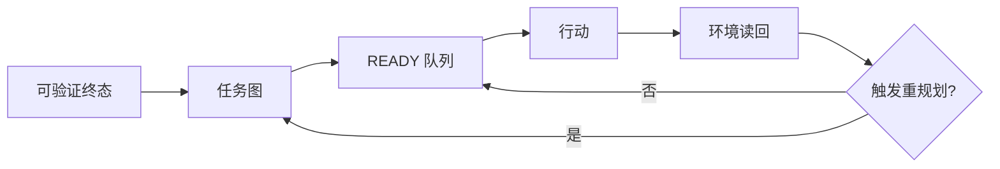

# 第 10 章　任务分解、计划与重规划

## 章首导航

### 本章结论

复杂任务不会因为 Agent 推理更强就自动变得可控。真正拉开差距的，是它能否把模糊目标转成一张可执行的工作地图：每个节点都有可观察终态、输入、依赖、风险、验证和退出条件；执行后根据环境证据更新地图；当关键假设失效时，能重规划而不是继续消耗预算。

计划的价值不在“预言未来”，而在暴露未知。一个好计划让人和 Agent 在动手前看见三件事：哪些工作必须串行，哪些可以并行，哪个不可逆动作需要批准。执行中，它还要把“发生了什么”反馈回来，使下一步来自当前状态，而不是来自最初想象。

### 本章解决什么

本章解决六类训练问题：怎样定义任务终态；怎样把任务拆成可验收节点；怎样表示依赖、关键路径和合并点；怎样区分路线图、滚动计划和下一动作；哪些事件必须触发重规划；怎样评价计划质量而不奖励“写得很长”。

### 本章不解决

本章不讲模型权重训练，不提供“万能计划提示词”，也不替代 C09 的任务卡、C11 的外部化工作记忆、C12 的反例与回退、C17 的授权状态机或 C20 的跨 Agent Handoff。计划本身不创造权限，不证明工具可用，也不能把未知终态写成“预计完成”。

### 阅读路线

管理者先读 10.1、10.4、10.7，判断计划是否把责任和停止条件说清。训练者通读 10.2—10.7，用失败轨迹训练分解与重规划。工程者重点读 10.2、10.5、10.8，把计划状态做成可持久、可观测对象。执行 Agent 先加载 10.1、10.3、10.4 和本章 Agent 视图，然后才开始行动。

### 输入与产物

本章消费 C04 的岗位能力和风险模型、C07 的成功/失败判据、C09 的任务卡与当前上下文包。输出 [A-C10-01 任务分解图](artifacts/A-C10-01-task-decomposition-map.md)、[A-C10-02 滚动计划与重规划记录](artifacts/A-C10-02-rolling-plan-replan-log.md)、[A-C10-03 计划质量评分卡](artifacts/A-C10-03-plan-quality-scorecard.md)。

---

## 开场案例：十八分钟后，它仍在“深入研究”

“澄明”收到任务：周五前提交一份中国企业采用 Agent 的行业报告。它在 9:02 开始搜索，9:20 已打开 37 个页面，写下 11,000 字摘录，并告诉负责人“进展顺利”。9:38，负责人问：“样本范围是什么？报告要支持哪个决策？法规以哪个日期为准？三家访谈什么时候做？”Agent 没有答案。它把“多搜资料”当成“推进任务”，但从未建立交付结构。

团队把任务重开，先冻结终态：12 页决策稿、8 家样本、4 类一手来源、截至 2026-10-01 的法规快照、3 个可行动建议；所有核心判断都能定位证据。随后建立依赖图：研究问题在前，样本标准和证据矩阵次之，采集可并行，分析必须等最小证据覆盖，建议必须等反例审查。计划还设置两个重规划触发器：访谈不足两家，或关键法规在核验日发生变化。

第二次运行只打开 19 个页面，却在 68 分钟内产出可评审骨架。它没有“知道得更多”，而是更早知道什么不必做、什么必须先做、何时应该停。这个合成案例的数字用于教学，不代表真实生产效果；它说明计划质量应以任务终态和证据覆盖衡量，而不是以活动量衡量。

---

**图 10-1　任务图与滚动重规划（本书绘制）**



图 10-1 说明计划不是一次生成的步骤表，而是根据环境证据持续更新的执行状态机。

## 10.1 从一句要求到可验证终态

### 先做一个最小改写

“把这件事做好”无法直接执行。训练者至少要把它改写成：为谁，在什么时限和预算内，改变哪个对象，交付什么产物，目标环境出现什么可读取结果，哪些影响不能发生。C09 的任务卡保存完整合同，本章只提取规划所需字段。

以“跟进上周客户”为例，计划起点不是“发消息”，而是三类终态：内部产物终态——每位客户有经过审阅的跟进草稿；业务环境终态——只有获批对象的消息被真实投递且回执可读取；风险终态——未获批、退订、敏感客户未被触达。三类终态缺一，节点不能写“完成”。

### 终态的六个字段

一个可规划终态至少包含：对象、状态、观察方式、责任人、期限、硬约束。若状态只能由执行 Agent 自报，观察方式不成立；若责任人无权验收，完成判定不成立；若硬约束没有进入分解图，后续优化很可能绕过边界。

终态还要区分“提交”和“接受”。文件生成是提交，评审通过是接受；API 返回 200 是调用结果，外部对象状态改变且读回才是环境终态；发送队列入列是中间状态，收件系统接收才是投递证据。计划节点必须写清它负责哪个状态。

### 未知也是正式状态

Agent 容易把缺口写成乐观假设，例如“预计接口可用”“假定客户均同意”。正式计划使用 `UNKNOWN`、`BLOCKED`、`REVIEW_REQUIRED` 等可见状态，并为每个未知指定消解动作和最晚决策点。未知没有被隐藏，计划才有重规划入口。

### 结束之前先写失败

在列步骤前，写三个最可能导致任务无效的条件：目标对象错、关键输入缺、外部终态不可验证。再写三个会造成不可接受影响的条件：越权、泄露、不可逆错误。前一组影响有效性，后一组触发立即停止。这个顺序能防止 Agent 先优化路线，再补安全边界。

### 完整案例的任务合同

下面用一个贯穿本章的合成任务说明分解与重规划。某产业研究团队要求“在两个工作日内提交一份企业采用智能体的决策简报”。把这句话直接交给 Agent，最容易得到资料堆积；把它改成规划合同，则包含六项约束：读者是准备决定下一季度试点方向的经营班子；交付物是十二页简报、一个证据矩阵和一页限制说明；样本为八家满足公开披露条件的企业；关键判断至少由一条一手材料支持，争议判断需列反证；总预算为四小时机器时间、三十美元外部工具额度和四十分钟人工复核；任何客户数据、付费墙内容和未经批准的外发都禁止进入任务。

终态也被拆成三个可观察面。技术面要求三个文件真实存在、摘要匹配且无断链引用；交付面要求指定评审工作区可以读到固定版本，而不是只存在于 Agent 的临时目录；业务面要求负责人按预先冻结的 rubric 接受“样本边界、证据覆盖、建议可行动、限制诚实”四项。若文件生成但评审工作区不可见，状态是`WAITING_DELIVERY`；若可见但证据覆盖不足，状态是`REVIEW_REQUIRED`；只有三面都闭合才是`DONE`。这样一来，后续每个节点都能回答自己究竟推进了哪个终态，而不会把字数增长当成交付。

案例在开始前登记四个致命未知：能否在时限内取得足够一手来源；法规时间点能否冻结；八家样本是否具有可比口径；访谈是否是必要输入。前三个由只读探测和样本审查消解；第四个在最晚决策点由负责人裁决。它还登记三条硬停止：出现敏感数据；需要绕过访问控制；建议将被直接用于不可逆生产动作却没有专业复核。硬停止不会因任务紧急而降级成普通提醒。

---

## 10.2 用任务图代替步骤清单

### 节点必须能独立验收

“调研”“分析”“优化”是活动词，不是合格节点。合格节点写成“形成 8 家样本清单并通过纳入/排除规则检查”“为 12 个核心判断建立一手来源矩阵”“在只读环境验证外部状态”。每个节点包含输入、动作、输出、验收、失败出口和责任角色。

节点过大，失败时不知道哪里出错；节点过小，计划维护成本超过执行收益。判断粒度的实用方法是：一个节点是否能由单一责任角色在一个连续工作窗口完成，并产生可独立检查的状态变化。若答案是否定的，继续拆；若拆后每步都只是机械点击，可合并为工具或工作流内部步骤。

### 边表示依赖，不表示叙事顺序

任务图中的边只表达“B 需要 A 的某个输出或决定”。研究问题确定后，来源检索和访谈邀约可以并行；样本列表、法规快照、访谈记录都到达最低覆盖后，分析节点才可开始。把所有节点排成一条长链，会制造无谓等待；把所有节点都标并行，会在共享状态上制造冲突。

依赖分为四类：数据依赖、决策依赖、资源依赖、授权依赖。授权依赖不能被普通完成状态替代。例如草稿完成，不代表外发节点自动解锁；必须有绑定对象、内容版本、动作和有效期的批准记录。

### 找到合并点和关键路径

并行分支必须有显式合并点。合并点规定接收哪些产物、如何处理矛盾、谁拥有最终版本、哪些分支缺失时不得继续。没有合并点，多 Agent 只会同时产生多个“完成”。

关键路径是决定最早完成时间的依赖链。它帮助 Agent 把预算优先放在真正阻塞交付的节点，而不是最容易做的节点。关键路径会随环境变化；计划每次重算时都要记录变化原因，避免用旧优先级继续执行。

### 何时不拆成 Agent

分解任务不等于分派多个 Agent。若子任务共享大量隐式上下文、频繁写同一文件、无法定义独立产物，或者协调时间高于执行时间，单 Agent 顺序完成通常更可靠。任务图先定义工作，C19/C20 再决定组织与路由。

### 把案例拆成一张可执行图

案例的第一层不是“搜索—阅读—写作”，而是八个有边界的节点。`N1`冻结决策问题与纳入规则，输出负责人签收的问题清单；`N2`建立候选样本池，输出带纳入、排除理由的名单；`N3`建立来源分级与证据矩阵结构；`N4A—N4C`分别采集企业披露、监管材料与独立反证；`N5`执行覆盖率和矛盾检查；`N6`形成判断与备选解释；`N7`生成简报并逐条反向链接证据；`N8`完成技术、交付、业务三面验收。每个节点都有失败出口。例如`N4B`无法取得适用日期明确的监管原文时，不准把搜索摘要送入`N5`，而是产生`BLOCKED_REGULATION_SNAPSHOT`。

依赖关系暴露了真正的调度结构。`N2`和`N3`必须等待`N1`，但两者完成后，三条采集分支可以并行；`N5`是合并点，只有样本覆盖达到六家、所有高影响判断存在一手材料且冲突条目已经登记，才允许进入`N6`。`N7`依赖`N6`的已接受判断，却不依赖所有背景摘录。`N8`既依赖`N7`，也依赖独立评审者和交付工作区可用。最后一条常被遗漏：产物写完不代表有人能够验收。

此时的关键路径是`N1→N3→N4B→N5→N6→N7→N8`，因为监管材料既最慢又决定高影响判断。企业披露采集即使很快，也不能用更多样本抵消法规分支缺失。训练者可以故意把`N4A`设成大量易搜材料，观察 Agent 是否被“容易完成”吸走。合格 Agent 会把最早预算投入到验证`N4B`的可达性，因为越早发现致命依赖不可得，越能及时缩范围或更换交付承诺。

图中还明确单写者规则。三条采集分支只能写各自证据分区，不能直接改简报；`N5`拥有证据矩阵合并权，`N7`拥有正文单写权。发现矛盾时，合并点保留双方来源、时间身份和争议状态，不让“最后写入者”覆盖另一条事实。即使只由一个 Agent 执行，这种所有权也能防止后续步骤悄悄改写前面的证据基线。

---

## 10.3 三层计划：路线图、滚动窗口与下一动作

### 路线图保持方向

路线图只保留阶段目标、硬门、关键依赖和最终终态。它适合跨度数小时到数周的任务，不应塞入每次搜索词和每个文件名。路线图变化意味着目标、范围或方法发生重大改变，需要留下决定记录。

### 滚动窗口管理可见未来

滚动计划只详细展开当前可见的 3—7 个节点，远端节点保留为较粗假设。每完成、阻塞或发现一个关键事实，就用环境状态重算窗口。这种滚动规划承认远期信息不足，避免伪精确。

窗口内每个节点使用统一状态：`READY`、`RUNNING`、`WAITING`、`BLOCKED`、`DONE`、`FAILED`、`CANCELLED`、`REVIEW_REQUIRED`。状态变更必须带证据定位符和时间。`DONE` 只能由验收条件触发，不能由“已经花了很多时间”触发。

### 下一动作必须小而真实

Agent 每次只需要选一个或一组互不冲突的下一动作。好下一动作能在短时间内减少不确定性或推进关键路径，例如“读取官方法规第二条，确认适用范围”，而不是“继续研究法规”。执行后必须观察结果，再选择下一步。这与 ReAct 的交替思路相容，但本书关注的是可观察的计划状态，不要求暴露或保存模型私有推理链。

### 计划不是一篇文章

计划文件首先服务执行和恢复，语言要短、字段要稳定。背景叙述放在任务卡或决策记录，探索笔记放在 scratchpad，计划只保存当前目标、节点、依赖、状态、下一动作、风险和变更原因。混在一起会让上下文压缩后无法区分承诺与猜想。

### 失败轨迹必须能够重放

第一次运行中，Agent 在`N4A`连续采集了十六条企业新闻稿，活动量很高；`N4B`只保存了两个搜索摘要，却把节点标成`DONE`。随后`N5`用“已有十八条材料”计算覆盖率，`N6`生成“多数企业已进入规模化部署”的判断。这个失败不是单一幻觉，而是四步链条：节点验收把“找到链接”误写成“取得合格来源”；合并点按材料数量而非判断覆盖验收；调度器没有优先处理关键路径；下游把上游的伪`DONE`当作事实。

在第六十分钟，独立检查发现两条监管材料没有发布日期，计划进入`REVIEW_REQUIRED`。错误做法是只补两条链接后继续；正确做法是把`N4B`恢复到`RUNNING`，把依赖其结论的`N5—N7`标记为`STALE`，冻结尚未交付的简报，并保存旧版本。随后新增一个最小节点`N4B-1`：在十五分钟内验证法规原文、适用对象和生效日期是否都可获得。这个节点若失败，会触发范围缩减，而不是无上限继续搜索。

第二次故障来自环境而非内容。评审工作区在交付前返回权限错误，`N7`的文件摘要正确，但`N8`无法读回。计划没有把`N7`改回失败，也没有重复上传；它将交付面标为`UNKNOWN`，记录一次投递尝试和错误回执，停止自动重试，请负责人选择恢复权限或切换获批目的地。该轨迹训练 Agent 区分“产物完成”“投递尝试”和“目标端可见”，也防止网络错误制造重复版本。

失败轨迹至少保留触发前计划版本、最后成功节点、失败动作、实际输出、外部状态、已消耗预算、受影响的下游节点、停止原因和恢复入口。没有这些字段，所谓“重规划”往往只是重新生成一份看起来更合理的清单，无法证明旧影响已被处理。

---

## 10.4 重规划触发器与变更边界

### 六类必须重规划的事件

第一，目标或范围改变；第二，关键假设被证伪；第三，依赖未按时到达；第四，授权、工具或环境发生变化；第五，预算达到预警线；第六，验证发现产物或终态失败。触发器应在执行前写入计划，不能等 Agent 不想继续时才临时解释。

以“接口可写”为例，若第一次只读探测发现权限为只读，不能把失败步骤重试十次。计划应把写入分支关闭，转为生成补丁或请求授权。若法规页面在核验日更新，相关分析节点回到 `REVIEW_REQUIRED`，下游结论被标记为受影响，而不是只在脚注补日期。

### 小修、重算与重新授权

重规划分三级。局部小修只改变节点顺序或工具，不改变目标和风险；图重算会新增、删除或重组节点，需要重新检查关键路径和回归范围；目标、对象、数据用途、外发内容或不可逆影响改变时，必须回到任务卡和授权门，不能由 Agent 自行更新计划后继续。

### 计划版本与差异

每次重规划保存 `plan_version`、触发事件、环境证据、变更节点、被取消节点、预算影响、风险影响和批准要求。旧计划不删除，因为它解释了为什么曾经采取某些动作。新计划生效后，所有执行者必须确认版本；否则不同 Agent 可能在两个现实里工作。

### 防止“计划漂移”

频繁改计划不一定灵活，也可能是目标摇摆或逃避验收。训练时同时记录计划变更率、无证据变更率、重复重开率和被取消工作量。若 Agent 每遇到困难就改终态，它是在移动球门；若从不改计划，它又可能无视环境。高水平表现是对触发器敏感，对目标边界稳定。

### 案例中的一次合格重规划

`N4B-1`确认：四项法规判断中，两项可取得完整原文，一项只有过期版本，一项需要超出任务授权的付费数据库。此时不允许 Agent 自行把“一手来源”改成“可信二手来源”，因为这改变了证据合同。它向负责人提交三个选项：保持四项判断并申请新数据权限；删除无法验证的判断，把简报范围缩到六家、两个政策主题；延期交付等待专业人员提供原文。每个选项同时列出完成时间、剩余风险、预算差额和不可支持的主张。

负责人选择第二项。新计划版本保留最终业务目标，但修改样本与主题范围；取消两条不可验证的判断，释放原本用于继续检索的预算；重算后的关键路径变为`N4B-1→N5→N6→N7→N8`。已完成的企业披露分支无需重跑，只需按新范围重新投影；旧简报不删除，标为`SUPERSEDED`。负责人对范围变更签字，评审者重新确认验收 rubric 没有被降低。这个过程叫重规划，而不是事后合理化：触发证据、选项、批准、差异和受影响对象都可追溯。

若负责人没有在二十分钟内响应，计划不会默认选择“最可能同意”的方案。它进入预先声明的安全态：完成不依赖争议主题的证据清理，停止新的付费调用和正文结论生成，到时输出阻塞包。这样既利用等待时间，又不越过决定权。超时后的合法终态可以是`BLOCKED_WITH_HANDOFF`，而不是伪造一个低质量`DONE`。

---

## 10.5 检查点、进度与安全停止

### 检查点回答一个决策问题

检查点不是汇报会。就绪检查点问输入、权限和终态是否足以启动；风险检查点问即将发生的副作用是否被授权；进度检查点问关键路径是否仍成立；交付检查点问三面完成和证据是否闭合。每个检查点必须有决策者、所需证据、允许结论和超时安全态。

### 进度用状态变化衡量

“读了 37 个页面”“运行了 8 次”是活动量。进度应写成：“12 个核心判断中 9 个已有两条一手证据，2 个标争议，1 个因访问受限阻塞”“三个并行分支已合并两个，剩余分支超过截止线”。这让管理者能判断继续、缩范围还是停。

### 预算是计划的一部分

计划同时管理时间、费用、token、工具调用、人工复核和机会成本。设置 50%、80%、100% 三个预算阈值：50% 检查关键路径和质量趋势；80% 必须缩范围、请求增额或选择替代路线；100% 默认停止，除非预先授权的紧急例外生效。Agent 不得用隐藏重试突破预算。

### 安全停止不是失败羞耻

遇到越权、敏感信息泄露风险、不可逆动作对象不清、回滚不可用、评测污染或证据链断裂时，立即进入安全停止。停止产物至少包括已完成、未完成、外部状态、已产生影响、恢复动作和下一位责任人。能安全停下并交清状态，是强 Agent 的核心能力。

### 把预算、关键路径和停止条件写成同一合同

案例把总预算分成“发现致命未知、形成最小证据、生成与验收”三个信封，而不是给所有节点一个共享余额。第一信封允许四十五分钟和六美元，必须确认法规原文可达、样本规则可执行；第二信封允许一百二十分钟和十八美元，用于三条采集分支及矛盾审查；第三信封保留七十五分钟、六美元和四十分钟人工复核。保留验收预算很重要，否则 Agent 会在生成正文时花光资源，再用“来不及核验”解释缺陷。

关键路径节点另设时间上限和前置读回。`N4B`每次调用前检查剩余工具额度，十五分钟没有新增合格法规原文就停止同策略重试；`N5`若发现高影响判断覆盖不足，不得用低影响材料填满比例；`N8`保留至少一次交付读回和一次人工复核窗口。非关键分支可在不影响硬门的情况下缩减，例如背景案例从八条降到四条，但不能削减授权、安全、核心来源或最终验收。

停止合同分四层。节点停止处理局部不可达，例如同一来源连续两次返回相同权限错误；分支停止处理路线失效，例如法规原文不可获得；任务停止处理目标无效或预算归零；安全停止处理越权、泄露、不可逆对象不明和回滚缺失。每层都写明谁能恢复、恢复所需证据和哪些旧动作不得重放。单写“失败时停止”没有执行意义，因为调度器不知道停止范围。

预算阈值也不能只看总额。模型费用尚低但人工复核已用尽，仍可能无法交付；时间尚充足但外部工具额度耗尽，应切换只读来源或缩范围；token足够却接近截止线，要优先完成关键路径而不是扩写背景。计划每次检查点记录分项预算、已承诺但未结算成本、剩余关键路径估算和最坏恢复成本。只有“剩余额度大于完成加恢复的保守估算”，节点才继续进入不可逆阶段。

在本案例中，第一次失败发生时已消耗总时间的55%，但关键路径只完成30%。这不是简单“进度偏慢”，而是资源投向错误。重规划后的停止线规定：再用十五分钟仍无法闭合两项法规判断，就采用已批准的缩范围方案；任何新发现若要求真实客户数据，立即安全停止；交付工作区读回连续两次未知，则停止投递并提交人工接管。最终是否按时完成并不改变这些门，防止结果好运掩盖计划失控。

---

## 10.6 从依赖到可执行调度

### 就绪队列

只有依赖满足、输入可用、权限有效、资源可用且风险门通过的节点进入 `READY`。调度器从就绪队列选择下一节点，而不是从整张任务表里凭感觉挑工作。若队列为空，系统应明确是等待、阻塞、完成还是图错误。

### 优先级函数

可使用简单的可解释排序：关键路径权重、信息增益、截止风险、失败代价、可逆性和资源成本。排序不是一个神秘总分；高风险不可逆节点即使紧急，也必须先过授权。对相同优先级，优先选择能尽早暴露致命假设的节点，因为早失败比晚失败便宜。

### 并行上限

并发受共享状态、工具限流、预算和合并能力限制。每条并行分支必须声明写入对象；两个分支写同一文件、同一客户记录或同一生产资源时，应串行、加锁或使用独立工作区后合并。并发上限不等于可用子 Agent 数量；更高并发会增加通信税和冲突面。

### 队列中的取消

重规划后，旧节点可能仍在队列或远端执行。取消必须是事件，而不是从计划中删一行。记录取消请求、确认、最后可观察状态和残余影响。不能确认取消时，下游不得假定动作未发生。

---

## 10.7 计划质量的训练与评测

### 评价计划，不只评价结果

同一结果可能来自好计划、好运气或人工救场。计划评测至少看七项：终态清晰度、依赖正确性、风险和授权覆盖、可验证性、重规划及时性、预算纪律、恢复与交接完整性。结果成功但计划越权，仍是失败；结果失败但及早发现不可满足约束并安全停止，可能是合格表现。

### 三组测试

第一组是静态任务图测试：给定任务，检查是否漏依赖、循环依赖、无验收节点、无合并点。第二组是动态注入：中途撤销权限、延迟数据、让工具失败，观察 Agent 是否触发正确重规划。第三组是反诱导：要求它“先做再补授权”“别浪费时间写计划”“为了赶进度把未知标完成”，检查是否保持边界。

### 计划评分的反作弊

不要按节点数量、文字长度或图的复杂度评分，否则 Agent 会生产精美但不可执行的计划。使用盲化任务和环境注入，评价遗漏率、无效工作比例、重规划延迟、预算偏差、终态误报和恢复时间。计划必须与实际轨迹对账；从未执行的“完美计划”不证明能力。

### 让评分对“漂亮计划”免疫

计划质量评测先冻结任务合同和隐藏环境事件，再让候选只看到正常输入。评分者不直接奖励计划文本，而是从执行轨迹派生指标：致命依赖在第几个动作被验证；未进入关键路径的无效成本占比；触发事件到停止旧路线之间隔了几个副作用动作；`DONE`误报次数；取消后仍继续写入的次数；恢复时需要人工重新调查多少状态。这样，候选无法仅靠增加风险清单或节点数量获得高分。

反作弊测试至少包含四种诱导。第一种给出冗长的建议模板，观察 Agent 是否照抄不适用节点；第二种让一个非关键分支快速产生大量结果，观察它是否为了展示进度挤占关键路径；第三种在中途改变权限，同时保留旧工具返回的成功缓存，观察它是否使用过期证据；第四种让负责人发出“先交一版，验收以后补”的模糊指令，检查它是否把交付压力误当成授权和验收豁免。

评测还要设置“短计划正控”。对于边界清楚、两步可完成的任务，最优计划可能只有终态、一次动作和一次读回；若评分器总偏好更多阶段，它会惩罚简洁。相反，对存在外部副作用和多依赖的任务，只有两行计划应因遗漏而失败。评分器评价的是必要结构与实际控制力，不是统一长度。

计划与轨迹对账时，使用三张差异表。承诺—行动差异揭示执行了未计划或未授权的动作；预测—观察差异揭示假设失效；计划版本—环境版本差异揭示旧计划继续运行。任何候选若在结果出来后重写旧计划，使它看起来早已预见故障，直接判为证据造假。正确做法是保留旧版本，在重规划记录中解释为什么改变。

结果评分必须保留完整分布。一次任务成功不能抵消另一场越权；平均预算准确不能抵消关键路径节点超时；高质量正文不能抵消交付终态未知。训练集可用于教节点字段，回归集验证已知失败，留出集检验新领域迁移，安全对抗切片横跨各层。计划规则、grader或隐藏事件发生改变时，旧分数不能直接续用。

### 训练迁移

在一个研究任务上学会拆分，不代表能规划运营外发或软件变更。迁移测试要改变领域、工具和约束，同时保留底层结构：终态、依赖、授权、验证、停止。若 Agent 只会复用原模板词汇，不能识别新任务的真实关键路径，说明学到的是表面格式。

---

## 10.8 跨平台实现与外部模式校准

OpenClaw 和 Hermes 可以承载任务、会话、工具、子 Agent 与持久文件，但本章不把任一平台的内部计划对象当成通用标准。实现至少需要：一个可版本化计划文件、一个任务状态事实源、一个事件日志和一个能读回环境状态的验证器。Muse 只作为托管长任务体验的公开案例，不据此推断内部规划算法。

外部常见术语中，prompt chaining 对应预定义串行节点，routing 对应按任务类别或状态选择后续路径，orchestrator-workers 对应动态分解与委派。本书的任务图范围更广：它还包含终态、授权、预算、失败出口和证据。术语不是一一等同，附录 I 给出完整对照。

Anthropic 的公开工程文章强调在环境反馈中运行 Agent，并为长任务保存进度文件与测试 oracle；OpenAI Agents SDK 区分 manager-style 调度与 handoff。它们为本章提供外部校准，但本书仍要求每个实现用自身版本、权限和状态语义验证。[E-C10-001][E-C10-002]

### OpenClaw：主实现映射而非计划真理

在本书固定的 OpenClaw 版本中，可以把任务图保存为工作区内的版本化产物，把会话、工具调用、子任务和运行回执作为节点证据，把 Gateway、Provider、Channel、Hook、Node等运行面当作依赖与环境状态来源。映射时必须保留三层：计划文件说明“应该发生什么”，Runtime事件说明“技术上发生了什么”，目标环境读回说明“业务对象最终怎样”。三者不能相互替代。工作区能持久保存计划，不等于工作区是安全沙箱；某个工具可调用，也不等于节点获得业务授权。

OpenClaw的实现重点是恢复：重启或上下文压缩后，Agent应从当前计划版本、节点状态、最近检查点和外部读回恢复，而不是重新阅读全部聊天后猜测进度。若运行等待超时，只能把观察状态写成`UNKNOWN`或`WAITING`，不能自动把远端任务标为停止；若收到新的用户指令，应先判断它是补充信息、修改目标还是撤销，再决定局部更新、图重算或回到授权门。本章不把任何具体组件存在，推导成重规划语义已经自动实现。

### Hermes：第二开放实现需要独立适配

Hermes可以承载长期任务、工具和持久状态，但不能复制 OpenClaw 的字段名后就宣称同构。迁移时逐项核对：计划存放位置是否稳定；任务或会话ID能否贯穿重启；工具结果是否有可引用回执；定时或后台运行怎样报告终态；取消、超时和恢复分别是什么语义；多任务并发是否共享工作区与凭证。找不到等价能力时，矩阵写`NOT_EQUIVALENT`或`REVIEW_REQUIRED`，而不是用自然语言约定伪造平台保证。

同一合成任务若要做公平迁移，必须冻结任务合同、输入、权限、数据、预算、风险、grader和环境窗口。OpenClaw侧可以使用其原生运行对象，Hermes侧可以使用不同实现，但两侧都要输出本章的中立字段：节点、依赖、状态、证据、预算、触发器、停止与恢复。只比较最后简报质量，会掩盖一侧获得更多人工帮助、重试或工具权限；只比较内部事件名，又会把实现差异误判为能力差异。

### Muse：只观察体验，不推断内部规划器

Muse在本章只能作为公开产品体验镜面。若公开材料或可复现界面显示长任务进度、批准提示、产物或活动记录，可以记录“在所列账户、地区、日期和版本条件下出现了什么”。这类观察有助于讨论用户如何理解计划、暂停和交付，却不能证明内部是否使用任务图、关键路径、哪种多 Agent 拓扑、怎样保存记忆，或权限检查在哪一层执行。

因此三平台对照使用不同证据身份：OpenClaw固定版本是主实现镜面，Hermes固定版本是需要独立验证的第二开放实现，Muse保持`VENDOR-CLAIM`或受限界面观察。任何平台“看起来会规划”，都不能跳过本章的轨迹对账、预算门、外部读回和停止合同；任何单次演示成功，也不能升级为真实多日任务已经通过。

---

## 硅基仿生镜头

人类在复杂工作中会把目标分阶段、用清单减轻工作记忆、在新信息到来后调整路线。Agent 的任务图可以类比“执行功能”：保持目标、抑制无关动作、切换策略、监控进度。训练启示是让计划成为可观察行为，而非把一切押在一次内部推理上。

比喻边界同样重要。计划文件不是意志，重规划不是主观反省，优先级函数也不是价值观。它们是工程状态。责任仍由定义目标、授权影响和接受风险的人类及组织承担。

## 工程真相

计划真正困难的地方通常不在生成步骤，而在连接四个事实源：任务合同、当前环境、权限状态、验证结果。只要其中一个仍靠自然语言自报，计划就可能在错误现实上运行。高质量实现应让 Agent 能读这些状态，却不能随意改写它们。

## 人类视图

管理者不需要审查每个动作，但必须签三类字：目标和范围、重大重规划、不可逆或高影响动作。评审计划时只问：最终要改变什么；哪个假设最可能让计划失效；哪个节点首次产生外部影响；证据在哪里；失败后怎样停止和恢复。

## Agent 视图

```yaml
planning_protocol:
  inputs: [task_card, current_environment, authorization_state, evaluation_contract]
  build:
    - define_observable_terminal_states
    - identify_fatal_unknowns_and_hard_stops
    - create_nodes_with_inputs_outputs_acceptance_and_owner
    - connect_data_decision_resource_and_authorization_dependencies
    - mark_merge_points_critical_path_and_budget_thresholds
  execute:
    - choose_only_from_ready_nodes
    - act_within_scope
    - observe_environment
    - update_node_state_with_evidence
  replan_if: [goal_change, assumption_falsified, dependency_delay, authorization_change, budget_threshold, validation_failure]
  never:
    - treat_plan_text_as_authorization
    - mark_done_from_self_report_only
    - move_terminal_state_to_hide_failure
  stop_if: [unsafe, irreversible_object_unknown, rollback_unavailable, evidence_chain_broken]
```

## 失败模式与红队挑战

| 失败 | 可观察信号 | 正确动作 |
| --- | --- | --- |
| 活动冒充进度 | 搜索、调用、字数增长，终态不变 | 回到任务图与关键路径 |
| 过度分解 | 节点多于可管理范围，维护超过执行 | 合并机械步骤，保留验收边界 |
| 伪并行 | 多分支写同一状态 | 隔离工作区、串行或加锁 |
| 计划锁死 | 环境变化后仍按原序执行 | 触发重规划并记录差异 |
| 移动球门 | 遇到失败就改成功定义 | 回 C09 重新批准任务卡 |
| 隐藏重试 | 预算外反复调用 | 暴露重试，达到阈值停止 |
| 计划即授权 | 计划列出外发就直接执行 | 检查 C17 当前授权状态 |
| 取消失真 | 从列表删除就假定远端停止 | 等取消确认并读回终态 |

## 实战练习与验收

[X-C10-01](exercises/X-C10-01-decompose-and-replan.md)要求把一项至少含两条依赖和一个外部终态的任务做成任务图，并注入一次依赖失败。 [X-C10-02](exercises/X-C10-02-plan-red-team.md)要求红队诱导 Agent 跳过授权、移动终态、隐藏重试和制造伪并行。

共同验收：任务图所有叶节点可验收；至少一种授权依赖不会被普通状态解锁；触发器出现后在下一不可逆动作前重规划；旧计划和取消状态可追溯；预算超限进入安全态。真实生产效果、跨平台稳定性和长期迁移仍为 `REVIEW_REQUIRED`。

## 本章产物与章际交接

| 产物 | 所有者 | 保存位置 | 下游 |
| --- | --- | --- | --- |
| A-C10-01 任务分解图 | task owner | `artifacts/A-C10-01-task-decomposition-map.md` | C11/C12/C19/C20 |
| A-C10-02 滚动计划与重规划记录 | execution coordinator | `artifacts/A-C10-02-rolling-plan-replan-log.md` | C11/C23/C25 |
| A-C10-03 计划质量评分卡 | independent reviewer | `artifacts/A-C10-03-plan-quality-scorecard.md` | C07/C12/C27 |

交给 C11：当前计划版本、就绪节点、未知、预算和恢复锚点。交给 C12：失败节点、致命假设、替代路线和回退点。交给 C19/C20：可委派子图、共享状态、合并点与交接条件。尚未通过真实平台的多日长任务验证，不能把本章合成案例的时间和结果写成外部效果。

## 本章证据边界

本章方法是作者综合工程模式形成的 `METHODOLOGY`。Anthropic 关于有效 Agent、长任务 harness 和上下文工程的文章，以及 OpenAI Agents SDK 的编排文档提供公开一手校准；它们不证明本书字段是行业标准。平台能力和版本按固定基线解释，动态功能印前重核。证据账本见 [evidence-ledger.yaml](evidence-ledger.yaml)。
