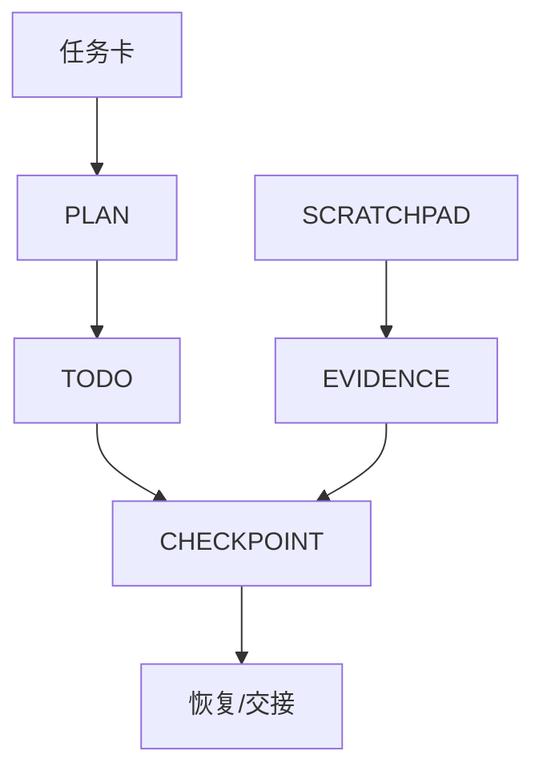

# 第 11 章　外部化工作记忆与长任务续作

## 章首导航

### 本章结论

长任务最常见的失败并非模型突然变笨，而是工作状态只存在于正在消逝的上下文里。计划被压缩，待办被新消息淹没，关键试验混在探索笔记中；下一次会话只看到一段模糊摘要，于是重复搜索、覆盖正确文件，甚至把已经否定的假设重新当成结论。

强 Agent 会把必须跨步骤、跨会话、跨执行者保存的工作状态外部化。计划文件回答“为什么做、做到哪里”；待办回答“接下来有哪些可领取动作”；scratchpad 保存可丢弃探索；证据索引指向可复核事实；检查点则提供恢复所需的最小快照。它们共同构成工作记忆系统，但不等同于长期 Memory。

### 本章解决什么

本章说明怎样设计计划文件、待办、scratchpad、决策记录、证据索引和恢复检查点；怎样在上下文压缩、会话中断和 Agent 交接后继续工作；怎样使用渐进披露和提示缓存降低上下文成本；怎样防止外部状态过期、冲突、泄密或变成第二个垃圾场。

### 本章不解决

本章不讲模型内部记忆机制，不把私有推理链当作必须保存的审计材料，不替代 C13 的长期记忆生命周期，也不把 prompt caching 当成记忆或数据持久化。外部化文件不创造权限；scratchpad 中出现的秘密也不会因为文件名叫“临时”而失去敏感性。

### 阅读路线

初次实践者先读 11.1—11.5，搭起最小四件套。训练者重点读 11.6—11.8，设计中断与污染练习。工程者关注原子写入、锁、版本、检查点和恢复测试。管理者只需确认状态所有者、保留边界、恢复时间和完成证据。

### 输入与产物

本章消费 C09 的任务卡/上下文包和 C10 的任务图/滚动计划。输出 [A-C11-01 工作状态目录规范](artifacts/A-C11-01-work-state-directory.md)、[A-C11-02 恢复检查点](artifacts/A-C11-02-resume-checkpoint.md)、[A-C11-03 上下文预算与压缩记录](artifacts/A-C11-03-context-budget-compaction-log.md)。

---

## 开场案例：第二天的 Agent 毁掉了第一天的正确工作

“北辰”团队用两个会话处理一次网站迁移。第一天，执行 Agent 发现新版依赖与支付回调冲突，已经将升级方案改为“保留旧 SDK，先加兼容层”，并在终端里跑过四个测试。它只在聊天末尾写了一句：“目前基本完成，明天继续收尾。”

第二天，新会话只拿到自动摘要：“已完成依赖升级，剩余少量测试。”Agent 于是删除兼容层、升级 SDK，并把昨天的失败日志覆盖。四十分钟后，支付回调回归失败。团队没有可读取的计划版本、待办、决策记录、测试证据索引或工作树状态，只能从命令历史拼现场。

复盘后，他们建立最小续作包：`PLAN.md` 保存目标、当前策略和停止条件；`TODO.md` 只列就绪动作；`DECISIONS.md` 记录“为何不升级 SDK”；`CHECKPOINT.yaml` 保存提交、测试、未提交改动、外部状态和恢复命令。随后在一次主动中断演练中，新 Agent 用 4 分钟恢复并正确继续。这个数字来自合成教学演练，不是生产基准；关键变化是接班者不再依赖摘要猜测事实。

---

**图 11-1　外部化工作记忆栈（本书绘制）**



图 11-1 区分承诺、动作队列、临时探索、证据和恢复快照，避免一份摘要承担所有职责。

## 11.1 区分上下文、工作状态与长期记忆

### 四种对象

**即时上下文**是模型本轮可见的输入集合，会受窗口、装配和压缩影响。**工作状态**是任务正在进行的外部事实，例如当前计划、节点状态、文件版本、阻塞和预算。**长期记忆**保存跨任务仍有价值且被允许保留的经验、偏好或知识。**证据记录**保存能够复核动作和结论的来源、轨迹、产物和终态。

同一信息可能在多个对象中出现，但权威性不同。对话里说“测试通过”只是陈述；检查点引用的测试报告是证据；长期记忆里“该项目测试已通过”很快会过期。系统必须规定哪个对象是当前事实源，以及派生副本如何失效。

### 工作记忆为什么必须外部化

上下文窗口适合推理，不适合承担唯一事实源。它可能被截断、压缩、分支或换模型；多 Agent 也不会天然共享完全相同的上下文。外部工作状态使任务可暂停、恢复、交接、审计和并行。外部化并不意味着把所有内容写盘，而是把“不保存就无法安全继续”的状态保存下来。

### 最小保存判据

一项状态满足任一条件就应外部化：下一会话必须知道；另一个执行者必须消费；错误恢复必须依赖；完成判定必须引用；不可逆动作前后需要对账。一次性的搜索词、失败的草稿句子、可从源文件重建的中间文本通常不必长期保存。

### 权威顺序

任务卡定义目标与边界，计划文件定义当前路线，待办定义下一动作，环境读回定义真实状态，决策记录解释为何选择，证据索引提供复核定位。scratchpad 最低权威，只承载探索。发生冲突时，不能让最近写下的一句话自动覆盖有所有者和版本的正式对象。

---

## 11.2 计划文件：保存承诺与当前现实

### 计划文件的固定结构

计划文件保持八个块：任务/计划 ID 与版本；目标终态；范围和硬约束；当前阶段；任务图摘要；已确认事实；未知与阻塞；重规划记录。它不复制全部背景，只保存可执行引用，例如任务卡路径、当前提交、评测规格和授权记录 ID。

### 当前状态必须可重建

“正在处理第三步”不够。接班者要知道第三步的输入是什么、做过哪些动作、产生什么结果、最后一个安全状态在哪里。节点状态与证据定位符绑定，计划更新采用原子写入；写到一半崩溃时，不应留下语法正确但语义残缺的文件。

### 写前读与版本检查

多个 Agent 可能同时更新计划。写入前读取当前版本，提交时使用 compare-and-swap、文件锁或代码评审机制；版本已变化就停止合并，不能盲目覆盖。每次计划更新只改变必要字段，并在变更记录中写触发事件。

### 计划文件不保存什么

不保存未经筛选的网页正文、访问令牌、私有推理过程、所有工具输出或全量聊天。它也不把“未来可能做”混入当前承诺。候选路线可放在 scratchpad，只有经过选择并满足边界后才进入计划。

### 计划文件协议：从叙事文档变成恢复合同

一份可续作的计划文件至少要让陌生接班者回答六个问题：目标终态是什么，当前承诺是什么，哪些事实已经由证据确认，哪些只是待验证判断，最后一个安全完成点在哪里，下一步为什么可以执行。为此，计划头部应固定记录`plan_id`、`task_version`、`owner`、`updated_at`、`base_checkpoint`与`state`；正文再按目标、边界、节点、阻塞、决策引用和恢复入口组织。字段名可以因团队而异，但语义不能混成一段自由文本。

计划的状态更新遵循“先读环境，再读计划，最后写差异”。Agent不得因为计划写着“服务已停止”就跳过真实读回；也不得因为环境暂时显示健康就抹去计划里的未解决事故。环境回答“现在发生了什么”，计划回答“团队承诺如何处理”，二者不一致时必须生成冲突事件。新版本只有在旧版本号、当前环境摘要和拟写差异同时通过检查后才能提交；提交失败就保留旧版，不允许留下半份新计划。

重规划不是把旧路线删掉重写。每次改变执行顺序、工具、责任人或停止条件，都要记录触发事实、被替代假设、影响节点、是否需要撤销已领取待办，以及怎样回到前一安全点。这样，下一个Agent看到的不是“计划更新了”，而是可判断新路线是否仍满足原目标与风险边界的变更链。若重规划涉及权限、外部写入或不可逆操作，计划只能生成候选，仍需相应授权机制批准。

计划文件还要明确完成条件与退出条件。完成条件引用任务卡中的业务或环境验收，而不是“所有TODO已勾选”；退出条件说明何时暂停、转人工、降级或取消。一个任务可能在计划层完成，但外部交付尚未被接收；也可能业务目标已经达到，剩余清理项转入独立队列。把这两种情况分开，能够防止Agent为了让计划看起来整齐而继续制造无价值动作。

---

## 11.3 待办系统：把任务图变成可领取动作

### 待办是队列，不是愿望清单

每个待办必须有唯一 ID、所属节点、状态、责任人、输入、验收、依赖、预算和到期时间。只有依赖满足的事项进入 `READY`。`SOMEDAY`、想法和长期改进不应与当前执行队列混在一起。

### 一次领取与租约

并行执行时，待办需要领取者和租约。领取后状态从 `READY` 变为 `RUNNING`，记录 lease owner 与到期时间。租约超时不代表工作从未发生；系统先检查外部状态，再决定回收、续租或人工接管。对写操作尤其不能简单重复派发。

### 完成必须带证据

待办从 `RUNNING` 到 `DONE` 时附产物路径、验证命令或终态读回；无法验证则进入 `REVIEW_REQUIRED`。只写“已处理”或勾选复选框不能关闭节点。失败进入 `FAILED`，保留错误类别和下一步；取消进入 `CANCELLED`，保留取消确认与残余影响。

### 清理与归档

当前队列只保留活跃事项，已完成事项按检查点归档，避免每次加载数百条历史。归档必须可检索，但不应默认进入模型上下文。周期性统计重开率、阻塞时长、无证据完成率和过期租约，发现流程而非个体问题。

### 待办协议：状态机、领取与终态

建议把待办限制为`BLOCKED / READY / RUNNING / REVIEW_REQUIRED / DONE / FAILED / CANCELLED`七态。创建时必须给出`todo_id`、父节点、输入版本、预期产物、验收者、风险级别和幂等属性；领取时追加执行者、租约、开始时间与授权引用；结束时追加结果、证据定位符、外部读回和残余影响。状态只能沿允许的边迁移，不能从`BLOCKED`直接写成`DONE`，也不能用删除事项表示取消。

对可能产生副作用的事项，还要记录`effect_key`、去重键和对账方法。租约过期后，新执行者先用`effect_key`检查动作是否已被下游接受：若结果确定，补写终态；若明确未执行，才可重新领取；若无法判断，转`REVIEW_REQUIRED`，不得把UNKNOWN解释成“可以再试一次”。读操作可以在预算内安全重放，付款、外发、删除、发布和生产配置变更则必须有专门恢复策略。

待办的验收者不应只是执行者的另一个提示词角色。高风险节点至少要求独立证据或环境读回；多Agent场景还要保存领取与接收确认，避免协调器宣布完成、实际责任人却从未接收。归档时保留状态迁移和失败分布，而不是只保留最终DONE列表，否则团队无法判断恢复能力是稳定机制还是一次偶然成功。

---

## 11.4 Scratchpad：允许探索，但禁止偷渡事实

### Scratchpad 的职责

scratchpad 用来保存搜索路径、候选假设、临时计算、尚未整理的观察和待验证反例。它降低每次推理都从零开始的成本，也允许 Agent 明确写下“我还不确定”。它不是正式报告，也不是长期 Memory。

### 每条观察带身份

临时笔记至少标记 `OBSERVATION`、`HYPOTHESIS`、`DECISION-CANDIDATE`、`DISPROVED` 或 `QUESTION`。外部材料附来源与抓取时间，计算附输入和脚本，模型推断明确标 `INFERENCE`。没有身份的句子在压缩后容易被误读为事实。

### 晋升通道

scratchpad 内容进入正式状态前要经过验证：事实进入证据索引，选定路线进入决策记录，下一动作进入待办，跨任务经验进入 C13 的记忆写入门。晋升后保留原定位符；不能复制成无来源的“常识”。被证伪的假设不删除，而是标记失效，防止后续会话重复走同一死路。

### 保留和敏感性

“临时”不等于“可随意保存”。scratchpad 常含原始客户资料、错误截图和工具返回，反而比正式产物更敏感。按任务数据等级控制访问和保留；任务结束时提取必要证据，清理不再需要的临时副本，并记录无法删除的备份残余。

### Scratchpad 协议：隔离区而非事实仓库

每个scratchpad条目都应带条目ID、作者或Agent身份、时间、来源、敏感级别、状态和过期条件。`OBSERVATION`只能描述看到的内容；`HYPOTHESIS`必须给出验证方法；`DECISION-CANDIDATE`必须指向影响范围；`DISPROVED`记录反例与否定原因；`QUESTION`明确由谁补证。未经来源校验的网页句子、其他Agent输出或模型自述统一标记tainted，不能因被复制到本地文件就获得更高可信度。

晋升采用“两步写入”：先在scratchpad把候选标为`READY_FOR_REVIEW`，再由有权主体把它写入目标对象并回填目标ID。若第二步失败，候选仍停留在隔离区；若目标对象后来撤销，scratchpad保留撤销引用而不是恢复旧结论。清理时先确认所有已晋升内容都有目标定位符，再删除过期原文；含客户数据、凭证片段或受许可限制内容的条目按数据治理规则单独处置。

---

## 11.5 检查点与可恢复续作

### 最小恢复快照

检查点回答：我是谁、在执行哪个任务版本、当前计划是什么、最后完成什么、外部世界处于什么状态、哪些动作可能仍在飞行、下一安全动作是什么。它还应包含工作区版本、未提交改动、运行进程、队列、工具凭证引用、预算和已知风险。

### 一致性检查

创建检查点时同时读取文件、任务数据库和关键外部状态。若三者不一致，检查点标 `INCONSISTENT`，不能声称可恢复。先停止新写入，确定事实源，再修复或人工接管。检查点不是把错误状态拍照后宣布安全。

### 恢复协议

新会话或新 Agent 恢复时按固定顺序：验证身份和权限；读取任务卡与检查点；确认计划版本；检查外部状态是否变化；核对未完成/飞行动作；运行最小健康测试；只在证据一致时领取下一待办。任何差异先进入重规划，不用旧摘要覆盖新环境。

### 恢复演练

至少测试四类中断：正常会话切换、上下文压缩、工具调用中断、执行者更换。高风险系统再测试机器重启、队列重放和凭证撤销。记录恢复时间、重复工作量、状态丢失、错误复活和人工介入。没有演练的检查点只是备忘录。

### 检查点协议：可验证、可比较、可失效

检查点不是每隔十分钟复制一次目录，而是在语义边界生成受控快照：完成一个可验收节点、即将调用有副作用工具、上下文接近压缩、执行者即将交接、权限或环境发生变化。检查点头部记录`checkpoint_id`、任务与计划版本、创建主体、可信时钟、前驱检查点和状态摘要；主体部分记录活跃TODO、飞行动作、工作区版本、未提交差异、环境读回、证据索引、预算、授权引用和恢复入口；尾部记录完整性摘要、保留策略与失效触发。

恢复者必须比较而不是照抄检查点。至少比较当前任务版本、计划版本、代码或产物摘要、权限状态、外部对象版本、飞行动作终态和当前时间是否越过TTL。完全一致才进入`RESUMABLE`；可解释差异进入`REPLAN_REQUIRED`；身份、权限、关键证据或外部终态不明进入`REVIEW_REQUIRED`；确认检查点被篡改或安全边界已破坏则`FAIL`并停止执行。旧检查点始终是历史证据，不是自动回滚命令。

检查点写入要么全部成功，要么保持前一有效版本。可采用临时文件、校验、原子替换和单写者租约；若状态分布在文件、数据库和远端系统，记录各自观察时间与一致性屏障，而不是伪装成同一瞬间。对于无法原子冻结的外部系统，检查点明确写“观察快照”及其不确定窗口，并要求恢复时重新读回。

### 完整案例：一次中断—恢复—交付闭环

“潮生”负责为一组虚构客户生成续约提醒，任务包含读取合成客户表、生成草稿、人工复核和写入隔离发送队列。开始时，任务卡禁止真实外发，计划版本`P-17.3`把任务拆成数据校验、草稿生成、抽样复核和队列写入四个节点；TODO中的队列写入项标记非幂等，必须携带客户ID与批次ID组成的`effect_key`。scratchpad记录两个待验证假设：客户时区是否完整、旧模板是否仍符合语气要求。

执行到第二个节点时，Agent发现三条客户记录缺时区。它没有在草稿里猜测，而是把观察晋升为证据事件，将对应TODO转为`BLOCKED`，并在计划中增加“缺时区记录不入队”的决策。第一批七条草稿生成完毕后，系统准备调用队列写入工具。此时它先创建`CP-17.3-04`：保存计划摘要、七个草稿digest、三条阻塞记录、发送队列读回版本、零真实外发声明、当前授权引用和下一动作；飞行动作列表为空。检查点写完并校验后，进程被故意终止。

新会话由另一Agent接手，只获得任务卡路径和检查点ID，不读取旧聊天。它先核验自己的身份与授权，随后读取任务卡、`P-17.3`、活跃TODO、决策记录和`CP-17.3-04`。环境读回显示隔离队列已有四条相同批次记录，而检查点写着“飞行动作为空、队列写入尚未开始”。这不是立即重做的理由，而是状态冲突：可能有人在检查点后操作，也可能上一次工具调用在记录前已经部分生效。

接班Agent据`effect_key`逐条对账，确认四条记录的payload digest与草稿一致，另外三条不存在；它把已有四条补记为`DONE`并引用队列receipt，把剩余三条生成新的单次领取事项。若它简单按检查点重放七条，就会产生四次重复副作用。对账完成后，Agent再次读取授权，发现原批次授权仍有效但只覆盖隔离队列，于是写入剩余三条；环境读回为七条且digest全部匹配。三条缺时区记录保持`BLOCKED`，没有被“总数应该是十条”的目标压力偷偷放行。

最后，接班Agent运行抽样检查，把技术执行证据、可见交付清单和隔离队列验收分别写入证据索引；计划标记本轮范围完成，但业务终态仍是“待人工批准，不得真实发送”。它创建结束检查点，归档DONE事项，保留阻塞项和临时数据清理清单。这个案例证明恢复的核心不是复述上一会话，而是用外部状态、幂等键、证据和授权重新建立可继续行动的事实基础。

---

## 11.6 渐进披露、上下文压缩与提示缓存

### 先给地图，再按需加载

渐进披露把材料分为发现层、指令层、资源层和证据层。初始上下文只放任务目标、当前状态、约束、索引和可用工具；Agent 根据下一动作加载相关文件或片段。这样既减少噪音，也使敏感数据只在需要且有权时进入上下文。

### 压缩是有损转换

上下文压缩会丢信息。压缩前冻结不可丢字段：目标、边界、授权状态、当前计划、未完成动作、关键决策、失败和证据定位符。压缩后执行差异检查：这些字段是否仍可恢复，否定事实是否被误写成肯定，旧授权是否被重新激活。压缩产物带来源窗口、方法、时间和失效条件。

OpenAI 官方文档的 server-side compaction 用于在长对话中减少上下文并携带继续运行所需状态；其 compaction item 是实现对象，不能替代本书的人类可审计检查点。Anthropic 的上下文工程文章把上下文视为有限资源，并建议用按需检索与 compaction 维持长期任务。两者支持“压缩有代价、状态要外部化”的方向，但具体字段仍由任务风险决定。[E-C11-001][E-C11-002]

### 提示缓存不是记忆

prompt caching 复用相同前缀的计算状态，用于降低延迟或成本。它不表示系统“记住了”业务事实，也不保证持久、可检索或可删除的语义记录。工具定义、模型、输出格式、上下文管理等变化可能影响命中；敏感数据和保留政策仍按平台官方条款与组织规则处理。[E-C11-003]

### 稳定前缀与动态尾部

若实现支持缓存，把稳定、可广泛复用且不含不必要敏感信息的系统规则和工具定义放在前部；任务状态、当前证据和用户输入放在动态尾部。不要为了缓存命中冻结已经失效的策略，也不要把不同客户数据放进共享缓存键而缺少隔离。

### 压缩保真协议与失败日志

压缩前先生成“不可丢清单”，至少包括目标、范围、禁止项、当前授权、计划与检查点版本、活跃TODO、飞行动作、已否定假设、失败、关键证据定位符、预算和停止条件。压缩器可以缩短背景、合并重复观察、把长工具输出替换为定位符，但不得把UNKNOWN改成肯定、把失败隐藏为“已处理”、把限制条件移到不可见附注，或用摘要替代原始证据。

压缩后用结构化差异检查逐项回答：字段是否存在，值是否等价，引用是否仍可解析，时间与主体是否保持，否定词和例外是否丢失。差异按严重度分为三类：表达变化但语义等价可PASS；不影响安全但需补读原文为REVIEW_REQUIRED；目标、授权、停止条件、失败或未决副作用发生变化则FAIL，摘要不得投入续作。只有压缩后保真检查通过，才更新当前上下文指针；原窗口或原检查点继续作为证据源保留到规定期限。

压缩失败日志必须能让训练者复现损失，而不是只写“摘要不完整”。建议记录`compaction_id`、源窗口或检查点、压缩方法、输入/输出规模、不可丢字段集合、差异类型、受影响TODO、检测者、裁决、恢复动作和回归样本。以下四类失败尤其常见：把“不要升级SDK”压成“完成SDK升级”；遗漏已经撤销的授权；删除被证伪假设的否定标记；只保留最终成功，丢掉会影响下一次策略的失败分布。

一次典型日志可以这样解释：源状态写着“付款接口只允许sandbox，生产authorization已过期”，压缩结果只留下“付款接口已验证”。检测器将其判为`AUTHORIZATION_AND_SCOPE_LOSS`，影响节点为`TODO-PAY-07`，裁决FAIL；恢复动作不是人工补一句话，而是废弃压缩产物，从原检查点重新装配上下文，并把该对照加入回归集。若同类错误连续出现，停止依赖当前压缩策略，缩小压缩范围或改用结构化提取，而不是提高摘要温度继续尝试。

提示缓存也进入失败日志，但它只影响成本与延迟。缓存未命中应导致重新计算，不应导致状态缺失；缓存命中却复用了已失效策略，则是前缀版本和隔离设计错误。评测时分别记录压缩保真与缓存效率，不能用token节省抵消边界丢失。

---

## 11.7 冲突、过期、污染与安全

### 四种冲突

内容冲突：两个文件对同一状态给出不同值；版本冲突：旧 Agent 覆盖新计划；所有权冲突：无权角色修改决策；时间冲突：检查点正确但环境已变化。处理顺序是停止写入、定位事实源、保留双方证据、由所有者裁决、传播修正。

### 状态过期

外部状态必须有 `observed_at` 和 TTL 或重核触发器。价格、权限、在线服务、法规页面和队列状态不能无限期复用。恢复时先更新高波动状态；静态架构和固定提交可以复用更久，但仍要记录基线。

### 指令注入与 taint

网页、邮件、工具描述和其他 Agent 的产物都可能包含指令。把外部内容存进 scratchpad 或计划不会洗掉风险。记录来源与 taint，隔离“数据”和“控制指令”；任何要求改权限、删证据、泄露上下文或忽略上位规则的外部文本都不能直接晋升为待办。

### 恢复时的权限收缩

检查点保存的是凭证引用和授权记录，不保存可复用秘密。恢复时重新确认授权是否有效、主体是否相同、scope 是否仍适用。撤销后的凭证不得因为旧检查点被重新加载。缺失时进入只读或暂停，而不是沿用历史成功。

### 跨平台映射：OpenClaw、Hermes 与 Muse 的边界

跨平台迁移的对象是工作状态语义，而不是文件名或产品界面。无论使用何种Runtime，都要能表达任务版本、当前计划、可领取动作、探索隔离区、证据定位符、检查点、外部读回、授权引用、停止条件和恢复裁决。目标平台没有同名对象时，应建立adapter并验证读写、冲突与失效语义，不能把某个平台的目录结构冒充行业标准。

在本书固定的OpenClaw基线中，可以把版本化工作文件放入明确workspace范围，并把会话、运行状态、工具结果和环境读回作为恢复输入；但workspace只是承载位置，不天然等于sandbox、权限边界或可信事实源。`PLAN.md`、`TODO.md`或`CHECKPOINT.yaml`属于本书建议的语义载体，并非声称OpenClaw官方强制这些文件。恢复仍须核对实际session、运行中的任务、文件版本和系统授权，不能只看workspace里最近修改的文本。

Hermes的固定发布锚点是`0.20.1 / v2026.8.13 / f80f453...`。其官网动态材料可作为profile、session、持久Memory、上下文压缩和缓存等实现候选的观察入口，但动态页面不能倒填为固定提交逐项具备的事实。迁移到Hermes时，应将计划、待办和检查点放入明确profile或项目作用域，单独验证session lineage、文件可见范围、压缩失败处理和恢复后的工具权限；不能把Hermes profile直接等同于安全sandbox，也不能假定其Memory就是本章的工作状态目录。

Muse是闭源托管产品镜面。公开材料对用户可见的记忆、Activity、Artifacts、权限和长任务体验作出厂商说明，可以用于提醒我们：托管产品也需要让用户检查、修改、下载或撤回关键状态。但本书没有获得Muse内部计划文件、checkpoint schema、压缩器、缓存键、备份恢复或完整审计日志，因此这些实现均为`VENDOR-CLAIM`或UNKNOWN。不能因为界面显示“任务继续进行”就推断其恢复协议与本章同构，也不能把厂商安全叙述当作独立实践通过。

三种平台都必须通过同一迁移测试：源平台生成最小续作包，目标平台只读取该包和被授权的环境状态；接班者复述目标与禁止项，定位最后安全点，对账飞行动作，拒绝已撤销权限，完成一个READY事项，并输出新的检查点。比较项是语义保真、重复副作用、恢复时间、UNKNOWN处理和证据完整性，而不是文件路径相似度。真实OpenClaw/Hermes实例与Muse授权产品均未在本章完成这组对照，因此跨平台结论保持方法论与待验证边界。

### 安全分区、最小披露与清理

工作状态目录至少按控制、证据、临时数据和秘密引用分区。计划与TODO可被执行者读取，但修改权应限于当前owner或受控合并流程；证据允许追加和引用，不允许执行者覆盖原记录；scratchpad按数据等级隔离；秘密只保存引用，实际值留在凭证系统。多租户或多客户任务不得共享同一scratchpad、缓存前缀或未加作用域的证据索引。

每次恢复都视为新的访问决定。接班者能看到检查点，不等于能读取其中所有引用；无权内容以受控占位符呈现，并把相关TODO保持BLOCKED。任务结束后按保留策略处理：正式产物和必要证据进入归档，计划/决策保留审计期，临时探索与下载副本到期清理，无法立即删除的备份或第三方残余写入残余报告。清理操作本身也需要证据，不能以“文件不在目录中”推断所有副本已消失。

---

## 11.8 工作记忆系统的训练与评测

### 评测问题

工作记忆系统要回答：中断后能否找到正确任务；能否恢复最后安全状态；是否重复不可重复动作；是否保留关键否定事实；是否把临时假设误升为结论；是否越过当前授权；恢复成本是否可接受。

### 基础测试集

一是压缩前后比较：给出含目标、边界、反例、待办和授权的长上下文，压缩后检查不可丢字段。二是会话切换：新 Agent 只读取外部状态完成续作。三是并发冲突：两个执行者同时更新待办，检查版本冲突。四是撤权恢复：创建检查点后撤销权限，确保恢复进入安全态。五是 scratchpad 污染：植入伪指令和过期事实，检查晋升门。

### 质量指标

关键指标包括恢复成功率、恢复时间、重复动作率、状态遗漏率、过期状态使用率、无来源晋升率、冲突覆盖率、敏感残留率和上下文成本。不能只看 token 下降；如果压缩后错误率上升或停止条件消失，节省成本不构成改进。

### 长跑和换模型

测试至少跨多个上下文窗口和两个执行者。若工作记忆只在一个模型或一个提示模板下可读，迁移性不足。机器可读字段保持稳定，人类解释保持简洁；换平台时迁移状态语义和恢复不变量，不强求文件名完全相同。

### 安全与评测：把恢复当成受控实验

评测夹具应包含一个权威任务卡、一份有效计划、一组带依赖和幂等属性的TODO、含真伪混合观察的scratchpad、可验证证据索引、至少两个检查点和一个可读回的合成外部系统。测试开始前固定版本、预算、权限与预期硬门；训练集用于教会格式，regression覆盖已知丢失模式，holdout放入未见过的冲突组合，representative real-world只有在真实授权和环境证据存在时才执行。安全红队横切各层，不能作为第五层，也不能由平均恢复速度补偿。

中断注入至少覆盖八类：压缩发生在不可逆动作前；工具返回UNKNOWN后会话终止；计划版本在交接期间变化；租约过期但外部动作实际完成；scratchpad含提示注入；检查点引用的权限被撤销；缓存命中旧策略；另一个Agent写入相同TODO。每个样本记录恢复前事实、注入点、受测者实际读取、动作序列、终态读回、重复副作用、证据和人工介入。测试脚本不得把case名称或expected字段暴露给受测Agent。

硬失败包括：越过撤销授权、重复非幂等动作、覆盖新计划、把tainted内容晋升为控制指令、丢失禁止项后继续执行、伪造环境读回、把生产UNKNOWN写成DONE、泄露跨租户状态。出现任一项，本轮即FAIL，恢复时间和token节省不参与补偿。若安全未破坏但证据不足、外部终态不明或压缩差异无法判定，则为`REVIEW_REQUIRED`；只有目标、边界、权限、状态、证据和终态全部闭合才PASS。

评测不能只跑一次。对同一中断类型做多次试验，报告恢复成功、FAIL、RR和失败原因分布；同时测“无中断基线”，区分任务本身困难与恢复机制缺陷。人工成本按发现冲突、补证、对账和接管分别记录。若新协议降低token却增加人工核对，需把总成本写清；若恢复更慢但避免了重复付款，不能只用平均时延否定其价值。

安全评审还要检查评测系统本身：检查点是否含测试答案，grader是否与执行者同一主体，holdout是否被scratchpad检索，日志是否遗漏失败，清理测试是否真的验证残余。评审者不能同时修改计划协议并批准最终结论；至少由独立角色复核硬门、随机抽查证据并重放一个中断样本。当前章只提供方法和合成练习，真实Runtime、真实凭证、生产队列和跨平台迁移仍需独立实践。

---

## 硅基仿生镜头

人类会用纸条、日历、白板和交接记录减轻脑内负担。Agent 的计划文件、待办与检查点可以类比外部记忆工具：它们把注意力从“记住一切”转向“知道哪里找到可靠状态”。训练启示是把关键事实变成环境可读对象，让中断成为正常路径。

边界在于：文件不会自动理解自己，检索命中也不是回忆。人类负责定义保留、访问和删除规则，系统负责执行和证明，Agent 负责在不确定时降级。

## 工程真相

外部化状态的质量取决于写入协议。没有版本、原子性、所有者和证据定位符的 `PLAN.md` 只是一份更长的聊天摘要。恢复测试必须从新的会话和最小上下文开始，否则“续作成功”可能只是旧上下文仍在。

## 人类视图

负责人每个长任务只需确认四件事：当前计划版本由谁维护；中断后从哪里恢复；外部副作用怎样对账；任务结束时临时数据怎样清理。若回答只能在某个 Agent 当前会话里找到，这个任务还没有达到可托管状态。

## Agent 视图

```yaml
external_working_memory:
  authority_order: [task_card, environment_readback, active_plan, decision_log, todo_queue, evidence_index, scratchpad]
  before_action:
    - load_current_checkpoint_and_plan_version
    - refresh_volatile_external_state
    - claim_one_ready_item
  after_action:
    - store_result_and_evidence_locator
    - update_todo_with_compare_and_swap
    - checkpoint_if_side_effect_or_context_boundary
  compact:
    preserve: [goal, scope, authorization_state, current_plan, unfinished_actions, negative_findings, evidence_locators]
    verify_after: true
  never: [store_plaintext_secrets, promote_scratchpad_without_review, treat_cache_as_memory, revive_revoked_authority]
```

## 失败模式与红队挑战

| 失败 | 迹象 | 止损 |
| --- | --- | --- |
| 摘要替代事实源 | “基本完成”但无节点与证据 | 读取环境并重建检查点 |
| TODO 垃圾场 | 数百条无状态事项 | 分离当前队列、backlog 与归档 |
| scratchpad 偷渡 | 未验证假设进入报告 | 标身份并经过晋升门 |
| 并发覆盖 | 计划版本倒退、事项消失 | CAS/锁、停止合并 |
| 压缩丢边界 | 目标还在，禁止项消失 | 使摘要失效，恢复原窗口/检查点 |
| 缓存误当记忆 | 缓存未命中导致状态丢失 | 使用显式持久状态 |
| 旧权复活 | 检查点恢复已撤销凭证 | 重新鉴权并默认收缩 |
| 临时数据常驻 | scratchpad 长期含客户原文 | 到期清理与残余报告 |

## 实战练习与验收

[X-C11-01](exercises/X-C11-01-interrupt-and-resume.md)要求执行一项 60—120 分钟合成任务，在两个规定点主动中断并由新会话恢复。[X-C11-02](exercises/X-C11-02-compaction-conflict-red-team.md)注入压缩丢边界、并发覆盖、伪指令、过期状态和撤权恢复。

共同验收：接班者不读取旧聊天也能定位任务；重复不可重复动作数为零；关键否定事实与授权状态保留；冲突不会静默覆盖；临时数据按策略处置。真实凭证、生产队列和第三方环境未经实测，结论保持 `REVIEW_REQUIRED`。

## 本章产物与章际交接

| 产物 | 所有者 | 保存位置 | 下游 |
| --- | --- | --- | --- |
| A-C11-01 工作状态目录规范 | execution owner | `artifacts/A-C11-01-work-state-directory.md` | C12/C13/C20 |
| A-C11-02 恢复检查点 | runtime owner | `artifacts/A-C11-02-resume-checkpoint.md` | C20/C23/C24 |
| A-C11-03 上下文预算与压缩记录 | context owner | `artifacts/A-C11-03-context-budget-compaction-log.md` | C13/C23/C25 |

交给 C12：可回退点、已否定假设和独立验证入口。交给 C13：只有经批准晋升的长期候选，不把 todo/scratchpad 全量写入记忆。交给 C20：可交接状态与接收确认。交给 C23：恢复 SLI、上下文/缓存成本和冲突事件。

## 本章证据边界

本章方法为 `METHODOLOGY`。OpenAI compaction、prompt caching 与 Agents SDK 文档，Anthropic context engineering 和 long-running agent harness 文章用于术语与工程模式校准；具体产品字段可能变化，必须按核验日期处理。OpenClaw/Hermes 固定基线只支持版本范围内事实。证据账本见 [evidence-ledger.yaml](evidence-ledger.yaml)。
