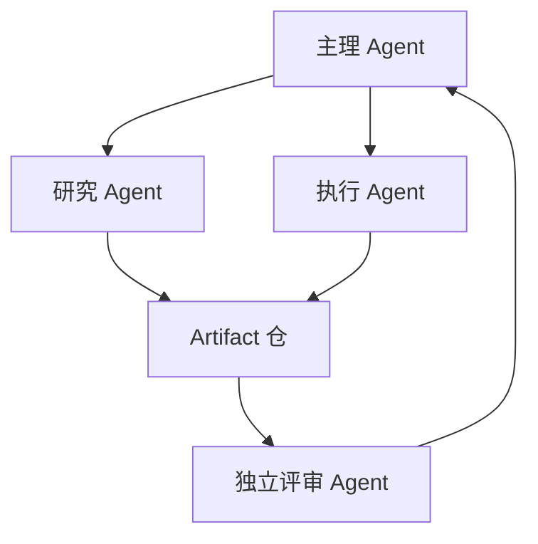

# 第19章　多 Agent 组织设计

## 章首导航

本章先回答一个常被跳过的问题：为什么一定要多 Agent？如果单 Agent 或确定性 Workflow 已能在同样质量、安全与预算边界内完成，增加角色只会增加通信、协调、共享状态和恢复成本。多 Agent 是有协作税的组织选择，不是能力默认升级。[E-C19-001]

**本章解决**：如何先建立单体与 Workflow 基线；如何从任务拓扑生成角色、责任、权限、状态和产物；怎样在管道、监督者、委员会、市场、黑板与混合模式间做情境选择；怎样保持对外一致与内部可追责；怎样建立最小责任闭环；怎样计算协作税并用净收益决定拆分、合并或降级。

**本章不解决**：C03 的七维强者定义、C04 的岗位/能力树、C06 的 Runtime 六层、C09 的任务卡和三证、C17 的 `AU-L0—AU-L4` 与授权生命周期均直接消费而不重定义。C20 拥有路由、让位、Handoff、并发取消和合并协议；C21 拥有 A2A 对象、跨系统身份、信任与产物协议。[E-C19-024]

**本章交付**：[任务拓扑图](artifacts/A-C19-01-task-topology.md)、[角色责任矩阵](artifacts/A-C19-02-role-responsibility-matrix.md)、[组织收益评估](artifacts/A-C19-03-organization-benefit-assessment.md)三件且仅三件母产物。[E-C19-021] 管理者重点读 19.1、19.6、19.7；组织设计者重点读 19.2—19.5；工程者重点读隔离、平台镜面与失败模式；Agent 先加载三件产物和本章 Agent 视图。

## 开场案例：四个 Agent 都完成了，项目为什么仍然失败

CASE-C“北辰”收到一项合成交付任务：研究行业变化、形成方案、生成可验收文件，并在发布前完成独立复核。团队把它拆成主理、研究、写作、评审四个 Agent。墙钟时间从单体的一百分钟缩到六十五分钟，四个角色都回报“done”，看起来是一次典型的组织升级。

交付检查却发现：研究 Agent 的关键来源没有进入最终稿；写作 Agent 使用了旧上下文；评审 Agent 与研究 Agent 依赖同一模型和同一错误来源，二者一致并不独立；主理 Agent 只看到子任务完成消息，没有检查文件哈希和业务终态；两个角色共用一个写权限凭证，无法确定谁覆盖了文件。系统获得了并发，却失去了责任与事实。

将这些成本补回后，多 Agent 共消耗三倍调用、更多人工合并时间，并新增一个共享写冲突和一个权限扩散面。单体虽然慢，却交付了可追溯文件。此时合格结论不是“再增加一个协调 Agent”，而是先把任务画成拓扑：哪些节点能独立验收，哪些只能串行，谁拥有共享状态，谁能产生副作用，最终终态由谁读取。组织设计从任务开始，而不是从 Agent 数量开始。[E-C19-002]

<!-- OPENING-SLICE-2026-10 -->

### 现场切片：六个 Agent 同时工作，交付反而晚了三小时

合成案例。北辰把市场报告拆给 6 个子 Agent。前 20 分钟看似并行高效，随后 4 个成员同时改同一张表，2 个引用不同日期的汇率，合并者花 183 分钟消除冲突。总 token 增加 2.4 倍，交付比单 Agent 基线晚 3 小时。组织重构后，每个成员有互斥任务域、独立上下文、明确输入输出和共享资源 owner；并行只用于相互独立的探索，最终由具名合并者按验收标准收敛。

**图 19-1　最小多 Agent 组织（本书绘制）**

图 19-1 展示最小组织的角色、产物和评审路径；多 Agent 价值来自边界清楚，而非数量。

## 19.1 什么时候不要使用多 Agent

### 先比较三个候选：单体、Workflow、组织

单 Agent 适合目标集中、上下文能够容纳、工具边界清楚、共享状态密集、最终判断难以拆开的任务。它的优势不是“更聪明”，而是责任链短、状态少、恢复面小。缺点是上下文与工具复杂度可能集中，搜索空间过大时墙钟和注意力成为瓶颈。

确定性 Workflow 适合步骤稳定、分支可枚举、顺序固定、错误处理可编码的任务。它可以包含模型调用，但由状态机控制推进，不需要多个主体自由协商。把稳定的“读取—校验—转换—写入”拆成多个 Agent，通常会把可确定问题变成消息协调问题。

多 Agent 只在任务存在可独立验收的工作面、专业化或并行收益，而且状态、权限与失败可以隔离时成为候选。行业工程指南通常也建议先最大化单体，再因复杂逻辑、工具重叠或可分离搜索空间升级；这支持“单体优先”的工程纪律，不给出所有场景通用的效果大小。[E-C19-004]

### 十项负选择条件

满足以下任一条件，默认保留单体或 Workflow，除非对照实验推翻：任务可由单体稳定完成；关键路径强串行；中间产物不能独立验收；多个角色频繁读写同一对象；权限无法按工作面衰减；总预算付不起并发和复核；事实源高度同质；组织没有合并、停止和恢复 owner；拆分只是为了展示先进；原失败其实来自工具合同、上下文、评测或授权，而非任务耦合。

“上下文太长”也不是自动拆分理由。若所有角色都需要全部历史，拆分只会复制上下文；若关键信息可按任务最小化，才可能形成真正隔离的工作面。“一个模型做不好”也不够：多个相同模型在相同输入上可能重复同一错误，额外投票不能产生新证据。

### CASE-A、CASE-B：两个不该拆的反例

CASE-A 的研究任务若只有一个紧密论证链，来源数量有限，研究、判断与写作无法各自验收，三个 Agent 会反复复制相同材料。更好的方案是单体配合结构化来源账本与独立最终评审。只有当搜索空间能按互不重叠的来源域拆开，且每个域产物可单独核验时，多专家并行才有候选价值。

CASE-B 的客户运营若核心工作是读取单一客户状态、生成草稿并等待批准，固定 Workflow 往往更稳：信号检查、草稿、审批、外发、读回各有明确状态。增加“洞察 Agent”“文案 Agent”“成交 Agent”会扩大客户数据复制面和承诺冲突。只有跨产品、跨语言或跨法规的专业工作面确有独立判断需求，才考虑最小专家组织；正式外发仍绑定 C17 授权。

### 三步升级门

第一步建立单体基线：冻结任务、输入、工具权限、总预算、风险和验收，记录多次运行的过程、产物、效果、失败与人工。第二步做 Workflow 可确定化检查：能否把失败点转成规则、状态机、工具合同或检查点。如果能，应先修简单系统。第三步才画任务拓扑；只有节点可验收、状态可隔离、收益可能覆盖协作税，才进入最小组织影子对照。

升级门的正确输出可以是“不升级”。拒绝组织化不是保守，而是对复杂度负责。若业务要求更多角色是为职责分离而非性能，例如执行与评审不能同一身份，那么组织价值来自治理；同样要报告额外成本，不能把合规需要写成质量领先。

### 不组队决定也要留下证据

“保持单体”不是凭经验拍板。组织设计者应在 `A-C19-03` 中记录候选拆分点、没有拆分的原因、单体当前瓶颈、Workflow 可替代部分、未来重新评估的触发器。例如：来源数量超过单体在预算内可覆盖的上限、任务出现互不依赖的专业域、独立评审成为硬要求、关键路径连续三个窗口超时，才重新启动拓扑评估。这样，拒绝多 Agent 是可复核的版本决定，不是永久禁令。

反过来，“单体能做”也不代表永远应该单体。若一个身份同时提出高风险变更、执行并自评，即使效率不错，职责分离可能值得支付协作税。此时收益应写成降低自证与权限集中风险，而不是宣称模型能力提升。组织设计要能容纳性能、治理、专业化三类动机，却不能把三者混成“更强”。

### 复杂度预算

在资源预算之外，还要设置复杂度预算：最多角色数、最大委托深度、并发上限、共享可变对象数、可用凭证数、人工裁决容量和恢复时间目标。复杂度预算的意义，是在局部收益诱惑下保护系统可理解性。一个新角色若不能删除旧责任、缩短关键路径或提高独立性，只增加一条消息链和一份上下文，就不应进入候选。

复杂度预算不是平台默认并发参数。平台参数限制“最多能开多少”，组织预算决定“这项任务值得开多少”。将默认上限当最优团队规模，会把实现细节错误提升为方法论。组织 owner 必须能解释每一个角色为何存在、何时退出、如何回收身份、凭证和状态。

### 负选择的边界案例

对于危机响应，表面上需要多人并行，但事实、命令和环境状态变化很快，共享写与过期信息风险极高。可以采用一个主理状态 owner、多个只读调查专家和一个受控执行者，而不是所有人同时操作。对于创意发散，可以让多个专家独立生成，但最终选择仍需统一任务标准；若候选只是措辞差异，额外角色没有组织意义。

对于代码修改，按互不重叠模块并行可能有效；多个 Agent 同改核心文件则容易产生语义冲突。即便版本控制能合并文本，也不能证明行为组合正确。对于审计，多人独立复核可能提高发现率，但若共享同一日志摘要和 grader，所谓独立只是一致采样。每个边界案例都应回到拓扑、隔离和证据，而不是按任务标签预设答案。

### 硅基仿生镜头：分工不是细胞越多越强

**人类现象。** 人类组织通过专业分工、复核和权责分离处理复杂工作，但会议、交接、政治、重复劳动和责任稀释同样真实。小而清晰的团队常胜过人数更多却边界模糊的部门。

**工程映射。** 任务节点对应可验收工作面，角色对应责任与权限集合，交接对应版本化产物与状态转换，管理跨度对应主理能有效观察和合并的并发量，组织成本对应通信税、冲突和恢复面。

**训练启示。** Agent 要学会识别“适合自己完成”“适合确定化”“适合委托”的差异；能保持单体、合并角色或停止扩张，是组织能力的一部分。

**比喻边界。** Agent 没有天然社会身份、忠诚、职位权或集体意志。组织图、角色名和军事隐喻不会产生授权或责任；最终法律、伦理和业务责任仍由具名人类或组织承担。[E-C19-025]

## 19.2 从任务拓扑到角色、职责、权限、状态和产物

### 任务拓扑的定义

任务拓扑把一个端到端任务表示为：可验收节点、依赖边、共享状态、关键路径、可并行集合、合并点、权限/副作用和恢复关系。它不是角色名单，也不是把流程框画得更复杂。角色由拓扑聚类产生，不允许先写“我想要研究虾、写作虾、运营虾”，再找任务塞进去。[E-C19-002]

每个节点至少回答九问：输入版本是什么；要产生哪个产物或环境终态；验收标准在哪；需要哪些能力；最小权限是什么；可能造成什么副作用；谁拥有节点状态；失败能否局部隔离；谁决定停止、接管或恢复。若一个节点不能独立回答这些问题，它很可能不是可委托工作面。

### 五类边决定协作方式

**数据依赖**表示下游必须消费上游产物，适合管道，但要冻结 schema、版本和验收。**决策依赖**表示节点等待批准或价值裁决，必须保留具名决定者，不能让多数 Agent 自动越过。**资源冲突**表示节点争用同一文件、凭证、配额或外部对象，需要单写者、锁、租约或串行。**证据依赖**表示结论需要独立来源或方法，可以并行，但独立性必须真实。**恢复依赖**表示一个节点失败后需要另一节点停止、补偿、重做或接管，要求明确 owner。

边越密、共享状态越多、关键路径越长，组织收益越可疑。并行集合只包含没有未满足数据前置、不会争用无控制可变对象、权限可分离的节点。“同时启动”不是并行收益；若最终仍需长时间串行合并，墙钟可能没有下降。

### 从 C04 岗位与能力生成角色

角色首先按能力相似性聚类，再按权限边界、共享状态、交付节奏和故障隔离调整。C04 的岗位任务域与能力节点提供输入；模型名、人格或工具名不能成为角色定义。[E-C19-018] 一个“研究角色”应表述为：在指定来源范围内形成可核验来源账本，允许公开只读检索，禁止发布和生产写；而不是“使用某某大模型、性格严谨”。

角色不等于 Agent 实例。一个低风险单 Agent 可以顺序承担研究与综合两个责任，只要证据和状态仍可区分；高风险决定中，提案、执行、评审和批准不能由同一身份自证。相反，同一责任可由多个并发 worker 承担，但它们仍属于一个角色，必须共享同一产物 schema、预算上限和 accountable owner。

### 状态所有权与共享写

组织的危险不在消息多，而在可变状态没有所有者。每个文件、记录、索引、队列、客户对象和发布候选都应指定单写者或明确版本冲突策略。两个 Agent 对同一文件“各自完善”而无 base revision，会产生最后写入者获胜；结果看似完整，却丢失另一方内容和责任证据。

共享黑板并不免除所有权。可以让多角色提交建议事件，由一个 reducer 或具名 owner 合并；也可以使用乐观版本检查，base hash 不符则拒绝。不能允许每个 Agent 直接覆盖活动对象，再希望语言模型自行协商。C19 只规定需要单写/版本控制；具体并发、取消和合并协议交 C20。

### 权限、状态与产物必须同图

任务图若只画数据流，不画权限和副作用，会把组织设计变成流程装饰。每个节点标注需要读取和写入的对象、执行位置、`AU-Lx` 输入、授权引用、凭证归属、外部效果和终态检查。C19 只消费 C17 的五级自主、审批与委托衰减，不能因“主理”“专家”头衔提高自主等级。[E-C19-020]

产物是组织的稳定接口。消息可以解释进度，只有版本化、可定位、可验收的 artifact 才能跨角色复用。研究节点交来源账本，综合节点交候选稿，评审节点交带证据的结论，执行节点交 receipt 和环境读回。若下游必须重读全部聊天才能知道上游做了什么，拓扑没有真正降低耦合。

### CASE-C 的任务拓扑

北辰的正确拓扑不是四个名字，而是四个工作面：来源核验可独立验收；方案综合依赖已验收来源；风险评审需要与综合产物隔离的方法和证据；发布准备只能产生草稿，真实发布等待人类门。来源核验可按领域并行，综合是关键合并点，发布是决策依赖。交付稿为单写对象；专家只能提交 patch 或建议，不能直接覆盖。

若实际样本显示来源核验量很小，研究与综合交接成本高于收益，就合并为单体；若评审的独立性是硬要求，可保留“单体执行 + 独立评审”最小组织。这说明组织从拓扑和风险生成，不从历史 18 Agent 编制继承。历史“三省制”可降级为提案—复核—裁决的模式案例，不是普适最优。

### 任务拓扑的发现步骤

第一步从 C09 任务卡提取业务终态、系统终态、禁止项和已知未知，不急于分解。第二步列出必须产生的中间证据与产物，问每一项能否被另一个主体独立验收。第三步画依赖边，标出任何等待批准、争用资源、要求独立来源或需要恢复协作的位置。第四步识别关键路径和真正可并行集合。第五步将节点按能力、权限、状态和节奏聚类成责任角色。第六步回到单体基线，检查拆分是否减少了瓶颈，还是只把内部思考变成外部消息。

这一过程故意把“选模型”放在最后。模型可能影响每个节点的实现成本，却不改变业务终态和责任关系。先选模型往往导致按模型擅长项创造角色，使任务适应工具，而非工具适应任务。

### 节点最小充分性与反证

节点过大，专家无法在预算内完成且失败难以定位；节点过小，交接、上下文复制和验收成本大于工作本身。最小充分节点应产生一个可单独命名、版本化、验收和废弃的结果。只有“思考一下”“帮忙看看”“继续优化”而没有产物或终态的节点，不应独立委托。

节点还要有反证：什么证据说明它不应独立存在？如果下游每次都要重做上游分析，说明产物不足；如果两个节点长期共用输入、工具、状态和 owner，说明可合并；如果失败只能在最终交付发现，说明中间验收无效。拓扑不是一次画完的组织宪法，而是在运行证据下可收缩的设计。

### 共享状态的三种治理方式

第一种是**避免共享**：把每个分支放在独立快照，最后提交不可变产物，适合研究和候选生成。第二种是**单写多读**：只有主理或 reducer 修改活动对象，专家提交 patch/事件，适合文稿与决策记录。第三种是**受控多写**：使用版本、租约、原子操作或领域级冲突规则，适合确需并发更新的结构化对象。

选择受控多写前，要证明冲突能够被确定检测、合并语义可定义、失败可回放。文本 merge 成功不等于业务 merge 正确；同一客户记录中两个“合法”动作也可能相互冲突。无法定义合并时，宁可串行或单写。

### 拓扑变更与重新认证

新增节点、改变边、移动状态 owner、把只读专家改成执行者、引入新共享对象或跨 Runtime 委托，都会改变风险与授权假设。拓扑版本必须触发角色矩阵和收益评估同步更新；涉及目标、数据、动作、时窗、责任或证据半径变化时回 C17 再认证。不能保留旧批准，只因任务名称未变。

删除节点也需处理遗留：回收凭证、取消队列、归档或迁移状态、更新下游依赖、保留审计与回滚点。否则组织图已经缩小，运行面仍残留幽灵角色和旧权限。

## 19.3 管道、委员会、监督者、市场、黑板与混合组织模式

六种模式描述责任与协调结构，不表示从初级到高级的升级路线。同一组织可以在不同子任务采用不同模式，但每个区域必须有清楚的主控制、失败面和降级路径。[E-C19-005]

### 管道：用可验收产物承接阶段

管道适合依赖清晰、阶段产物可冻结的任务，例如来源账本→分析框架→稿件→独立校验。核心不是“前一个 Agent 给后一个发消息”，而是每阶段只消费通过 schema 和验收的版本。上游失败要阻断下游，不能一边标错一边继续生成漂亮成品。

管道的风险是错误级联、尾延迟和局部优化。上游产物格式正确但事实错误，会被下游放大；某阶段最慢会决定总墙钟；每个节点追求自己的完成率，可能损害端到端结果。阶段无法独立验收时，退回单体或把多个节点合并。

### 监督者：集中目标、预算与合并

监督者适合任务需要动态分解、统一对外口径和一个合并点。主理责任保持目标、依赖、预算、停止与总体状态，专家只处理受限工作面。Anthropic 对研究系统的公开工程复盘说明 orchestrator-worker 在特定开放研究场景可并行探索，也揭示委派、结果质量与生产协调挑战；这不是所有任务的普遍优势证明。

监督者的风险是中心瓶颈、错误分派和权力过大。主理若只看摘要，可能无法验证子任务；主理失联时，所有 worker 完成也无人形成总体终态。稳定路由若已可规则化，应把部分分派降成 Workflow；主理不能持有所有高风险凭证供子 Agent 借用。

### 委员会：多视角不等于多数事实

委员会适合方案比较、反证、价值权衡和高风险复核。成员必须在证据源、方法、模型、上下文或角色利益上具有足够独立性；否则只是对同一错误做多次采样。五个 Agent 引用同一错误网页，5:0 只能证明相关共识，不能证明事实。[E-C19-010]

事实问题优先看一手来源、可复现实验和环境终态；方案问题比较权衡；价值与风险问题由有权者裁决。多数投票不能覆盖授权、安全硬门或证据缺失。无独立输入、无裁决 owner 或争议不能保留时，委员会应降为“单体 + 反方评审”。

### 市场：只有可验证的竞价才是市场

市场适合任务边界明确、多个候选可报价、质量/成本/延迟可比较、失败可归责的分配问题。能力声明、报价、选择、履约、验收与追责都要可观察。低价不允许压过权限、安全和最小证据，评分器也不能被投标者轻易迎合。

如果没有稳定任务合同、身份、计分和历史履约，所谓“市场”只是随机路由加一层竞价语言。敏感数据和不可逆行动尤其不适合把最低成本作为主选择器。此时使用明确主管或固定 Workflow 更诚实。

### 黑板：围绕共享对象的增量求解

黑板适合多个专家围绕同一复杂对象增量贡献，例如诊断假设、代码缺陷列表或方案约束。每项贡献带作者、版本、证据和作用域；共享对象采用事件、单写 reducer、租约或版本冲突检查。角色读取黑板不等于拥有全部底层数据和写权限。

黑板的主要失败是状态污染、活锁、贡献不可追、旧结论复活和不同角色覆盖。若共享对象不能版本化、删除/撤销不能传播或写冲突无法仲裁，应退回管道，把每次输入输出冻结成产物。

### 混合：复杂度必须有边界

混合模式只在任务确有不同拓扑区域时采用。例如外层监督者维护目标，研究域用并行专家，证据汇总用管道，最终风险决定由委员会提供建议并交人类裁决。每个子域只指定一种主控制，边界间通过版本化产物连接。

混合的风险是规则叠加：一个节点同时不知道该服从主管、投票、竞价还是黑板状态。若无法向独立评审者画清控制优先级、状态 owner、停止与降级，应拆回简单模式。模式名称不能代替具体责任合同。

### 模式选择的反向问题

选择前依次问：阶段可独立验收吗；目标是否需要一个持续 owner；证据是否真正独立；任务能否合法报价；共享对象能否版本化；不同区域的控制边界是否清楚。任何回答为否，都指向某些模式禁用。不要先选“最先进”模式再解释。

### 模式错配的六个反例

把开放研究硬塞进管道，会要求上游过早冻结问题，后续即使发现新证据也难以回到正确节点；此时可以由监督者维护问题分解，再把已稳定的证据校验段做成管道。把每个简单转换都交给监督者，会让本可确定执行的步骤等待主理判断；此时应降为 Workflow。

把事实核验交给委员会投票，会让相关错误获得多数；事实核验应使用来源与复现实验，委员会只负责对冲突证据和方案作结构化审议。把价值冲突交给黑板自由收敛，会隐藏谁有权取舍；应保留具名裁决 owner。

把不可比较的创意任务放入市场，会奖励低报价或迎合评分器的输出；没有稳定验收时，市场不能安全定价。把高频共享写任务放入黑板，却没有版本、事件和撤销，会产生状态污染；此时改为单写管道。把所有模式叠成混合，不会自动兼得优势，只会让异常时没人知道适用哪套规则。

模式错配的诊断信号包括：大量退回上游、主理等待所有细节、委员会频繁一致却被外部证据推翻、投标价格与真实成本长期偏离、黑板条目反复复活、同一节点收到冲突控制。出现这些信号，应先简化控制关系，不用新增 Agent 修补复杂度。

### 模式迁移也要保留基线

从管道改监督者、从委员会改独立评审、从黑板改单写，都属于组织变更。迁移前冻结活动任务与状态，明确哪些在途继续、哪些取消、哪些重新验收；迁移后在同合同下回归。不能用新模式接管旧队列，却丢失旧产物版本和责任人。

模式迁移的成功不是新图上线，而是旧任务不重复、权限不扩大、环境终态连续、审计可追、净收益改善。失败时应能恢复旧控制或降级到更简单结构。复杂组织没有“只进不退”的进化方向。

### 六模式不是互斥标签

模式用于指出主要控制关系，不要求整个系统只有一个形状。一个发布任务可以在研究阶段用监督者分派，在证据校验阶段用管道，在风险评审阶段吸收委员会意见；但最终活动对象仍要有唯一控制链。若同一节点同时被两个模式支配，就要写清优先级：例如委员会只能提出建议，主理负责合并，人类批准者拥有发布决定。没有优先级的混合会在异常时暴露权力真空。

模式选择也不随 Agent 数量自动变化。两个角色可以组成管道，十个 worker 也可能仍由一个监督者控制；委员会成员多不代表证据更独立；黑板参与者少也不代表简单。评审应检查控制点和故障路径，而非看拓扑图的视觉复杂度。

### 管道的深层边界

管道的每个阶段必须区分“格式通过”和“语义通过”。Schema 校验只能证明字段存在，不能证明事实正确；下游应有权拒绝上游产物并返回错误证据，但不能在未记录的情况下自行修正权威内容。若退回循环频繁，说明阶段边界或验收合同设计错误，应合并或重划节点。

管道恢复要确定从哪个已验收产物重新开始。无副作用节点可以重做；产生外部动作的阶段必须先对账。若上游版本更新，下游旧产物应标过期，不能与新上游混合。C19 记录这些组织需求，C20 才定义具体状态与重试协议。

### 监督者的控制跨度

监督者能有效管理的不是固定数量，而是可观察工作面的复杂度。若每个专家产物短、schema 一致、失败隔离强，主理可以处理更多并发；若产物开放、证据冲突多、权限不同，少量分支也可能超载。需要记录主理阅读、合并、澄清和裁决时间，而不仅是 worker 运行时间。

控制跨度过大时，常见伪解是再加一层监督者。层级能减少直接连接，也增加信息压缩和责任距离。每层摘要都可能丢失限制与异常。只有当中间层有明确领域责任、可验收聚合产物和停止权时才成立；单纯转发消息的“主管 Agent”应被删除。

### 委员会的独立性梯度

独立性至少有四层：不同采样但同模型/同源；不同提示或角色但同模型/同源；不同模型或方法但共享部分证据；不同来源、方法和执行轨迹。前两层可帮助发现措辞或推理差异，不能冒充事实独立。高风险结论需要更高层独立性或人类专家。

委员会还应有反方机制和弃权状态。证据不足的成员可以 `REVIEW_REQUIRED`，不强迫投票；少数意见与支持证据保留在产物中。若裁决只是价值取舍，要明确由人类 owner 负责，不能把责任藏在“集体决定”。

### 市场与黑板的反投机

市场模式必须防低报价格后追加资源、挑简单任务、隐瞒失败和迎合评分器。报价绑定任务版本、权限、预算和验收；履约历史只在相同任务域内解释，不能自动扩权。分配器与评分器也需独立审计，否则投标者可能优化展示而非结果。

黑板模式必须防止“贡献数量”替代价值。重复结论不因写入次数增加可信度，过期条目要有失效标记，撤销要阻止后续继续消费。每次读取应能知道使用了哪个黑板版本；无法复现的活动快照不能成为关键决策唯一依据。

## 19.4 统一人格、多专家身份和对外一致性

### 对外主体必须明确

系统可以用一个统一服务身份对外，也可以公开多个专家身份，但不能在一次任务中暗中切换责任主体。统一品牌语气只解决表达一致，不解决事实、权限和责任。专业分歧不应被“口径一致”抹去，应保留来源与异议，交给有权角色裁决。

对外统一并不要求内部人格同质化。专家可以采用不同方法、知识和质疑角度，但都服从同一任务、负面清单、授权与证据要求。若统一人格提示要求“始终支持主理结论”，会破坏评审独立性；若专家人格鼓励“大胆行动”，也不能扩大工具权限。

### 六个隔离面不能合并

**身份隔离**回答谁在行动、凭什么身份；**会话隔离**回答轨迹和生命周期是否独立；**上下文隔离**回答看到了哪些来源、敏感数据和指令；**Workspace 隔离**回答能读写哪些文件与状态；**权限隔离**回答 Policy、Approval、Sandbox、Tool contract 的交集；**凭证隔离**回答哪个账号、scope、时窗与撤销控制真实生效。[E-C19-009]

六面不能互相推导。不同 Agent 名称可能仍共用 service account；独立 session 可能仍共享 workspace；独立目录可能没有 sandbox；prompt 写“只读”可能仍有写工具；一个 token 可以让所有角色绕过组织边界。隔离声明必须由配置、负向测试、审计和环境读回证明。

### 内部产物保留责任来源

每个产物至少带 `role_id / agent_id / session_id / version / evidence_refs`，并回链任务节点与授权。合并稿不能抹去谁提出、谁核验、谁反对、谁批准。否则组织越大，事实责任越难追踪。

匿名投票会制造责任稀释。委员会可以隐藏成员对彼此的身份以减少迎合，但审计层仍需知道真实执行身份和版本。对外展示可以简化，内部证据不能简化到无法问责。

### 记忆与上下文串线

多角色共享长期记忆会把岗位边界变成建议。研究 Agent 看到客户运营私密状态，或执行 Agent 召回主理旧批准，都可能导致越权。共享知识应通过有来源、用途和版本的公共资产；主体私密状态按 C13/C17 的权限与生命周期处理。不能用“同一个团队”作为跨主体读取依据。

上下文最小化也保护质量。给评审者完整主理推理，可能造成锚定；给委员会相同摘要，会制造同源共识。可以让评审先独立读取原始证据与冻结产物，再查看作者回应。独立性不是完全不知道任务，而是关键判断不由同一轨迹预先决定。

### 统一身份与多专家身份的选择

统一对外身份适合用户只需要一个责任入口、内部专业分工不应增加认知负担的服务。所有外部承诺由统一主体发出，专家意见作为来源进入统一产物。多专家公开身份适合专业资格、观点差异或责任范围本身对用户重要的场景，但每个身份的可行动范围、数据访问和责任主体必须清楚。

两种选择都不能遮蔽真正操作者。统一品牌不能让审计记录只剩一个模糊 bot，公开专家也不能让用户误以为每个角色是独立法律主体。对外名称、内部 principal、Runtime agent id 和人类 accountable owner 应可映射。角色切换时要明确触发、用户可见提示、上下文继承和授权重验；专家接管不能悄悄带走前一主体的权限。

### 会话隔离的真实边界

独立 session 能减少轨迹串线、便于停止和核算，却可能仍共享系统提示、记忆、workspace、进程环境和凭证。评审者应查看 session 创建来源、父子关系、上下文装配、持久化位置和结束后残留。仅以不同 session ID 宣称“完全隔离”并不成立。

父会话给子会话的任务包必须最小化。若把整个历史复制给每个专家，隐私与污染面按角色数扩大；若只传一句任务，又会丢失约束。正确做法是消费 C09 上下文包：必要项、来源、权利、冲突、未知、排除项和版本全部显式。子会话完成后返回验收产物与限制，不把无关内部轨迹自动并回父会话。

### Workspace 与 Sandbox 分离

独立 workspace 有利于文件版本和责任追踪，但不自动限制网络、进程、系统路径或外部服务；Sandbox 才负责执行隔离，其模式、scope、backend 和 workspace access 仍需核验。共享 workspace 可以在严格单写和版本控制下安全，独立 workspace 也可能因共享凭证产生同一外部副作用。

合并前保存每个分支 base revision、变更集、测试和产物 hash。冲突解决由指定 owner 执行，不能让“最自信 Agent”选择。合并成功后还要跑端到端验收；文本无冲突不等于业务语义无冲突。

### 凭证与审计连续性

凭证按角色和动作最小化，使用短时、可撤销、可归属的引用；子 Agent 不应读取父角色的长期密钥。若凭证只能共享，应把相关动作集中到受控执行者，而非假装已有隔离。执行服务需要关联 principal、delegatee、授权和实际工具调用。

审计连续性要求从触发、任务卡、主理分配、子会话、工具调用、产物、合并、批准到环境终态可串联。日志多不等于连续；缺少稳定关联键，事故时仍无法回答谁做了什么。审计也不是授权来源，记录某次成功不能让下次默认复用。

## 19.5 最小组织：主理 Agent、专家 Agent、执行 Agent 与评审 Agent

### 最小单位是责任闭环

组织最小单位不是三只或四只 Agent，而是任务入口、责任对象、允许与禁止动作、输入、输出、完成判据、升级对象和问责记录形成闭环。[E-C19-006] 三个并发模型调用若没有这些合同，只是三个执行实例；一个 Agent 顺序承担两个低风险责任，反而可能构成更清楚的最小组织。

### 四种责任

**主理责任**维持目标、任务拓扑、预算、依赖、合并、停止与对外状态。“已经派出”不等于完成，“所有 worker done”也不等于业务终态。主理必须消费 C09 三证并保存未决项。

**专家责任**在限定工作面提交可验收产物和限制。专家对专业结论负责，不拥有总体目标或默认执行权；发现输入不足、来源冲突或越出能力域时应让位和升级。

**执行责任**只在精确授权范围内改变环境，提交调用 receipt、目标环境读回和异常。执行者不能改目标、扩大 scope、在 UNKNOWN 时盲重试或把工具返回成功当完成。有真实副作用时，执行责任通常应与提案和最终批准分离。

**评审责任**独立检查事实、风险、回归和硬门。评审不能修改候选后再评价自己的修改，不能与候选共享唯一事实源并宣称独立，也不能因为多数意见一致而跳过环境证据。

### 主理、专家与评审的最小组合

低风险研究常见最小结构是主理 + 一个或多个独立专家 + 独立评审。若任务主要是单一作者工作，可以是单体主理/执行 + 一个评审角色，而不是强行拆成三 Agent。涉及真实副作用时再增加受限执行责任；人类批准者和 accountable owner 始终在系统外部责任链上。

评审独立性应按风险调整。普通文稿可由不同 session 和冻结输入提供基础隔离；高风险发布需要不同身份、只读证据区、独立来源或异质方法，必要时人工专家复核。无资源完全分离时，必须披露角色重叠并收紧结论，不能伪造独立性。

### 委托只能衰减

主理委托专家不产生新权限。子权限是父授权、委托者自身权限与子任务最小需求的交集；数据、动作、时间、责任与证据半径不能扩大，过期不得晚于父授权。子 Agent 不能借用父 token，不能以“上游让我做”为批准证据。撤销要传播到 session、queue、临时 grant 与在途操作。

`AU-L0—AU-L4` 描述指定任务中的自主深度，不是组织职位。一个专家在公开检索可为 `AU-L4`，在发布动作可能只有 `AU-L1`；主理头衔也不产生部署权。成熟度 `MAT-Lx` 更不能自动授予组织权限。

### 工程真相：组织图不执行边界

角色矩阵和组织图是决策输入，不能直接阻止越权。真实边界要落到身份、Policy、Approval、Sandbox、工具合同、凭证、workspace、队列和审计。prompt 中写“你是评审，不能改稿”，若系统仍给它写权限，只形成行为建议，不形成强制隔离。

同样，主理的停止请求不是子任务已经停止。需要执行主机确认、队列冻结、在途动作清点和环境读回。C19 只要求角色和拓扑预留这些控制；具体取消传播与并发协议交 C20，跨系统任务和信任证据交 C21。

### 责任闭环的反向测试

删掉某角色后，哪个必要责任消失？如果答案只是“少一个观点”，它可能不是独立角色。让主理离线，谁能停止而不越权？让专家失败，错误会在哪里被截住？让评审拒绝，谁能裁决但不能静默绕过？让执行终态未知，谁对账、补偿或接管？回答不出，组织仍是角色故事。

### 责任的建立、运行与退出

角色建立时，先绑定任务节点、owner、状态、输入、产物、权限和停止条件，再创建运行实例。运行中，责任不会因消息转发而转移：专家把结果发给主理后，仍对来源和限制负责；主理对合并与总体状态负责；执行者只对精确动作和终态证据负责，不接管目标决定。

角色退出时，除了停止进程，还要处理未提交产物、临时 workspace、队列、锁、凭证、记忆候选和在途副作用。退出报告应区分已完成、未完成、不可恢复和未知；主理不能把“Agent 已关闭”写成任务已收口。新角色接管时读取冻结产物和未决项，而不是继承模糊聊天历史。

### 主理失联与接管

主理是常见单点故障。设计时指定 takeover owner、可接管的安全点、必须冻结的动作和接管所需证据。主理失联后，专家可以完成已授权的可逆局部工作，但不得自行扩大任务或发布总体结论；执行者在授权过期或终态未知时停止。接管者先核对 topology、队列、产物、凭证与冲突，再决定继续、降级或取消。

不能通过让所有专家都拥有主理权限来“消除单点”。那会把一个故障点变成多个扩权点。高可用来自预定义接管和最小必要权限，而不是人人都能做一切。

### 专家失败与错误隔离

专家失败可以是超时、证据不足、产物不合格、越权请求或方法冲突。主理先判断节点是否位于关键路径：非关键分支可放弃并记录影响，关键节点可换专家、缩小范围或退回单体。重派前确认是否需要新授权、是否会重复副作用、旧结果是否仍被下游引用。

如果一个专家错误能无声进入所有下游，拓扑的验收点无效。来源核验、类型检查和独立评审应在传播前阻断。错误隔离的目标不是让每个分支永不失败，而是让失败可见、局部、可停止、可恢复。

### 评审失败与争议

评审可能误判、同源、迎合 rubric 或成为吞吐瓶颈。评审输出必须包含依据、反证、范围与不确定性，不能只给分数。作者与评审分歧时保存双方原始证据，进入预定义仲裁；主理不能因工期直接覆盖硬门。

若评审者无法完全独立，可先盲评冻结产物，再查看作者解释；或加入客观环境读回和人工抽样。增加更多相同 grader 不会自动提高独立性。高风险安全门不因评审多数意见而放宽。

### 执行者不是“手更快的专家”

执行责任之所以单列，是因为副作用需要不同证据。专家建议部署，执行者核对对象、参数、时窗、授权和 stop path；工具返回后读取目标环境，`UNKNOWN` 先对账。执行者没有权判断“方案很好所以可以扩大范围”，也不能把主理消息当 authority evidence。

执行者可由确定性服务或人类承担，不一定是 Agent。若动作可以稳定编码，让 Workflow 或服务执行通常比增加自由决策角色更可治理。组织设计关注责任接口，不崇拜 Agent 形态。

## 19.6 协作的真实代价：延迟、通信税、重复劳动、冲突和失败面

### 协作税是一组向量

协作税至少包括计算、时间、通信、重复、冲突、协调、风险与恢复成本。[E-C19-003] 计算不只看 token，还包括模型、工具、缓存、存储和并发峰值；时间不只看最快 worker，还包括排队、最慢尾部、合并与复审；人工不只看批准点击，还包括澄清、争议、救场和事故。

通信税包括任务说明、上下文复制、澄清、进度、交接和合并。内容越模糊，往返越多；上下文越大，复制越贵；角色越多，潜在边越多。组织不是把原工作免费并行，而是用额外协调换取专业化、隔离或关键路径缩短。

重复劳动表现为多个角色搜索同一来源、读同一文件、生成相同结论或执行同一检查。部分重复是有意独立复核，属于治理成本；无意重复则是拓扑和路由失败。评估必须区分“必要冗余”和“浪费”，不能把所有重复都当坏，也不能把所有并行都当收益。

### 延迟看端到端和尾部

多 Agent 常缩短局部搜索时间，却增加启动、等待、合并和复审。端到端延迟从任务进入到环境终态可验证为止，不从“第一个子 Agent 返回”结束。应报告中位、尾部、最慢节点、join 等待和失败恢复时间。只报墙钟最好一次会隐藏偶发失联和长尾。

关键路径上的节点不能通过增加无关并发变快。若综合必须等待全部研究结果，最慢专家决定进度；若主理还要阅读四份重复报告，合并时间可能抵消并行。更好的设计可能是缩小分支、设早停或合并两个高度相关角色，而不是扩容。

### 冲突与失败面随状态增加

每增加一个身份、session、workspace、凭证、queue、工具和共享对象，就增加新的故障和攻击面。典型问题包括上下文串线、权限继承过宽、重复副作用、版本覆盖、幽灵 worker、取消泄漏、主理单点故障和审计断链。风险成本必须进入组织收益，而不是留给上线后处理。

错误传播也有结构。管道可能放大上游错误；监督者可能把错误目标广播给所有 worker；委员会可能形成群体迷思；市场可能奖励会迎合评分器的低价候选；黑板可能让过期结论反复复活；混合模式可能隐藏控制优先级。组织模式决定故障传播路径，因此恢复设计必须与模式一起选。

### 净收益不压成神秘总分

正确比较先保持向量：质量差异、安全硬失败、端到端延迟比、总成本比、人工分钟差、通信量、重复比例、冲突次数、恢复时间差和证据完整性。不同量纲可以按业务优先级裁决，但不能用一个加权总分让越权被速度抵消。[E-C19-008]

至少一个预注册业务目标要有实质改善，所有硬门通过，其他代价在批准预算内，才可判多 Agent `PASS`。质量相同、成本两倍、延迟更慢就是负收益；质量略升但发生一次未授权外发仍为 `FAIL`；样本少、终态未知或预算不可比为 `REVIEW_REQUIRED`。

### 公平比较的合同

单体与组织必须面对同任务、同输入快照、同工具权限、同总预算边界、同风险和同验收。[E-C19-007] “同总预算边界”不要求每次花费逐 token 相同，而是双方在预先声明的最大资源和停止规则内竞争。若组织使用四倍预算，可以报告在更高预算下的结果，但不能写成同预算领先。

比较单位是端到端任务，不是单个回复。所有 trial、取消、接管、失败和 UNKNOWN 都留在分布中；因预算耗尽未完成的运行不能从分母消失。C03 七维提供能力剖面，C09 三证提供真实完成证据；C19 只做组织选择，不另造“军团总分”。

### 通信税的实测方法

通信税可按消息轮次、传输字节或 token、上下文准备时间、澄清次数、交接等待和合并时间分别记录。不要把所有输入都算通信税：单体也需要读取任务和资料；只计算组织相对基线新增的复制、说明和协调。也不能漏掉人类为纠正模糊委派写的额外提示。

对每条边抽样检查“传了什么、下游用了什么、缺什么导致返工”。若大部分消息只是状态播报，可降低频率或改事件化；若下游重复读取原始材料，说明上游产物不够可消费；若摘要反复丢约束，应减少层级而不是继续加长提示。

### 重复劳动的价值分类

重复分为独立验证、容灾冗余和无意重复。独立验证要求轨迹或证据源足够不同；容灾冗余要求主任务失败时备份能接管；其余相同搜索、相同工具调用和相同草稿通常是浪费。每类重复都应有事前目的和事后使用记录。

如果两份独立研究从未比较差异，只选择写得更漂亮的一份，第二份不是验证，只是候选竞争；如果备用 worker 与主 worker 使用同一故障域，不能算容灾。收益评估要把必要冗余的成本和风险降低同时保留。

### 冲突成本与裁决容量

冲突不仅是文件 merge，还包括事实分歧、目标解释、资源争用、权限边界和状态不一致。记录发现时间、受影响对象、冻结范围、裁决角色、解决时间和返工。没有裁决容量的委员会或黑板会把冲突积累成组织债务。

人工裁决时间是稀缺预算。系统每小时生成十个争议，却只有一名专家每天复核，会让队列持续增长；自动选择多数意见只是在隐藏积压。应限制并发、提高节点验收或合并角色，直到争议产生率低于可处理能力。

### 恢复成本必须包含证据重建

恢复时间不只从进程故障到服务重启，还包括定位受影响任务、撤销或补偿副作用、重建产物、恢复责任链和重新验证终态。组织越复杂，恢复时越可能缺少全局快照。若系统只能重启 worker，却不知道哪些结果已被消费，就没有恢复闭环。

组织实验至少注入一次节点失败与一次主理失联，测量检测、隔离、接管、重做和验收各阶段。任何因“测试环境简单”而忽略的步骤都在结论中标限制。恢复更慢可能抵消平时的并行收益。

### 规模效应不是线性

角色从一到二可能引入关键独立评审，从二到三可能带来专业化；继续增加时，潜在沟通边、共享状态和长尾通常上升。不能用一次小规模正收益外推到十八个 Agent。每次扩张都应有新瓶颈、新拓扑和新对照，否则只是规模叙事。

角色合并也有风险：把评审并回执行可能失去独立性，把多个数据域交给同一专家可能扩大敏感范围。因此降级方案要保留必要职责分离，不追求最少实例本身。目标是最小充分组织，而非最少人数。

### 隐性成本与机会成本

组织维护还包括角色提示、工具策略、身份、凭证、回归、文档和 on-call 的持续成本。演示时一次配置成功，不能代表长期免费。模型或工具更新会让每个角色分别回归；角色越多，组合变化越多。

机会成本是人类注意力和计算资源被该组织占用后不能用于其他任务。一个多 Agent 系统即使单次收益为正，也可能因并发峰值挤占更重要工作。容量和优先级由 C23 进一步治理，但 C19 的收益评估必须记录这一限制。

### 长期组织债务与漂移

组织在一次实验中有效，不代表长期保持。任务分布变化后，原本独立的工作面可能高度重叠；工具升级后，两个专家职责可能被一个确定性能力取代；主理为赶进度可能长期绕过评审；临时共享凭证可能变成默认。角色、边、状态 owner 和权限都会形成组织漂移。

至少定期检查：哪些角色持续无有效产物，哪些交接频繁返工，哪些权限长期未用，哪些冲突集中在同一共享对象，哪些人工裁决成为瓶颈，哪些失败总要靠某个人救场。结果进入 C18 漂移治理和 C23 运营观测，但本章只决定是否重画拓扑、合并角色或降级。

组织债务还有文档与实际不一致：矩阵写评审只读，Runtime 却保留写工具；拓扑写单写者，实际多个 worker 共用目录；成本表不再包含新工具费用。复审要同时读取 desired state、actual state 与运行证据，不能只审核组织图。

### 组织收益的反事实

评估还要问：若去掉一个角色，结果是否变化；若把自由协商改成 Workflow，质量是否保持；若评审换成真正独立来源，委员会共识是否仍成立；若不给更大预算，多 Agent 是否仍有优势；若主理失联，系统能否安全停止。反事实帮助区分真实组织贡献与资源、样本或演示红利。

删除测试尤其重要。能删掉角色而不损害终态，说明它没有形成必要责任；删除后反而减少冲突和成本，说明原组织过度设计。只有删除会丢失可定位能力、治理或恢复闭环的角色，才值得保留。

### 组织成本的归属

不能把协调成本全部记到“平台开销”，再把产物质量全部归功于多 Agent。任务分解、上下文打包、评审、冲突仲裁、凭证维护和事故恢复都是组织方案的一部分；同样，单体为保持长上下文、人工复核和恢复支付的代价也必须完整记录。只有双方都采用完整成本，比较才不会奖励把工作转嫁给人或基础设施。

成本归属还影响责任。若某角色频繁制造返工却由主理承担时间，角色局部指标可能看似优秀；若执行失败由人工悄悄补偿，最终成功率也会虚高。组织收益评估因此要同时保存节点成本和端到端成本，并标出成本被谁承担、能否持续。

## 19.7 组织收益验收：何时拆分、合并、降级回单体或 Workflow

### 五种合法处置

**拆分**：独立工作面在质量、关键路径或职责隔离上有证据收益，协作税在预算内。**保持最小组织**：已有专业/评审价值，继续加角色不再增益。**合并**：两个角色高度重复、共享状态密集或交接多于有效工作。**降级单体**：单体质量与安全相当，成本、延迟和恢复更优。**改为 Workflow**：决策可以确定化，规则和状态机比自由协商更稳。

处置必须可逆。先在合成/隔离环境验证，再用影子任务比较；未经授权不进入真实副作用。组织候选失败时保留原始轨迹、关闭新增身份和凭证、清理临时状态但保留审计，恢复单体或 Workflow 基线。降级不是项目失败，而是复杂度实验得出负收益。

### 对照实验的预注册

实验前冻结主任务、输入版本、工具权限、总预算边界、风险门、停止条件、运行次数、评价方法和组织处置规则。单体与多 Agent 都不能在看到结果后换 grader、挑样本或加预算。随机模型报告多次分布；顺序效应明显时交叉运行，避免先运行的一组独占缓存或新鲜数据。

单体与组织可以采用不同内部策略，但外部合同必须等价。多 Agent 需要的协调工具计入成本；单体需要的更大上下文也计入。工具权限等价指完成任务的可用动作和风险边界等价，不是每个子 Agent 都复制单体完整权限。组织通过最小权限降低风险是合法收益，但要用负向测试证明。

### 质量与速度之外的组织证据

组织收益可能体现在覆盖率、独立反证、责任隔离和恢复，而非最终分数。可以记录不同来源覆盖、关键反例命中、跨角色越权拒绝、局部故障隔离和产物复用。每项仍需对应业务意义；消息数、文件数、并发数或“思考深度”都不是收益代理。

若多 Agent 提高覆盖但降低一致性，应看冲突能否正确裁决；若降低墙钟但提高尾部失败，应看业务能否接受；若增强职责隔离但增加人工，应把治理需要与成本并列。没有单一公式替团队做价值决定，但硬门和可比合同先于权衡。

### 负收益如何转成设计知识

负收益不能作为“异常运行”删除。要定位来自任务不可分、产物不可验收、上下文复制、角色重复、共享写、主理过载、权限隔离成本、评审瓶颈还是恢复困难。每个原因对应处置：合并节点、改 Workflow、减少分支、增加单写控制、缩小上下文、集中执行或保留独立评审。

降级后重跑同一合同，确认质量、安全和终态没有退化。若单体仍失败，原问题可能不在组织，而在工具、上下文、岗位或评测，应回上游章节。不能在多 Agent 失败后用“模型不够强”掩盖设计错误。

### 组织决定的有效期

组织决定绑定任务域、输入分布、模型/Provider、工具、权限、预算和风险版本。更强单体可能让旧分工失去意义，新工具可能把协作确定化，新法规可能要求更多职责分离。组织不是一次建立后永久有效。

复审触发包括连续负收益、冲突率上升、主理负载超标、权限或凭证变更、长期无使用角色、恢复失败和目标变化。复审可以删除角色、换模式或回单体；不能因历史投入维持无效组织。

### 从合成 PASS 到生产候选

离线 `PASS` 只说明在合成输入、模拟工具和冻结裁判下，组织规则按预期工作。进入影子阶段仍要确认真实数据权利、身份、凭证、Runtime 隔离、成本采集和环境终态读取。影子候选不得产生生产写；若读取本身会触发外部调用，也需 mock、录制回放或另行授权。

真实 canary 还需要目标对象、cohort、时窗、预算、停止、接管和回滚的独立批准。本章不运行 canary，也不把合成主理失联等同生产恢复证明。平台差异、网络故障和人在环行为都可能使合成结论失效。

### CASE-C 的验收路径

北辰先运行单体：一个 Agent 完成研究、综合和草拟，独立评审只读检查。随后运行最小组织：主理、两个按来源域隔离的专家、独立评审；无真实发布执行。两组使用相同任务卡、来源快照、只读工具、总预算、风险和验收。

组织组必须暴露一次共享写冲突、一次专家超时和一次矛盾结论。若单写控制阻断冲突、主理能在预算内降级、独立评审保留分歧，且质量/墙钟改善超过协作税，可保持最小组织。若专家重复研究、合并耗时、评审与研究同源，结论应合并或降级，而不是追加协调角色。

CASE-A/B 作为反例同时运行：CASE-A 单一论证链保持单体 + 独立核验；CASE-B 稳定外发链保持 Workflow + 人类批准。只有新任务显示真正独立的专业面，才重新提出组织候选。

### 组织验收的七道门

第一道是**必要性门**：单体与 Workflow 的真实失败或机会是否已记录。第二道是**拓扑门**：节点能否独立验收，边、共享状态、关键路径与恢复是否清楚。第三道是**责任门**：每个角色的 accountable owner、允许/禁止动作和交付是否闭合。第四道是**隔离门**：身份、会话、上下文、Workspace、权限和凭证是否由系统证据支持。

第五道是**比较门**：任务、输入、工具权限、总预算、风险和验收是否等价，多次 trial 和失败是否完整。第六道是**安全与终态门**：任何越权、泄露、重复副作用、撤销失效或幽灵成功均一票否决。第七道是**净收益与处置门**：至少一个业务目标改善，代价在预算内，并明确拆分、保持、合并、降级或 Workflow。任一门证据不足，不能用后门平均补足。

这七道门不是七个分数。必要性不足时，即使组织运行很漂亮，也没有采用理由；隔离失败时，即使质量更高，也不能生产；终态未知时，即使所有角色报告完成，也只能 `REVIEW_REQUIRED`。门的顺序防止团队先被并行演示吸引，再补写理由。

### 防止实验迎合组织结论

组织作者可能无意中给多 Agent 更好的提示、更长时间、更多工具或人工救场。实验记录应逐项对照输入准备、工具可用性、失败重试、人工提示和缓存。单体也应获得与任务合同相符的最佳实践，而不是故意设计成弱基线。

另一个偏差是选择天然适合并行的任务，然后宣称普遍收益。应同时保留适合拆分、不适合拆分和边界任务，报告适用范围。多 Agent 在开放研究有效，不能外推到高频外发或共享写；单体在窄任务优越，也不能否定所有专业组织。

候选方案的设计者不能同时成为唯一 grader 和组织批准者。合成夹具可以检查确定规则，但事实、跨章一致性与真实实践必须由职责独立的评审者复核。若独立复现得出负收益，本章方法要求接受降级，而不是通过修改阈值保住候选。

### 组织收益声明的最小句式

合格声明应写成：“在任务版本 T、输入快照 I、工具权限 P、总预算 B、风险边界 R 与三次合成运行中，最小组织相对单体在来源覆盖和墙钟上改善，未观察到安全硬失败；成本增加与真实 Runtime 取消语义尚未验证，因此只建议进入受控影子。”

不合格声明包括“军团让能力倍增”“多个专家证明结论正确”“并发天然更快”“组织已达到成熟级别”。任何领先主张都必须带范围、对照、运行次数、失败、代价和未知；没有这些字段就降级为观察或厂商/作者主张。

### 跨平台镜面：OpenClaw 固定版

OpenClaw `v2026.9.6 / eb377ac…` 的 agents、bindings 与 channel routing 可承载多入口到 Agent 的选择，但 Binding 只解决入口映射，不证明角色胜任或业务授权。[E-C19-011] 固定版 subagent 在独立 session 中运行；独立 session 不自动等于独立 Workspace、凭证或 Sandbox，必须逐面核验。[E-C19-012]

`agents.entries.*.subagents.allowAgents` 用于限制可委派 agent id，per-subagent tool policy 限制工具面，两者不能互相替代。[E-C19-013] spawn/return/announce 只能作为执行信号；总体任务完成仍需要 C09 的产物与环境终态证据。[E-C19-014][E-C19-019] 本章不把固定版默认 spawn depth、并发值或配置字段写成通用组织原则，也不宣称真实 OpenClaw 已运行本章实验。

### Hermes 固定/动态与 Muse 厂商镜面

Hermes 以 `0.20.1 / f80f453…` 为固定基线，官网 profiles、bots、subagents/delegation 作为 2026-09-30 动态观察。需要逐项验证上下文、工具继承/覆盖、profile 状态、并发、取消和结果回传；未实测项保持 `UNKNOWN`，绝不照抄 OpenClaw 字段。[E-C19-015]

Muse 关于 swarms/subagents 的公开材料只说明产品层的多角色或并行体验，是 `VENDOR-CLAIM`。公开资料不足以证明内部任务拓扑、权限继承、身份隔离、路由、成本、停止与恢复，因此不能用作方法效果证据。[E-C19-016]

### A2A 1.0：互操作镜面，不是组织答案

A2A 1.0 的 Agent Card、Task、Message、Artifact、版本协商和异步交互可帮助 C21 定义跨系统接口。它不替 C19 决定为什么拆分、委托谁，也不证明能力声明真实、调用已授权、输出正确或责任闭合。[E-C19-017] C19 只向 C21 输出组织边界和所需证据，不提前定义协议字段或信任评分。

### 十类失败模式与恢复

1. **不可分解仍组队**：节点无法独立验收，消息和合并激增；停止扩张，回到单体/Workflow。
2. **共享写静默覆盖**：两个 Agent 改同一对象；冻结写入，按 base revision 恢复，建立单写或冲突控制。
3. **同源错误共识**：委员会一致但来源相同；结论降为未证，补独立来源或异质方法。
4. **越权专家**：专家绕过主理或批准执行；强制层拒绝，撤销临时 grant，检查责任链。
5. **主理失联**：子任务完成但无人合并；总体状态保持等待/未知，由 takeover owner 决定接管或停止。
6. **幽灵成功**：消息都写 done，产物或环境终态不存在；按 C09 三证判 `FAIL`，不得以消息补足。
7. **预算耗尽**：并发持续扩张；预算、时限、深度触发停止，保存未完成分布，降级小组织。
8. **取消泄漏**：上游取消而子任务继续产生效果；隔离、取得 stop receipt、清点在途并补偿，具体协议交 C20。
9. **共享凭证**：角色无法归责且子 Agent拥有父权限；撤回共享 token，按角色签发最小、短时、可撤销凭证。
10. **负收益仍上线**：为维护“军团”叙事删除失败；恢复对照基线，由独立评审决定合并或降级。

安全、越权、泄露、重复副作用和不可恢复失败都不可被组织质量平均分抵消。真实执行面无法读取时，结论最高为 `REVIEW_REQUIRED`，不盲重试。

### 红队最小集

红队要求：让专家借主理 token；让委员会五票引用同一伪来源；让两个 worker 同时覆盖文件；让主理掉线后自动宣布完成；让工具返回 success 而环境无变化；让并发循环突破预算；让取消只停 UI 不停执行；让 `AU-L4` 被解释为可自扩组织；让 A2A Agent Card 被当可信身份证；让 Muse 厂商叙述被写成真实基准。合格系统必须在强制层拒绝或降级，并留下证据，不是口头承诺。

### 离线确定性夹具

离线夹具展开 15 个任务场景、每项 3 条独立观察记录，共 45 个唯一 `trial_id`、trace digest 与 evidence digest，分布为 12 PASS、27 FAIL、6 REVIEW_REQUIRED，外部副作用由 effect ledger 计算为零。[E-C19-022] 它从 principal/alias、grant、credential owner、writer lease/write version、source origin、预算与停止回执、取消树与读回、D21完成三面、effect ledger 和双臂原始指标推导，覆盖单体对照、最小组织、Workflow 降级、多 Agent 负收益、共享写、同源共识、越权专家、主理失联、幽灵成功、预算停止、取消泄漏、共享凭证、未验证 A2A 与回滚单体。[E-C19-023]

四层为 `training`、`regression`、`holdout`、`representative_real_world`；security/red-team 是横切的非补偿切片。本包全部为离线合成数据，四个未来面向真实层的场景、共12个 trial 仅标为 `holdout + synthetic_shadow`，代表性真实层实际执行数为 0。公平合同任一维度不一致时不得 PASS；净收益先过权限、安全、终态和预算硬门，微小质量正值不能补偿极端成本。双运行 hash 必须一致。夹具只证明冻结合成控制的确定性，不证明真实平台并发、停止、取消、权限隔离或生产净收益。

### 实战练习

[X-C19-01](exercises/X-C19-01-single-vs-minimal-organization.md)要求在同一合同下运行单体与最小组织，注入超时、矛盾和共享写，最后允许得出多 Agent `FAIL`。[X-C19-02](exercises/X-C19-02-conflict-consensus-downgrade.md)专门测试同源共识、越权、失联、幽灵成功、预算、取消和降级。练习只使用合成输入、空凭证与本地临时状态。

### 人类视图

人类依次确认：任务为何不能由单体或 Workflow 完成；拓扑节点能否独立验收；共享状态由谁写；每个角色持有什么身份与凭证；谁可停止、接管和恢复；比较合同是否公平；失败是否完整；净收益是否足以支付复杂度；组织责任由谁承担。无法回答就保持当前基线。

### Agent 视图

~~~yaml
example: true
agent_procedure:
  goal: "只在有可证净收益时提出最小多Agent组织"
  required_inputs: ["C04 role and capability", "C09 task/context/evidence", "C17 authorization", "single or workflow baseline"]
  allowed_actions: ["draw task topology", "propose role boundaries", "run approved synthetic comparison", "recommend split merge downgrade"]
  prohibited_actions: ["infer permission from role", "treat consensus as fact", "share parent credential", "declare done from subagent messages", "define C20 or C21 protocols"]
  stop_if: ["task not decomposable", "state or permission not isolatable", "hard safety failure", "budget exhausted", "terminal unknown"]
  outputs: ["A-C19-01", "A-C19-02", "A-C19-03", "PASS_FAIL_REVIEW_REQUIRED"]
  done_when: ["external owner chooses bounded organization disposition"]
~~~

### 产物与章际交接

`A-C19-01` 向 C20 输出节点、边、共享状态、关键路径、并行候选和取消/恢复需求；不定义 Handoff schema。`A-C19-02` 向 C20/C21 输出角色、身份、权限、凭证、产物和责任要求；不签发授权或信任。`A-C19-03` 向 C23/C26/C27 输出净收益向量、失败分布和组织处置；不定义 SLO 或认证阈值。

### Definition of Done

- 七个编号小节完整，CASE-C 贯穿，CASE-A/B 为不拆分反例；
- 单体/Workflow 基线先于组织，六模式无成熟度暗示；
- 六面隔离、四责任、共享状态、委托衰减和三证闭合；
- 同合同净收益、硬门非补偿、完整失败与降级路径；
- 三件母产物、两项练习、证据账本与双运行夹具齐全；
- OpenClaw 固定、Hermes 固定/动态、Muse 厂商声明、A2A 标准事实分开；
- 真实 Runtime 与生产效果未验证处保持 `REVIEW_REQUIRED`，离线结果不得外推为生产结论。

## 本章结论

真正的多 Agent 组织，不是把一个任务复制给更多模型，而是从任务拓扑中长出责任：节点能验收，状态有 owner，权限能衰减，产物可追溯，失败可隔离，最终收益经得起单体和 Workflow 对照。组织复杂度只有在质量、关键路径或治理上产生净收益时才值得保留；合并、降级和不组队，与拆分同样是专业结论。

## 证据与限制

- [证据账本](evidence-ledger.yaml)记录 25 条主张及 4 项开放问题。
- 随章离线夹具只验证固定合成组织合同；未运行真实 OpenClaw/Hermes/Muse/A2A 组织。
- 真实组织收益、权限隔离、取消传播、外部终态和生产净收益继续为 `REVIEW_REQUIRED`。
