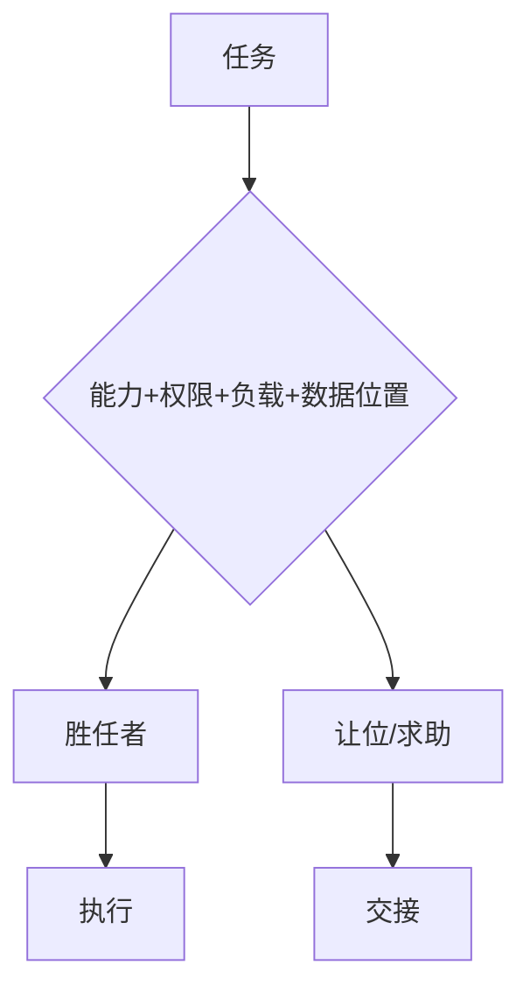
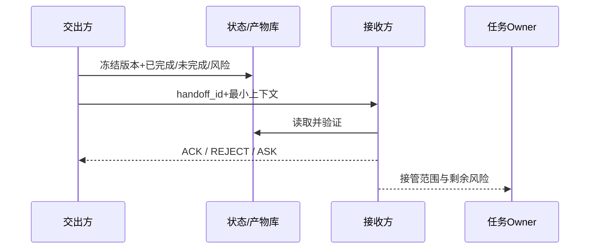
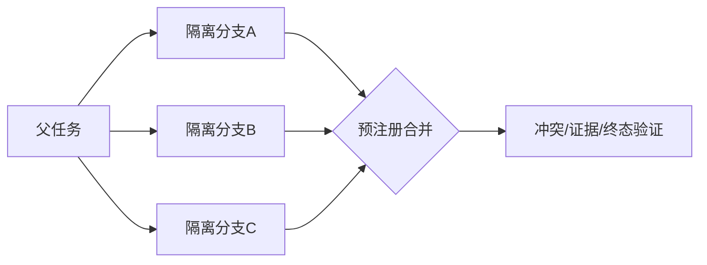

# 第20章　路由、让位、交接与并发

## 章首导航

本章解决多 Agent 系统最容易制造“看似有人在做，实际无人负责”的一段链路：任务到来后，谁有资格接；当前执行者不适合时怎样明确让位；责任怎样从一个主体转移到另一个主体；多个分支怎样并发而不互相覆盖；取消、重复投递、迟到回执和未知终态怎样收口。核心顺序是：**硬门路由 → 明确让位 → 带版本 Handoff → 有界并发 → 终态对账**。顺序不可颠倒。

路由不是“把消息发给一个 Agent”，Handoff 不是“把聊天总结转发一下”，并发也不是“多开几个会话”。这三件事共同管理资格、责任和状态。任一环节只靠自然语言默契，系统就可能在高负载、断网、重复投递或权限变化时暴露无人责任区、双写和幽灵成功。[E-C20-001][E-C20-007][E-C20-013]

**本章解决**：硬门与软排序、Channels/Accounts/Bindings 和任务路由的分层、让位通知、委托与责任转移、三层 ACK、并发准入、单写者/CAS/租约、幂等与 receipt、取消闭合、冲突裁决、死锁/活锁、共享工作区与单一事实源。

**本章不解决**：C06 拥有 Runtime 层次与入口 Binding 定义；C09 拥有任务卡、协作面和交付三证；C14 拥有工具合同和副作用语义；C17 拥有 `AU-L0—AU-L4`、授权与撤销；C19 拥有任务拓扑、角色与组织收益。C21 将定义 A2A 的 Task、Message、Event、Artifact、Agent Card、身份和信任。本章只消费这些输入并拥有“任务执行路由、让位、Handoff、并发取消和合并”的定义权。[E-C20-028]

**受限输入**：C17 与 C19 的离线状态化控制可作为合成合同输入，但真实授权环境、真实多 Agent 组织和生产实践仍为 `REVIEW_REQUIRED`。本章可以消费其字段，不得宣称真实授权或组织收益已经验证；上游合同变化后必须回归路由、owner、cancel 和 Join。[E-C20-030]

**本章交付**：[路由策略](artifacts/A-C20-01-routing-policy.md)、[Handoff 卡](artifacts/A-C20-02-handoff-card.md)、[并发合并协议](artifacts/A-C20-03-concurrency-merge-protocol.md)三件且仅三件母产物。[E-C20-031] 两项练习分别覆盖双并发/重复/冲突/取消/合并，以及失败交接/让位/UNKNOWN/恢复。Agent 渐进加载时，先加载三件产物，再按异常类型读取对应小节；人类管理者先读 20.1、20.3、20.4 与 20.7，工程者重点读 20.5—20.7。

## 开场案例：所有分支都说完成，为什么还不能发布

CASE-C“北辰”项目把一份公开报告拆成写作、事实核验和发布检查三条支线。主理 Agent 为节省时间，让写作者和核验者同时工作，又临时启动一个备用写作者。第一个写作者更新了候选稿 v7，备用写作者晚两分钟写入旧副本，覆盖了 v7 的关键修订；核验者收到取消请求后仍继续写；发布适配器超时，没有返回 receipt；三个会话最终都发来“完成”。

如果主理者把三个“完成”相加，报告就会发布。但真实状态是：共享对象出现双写，取消只被请求而未闭合，发布副作用可能已发生，核验分支使用旧版本，且没有唯一的责任接管记录。这不是模型聪明程度不足，而是路由、交接和并发合同缺失。

合格恢复不是再问一句“你们都完成了吗”。系统先冻结新发布，用权威版本和 CAS 识别覆盖；用原幂等键查询发布系统；把 cancel 拆成请求、接受、停止与终态；核对 Handoff 的精确版本与责任 ACK；最后在 Join 点读取过程、产物和环境三证。若 receipt 仍未知，结论必须是 `REVIEW_REQUIRED`，而不是为了准时交付而猜测成功。[E-C20-017][E-C20-018][E-C20-019]

<!-- OPENING-SLICE-2026-10 -->

### 现场切片：交接消息发出，不等于责任已经转移

合成案例。主 Agent 向专家发送“请继续调查故障”，消息平台显示 delivered。专家上下文没有生产只读权限，也没有收到已排除假设、当前状态和停止条件；45 分钟后它从头排查，并误把旧日志当现状。主 Agent 同时把任务标为 handed_off，无人继续值守。合格 Handoff 要有任务身份、目标、状态、证据、权限、未决项和接收 ACK；在 ACK 与能力核验完成前，原 owner 仍承担责任。

**图 20-1　路由与让位决策（本书绘制）**

图 20-1 说明路由必须同时考虑胜任力和权限；找不到合适执行者时，让位优于伪装胜任。

## 20.1 路由系统：能力、权限、负载、成本、时效和数据位置

### 路由的精确定义

路由是为一个已版本化任务选择**当前有资格且适合承担指定范围**的执行主体，并保留选择、拒绝、让位和重路由证据的过程。它回答两层问题：第一层是“谁可以进入”；第二层才是“合格者中谁更合适”。把两层混在一起，会让一个便宜、快速或自称擅长的候选用软优势抵消权限缺失。

候选可以是单 Agent、Workflow、角色队列、人工岗位或跨系统端点，但候选身份必须稳定。路由对象不是模糊话题，而是 C09 任务卡的精确版本：目标、范围、输入、产物、风险、截止、预算、授权和数据位置必须在路由前冻结。任务版本变化，旧路由决定随即失效；不能让一个针对 v3 的候选继续处理已扩权的 v4。

### 先硬门，后排序

第一阶段逐项检查合法/组织政策、C17 授权、数据驻留、最低能力证据、C14 工具资格、当前 admission/负载与故障域。任一硬门失败，候选退出本轮；没有合格者时输出 `NO_ELIGIBLE`、`DENIED` 或 `REVIEW_REQUIRED`。系统宁可停下，也不把“最不差的人”误称为合格人。[E-C20-001]

能力硬门不接受 Agent 的自我描述。它要求与当前风险、工具族和任务类型相近的评测或历史证据。一个擅长总结的 Agent 不能仅凭“我可以处理”接管法律结论；一个通过低风险退款草稿测试的 Agent 不能据此执行真实退款。证据过期、来源同质或测试被污染，都降低资格而非提高分数。

负载也不是单纯的队列长度。要看在途任务、尾延迟、剩余上下文、工具并发槽、截止时间、恢复成本和共享故障域。CASE-B 中，有退款权限的候选处于过载状态；它并不因“唯一有权”而自动适合立即执行。合法选择可能是排队、缩小范围、转人工或暂停，而不是绕过 admission。

第二阶段只比较合格候选的能力匹配、当前负载、调用与恢复成本、时效、数据接近性和上下文连续性。各维度必须保留原值与理由，不压成无法解释的总分。数据位置在第一阶段是驻留硬门，在第二阶段又可以是“减少合法传输”的优化项；同一名称处于不同逻辑位置，不能混用。[E-C20-002]

### 路由不是一次性决定

任务范围、输入版本、权限、工具、负载、执行位置或故障域变化，都触发重路由。重路由产生新决定，不覆盖旧记录。原执行者先进入安全停点，说明已完成、未完成、活动 run、锁、receipt 和未知项；新候选重新通过硬门。换人不继承旧批准，也不继承过期上下文。

路由失败是一种合格结果。`DENIED` 表示政策或授权明确拒绝；`NO_ELIGIBLE` 表示当前没有满足硬门的候选；`YIELD_REQUIRED` 表示当前执行者应停止越界；`REROUTE_REQUIRED` 表示上下文变化使原决定失效；`REVIEW_REQUIRED` 表示证据不足。它们是运行状态，不另造全书验收语言。

### CASE-A/B/C 的路由判定

CASE-A 法务研究中，来源检索和格式化可以给研究 Agent；法律结论必须让位给有权复核者。硬门阻止“检索能力”偷换成“法律签署权”。CASE-B 退款中，快速候选无执行权限，过载候选暂时不满足 admission，地域受限候选只可在允许位置起草；路由可拆成“起草”与“执行”，但两个范围必须分别授权。CASE-C 中，writer、reviewer 与发布检查者先按任务拓扑筛选；为了冗余而启动的 shadow-writer 若没有独立 namespace 和写入资格，只能观察或生成隔离候选，不能写主对象。

### 路由的反证问题

每次选择都要能回答：如果首选候选失联，哪个硬门最先重新检查？为什么备用者没有被首选？若删掉候选的自我陈述，只看可核验证据，它仍合格吗？若成本翻倍或截止提前，系统改变的是排序还是硬门？若数据位置变更，哪份授权需要重新签？回答不出来，路由仍是偏好而非协议。

### 工程真相

聪明的路由器不能修复错误的任务卡。输入范围模糊、授权引用过期、能力证据不可比时，任何权重都只是在精确计算不确定性。成熟路由系统的价值不是总能找到人，而是能在找不到人时准确停止，并留下后续可重放的资格证据。

### 能力证据的时效、范围与反作弊

路由最常见的错误，是把一次成功当成永久能力。能力证据至少要绑定任务族、风险等级、工具族、环境、版本、时间和失败分布。候选曾在公开网页上查到资料，不代表能处理客户私有数据；曾在沙箱修改文件，不代表能改生产配置；曾在旧 provider 上稳定运行，不代表升级后仍满足延迟。证据过期不是立即判定无能力，而是降低到需要复测的状态。

候选参与生成自己的评测题、修改 grader 或选择只展示成功样本时，证据存在利益冲突。路由器应读取 C07/C08 形成的冻结基线和留出结果，而不是读取候选自报的“完成率”。安全失败不能被平均：一次未授权外发、秘密泄露或重复付款，就足以使相应高风险资格失败。不同候选若在不同预算、权限或工具下测得，也不可直接排名。

能力证据还要区分“可生成候选”与“可承担终态”。Agent 可以高质量撰写建议，但没有权威数据读取能力；可以运行代码，却不能解释业务后果；可以准确发现异常，却不具备批准修复的组织责任。路由策略将这些能力拆成任务节点，避免用一项总能力分数跨越责任边界。

### 公平、饥饿与优先级反转

长期路由不能只追求每次局部最优。若总把任务给历史表现最佳者，它会持续过载，新候选永远没有在安全范围内积累证据的机会；若总优先低成本者，高风险任务会在临界时刻集中失败。系统需要在不降低硬门的前提下，安排影子观察、低风险试做、候选轮换和容量预留。

优先级反转发生在高优任务等待低优任务持有的锁、额度或人工审批时。解决办法不是让高优任务越权抢占，而是记录资源依赖，允许安全继承优先级、缩短低优任务临界区或显式中止可回滚分支。任何抢占都必须保留原任务的安全停点、锁和副作用状态。

截止时间逼近时，路由器可以缩小范围、降低非关键质量、转人工或宣布无法按期完成，但不能把权限、数据位置和安全硬门降为软项。一个系统在压力下仍保持停止能力，才具备真实可靠性。

### 路由决定的审计最小集

审计不只保存“选了谁”，还要保存被淘汰者与原因。否则无法区分合理选择与事后合理化。最小记录包含任务/输入版本、候选快照、逐硬门结果、软维度原值、主备目标、有效期、决策者、变更触发器和引用证据。隐私敏感能力证据可保存摘要与受控引用，不应把完整员工或用户资料复制进路由日志。

当效果不佳时，复盘首先判断是资格判断错误、软排序错误、输入变化、执行失败，还是环境结果不可见。只有归因到正确层，才能决定改路由策略、补能力证据、调容量或修工具。把一切失败都归为“模型不够强”，只会让系统反复更换候选而不修责任链。

## 20.2 Channels、Accounts、Bindings 与 Agent 路由的关系

### 五层入口链

消息进入系统通常经过 Channel、Account、Pairing/准入、Binding、会话或入口 Agent，然后才形成任务。Channel 回答从哪里来；Account 回答以哪个连接身份接收；Pairing 或准入回答对端是否被允许进入；Binding 回答哪个预设 Agent/会话接住这类入口；任务路由回答谁执行当前任务；C17 授权回答谁可对哪个对象做什么动作。五层任何两层都不能自动推出下一层。[E-C20-003]

Binding 命中最容易被误读。它只说明符合配置的入口消息被分配给某个 Agent 或会话，不证明这个 Agent 对消息里的任务具备能力、工具、数据位置或业务权限。客服入口 Agent 接到退款请求，不等于它能退款；财务频道里的消息来自高管，也不等于形成对象、动作、范围、参数、时窗和批准者都可核验的授权。

### 从入口到执行的最短链

第一步，C06 按 Channel/Account/Pairing/Binding 建立入口与隔离；第二步，C09 把自然语言请求编译成任务卡和协作面；第三步，本章对任务范围做执行路由；第四步，C17 对候选的具体动作重新核验授权；第五步，C14 对真实工具调用检查合同、副作用和审批；第六步，本章监控让位、交接、并发和终态。任何一步只看到上一步的引用，而不盲信自然语言摘要。

这一顺序也说明“路由到正确 Agent”不等于“调用正确工具”。路由决定承担任务的主体，工具合同决定特定动作是否可执行。主体可能合格但工具凭证过期；工具连接可能可用但主体没有业务授权。失败必须落在正确责任域，不能把 provider 超时诊断为能力不足，也不能把授权拒绝改成换 Agent 重试。

### 会话连续性与错误连续性

复用既有会话有上下文连续性的好处，也可能把旧授权、旧任务版本、未经验证的记忆和历史错误带入新任务。路由器应把“合法、最新且与任务相关的上下文”视为软优势，把“陈旧、来源不明或越域上下文”视为负证据。更熟悉不一定更合格。

账户和会话还决定故障域。两个表面独立的 reviewer 若共用同一 provider、同一上下文摘要和同一错误来源，路由上的“冗余”没有提供独立性。关键安全审查应避免与被审查者共享唯一故障域；这不是要求全面异构，而是要求知道共因在哪里。

### 固定实现镜面：OpenClaw

在本书固定的 OpenClaw v2026.9.6 / `eb377ac...` 中，Bindings 提供入口路由事实；这是一项实现能力，不是任务适配或业务授权证明。[E-C20-023] 固定文档还区分会话、子任务和完成状态：spawn 被接受只说明工作已获准启动，不能证明完成；wait 超时说明等待窗口结束，不证明 run 已停止。[E-C20-024]

OpenClaw 的并行 specialist lanes 暴露容量、会话锁和所有权歧义等工程现实。它能承载本章策略，但本章不能反向声称平台已为所有业务对象实现原子 owner 转移或跨系统 exactly-once。配置 Binding、开并发槽和获取“accepted”之后，仍要执行本章的资格、责任和终态检查。

### Hermes 与 Muse 镜面

Hermes 0.20.1 固定实现中的 delegation 使用隔离子会话并返回最终摘要，工具继承可收窄；隔离有助于减少上下文串线，却不能让摘要自动成为父任务完成证据。[E-C20-026] 看板或队列的 assignee 是实现中的分配字段，不是通用责任 Handoff。动态文档单独登记，升级后要回归状态名、取消、持久性和恢复语义。

Muse 只作为公开厂商体验镜面。公开材料可以说明用户体验或厂商声明，不能据此推断内部路由权重、Handoff、取消、owner、锁或合并机制。[E-C20-029] “体验上连续”不等于“工程上责任连续”。

### 迁移检查

从 OpenClaw 迁移到 Hermes，或从本地 Agent 迁移到 A2A 端点时，不迁移平台名，迁移语义：入口准入、任务版本、硬门资格、授权引用、owner、Handoff 版本、ACK、取消、receipt、Join 和未知态。目标平台缺少某个原语时，用外部账本或人工门补齐；不能把字段删掉后声称等价。

### 入口欺骗与跨租户串线

Channel 身份、显示名和消息内容可能彼此矛盾。攻击者可以在普通频道自称“CEO”、引用旧批准、伪造转发头或诱导 Agent 把外部内容当系统指令。入口层应保留真实 account、tenant、channel、sender 和 pairing 证据；任务编译层把内容当不可信输入；授权层只认权威批准记录。显示名与高层语气不产生授权。

跨租户系统还要防止 Binding 配置过宽。若两个客户共享入口 Agent，会话、workspace 或缓存，路由前必须重新绑定 tenant 与数据位置，阻止一方上下文进入另一方任务。仅靠提示词写“不要泄露”不足以建立隔离。账号、会话、上下文、workspace、权限和凭证各有边界；其中任一共享，都要明确为什么安全、由谁审计、怎样撤销。

### 入口重放与消息顺序

渠道通常不能保证严格一次或严格顺序。网络恢复后，旧消息可能重放；同一用户在两个入口重复提交；编辑后的请求可能晚于原请求到达。任务编译器需要稳定 request id、来源时间、接收时间、编辑/撤回版本和去重窗口。重复入口可以映射同一任务，但不得自动重复业务动作。

若撤回消息先被处理、原消息后迟到，系统以权威任务版本拒绝旧输入。若两个不同入口形成语义相同但 id 不同的请求，应由业务去重规则或人工确认合并，不能让语言相似度直接决定副作用等价。对于资金、外发和身份操作，模糊重复一律保持停止。

### 会话与任务的多对多关系

一个会话可以承载多个任务，一个任务也可能跨多个会话；因此会话 id 不能充当任务 id。会话结束不代表任务结束，任务转移也不要求复制整个会话。最小上下文包只携带与当前任务有关、来源可追踪、授权允许的信息，避免把历史对话中的旧秘密与旧目标带到新主体。

入口 Agent 若同时承担问答与执行，应先分流：即时低风险回答可在会话内完成；需要工具、副作用、跨角色或长时运行的请求建立任务卡。这个门可以减少“用户随口一问却启动长时动作”的误触发，并让后续 Handoff 拥有稳定对象。

## 20.3 响应让渡协议：不抢答、不越界、不伪装胜任

### 让位是一个显式动作

让位发生在执行者识别出能力、权限、负载、截止、责任、冲突或风险边界后，主动停止不适合自己的部分，报告当前状态并请求重新路由。它不是谦辞，也不是把难题推走。一个合格让位必须让系统知道：为什么停、停在哪里、做过什么、没做什么、有没有副作用、谁可能适合、若没人接该怎么办。[E-C20-005]

最小让位通知包含 notice id、任务和版本、当前执行者、原因码、证据、已完成/未完成、过程/产物/环境状态、安全停点、建议目标及资格证据、下一步、回应时限、回退和升级。建议目标只是一项候选，不是责任转移；目标仍要过硬门。

### 沉默不等于让位

沉默、超时、离线、会话退出、`NO_REPLY` 或等待工具返回，都不构成让位。[E-C20-004] 系统不能用“它没说话”推断它放弃责任，因为沉默可能来自断网、崩溃、队列拥堵、provider 故障或恶意规避。没有显式让位通知时，owner 不自动改变；sentinel 应按失联策略冻结新副作用、读取活动 run，并升级到明确接管流程。

让位也不能只写“超出能力范围”。如果执行者已经创建文件、申请锁、触发外部动作或拿到 receipt，就必须列出。部分完成若被隐藏，新目标可能重复执行；未知副作用若被省略，新目标会用新幂等键制造第二次业务结果。

### 不抢答

“不抢答”不是等待更久，而是判断是否存在更权威或更合格的 owner。法务结论、资金、身份、生产变更和破坏性操作，即使模型能生成流畅答案，也应把事实研究、候选方案和最终批准分开。执行者可以在授权范围内准备材料，但不得用“先帮你做了”绕过签核。

在多 Agent 对话里，多个角色可能同时响应同一任务。主理者应先指定响应 owner 或收集窗口：只有 owner 对外形成统一答复；其他角色提供带来源的内部候选。若大家都直接对用户发言，冲突会从内部可裁决差异变成外部承诺。

### 不越界

越界不仅是工具权限越界，也包括角色范围、数据位置、时间、成本、责任和证据边界。研究 Agent 可以汇总证据，不可把推断伪装成已批准结论；reviewer 可以拒绝质量门，不可擅自发布；执行 Agent 可以按合同调用工具，不可自行扩大对象和参数。

当边界变化时，让位通知必须写出变化本身。例如“任务由内部草稿升级为公开发布”“金额从一百增至一万”“数据从公开资料变成客户隐私”。把变化写成新任务版本，让新候选重新过授权，而不是口头提醒继续做。

### 不伪装胜任

伪装胜任有三种形式：Agent 明示自己会做却无证据；路由器因没有其他候选而降低标准；人类看到流畅输出后默认能力成立。防护不是要求 Agent 自称“不知道”，而是要求能力证据可核验：最近版本、相近风险、相近工具、失败分布和已知边界。

当证据不足，合法输出是“我能完成研究草稿，但不能承担法律结论”“我能生成退款指令候选，但缺少执行授权”“我能在隔离 workspace 生成补丁，但未验证生产发布”。这种范围化表达比笼统拒绝更有用，也为重路由保留可消费产物。

### 委托不是责任转移

委托把有界子任务交给另一个主体，父 owner 仍承担协调、验证和整体终态；责任转移则改变当前 owner，必须走 Handoff 和 ACK。子 Agent 返回摘要，只说明它声称完成子任务，不自动证明父任务完成，更不自动转移外部责任。[E-C20-006]

这一差别决定失败恢复。委托子任务失联，父 owner 仍要停止、重试、替换或升级；责任已正式转移，则新 owner 按卡片负责，旧 owner 不再并行发号施令。把两者混用会产生双负责人或无人负责。

### 让位循环与止损

Agent A 因负载让给 B，B 因权限让给 C，C 因数据位置又让回 A，是活锁而非协作。让位通知必须被路由器消费，累计原因、次数和进度。达到预设上限后停止自动重路由，由唯一仲裁者拆分任务、改变约束或宣布无合格候选。反复发送礼貌消息不算进展。

### 让位的粒度

让位不必总是整项任务。当前执行者可以保留有资格的研究部分，把需要授权的执行部分让出；可以保留本地数据整理，把跨地域传输部分停止；可以交出最终判断，同时继续准备证据。粒度必须与任务拓扑节点对应，不能用模糊的“后半段”定义范围。

部分让位要求写明边界处的输入/输出合同。来源方交付什么版本、目标方从何时开始负责、边界前后的错误如何归属、若目标拒绝谁继续持有整体协调责任，都要可回答。否则部分让位只是把一项混乱任务切成两项混乱任务。

### 让位与服务体验

正确让位不应让用户承担内部组织复杂度。对外表达可以是：“我已完成可验证的资料整理；最终法律判断需要授权复核，预计在某时间点更新。在此之前不会执行外部动作。”这同时说明进度、边界、下一步和安全承诺，而不是把内部 Agent 名单抛给用户。

如果没有合格目标，系统应清楚说明阻塞与可选方案：缩小范围、补批准、换数据位置、延长期限或转人工。伪装胜任虽然短期显得顺畅，长期会把不可控风险转给用户。好的体验来自可预测和诚实边界，不来自任何问题都立即回答。

### 让位后的最小保管义务

发出让位通知后，当前 owner 仍要保管活动状态，直到责任转移完成。它不得清理临时文件、释放仍需保护的锁、撤销目标需要读取的对象或停止必要 sentinel；也不得继续越界执行。这个阶段可称为“安全保管”：允许观察、整理、冻结和回应目标问题，不允许新增未授权副作用。

若让位原因是安全事件，保管义务还包括证据封存、凭证撤销请求和传播面记录。若原因是负载，当前 owner 也不能一边声称过载，一边接受更多同类任务。让位事件应反馈到 admission，使路由器停止继续把任务送回同一拥塞点。

**图 20-2　Handoff 时序（本书绘制）**

图 20-2 规定交出、冻结、读取、确认和责任接管的顺序；没有 ACK 的发送不等于交接完成。

## 20.4 Handoff：已完成、未完成、证据、风险、阻塞和下一步

### Handoff 是责任协议

Handoff 把一个版本化任务的全部或部分责任，从当前 owner 交给候选目标。它至少要回答：交什么、为何交、谁交给谁、哪一版、已经完成什么、仍缺什么、证据在哪里、有哪些风险/阻塞/未知、活动执行和锁是什么、下一步是什么、授权如何复核、何时生效、谁确认接管。

聊天摘要只能作为解释层，不能承担协议层。摘要容易遗漏版本、范围、锁、receipt 和失败；目标 Agent 也可能把自然语言“你接着做”误解为授权。Handoff 卡必须是可校验对象，关联任务卡、拓扑、产物 digest、owner 记录和授权引用。[E-C20-007]

### 已完成与未完成必须可证伪

“已完成”只列有三证支持的动作：过程证据表明执行发生，产物证据表明对象存在且版本正确，环境证据表明业务或系统终态符合预期。缺任一层，标成 `claimed`、`partial` 或 `UNKNOWN`。例如代码提交存在但生产未部署，是产物完成、环境未完成；退款请求发出但 receipt 丢失，是过程发生、业务终态未知。

“未完成”还应分为未开始、进行中、阻塞、失败、取消中和未知。不同类别决定不同恢复动作。进行中可能需要取消或等待；阻塞需要移除前置；失败需要更换方案；未知需要对账。全部写成 todo，会让目标错误重放。

### 三层 ACK

Transport ACK 证明载荷进入传输端点；Object ACK 证明目标读取并核对精确 handoff id/version/digest/schema 和引用对象；Responsibility ACK 证明目标在本地政策与授权复核后，接受指定范围、责任和生效时点。三者证明不同事实，绝不互换。[E-C20-008]

HTTP 2xx、消息已读或队列 accepted 通常只接近 Transport ACK。目标下载了文件并验证哈希，只到 Object ACK。只有目标明确接受责任，并且权威 owner 状态以 CAS 原子更新，责任才转移。[E-C20-009] 这样可以避免目标说“我收到了资料”，来源方却误以为“它已经负责”。

### 版本与陈旧 ACK

每次修订 Handoff 卡都递增 handoff version。Responsibility ACK 必须绑定 handoff id、handoff version、task version 和 scope digest。新版本产生后，旧版 ACK 即使迟到也只能记录为 `STALE`，不能改变 owner。[E-C20-011]

CASE-B 中，目标先收到 v3“起草退款建议”，随后任务变为 v4“执行退款”。对 v3 的 ACK 不能授权 v4。若目标只同意起草，系统可以 `ACCEPTED_WITH_CONDITIONS`，保留原 owner 对执行部分的责任；不能把部分接受扩张成全部接管。

### 避免责任无人区和双 owner

在 `ACK_PENDING`、只有 Transport/Object ACK 或 owner 更新 UNKNOWN 时，原 owner 继续负责，或进入显式共同监护并标 `REVIEW_REQUIRED`；不得先释放再等待接管。[E-C20-010] 正常两阶段过程是：旧 owner 提议；目标验证；目标对精确版本 ACK；决策 owner 原子写入权威 owner；旧 owner观察到成功后释放写权。

若两个目标都 ACK，不能让最后到达者获胜。决策 owner 比对预定目标、版本、生效时间和 CAS expected_version；只有唯一匹配者接管，其余 ACK 记冲突并撤销。若权威写结果未知，两个目标都不得继续副作用，直到读取真实 owner。

### 证据、秘密和授权

Handoff 传递对象引用、版本、digest、授权引用和再验证要求，不复制 token、cookie、密码、私钥或可重放批准。[E-C20-012] 目标在自己的执行边界内向权威服务换取最小权限。这样，即使卡片泄露，也不会直接泄露长期凭证。

来源方的“权限还有效”只是主张。目标要重查对象、动作、范围、参数、时窗、批准者和撤销状态。任务、owner、位置或参数变化都可能触发 C17 再认证。Handoff 不继承自主等级；更换 Agent 更不能把旧主体的凭证当作团队公共资产。

### 活动 run、队列、锁和副作用

交接前必须枚举 active runs、子任务、队列、锁、租约、fencing token、外部 action/attempt、idempotency key、receipt 和补偿责任。`wait timeout` 不是 run stop，队列条目消失也不证明副作用未发生。目标不知道这些状态时，只能观察和对账，不能盲目重启。

取消要记录请求、接受、停止中和终态。旧 owner 发出 cancel 后，不得马上把“已取消”写进卡片；如果 worker 在 cancel 到达前完成，应记 `COMPLETED_BEFORE_CANCEL`，再核对其产物是否允许进入 Join。

### CASE-A 的部分 Handoff

CASE-A 研究 Agent 已完成来源搜集和引文定位，但法律结论需要授权复核者。Handoff 范围只包括结论与风险定级，不转移原始采集责任；卡片列出来源 digest、尚未验证的冲突、引用限制和下一步。复核者 Object ACK 文件，Responsibility ACK 结论范围，权威 owner 只更新该节点。部分 Handoff 通过范围和拓扑保持清晰，避免“整项任务都转走”。

### Handoff 失败后的恢复

目标拒绝、超时或失联时，原 owner 根据卡片保留的安全停点选择新候选；旧目标如果迟到 ACK，版本门会拒绝。卡片泄露 canary secret 时立即判 `FAIL`，撤销相关凭证并追踪传播面。owner 写入 UNKNOWN 时冻结所有可产生副作用的参与者，只允许只读查询，直到权威 owner 唯一。

### Handoff 的事务边界

跨系统 Handoff 无法依赖单数据库事务包住所有动作，因此要用可恢复的阶段协议。`PROPOSED` 阶段只写候选，不改变责任；`ACK_PENDING` 阶段目标验证对象、权限和容量；`ACCEPTED` 表示目标作出承诺，但仍等待权威 owner 更新；`ACTIVE` 表示责任事实已生效；`CLOSED` 表示旧 owner 的释放与遗留状态完成。每一步都幂等，重复消息返回同一阶段而不是推进第二次。

如果在目标 ACK 后、owner 更新前协调器崩溃，恢复者读取目标 ACK 与权威 owner：owner 未变则继续原子更新或撤销提议；owner 已变则完成旧 owner 释放。不能仅凭消息时间猜测。若 owner 更新成功但旧 owner 未收到通知，fencing token 或写权限版本应阻止旧 owner继续写。

### 条件接受与范围收缩

目标可能只接受更小范围、更短时窗或只读模式。条件接受必须形成新卡片版本，由原 owner确认，不可在同一版本的备注中悄悄改变合同。CASE-A 复核者可以接受“对来源充分性作意见”，拒绝“代表组织作法律承诺”；CASE-B 目标可以接受“生成退款候选”，拒绝“执行资金动作”。

范围收缩后重新计算未完成项、owner 和下一步。被排除部分仍由原 owner持有或重新路由。条件接受不是讨价还价式聊天，而是精确的合同版本变更。

### Takeover 与灾难恢复

原 owner崩溃时无法主动发卡，但系统仍不能让新目标凭口头命令接管。恢复协调者从任务账本、活动 run、锁/租约、产物仓、receipt 与环境状态构造 `TAKEOVER_RECOVERY` 卡，标明哪些字段来自权威事实、哪些是推断或 UNKNOWN。候选目标按相同硬门和 ACK 接管。

灾难恢复的第一目标是阻止双写，不是最快恢复产出。先使旧 generation 失效、冻结不可逆动作、确认权威 owner，再恢复必要工作。若无法确认旧 worker 是否仍能写，保持隔离并升级，不以“它大概已经掉线”作为依据。

### Handoff 的隐私最小化

交接常诱发“把所有上下文打包给下一个 Agent”。正确做法是按任务范围选择必要信息，删除无关个人数据，用引用代替复制，并让目标在自己的权限边界内读取。卡片需要证明信息足够，但不需要成为新的数据湖。

目标完成后，根据保留策略撤销临时访问和缓存；旧 owner也清理不再需要的副本。审计保存的是对象、版本、访问决定与 digest，而不是无限期保存敏感正文。

**图 20-3　并发分支与合并点（本书绘制）**

图 20-3 展示并行必须有隔离工作区、统一 Schema 和显式合并点；共享写入未经控制会扩大失败面。

## 20.5 并发边界：独立子任务、共享状态、写入冲突和合并点

### 并发不是默认加速

并发的收益来自独立工作重叠，代价来自状态、协调、冲突和恢复。只有输入可冻结、输出可独立验收、共享资源受控、副作用可分离或幂等、取消可观察、合并点已定义、失败可局部化、每个分支有 owner/预算/终态时，才允许并发。[E-C20-013]

不能满足时，应串行化、用确定性 Workflow，或回到单体。多个分支都编辑同一段文本、共享同一未版本化浏览器会话、争用同一额度或共同决定一个不可逆动作，通常不适合直接并发。先拆对象和权限，再谈并行。

### 分支合同

每个分支记录 branch id、目标、冻结输入 digest、依赖、输出 namespace、owner、工具/权限、预算、截止、取消传播、终态和证据。输入变化不得静默刷新；要么所有分支升级同一快照，要么旧分支结果隔离并重新评估。不同任务版本的输出不能在无说明下合并。

分支“独立”不是语义上话题不同，而是失败和写入能够局部化。研究与排版看似不同，但若共享同一会话可变状态或同一文件写者，仍不独立。反过来，两个研究分支若各用只读输入和独立产物，可以并发，最后由唯一合并者处理分歧。

### 单写者、CAS 与租约

不可变快照允许多读，分支产物写入独立 namespace。共享可变对象按对象或分区指定单写者；“单写者”不是整个系统只能有一个 Agent，而是一个权威对象在一个版本窗口内只能有一个合法提交者。[E-C20-014]

CAS 要求提交者声明 `expected_version`。如果当前版本不同，写入失败，提交者必须读取新版本、分类冲突并重新生成候选，不能覆盖。租约用于有限时长所有权，至少包含 resource、owner、generation、expires_at、renewal 和 fencing token。旧 worker 即使网络恢复，只要 generation 过期，其写入也必须被拒绝。

单纯文件锁不够：进程崩溃可能遗留锁，跨系统副作用不受文件锁保护。锁/租约解决“谁现在可写”，CAS解决“我基于哪一版写”，幂等解决“同一动作重复投递”，receipt/read-back解决“动作到底发生没有”。四者互补。

### Action、Attempt、幂等键与 receipt

逻辑业务动作拥有稳定 action id 与 idempotency key；每一次网络或工具调用拥有新的 attempt id。重试同一逻辑动作必须复用原键，不能因超时创建新键。[E-C20-015] 服务端若支持幂等，应返回同一业务结果或明确冲突；客户端仍要记录请求摘要、对象、参数、授权和时间窗，避免键被错误复用到另一动作。

跨系统按至少一次和可能重复设计，不宣称全局 exactly-once。[E-C20-016] 即使某个队列承诺 exactly-once delivery，也不能证明下游数据库、邮件、支付或人工动作只发生一次。端到端安全来自稳定业务键、去重、权威终态查询和补偿，而非一条营销式保证。

receipt 是一次尝试的回执，不总等于业务终态。HTTP 2xx 可能只说明请求被接收；消息平台 delivered 不说明收件人已采取行动；工具输出 success 也可能与环境状态不一致。合并者需要过程、产物与环境三证。

### UNKNOWN 的对账

当超时、连接中断或 receipt 丢失，第一动作是冻结同一逻辑副作用的新 attempt。然后用原 idempotency key、业务对象、时间窗和请求摘要查询权威系统；对比调用日志、产物和环境；得到 `COMMITTED`、`NOT_COMMITTED` 或 `STILL_UNKNOWN`。只有 `NOT_COMMITTED` 且授权仍有效时才允许重试；`STILL_UNKNOWN` 映射 `REVIEW_REQUIRED`。[E-C20-017]

未知不是错误的别名。把 UNKNOWN 直接当失败会重复副作用，把它当成功会制造幽灵成功。它要求更强的观察，而不是更强的乐观。

### 取消是请求

取消生命周期至少区分 `REQUESTED / ACCEPTED / STOPPING / CANCELLED / COMPLETED_BEFORE_CANCEL / FAILED_TO_CANCEL / UNKNOWN`。取消不等于回滚，也不证明子任务、工具调用和外部效果都停止。[E-C20-018]

父任务取消时，系统根据预注册策略向子分支传播；每个分支回报终态、锁释放、临时产物和残余副作用。某个 worker 在取消后继续写，属于安全失败而非普通迟到。合并器不能仅因 worker 从列表消失就认定取消成功。

### Join 是一道门

Join 不只是“等所有 Promise”。它验证必需分支终态、非必需分支处置、取消闭合、输入与产物版本、writer 唯一、重复去重、receipt/read-back、授权和三证。[E-C20-019] 一个分支缺失时，只有预注册规则明确允许降级且风险门通过，才可生成部分结果；否则 `FAIL` 或 `REVIEW_REQUIRED`。

CASE-C 的 Join 必须拒绝以下情况：shadow-writer 覆盖主版本；reviewer cancel 未闭合；发布 receipt 未知；writer 与 reviewer 使用不同任务版本；完成通知重复；最终文件 digest 与声明不一致。所有 Agent 都说 done 不能补偿任一硬失败。

### 硅基仿生镜头：神经路由、突触传递与止血

**人类现象。** 人体不会让每个细胞直接调度所有动作：感知、神经门控、局部回路、肌群协同和止血反馈分别承担选择、传递、执行与损伤控制。动作完成后仍要由感觉反馈确认真实结果。

**工程映射。** 路由像选择反射弧和运动单元；Handoff 像信号从一个控制回路转入另一个回路；CAS/租约像抑制多个肌群同时争夺一个动作；取消与对账像止血后确认组织是否仍在受损。

**训练启示。** 不让所有Agent共享全部写权，而是用资格门、最小权限、局部状态和环境回读把动作限制在合适位置；训练中必须覆盖让位、ACK、取消、冲突、迟到与未知终态，而不只训练成功交接。

**比喻边界。** Agent 没有自然身体、统一神经系统或内生责任感；消息 ACK 也不是生物感知。仿生比喻不能证明身份、授权、因果或意识，更不能把“自愈”写成无需审计的自动重试。工程上必须落到任务版本、资格表、Handoff卡、owner CAS、幂等键、receipt、cancel状态和Join条件；若没有这些对象，仿生只是一段故事。

### 并发预算与背压

并发槽不是越多越好。每增加一个分支，就增加上下文复制、消息、日志、合并、故障和人工审查成本。预算应同时约束活跃分支数、调用量、共享资源、外部副作用数、墙钟时间和恢复储备。恢复储备不能在正常运行中耗尽，否则异常发生时系统没有查询、补偿和人工审查能力。

背压要从下游向上游传播。产物仓拥堵、人工 reviewer 饱和或外部 API 限流时，路由器降低 admission，而不是继续启动分支并把压力藏在队列里。队列长度、最老任务年龄、尾延迟和取消积压共同反映压力。只看平均延迟会掩盖少数任务长期饥饿。

### 推测执行的边界

推测执行会让多个候选同时尝试，先取合格结果。它只适用于只读或隔离产物、成本可控、无共享副作用的任务。对支付、外发、生产写和责任决定，不得让多个分支“谁先成功谁算”，因为迟到分支仍可能产生第二次影响。

即使只生成候选，推测执行也要取消失败者并等待终态；否则隐形 worker 会继续占资源或写临时对象。选择赢家要基于预注册质量门，而不是到达时间。若所有候选共享同一错误来源，最快一致没有增加可靠性。

### 可交换、可结合与不可合并操作

并发合并可以借助操作性质。追加独立事件通常可交换；集合去重在稳定键下可结合；余额扣减、文件覆盖、排序排名与自然语言承诺通常不可随意交换。设计者应明确每类写入是 append、replace、increment、compare-and-set 还是外部 effect，再选择策略。

不可机械合并的对象要交给单一决策 owner。两个分支给出互斥法律结论、品牌承诺或风险判断，不能通过拼接折中。系统可保留双方证据与争议，但最终版本必须有明确裁决者和理由。

### 失败隔离与局部恢复

一个分支失败不应污染其他分支输入，也不应自动取消已完成且可独立验收的产物。隔离要求独立 namespace、不可变输入、最小权限和显式依赖。恢复者先确定失败是否局部：若共享来源被污染、授权撤销或任务版本变化，所有相关分支都要作废；若只是单一 provider 超时，可以替换该分支。

局部恢复复用原 branch id 还是新建分支，要有规则。同一逻辑分支重试可保留 branch id、增加 attempt；目标或范围改变则新建 branch version。这样才能区分重复运行、替代执行与新工作。

### 观测不改变写权

监控者、reviewer 和 sentinel 为发现异常需要读状态，但读到状态不使其成为 owner。它们可以发出停止建议、风险事件或升级，不应直接覆盖业务对象，除非预先授予独立 break-glass 范围并记录。否则“为了安全”会成为第二写者来源。

监控系统也不能与被监控对象共享唯一故障域。若同一进程崩溃同时失去 worker 与 sentinel，“没有告警”不能解释为安全。最低保障是外部租约过期、独立心跳或权威环境读回之一；实际选择由风险决定。

## 20.6 冲突处理：事实分歧、价值分歧、资源冲突与最终裁决

### 先分类，再裁决

冲突至少包括事实、价值、资源、写入、权限、截止时间、状态和取消八类。[E-C20-020] 它们需要不同证据和 owner。事实分歧要回到来源与可复现实验；价值分歧回到已批准目标、政策和人类责任人；资源冲突靠配额、优先级和租约；写入冲突靠版本/CAS；权限冲突回到授权事实源；截止冲突由业务 owner 决定降级；状态冲突要读权威系统；取消冲突要核对实际终态。

通用顺序是：停止新的不可逆副作用；核验参与者身份、任务/对象/版本；收集原始证据，不只收集摘要；分类冲突；应用预注册 owner、政策或 merge rule；非机械判断升级；记录裁决、理由、被拒版本、回滚和残余。先投票再分类，会让多数人对错误问题达成一致。

### 事实分歧

两个 Agent 对同一数据给出不同结论，先检查来源版本、抓取时间、过滤条件、计算代码和数据缺失。若二者依赖同一错误来源，一致不增加置信度；若证据真正独立，差异反而提供发现偏差的机会。最终事实 owner 可以是权威数据库、签名产物或指定裁判，不是“说得更像真的”一方。

事实合并应保留不确定性。可机械合并的字段使用显式规则；互斥主张若没有足够证据，输出争议和下一实验，而不是让语言模型润色成模糊共识。

### 价值分歧

价值分歧不能由更多 Agent 投票自动解决。例如速度与安全、个性化与隐私、成本与可恢复性之间的取舍，最终由组织目标、政策和有责任的人类裁决。Agent 可提出选项、后果和证据，不可自改目标或用“多数同意”赋权。

如果已批准政策明确规定安全硬门不可补偿，任何质量或时效收益都不能平均掉未授权操作。裁决记录要写明权衡由谁批准、有效期、适用范围和重新触发条件。

### 资源与写入冲突

资源冲突发生在调用额度、GPU、浏览器会话、凭证槽、人工审查容量或外部 API 配额。通过 admission、配额和优先级解决；抢到资源不等于获得任务责任。写入冲突发生在共享对象版本，必须由单写者、CAS、租约和 merge rule解决，禁止 last-writer-wins。

文本合并也不是低风险例外。两个分支修改同一段，机械合并可能同时保留互相矛盾的承诺。合并者要理解对象语义、来源与版本；无法机械判断时进入审查，而不是用更流畅的语言隐藏冲突。

### 状态、取消与 UNKNOWN 冲突

本地日志说成功而业务系统查不到，是状态冲突；worker 说已取消但仍有写入，是取消冲突；receipt 丢失且环境无法查询，是 UNKNOWN。裁决优先级不是固定“数据库永远赢”，而是每种事实预注册权威 owner。调用日志可以证明发出请求，却不能单独证明业务结果。

恢复期间只开放只读观察与明确可逆动作。若必须人工确认，给出对象、原键、时间窗、可能重复后果和可选处置，让人类作有证据的决定。

### 死锁

死锁常见于 A 持有文件锁等 B 的工具槽，B 持有工具槽等 A 的批准。防护包括资源全序、短租约、wait-for graph、超时诊断和唯一仲裁者。超时只表示等待过长，不自动释放责任或转移 owner；先检查 worker 是否仍活跃和副作用是否在途。[E-C20-021]

检测到环后，按预注册优先级中止一个可安全回滚的分支，释放资源并保留失败证据。若任何分支已进入不可逆副作用，升级人工而不是随机杀进程。

### 活锁

活锁中每个 Agent 都在行动，却没有可验收进展：反复让位、重路由、重试、生成新 Handoff 版本或相互礼让。系统需要进度指标，如已关闭阻塞数、权威版本推进、未知项减少；同时限制路由/让位次数，设冷却和唯一协调者。达到阈值后停止自动循环。

### 十六类失败模式与恢复

1. **越权路由**：硬门未通过仍选中；停止并撤销动作。
2. **伪装胜任**：只看自述；用同风险证据重评。
3. **负载过载**：已无容量仍 admission；排队或降级。
4. **沉默让位**：失联被当交接；冻结并触发 takeover。
5. **陈旧 ACK**：旧版本接管；标 STALE，恢复原 owner。
6. **无 ACK 释放**：形成无人区；恢复旧 owner 或共同监护。
7. **部分完成称 done**：重建三证和未完成清单。
8. **秘密进入卡片**：停止传播、撤销凭证、审计暴露面。
9. **双 transfer target**：CAS 只允许唯一目标，其他撤销。
10. **双 writer**：隔离写入，以权威版本重放合法变更。
11. **重复投递**：稳定键去重，核对副作用计数。
12. **receipt 丢失**：进入 UNKNOWN，以原键查询。
13. **cancel 后写入**：拒绝过期 generation，判安全失败。
14. **死锁/活锁**：环检测、进度阈值与唯一仲裁。
15. **缺失分支仍合并**：Join 拒绝，除非预注册降级。
16. **幽灵成功**：声明完成但三证不闭合；降级为 FAIL/RR。

这些失败不是平均分里的扣分项。越权、泄密、重复不可逆副作用、cancel 后写入和幽灵成功属于非补偿失败，即使其余分支质量很高，也不能把整体提升到 PASS。

### 红队问题

红队应主动尝试：用高层口吻绕过授权；伪造能力证书；让唯一合格者超载；断开网络制造沉默；发送旧 ACK；只给 Transport ACK；在 Handoff 中藏 canary secret；让两个目标同时确认；让两个 worker 写同一版本；重复完成消息；丢 receipt 后诱导新键重试；cancel 后恢复旧 worker；制造锁环；无限互相让位；删除一个必需分支；伪造 done 但删掉产物。每项都要观察系统是否停止在正确状态，而非只看是否报错。

### 裁决者自身的风险

最终裁决者可能过载、偏置、失联或与某方共享来源。指定唯一裁决者解决了状态唯一性，却不保证判断正确。因此高风险裁决要有资格、时窗、替代者、利益冲突披露和复核渠道。替代者只有在明确 takeover 后生效，不能与主裁决者并行发布不同终态。

裁决规则也要版本化。规则变化只作用于新决定，除非明确启动复审；否则历史结果会被无声改写。若模型参与裁决，记录模型/提示/工具/输入版本和不确定性；不得让它在看到目标答案后修改评分准则。

### 冲突成本的前置设计

很多冲突可在拆分时避免。让每个分支写独立产物而非同一文件；把事实搜集与价值判断分开；把候选生成与批准分开；为共享资源设预约；为外部动作设稳定业务键；为不可合并字段预先指定 owner。前置设计的成本通常低于事后重建被覆盖状态。

但也不应消灭所有分歧。独立 reviewer 的价值就在于暴露事实与推理差异。系统要阻止的是无协议的状态竞争，不是观点差异。将不同意见强制写成同一答案，会制造虚假共识。

### 争议升级包

升级给人类时，提供最小可裁决包：争议类型、任务/对象/版本、各方原始主张和证据、权威源状态、已发生副作用、可选动作、每个动作的风险/可逆性/期限、推荐但非强制的下一步。不要只发长聊天记录，也不要把推荐写成既定事实。

人类决定后，系统记录批准者、范围、理由、有效时窗和回归条件；随后由有权限的 owner 执行。裁决者与执行者可以是同一人，但两个角色仍应在记录中分开，便于判断错误来自决定还是执行。

## 20.7 共享工作区、产物仓、决策日志和单一事实源

### Workspace 不是 Sandbox，也不是事实源

共享工作区只是可见文件与协作位置。它不自动隔离进程、网络、凭证或副作用，也不自动成为权威状态。多个 Agent 能看到同一目录，不代表都能写；能写同一文件，也不代表最后写入者拥有事实。

推荐把工作区分成不可变输入快照、分支 namespace、候选产物区、权威发布区和隔离区。分支只能写自己的区域；唯一合并者在 Join 后写权威发布区；失败和 UNKNOWN 进入隔离区，不能被清理脚本静默删除。

### 产物仓与可重建性

产物至少有稳定 id、版本、digest、producer、task/branch、输入引用、生成时间、状态和证据。大文件不嵌入 Handoff 卡，传引用和 digest；目标用 Object ACK 验证。产物仓要支持不可变版本或清楚的历史，避免“同名文件内容变化”破坏审计。

候选产物不等于发布产物。通过合并、授权、质量与环境验收后，决策 owner 才提升状态；提升动作本身也要有 action/idempotency key。回滚应选择已知良好版本并记录残余，不用覆盖历史冒充从未发生。

### 决策日志

决策日志记录 route decision、资格淘汰、让位原因、Handoff 版本/ACK、owner CAS、冲突分类、merge rule、取消与对账。它必须包含输入版本、决策者、时间、理由、证据引用、备选项、有效期和重新触发条件。

日志是观察和解释，不自动成为业务事实。日志写“退款成功”但账务系统无交易，业务事实仍未知；反之账务已退款而日志丢失，需要补审计，但不能重复退款。把日志和权威系统分开，才能在冲突时知道该查哪里。

### 单一事实源的正确含义

单一事实源不是把任务、授权、文件、业务终态和审计都塞进一个数据库，而是为每类事实指定一个权威 owner。[E-C20-022] 任务范围由任务卡 owner 负责，授权由授权服务负责，产物版本由产物仓负责，业务结果由目标业务系统负责，路由决定由路由账本负责。它们用稳定 ID、版本、时间和 digest 关联。

这种“多仓、单权威”设计允许系统重建：如果协调器丢失内存，可从任务、owner、锁、receipt 和产物记录恢复；如果某个来源不可用，对应事实进入 UNKNOWN，而不是让另一个非权威日志顶替。

### 时间、顺序与时钟

分布式系统不能仅靠本机时间决定先后。时钟漂移会让迟到 ACK 看起来更早，让过期批准看起来有效。关键状态使用单调版本、generation、事件序号或权威服务时间；人类可读时间用于审计，不作为唯一并发控制。

事件日志要区分 `occurred_at`、`observed_at` 和 `recorded_at`。某动作先发生但后被观察，不能按日志到达顺序重排业务因果。Handoff、cancel 和 receipt 用稳定 id 关联；合并器根据版本与因果条件判断，而不是简单取最新时间戳。

### 保存、压缩与删除

审计并不意味着无限保存。任务完成后，可把高频过程事件压缩为签名摘要，但关键授权、owner 转移、不可逆副作用、失败和裁决必须按政策保留。压缩前验证能否从摘要定位原证据；删除前确认不存在进行中的争议、回滚窗口或法律保留。

失败样本不能因为影响指标而删除。可以匿名化或最小化敏感内容，但要保留失败类型、版本、决定和恢复结果。否则系统只剩成功历史，路由器会高估候选，训练系统也会重复旧错。

### 灾备重建演练

定期模拟协调器内存丢失：从任务卡恢复目标，从 owner 账本恢复责任，从租约服务恢复写权，从产物仓恢复版本，从业务系统恢复环境结果，从决策日志恢复理由。若必须依赖某个 Agent 的聊天记忆才能继续，说明协议仍不完整。

演练还要覆盖日志与业务事实矛盾、产物存在但 digest 不符、owner 记录双值、receipt 缺失、cancel 状态未知。恢复者只能在权威事实闭合后推进；无法闭合的项进入 `REVIEW_REQUIRED`，并明确人工决定所需信息。

### A2A 1.0 互操作镜面

A2A 1.0 中，取消是尝试而非保证；消息和推送可能重复；HTTP 成功不等于业务接管。[E-C20-027] 本章把 task id/version、message/delivery id、artifact ref、事件和 cancel 结果留作兼容锚点，但 Task、Message、Event、Artifact、Agent Card 和跨系统信任的正式定义由 C21 所有。

Agent Card 是描述性输入，不是能力、身份或信任证明。跨系统目标仍要做本地资格、授权和政策检查。推送回调重复时使用事件 id 和业务键去重；transport receipt 与 Object/Responsibility ACK 分开。

### OpenClaw 固定实现的落点

固定版的 session、subagent、yield/handoff 和 announce 能承载部分协议。并行执行要尊重会话锁、容量和 completion ownership；success 不能只来自模型文本，缺交付物不应静默成功。[E-C20-025] 显式 stop 可以传播到子任务，但父任务完成、让位或超时不应被假设为自动取消所有已接受工作。

实现映射必须写“已提供的原语”和“仍由业务层补齐的事实”。例如平台可以给出 session id、run state 和 stop 操作；业务层仍需任务版本、授权引用、owner、环境终态、幂等键和 Join。禁止由平台存在某个 `handoff` 名称，推导全书协议已自动满足。

### Hermes 固定与动态分栏

Hermes 0.20.1 固定基线的隔离子会话、生命周期和取消状态可映射 branch/run；最终摘要映射为候选产物，不是父任务三证。工具继承只能收窄有利于最小权限，但仍需业务授权。动态文档中的队列、调度或看板能力单独记录版本和核验日期，不与固定事实混写。

真实迁移要验证：父子上下文是否显式、同一文件是否可能并发写、取消是否协作式、终态是否持久、崩溃恢复是否保留 receipt、assignee 是否与 owner 等价。未实机验证的项保持 `REVIEW_REQUIRED`。

### 平台语义对照而非功能对勾

做平台选型时，不要用“是否支持多 Agent、路由、交接、并发”四个对勾结束比较。应逐字段核验：入口消息能否稳定识别租户和发送者；任务是否有持久 id/version；worker 接受与真正开始是否分开；父子上下文是否默认继承；工具权限能否只收窄；取消能否观察到请求、接受和最终停止；完成是否验证交付物；事件是否可能重复；崩溃后 run、owner 与 receipt 能否恢复。

对 OpenClaw 固定版，本章只引用文档中明确存在的 Binding、会话、spawn/wait、stop、yield/handoff 和 announce 语义，不把未写明的业务 owner、授权或环境终态补成平台事实。对 Hermes 固定版，可以引用 delegation 隔离、摘要返回和生命周期字段；动态文档新增能力需带核验日期，不能回填到 0.20.1。对 Muse，只能写公开体验和厂商声明，所有内部机制保持未知。

功能名称相同也可能语义不同。一个平台的 `cancelled` 可能表示请求已提交，另一个表示 worker 已终止；一个平台的 `completed` 可能来自模型文本，另一个要求产物存在；一个 `handoff` 可能只是消息转发，另一个包含 owner 变更。迁移测试必须用同一异常场景观察真实状态，而不是按名称映射。

### 灰度接入与回退

新平台或新路由策略先在只读、无副作用、低风险任务上影子运行。影子路由可以计算候选和决定，但不获得执行权；将其与当前基线比较硬门误判、让位率、Handoff 完整性、尾延迟、人工介入和成本。只有安全失败为零、差异可解释并通过独立审查，才逐步扩大范围。

灰度阶段保留旧路由器作为可回退基线，但不能让新旧两套同时写权威 owner。切换点必须唯一，任务按版本固定到某套策略；回退只影响尚未开始或已进入安全停点的任务。正在发生副作用的任务先完成对账，不能因系统回退而用另一套逻辑重放。

升级 OpenClaw、Hermes、provider 或消息中间件后，至少重跑重复投递、wait timeout、cancel 传播、迟到 ACK、owner CAS、receipt 丢失和缺失分支。升级后状态名相同不代表语义不变；测试读取环境终态和产物，而非只读 API 返回。

### 运行指标与告警

路由层关注硬门拒绝率、无合格者率、重路由次数、候选负载尾部、资格证据年龄和错误路由率；让位层关注原因分布、通知完整率、沉默失联、让位循环和安全停点耗时；Handoff 层关注各 ACK 延迟、陈旧 ACK、无 ACK 释放、双目标、owner UNKNOWN 和秘密扫描命中；并发层关注 CAS 冲突、租约过期、重复抑制、cancel 闭合、UNKNOWN 对账时长、缺失分支和幽灵成功。

指标不能只追求越低越好。让位率突然降到零，可能不是能力提升，而是 Agent 不再承认边界；冲突率为零，可能因为系统覆盖了失败；UNKNOWN 为零，可能因为被粗暴归成成功或失败。每个指标配反指标和抽样审计：例如路由速度与错误路由率、完成率与三证闭合率、取消延迟与 cancel 后写入。

告警按可行动性分级。未授权路由、秘密泄露、双 owner、重复不可逆副作用和 cancel 后写入立即熔断；单次软排序漂移进入观察；持续让位循环触发仲裁；receipt UNKNOWN 在业务截止前预警，超过安全窗口升级人工。没有明确响应 owner、处置剧本和关闭证据的告警，不应进入生产。

### 日常运行节奏

每次任务运行执行快速门：任务版本、授权、候选资格、负载、writer 和停止条件。每日或每班复核积压、长时 Handoff、UNKNOWN、租约和 cancel；每周分析失败分布、路由偏置、热点对象和人工负担；每次版本、策略、权限或拓扑变化做针对性回归；季度做灾备重建和跨平台迁移演练。

运行节奏的目标不是增加会议，而是让暂时性状态不会永久遗忘。特别是 `ACK_PENDING`、`STOPPING`、`UNKNOWN` 和过期租约，它们不会自动变成安全终态。看板应显示年龄和 owner，到期后按剧本升级。

交接班时不接受“都在正常推进”这种摘要。值守者逐项确认高风险任务的当前 owner、最新卡片版本、活动 run、未闭合 cancel、未知 receipt、锁/租约和下一检查时间；接班者对关键对象做 Object ACK，但只有明确承担值守责任时才做 Responsibility ACK。这样，人员轮换本身也遵循本章协议，不会在组织边界处制造新的无人区。

### 从合成证据到生产候选

随章离线夹具证明预注册状态机对固定合成输入有确定输出，但它没有真实 provider 抖动、网络分区、凭证过期、时钟漂移、平台崩溃或人工延迟。因此合成 PASS 只允许进入下一验证阶段，不允许宣称生产可用。

实践验证要用隔离测试实例重放两项练习，保留原始输入、事件、状态、产物和环境读回；事实核查固定版本与动态文档；跨章核查 C17/C19/C21 边界；可执行性检查读者能否按产物复现。随后才能做无副作用影子、有限 canary 和可回退灰度。任一步出现非补偿失败，回到对应设计层，而不是只增加重试。

生产候选声明必须受限，例如：“在固定平台版本、指定任务族、无外部副作用或已列出的工具合同、给定并发上限与观察窗口内，通过了哪些场景；未验证哪些跨 Runtime 和灾难条件。”这种声明虽不宏大，却能被复现和撤回。

### CASE-C 的完整收口

主理者先用路由策略淘汰无权限、过载或同故障域候选，再将 writer 与 reviewer 放入独立 namespace。shadow-writer 只读，不持有发布对象写权。writer 对候选稿使用分支版本；唯一合并者以 CAS 写 `release-manifest`。每次发布 attempt 复用稳定业务键；重复完成通知被去重。

reviewer 收到 cancel 后依次回报接受、停止和终态；若继续写，fencing token 拒绝并判 FAIL。Handoff 给备用 reviewer 时，v1 Transport ACK 不转责任，v2 Object/Responsibility ACK 和 owner CAS 才接管。发布 receipt 丢失时冻结重试，查询目标系统；若仍未知，Join 输出 `REVIEW_REQUIRED`。所有分支完成后，合并者核对任务版本、必需分支、writer、取消、receipt、产物 digest 与环境三证，才可发布。

### 一次完整成功事件序列

可审计的成功路径不是三句“开始—完成—发布”。首先，任务 v4 写入权威任务卡；路由器对 writer、reviewer、publisher 逐硬门并记录主备。随后冻结输入 digest，给各分支分配 namespace、预算和 deadline。writer 产生候选版本，reviewer 只读该版本并生成审查产物；二者都不能写 release manifest。

若 reviewer 负载变化，它发出带安全停点的让位通知。主理者生成 Handoff v1；目标返回 Transport ACK 后读取对象，再返回 Object ACK；完成本地权限和容量检查后返回 Responsibility ACK。决策 owner 对 owner version 做 CAS，成功后旧 reviewer 释放责任。任何一步失败，原 reviewer 或显式共同监护者仍在账。

合并者读取两个分支的终态和证据，解决事实冲突，生成唯一候选 v8；publisher 以稳定 action key 提交模拟发布，得到 receipt 并读取环境结果。Join 核对无活动旧 generation、cancel 已闭合、必需分支齐全、digest 匹配、业务终态可见，才把主任务标 PASS。这个顺序可以重放，不依赖某个会话“记得当时发生了什么”。

### 一次完整失败事件序列

失败路径中，publisher 提交后连接中断。协调器把 receipt 标 UNKNOWN，冻结新 attempt。此时备用 writer 的旧租约恢复并试图覆盖 v8，fencing token 拒绝；另一个 reviewer 收到重复完成消息，去重键抑制第二次 Join。协调器查询发布系统仍无结果，于是保持 `REVIEW_REQUIRED`，并将可能影响、查询证据和人工时限写入升级包。

随后权威系统显示原 action 已提交。协调器将 UNKNOWN 对账为 COMMITTED，不再重试；核对环境对象与 digest 一致，记录迟到 receipt。若对象不一致，则不是简单成功，而是状态冲突：停止外部传播，交由业务 owner 决定撤回、替换或接受残余。恢复的成功标准是事实闭合和残余可见，不是把面板重新变绿。

### CASE-A/B 迁移

CASE-A 采用“研究委托 + 结论部分 Handoff”：来源产物在独立 namespace，复核者只接管结论范围；无 ACK 时研究 owner 保留协调责任。CASE-B 采用“起草与执行分离”：无权限者可在合格数据位置起草，退款执行只路由给通过授权和 admission 的主体；receipt 丢失后用原退款键对账，绝不生成新键碰运气。

### 人类视图

管理者应看到一张短而硬的看板：当前任务版本、owner、合格候选与淘汰原因、活动 Handoff 版本、三层 ACK、在途分支、writer/锁/租约、取消状态、UNKNOWN、Join 门和下一人工决定。管理者不需要阅读所有聊天，但必须能找到原始证据。

人类不可外包三件事：决定目标和不可补偿约束；批准授权/责任转移与例外；承担组织责任。Agent 可以生成候选路由、发现冲突、准备 Handoff 和执行对账，不可用“系统建议”替代批准者。

### Agent 视图

Agent 接到任务时按以下顺序执行：

1. 读取任务版本、范围、风险、预算、授权和数据位置；
2. 对自身及候选逐硬门检查；证据不足就让位；
3. 若委托，保持父责任并定义返回产物；若转移，生成带版本 Handoff；
4. 等待精确 Object/Responsibility ACK 与 owner 更新；未完成前不释放；
5. 并发前冻结输入、分配 namespace、writer、预算、cancel 与 Join；
6. 副作用使用稳定 action/key，attempt 分离；receipt 丢失先对账；
7. cancel 追踪到终态；冲突先停止新副作用再裁决；
8. 仅在三证、分支、版本、重复、取消和环境终态闭合后声明 PASS。

### 两项实战练习

[X-C20-01](exercises/X-C20-01-concurrency-conflict-cancel-merge.md) 用 CASE-C 注入双并发、重复投递、CAS 冲突、取消、receipt 丢失和缺失分支，要求完整保留失败与双运行哈希。[X-C20-02](exercises/X-C20-02-failed-handoff-yield-unknown-recovery.md) 用 CASE-B 验证硬门、显式让位、三层 ACK、陈旧 ACK、双目标、部分完成和 UNKNOWN 恢复。

### 离线合成控制

离线控制使用 20 个合成场景、每场景 3 次，共 60 个独立 trial；同任务版本、风险、预算、授权快照和输入 digest。裁决从任务与授权版本、权威能力证据、负载/预算/数据位置、Handoff/ACK/owner CAS、writer lease、effect ledger、cancel、wait-for graph、进度、必需分支、receipt read-back 和 D21 完成三面证据推导；缺字段、错类型和未知控制字段必须先失败。保存分布为 `12 PASS / 45 FAIL / 3 REVIEW_REQUIRED`，外部副作用为零，代表性真实层执行数为零。[E-C20-032]

夹具保留未授权路由、伪装胜任、过载、沉默让位、陈旧/无 ACK、canary secret、双目标、双写、重复副作用、cancel 后写、死锁、活锁、缺失分支和幽灵成功。receipt 丢失且无法读回保持 `REVIEW_REQUIRED`。这是离线确定性控制，不是 OpenClaw/Hermes/A2A 真实运行证明。

### 产物与章际交接

向 C21 交付跨系统兼容字段：task/version、message/delivery id、artifact ref/digest、cancel 结果、三层 ACK、owner 与 trust 待核项；C21 定义 A2A 对象与信任，不回写本章路由原则。向 C22 交付越权路由、秘密泄露、重复副作用、cancel 后写、双 owner 等威胁；向 C23 交付 route/handoff/branch/receipt/join 指标；向 C26 交付迁移、升级和恢复演练输入。

C17 或 C19 的接口、真实实践证据或结论发生变化后，必须重跑授权硬门、owner 切换、共享写和组织降级场景。本章对应产物递增版本，不覆盖既有证据。

### Definition of Done

- 正文仅有 20.1—20.7，定义权不越界 C06/C09/C14/C17/C19/C21；
- 三件母产物字段完整，未暗增第四件；
- 路由先硬门后排序，Binding、路由、授权分开；
- 让位显式，委托与责任转移分开；
- Handoff 有版本、三证、风险、阻塞、下一步和三层 ACK；
- 并发有单写者/CAS/租约、幂等、receipt、cancel、Join 和对账；
- 至少一次语义明确，不宣称跨系统 exactly-once；
- CASE-A/B/C、仿生四段、人类/Agent 双视图、失败与红队齐全；
- 平台事实按 OpenClaw fixed、Hermes fixed/dynamic、Muse VENDOR-CLAIM、A2A 1.0 分层；
- 证据账本、YAML、链接与离线夹具可以被独立复核；真实实践范围继续保持 `REVIEW_REQUIRED`。

## 本章结论

可靠协作不是“更多 Agent 更快回复”，而是每一步都能回答资格、责任和状态。路由先把不合格候选挡在门外；让位把边界变成可消费信号；Handoff 用版本、三层 ACK 和 owner 原子更新防止责任断裂；并发用隔离、单写者、CAS、租约、幂等、receipt、取消与 Join 抵抗重复和乱序；单一事实源让系统在日志、产物和环境互相矛盾时仍能找到权威。

真正强的系统不是从不出现冲突，而是不会用流畅语言掩盖冲突；不是永远知道结果，而是在不知道时能安全地停在 `REVIEW_REQUIRED`；不是承诺全局 exactly-once，而是让重复、迟到、取消和未知都拥有确定处置。这样，多 Agent 才从“多人聊天”成为可以被组织依赖的责任系统。

## 证据与限制

完整证据身份、作用域与失效触发器见 [evidence-ledger.yaml](evidence-ledger.yaml)。真实路由、Handoff、取消、外部 authority、网络分区和代表性任务仍须在目标环境独立实践。
