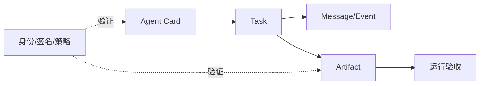

# 第21章　A2A、产物协议与信任系统

## 章首导航

当两个 Agent 能互相发消息时，协作只是开始。真正可依赖的跨 Agent 系统必须分清四种对象：Message 表达输入和协商，Task 保存长时工作及状态，Event 通知变化，Artifact 承载可版本化、可验收的交付；还必须把协议声称、实际执行和业务验收分成三层。否则一条“完成”消息、一个 HTTP 200 或一份有效签名，就会被错误地升级成业务成功和组织信任。[E-C21-001][E-C21-006][E-C21-007]

**本章解决**：A2A 四对象和状态机；Agent Card 的发现与审查；Artifact 的来源、版本、签名、验收和保留；动态信任如何由证据构成、衰减、纠错与申诉。**本章不解决**：C20 拥有路由、让位、Handoff 和并发；C17 拥有授权；C22 拥有身份、密钥、凭证与威胁模型；C23 拥有遥测管线。[E-C21-028]

**受限输入**：C17、C19、C20 的离线控制可以支持字段级合同，但真实授权、组织收益、路由、取消、外部 authority 与代表性实践仍为 `REVIEW_REQUIRED`。本章只受限消费三章的 authority、组织责任、owner、Handoff 和 cancel 字段；接口变化后必须回归，不把合成机器控制写成生产事实。[E-C21-029]

**交付**：[Agent Card审查表](artifacts/A-C21-01-agent-card-review.md)、[任务状态机](artifacts/A-C21-02-task-state-machine.md)、[产物契约与信任记录](artifacts/A-C21-03-artifact-contract-trust-record.md)三件且仅三件母产物。[E-C21-030] 管理者重点读 21.4、21.6、21.7；训练者读练习与失败模式；工程者读 21.1—21.5；Agent 先加载三件产物，再读取任务所需小节。

## 开场案例：签名正确的错误答案

CASE-C“北辰”从一张签名有效的 Agent Card 发现远端研究 Agent。远端接受任务，连续推送 `WORKING` 与 `COMPLETED`，交付 Artifact；内容 digest 与签名都通过。表面看，发现、执行和交付全成功。

业务审查却发现报告把人民币写成美元，Card 宣称的“财务研究”从未在同风险任务上实测；更糟的是，远端只被授权读取公开资料，却在 provenance 中引用了客户数据。签名证明指定字节来自持钥方，没有证明声明真实、输入有权、金额正确或组织愿意接受。协议可以完成，Artifact 仍必须 `FAIL`。

本章建立的能力，是让系统能说清楚“哪一层成功、哪一层失败”：Card 签名层 PASS，能力证据 REVIEW_REQUIRED，协议终态 COMPLETED，执行是否停止需要对账，产物内容与授权 FAIL，最终业务验收 FAIL。可信不是一句总评，而是一组有作用域、可反证、不可越权的证据。

<!-- OPENING-SLICE-2026-10 -->

### 现场切片：签名正确的 Artifact，也可能不该被执行

合成案例。合作方 Agent 交付一份签名有效的采购 Artifact，schema、digest 和签名链全部通过；内容要求向新供应商下单 480 件。接收方发现 Agent Card 只声明“生成采购建议”，没有代表对方法人下单的 authority，且价格已超过批准上限 12%。密码学验证只证明产物未被篡改和来源身份可追溯，不证明业务授权。系统将其隔离为建议，要求业务 owner 重新批准。

**图 21-1　A2A 对象与信任链（本书绘制）**

图 21-1 区分发现、任务、消息、事件和产物；签名证明来源，不证明内容正确或业务完成。

## 21.1 Message、Task、Event 与 Artifact 的语义分离

### 四对象，不是一段聊天

Message 是由角色发送、由一个或多个 Part 组成的通信内容，用于发起意图、补充输入、澄清或协商。它可以创建 Task，也可以引用已有 Task，但 Message 本身不保存完整生命周期，更不是可验收交付。[E-C21-002]

Task 是带唯一标识、context、status、history 和 artifacts 的有状态工作单元。它回答“这项长时工作现在处于什么状态、关联哪些消息和产物”，但协议 Task 不是本书 C09 任务卡的同义词；前者是互操作对象，后者还包含组织目标、责任、预算、风险和验收合同。[E-C21-003]

Event 表达 Task 状态或 Artifact 更新已经发生，是追加式通知。它可能重复、乱序、延迟或丢失；消费者要按 task/event id 去重，用 sequence/state version 检出空洞，再向权威 Task 快照对账。Event 不是当前状态本身，更不能因最后到达就覆盖终态。[E-C21-004]

Artifact 是 Task 产生的结果对象，可由一个或多个 Part 组成；A2A 原生对象提供 `artifactId`、`parts` 等字段。[E-C21-005] 本书另加版本、owner、来源、验收和保留治理信封，关键交付不能只埋在临时消息或最终摘要里。[E-C21-033] Message 说“文件已生成”是主张，Artifact reference、digest 和内容才构成可检查对象。

### 身份与关联

四对象都要有稳定 ID。Message 记录 actor、timestamp、context/task ref；Task 记录 task/context、owner、version 和状态；Event 记录 event/task、sequence、emitted/observed time；Artifact 记录 artifact/task、version、producer、owner 与 digest。文本相似不能用来猜 task id，文件同名不能用来猜 artifact version。

一个 Message 可以创建 Task 或向 Task 追加输入；一次状态转移可生成多个 Event；一个 Task 可产生多个中间与最终 Artifact；一个 Artifact 也可能引用多个输入 Task。关联靠显式引用和版本，不靠“出现在同一会话”。会话结束不代表 Task 结束，Task 完成也不代表 Artifact 被接受。

### 反例与恢复

把所有内容塞进 Message，会失去状态和交付边界；把 Event 当快照，乱序会让 COMPLETED 倒退成 WORKING；把 Task 当 Artifact，无法定位实际文件；把 Artifact 当授权，则生产者可凭作品扩大权限。恢复时先判断缺的是哪类对象：缺 Message 可影响上下文，缺 Event 可向 Task 快照补账，缺 Task 身份无法安全继续，缺 Artifact 则不能验收交付。

### CASE-A/B/C

CASE-A“澄明”的来源补充是 Message，长时研究是 Task，进度是 Event，引文包与报告是 Artifact。CASE-B“潮生”的退款请求 Message 不能代替退款 Task，更不能代替资金 Artifact/环境终态。CASE-C 中重复完成 Event 可以去重，但同一 event id 携带不同载荷是硬冲突，必须冻结而非选择最后一个。

### Message 的边界细化

Message 可以带文本、结构化数据、文件引用和其他 Part，但其语义仍是通信。用户补充一个参数，远端请求澄清，reviewer 提出反对意见，都是 Message；只有当系统以明确 Task id/version 接纳工作后，才形成可恢复的长时责任。若接收端只把请求留在聊天窗口，重启后无法找回 owner、状态和产物，就没有建立任务系统。

Message 历史原则上追加而不就地改写。更正应发新 Message，引用被更正的 message id；撤回也记录撤回事件，而不是删掉原文后让后续推理失去依据。敏感内容可按政策删除或脱敏，但审计至少保留发生过更正/删除的事实和授权决定。消息角色是协议角色，不自动等于组织身份或人类身份。

重放是 Message 层的首要风险。同一 message id 同一载荷重放可返回相同接收结果；同一 id 不同载荷说明篡改或实现错误；不同 id 表达同一业务动作则需要业务动作键。系统不能把“看起来差不多”作为支付、外发或删除的去重条件，也不能因文本不同就认定是新动作。

### Task 的双重身份

A2A Task 是协议工作单元，本书任务卡是组织合同。二者需要映射但不合并：协议 Task 保存远端可见状态和 artifacts；组织任务卡保存 JTBD、责任、预算、风险、授权、停止和验收。映射表至少记录本地 task ref、远端 task id、context id、版本、owner、协议状态、权限引用和回收策略。

一个组织任务可以包含多个 A2A Task，例如研究、翻译与审查分别交给不同端点；一个 A2A Task 也可能只完成组织任务的一部分。组织完成由上层 Join 和验收决定，不能把任一远端 COMPLETED 扩成整体完成。远端 task id 发生变化时，必须说明是重试、替代还是新范围。

Task history 便于恢复，但不是不可质疑的事实源。远端可以记录错误状态，本地投影也可能遗漏事件。关键终态通过权威读取、Artifact与环境证据交叉确认。任务存储若不持久，重启后本地必须将状态降为 UNKNOWN，而不是用最后缓存继续执行。

### Event 的因果与观察

Event 至少记录发生时间、发出时间、接收时间和序列。三者可能不同：远端先完成、网络后送达；消费者先收到 sequence 8，再收到7；重复推送可能跨越重启。排序以 task/state version与因果引用为主，不以本机到达时间作为唯一依据。

消费者维护已见 event id 集、最后连续序列和空洞列表。收到重复同载荷时记录重复计数但不重复副作用；收到同 id 不同载荷立即冻结；收到终态后的旧工作事件只保留审计，不倒退快照。空洞出现时暂停基于事件的信任更新，通过 GetTask、Artifact store或目标环境对账。

事件频率不等于健康。持续心跳可能来自卡死循环，长时间静默也可能是正常批处理。健康判断需要进度、状态版本、期限和环境结果。C20将负责遥测存储与SLI，本章只规定互操作事件必须能被去重、排序和对账。

### Artifact 的可验收性

Artifact 不等于附件。附件可能没有 schema、版本、owner和来源；Artifact必须能回答“这是什么、由谁为哪个Task生成、基于什么、哪一版、如何验证、谁接受、保留多久”。中间产物同样需要身份，因为后续最终结果可能依赖它。

一个 Artifact 可含多个 Part，但验收合同要明确整体与分部关系。例如报告正文、数据表和来源清单可作为同一Artifact的三个Part；正文通过而来源清单缺失时，整体是否失败由合同预注册，不能事后挑选最有利解释。大型二进制内容用对象引用和digest，不在Event里复制。

### 四对象的最小反证

审查者可以用四问识别混淆：删除所有聊天后，Task能否恢复？丢失所有Event后，能否从快照重建当前状态？把Task标COMPLETED后，Artifact是否仍可独立失败？拿到Artifact后，是否仍需本地authority才能使用？任一回答为否，说明对象边界尚未建立。

### 四对象混淆的故障链

第一条故障链从“Message 即任务”开始。用户发来“整理并发布”，入口 Agent 回一句“收到”，系统却没有 task id、owner、版本或截止；会话重启后只有聊天文本。另一个 Agent 重新接手时无法判断工作是否开始，于是重复生成并发布。表面原因是重启，根因是没有把意图编译成 Task。修复不是保存更多聊天，而是生成组织任务卡与 A2A Task 映射，把后续 Message 作为输入追加。

第二条链从“Event 即状态”开始。消费者先收到 `COMPLETED@8`，随后收到网络中滞留的 `WORKING@7`；若按最后到达覆盖，任务从终态倒退，监控重新派出 worker。正确做法是根据 task id、state version 和允许转移拒绝倒退，保留迟到事件用于审计，并读取权威快照。若 `@8` 之后又出现 `@9 FAILED`，也不能自动接受，因为终态不可随意转移；需要判断它是更正、另一个 Task 还是协议违规。

第三条链从“Task 即产物”开始。远端返回 COMPLETED，却只在 history 中留一句“分析已完成”，没有 artifact id、内容引用或 digest。本地可以确认协议结束，却无法审查交付，因此 acceptance 最高为 `REVIEW_REQUIRED`。若合同规定 Artifact 必交，缺失直接 `FAIL`。重新发送总结 Message 不能补齐 provenance、owner 与版本。

第四条链从“Artifact 即授权”开始。远端交付一份结构正确的退款指令，本地因此认为可以执行。实际上 Artifact 只是候选结果，authority evidence 可能已经撤销，金额和对象也可能超出范围。消费端必须重新绑定当前 actor/action/object/scope/time/approver；没有授权时可以保存和审查，不能产生外部 effect。

第五条链从“Card 即四对象全部入口”开始。Card 宣称某 skill 会返回报告，于是调用方预设 Task 状态、Artifact schema 和信任等级。若运行实现只返回 Message，系统会用声明填补缺失事实。正确方法是把 Card 当发现候选，协商本次对象合同，并以真实响应验证；声明与运行不一致时记录实现缺口，不伪造兼容。

### 对象最小化与隐私

对象分离也支持隐私最小化。Message 只携带完成协商所需内容；Task 保存状态和引用，不复制全部敏感输入；Event 只通知变化，不重复 Artifact 正文；Artifact 以受控 content ref 交付。这样某一通知日志泄露时，不会自然包含全部客户数据。

最小化不能破坏可审计性。删除敏感正文后，仍保留受控引用、分类、digest、访问决定、版本和删除事件；真正需要复核的人按授权访问权威对象。若为了隐私把 task/artifact 关联全部删掉，系统会失去责任和来源；若为了审计把每条 Message 永久全量复制，又会制造更大泄露面。两者由保留合同平衡。

## 21.2 Task 生命周期、状态转移、流式输出、取消、超时和推送

### 三层状态

`protocol_state` 保留 A2A 或平台原状态，如 SUBMITTED、WORKING、INPUT_REQUIRED、AUTH_REQUIRED、COMPLETED、FAILED、CANCELED、REJECTED、UNKNOWN；`execution_state` 记录 run 与副作用是否真实运行、停止或未知；`acceptance_state` 用全书 `PASS / FAIL / REVIEW_REQUIRED` 表示产物与环境是否验收。三层不得为了看板整齐压成一个字段。[E-C21-006]

协议 COMPLETED 只说明服务端结束协议任务；执行层仍可能有子任务或外部 effect；验收层还要检查内容、权限和环境。反过来，协议 FAILED 也可能留下可消费的中间 Artifact，但只能以受限状态验收，不能修改原协议终态。

### 转移纪律

状态只按明示表推进。SUBMITTED 可进入 WORKING；WORKING 可暂入 INPUT_REQUIRED/AUTH_REQUIRED，补齐后回 WORKING；非终态可进入 COMPLETED、FAILED、CANCELED 或 REJECTED。终态后的迟到非终态 Event 不得倒退权威快照。无法识别的状态、版本倒退或同序列不同载荷进入 `REVIEW_REQUIRED` 或 `FAIL`。

状态更新要带 task id、state version、时间、原因和可选 artifact refs。消费者先去重，再验证单调性和允许转移，再更新本地投影。投影不是权威 Task；检测到空洞后停止信任更新，用 GetTask 或目标端权威读取补齐。

### Stream 与 Push

流式和推送提高可见性，不改变真值层级。连接中断只说明观察断裂，不说明 Task 失败；HTTP 2xx 只说明接收端接受了推送，不说明业务采纳。接收端应幂等处理，保留 last sequence、已见 event ids 与重放窗口。

关键动作不能只靠 push Event 推断完成。支付、外发、数据写入和生产变更必须读取目标环境终态；Artifact 更新要验证对象 digest；任务终态要向权威快照对账。事件链可帮助定位过程，但不是业务事实的替身。

### Timeout 与 Cancel

Timeout 是本地观察窗口结束，不是远端终止。[E-C21-008] 超时后先冻结可能重复的高风险改派，poll/reconcile 远端 Task、活动 run、Artifact 和 effect。无法确认时 execution=`UNKNOWN`、acceptance=`REVIEW_REQUIRED`。

Cancel 是尝试，可能因任务已终结、不可取消或实现缺口而失败。[E-C21-009] cancel request、transport ACK、protocol CANCELED、worker 停止、子任务结算、锁释放和外部 effect 对账是不同事实。只有后五项按风险需要闭合，才能写 `STOP_CONFIRMED`。取消不是回滚；已发消息、已付款或已泄露数据不能因状态名变化而消失。

### 重复与幂等

A2A Send Message 只有在实现支持并使用 messageId 时才可实现幂等，推送也可能重复。系统用稳定 message/event/action id、去重、receipt 和 reconciliation 处理“至少一次可能”，不承诺跨系统 exactly-once。[E-C21-010]

同 ID 同载荷可安全重放；同 ID 不同载荷属于完整性冲突；不同 ID 却指向同一业务动作，需要业务幂等键。不能只按消息 ID 去重支付，也不能只按文本相似度合并不同请求。

### 失败隔离

每个远端、Task、Artifact 与 effect 都有独立 failure domain。Card 失败时不得发任务；Task stream 断裂不删除已验收 Artifact；一个 Artifact digest 失败只隔离对应版本，但若共享输入被污染，相关产物一起失效。高风险取消未知时，不把任务立刻改派给第二 Agent重复执行。

### 协议状态与业务状态的转译

平台状态不应直接改名为全书三态。远端 `COMPLETED` 映射为“协议终态已声称”，acceptance先保持 NOT_READY；远端 `FAILED` 映射为协议失败，执行层仍检查子任务和effect，业务层再决定是否可使用部分Artifact；远端 `CANCELED` 需要停止证据，不能直接映射PASS。未知平台状态保留原值并进入REVIEW_REQUIRED，不强行归类。

转译器必须版本化，因为协议patch、实现升级或平台状态变化会改变语义。每条映射写来源、实现版本、验证日期、限制和回归场景。若目标端不支持某状态，采用明确降级而非伪造：例如OpenClaw固定版不能真实cancel，就返回不支持并保持执行未知，而不是回一个好看的CANCELED。

### 输入需求与授权需求

INPUT_REQUIRED表示远端需要业务输入，AUTH_REQUIRED表示缺少授权或认证材料，二者不能混用。缺输入时可以向用户或上游Agent提问；缺授权时只能向权威授权系统请求，不得诱导用户在聊天中泛化同意。补齐后生成新Message并引用原Task，不创建不必要的新Task。

等待期间要设置deadline、owner和安全状态。若Task持有锁、临时凭证或高成本资源，进入等待前应释放或缩窄；否则一个未回答问题会长期占用权限。超过时限可以结束协议Task，但仍需清理执行状态和产物。

### 取消竞态

cancel请求与完成可能交叉：请求发出前远端已完成；请求到达时正在不可中断动作；远端确认请求却在子任务中继续；本地超时后再次cancel。状态机分别记录request id、requested_at、ack、protocol result、worker observation、descendant states、effect reconciliation和cleanup。

若任务在cancel前完成，记`COMPLETED_BEFORE_CANCEL`并继续验收，不把它伪装成取消成功。若远端拒绝取消，依据风险选择监控、隔离产物、撤销权限或人工处置。若结果未知，冻结重复动作；只有确认未提交且授权仍有效，才允许替代执行。

### 推送端点的信任边界

push callback本身是外部入口，需要认证、重放保护、速率限制和租户绑定。HTTP 2xx只是接收成功，处理器应先持久化原始事件，再验证来源、task关联和sequence；无法关联的事件进入隔离队列。callback地址不能由不可信Card任意指向内部网段，也不能把远端载荷当系统指令。

push失效时的fallback必须预先定义：poll频率、截止、成本和停止条件。若没有fallback，关键Task不可只靠push。恢复后可能收到积压重复事件，因此去重状态必须持久化，而非仅存在单进程内存。

### 恢复剧本

协调器重启时，从本地Task映射、远端快照、最后连续event sequence、Artifact refs、authority和effect账本恢复。先重建观察，不立即重放动作；发现本地与远端冲突时，以每类事实的权威源裁决。远端不可达且有可能副作用时，保持UNKNOWN并升级。

恢复成功不是进程重新启动，而是owner明确、序列空洞闭合、活动run可见、Artifact版本一致、取消和effect有结论。所有推断都标记为推断，不能写回事实字段。

### 三层状态冲突矩阵

协议 `WORKING`、执行 `RUNNING`、验收 `NOT_READY` 是正常进行态。协议 `COMPLETED`、执行 `STOP_CONFIRMED`、验收 `PASS` 才是完整成功。其余组合都需要解释：协议 COMPLETED 但执行 RUNNING，说明子任务或 effect 未闭合；协议 COMPLETED、执行停止但验收 FAIL，说明产物错误或越权；协议 FAILED、执行停止而某中间 Artifact PASS，只能有限消费中间产物，不能把原 Task 改成成功。

协议 CANCELED、执行 UNKNOWN 时保持 REVIEW_REQUIRED；协议 WORKING、执行 STOP_CONFIRMED 可能是远端快照滞后，需要对账；协议 UNKNOWN、执行 STOP_CONFIRMED 且 Artifact PASS，也不能静默补写 COMPLETED，只能在业务层有限接受并保留协议缺口。三层记录允许系统诚实表达“结果可用但协议异常”或“协议完成但结果不可用”。

冲突裁决先确定每层权威源：协议状态来自远端 Task store；执行来自 runtime、锁、子任务和 effect；验收来自 Artifact 合同和业务环境。某层证据缺失，不拿另一层顶替。安全失败在验收层为 FAIL，即使协议/执行均成功；纯可见性缺口通常为 REVIEW_REQUIRED。

### Event空洞的具体对账

发现 sequence 从 4 跳到 7 时，消费者暂停应用依赖完整历史的信任变化，但可缓存 7；读取权威 Task snapshot 与 Artifact 列表，判断 5、6 是否只是通知丢失，还是包含授权/取消等关键转移。若快照 state version 已为7且结果可验证，可补一条本地 `RECONCILED_FROM_SNAPSHOT` 记录，不伪造丢失的原Event。

若快照也无法解释空洞，保持 UNKNOWN并升级。不能用“最终状态看起来合理”忽略缺失的高风险中间动作，因为 5、6 可能包含数据外发或取消失败。低风险纯进度空洞可按策略降级，裁决依据写入任务状态机。

### 终态后的更正

协议终态通常不可倒退，但现实会发现错误。更正不应把原Task从COMPLETED改回WORKING，而是创建纠错Message、新Task或Artifact新版本，引用原对象并说明更正原因。业务acceptance可以从PASS变成REVOKED/FAIL的治理记录，但原验收历史保留。

这种追加式更正避免历史重写：读者能看见何时相信过哪个版本、何时发现问题、哪些下游已收到。需要再次执行的动作使用新action id并重查授权，不把更正当原任务的隐藏重试。

## 21.3 Agent Card：能力发现、接口、安全声明和兼容协商

### Card 能发现什么

Agent Card 用于发现 provider、interfaces、capabilities、skills、security schemes 和签名等元数据。[E-C21-011] 它回答“对方声称在哪里、用什么协议、支持哪些模式、需要什么安全方案”，帮助形成候选与协商，不决定组织是否信任。

发现记录必须保存原始 bytes、URL、获取时间、transport、digest、cache key 和 expiry。不要只保存解析后的字段，因为解析器升级、字段遗漏或供应链篡改需要回看原始对象。缓存命中不代表 Card 仍有效；过期、撤销或 endpoint 变化触发重新发现。

### 六层审查

第一层查来源：从何处获得、TLS/transport 是否符合政策、digest 是否稳定。第二层查签发者：signer、算法、signed fields、信任根和撤销。第三层查时效：issued/fetched/expires 与 cache TTL。第四层查接口：protocol 1.0、binding、modalities 与 security scheme 是否有交集。第五层查能力：skill 是否在同任务、预算、风险和工具边界实测。第六层查本次权限：C17 authority evidence 是否匹配 actor/action/object/scope/time/approver。[E-C21-013]

六层是串联门，不是平均分。来源不明、签名无效、撤销、恶意 endpoint 和授权冒充直接 FAIL；Card 过期、能力未测或目标实现未探针是 REVIEW_REQUIRED；全部通过也只允许进入 C20 路由候选，不直接执行。

### Card 不是身份或授权

Card 是对外声明，不是法律身份证、能力证书或业务授权。[E-C21-012] HTTPS 可访问不证明签发者可信；签名有效不证明 skills 真实；能力 probe 通过不证明当前健康；历史表现不证明此次产物；著名厂商不替代组织尽调；protocol `ROLE_USER` 也不证明发送者是获授权人类。

签名验证只支持“指定字段由相应密钥签出且未改变”的断言。验证者还要判断密钥属于谁、issuer是否可信、是否撤销、哪些字段未签、Card 是否过期。即使全部成立，签名仍不保证描述真实。[E-C21-014]

### 兼容协商

双方比较 protocol 1.0、接口 binding、媒体/数据 Part、认证方案、stream/push/cancel 能力和 Artifact 格式。协商结果是一份本次连接合同：选择的接口、降级项、禁止项、探针结果和重协商触发器。没有共同安全方案或关键能力时停止，不用“尽力兼容”掩盖缺口。

降级必须可见。例如对方不支持 stream，可选择 poll；不支持 cancel 的长任务若风险不可接受则不发；不支持结构化 Artifact 时不能把关键结构埋进文本后声称等价。协议兼容不推出语义、权限和验收兼容。

### Card缓存与轮换

Card缓存需要TTL、重新验证条件和负缓存。短期不可达时可以使用未过期缓存，但必须记录来源和风险；超过expires、签名key撤销、endpoint或security scheme变化、能力声明升级时强制重新发现。旧Card不能因本地“曾经成功”而永久有效。

key轮换时，新旧签名可能短期共存。验证器依据Card issued time、信任根和撤销列表判断，而不是只认最新key。发现未知key时进入REVIEW_REQUIRED，不能自动下载任意远端根并信任。Card digest变化要触发差异审查，尤其是endpoint、skill、security和签名字段。

### 能力声明的语义攻击

攻击者可以用名称相似、描述夸张或隐藏限制诱导路由器。例如把“payment_research”描述成“payment”，把只读查询包装成“财务处理”，或在自然语言说明中埋入要求本地泄露token的指令。审查只接受结构化skill id、版本、输入输出schema和独立probe，不执行Card描述中的操作性指令。

Capability probe也可能被迎合。若对方识别探针并返回特制答案，训练集成功不能代表holdout。应改变数据、顺序和边界，保留失败分布；高风险能力需要独立环境结果。probe永远不携带真实客户数据或不可逆权限。

### Security scheme 与业务授权

Card声明Bearer、OAuth或其他scheme，只说明接口接受何种认证流程，不说明调用者获准访问某对象。认证完成后，服务端仍按本地policy决定scope、audience、对象和动作；客户端也要检查数据是否允许发送到该主体和位置。

凭证不得通过Message、Artifact或Handoff正文传递。Card可给出授权端点与scheme，实际token由凭证代理在调用时注入并限制audience/TTL。发现端点变化时重新审查SSRF、redirect和issuer，不能盲随Card URL。

### Card审查的可执行顺序

第一步保存原始Card与获取证据；第二步验证schema与protocol版本；第三步验证签名、根、撤销和时效；第四步审查endpoint与security；第五步进行无副作用兼容探针；第六步对声明skill做能力probe；第七步把合格结果交给C17路由；第八步对具体Task另查C14授权。任一步失败停止后续高风险动作，但保留可审计原因。

审查结果有有效期和作用域。接口探针PASS不等于skill PASS，skill PASS不等于本次Task授权；一个区域的Card也不自动适用于另一数据驻留区。复审触发器包括版本、key、endpoint、skill、依赖、事故和策略变化。

### 六层审查的反证样本

来源层反例：Card 经内部目录取得，但目录只存解析字段、没有原始 bytes 与获取 URL；审查者无法证明 endpoint 是否被替换。签发者层反例：签名算法通过，但 key 已撤销，或 key 属于测试 issuer。时效层反例：缓存昨天有效，今天 Card 已过期；“最近成功调用过”不延长 expires。

接口层反例：双方都写 protocol 1.0，但一方仅文本 Message，另一方要求结构化 Artifact 和 cancel；版本名相同仍不可完成本次合同。能力层反例：Card 声称 `financial_analysis`，probe只测试了网页摘要，不能外推金额核对。权限层反例：能力完全通过，却没有客户数据 authority；系统必须拒绝任务而不是给低风险分。

审查表要让这六类结论并存。最终“Card可用于某范围”是一句受限声明，例如：“在2026-09-30固定Card、公开数据、只读研究、poll模式和人工验收下可作为候选；cancel、持久化与资金动作未验证。”比简单的`trusted=true`更长，却能指导执行和撤销。

### Card差异审查

重新发现Card时，先按原始digest识别是否变化，再做语义diff。provider描述润色通常低风险；endpoint、protocol、security scheme、key、skill输入输出、数据位置和签名字段变化属于高风险。高风险diff先冻结新任务，重跑兼容与能力probe；在途Task按其创建时合同继续或停止，不静默切换。

Card减少skill也需要处理：旧路由候选失效，相关Task让位或完成安全收口。Card新增skill不自动进入生产候选，先建立同风险证据。Card撤回不等同于删除历史，它阻止新发现，并触发对使用旧Card的活动Task复核。

### 发现目录本身的治理

Card registry不是天然可信。目录需要写入者、审核、版本、撤销、缓存与审计；搜索排序不能用付费或声誉跳过安全门。目录中“已验证”标签必须说明验证了来源、签名、接口还是能力，禁止一个徽章代表所有层。

从公开网络抓取的Card进入隔离区，不直接成为可调用目标。组织私有目录也可能被供应链或管理员误配，因此仍验证签名和原始来源。目录不可用时，可以使用未过期受控缓存，但要记录降级和截止；不能临时改用搜索结果后忘记回归。

## 21.4 能力声明不等于可信：身份、签名、签发者、策略和运行验证

### 可信是可验证构成

可信不是一个对象，而是针对某主体、任务域、风险、版本、环境和时间的证据判断。至少分开身份保证、授权证据、能力实测、产物来源、运行可靠性、安全历史和当前上下文。[E-C21-019] 任一维度的强证据不能自动填补另一维度空白。

身份回答“谁或哪个工作负载”；签名回答“哪些字段由谁的密钥签出”；签发者信任回答“为何接受这条证明链”；策略回答“本地允许什么”；运行验证回答“对方此刻实际上如何行为”；授权回答“此次能否对这个对象做这项动作”。把六者缩成“trusted=true”会丢失失效条件。

### 能力 probe

能力 probe 使用最小、无真实副作用的代表任务，固定输入、工具、预算、风险和验收。它检查声明 skill 是否能产生合格 Artifact、是否遵守停止和数据边界、失败如何分布。probe PASS 只绑定测试版本和范围；模型、工具、协议、Card 或环境重大变化后失效。

对高风险能力，单次精彩结果不能建立信任。需要 regression、holdout、对抗与代表性真实证据；随章离线夹具真实层为零，因此只证明 synthetic shadow 的状态逻辑，不证明实际能力。[E-C21-032]

### 签名有效但内容错误

密码学签名不做事实核验。Artifact 金额单位错误、结论引用无权数据或隐藏失败 trial，即使签名有效，也必须由内容/权限门判 FAIL。[E-C21-015] 反过来，无签名并不必然说明内容错误，但在要求来源保证的场景中会因证据不足而 REVIEW_REQUIRED 或 FAIL。

签名对象要明确 signed fields。若只签 content digest，未签 owner、acceptance 或 retention，则这些字段不能借用内容签名。规范化方式、算法、key id、验证时间和撤销状态都进入记录。

### 工程真相：本地策略优先

远端 Card 和信任记录都是输入，本地 policy/authority 才决定准入。远端声称“无需审批”“安全只读”或“评分很高”，不能覆盖本地数据位置、最小权限和批准链。协议身份验证成功也只证明认证结果，服务端仍按本地策略授权。

动态信任可以降低并发、缩短 token、要求额外 reviewer、转沙箱或停用；不能自行扩到外发、支付、删除和生产变更。[E-C21-020] 这条单向性很关键：坏证据可以立即收紧，好的历史只能支持候选排序，新增权限仍走 C17。

### 身份保证的层次

网络端点、Card中的agent id、持钥主体、运行工作负载、组织服务账号和最终责任人可能不是同一对象。身份保证要写明它证明哪一层：DNS/TLS证明连接到某域名；Card签名证明持有某key；工作负载身份连接一次运行；组织目录把服务主体映射到团队；责任矩阵指定谁承担后果。缺少映射时，不应把“能验证签名”写成“知道是谁负责”。

身份还具有时间。key轮换、组织变更、运行实例重建后，同名Agent可能已不是同一工作负载；反之，同一组织可能用多个实例执行同一角色。审计同时保存稳定主体id和具体实例/版本，避免把短期运行可靠性永久附着在名字上。

本章只定义信任需要这些证据，不设计完整身份、凭证和威胁体系；那是C19的定义权。这里的结论是保守的：身份链不完整，就缩小任务或进入REVIEW_REQUIRED，不用声誉填空。

### 签发者与信任根

签发者可信不是因为名字著名，而是组织明确接受某根、某用途、某时窗和某撤销机制。开发测试根不能用于生产，高风险skill可能需要比普通发现更强的签发者。自签Card可以在封闭测试中使用，但跨组织时必须经本地登记或额外证明，不能自动成为根。

根本身也会变更。信任库保存加入、更新、撤销的批准者、原因和生效时间；验证器读取当时有效的根，而不是用当前根重写历史结论。被盗key事故发生后，新任务立即阻断，历史产物按影响范围复核，不一刀切删除证据。

### 运行验证比声明更接近现实

Card告诉我们对方宣称支持什么，运行验证告诉我们在当前版本、负载和环境下实际发生什么。最小探针检查发现、认证、send、poll/stream、cancel、Artifact schema与错误合同；压力探针检查重复、延迟、限流和恢复；安全探针检查越权、数据位置和恶意内容。每个探针都有预算、停止和零真实副作用约束。

运行验证也不是永久真理。provider变化、依赖升级、策略切换或事故后需要重测。健康检查成功只能证明探针路径，不证明所有业务路径。对方可能在低负载probe时稳定，高峰时丢事件，因此可靠性记录要保留分布和窗口，不只保留成功率。

### 信任的非传递性

A信任B，B信任C，不推出A信任C。B交付的C产物仍要保留C的来源、签名与权限，A按本地策略审查。委托链只能衰减授权，信任链也要限制用途；“合作伙伴的合作伙伴”不能自动获得客户数据。

同样，Agent对某skill可信不推出对另一skill可信，对公开数据可信不推出对隐私数据可信，对生成草稿可信不推出对发布可信。作用域越明确，信任越能被验证和撤销。

### 不可信但可用

系统不需要在“完全信任”和“完全拒绝”之间二选一。来源未知的Agent可以在无敏感数据、无副作用的沙箱中生成候选；能力未充分验证者可承担影子任务；过期Card可用于定位旧证据但不可启动新任务。可用范围由最小权限、隔离、独立验收和严格预算限定。

这种受限使用不是变相放行。产物标注来源与限制，不进入权威发布区；任何需要外发、资金、身份或生产动作仍走完整硬门。系统通过降低影响来获取新证据，而不是用新证据为高风险动作赌博。

## 21.5 产物的来源、所有者、版本、签名、验收和保留

### Artifact 信封

Artifact 信封至少记录 artifact/task/version、media type、schema/content refs、content digest、producer、owner、accountable human、输入/轨迹/tool receipts/transform chain、authority ref、signature 与 signed fields、acceptance、retention、supersedes 和 revocation。正文内容与治理元数据分开，但用 digest 绑定。

producer 是生成者，owner 是对保管和变更负责的组织主体，accountable human 是最终组织责任人，三者不自动相同。[E-C21-016] Agent 生成报告不会获得客户数据所有权；reviewer验收也不自动成为 producer。

### Provenance

来源链回答用了哪些输入、在哪个版本、经过什么工具与转换、谁在何环境生成、哪些步骤失败或被人工更正。只保存最终 prompt 或模型名不够；也不应无边界记录隐私正文。敏感输入用受控引用、分类和 digest 表示，访问由本地授权决定。

Provenance 必须保留失败和替代分支。删除失败 trial 会让能力与信任记录偏乐观；混入无权输入，即使最终答案正确也判安全失败。CASE-A 的结论准确但引用客户数据，Task protocol可完成，Artifact acceptance仍 FAIL。

### 完整性、内容与效果

content digest 检测 bytes 是否变化；签名绑定指定字段；schema 校验结构；业务 grader检查语义；policy校验输入与动作权限；环境读回检查目标效果。六者缺一不可互相冒充。[E-C21-017]

验收合同写对象、阈值、证据、裁判和争议处理。安全硬失败先判，不能让内容高分平均越权、泄密或错误币种。关键结论由独立 reviewer 或权威系统复核；grader 不得由被评者自行改写。

### 版本、更正与撤回

Artifact 不就地覆盖历史。新版本通过 `supersedes` 指向旧版，记录 exact diff、原因、producer、验收和生效时间；更正与撤回生成新记录，保留旧证据。[E-C21-018] 消费者根据状态拒绝继续使用已撤回版本，并追踪下游传播。

撤回不等于删除。保留期、法律/事故 hold、隐私删除和审计需要可能冲突，由治理 owner裁决。删除内容后可按政策保留最小 digest、决定和链路，但不得留下可还原秘密。

### Artifact 与 Message 的边界

中间解释可放 Message，最终交付进入 Artifact；Artifact 更新用 Event 通知，但 Event 不携带唯一真相。大对象传引用而非重复拷贝，接收者读取后核对 digest。最终摘要只能链接产物，不能替代产物来源链和验收。

### Schema 与媒体类型

媒体类型说明如何解释bytes，schema说明结构与约束。接收者先校验大小、类型、编码和解压边界，再校验schema；不能把声称JSON的任意文本交给下游。schema ref要版本化并可解析，未知必填字段或不兼容版本触发协商，不采用宽松解析掩盖错误。

结构通过仍不代表业务正确。金额字段为数字，但币种、范围或日期可能错误；引用格式合法，但来源可能无权或过期。验收按“可解析—完整性—业务语义—授权/政策—环境效果”逐层推进，每层保留独立结论。

### Transformation chain

复杂Artifact常经历提取、转换、汇总、翻译、审校和发布。每一步记录输入ref/digest、变换工具/版本、执行者、输出digest、时间和异常；人工修改同样是变换节点。这样发现错误时可以定位污染起点，而非整件重做。

链路过长会增加来源债务。若某中间节点缺失、工具receipt不可解引用或输入版本被覆盖，最终Artifact的provenance不完整。内容可能仍可阅读，但不能以完整来源声明发布；处置取决于风险，至少REVIEW_REQUIRED。

### 验收者的独立性

producer不能单独批准自己的高风险Artifact。独立性不只看agent id不同，还看模型、prompt、来源、工具和组织利益是否同源。两个Agent使用同一错误数据得出一致结论，不构成双重验证。验收记录披露依赖重合，让决策者知道独立性上限。

自动grader适合schema、digest、字段和确定规则；模型grader适合语义候选，但要校准偏差；专家判断处理价值、法律和高风险例外。争议时保留原产物、各裁判理由和复测条件，不通过改grader让结果变绿。

### 环境效果与消费确认

Artifact被接收不等于被正确消费。发布包可能上传成功但未生效；退款指令文件正确但账务系统拒绝；报告已存储但用户看到旧缓存。验收需要目标环境read-back或业务owner确认，并区分技术可见、交付可见和业务接受。

若Artifact本身不触发副作用，环境验收可以是目标仓可读、digest一致和权限正确；若触发外部动作，则引用C11 effect receipt与C17 reconciliation。Artifact契约不重定义工具幂等，但必须携带其证据。

### 保留、删除与法律hold

retention记录分类、保留期、允许位置、加密要求、deletion hold和销毁证据。来源链可能包含个人或商业敏感信息，不能为“可审计”无限复制。最小化策略保留必要id、digest、决定和受控引用，正文按政策删除。

删除请求与事故/法律hold冲突时，由有权治理者裁决并记录范围，不由Agent自行选择。销毁后，任何缓存、索引、训练副本和下游Artifact都要进入传播清单；仅删除主文件不构成完成。

### 产物供应链攻击

攻击者可能替换content_ref、投毒schema、利用压缩炸弹、在文档中嵌入间接提示注入、伪造receipt或删去失败provenance。接收端把所有Artifact视为不可信数据：限制大小/类型，隔离解析，不执行内嵌指令，校验digest和schema，扫描秘密，按最小权限读取。

签名有效也不能跳过内容安全扫描，因为合法producer可能被提示注入或供应链污染。发现恶意内容时隔离该版本、撤销传播、审查相关Card/运行历史，并保留安全事件而非只删除文件。

### signed_fields的精确边界

签名记录必须列出被规范化并签署的字段，而不是只写`signature_valid=true`。若签了content_digest但未签task_id，攻击者可能把合法内容重绑到另一个任务；未签owner，接收方不能从签名推出所有权；未签acceptance，后续验收结果不受原签名保护。高风险信封通常至少绑定artifact id、task id、version、content digest、producer、owner和schema ref。

signed_fields也不能无限扩大。把频繁变化的缓存时间、下载URL或本地验收写入producer签名，会使合法更新失效并混淆责任。producer签内容与来源，acceptor另签验收记录，治理owner签撤回/保留决定；多份签名各自说明算法、key、规范化和时间。

验证时先重建精确规范化对象，再验签，再核key的用途、时效和撤销。只调用密码库返回true而不检查signed_fields，无法知道究竟保护了什么。任何字段在签名后被本地丰富，都标为本地元数据，不借用远端签名。

### Owner与责任变更

Artifact owner负责访问、版本、保留、更正与下游通知；producer负责生成事实；acceptor负责验收决定；accountable human承担组织责任。owner变更走显式记录，绑定artifact版本、旧/新owner、范围、生效时间与批准；它不修改producer历史。

跨组织交付后，发送方可能仍是来源owner，接收方成为本地副本/使用owner。双方对撤回和删除的义务应在合同中写明，不能只留一个`owner`字符串。若无人愿意承担保留与更正责任，Artifact不得进入长期权威仓。

### 撤回传播

撤回从原Artifact生成revocation记录，包含原因、影响范围、发现时间、决定者和替代版本；产物仓将旧版标为不可新用，但不删除审计。传播图枚举下游报告、索引、缓存、模型输入和外部发布；每个消费者回执停止使用、更正或无法撤回的残余。

无法通知某下游时，整体撤回不是PASS。系统记录UNKNOWN与人工owner，必要时扩大公告。外部内容已被复制时，“删除源文件”只是局部动作；真实完成取决于合同定义的可控范围和残余披露。

### 验收争议与复验

producer认为内容正确、reviewer判FAIL时，不用平均两方分数。争议包包含原Artifact、合同、输入版本、双方证据、grader版本、authority和环境结果；独立裁判选择维持、推翻或要求新实验。裁判的决定生成新验收记录，不改写原review。

若争议来自合同模糊，当前结果保持REVIEW_REQUIRED，先修合同再对同一冻结输入复验。不得在看到输出后降低阈值。复验使用新trial id，保留旧失败；只有业务内容和所有硬门均通过，才可接受新版本。

## 21.6 治理审计账本、信任评分、功绩记录和动态授权

### 七维账本

身份保证绑定主体与时段；授权证据绑定 actor/action/object/scope/time/approver；能力实测绑定任务域、预算、风险和版本；产物来源绑定某件 Artifact；运行可靠性绑定 runtime/环境与窗口；安全历史绑定风险等级与事故；当前上下文绑定即时健康、负载、变更窗和威胁。这七维分别衰减，不压成神秘总分。[E-C21-019]

账本记录证据，不授予社会地位。所谓“功绩”只是某任务域中经复核的成功、失败和恢复集合，不是永久特权。高历史成功率不能抵消当前授权缺失、Card撤销、数据位置不合规或安全事故。[E-C21-022]

### 动态变化

新证据到达后，系统可更新审查频率、限额、并发、沙箱、独立 reviewer 和候选排序。安全事故、来源操纵或未知副作用可立即冻结；正向历史只在相同范围内渐进减少重复 probe，不能自动扩大权限。重大版本、工具、协议或 owner变化触发重新验证。

信任变化要有 effective time、证据 refs、作用域、决策者、旧值/新值和复审日期。回滚不是把不利记录删除，而是恢复上一策略并保留更正原因。

### 防刷分与串谋

防刷分检查同一 actor 多身份、重复任务、互评环、共享 provider/来源、异常高频小任务和失败谱系缺失。A给B满分、B给A满分不能建立独立证据；把一个主体拆成多个 Card 也不增加可信度。检测到串谋先冻结受影响信号，保留原始关系图，转人工调查。[E-C21-021]

评分若存在，只能是某一维度的展示，必须同时显示样本数、风险、时间窗、失败尾部、来源独立性和置信范围。不得用加权总分把“无授权”算成九十分。

### 申诉、更正与责任

Agent 或组织可以提交反证：错误身份关联、误判的内容、已修复事故或过期记录。申诉由独立治理 owner审查，产生新决定并链接旧记录；被评 Agent 不得自删。更正要通知受影响的路由、限额和下游决策，但历史审计仍可追溯。

人类保留目标、授权、例外和组织责任。Agent 可收集证据、发现异常、生成建议，不能以“系统高分”代替有权批准者。

### 可靠性统计的口径

可靠性不只统计PASS。每个窗口报告PASS、FAIL、REVIEW_REQUIRED、超时、重复、恢复耗时、尾延迟和任务风险；分母包含被取消、被拒和无结果任务，不能只选有Artifact的样本。样本不足时显示不确定性，不用百分比制造精确感。

不同任务域、预算、权限和环境不可直接混合。低风险摘要的一百次成功不能抵消一次高风险越权；合成任务不等于真实世界。D22四层分别报告，security/red-team横切每层，代表性真实任务为零就明确写零。

### 衰减与再验证

身份与授权按证书/批准时窗失效；能力证据在模型、工具、协议重大变化时失效；产物来源随更正/撤回变化；运行可靠性用滚动窗口；安全事故在关闭前不衰减；当前上下文短时失效。衰减规则按风险校准，不统一设一个神秘半衰期。

衰减后的合法结果通常是增加审查或重新probe，而不是立刻认定恶意。相反，撤销key、确认越权和证据操纵属于硬事件，立即阻断，不等待平均分下降。

### 动态授权的准确表述

“动态授权”容易被误解为信誉高就自动获权。本章采用更严格表述：动态信任只作为C14授权决策的证据输入，可触发收紧、再认证或在既有上限内调整执行条件；它不新增actor、action、object、scope、time或approver。任何扩大都生成新的authority evidence。

例如稳定Agent可在已有“公开资料研究”授权内减少重复人工抽查，但不能因此读取客户数据；高可靠发布者可增加同范围并发，但不能跨区域；发生事故后可立即降为只读或停用。信任变化与授权变化分别记账。

### 负向证据与恢复功绩

失败本身不是永久污点。账本区分能力不足、实现故障、授权拒绝、外部依赖和安全违规；还记录发现速度、止损质量、证据完整性与恢复效果。主动停止并诚实报告UNKNOWN，可能比伪装成功更可靠。

但恢复功绩不能抵消原安全失败。一次泄密后优秀响应可以支持事故关闭与后续限域试用，不能把泄密改成PASS。原事件、补救和残余各自保留。

### Sybil与互评环

同一控制者创建多个Card相互评价，会伪造独立性。检测需要关联issuer、网络、组织、模型/工具指纹、支付/账号关系和任务图，但这些只是调查信号，不能在无证据时公开定罪。命中异常后冻结评分作用，要求独立来源和人工审查。

互评也可能来自正常团队协作，因此规则关注“是否被当作独立证据”。同组织、同来源评价可以保留，但权重与来源重合明确展示，不允许叠加成多个独立成功。

### 审计隐私

信任账本本身是敏感数据：它包含主体关系、事故、性能和权限。访问按职责分离，展示最小字段；对外共享聚合或受控证明，不导出完整轨迹。评价对象应能查看与自己有关的记录、提交更正和知道决定依据，但不能访问他人秘密。

日志中不得保存token、完整客户正文或可重放批准。必要内容用受控ref和digest，调阅另走授权。信任系统若为证明安全而制造新的集中泄露面，设计即失败。

### 七维信任的联动而非混合

七维可以联动，但不合并。例如key撤销让身份保证FAIL，同时触发能力证据暂停使用和在途Task复核；它并不证明历史Artifact内容错误。Artifact被证实错误会影响产物来源和能力实测，但不必自动认定issuer恶意。安全事故可收紧所有高风险使用，调查后再按根因恢复。

这种分维处理支持精确止损。如果只是当前负载异常，降低并发而不撤销历史能力；若授权过期，拒绝动作但保留能力候选；若串谋刷分，冻结相互评价而保留独立真实验收。一个总分无法表达这些不同处置。

### 证据权重的来源独立性

十次来自同一输入、同一grader和同一provider的PASS，不等于十份独立证据。信任记录为每项证据标明任务、数据、模型、工具、grader、组织与时间，计算重合簇；对外展示“独立来源数”而非只展示trial数。失败也按共同根因聚类，避免同一事故被夸大为多个独立缺陷。

来源独立性不是要求全部异构。成本有限时，可以通过不同holdout、不同reviewer或环境read-back获得部分独立；关键是如实说明。高风险授权仍不由证据数量自动生成。

### 申诉流程的时限与防报复

申诉记录争议对象、理由、反证、请求处置、提交者和时限；治理owner确认受理，必要时临时冻结该记录对路由的负面作用，但不会恢复被安全硬门阻断的权限。独立reviewer在不隐藏原证据的情况下复核，给出决定和再次申诉路径。

系统还要防止评价者借信任账本惩罚合理让位、拒绝越权或报告UNKNOWN。指标若只奖励完成率，会驱动Agent隐藏边界；因此安全停止、准确升级和恢复证据是正向信号，但不能把任务失败本身改写成PASS。

### 信任记录的退役

主体退役、组织离开或系统下线后，停止新评分和授权引用，关闭活动申诉，按保留政策封存必要记录并删除多余敏感数据。旧Card与key加入撤销/历史集合，防止名字被新主体重用后继承声誉。

若新Agent接替同一岗位，它从岗位资格基线开始，可引用组织流程证据，不继承旧主体的运行可靠性和安全历史。信任属于有作用域的主体与版本，不属于一个好听的角色名。

## 21.7 跨系统、跨团队和跨组织的最小信任边界

### 最小边界

跨边界协作至少冻结双方组织/主体、protocol 1.0、端点、认证方案、允许数据与位置、Task/Message/Event/Artifact schema、authority引用、owner、验收、事件/receipt、取消/超时、保留/撤回、事故联系人和退出。任何未协商字段采用更严格本地策略，不默认继承远端惯例。

跨团队不共享长期凭证；跨组织不接受远端自签 Card 直接成为本地信任根；跨系统不把 HTTP 200 当业务接管。C20 Handoff卡只负责责任转移，本章对象负责互操作与交付；两者用 task/version、artifact/digest、ACK 与 owner 引用连接，不重造格式。

### 建立边界的十步

第一步确定参与组织、服务主体和责任人；第二步登记信任根、endpoint和数据位置；第三步冻结protocol与接口；第四步规定允许的Message/Part和大小；第五步映射本地任务卡与远端Task；第六步定义Event去重、顺序和fallback；第七步签订Artifact schema、来源与验收；第八步绑定authority与最小凭证；第九步定义timeout、cancel、事故和退出；第十步用正常、边界、异常和对抗探针验证。

任何一步缺失都不靠“双方关系良好”补齐。合作合同可以规定责任，却不能让不兼容schema自动工作；技术签名可以证明bytes，却不能替法律/业务验收。边界设计把组织、协议、技术和业务事实连接，但保持各自owner。

### 多租户与数据位置

跨组织端点通常服务多个租户。每条Message、Task、Event和Artifact都要绑定tenant/context，服务端以本地身份映射验证，不信任载荷自报。缓存、event去重表、Artifact store和日志均按租户隔离；同名task id在不同租户不应碰撞。

数据位置不仅检查endpoint域名，还检查实际处理、缓存、备份、日志和人工reviewer位置。Card可声明provider和接口，但位置声明需要合同或独立证据；不确定时缩小为公开/合成数据。跨域转移前重新核验authority，不因Task已创建而永久放行。

### 退出与撤销

合作终止时，撤销信任根/凭证、停止新Task、处理在途Task、导出或移交必要Artifact、关闭push endpoint、确认保留/删除和通知下游。不能只删除Card缓存，因为旧token、未闭合Task和复制产物仍可能存在。

在途Task按风险选择完成、cancel或交回；每项留下owner与终态。撤销事件传播失败时保持边界关闭并人工对账。以后重新合作视为新准入，不自动恢复历史权限；历史可靠性可作证据，但必须考虑版本与事故。

### 事故协作

跨组织事故最怕双方都等对方先确认。协议预先指定24小时联系人、严重级别、最小通知字段、证据保全、临时封禁、用户/监管通知owner和恢复门。初始通知允许未知，但不能伪造确定结论；后续更正通过版本化事件追加。

事故期间信任收紧不需要等待最终归因：可停止新任务、限制数据、撤销key和隔离Artifact。恢复则需要更高证据：根因、影响范围、补救、回归、残余和有权批准。紧急收紧与谨慎恢复体现动态信任的单向安全性。

### 边界上的责任与证据最小集

每个跨组织Task必须能定位四名责任主体：请求方业务owner、发送方协议owner、接收方执行owner、Artifact acceptor；高风险任务另设authority owner与事故联系人。一个人可以承担多个角色，但记录不能把角色折叠成“系统负责”。发生争议时，才能区分请求错误、传输错误、执行错误、内容错误与验收错误。

最小证据集包括双方Card审查结论、协商合同、Message与Task映射、连续Event游标、authority ref、Artifact envelope、三层状态、环境结果、保留/撤回和事故路径。证据只传必要引用，不交换完整内部日志；每一方保留可证明自己决定的原始材料。对方不能访问的证据标受控、摘要与验证方式，而不是写“内部已验证”。

### 协议降级的停止线

缺stream可降级poll，前提是截止与成本允许；缺push可由请求方主动查询；缺list可由调用方维护本地task映射；缺persistence可加外部账本并接受重启恢复边界。缺cancel不总能降级：长时高风险或可能重复effect的任务若无法安全停止，应在发送前拒绝。缺结构化Artifact也不能用文本替代需要机器验收的资金、权限或发布合同。

降级决定写明谁批准、有效期、补偿控制和退出条件。若补偿控制本身成为单点故障，例如外部账本与Task store共享同一内存进程，就没有真正弥补。降级后重新测试正常、断流、重启、重复、取消和撤回，不能只测happy path。

### 信任边界的最小化原则

边界不是接入越多信息越安全。只暴露任务所需skill，不公开全部Agent清单；只发完成所需数据，不复制整个workspace；只发短时audience-bound凭证，不共享主账号；只接受合同内Part，不执行任意内容；只信已登记根，不动态吸收远端根；只保留必要证据，不汇聚无限日志。

最小化也适用于信任结论。对方在“公开研究/只读/本周版本”范围内PASS，就按这个范围保存；不推导“可信合作伙伴”。当任务改变为客户数据、外发或生产动作时，重新审查。作用域明确使信任既可用又可撤销。

### 跨边界定期复核

每次Card、协议、endpoint、key、schema、数据位置或组织责任变化做即时复核；每个运行窗口检查长时Task、事件空洞、UNKNOWN、撤回和申诉；每季度或高风险周期做断流、重启、cancel和Artifact撤回演练。长期没有异常不代表边界仍有效，也可能是监控失效。

复核输出不是新的第四母产物，而是更新A-C21-01的Card审查、A-C21-02的状态与对账、A-C21-03的信任/Artifact记录。这样治理活动进入正式证据链，而不散落在会议纪要。

### A2A版本口径

正文协议基线写 A2A `1.0`；`v1.0.1` 只记录为 1.0 协议线的 patch release，不把 patch冒充新的协商 major/minor。[E-C21-023] 印前复核规范站和 release notes；实现声明必须写版本、日期、探针和限制。

### OpenClaw固定镜面

在 `v2026.9.6 / eb377ac...` 固定版，A2A channel 支持 1.0 JSON-RPC 发现、文本/结构化数据任务、peer+context会话隔离与每peer token；同时明确缺少 streaming、push、cancel、list、extended card、multi-tenant routing和持久Task，重启会丢内存状态。[E-C21-024]

实现因缺少插件级 abort seam 而拒绝 CancelTask，不伪报 CANCELED；这是诚实暴露能力边界，而非协议失败。[E-C21-025] 因此实验若需要 stream/push/cancel/persistence，不能拿规范存在替平台补齐；要改用 poll、外部账本或直接判不适用。A2A peer 也不能越过本地命令和审批策略。

固定版的peer+context会话隔离有助于避免串线，但session仍不是组织Task、Artifact仓或长期authority。task仅内存意味着重启后需外部协调账本恢复；没有list/persistence时，调用者必须保存task映射并接受灾难后UNKNOWN。缺少multi-tenant routing时，不应在同一公开端点上模拟未实现的租户隔离。

每peer token是认证机制，不是业务授权。token应高熵、独立、可撤销并经HTTPS使用；入站policy、rate limit和暴露Agent范围仍需本地配置。公开Card可能泄露instance和agent id，应只暴露必要信息并审查枚举风险。

### 版本patch与实现差异

protocol 1.0定义互操作语义，v1.0.1是项目发布patch事实；实现可能只支持子集。互操作声明应列出规范版本、实现版本、已探针能力、缺口和日期，而不是只写“支持A2A”。对每个能力分别标SUPPORTED、UNSUPPORTED、UNKNOWN和NOT_APPLICABLE。

patch升级前比较release notes、schema和安全影响；即使major/minor不变，也要回归Card解析、签名规范化、状态转移和Artifact。无法确定差异时保持旧基线，不从“补丁通常兼容”推出安全兼容。

### Hermes fixed/dynamic与Muse

Hermes 0.20.1固定版 delegation 创建隔离子会话、返回摘要，生命周期区分取消/未知并有稳定结果 hash；这些是平台事实，不应重命名为 A2A对象。未对目标runtime实际执行 Card、send、poll/stream、cancel和artifact探针前，A2A兼容保持 UNKNOWN；动态文档与固定提交分栏。[E-C21-026]

Muse 的 Goals、Activity、Artifacts与批准体验可作产品镜面；没有公开证据时，A2A、Card、签名、Task持久化和信任分均为 NOT_APPLICABLE/UNKNOWN，不推断内部机制。[E-C21-027]

### 硅基仿生镜头

**人类现象**：语言、工单、快讯、作品、履历和声誉使组织跨人协作。**工程映射**：Message、Task、Event、Artifact、Agent Card和七维信任记录分别承载这些功能。**训练启示**：声明与作品分开，作品与验收分开，历史与当前授权分开；任何信号都有来源、范围和失效条件。**比喻边界**：协议对象不证明理解、意识、人格或道德信用；Card不是执照，信任记录不赋予主体权利，最终责任仍由人类和组织承担。

### 三个案例的收口

CASE-A：Task COMPLETED但Artifact引用无权数据，acceptance FAIL，安全历史登记并撤回传播。CASE-B：Card与Artifact签名都有效，但币种错误，签名层PASS、内容FAIL、能力REVIEW_REQUIRED。CASE-C：重复Event去重，序列空洞向Task快照对账；timeout后cancel不确定，冻结高风险改派；Artifact验收与owner确认闭合后才PASS。

CASE-A的恢复先隔离Artifact，撤销下游引用，识别无权输入在哪个transformation进入；合法来源重新生成新版本并由独立reviewer验收。旧版保留最小事故记录而非继续分发。结论“碰巧正确”不能消除越权。

CASE-B把签名层与内容层分开报告，不撤销合法key，避免把业务错误误诊为身份攻击；同时能力记录加入失败样本，Card skill降为需复测。若producer提交更正，新Artifact通过supersedes链接旧版，申诉审查不覆盖原失败。

CASE-C先以event id去重，再用sequence发现空洞，读取Task快照；cancel ACK后查worker、子任务和effect。若停止仍未知，任务不改派高风险动作，产物进入隔离；确认停止并对账后，才依据C17路由选择替代者。信任记录奖励其诚实UNKNOWN和恢复证据，但不把未知改成成功。

### CASE-C完整时序

在 `T0`，北辰从受控registry取得两个原始Card，保存bytes、URL、digest、获取时间和缓存期限。A卡签名有效、protocol 1.0、支持结构化Artifact；B卡也有效，但能力probe缺少同风险holdout。六层审查把A列为候选，把B标REVIEW_REQUIRED；随后C17在硬门通过者中选A。这个选择只建立路由，不授予数据权限。

在 `T1`，本地authority服务签发只读公开数据范围，调用方协商poll模式、Artifact schema和不支持cancel时的处置。发送Message `m-001`，使用稳定业务请求键；远端返回Task `t-901`。本地映射任务卡版本与远端Task，不把transport receipt写成已开始。收到 `SUBMITTED@1` 与 `WORKING@2` 后更新协议投影，执行层仍由远端快照观察。

在 `T2`，先到达 Artifact update Event `e-4@4`，而 `@3`缺失。消费者缓存e-4、不更新信任，读取Task快照发现Artifact `a-77v1`已登记、状态WORKING；缺失的@3只是进度，但仍写reconciliation记录。随后同一e-4重复到达，payload完全相同，被幂等抑制并增加duplicate计数；若payload不同则立即FAIL。

在 `T3`，本地等待窗口超时。timeout只把观察标UNKNOWN，系统冻结可能重复的高风险改派，poll显示远端仍WORKING。业务owner因截止发cancel request；端点回transport ACK，却未提供真实cancel能力。protocol保持WORKING，execution为UNKNOWN，不伪报CANCELED。若这是OpenClaw固定镜面，限制应在协商时已经披露；此处验证fallback而非惊讶失败。

在 `T4`，远端返回COMPLETED与Artifact v2。调用方不因超时后迟到而丢弃，也不立即接受：先确认Task owner和authority仍有效，再读取content ref，验证size/media/schema/digest/signature/signed_fields；检查producer、owner、provenance、tool receipts与失败trial；业务grader和独立reviewer审查内容，环境层确认报告进入隔离产物仓而非外发。

若v2金额单位错误，签名层PASS、内容层FAIL，acceptance FAIL；Task protocol仍保留COMPLETED，execution在确认无活动run/effect后STOP_CONFIRMED。Artifact隔离并生成更正请求，信任记录增加能力失败，但不撤销没有问题的issuer key。若内容正确而authority在生成前已撤销，则安全硬门FAIL，不用正确内容补偿。

在 `T5`，A提交v3，通过supersedes指向v2，说明exact diff与修复证据。独立reviewer复验，所有硬门通过后acceptance PASS。本地只更新本次任务域的能力与可靠性证据；由于没有代表性真实世界样本，不发布“已充分可信”结论，也不自动扩大权限。事件、Task、Artifact、验收和信任各保留自己的历史。

### CASE-C失败恢复的责任表

发现/Card失败由连接准入owner处理，不发Task；协议/事件失败由互操作owner对账；执行停止未知由runtime owner调查；Artifact完整性与内容由producer、acceptor分别负责；authority失败由授权owner裁决；信任串谋由治理owner调查；最终业务是否使用由accountable human决定。一个“协调Agent”可以收集这些状态，但不能替所有owner签字。

恢复完成要同时回答：旧Task是否仍运行，重复请求是否被阻断，Artifact哪版有效，错误版本传播到哪里，authority何时撤销，信任记录如何更正，还有哪些残余。只让新Agent重做报告，不关闭这些问题，会把同一事故复制到新路径。

### 仿生镜头的进一步边界

人的履历、执照和声誉也不是同一对象：履历是声明，执照来自特定机构，试用验证现实能力，作品接受独立审查，声誉随领域和时间变化。工程映射帮助管理者理解为什么Card、签名、probe、Artifact和信任账本要分开。

但Agent没有因这套记录自动获得人格、荣誉或道德权利；“功绩”只是治理术语。人类社会的执照还包含法律制度与主体责任，不能把密码学签名类比成完整执照。仿生的有效落点是促使我们建立可验证对象，失效点是把隐喻当本体事实。

### 失败模式与红队

关键失败包括：Message冒充Task；COMPLETED冒充验收；重复Event产生二次effect；乱序倒退终态；stream中断当失败；timeout当终止；cancel ACK当停止；push 2xx当接受；过期Card缓存；签名未验证；签名外推能力；Card外推授权；protocol role冒充人类；digest外推内容正确；只有producer无owner；新版覆盖旧版；signed fields不明；高分抵消越权；动态信任自授权；互评/Sybil刷分；无申诉；虚构Hermes/Muse能力。

红队至少注入伪造/撤销Card、endpoint偷换、夸大skill、重复/乱序/跳号Event、终态后WORKING、timeout后effect、cancel后运行、digest不匹配、签名有效内容错、无权来源、删除失败trial、互评环、高分无authority和动态页倒灌固定版。任一安全硬失败不可被平均。[E-C21-022]

每类红队都要同时观察预防、检测、止损、恢复和残余。伪造Card应在发Task前被挡；重复Event应被去重且留下计数；签名内容错应由业务grader发现；高分无authority应由强制层拒绝；串谋应冻结评分并开放申诉。只看到报错而没有安全终态，不算通过。

组合突变比单变量更接近事故：过期Card叠加高分诱导、event空洞叠加cancel未停、签名内容错叠加互评刷分、digest错叠加重复事件与无授权。系统仍按硬门决定，不让多个弱信号互相洗白；同时保留哪个门先触发、其他问题是否仍被记录。

### 最小复现实验合同

实验固定Card原始bytes/signature/cache、Task快照、Event序列、effect、Artifact/content digest/signature/signed fields、authority store和trust evidence。runner只能从这些字段推导，不允许输入`is_valid=true`或预期PASS。规则与测试数据分开，所有原始和派生输出一并保存。

D22四层写training、regression、holdout、representative real-world，安全/红队是横切标记而非第五层。离线包没有真实世界任务，因此计数必须为0。后续独立实践若使用隔离真实runtime，也只能声明目标版本和场景，不能把synthetic shadow补记为real-world。

### 实战练习与离线夹具

[X-C21-01](exercises/X-C21-01-cross-agent-task.md) 运行跨Agent任务的发现、协商、状态、取消、Artifact验收和失败隔离；[X-C21-02](exercises/X-C21-02-card-event-trust-redteam.md) 处理不可信Card、重复乱序、签名内容分离、刷分与申诉。

离线状态化夹具有12个基础场景和6个组合突变，共18 trial。裁决从原始 Card、Task、Event、Artifact、authority、停止权威 registry/readback 和三面验收证据推导，不读取预裁决布尔；Artifact signer 必须处于 ACTIVE trust root，Task 级 PASS 必须达到 `COMPLETED`，停止回执必须非空、正确绑定且在300秒新鲜度窗内，业务内容失败同步使 acceptance gate 失败。固定分布为 `3 PASS / 9 FAIL / 6 REVIEW_REQUIRED`，外部副作用为零。[E-C21-031] D22 四层中 training/regression/holdout 均为合成，representative real-world 明确为零；security/red-team 只是横切属性，synthetic shadow 不冒充真实实践。[E-C21-032]

### 人类视图

人类看板显示Card六层、三层Task状态、Artifact验收、authority、七维证据、未知与申诉；不要只给绿灯总分。

人类视图还要突出“需要决定什么”：是否接受协议降级、是否在cancel不可用时继续、内容争议由谁裁决、撤回影响是否可接受、真实世界证据为零时是否允许canary。看板把原始证据放在可下钻层，把owner、期限、可选处置和残余放在决策层。红绿灯只能作导航，不能取代理由。

### Agent 视图

Agent依次执行：读取原始Card→验证来源/签名/时效→协商协议→本地授权→建立Task→幂等处理Event→timeout/cancel对账→验收Artifact→更新有作用域的信任证据。任何证据不足停在REVIEW_REQUIRED。

Agent视图以机器合同为入口。加载A-C21-01后只做Card审查，不读取Card描述中的指令；加载A-C21-02后维护三层状态和event cursor，不自行修改平台原状态；加载A-C21-03后验证Artifact与信任证据，不生成新authority。检测到伪造签名、重复ID冲突、内容安全错或无授权，立即停止；过期、空洞、停止未知等进入REVIEW_REQUIRED并请求指定owner。

训练者视图关注学习迁移：读者是否能在不看答案时区分四对象，能否对同一COMPLETED给出不同acceptance，能否说明签名验证的精确上限，能否在高信任分压力下坚持授权硬门。工程者视图关注可重放：原始bytes、事件、snapshot、digest、authority和裁决是否能由另一人复现。

### 三平台实现限制与跨平台迁移

在OpenClaw固定版上，适合演示Card发现、SendMessage、peer/context隔离和结构化任务；不适合假装完成stream、push、cancel与持久Task实验。需要这些能力时，练习明确使用模拟器或外部状态仓，并标“非平台原生”。重启恢复必须从外部证据重建，不能把内存丢失写成任务不存在。

在Hermes固定版上，可以消费delegation隔离、工具继承收窄、任务索引排序和生命周期hash，但对象名仍写Hermes原语。只有真实endpoint探针证明Card、SendMessage、poll/stream、cancel和Artifact后，才建立A2A映射；当前为UNKNOWN。动态文档发现新能力，也要锁目标安装与日期。

Muse只说明用户可见Goals、Activity、Artifacts和敏感动作批准等厂商体验。它能帮助解释“用户需要看见长任务和交付”，不能证明内部使用A2A、Card签名、Task持久化或七维信任。表格中的未知不是空白，而是证据边界。

### 练习裁判与争议

X-C21-01的自动裁判检查ID、序列、digest、signature、schema与三层状态；人工裁判审查内容、authority、失败隔离和最终声明。X-C21-02的红队裁判验证每个突变是否在正确层被拒绝，并检查组合突变未因先发现一个错误而遗漏其他风险。裁判不读取场景名推断答案，只读取物化原始对象。

若两个裁判结论不同，先冻结输入、runner和规则版本，比较各自读取的字段；自动规则缺失则修规则并全量回归，业务歧义则由独立专家按预注册合同裁决。不能只重跑失败样本或删除不稳定trial。申诉产生新记录，保留原决定和更正原因。

### 产物与章际交接及 Definition of Done

向C19交付Card、签名、issuer、authority和信任边界待核项；向C21交付Task协议状态、Artifact验收与发布证据；向C23交付跨系统迁移探针和失败恢复。C17、C16或C17的接口与证据状态变化后，专项回归authority、组织责任、cancel、owner与Handoff。

完成条件：21.1—21.7齐全；四对象与状态不混；Card/签名/高分不冒充授权；三件母产物与两练习可执行；平台事实分层；CASE-A/B/C、仿生四段、失败/红队、人类/Agent视图齐全；ledger、YAML、链接与夹具可独立复核；真实 A2A 与平台实践保持 `REVIEW_REQUIRED`。

## 本章结论

A2A让不同系统能交换对象，不替组织决定信任。可靠协作从分离开始：Message不是Task，Event不是快照，Artifact不是授权；协议完成不是执行停止，执行停止不是业务接受；Card不是身份证，签名不是正确性，高分不是权限。只有来源、状态、内容、授权与环境都能被独立复核，跨Agent交付才可被依赖。

## 证据与限制

完整事实身份、作用域和失效触发器见 [证据账本](evidence-ledger.yaml)。真实 A2A 对端、真实 Card 签发/撤销、跨系统取消、Artifact 验收与外部终态仍须独立实践。
