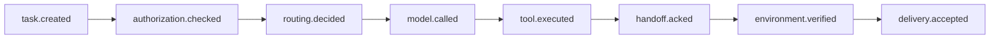
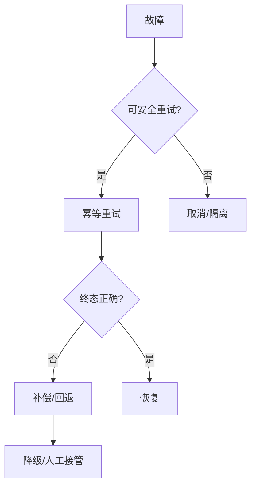

# 第23章　可观测性、成本与可靠性

## 章首导航

### 本章结论

Agent系统的可观测性，不是“日志越多越好”，而是能从一个业务承诺追到任务、授权、路由、尝试、工具、交接、产物、交付、环境终态、成本和责任人。可靠性也不是让调用尽量成功，而是在超时、重复、取消、过载和重启下不伪造完成、不制造重复副作用，并能安全停止、对账、恢复。成本则必须计算一次被业务接受的任务实际消耗了多少模型、工具、基础设施、人工、等待和失败浪费。

### 本章解决

本章建立四项可验收能力：从业务承诺定义SLI、SLO、错误预算与告警动作；用稳定事件信封连接D21完成三面；计算全成本与尾部可靠性；通过无害故障注入验证发现、止损、对账、恢复和训练回流。完成后，团队能回答“是否真正完成、为何失败、花了多少、还能否继续承诺”。

### 本章不解决

本章不重定义C07离线评测、C09工作交互、C11工具合同、C13自动化状态机、C17路由/Handoff或C19安全模型；也不替C21决定发布、升级和生命周期。本章不把动态OpenTelemetry字段写成永久行业合同，不把dashboard或health PASS写成业务成功，更不基于合成运行宣称真实生产可靠性。

### 前置输入、产物与阅读路线

输入为C06运行与消息数据流、C07 task/trial与四层数据、C09任务卡和交付证据包、C11工具合同、C13自动化状态、C20 route/handoff/receipt/join字段及C19事件/audit/incident边界。C17与C19提供受限接口，真实路由、安全与恢复实践仍为 `REVIEW_REQUIRED`；因此相关字段继续标 `provisional/limited` 并预注册回归。[E-C23-031]

交付恰好三件：[A-C23-01观测事件模型](artifacts/A-C23-01-observation-event-model.md)、[A-C23-02 SLI/SLO与成本看板](artifacts/A-C23-02-sli-slo-cost-dashboard.md)、[A-C23-03故障注入报告](artifacts/A-C23-03-fault-injection-report.md)。[E-C23-034] 管理者重点读23.1、23.5、23.8；训练者读23.3、23.8与练习；工程者通读；Agent先加载三件产物，再按事件或故障类型读取相应小节。

## 开场案例：所有组件都显示绿色，客户仍没有收到结果

CASE-B“潮生”定时生成一份活动复盘。scheduler显示`completed`，模型调用200，tool返回success，dashboard上平均延迟下降20%，团队于是把任务计入成功率。第二天业务才发现目标渠道没有内容：provider只确认接收请求，目标端不可见；重试又发布两次。更糟的是，token费用下降来自缩短生成，但人工复核从十分钟升到一小时。

这里没有一个日志说谎，却有四个观察层被混为一谈：技术执行、交付可见、业务验收和单位经济性。修复不能只是新增告警。团队必须用稳定action/idempotency key关联原始attempt和重试；查询目标端终态；把重复发布判为硬失败；把人工、重试与补救计入总成本；重新定义“经审批、目标可见、内容digest一致且无重复”才是good event。这正是本章要建立的观测闭环。[E-C23-004][E-C23-005]

<!-- OPENING-SLICE-2026-10 -->

### 现场切片：一条成功日志，掩盖了两个相反的外部事实

合成案例。发布任务产生 `tool_status=success`，计费系统记录一次调用，用户端却看不到内容；delivery registry 显示 `NOT_DELIVERED`。自动重试后，目标平台晚到的第一条与第二条同时出现，形成重复发布。若事件链只保存工具成功，就无法解释事故。最小链补齐 intent、authority、action、receipt、delivery readback、acceptance 和 effect，系统在终态未知时停止自动重试并转人工对账。

**图 23-1　业务承诺到 SLO（本书绘制）**


图 23-1 把可观测指标锚定到业务承诺；组件绿色不等于客户结果已经实现。

## 23.1 从业务承诺定义 SLI、SLO、错误预算和告警门槛

### 四个对象的精确定义

服务水平指标（Service Level Indicator，SLI）是对某项业务承诺在明确人群、窗口和测量点上的实际表现；服务水平目标（Service Level Objective，SLO）是团队承诺达到的目标区间；错误预算是窗口内允许的普通服务失败额度；告警门槛是触发观察、止损或升级的条件。四者分别回答“测什么、目标是什么、还有多少可承受失败、何时行动”，不可互换。[E-C23-001][E-C23-002]

一个合格SLI至少写九项：service promise、eligible population、good event、bad event、measurement point、window、target、owner和action on breach。“成功率99%”缺少分母与测量点；“模型请求成功率”通常只是内部SLI，不等于客户任务接受率。对于潮生，eligible event是获得合法任务卡、所需输入齐全并进入发布窗口的任务；good event是审批有效、目标端可见、内容版本正确且无重复的交付。

SLO不是越高越专业。目标必须反映业务损失、样本量、用户期待和改进成本。低流量高风险任务可能不适合用一个月百分比；可直接使用“任何未授权支付为零容忍硬门、所有合法任务须逐项对账”。高频低风险任务则可用比例、延迟分位数和错误预算管理日常波动。

### 从承诺反推测量点

定义流程从一句可验证承诺开始，而不是从现有metric开始。先写“在两个工作日内交付经审核、可解引用的研究简报”；再确定eligible任务、开始时点、接受时点、产物与引用规则；最后决定采集哪些事件。若系统现有指标只覆盖模型时延，就承认缺口，而不是把现成指标改名为业务SLO。

测量点必须靠近权威事实。交付可见性由目标系统或受影响主体读回，不由发送端自报；环境变更由目标环境readback，不由tool receipt推断；Artifact有效性由schema、digest和验收器确认，不由文件存在证明。一个SLI可组合多个证据，但每项原始事实仍有权威owner。

### 错误预算是决策协议

错误预算只管理预期服务失败与变更速度，不是把所有风险折算成百分比的容忍池。跨租户泄露、未经授权effect、资金或删除错误、关键证据伪造属于非补偿硬失败；即使本月预算剩余很多，也必须FAIL并进入事故链。[E-C23-003]

预算合同写窗口、目标、eligible数量、bad数量、剩余、短窗/长窗燃尽、owner和动作。短窗高燃尽用于捕捉爆发，长窗用于发现慢性退化。预算接近耗尽时停止扩大自主范围、流量、模型或工具变更，收紧降级与人工验收；耗尽时冻结非修复发布，允许止损、安全修复和恢复验证。阈值由组织按业务损失设定，本书不提供万能数值。

### 告警必须导向动作

告警分三类：症状告警直接对应承诺，如接受率或交付完整率下降；原因告警指向provider、tool、queue或exporter；风险告警指向授权、泄露、重复副作用。症状告警决定业务响应，原因告警帮助定位，风险告警可以越过普通错误预算立即止损。三类不得合并成一个神秘健康分。

每个告警定义owner、去重/冷却、所需上下文、第一动作、升级时限、停止条件和恢复门。没有人负责、没有行动手册或只能“看看日志”的告警是噪声。反过来，沉默也可能是观测失明：告警面板需显示采样率、dropped counter、exporter和数据新鲜度。

### 分母治理与幸存者偏差

eligible、excluded、UNKNOWN、取消、超时和队列丢弃都要报告。把未投递、静默取消或没有ledger的任务从分母删除，会制造虚高成功率。排除只能基于预注册规则，例如用户在执行前合法取消；排除原因和数量需可下钻。结果未知不自动算失败或成功，而是单列REVIEW_REQUIRED并触发补证。

同一个task的多次trial不是多个独立业务承诺；同一故障造成的一百个重试也不是一百个独立根因。看板同时报告task、trial、attempt数量，防止通过改变计数单位美化指标。C07拥有评测分布定义权，C20只把生产观察按可追溯对象汇总。

### CASE-A/B/C的承诺差异

CASE-A“澄明”关注可追溯接受率、引用可解引用率、新鲜度和人工纠错分钟；网页200但正文为空不能算成功。CASE-B关注经审批交付率、目标可见、重复发布与修改轮次；provider ACK不是delivery。CASE-C“北辰”关注授权正确、环境终态、恢复和接管时间；未授权生产effect不能进入错误预算。

### 一次SLI设计工作坊

设计者先拿一张真实任务卡，而不是打开监控系统找现成曲线。第一轮只写用户或业务方实际承诺，例如“每个工作日九点前给出昨日渠道复盘，数据截至七点，所有渠道有来源链接，任何公开发布需审批”。第二轮逐句转成对象：复盘任务的eligible条件、九点这一deadline、七点这一freshness cutoff、渠道集合、Artifact schema、审批和目标端可见性。第三轮决定good event：在窗口内目标端可见、digest与批准版本一致、渠道无缺件、来源可解引用、没有重复发布或高风险残余。

第四轮专门写“不进入分母”的情形。业务方在任务接纳前取消、上游明确声明当天无数据，可以按合同排除；Agent因Queue积压没接上、provider失败、审批等待超时或目标端UNKNOWN不能悄悄排除。第五轮给每个事实指定measurement point：task ledger判eligible，Artifact validator判结构，channel readback判可见，批准服务判binding，人工或确定性验收器判业务接受。只有测量点可访问且访问本身被授权，SLI才可运行。

第六轮选择窗口与决策阈值。日常运营可以看滚动七天与二十八天，事故爆发还需五分钟或一小时短窗；任务量很小时，直接列每个失败而不是用一个看似精确的百分比。第七轮预注册越线动作：轻度燃尽限制新功能，中度燃尽暂停模型/工具更新并扩大人工验收，严重燃尽停止自动发布并启动incident。最后用历史或合成数据回放，确认同一原始事件能稳定进入同一分子、分母和例外。

### 多SLI之间不能简单平均

一个服务可能同时满足高可用、低延迟、正确交付、低成本和安全。它们不是可以任意换算的单一总分。接受率高但重复外发，是可靠性失败；延迟低但内容过期，是业务失败；成本低但跨租户，是安全硬失败。看板可以并列显示，也可以为普通权衡设决策规则，但硬门必须先执行。

适合平均或加权的，只能是预先证明可补偿、同量纲或明确效用函数内的指标。例如同一低风险任务的几种普通质量缺陷可形成综合服务分，但安全、权限、不可逆effect和关键证据缺失仍在分数之外。任何权重变更都版本化，不能在结果出现后调权重把本月“调绿”。

### 告警疲劳与漏报的共同治理

告警数量不是覆盖度。重复的相同根因应按incident key聚合，但每个受影响task仍保留；低价值噪声通过更好的症状、窗口和冷却处理，而不是关闭观测。对不可逆高风险动作，少量高精度硬告警可以直接熔断；对普通延迟，使用多窗口燃尽避免瞬时抖动过度唤醒。

团队定期做“无告警事故”和“无事故告警”复盘。前者查采样、丢弃、错误分母、阈值和共同故障域；后者查指标与业务承诺是否错位。告警优化的验收是更早、更准确地触发正确动作，不是让看板更安静。sentinel若与被监控Gateway、provider和credential共享唯一故障域，也可能同时失明，应给关键链路保留独立探针。

### 低样本、高风险与SLO校准

每天只有三次的高风险任务，不适合用“99.9%”制造精度。报告逐任务终态、连续无事故窗口、最近一次恢复和关键硬门，比小样本百分比更有意义。任务量增加后再引入分位数或比例，并说明task之间是否独立、是否共享同一上游故障。trial数量不能冒充task数量。

SLO初值来自业务损失、历史基线与可实现控制，不是从竞争者宣传或平台默认抄来。先以shadow观测一个完整窗口，分析eligible定义、UNKNOWN与季节性；再由业务、服务和风险owner批准。目标过松会掩盖失败，过严则让预算永久耗尽、告警失去决策价值。调整SLO需留下旧值、原因、影响和生效日。

对于安全与授权，采用硬不变式而非错误预算；对于普通延迟和依赖抖动，使用SLO。两者同时出现在同一任务时先判硬门，再计算普通服务表现。这样“1000次中只有一次越权”不会被写成99.9%可靠。

### 从错误预算到变更节奏

错误预算剩余不意味着必须加速发布，而是提供一个有上限的变更空间。每项模型、Provider、Tool、Skill、adapter或Queue变更预测会影响哪些SLI、需要多少canary流量和回滚时间；若预算已经快速燃尽，推迟非修复变更。安全修复可以在预算耗尽时进入，但仍需最小测试、批准和恢复证据。

预算决策表应防激励错位：团队不能通过缩小eligible population、延后记录bad event或把UNKNOWN排除来“恢复预算”。审计抽样检查原始task与看板分母；分母规则变更从新窗口生效，并显示不可比区间。

**图 23-2　最小事件链（本书绘制）**



图 23-2 定义从任务创建到业务接受的最小事件链，每个事件都可关联 task、actor、版本、证据和成本。

## 23.2 最小事件链：任务、授权、路由、模型、工具、交接、终态和结果

### 一个事件不等于一条证据链

单个日志行只能说明某组件在某时刻观察到什么。可问责事件链至少连接八段：task admission、authority decision、route/runtime selection、execution attempts、approval/handoff、artifact production、delivery observation、reconciliation/acceptance。[E-C23-006] 每段保存owner、稳定ID、版本、时间、原生证据与下一段引用，才能回答“谁代表谁，在什么边界内，对哪个对象做了什么，真实结果如何”。

链的最小主键不是一个`trace_id`。`task_id`标业务意图，`attempt_id`标一次执行，`logical_action_id/idempotency_key`标一次业务副作用，`artifact_id/version/digest`标交付物，`receipt_id`标目标系统确认。trace/span可连接技术调用，但采样或平台边界会中断；业务ID必须在没有完整trace时仍可对账。

### D21完成三面

技术执行面记录trigger、queue、run、模型/tool的实际状态；交付可见面记录目标端是否看到正确Artifact/消息；业务/环境验收面记录正确对象是否达到约定终态及残余。D21要求三面分开。[E-C23-004] `technical=OK`、`delivery=UNKNOWN`、`acceptance=NOT_READY`是合法组合，不能折叠成一个completed。

任务只有在适用层全部闭合、硬门通过且有权验收器签核时才进入PASS。缺关键readback最高REVIEW_REQUIRED；读回证实结果错误为FAIL；安全/授权硬失败直接FAIL。取消、拒绝、降级或停止也可以是合法终态，但必须与任务成功区分。

### 事件信封与原生事实

本书稳定信封包含event id/type、occurred/observed time、producer、tenant/task/attempt/session/trace、actor与authority、operation/target/action/idempotency、D21完成三面、artifact/receipt/readback/decision/cost引用、隐私保留和digest链。平台adapter保存`native_event_ref`和映射版本；字段不可得就写UNKNOWN，不创造伪造span或receipt。

事件信封不要求平台采用同名字段。它是一种最小互操作语义，使OpenClaw run、Hermes execution ledger、外部渠道receipt和本地Artifact可以被同一调查串联。平台原始记录仍是事实来源，信封是版本化索引；adapter错误时可回放与重建。

### 时间语义和乱序

分布式Agent系统同时存在发生时间、观察时间、入库时间和业务生效时间。网络延迟、离线Node、批量export与重试会产生乱序。不能把日志到达顺序当因果顺序；使用parent/action/task/version、幂等键与目标readback重建。时钟偏差超阈值时记录不确定区间，不伪造精确duration。

迟到事件可能改变终态：任务先被标UNKNOWN，后收到原action的receipt，经过readback才转COMMITTED或NOT_COMMITTED。历史记录不覆盖，追加reconciliation事件并引用旧决定。这样既保留当时为何停手，也保留后来如何闭合。

### 权威事实与观察事实

日志、trace、dashboard都是观察，不自动成为业务权威。Queue说“已出队”不证明worker开始；worker说“完成”不证明目标改变；provider说“accepted”不证明用户看见；Artifact存在不证明内容合格。事件模型为每种事实登记authoritative owner与derived view，派生视图必须可回指。

如果两个事实源冲突，系统不选“更乐观”的一个。冻结新副作用，保存两份原件、版本和时间，按目标系统、业务owner或独立验收器仲裁；结果在闭合前保持REVIEW_REQUIRED。证据缺口不能用模型自信填补。

### Handoff与并发的受限接口

C17向本章提供route decision、handoff version、三类ACK、branch、receipt、join、cancel与owner字段；外部authority与真实平台实践仍未验证，所以C20只做provisional adapter，不把接口写成生产冻结。[E-C23-031] Transport ACK只证明载荷接收，Object/Responsibility ACK和owner原子更新才支撑接管；即便接管成功，也不证明外部effect完成。

并发分支各有attempt与artifact，Join事件只能在必需分支终态、取消、receipt和版本闭合时产生。双writer、重复action或丢receipt进入FAIL/RR，不把“多数分支成功”写成整体完成。C20观察C17语义，不重定义路由或合并协议。

### 一条端到端事件链的展开

以潮生发布草稿为例。`task.admitted`记录任务版本、eligible依据和交付owner；`authority.checked`记录允许生成草稿但禁止外发；`route.selected`记录被选Agent、runtime、provider、tool和预算；`run.started`产生attempt；模型生成Artifact后，validator写schema与digest；当业务owner批准特定recipient、payload digest和时间窗时，approval事件引用冻结版本；执行器才创建logical action和稳定幂等键。

渠道返回ACK时写`delivery.provider_acknowledged`，其D21技术层可以OK，交付层仍UNKNOWN。独立reader在目标端看到正确内容后写`delivery.observed`；业务验收器检查版本、重复和可见性，写`task.reconciled`。如果目标端先不可见、十分钟后迟到，链上保留初始UNKNOWN与后续对账，不覆盖成“从未有问题”。若第二attempt使用不同key造成重复，两条delivery都关联同一logical action，重复effect一眼可见。

这条链还能区分成本和责任。模型与tool usage落到各attempt；人工审批和复核落到task；重复补救落到incident；等待时间按occurred/observed拆分。route owner不等于delivery owner，批准者不等于执行者，执行者也不能给自己写acceptance。事故调查无需从聊天猜发生过什么。

### 工程真相

可观测性不是事后“看到一切”的魔法，而是设计时决定哪些状态必须由谁写、以什么ID关联、丢失时怎样降级。没有权威readback的系统，即使trace完整也可能无法证明外部effect；没有采样/丢弃自监控的系统，即使面板零错误也可能只是失明；没有稳定业务ID的系统，即使日志海量也无法安全对账。

因此先设计状态与责任，再布置instrumentation。一个字段只有在生产者、语义、版本、访问、保留和失败行为明确时才是证据。模型生成的自然语言“我已经发送”不是事件；工具返回的任意JSON必须经合同验证；dashboard颜色是派生视图。真正的工程目标是让错误结论难以生成，而不是让调查者有更多文本可搜索。

### 事件链的闭包检查

闭包检查从最终声明逆向走。若声明“客户已收到”，必须找到acceptance和target visibility；再找到对应Artifact digest、delivery receipt、action、approval和task。如果任一引用不存在、版本不匹配、对象跨tenant或时间倒置，则声明降级。若声明“任务未执行”，还要检查是否已有effect_started、远端receipt或迟到事件，避免把观察不到当未发生。

正向检查则从task遍历所有attempt、branch、tool、Artifact、delivery和incident，确认没有孤儿。孤儿attempt可能代表未计成本，孤儿effect可能代表未对账副作用，孤儿Artifact可能代表无人验收，孤儿告警可能代表无owner。正向和逆向都闭合，事件链才足以支撑声明。

### Schema演进与历史回放

事件schema变化不重写旧事实。新版本增加字段时，旧事件保持原始版本，读取层给出明确的缺失；枚举改义必须新建版本而非复用字符串。adapter升级前用一组历史fixture回放，比较业务语义、三层终态、成本与硬门；只有非语义字段变化才允许无人工迁移。

历史回放也测试closed-world边界。未知event type、未知terminal enum、额外嵌套字段和重复event id都不能被静默吞掉。未知但无硬失败进入REVIEW_REQUIRED；重复ID不同digest或伪造receipt为FAIL。这样未来平台更新不会通过宽松解析悄悄改变过去的成功率。

### 身份、版本与重复事件

`event_id`只能标一个不可变事件；同ID同digest的重复传输可去重，同ID不同digest意味着冲突或篡改，必须FAIL。`attempt_id`每次执行不同，`logical_action_id`与幂等键在同一业务动作重试间稳定。把三者混用，会导致成本重复、effect漏算或错误去重。

producer身份与adapter身份都进入信封。平台服务产生原始事实，adapter只映射；adapter不得把自己的观察时间写成事件发生时间，也不得改变producer。映射后digest覆盖规范化字段，原始digest仍保留。若原生系统没有稳定ID，可由受控ingest生成索引ID，但明确其不是源端身份。

任务和对象版本同样重要。旧任务的迟到receipt只能闭合旧action，不能应用到新版本；旧Artifact验收不能证明修改后的Artifact；旧approval不能覆盖新的recipient或参数。事件查询默认带tenant、object与version，防同名对象串线。

### 证据冲突的仲裁顺序

当run说ERROR而目标readback显示CHANGED，优先认定“技术错误但effect发生”，停止重试并对账；当provider ACK而目标不可见，delivery仍UNKNOWN/FAIL；当Artifact digest正确但业务规则不满足，acceptance FAIL；当audit缺失而普通log存在，关键授权结论仍RR。顺序依据每种事实的权威owner，而非哪个组件更“底层”。

仲裁保留冲突双方、时间、版本和采集方法。修复adapter后重新计算派生看板，但不覆盖原始决策；需要更正历史结论时发布superseding decision。这样既允许纠错，又能追踪当时为什么采取某项行动。

## 23.3 轨迹、日志、指标、产物、决策记录与责任人的关联

### 六类载体各司其职

Metric擅长多少、速率、比例与分布；Trace展示一次运行跨组件的parent/child；Log提供局部错误与慢路径上下文；Audit记录主体、授权、动作和客体；Artifact/run record保存交付与复现输入输出；Decision/incident record保存为何批准、止损、降级、恢复或接受残余。六者需要共同关联键，却不能互相冒充。[E-C23-007]

Metric不能证明某次任务发生了什么；trace不能天然满足法律审计；audit不应收集全部prompt与中间内容；log不是严格全序；Artifact不是任务终态；事故报告也不能替代原始事件。将它们都倒入一个搜索框，并不会自动形成证据链。

### Observable trajectory的边界

可观察轨迹包含消息、模型/工具调用、policy与approval、route/handoff、队列、错误、恢复和资源事件。它不要求模型私有思维链，也不假设所有平台能提供同等细节。为了复现决策，应保存输入/输出摘要或digest、结构化参数、版本与环境，不以采集敏感推理内容换取“完整”。

轨迹必须覆盖失败和被拒动作。只存成功路径会让安全拒绝、fallback、重试与人工接管消失；只存最终回复会把系统退化误归模型。观察不到某一步就标coverage gap，不补写虚构事件。

### 关联责任人，而非只关联组件

每条关键事件至少有producer、technical owner、business owner或risk owner之一。执行Agent产生事件不等于它拥有决定权；approval owner、credential owner、service owner和incident commander职责不同。事故中要能回答谁接收告警、谁能停接纳、谁能撤销能力、谁判断业务影响、谁接受残余。

责任映射也防“告警孤儿”。一项SLI即使设计完美，没有owner和越线动作仍不可用。owner变更产生版本事件，交接未闭合时原owner继续负责或显式共同监护，不能进入无人区。

### 观测数据本身也是高风险资产

prompt、response、tool args/result、system instruction、客户标识和错误堆栈可能含秘密与个人数据。默认metadata-only；内容采集需要明确调试目的、最小对象、访问审批、短期保留、redaction与删除。redaction只是best effort，不能成为无限采集许可。[E-C23-011]

观测后端按tenant、环境与职责隔离；执行Agent不能删除或改写自己的关键audit。导出到第三方前执行数据分类与egress检查；用无价值canary测试日志、trace与exporter是否泄露。C22 的安全接口仍受真实平台证据限制；本章只使用其最小化采集与强制边界合同，接口或证据状态变化后必须回归。[E-C23-031]

### 完整性、缺口与不可见失败

数据完整性不仅是digest。还要观察采样率、exporter状态、队列积压、series cap、dropped event、时钟偏差、schema拒绝和retention删除。若collector失效而业务仍运行，系统必须显示“观测缺口起于何时”，不能把零错误当健康。

硬安全事件、授权决定和关键effect不应依赖普通随机采样；即使trace被采样，独立audit、receipt与Artifact仍需保留。关键日志可用追加存储、digest链与独立权限降低篡改风险，但任何实现都应说明范围和残余，不写“绝对不可篡改”。

### 基数预算

task/attempt/trace等高基数ID进入trace、log和受控下钻索引；metric label只放有限task class、risk、status、version、provider/tool family等。用户全文、完整URL、文件名和随机错误文本会造成series爆炸，也可能泄露数据。[E-C23-012]

每项metric预先定义label集合、允许值规模、series预算和超限策略。超限时不是静默丢弃，而是归类为`other`、拒绝新series或降低粒度，同时增加dropped counter和告警。看板必须显示该缺口，否则所有比率失去可信分母。

### 证据最小充分性

低风险只读任务可以依靠task、run、Artifact与acceptance；高风险外发/交易/删除/生产变更还需authority、approval binding、credential、effect receipt与environment readback。证据不是越多越好，而是每个关键结论有独立、最小、可解引用的事实。

保留策略按业务、事故、隐私与复现需要分层。短期高细节debug记录到期删除；聚合指标可保留更久；关键事故证据进入受控仓。删除观测数据本身要有审计，避免执行者以“隐私清理”抹去事故。

### 从“插日志”转向观测设计

实施顺序应从业务状态图开始。先列admitted、running、effect-started、delivery-unknown、reconciled、accepted等必须可区分的状态；再为每个迁移指定producer、guard、证据和失败。最后选择metric、trace、log或audit承载，而不是每个函数入口都打印一行。这样可以避免海量“开始/结束”日志，却遗漏批准、幂等、目标readback等关键事实。

对每个外部边界做一对事件：发出前记录冻结请求与action id，返回后记录transport/receipt，稍后记录权威readback。对于Queue做入队、claim、lease renew、terminal和reconcile；对于Handoff做transport/object/responsibility ACK；对于Artifact做produced、validated、delivered、accepted。共同模式是“意图、尝试、观察、权威终态”分开。

### 调试内容捕获的临时窗口

只有metadata不足以定位时，才能开临时内容捕获。申请写具体tenant、任务类、字段、采样率、起止时间、可访问角色、过滤器与删除；不得全局永久开启。捕获前用合成canary测试redaction和exporter，确认system instruction、credential、无关第三方数据不会进入。

窗口结束自动关闭并验证删除，同时保留必要的schema、digest和调查结论。若redaction漏canary，立即停止export、隔离观测存储、评估已发送副本并按C19事故处理。修复后回归不能只测试相同字符串，还要测试编码、嵌套、tool result和附件变体。

### 观测后端的可靠性预算

观测系统也会过载、延迟和丢数据。它需要独立SLI：关键事件写入率、export延迟、dropped比例、查询新鲜度、schema拒绝、tenant隔离和事故证据可用性。普通trace丢失可以按预算管理，authority、关键effect和安全audit缺失通常是硬门或RR。

不要让业务运行完全依赖一个脆弱collector，也不要让观测失败永远不影响业务。低风险任务可在已披露缺口下继续，降低声明范围；高风险变更若失去独立audit/readback，则停止或要求人工替代证据。策略应在故障前定义，避免事故中临时降低标准。

### 取证重建练习

给调查者一组被打乱的原生事件，要求只用ID、版本、digest、occurred/observed time和权威readback重建。故意删除一个span、延迟一个receipt、复制一个event id并更改digest。合格结果应识别已知事实、推断和未知，不能为时间线好看而补事件。

另一名评审者从最终声明反向验证，检查每个结论是否可解引用。二者不一致时保留争议日志并重放adapter。这种练习比“会用某个日志查询界面”更接近长期能力，因为平台工具会变，而证据推理与边界不会。

## 23.4 OpenTelemetry、Prometheus 与平台日志：固定语义，不固化变化字段

### 固定对象关系，版本化字段映射

本章固定task、attempt、actor、authority、operation、artifact、delivery、acceptance、cost和incident的关系，不固定任一平台的字段拼写。OpenTelemetry语义约定的不同部分稳定度不同，GenAI/agent/tool/usage属性也在演进；内容字段还可能携带敏感数据。[E-C23-008][E-C23-009]

adapter表记录本书字段、平台原生字段、平台/规范版本、稳定度、转换、丢失信息、测试与owner。动态字段变名只更新adapter；语义改变则生成新schema版本、迁移计划与不可比时间窗。不能为了统一而伪造平台不存在的run id、span或token明细。

### 错误语义的一致与边界

同一操作在span与metric中应使用一致error type，成功不附错误类型；这样聚合与下钻才不会互相矛盾。[E-C23-010] 但错误编码一致不证明业务恢复，`status=OK`也不证明交付。C20继续保存D21完成三面与environment readback，避免遥测标准被误用为业务验收标准。

错误分类采用有界枚举，如provider_overload、validation、policy_denied、timeout、delivery_unknown、environment_diverged；未知保留原始码并映射`other/unknown`，同时可下钻。把完整错误字符串放label会造成基数爆炸；只保存受控摘要和安全原文引用。

### OpenClaw固定版镜面

在固定提交`eb377ac`，OpenClaw区分audit、logging、diagnostics与telemetry；audit是有界、尽力、metadata-only运行/工具账本，启用不会回填历史，不应写成无损合规档案。[E-C23-024] 内容捕获默认关闭，符合最小化原则；需要调试时仍要按租户、目的和期限治理。

固定版Prometheus插件提供带认证的run/model/tool/message/delivery/RPC/queue/cost聚合，并显式暴露series/异步队列丢弃风险。[E-C23-025] scrape成功只说明指标端点可读，不证明Agent任务成功。C23 adapter从这些聚合读取内部健康，再用C09交付包和目标readback补齐业务终态。

固定版JSONL日志支持滚动、级别、redaction和慢路径诊断；redaction仍有边界，内部handler返回或possible write不能推出客户端收到。[E-C23-026] 审查时分别验证文件日志、audit、OTel export、Prometheus和doctor，不把其中一个PASS外推其余组件。

### Hermes固定版与动态文档

Hermes固定提交`f80f453`的`state.db`记录session、message、token、billing/cost、usage attribution和lineage，适合会话与用量对账；SQLite/WAL并不自动使其成为不可篡改audit或端到端trace。[E-C23-027]

固定版cron execution ledger在执行前登记attempt，并区分claimed、running、completed、failed、unknown；重启遗留unknown不自动重跑，符合“UNKNOWN先对账”。[E-C23-028] dashboard可展示session、logs、token/cost、cron和doctor，但它是聚合/读取表面，必须回指数据库和运行证据。

当前动态Cron文档中的incident、delivery failure与doctor能力另列`OFFICIAL-DOC-DYNAMIC`，不得倒灌为0.23.1固定事实。[E-C23-029] 目标部署若未实测，字段标unavailable或RR，不强套OpenClaw schema。

### Muse与其他动态产品界面

Muse公开的Activity、Artifacts、permissions等只作为“用户需要看到行动、产物和控制”的产品镜面，统一标`VENDOR-CLAIM`。[E-C23-030] 本书不推断其内部telemetry schema、成本准确性、SLO、事故响应或日志完整性，也不以界面截图做独立可靠性证明。

OpenAI tracing/evals与Anthropic eval工程文章可说明trace、数据集、多trial和生产监控的实践价值，但它们是动态官方文档/厂商工程指导，不是OpenClaw或Hermes实现事实。C20用其启发adapter与回流，不把产品API固定进慢速原理层。[E-C23-037]

### 适配器验收

每个adapter用正常、缺字段、未知枚举、乱序、重复ID、版本漂移、采样和敏感内容场景测试。输出必须closed-world：未知字段保留在native extension，未知枚举进入RR；重复event id不同digest为FAIL；内容默认不导出。映射成功率、丢字段与版本进入看板。

平台升级前回放历史fixture，比较同一原始事件的稳定信封；差异若只来自字段重命名，adapter升级即可；若完成语义或状态机改变，则C20、C21共同评审。任何“自动选择最接近枚举”的逻辑都会把未知伪装成事实。

### OpenTelemetry语义约定的正确使用姿势

OTel为trace、metric、log及语义属性提供共同语言，但C20不要求“所有事件都变成span”。长生命周期业务状态、批准、Artifact和事故决定往往需要持久记录；span适合一次操作的时间与父子关系。metric从稳定事件派生，audit保存权限与高风险动作，业务ledger保存权威状态。先选证据职责，再选择信号类型。

GenAI相关属性可表达模型、usage、agent和tool，但内容字段可能携带prompt、system instruction、tool args/result。默认只记录model/provider/version、usage、latency、status与安全摘要；需要内容时使用受控临时窗口。字段处于Development或迁移中，就在adapter记录稳定度和规范版本，不将其写进跨平台硬合同。

### Prometheus看板的常见错觉

Prometheus擅长聚合与告警，但scrape间隔会漏瞬时状态，counter重启需处理，histogram边界影响分位估计，高基数会造成丢弃和成本。看板必须展示数据源、窗口、样本、最后更新时间、采样/丢弃和版本；同名metric在升级后语义改变时划出不可比区间。

从metric下钻到event/run时使用受控exemplar或索引，不把完整task id放进label。若一项比例无法回到样本与失败类别，至少说明聚合边界。看板不是证据终点，而是发现异常与选择调查对象的入口。

### 日志级别、轮转与错误预算

debug日志适合短期诊断，info记录关键生命周期，warn表示需要关注但未必失败，error表示当前操作失败或无法判断；级别定义由组件版本管理，不能用不同团队的习惯直接比较。日志轮转防磁盘耗尽，但要确保关键audit与incident证据另有保留。

日志写入失败也需要信号。业务是否继续取决于任务风险：低风险可降级并显著标观测缺口；高风险需要可验证audit时应停。不要在日志系统不可用时把敏感内容写到stdout或聊天作为“临时方案”。

### 三平台迁移时的最小共同面

跨OpenClaw与Hermes迁移，最小共同面不是相同配置字段，而是task/attempt、技术状态、delivery/acceptance、artifact/receipt/readback、usage/cost、queue/retry/cancel与incident引用。OpenClaw的run/OTel/Prometheus和Hermes的session/execution ledger分别映射，缺项保留unavailable。

Muse只能消费用户可见Activity、Artifacts和permissions相关公开材料；如果没有数据导出、事件schema或独立试用，就不能填充内部字段。统一看板可以显示UNKNOWN，但不得为视觉完整编造零值。零代表测量到没有，UNKNOWN代表没有可靠测量，两者是完全不同的运营状态。

### 平台实施的四阶段验证

第一阶段做静态核对：固定版本文档/源码、配置schema、插件与依赖，确认某能力存在的范围。第二阶段读取目标配置，确认logging、audit、OTel、Prometheus、doctor、session DB或cron ledger计划如何启用。第三阶段在隔离runtime用正常与拒绝探针读回有效状态，检查采样、redaction、dropped信号、Queue和成本关联。第四阶段才用代表性shadow任务验证业务三层与事故恢复。

每阶段结论有不同上限。源码有指标不等于目标启用；配置启用不等于export成功；export成功不等于任务完成；合成probe也不等于生产分布。部署报告逐层标SOURCE-BASED、TARGET-CONFIGURED、RUNTIME-OBSERVED和REPRESENTATIVE-VALIDATED，避免一句“已接入可观测性”掩盖差异。

OpenClaw目标验证重点包括Gateway/run/session、tool、message/delivery、queue、cost、audit writer和doctor；Hermes重点包括state.db、execution ledger、gateway logs、analytics与动态docs差异。两者都需验证内容最小化、tenant访问和丢弃。Muse没有开放同等面时，只报告公开体验，不能补齐虚构字段。

### 可观测性供应链

collector、exporter、dashboard、存储、告警规则与adapter本身是软件供应链。版本升级可能改变采样、属性、redaction、retention或费用。为它们保存来源、版本、digest、配置、权限、网络目标、回滚和测试；未知插件或未经批准export目标不得接触生产观测。

观测供应链被攻陷可能同时泄露数据和伪造“系统健康”。关键audit与业务readback尽量不与普通dashboard共享唯一写入链；canary与完整性检查由独立owner观察。升级后用固定fixture验证事件数、敏感字段、错误类型和D21映射，没有通过前不重算长期趋势。

## 23.5 Token、模型、工具、存储、人工复核和机会成本

### 总成本的定义

单任务总成本至少包括模型token/请求、工具与外部API、计算/存储/网络、人工复核、重试失败浪费、事故补救、排队/延迟与机会成本。[E-C23-013] token单价只是模型成本估算的一部分；少用token但多一小时人工，不能写成更经济。

成本信封绑定task、全部attempt、是否被接受、定价版本、币种、估算/实际、置信度和时间窗。模型细分输入、输出、推理、cache读写；工具细分调用与第三方费用；基础设施细分计算、持久化、网络和观测；人工记录分钟与费率；失败记录retry waste和remediation。

### 四个不可缺的经济指标

`cost_per_attempt`揭示技术退化；`cost_per_accepted_task`接近业务单位价值；`failure_waste_ratio`显示失败、重复、取消后工作占比；`human_minutes_per_accepted_task`防“自动化”把成本转给审核者。[E-C23-014] 四项并列，且task/attempt分母预先固定。

每个指标同时报告分布和样本数。少数长任务或事故会主导总成本，仅报均值会掩盖。对于三案，还要按任务类型、风险、provider/tool、版本与人工门分层；不能把CASE-A低风险草稿的成本外推CASE-C高风险变更。

### 估算、账单与机会成本

估算价带pricing version、币种、税费/折扣处理；实际账单可能滞后，两者不混为同一精度。工具没有公开单价、人工费率缺失或共享基础设施无法分摊时，confidence写PARTIAL/UNKNOWN，不称“总成本”。

机会成本只有方法清楚才进入金额。例如延迟导致错过发布窗口，可以按已批准业务模型估计；不能凭感觉给每秒延迟定价。无法合理估算时报告queue/elapsed、受阻任务数量和业务影响描述，比制造一个精确美元数更诚实。

### 成本与质量、安全的联合门

成本优化只能在相同任务、预算、权限、风险和成功定义下比较。更便宜的模型若增加错误、人工、重试或安全风险，不是同等替代。高风险安全失败不可由成本节省补偿；成本超预算则可触发降级、暂停或人工决定，但不能自动取消安全控制。

错误预算与成本预算也不相同。前者管理服务失败，后者限制资源消耗；重试必须同时检查deadline、attempt、cost和error budget。一个任务即使还有费用，也不应在provider过载时无限重试；一个SLO尚有余量，也不应超过用户批准成本。

### 成本归因与共享资源

多Agent任务把共同上下文复制、路由、Handoff、评审、冲突、合并和恢复计入协作税，但定义权仍在C16。C20只按task/branch/attempt归集可观察资源。共享cache或批量API需声明分摊方法，避免把基础设施成本隐藏在“免费”。

失败归因不是问责定罪。先把费用关联agent/runtime/provider/tool/policy/human/infrastructure候选域，再由证据仲裁。若观测缺失导致无法归因，成本仍进入总额并标unallocated，不能从看板消失。

### 三案的成本边界

澄明的检索、网页工具、来源核验与专家纠错可能超过模型费；潮生的修改轮次、审批等待、渠道费和重复发布补救必须计入；北辰的预防性复核、隔离环境、演练和事故恢复是可靠运行成本，不是“异常可忽略项”。

单位经济性最后仍需业务owner解释。低成本高错误率不值得，高成本高风险任务也未必该自动化。看板给事实与不确定性，不替组织决定价值。

### 成本核算的逐步算法

第一步以task为业务分母，收集其全部attempt、branch、tool call和人工checkpoint，不能只取成功run。第二步对每条usage标MEASURED、ESTIMATED、PARTIAL或UNKNOWN；actual invoice滞后时与估算分栏。第三步把重复、取消后继续、失败恢复和事故补救归入failure/remediation，不摊薄到正常任务。第四步按accepted、failed、RR分别汇总。

第五步计算四个核心指标，同时报告中位、尾部与样本。`cost_per_attempt=全部可归属成本/attempt`；`cost_per_accepted_task=窗口全部任务成本/accepted task`时，应明确失败成本是否纳入，推荐纳入以反映真实经营；`failure_waste_ratio=失败、重复和无价值尝试成本/全部观察成本`；人工分钟按接受任务计。第六步将unallocated与UNKNOWN单列，不用零代替。

### 一个“便宜模型”的反例

基线模型每个task花1美元，九成一次通过，人工五分钟；候选模型只花0.4美元，却只有六成一次通过，平均两次重试，人工二十分钟。若只看单次模型费，候选下降60%；若把重试、工具、等待和人工计入每接受任务，可能更贵、更慢。还需比较相同权限和风险：若候选更频繁请求高权工具，不能只用成本决定。

相反，昂贵模型也不天然更经济。它可能延迟更高、上下文费用更大，却没有降低人工或失败。正式比较冻结task、数据、预算、tool、grader和成功条件，多次运行并保留失败尾部。没有同口径证据，只能写“观察到费用差异”，不能写“性价比更高”。

### 人工成本不是需要被消灭的噪音

高风险任务的独立复核、双批和事故指挥是必要治理成本。优化目标是把人工放在价值判断与例外，而不是为了自动化率删除安全门。看板将预防性复核与返工/补救分开：前者可能是设计所需，后者反映质量或流程问题。

人工等待也应观测，但不能把审批者当“慢组件”简单绕过。检查请求是否清晰、批次是否合理、是否夜间噪声、权限是否过宽和是否需要更早准备。优化审批界面与任务分解，不能用默认允许缩短队列。

### 成本上限与停止合同

每项任务在开始前有模型、tool、attempt、人工、wall time和总费用上限。接近上限时Agent可以缩小搜索、降为草稿、请求更多预算或停止；不能隐藏消耗或擅自扩大。预算扩展是新批准，绑定任务版本与新增范围。

事故与恢复有独立应急预算，防止正常任务预算耗尽后无法止损。但应急预算只用于隔离、对账与恢复，不自动授权继续业务effect。事后把应急成本归入incident，进入容量与产品决策。

### 机会成本的诚实表达

对于发布窗口、库存、客户响应等可量化场景，可由业务owner给出延迟损失模型；C20记录模型版本和区间，不把不确定估算与真实账单相加为“精确总成本”。对知识研究等难量化任务，报告受阻小时、错过时点和替代工作，而非虚构货币。

机会成本也包括占用稀缺人工、GPU、工具配额和高权窗口。Queue prioritization若让低价值长任务阻塞事故恢复，损失不仅是延迟。容量看板用任务价值和风险辅助准入，但价值排序不能覆盖合法性与授权硬门。

### 成本数据质量

成本数据也有迟到、重复、缺失和版本漂移。模型usage可能在响应后到达，工具账单按日汇总，人工分钟依赖登记，云费用要延迟分摊。事件信封记录`observed_at`和成本置信；看板允许初始ESTIMATED，账单到达后追加reconciliation，不覆盖原估算。

重复usage按provider request/attempt去重；缓存命中、批量调用和共享计算用明示方法分摊。价格表升级划分时间窗，历史任务按当时价格重算或保留actual，不能用今天价格无说明改写昨天。汇率、税费和折扣都写口径。

成本异常也可能是可靠性信号：token突增可能来自上下文污染或循环，tool费突增可能来自重复，人工分钟突增可能来自质量退化，观测费用突增可能来自基数爆炸。告警先限制影响与查事件链，不自动假设“模型变贵”。

### 把预算写进运行时决定

预算不是报告末尾的统计项。admission时检查任务总预算；每attempt前扣留预计额度；完成后用实际/估算结算；剩余不足时进入预注册降级。多Agent分支分配子预算，未使用可归还，但一个分支不能私自借用安全/恢复预留。

预算读数迟到时采用保守上界，避免“账单未到所以免费”。若某provider无法提供足够usage，confidence降级，设置调用次数和wall time硬上限。管理者可以批准追加预算，但新批准需绑定任务版本、理由和最大值。

**图 23-3　可靠性恢复阶梯（本书绘制）**



图 23-3 给出重试、取消、补偿、回退和降级的选择顺序，防止把所有故障都交给重试。

## 23.6 超时、重试、取消、幂等、补偿、降级和优雅失败

### 一次尝试的可靠状态

可靠尝试遵循`ADMITTED → STARTED → EFFECT_STARTED? → OBSERVED_TERMINAL? → RECONCILED → ACCEPTED/REJECTED/REVIEW_REQUIRED`。timeout只表示观察者等待窗口结束，cancel只表示某边界收到请求，都不证明远端未执行或副作用已回滚。[E-C23-016]

因此每个attempt同时记录observer状态、执行状态、effect状态和验收状态。等待者超时后不把run标failed；controller收到cancel ACK后还要看到stop observed、child终止、租约释放和effect对账。任何层未知，整体不盲转PASS/FAIL。

### 重试资格门

自动重试必须同时满足：错误类型在可重试表；操作无副作用，或服务端用稳定业务幂等键持久去重，或有已验证补偿；deadline、attempt、cost与错误预算充足；采用bounded exponential backoff与jitter；所有attempt关联同一task/action；最终对账。[E-C23-017]

validation、policy denied、approval denied、schema/content invalid等永久错误不靠多试几次解决。provider overload、连接瞬断可条件重试，但应尊重retry-after与全局负载。外发、支付、删除、权限和生产变更默认查询优先，不因response丢失创建新ID。

### 幂等不是一个随机请求ID

幂等键绑定业务动作与冻结参数，在相同逻辑动作的所有attempt保持稳定，由目标服务持久去重。client生成不同UUID只能区分请求，不能阻止重复业务effect。执行器保存key、参数digest、目标、receipt和readback；参数变化形成新动作与新授权。

receipt丢失时按原key、业务对象和时间窗查询，得到COMMITTED、NOT_COMMITTED或STILL_UNKNOWN。只有确认NOT_COMMITTED且authority仍有效才重试；STILL_UNKNOWN映射REVIEW_REQUIRED并升级。[E-C23-018] 查询本身也有权限、成本和失败路径。

### 取消与中止的真相

取消至少分requested、acknowledged、stopping、stop observed、effects reconciled。子Agent、Node、browser、tool进程和外部服务可能各自继续；UI从列表消失不是停止。系统逐层传播cancel并保留迟到事件，直到所有在途对象有终态或隔离。

cancel后effect已提交时，不能通过“任务取消”抹去；进入补偿或残余。cancel竞态导致completed-before-cancel是合法事实，按原任务验收，不伪装为未执行。未确认的旧worker通过fencing token阻止继续写。

### 补偿是一项新动作

补偿不是时光倒流。撤回消息可能已被阅读，退款与原交易不同，恢复文件不恢复外部索引，回滚配置不消除已泄露数据。补偿有自己的authority、参数、幂等、receipt、失败和残余；不可逆部分由risk owner接受。

设计补偿时先列可逆、可部分逆和不可逆effect。可逆动作预建回滚并试跑；部分可逆先止损和通知；不可逆高风险提高事前门。补偿失败不被原任务成功平均，继续留在事故记录。

### 降级与优雅失败

降级是预先批准的较低功能合同，例如自动发布降为本地草稿、实时检索降为带时间戳缓存、多Agent降为单体只读。降级不能扩大权限、降低安全硬门或隐藏新鲜度。[E-C23-019] 输出明确说明缺失与替代，不用过期数据冒充最新。

没有安全降级路径时，正确行为是拒绝、暂停或升级人类。所谓“尽量给答案”可能制造伪事实和不可见风险。把优雅失败纳入成功标准：在依赖失败时诚实停止、保留证据并给出下一步，本身是可靠能力。

### 恢复与断点续作

checkpoint必须绑定task/version、completed steps、artifact digest、effect/receipt、lease、authority TTL与环境快照。重启后先fence旧worker，读取权威状态，核对child、queue和外部effect，再决定继续、补偿或人工。文件存在不能证明租约、权限和环境一致。

恢复使用原task/action/idempotency，避免把新run当新业务动作。若配置、policy、tool版本或授权已变化，旧checkpoint只能作为证据，不能直接续作。恢复完成还需D21完成三面验收与同故障回归。

### 错误分类决定动作，而不是文案

错误分类至少区分transient provider、rate limit、permanent validation、policy/approval denied、resource exhausted、dependency unavailable、delivery unknown、environment diverged和security hard failure。分类来源是状态与证据，不根据错误消息里是否出现“temporary”决定；外部服务的任意文本也是不可信输入。

每类预先绑定是否可重试、最大attempt、deadline、backoff、需要的readback、允许降级、owner与最终状态。分类未知时不使用“默认可重试”，而是REVIEW_REQUIRED。classification adapter变更需要历史fixture回归，防升级后把永久错误误归瞬时。

### 超时发生在哪个边界

客户端等待超时、Queue claim超时、模型deadline、tool deadline、外部provider timeout和业务deadline含义不同。客户端离开不停止服务端；Queue lease过期不证明旧worker停止；tool返回timeout可能发生在commit前或后；业务deadline到期可能要求停止交付，但仍需对账已经发生的effect。

事件记录timeout owner、起止、是否发cancel、执行面响应、effect phase和下一动作。重试资格取决于effect phase与幂等，而不是只看HTTP错误。对高风险动作，commit前后边界未知就先查询或人工，不用低延迟目标迫使盲重试。

### 重试预算的四重限制

attempt budget限制次数，deadline budget限制剩余时间，cost budget限制资源，error budget限制对服务承诺的额外压力。任一耗尽即停止或降级。全局retry budget防所有客户端同时放大；每tenant budget防一个租户抢占；每logical action budget防单任务失控。

指数退避与jitter只是调度策略，不能赋予重试资格。server提示retry-after仍要受本地deadline与预算；fallback模型/工具也算新尝试，并需验证权限、质量和数据位置。静默fallback会破坏可比性和风险边界，必须生成事件。

### 幂等键的生命周期

键在业务动作提案冻结后生成，绑定actor/tenant/action/object/参数digest与时间窗；批准和tool contract引用同一digest。所有网络重试保持键不变，目标服务把键与结果持久化到足够长的去重窗口。键过期、对象版本变化或授权失效后，不可继续复用。

如果目标不支持幂等，执行器只能选择只查询、人工单步、事务性outbox或业务补偿等替代；不能在文档里声称“客户端已幂等”。幂等防重复，不保证动作正确；错误对象被稳定执行一次仍是FAIL。

### 补偿的残余账本

每项补偿记录原effect、补偿action、authority、receipt、环境readback与残余。邮件撤回后仍可能被转发，退款后时间价值和手续费仍在，数据库回滚后外部订阅者可能已消费事件。残余进入incident和业务通报，不因补偿成功消失。

补偿失败时避免递归自动补偿。设置最大层级和人工升级；多个补偿相互依赖时按有向图排序。若无法安全恢复，保持隔离并明确服务降级，不能为了恢复SLO制造更大影响。

### 优雅失败的用户合同

用户看到的是事实状态和下一步，而不是内部异常堆栈。合格提示说明哪些完成、哪些未完成、是否产生effect、证据何在、谁接管和预计何时更新；不承诺未知。对于草稿降级，标注数据时间、缺失来源与禁止发布；对于人工接管，提供冻结Artifact和风险，而不是让人从头猜。

优雅失败也需要指标：正确停止率、UNKNOWN升级时长、降级使用率、用户重复提交与恢复接受率。过多降级可能掩盖长期容量不足，不能因为没有硬失败就忽略。

### 故障组合比单点更危险

真实事故常是timeout、exporter缺口、Queue重启和人员误判叠加。组合测试先制造provider迟缓，再让collector丢事件，随后cancel并重启；验证系统是否把“看不到run”误判停止、是否重放副作用、是否在新worker与旧lease之间双写。单项测试全PASS也不能替代组合。

组合场景设置严格停止条件和虚构effect，防故障注入本身失控。每次只增加可解释变量，保留正常基线与中间状态；否则RCA无法分离根因。安全硬失败一旦触发立即终止实验，不为收集更多数据继续攻击。

### 可靠性状态机的四个反例

第一个反例是`TIMEOUT → FAILED → RETRY`。timeout只说明观察者没等到结果，正确路线是cancel/query/reconcile，再决定。第二个是`CANCEL_ACK → CANCELED`，忽略child和effect；正确路线要等stop observed与effects reconciled。第三个是`PROCESS_RESTARTED → RECOVERED`，忽略lease、Artifact和环境；正确恢复以权威终态闭合。第四个是`COMPENSATION_SENT → ROLLED_BACK`，忽略补偿本身失败和不可逆残余。

将这些非法跳转写进测试，比提醒开发者“谨慎”更有效。每个平台adapter若只提供一个completed/failed布尔，就在本书状态机中保留信息不足，不能自动补全。必要时引入中间UNKNOWN/RR，牺牲表面简洁换取不误执行。

### 多Provider fallback的可靠性陷阱

fallback可能改变模型行为、工具格式、数据地域、价格、延迟和安全边界。只有候选Provider预先通过同任务、权限、预算、数据位置和schema合同，才可在显式错误类下切换；每次切换生成attempt并记录原因。严格模型要求或高风险任务不允许为了可用率静默降级。

fallback后也不能复用不兼容的缓存、tool result或approval。输出需要重新验收，成本按两个attempt计。若fallback提高技术成功但降低业务接受，SLO应暴露而非把它计成功。

### 人工接管不是无限重试的终点

升级给人时提交task/version、已完成/未完成、effect/receipt、未知、Artifact、预算和建议动作。人工不应重复已经UNKNOWN的高风险操作；先用同一action id对账。接管决定写incident/decision record，后续自动化只执行明确授权范围。

若无人可用，系统进入安全等待、只读或停止，而不是把“需要人工”当成允许继续。人工接管时延可做运营SLI，但不能为了降低它绕过职责分离。

## 23.7 容量、并发、限流、Queue、单任务经济性和尾部延迟

### 容量是一个流动系统

至少联合观察arrival rate、admission rate、queue depth、queue age、active concurrency、service time、provider/tool saturation、rate-limit/error、retry rate、completion/acceptance和memory/storage pressure。[E-C23-020] CPU低并不表示有容量：系统可能在等tool、approval、handoff或delivery。

Little式直觉可帮助理解等待，但Agent任务时长分布、优先级和外部依赖经常不稳定，不能机械套一个平均数。容量计划按任务类型、风险和服务时间分层，并保留恢复/事故通道。高风险短任务可能比低价值长任务优先。

### 三道过载门

第一道是admission control：按tenant、任务类、风险和预算拒绝或延后新工作。第二道是在资源保守下隔离：保留关键与恢复容量，防一个tenant或长任务耗尽并发。第三道是load shedding/degradation：丢弃可重建低价值工作、暂停非关键自动化、拒绝无预算retry，并向用户暴露延迟或降级。

过载时继续接纳再排队，只会把失败变成更晚的失败。Queue age与depth同时看：短队列可能有饥饿老任务，长队列可能是可快速处理的批量。retry不能与新请求共享无限资源，否则故障流量会压垮健康流量。[E-C23-021]

### 公平、优先级与隔离

按tenant、任务类和故障域设置并发/速率配额；优先级不等于无限抢占。恢复、撤销、审计与人工接管保留独立lane，避免系统满载时连止损都排不进去。一个tenant达到上限时只影响其新接纳，不拖垮全局。

priority inversion、head-of-line blocking与审批瓶颈需要事件链定位。提高worker并发可能撞provider rate limit、SQLite单写、共享sandbox或人工审批吞吐，反而增加p99。每次扩容先找约束点，再用相同工作负载验证。

### 尾部比平均值更诚实

报告p50/p95/p99、最大值、样本数与分层；低样本不伪装稳定分位数。尾部任务单列原因：tool挂起、handoff等待、grader阻塞、delivery unknown、恢复重放。均值下降但p99翻倍，不能宣称可靠性提升。[E-C23-015]

尾部也是成本与安全问题。长时间持有credential、lease和高权sandbox扩大暴露；等待中的人工和机会成本增加；用户可能重复提交造成副作用。deadline不仅限制响应，还触发停止、对账或降级。

### Retry storm和反馈回路

provider变慢→请求超时→客户端重试→负载更高→更慢，是典型正反馈。控制包括全局retry budget、指数退避+jitter、并发上限、circuit breaker、server retry-after和admission。熔断后不自动宣称原任务失败，仍对账在途effect。

自动化可能在同一事件上重复触发，Queue可能至少一次投递，Handoff也可能迟到。稳定dedupe key跨触发、任务和tool层传播；若某层生成新key，端到端幂等断裂。指标同时观察attempt/task比和重复effect，而非只看请求量。

### 单任务经济性和容量决策

单位容量不是“每秒token”，而是每个被接受任务占用模型、tool、队列、人工和恢复资源。高throughput若伴随更多拒绝、重试、返工或重复effect，不是有效吞吐。capacity planning以accepted task和服务承诺为最终分母。

扩容、换模型、并发化或多Agent拆分必须在同任务、预算、权限和风险边界下比较。没有对照时只能陈述观测，不写“提升”。错误预算耗尽或尾部恶化时，优先稳定系统，不以赶进度扩大容量。

### 容量故障的恢复

先关闭/限制新接纳和retry，保留止损通道；识别最大queue age与权威owner；隔离单tenant/长任务；按价值与安全决定继续、降级、过期或人工。不要直接清空Queue，因为待处理项可能包含已提交effect或需通知用户的状态。

恢复时用原ID核对每个item，释放陈旧lease，确认取消与delivery，逐步开放admission并监控短长窗燃尽。被丢弃任务进入明确终态和用户可见说明，不从列表消失。

### 用到达与服务曲线做容量计划

先按任务类统计到达率、服务时间分布、外部等待、并发占用与接受率，再做正常、峰值和故障三种曲线。模型调用只是服务链一段；tool、approval、Handoff、delivery与readback都可能是瓶颈。容量计划保留突发余量和事故通道，不以平均到达率填满全部并发。

对周期任务，注意同一时点齐发造成尖峰；用jitter、分片窗口和优先级平滑，但不能改变业务deadline。事件驱动任务需要backpressure与admission，防上游速度无限传导。长任务使用checkpoint和可释放资源，避免一直占用高权session或worker。

### Queue不是黑箱缓冲区

每个item保存task/version、priority、tenant、enqueued/eligible/deadline、attempt、lease owner/generation、idempotency和取消状态。Queue depth显示数量，age显示等待，oldest age暴露饥饿，claim/lease暴露在途工作，drop/expire原因保证任务不会静默消失。

清理Queue前先区分未开始、effect未知、已提交待交付和过期可重建。未开始项可按合同取消；effect未知必须对账；已提交不能重放；过期项要通知owner。简单清空可能删除唯一的恢复线索，也可能让上游再次创建相同effect。

### 并发不是免费的吞吐

提高并发会增加provider限流、锁竞争、context复制、共享资源冲突、人工审批和观测基数。多Agent并行还增加handoff、merge和取消成本。容量实验保持任务与预算不变，逐级增加并发，观察accepted throughput、p95/p99、retry、重复effect、人工和成本，而非只看每分钟调用。

出现吞吐平台期或尾部陡增时，回到瓶颈定位，不继续加worker。若唯一writer、SQLite或外部API是约束，扩worker只积累Queue。可靠容量点通常低于理论最大值，需要为恢复、流量波动和未知保留余量。

### 公平并不等于平均分配

不同tenant和任务有不同风险、deadline和价值，但每类都需最小保障与上限。公平策略可采用weighted quota、保留lane或分层Queue；权重由业务owner批准并可解释。高价值不能越过数据、权限和安全边界，低价值也不能永远饥饿而无状态说明。

观察每tenant的admission、age、acceptance、cost和drop，防总体绿色掩盖少数群体长期失败。公平调整也是变更，需要回归尾部与安全；不能用一个全局平均证明所有客户体验。

### 尾部剖析的方法

从p99任务抽取完整事件链，按计算、Queue、外部等待、approval、Handoff、delivery和recovery分段。比较同task正常与尾部attempt，寻找共同版本、tool、tenant、时间窗与资源。不要先假定“模型慢”，也不要删除被取消或UNKNOWN任务。

尾部优化先处理共同阻塞、错误重试和等待不可见，再考虑模型或并发。每项干预用同工作负载复跑，报告p50/p95/p99、accepted throughput、成本与失败。均值改善但某高风险类尾部恶化，结论必须限域或拒绝。

### Load shedding的业务边界

可丢弃的是可重建、低价值且未产生effect的工作，如缓存预热或重复分析；不可丢弃的是撤销、事故告警、外部effect对账、已承诺交付和高风险审批。shed规则在任务接纳前登记，丢弃产生明确状态与通知。

降级顺序从停止非关键自动化、减少并行探索、使用可信缓存到草稿模式；任何阶段保持authority、privacy和安全硬门。恢复按canary逐步开放，不把积压一次性倾倒造成第二波故障。

### 容量实验的验收

实验以稳定任务集、到达曲线、预算、权限和依赖快照为基线，至少多次运行。注入慢tool、provider 429、人工审批瓶颈和Queue重启；保存全部trial。验收不仅看系统是否存活，还看是否正确拒绝、降级、保留事故通道、无重复effect、用户可见状态和最终恢复。

若真实provider或成本不可用，使用确定性fixture并明确证据上限。synthetic压力不能声称生产容量，只能验证控制逻辑。上线容量要以shadow/canary和代表性真实任务逐步校准，由C21治理。

### 预测、突发与容量不确定性

容量预测基于历史到达并不足够。营销活动、月底结算、批量Cron、provider事故和模型升级会改变分布。为已知日历事件做场景计划，为未知突发保留admission与降级；预测区间比单点数字更诚实。容量owner定期比较预测与实际，记录偏差来源。

冷启动、缓存失效和恢复重放会在故障后造成第二波峰值。恢复计划限制同时重放，优先对账已可能产生effect的任务，再处理可重建低风险工作。不能在服务刚恢复时一次性打开全部Queue和retry。

### 尾部与错误预算的联动

延迟SLO不仅计算超过阈值的bad event，还观察尾部燃尽集中在哪些任务类。若少数高风险任务持续超时，整体预算可能仍充足，却需要单独行动。按task class设置子SLI，防高流量低风险请求稀释重要尾部。

尾部告警触发的不总是扩容。可能需要修复锁、减少上下文、分解工具、改审批批次、禁止无效重试或缩小任务。行动选择由事件链证据决定，完成后同分布复测。

## 23.8 Doctor、Health、状态检查、事故分级、止损和训练回流

### Health的三层边界

Liveness回答进程是否活着；readiness回答是否适合接新工作；deep health检查provider、database、queue、credential、storage和关键依赖。三者都不证明某个业务任务正确完成。[E-C23-022] 一个Gateway健康、模型可调、Queue为空的系统，仍可能把结果发错对象。

健康检查自身要有timeout、缓存、新鲜度和依赖预算。deep health若每次调用所有下游，可能造成放大；只查进程又过浅。设计分层探针：便宜liveness高频，readiness覆盖必要依赖，deep health按风险/故障触发；结果带检查版本和时间。

### Doctor不是万能修复器

Doctor用于结构化detect、解释检查与受控repair。OpenClaw固定health合同强调detect与repair分开，repair后重新detect；failed/skipped不能假装完成。[E-C23-023] Doctor只覆盖注册检查，不证明未建模依赖、交付或业务正确。

自动repair必须可逆、最小、版本化，并在高风险动作前批准。修复配置后读取runtime有效状态，重跑原故障与正常路径；若effect/外部环境未知，Doctor不能自行重试业务动作。诊断输出也按C19最小化敏感信息。

### 事故分级依据影响而非组件名

分级考虑安全/权限、受影响tenant和任务、不可逆effect、交付与数据完整性、持续时间、恢复难度和证据缺口。一个只影响dashboard的exporter故障可能低于跨tenant错误；但若观测失明覆盖高风险生产窗口，严重度上升。组件“仍活着”不降低业务影响。

事故入口包括SLI燃尽、hard gate、canary、客户反馈、audit缺口、queue异常和成本突增。重复告警汇聚到同一incident，但原始signal不删除。incident commander决定止损范围，service/data/security/business owner并行调查。

### 止损、取证、RCA与恢复

先停止新接纳、自动重试或高风险effect，隔离故障域并保留恢复通道；随后冻结事件、配置、版本、Artifact、receipt、queue/lease和环境readback。需要立即断网/撤权时先止损，再做只读快照。证据收集不能传播秘密。

根因分析区分触发器、根因、放大因素和检测/恢复缺陷。“模型出错”通常不够；要解释为什么错误获得能力、为何重试放大、为何终态未发现、为何告警没有动作。RCA关联纠正、owner、期限和回归，不追求单一归罪叙事。

恢复从可信checkpoint、配置和policy开始，检查identity/credential、task/attempt、queue/lease、child、artifact、delivery与环境。进程重启、文件存在或health green只是中间证据。逐步开放流量，观察短长窗燃尽，未解决残余由有权人接受。

### 事故回流为训练候选

事故可生成去标识task、失败分类、原故障fixture、近邻变体、成本与恢复记录，分别交C07评测、C08训练、C15漂移和C21发布回归；但事故数据不会自动获得训练权利，也不能自动改生产、policy、grader或权限。[E-C23-033]

回流前审查数据权利、隐私、重复、答案暴露和留出污染。D22只有training、regression、holdout、representative real-world四层，security/red-team是横切切片，不是第五层。[E-C23-032] 真实事故若不具备使用授权，只保留最小metadata与合成替身。

### 事故八步闭环

第一步发现：记录第一信号、观测覆盖和受影响承诺，不急于猜根因。第二步分级：按安全、租户、不可逆effect、持续时间和证据缺口决定指挥结构。第三步止损：关新接纳/重试、高风险能力与有问题的route，保留撤销和恢复lane。第四步取证：冻结原始event、配置、version、Artifact、receipt、Queue/lease与readback。

第五步影响分析：从task/action/credential/tenant/Handoff/Artifact建立传播图，区分确认、可能和排除。第六步恢复：从可信checkpoint与配置重建，围栏旧worker、清理lease、恢复最小服务并分阶段开放。第七步沟通与通报：说明已知、未知、措施、残余和下一更新时间，不让Agent自行决定隐瞒。第八步回归与防复发：原故障、近邻、正常和组合场景都通过，再由有权人接受残余。

每一步有进入/退出条件与owner。恢复可以在RCA完全结束前进行，但不能破坏关键证据或扩大风险；RCA完成也不表示业务已恢复。incident状态和服务状态分开，防关闭工单后残余无人负责。

### RCA从“谁错了”转为“系统为何允许”

合格RCA至少回答：触发是什么，根因是什么，哪些设计/配置放大，检测为何早/晚，止损为何有效/无效，恢复哪里不确定，哪项治理允许重复。模型输出错误只是触发之一；如果tool contract、approval、idempotency或readback可以阻断却没有，系统根因仍需修复。

每项行动绑定owner、deadline、验证task、风险和回滚；“加强监控”“提醒大家注意”没有测量与验收，不算修复。行动分立即止损、结构修复、长期预防，避免把所有问题压给一次大重构。过期未完成行动重新评估风险，不从报告消失。

### Doctor与Health的故障注入

分别让进程活着但数据库只读、provider可达但凭证过期、Queue可读但lease卡死、Artifact仓正常但delivery不可见。liveness应只反映进程，readiness拒绝新任务，deep health定位关键依赖；任务acceptance仍由独立证据决定。若health脚本把所有情况都返回绿色，属于监控设计FAIL。

对repair路径注入权限不足、部分修复和修复后复发。Doctor必须显示failed/skipped，repair后重新detect并保存diff；不能悄然提升权限或执行高风险业务补偿。目标真实Doctor命令未运行时，本章只提供合同，不伪造实测。

### 训练回流的四个出口

可复现失败首先进入C07 regression候选；若需要改变prompt/context/skill/workflow，进入C08训练提案；若相对批准基线出现能力、人格、文档、工具或目标偏移，进入C15漂移调查；涉及发布、状态schema、备份或升级，则进入C21变更。一个incident可以有多个出口，但各自由主定义章裁决。

回流包包含去标识输入、原始失败特征、责任域候选、硬门、正常/近邻变体、成本、停止与恢复。它不含真实secret、无权客户内容或可直接执行的攻击payload；必要时用等价canary。训练成功也不能自动关闭incident，仍需独立回归与业务验收。

### 长期可靠性复盘

单次修复后一周、一月或下个版本检查同类failure rate、尾部、成本、人工和告警质量。若原故障不再出现但新旁路增加，说明修复只移动问题。版本、模型、tool、policy或adapter变化触发再基线，不能把不可比区间连成连续趋势。

复盘也检查控制成本：过度告警、过度人工、严格但无业务价值的SLO可能让系统形式可靠却不可持续。调整目标需业务、服务和风险owner共同决定，并保留旧目标与原因；不能在违反SLO后下调目标来抹去历史。

### 故障注入实验合同

每次演练先冻结假设、task、预算、权限、环境、注入点、预期探测器、停止条件、恢复点和裁判。使用合成数据、`.invalid`目标、虚构receipt和物理/逻辑网络deny；任何真实secret、客户数据、生产连接或无法回滚状态出现时立即停止。故障脚本本身按危险Artifact管理。

运行保留正常基线、每个mutation和组合场景，不删失败。每个trial有唯一ID，输入原始事件链而非`expected=FAIL`；裁判从状态推导D21、重复、budget、Queue、terminal和recovery。双运行同输入应得到相同decision digest；不一致说明harness或时序依赖未受控。

演练完成后验证环境清洁：进程停止、lease释放、Queue处理、临时文件销毁、credential不存在、网络未发出、external side effect为零。然后由独立实践者复跑。离线自测只证明故障协议可执行，不证明真实可靠性。

### 通报与用户可见状态

事故通报至少说明影响对象与时间窗、已知/未知、是否有外部effect、已采取止损、用户需要做什么、下一更新时间和联系owner。初报不等RCA完成，也不推测攻击者或根因；更正保留版本。敏感日志和credential不进入普通通知渠道。

面向终端用户的状态应区分延迟、降级、失败、正在对账和恢复完成。`REVIEW_REQUIRED`可以翻译为“结果尚未确认，系统不会自动重复操作”，而不是含糊的“处理中”。这种透明会降低用户重复提交，反过来减少重复effect和Queue压力。

### 残余风险的可运营表达

残余不是一句“仍有风险”，而是未消除条件、最大影响、探测方式、临时控制、owner、到期和退出条件。例如“第三方delivery API无法提供终态查询；在人工确认前禁止自动重发；owner为渠道负责人；两周内评估替代接口”。没有owner和期限的残余不能关闭事故。

若组织接受残余，决定只对限定task、tenant、时窗和自主范围有效。平台、版本、流量或风险变化触发复审。Agent可以提醒到期和收集证据，不能自行延长接受。

### 三个不可越过的声明边界

第一，观测到不等于证明全部。trace、log和metric只能支持其采集范围内的结论；采样、丢弃、时钟、adapter和权限都会限制证据。第二，合成稳定不等于生产稳定。离线fixture能验证状态机、门禁和确定性，不能替代真实provider、网络、业务分布和人工协作。第三，过去达标不等于未来承诺自动成立。模型、平台、数据、流量、policy或成本变化都可能使基线失效。

因此每项可靠性声明必须带任务与人群、版本、窗口、样本、预算、权限、观测覆盖、失败尾部和残余。“最近28天在已登记eligible任务中达到目标”是可审计声明；“Agent非常稳定”不是。超过证据上限的结论进入REVIEW_REQUIRED，不用更多小数位制造确定感。

### 离线状态化故障注入

离线夹具由deterministic builder生成24个逐场景完整raw state，不把mutation标签带进运行输入。runner先对root、scenario、state与nested schema的类型、版本、有限范围、事件时间与序列、引用唯一性和D22做closed-world校验，再从根级authority/policy、技术终态、delivery receipt/visibility、acceptance、effect receipt/readback、canonical event chain、evidence和recovery registries推导三态；D21完成三面或recovery的任何权威事实明确失败，都独立触发硬FAIL，不依赖completion claim。case名与预期结果只用于事后比对，不参与裁决。离线runner无条件拒绝representative real-world行和同输入自填manifest，真实证据数与外部effect数均动态派生。[E-C23-035][E-C23-036]

保存件分布为`4 PASS / 16 FAIL / 4 REVIEW_REQUIRED`；training 4、regression 4、holdout 16、representative real-world 0，security/red-team横切7个，外部副作用0。定向负向回归覆盖schema/type/enum/version、四类唯一ID、跨run绑定、D21完成三面与recovery显式失败、D22冒充、authority/policy、receipt/readback、event digest/chain/time/seq、evidence引用、非负有限范围、external effect、UNKNOWN与硬失败非补偿。[E-C23-036] 重复构建一致仅证明合成不变式可重复，不能外推真实可靠性。

该夹具没有启动真实OpenClaw/Hermes、OTel collector、Prometheus、provider、Queue或目标服务，不能证明真实隔离、交付、成本准确性和恢复。真实实践须在有界目标runtime中独立复跑；Muse内部实现仍UNKNOWN。C17与C19只作`provisional/limited`消费。[E-C23-031]

### CASE-A完整事故链

澄明读取网页得到HTTP 200空body，模型仍生成流畅摘要。事件链把transport OK与artifact invalid分开，acceptance FAIL；停止把该结果写入知识库。RCA发现抓取器未验证正文和引用，修复加入最小内容、引用readback和来源新鲜度，重跑空页、登录页、截断页与正常页。成本看板纳入无效检索与专家纠错，失败样本进入回归，不污染holdout。

### CASE-B完整事故链

潮生收到provider ACK却目标不可见，等待者超时。系统冻结相同action的新发送，用原idempotency key查目标；若仍UNKNOWN，升级人工而非换key。发现首次已延迟发布后，对第二次企图做去重；若重复已发生，FAIL并撤回/通报。SLO good event改为审批、目标可见、digest正确且无重复，人工返工与机会成本进入单位经济性。

### CASE-C完整事故链

北辰在Node执行变更，tool ACK后Gateway重启。恢复时文件存在但旧lease仍活跃，child继续写；system health green，却环境版本漂移。系统fence旧worker、停新任务、读取目标状态、按原action对账，结果判FAIL。RCA把租约恢复、cancel传播和readback纳入C17/C22 provisional回归；只有新版本在shadow/受控环境通过，才向C21提交发布证据。

### 硅基仿生镜头：生命体征、代谢、疼痛与康复

**人类现象**：生命体用体温、脉搏等生命体征暴露状态，通过代谢消耗资源，疼痛促使停止伤害，康复要求功能恢复而非伤口表面闭合。**工程映射**：SLI、queue、tail latency和delivery是生命体征；token、工具、人工和等待是代谢；error burn、canary和hard failure是疼痛信号；isolate、reconcile、restore与regression是康复。

**训练启示**：强Agent系统要学会暴露真实状态与代价，在痛点出现时停止扩散，把事故转成可复现训练候选。**比喻边界**：指标没有感受，告警不是主观疼痛，成本不是生物能量，系统也不会自发痊愈；owner、policy和恢复证据仍由工程与组织建立，仿生不能证明意识或免除责任。

### 失败模式与红队

概念误用包括用模型/API成功率冒充任务成功、用日志数量冒充可观测性、用token价冒充总成本、用health green冒充交付。工程失败包括HTTP 200空body、ACK未投递、环境未变、timeout盲重试、cancel后继续、重复effect、丢receipt、陈旧lease、cardinality爆炸和exporter静默丢数。治理失败包括无owner告警、错误预算容忍安全失败、隐藏p99与UNKNOWN、事故不回归、观测后端跨租户泄露。

红队制造成功状态与空Artifact矛盾、删除span、丢export、注入无限label、在日志放canary、改变采样不标注、乱序/未来时间、timeout后完成、非幂等响应丢失、retry storm、单tenant耗尽、平均变好而p99恶化、token下降而人工上升、重启残留lease和修复后复发。每项都保留输入、实际信号、止损、对账、成本、恢复和残余。

### 实战练习

[X-C23-01](exercises/X-C23-01-three-fault-closure.md)执行空响应、缺交付与队列重试风暴闭环；[X-C23-02](exercises/X-C23-02-restart-terminal-recovery.md)在三个中断点验证checkpoint、租约、cancel与终态恢复。两者使用纯合成、离线、零真实副作用环境；真实平台未探测保持REVIEW_REQUIRED。

### 人类视图

业务owner定义承诺与good event；service owner管理SLO、容量与错误预算；economics owner确认成本口径；incident commander止损；data/security owner管理观测隐私与硬门；risk owner接受残余。管理者不看单一健康分，而看业务接受、失败尾部、UNKNOWN、单位成本、预算燃尽和可执行动作。

### Agent 视图

Agent先绑定task/version/tenant与authority，再记录attempt和原始事件；执行后分开技术、交付、验收；超时/取消/UNKNOWN先停止新副作用并按原ID对账；只请求最小观测数据；异常进入incident并升级有权owner。不得改写历史、删除失败、用假receipt补链或自行接受残余。

```yaml
agent_procedure:
  goal: "形成一条可对账的任务事件链，并在可靠性边界内完成或安全停止"
  required_inputs:
    - task_card_and_version
    - authority_policy_and_tool_contract_refs
    - event_schema_and_native_adapter_version
    - sli_slo_cost_contract
    - retry_cancel_recovery_contract
  allowed_actions:
    - "记录metadata-only事件并关联原生引用"
    - "计算有界SLI、尾部分布和全成本"
    - "在批准合同内执行有界重试或降级"
    - "查询原ID的receipt与环境终态"
    - "触发止损、事故记录和训练回流提案"
  prohibited_actions:
    - "用HTTP、completed、ACK、health或模型自报单独宣布完成"
    - "对UNKNOWN或非幂等高风险effect盲重试"
    - "隐藏失败、尾部、观测缺口或人工成本"
    - "默认采集敏感内容或扩大观测访问"
    - "把synthetic结果宣称为生产证据"
    - "自行改生产、grader、权限或接受残余风险"
  outputs:
    - observation_event_chain
    - sli_slo_cost_snapshot
    - incident_or_fault_injection_record
  evidence_required:
    - native_event_refs
    - artifact_receipt_and_environment_readback
    - sampling_drop_and_adapter_metadata
    - full_cost_and_budget_record
  stop_if:
    - "effect、delivery、authority、schema或环境终态未知"
    - "出现重复副作用、泄露、跨租户、未授权动作或观测篡改"
    - "retry、cost、deadline或error budget耗尽"
  escalate_if:
    - "需要高风险补偿、例外、残余接受或外部通报"
    - "观测系统失明且业务仍在产生高风险effect"
  done_when:
    - "D21完成三面闭合、硬门通过、成本可解释且责任人签核"
    - "或系统安全停止，UNKNOWN被隔离并交给有权owner"
```

### 产物与章际交接

向C21交付版本化观测信封、错误预算、发布门所需SLI、事故与恢复证据；向C22交付匿名故障fixture、成本/延迟门和训练日回流；向C23交付重启、迁移、租约与终态恢复场景；向C24交付可下钻的可靠性、经济性与硬失败证据。三件母产物是内容候选，真实平台和上游受限字段不可作为冻结合同。

C17或C19接口、证据状态发生变化时，回归route/handoff/receipt/join/cancel、观测最小化、tenant隔离、audit完整性、incident与残余。任何字段变化生成新adapter/产物版本，不覆盖既有运行证据。

### Definition of Done

正文只含23.1—23.8八个编号小节；稳定语义与动态字段分离；D21、D22、SLI/SLO/错误预算、全成本、可靠重试/取消/恢复、容量尾部、Doctor/Health与事故回流闭合；恰好三件母产物、两项练习、三平台镜面、仿生四段、双视图和24场景夹具齐备。真实平台、真实交付与真实成本实践未执行时，相关结论保持 `REVIEW_REQUIRED`。

## 本章结论

可观测性真正的价值，是让系统在成功、失败和未知之间不撒谎；成本治理的价值，是看见一次被接受任务的全部代价；可靠性的价值，是故障发生时不把超时当终止、不把重试当修复、不把重启当恢复。把业务承诺、事件链、D21完成三面、全成本和事故回流连接起来，Agent才从“能跑”走向“可承诺、可停止、可追责”。

## 证据与限制

- [证据账本](evidence-ledger.yaml)保存主张、来源与适用边界。
- 离线状态化控制验证规则闭合、失败保留和可重复性；真实provider、Queue、目标服务、观测后端与恢复实践仍为 `REVIEW_REQUIRED`。
- C17与C19以`provisional/limited`接口消费，接口变化必须回归，不能覆盖既有运行证据。
