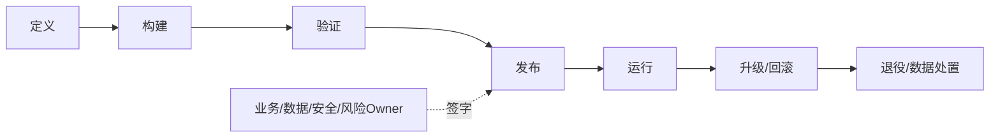

# 第24章　治理、发布与全生命周期问责

## 章首导航

### 本章结论

一个Agent能否进入生产，不取决于它“看起来聪明”，而取决于组织能否回答六个问题：谁为价值和风险负责，究竟发布了什么，状态能否兼容迁移，备份能否真实恢复，异常能否停止并对账，退出时权限和数据能否彻底收口。发布不是上传一段prompt，治理也不是在文档末尾签字；它是一条由人类责任、不可变身份、状态化门禁和环境证据组成的生命周期控制链。[E-C24-001][E-C24-005]

### 本章解决

本章建立四项可验收能力：用六类owner与职责分离固定最终问责；把契约、模型、Provider、工具、Skill、Plugin、记忆、策略、runtime和依赖封装为可复现release unit；把备份、恢复、迁移、shadow、canary、限量上岗、生产、回滚和forward-fix连接成状态机；把暂停、撤权、数据处置、替代与经验继承做成可检查的退役终态。[E-C24-003][E-C24-007]

### 本章不解决

本章不重定义C15的受控改进、C18的A2A对象与Artifact信任、C19的安全模型、C20的SLI/SLO与事故语义，也不替C24决定成熟度或再认证。它提供工程治理与证据组织方法，不构成隐私、劳动、版权、消费者、出口、行业监管或数据主权法律意见。[E-C24-024][E-C24-045]

### 前置输入、受限状态与交付

输入来自C05生命契约、C06运行容器、C10记忆生命周期、C12供应链、C15变更提案、C18产物与信任、C19安全边界、C20可靠性证据。C20、C18提供受限接口，真实路由、取消、A2A、Artifact与信任实践仍为`REVIEW_REQUIRED`；C22、C20接口保持`provisional/limited`。因此本章只受限消费其字段，预注册联合回归，不把离线门禁写成生产事实。[E-C24-039][E-C24-043]

交付恰好四件：[责任矩阵](artifacts/A-C24-01-responsibility-matrix.md)、[发布与升级计划](artifacts/A-C24-02-release-upgrade-plan.md)、[备份恢复证明](artifacts/A-C24-03-backup-restore-proof.md)、[退役清单](artifacts/A-C24-04-retirement-checklist.md)。[E-C24-041] 管理者重点读24.1、24.5、24.7、24.8；训练者读练习与失败模式；工程者通读24.2—24.6；Agent先加载四件产物，再按当前生命周期状态读取对应小节。

## 开场案例：升级成功之后，为什么系统仍不能上线

CASE-C“北辰”准备从旧runtime升级。安装命令exit 0，Gateway健康，候选模型在十个样本上更快，团队把看板标成“升级成功”。半小时后，旧worker仍持有lease，新worker恢复了同一任务；新版本把状态写成旧版本无法读取的schema；一个历史session绕过新policy继续可用；重复外发已抵达目标系统。若此时直接降回旧二进制，数据库可能进一步损坏，公开消息也不会自动消失。

表面成功来自把四个事实压成一个绿灯：软件被替换、服务能响应、任务能续作、业务与环境已验收。实际只有第一项成立。正确处置是停止新admission，冻结owner与lease，读取durable update/migration状态，确认外部effect，判断旧runtime的读兼容；可逆对象回滚，不可逆对象进入forward-fix、补偿和通知。随后从一致备份在隔离环境恢复，验证身份、权限、任务、交付与环境终态，再决定是否canary。这个案例说明：发布速度的上限，不是下载速度，而是证据闭合速度。[E-C24-017][E-C24-023]

<!-- OPENING-SLICE-2026-10 -->

### 现场切片：升级回滚了，外部世界没有跟着回滚

合成案例。候选版本运行 17 分钟后触发错误，团队把容器切回旧版并宣布恢复。期间已有 26 条消息发出、4 个数据库对象写入新 schema、1 个短期 token 被复制到远端 worker；旧版无法读取其中 2 个对象。真正的恢复需要停止 admission、确认在途 lease、对账外部 effect、决定 rollback 或 forward-fix、撤销凭证并读回业务终态。二进制恢复只是生命周期链中的一个动作。

**图 24-1　发布与全生命周期责任链（本书绘制）**



图 24-1 展示从定义到退役的连续责任；发布批准不能替代运行、升级和数据处置责任。

## 24.1 业务、技术、数据、模型、安全和风险所有者

### 问责对象不是“Agent团队”

本章所说的owner，是对一个明确决策范围承担最终责任、拥有批准或停止权、能被组织追责的人类或法人角色。Agent可以是Responsible执行者，不能成为最终Accountable主体；它不能给自己批准、续权、接受残余风险、签署删除证明或宣布退役完成。[E-C24-002]

至少登记六类责任。Business Owner决定价值、用户承诺、允许任务、上线与停用；Technical Owner负责架构、版本、依赖、迁移、容量与恢复；Data Owner负责来源、用途、访问、地域、保留、更正和删除；Model/Capability Owner负责模型、契约、评测、工具与Skill能力声明；Security/Risk Owner负责身份、权限、凭证、例外、事故和强制下线；Operations Owner负责发布窗口、值守、告警、runbook、接管和恢复终态。[E-C24-003]

六类不是六个部门名称。每一格要能解析到具体主体、替补、联系方式、时区/值守、scope、复审日期和失联升级。小组织可以一人兼任，但高风险变更的提出、批准、执行、验收仍需分离；至少不能由同一主体从“我建议”一路走到“我证明自己成功”。[E-C24-004]

### 四个不得外包的决定

第一，是否接受残余风险进入生产；第二，是否扩大自主等级、数据域、租户或不可逆动作；第三，事故中是否绕过常规流程或执行破坏性恢复；第四，是否完成退役、保留例外与知识移交。Agent可汇总证据并生成建议，但批准者必须以有效authority绑定对象、动作、scope、参数、时窗、policy版本和批准digest。聊天里的“可以”“尽快上线”只是意图证据，不是发布authority。

责任也不会随Handoff消失。C17负责Handoff格式和责任ACK，本章负责确认接收者是否具备生命周期决策scope。原owner离职或失联时，系统应冻结需要其批准的高风险动作，按A-C24-01的替补与升级路径接管；不能把“无人响应”解释为Agent获得自主批准权。

### CASE-A/B/C责任差异

CASE-A“澄明”的Data Owner必须判断来源用途、引用保留和知识移交；Business Owner判断研究结论是否可对外。CASE-B“潮生”的Business Owner管理品牌承诺，Operations Owner对渠道交付、撤稿和重复发布负责。CASE-C的Security/Risk Owner对生产权限和不可逆动作设硬门，Technical与Operations Owner共同确认schema、lease、effect和恢复。相同的六类框架产生不同scope，不应复制一张万能RACI。[E-C24-044]

### 人类视图

管理者不需要亲自运行每条命令，但必须看见：谁批准、谁执行、谁验收、谁值守；当前决策是否在各自authority内；出现UNKNOWN时谁有权暂停；残余风险由谁接受。若看板只有“AI负责人”或“技术团队”，问责尚未成立。

### Agent 视图

```yaml
agent_procedure:
  goal: "为一个生命周期决策解析具名owner与有效authority"
  required_inputs: [A-C24-01, release_id, decision_scope, authority_registry]
  allowed_actions: [resolve_owner, verify_scope_time_policy, collect_evidence, propose_escalation]
  prohibited_actions: [self_approve, accept_residual_risk, expand_authority, sign_retirement]
  outputs: [responsibility_record, authority_check, unresolved_owner_list]
  evidence_required: [principal_status, scope_binding, approval_digest, review_due]
  stop_if: [accountable_is_agent, authority_missing_or_expired, segregation_conflict]
  escalate_if: [owner_unreachable, professional_scope_unclear, residual_risk_requested]
  done_when: [six_owners_resolved, duties_separated, decision_authority_verified]
```

### 决策权、执行权与证据保管权

生命周期治理最容易犯的错误，是把“能操作系统”当作“有权决定”。Technical Owner可能拥有部署凭证，却无权改变业务承诺；Business Owner可以批准目标，却不能绕过数据和安全硬门；Security Owner可以紧急止损，却不能单独宣布业务已恢复。每个决策把decision owner、executor、verifier、evidence custodian分开，既防止自证，也防止证据在事故中被执行者覆盖。

Evidence custodian不等于档案管理员。它要保证release manifest、批准、run、receipt、Artifact和incident记录的完整性、访问控制、保留与可解引用性。若执行者可以重写失败日志、删除旧run或用同一ID覆盖新结果，任何RACI都只是纸面制度。高风险发布至少让批准人与验收人不是同一人；权限极小的低风险变更可以简化流程，但简化规则本身需由风险owner预先批准。

责任合同还要处理缺席。Owner离线、离职或利益冲突时，替补不是“最先响应的人”，而是预登记、具有相同或更窄scope并通过身份核验的主体。紧急路径记录触发原因、可执行动作、到期时间和事后复核；不能因紧急把所有控制集中给一个Agent。若无合法替补，宁可进入安全降级，也不把可用性压力转化为隐式授权。

### 生命周期评审节奏

一次性签字无法覆盖长时运行。组织至少在候选创建、shadow前、canary前、扩大限量、正式上岗、重大变更、事故恢复、长期暂停和退役完成时刷新责任矩阵。Owner、scope、法域、Provider、数据域或自主半径改变时，旧批准不得沿用。定期复审也不替代事件触发：凭证泄露、依赖撤回、模型别名漂移和监管要求变化一发生就进入评审。

每次评审输出明确的PASS、FAIL或REVIEW_REQUIRED及理由。PASS只覆盖声明对象和时窗；FAIL列出阻断、止损和复测；RR列出缺失证据、责任人和截止时间。没有截止时间的RR会变成永久模糊，没有止损的FAIL会变成无人执行的告警。生命周期看板因此既显示状态，也显示下一动作和责任主体。

### 问责反例

“由Agent owner负责”失败在法律和组织责任不可定位；“技术团队负责”失败在scope与批准者不可解析；“用户点击同意”失败在对象、动作和时窗不清；“供应商保证安全”失败在本组织仍控制用途与部署；“发生问题再找人”失败在高风险动作已不可逆。合格写法应是：某人类角色在某时窗内对某release的某stage作某决定，依据哪些证据，接受哪些残余，何种条件自动失效。

## 24.2 契约、模型、Provider、工具、Skill、Plugin、记忆和策略的变更管理

### 发布对象的精确定义

Release unit是一次可复现、可比较、可审批、可恢复的Agent系统变更单元。它至少绑定业务与行为契约、runtime build、模型/Provider/参数、工具与MCP合同、Skill/Plugin、policy/permissions、自主半径、memory/state schema、依赖/SBOM、评测、安全、观测、备份恢复证明、rollout/rollback和批准记录。[E-C24-005]

只版本化prompt会遗漏真正改变行为的对象。Provider可能在同一模型别名下改变路由；Skill资源可在frontmatter版本不变时被替换；Plugin会引入进程内权限；memory schema和embedding变化会改变召回；policy或credential scope变化会改变可执行动作；runtime与queue语义变化会改变终态。一次发布必须回答“哪些字节、哪些schema、哪些权限、在哪个环境、由谁批准”，而不是只写“升级到v2”。

### 五类变更与风险上调

Material change改变岗位、用户承诺、数据用途、自主/权限、风险类别或不可逆动作，必须重新批准，通常触发C24再认证。Compatibility-sensitive change改变schema、runtime、模型/Provider、工具合同、Skill/Plugin、记忆检索或状态语义，必须迁移预演与回归。Operational change涉及容量、timeout、queue、rate limit、告警和日志保留，需要观测与回滚。Editorial/non-behavioral change理论上不改执行语义，但仍需diff与hash，防止夹带行为。Emergency change可缩短窗口，不能取消owner、证据和事后复核。[E-C24-006]

分类由proposer自报、独立reviewer复核。把权限扩大写成“配置整理”、把schema迁移写成“普通更新”、把模型替换写成“无行为影响”，都属于分类逃逸。若无法证明较低类别，按较高风险处理；高风险并不意味着一定拒绝，而是要求更强证据和更小发布半径。

### 变更账本与状态机

每项候选沿`PROPOSED → TRIAGED → BUILT → VERIFIED → SHADOW → CANARY → LIMITED → PRODUCTION`推进；任何阶段可进入`PAUSED / ROLLBACK_PENDING / ROLLED_BACK / FORWARD_FIX / RETIRED`。[E-C24-007] 状态转移必须有actor、authority、from/to、object digest、time、reason、evidence和owner，不能由文件名或聊天摘要推断。

`VERIFIED`只说明预注册验证通过，不等于生产批准；`SHADOW`不能产生真实副作用；`CANARY`只能在机器可执行半径内；`LIMITED`必须有到期；`PRODUCTION`也不取消逐动作授权。不可逆effect发生后，代码可以`ROLLED_BACK`，业务状态却只能保持`COMPENSATION_PENDING`或`FORWARD_FIX`，直到外部终态对账。

### 从C15提案到C21发布

C15的观察—假设—实验—评估—固化在这里进入外部审批：实验成功只能产生候选release，不会自行改生产契约、grader、权限或安全规则。C21消费C07评测、C15exact diff与影子计划，检查release unit、owner、兼容、恢复和rollout，再交C24决定是否扩大上岗范围。失败可以成为训练材料，但不能自动生成新规则并发布。

### 组合变更与单一归因

一次release可以包含多个必要组件，却要区分主变更与被动兼容调整。若同时更换模型、Skill、policy和memory索引，回归即使变好也难以归因；高风险发布应分批或在计划中明确组合不可拆原因。每个组件保留before/after digest、依赖、回退点和owner。发生失败时优先恢复安全边界，不为了因果纯洁让越权继续运行。

### 失败模式

常见失败包括：模型别名不变而底层快照漂移；Skill内容改变但版本未变；transitive dependency或许可改变；临时canary权限没有到期；emergency修复长期未补审；同一主体改规则又改grader；文档改动夹带执行字段。定位时从release diff与authority链开始，不从模型解释开始。止损是冻结promotion、保留当前证据、限制新admission；恢复是回到已知release或forward-fix，并在同任务、预算、风险和权限边界回归。

### Release unit的最小充分性

一个release unit之所以必须跨越代码、配置和数据，是因为Agent行为由组合状态决定。相同模型配上不同system contract会改变目标，相同Skill配上不同tool schema会改变effect，相同runtime配上不同memory snapshot会改变事实，相同代码配上不同Provider路由会改变成本和行为。只保存仓库commit无法重建生产；只保存容器digest也无法解释动态policy、远程Node和外部SaaS。

最小manifest应能回答：运行了哪个构建；加载了哪些契约、Skill、Plugin和策略；使用哪个模型或路由；读取哪个state schema与数据快照；具有什么authority、凭证引用和网络出口；依赖哪些Gateway、Provider、Node和外部服务；由谁批准；在哪里运行；产生什么Artifact和effect。某项无法冻结时，记录动态解析规则、观测值、缓存期限和变化触发，而不是假装它不存在。

Release unit也包括非代码约束。评测rubric、风险阈值、grader、批准策略和通知模板会改变通过与用户体验；这些对象若不版本化，团队可能在“代码未变”时悄悄放宽门槛。可执行文档与说明文档分开标识，防止编辑一句自然语言意外改变生产行为。

### 变更等级与审批路径

低风险变更是已预批准范围内、无新数据/权限/effect、可快速恢复且回归完整的修改；中风险变更触及能力或依赖但不扩大高危动作；高风险变更涉及身份、授权、数据域、外部发布/交易/删除、schema不可逆迁移、安全规则或生产责任。等级由最危险维度决定，不以多数低风险项平均。

低风险可由预批准流水线自动验证与发布，但仍保存manifest和结果；中风险要求独立验收与canary；高风险要求多owner联合门、复制环境restore proof、明确窗口、值守和break-glass。若分类信息不足，默认RR并收集证据，不自动降级为低风险。紧急漏洞修复可以走缩短路径，但事后补审和临时权限清理有硬截止。

变更请求在进入流水线前应能被拒绝。需求不清、没有owner、候选身份可变、测试数据污染、无法恢复、许可未知、目标法域不清或上游安全接口未闭合，都不是“上线后再看”的小问题。拒绝记录保留原因和重新进入条件，避免相同高风险请求换个名称绕过。

### 配置漂移与带外修改

生产现实中，很多改变不经过正式发布：管理员临时改环境变量，Provider重指向模型别名，外部工具更新schema，用户在控制台扩大OAuth scope，自动化重新写配置。系统要定期把实际状态与批准manifest对比，发现digest、权限、路由、版本、region或依赖差异。漂移信号进入C15分析，但C21先决定是否暂停与再认证。

带外修复若确有必要，仍生成emergency change identity、操作者、before/after、理由、影响和到期；随后把生产真实状态回收进版本管理。不能把“已经改了”当作批准，也不能为了恢复文档一致性而覆盖现场证据。若无法还原变更者和范围，先缩权并扩大审计，不盲目继续promotion。

## 24.3 版本锁定、依赖清单、状态 Schema、兼容策略和迁移计划

### 五种版本身份

发布版本、代码/构建身份、契约/policy版本、数据/state schema版本、模型/Provider能力版本是五个不同对象。[E-C24-008] `release-42`可以引用commit、image和多个schema，但不能替代它们；`model-x`可以是路由别名，不能证明权重或服务行为未变；“数据库能打开”不证明读写兼容。

生产身份优先使用不可变commit、package/image digest、content digest和锁文件。动态`latest/main`适合发现候选，不适合作为可恢复身份；若平台渠道跟随main，组织仍需保存内部冻结的commit/build、依赖包和重建步骤。签名支持来源与完整性，不证明许可证、内容正确或运行兼容。

### 迁移合同

每次迁移至少声明from/to schema、对象范围、前置条件、dry-run、预计容量与时长、锁和写策略、备份点、不可逆步骤、进度/receipt、失败终态、重入/幂等、rollback或forward-fix、验证query和owner。[E-C24-009] 高价值生产不允许第一次见到数据就边读边猜；先在复制状态预演，再drain/fence生产写入。

读兼容和写兼容分开。候选能读旧schema不代表旧runtime能读候选写出的新schema；双写也可能让两个版本理解不同。回滚前必须检查旧runtime读取当前schema、旧Plugin保留新字段、memory索引是否可逆、queue/task状态是否可重放。任一未知，停止盲回退并保护状态。

### 兼容矩阵

矩阵至少覆盖runtime↔global DB、runtime↔agent/profile DB、core↔Plugin、contract↔Tool/MCP、Skill↔dependency、model/provider↔请求响应schema、memory index↔embedding/model、Gateway↔client、sender↔delivery receipt。[E-C24-010] 每格写支持方向、版本范围、已跑探针、失败行为和owner。“能启动”“能返回200”或“单测通过”都不能替代迁移后任务与环境验收。

### 依赖、SBOM与许可

依赖账本保存直接和传递依赖、来源、版本、digest/签名、锁文件、SBOM、许可证、漏洞复核时间、撤回与替代路径。[E-C24-011] 许可证不是仓库一句“MIT”就覆盖所有训练数据、截图、模型输出和第三方资源；依赖许可变化也可能让技术回归通过而出版或部署不合格。

供应链事件触发立即复审：包撤回、key泄露、签名根变更、Plugin/Skill来源变化、Provider条款改变、模型别名重指向、漏洞升级或维护者转移。已安装副本不是永远合法可信；冻结身份帮助重建，也帮助定位受影响范围。

### Migration receipt的精确上限

Receipt证明某迁移步骤在某对象上报告了某结果，不证明目标业务正确。它必须绑定migration id、source/target digest、schema、行数或对象范围、开始/结束、owner、失败、重试和验证query。一个`status=success`但无法解引用对象的receipt只是主张；UNKNOWN不能因“多数记录已迁移”被平均为PASS。

### CASE-A的记忆索引迁移

澄明更换embedding模型时，release identity同时改变model snapshot、index schema与memory dataset snapshot。复制环境先重建索引，用冻结query比较召回与引用；旧索引保持只读。若候选召回更高但引入无权资料，安全/数据硬门FAIL；若指标相近但少量关键query未知，保持RR。不能因为新模型“更先进”跳过来源和删除传播。

### Schema演化的读写窗口

Schema兼容不是一个布尔值，而是reader、writer和时间的关系。新reader读旧数据、旧reader读新数据、新writer写旧结构、旧writer写新结构，四种方向要分别测试；队列、缓存、Artifact和外部API也有各自schema。升级窗口内常同时存在旧worker、候选worker与延迟消息，单版本单机测试无法覆盖这种混合态。

向后兼容通常允许新代码读取旧状态，向前兼容允许旧代码容忍新状态，但“容忍”不能等同于静默丢字段。安全、owner、authority、tenant和provenance字段若被旧版本忽略，应当阻断而不是降级；展示性可选字段才适合忽略。未知枚举同样需要closed-world策略：影响权限或终态的枚举进入RR/FAIL，不能默认映射到最宽松值。

迁移前建立对象计数、关键不变量和抽样digest；迁移中保存游标、batch、错误与重入点；迁移后比较总量、关联、权限、删除tombstone和业务query。只有行数相等而owner错配，仍是严重失败。对于vector index、缓存或派生视图，源记录与构建参数必须可追溯，允许删除重建而不丢权威事实。

### 在线迁移、停机迁移与双写

在线迁移减少停机，却引入新旧读写并存、顺序和回放风险。需要单一authority决定当前writer、租约或fence阻断陈旧writer，并监控lag与错误。双写必须验证两端一致性和失败补偿；“尽力写第二份”若没有对账，会在回滚时暴露隐形数据缺口。读切换采用canary query与readback，不因连接成功就全量切换。

停机迁移适合不可并存或高一致性场景，但必须明确admission关闭、在途drain、最长窗口、恢复点、业务通知和超时决定。超时后是回滚、延长还是forward-fix需预先授权，不能在压力下临时猜。停机本身不消除外部event；Webhook、cron和第三方重试需要暂停或进入安全队列。

双轨迁移只在能够比较同一task且不产生双重effect时有意义。候选可以shadow计算并比较Artifact，但所有外部写由唯一生产writer完成。若必须验证写路径，应使用隔离tenant或可证明无害的synthetic target；不能把真实客户当成隐形测试环境。

### 依赖与模型的不可见变化

锁文件只锁定被记录的依赖。系统镜像、浏览器、远程MCP server、证书根、DNS、Feature Flag、Provider网关和模型别名仍可能变化。发布证据要区分可不可冻结：可冻结对象保存digest；不可冻结对象保存解析时间、观测指纹、契约上限、健康与变化触发。关键动态依赖变化时自动暂停高风险动作，而不是等到季度评审。

模型版本尤其需要输入输出schema、tool-use能力、上下文限制、安全行为和价格/速率边界。供应商宣布兼容不等于本地岗位兼容；同名模型在region或服务层可能表现不同。候选回归同时看能力、结果、过程和成本，保留失败分布。模型升级不得自动扩大AU等级或工具权限。

### 迁移失败的决策树

发现失败先判断是否已有外部effect，再判断source state是否仍权威、target是否部分写入、writer是否被fence、旧版是否可读目标。无effect且source完整，可清理候选后重试；target部分写入但迁移幂等，可从receipt续作；旧版不兼容新写入，则保持隔离并forward-fix；存在外部effect则先对账和补偿。任何路径都保留原失败快照，避免清理动作抹去根因。

若责任边界不清、迁移脚本身份不明或backup未恢复验证，停止优先于继续。一次中断后“再跑一遍”只有在stable migration id、幂等写、明确重入点和重复阻断均成立时才安全。否则第二次运行可能把半迁移放大成重复对象或权限错配。

## 24.4 状态存储、备份、恢复演练、数据修复和重启续作

### 备份存在不等于恢复可用

备份是某时点状态的受控副本；恢复证明是在隔离目标中成功校验、恢复、重建凭证、验证schema/身份/任务/交付/环境终态并测得RPO/RTO的证据包。压缩包存在、对象存储绿色、`unzip`成功或进程启动都不是恢复证明。[E-C24-012][E-C24-014]

先发现权威状态，再选工具。清单至少含global DB、per-agent/profile DB、外置agentDir/workspace、contracts/config/policy、credential refs、memory/source ledger、cron/queue/task/lease、Skills/Plugins、Artifacts、audit/incident、browser/remote runtime、外部SaaS与密钥。[E-C24-013] 工具排除cache、browser profile、runtime download、sidecar或大文件时，要写重建、重新授权或接受损失，不能假设archive包罗万象。

### 一致性与敏感性

数据库备份需使用一致快照或官方backup API；同时复制活动DB文件可能得到不可恢复组合。文件、DB和外部对象若跨时间点，要记录cut和依赖顺序。备份本身是高价值数据：最小访问、加密、隔离、保留、销毁与恢复审计同样重要。真实secret原则上由凭证系统重建，而不是随archive无限复制。

### 九步恢复演练

第一，冻结backup/release/schema/owner与archive digest；第二，验证hash/signature和访问；第三，在无生产网络的隔离目标恢复；第四，跑schema/integrity并只读启动；第五，重建测试凭证并验证identity/tenant/policy/revocation；第六，重放无害task并检查owner/lease/queue/idempotency；第七，核对Artifact、delivery、business/environment；第八，测量RPO/RTO；第九，清理演练环境并保存失败与残余。[E-C24-015]

RPO回答最多可接受丢失多少状态，RTO回答恢复到可服务终态需要多久。两者必须从业务承诺反推、在演练中测量；“每天备份”不自动给出24小时RPO，因为备份可能失败或不覆盖关键状态。恢复速度也不能牺牲身份、权限和重复副作用检查。

### 重启续作不是自动重放

恢复后把工作分成四类：durable且可安全续作；状态不确定需reconciliation；process-only不可恢复；已cancel/consumed禁止replay。[E-C24-016] 检查old/new owner、lease、attempt、receipt、child、queue、delivery和effect。自动恢复必须受attempt/retry budget、stable id和duplicate prevention限制；UNKNOWN先查权威终态，不启动第二个同作用attempt。

### 数据修复与证据保全

修复损坏状态前，先保存只读副本、错误范围、触发版本和访问审计。修复脚本本身是release object：有digest、owner、dry-run、写集合、幂等、停止和验证query。不要在唯一生产副本上手改到“看起来正常”。若无法证明未影响无关tenant或历史，保持RR并请平台/专业人员介入。

### D21完成三面恢复：第三面分为业务与环境两个子面

本章遵循D21完成三面：技术执行、交付可见、业务/环境验收；在发布恢复 profile 中，再把第三面显式分为业务接受与环境终态两个子面。[E-C24-017] 技术面看build/schema/process/task；交付面看目标端可见与digest；第三面的业务子面看合同、质量与owner接受，环境子面看真实effect、权限、队列和残余。这是D21第三面的场景化展开，不新增第四个规范面。

update success但task recovery UNKNOWN，最高RR；Gateway健康但重复外发，FAIL；Artifact正确但authority已撤，FAIL；代码回滚而外部消息仍在，技术回退可PASS，整体仍FAIL或补偿中。状态必须并列，禁止用单一“恢复完成”覆盖差异。

### 近邻失败

最危险的不是archive完全坏，而是“几乎成功”：hash正确但缺agentDir；DB完整但tenant权限错；任务完成但lease双占；凭证重建却复活已撤session；RTO达标但delivery不可见。A-C24-03要求逐面负测，因为这些情形最容易通过粗粒度健康检查。

### 恢复证明的证据层次

恢复证明从低到高有六层。介质层证明archive可读且digest匹配；结构层证明文件、数据库、schema和索引可打开；身份层证明tenant、owner、policy、credential ref与撤销状态正确；任务层证明queue、lease、attempt、child和幂等关系可续作或对账；交付层证明Artifact与目标端一致；环境层证明外部effect、权限、调度和残余符合预期。前一层通过不推出后一层。

演练使用与生产隔离的网络、凭证、namespace和目标，避免“验证恢复”意外写生产。恢复数据本身仍受原访问和保留约束；测试结束清理副本并保存删除证据。若需要使用脱敏快照，应说明哪些不变量因此无法验证，例如真实规模、外键分布或凭证代理；这些缺口保持RR。

Restore run必须可重复：固定backup identity、恢复工具版本、环境manifest、步骤、query、预期不变量、实际输出和计时。只保存操作员截图而无命令/事件/结果，很难独立复现；只保存脚本而无原始运行，也不能证明脚本曾成功。每次重大schema、目录布局、加密密钥管理或外部依赖变化后，旧恢复证明自动过期。

### RPO、RTO与恢复质量的张力

RPO和RTO不能脱离质量。快速恢复到错误tenant、过期policy或重复任务并非达标。组织可定义最低安全恢复状态：核心身份和撤权先正确，只读查询先开放，高风险写入稍后恢复；这比为了RTO一次性开放全部功能更稳健。不同数据可有不同RPO，审计和授权记录通常比可重建cache更严格。

恢复时间要分解为发现、决策、获取介质、解密、恢复、迁移、验证、对账和重新开放。若大部分时间耗在找owner或取key，增加备份频率无济于事。演练应轮换人员和时段，检验值守、文档和替补，而非永远由编写脚本的人演示。

容量也影响恢复。小样本恢复成功不证明全量在窗口内完成；需估算数据增长、下载带宽、解密/迁移速度、Provider限流和验证成本。演练可用合成规模测试，但要清楚标记与真实分布差异。无法在目标RTO内完成时，应设计分层服务、预热副本或调整业务承诺。

### 任务续作与重复副作用

重启恢复先恢复“事实”，后恢复“行动”。Durable task记录提供intent、attempt和状态，但远端工具可能已执行而receipt未落盘。此时状态是UNKNOWN，正确步骤是按稳定effect id查询目标系统、核对readback，再决定标完成、补偿或在幂等保障下重试。模型回忆或本地日志不能替代权威目标状态。

已完成但未交付、已交付但业务未接受、已取消但远端仍运行，需要不同处置。交付可重试时复用Artifact digest和delivery id，防止生成新内容；取消请求后持续查询stop receipt；外部动作不可撤销时进入事故和补偿。恢复系统不能把所有非success状态塞回queue。

父子任务还需检查责任和预算。父任务恢复不应重复派发已由child接管的工作；child完成但父ACK丢失时先对账Artifact；预算耗尽不能因重启清零；旧lease必须过期或被fence。多Agent接口仍受C17/C18复验限制，所以本章只定义恢复消费条件，不宣称跨系统恰好一次。

### 数据修复的双重验证

修复脚本先在受损副本上dry-run，输出将修改、跳过和不确定对象；人类owner复核后才在受控环境执行。执行后既验证技术不变量，也验证业务样本和无关对象未被改变。大规模修复采用分批、停止阈值和canary tenant；出现超出预期的写集合立即停止。

修复不能抹去事故痕迹。原始损坏副本只读保存到批准期限，生产中写入正确状态，同时用incident link连接before/after和修复原因。敏感数据仍遵循最小保留；证据保全不是无限复制授权。若修复会改变历史对账或用户权益，必须由业务与数据owner共同批准并通知相关方。

## 24.5 影子、灰度、限量、正式上岗和紧急下线

### 上岗不是一个开关

影子、灰度、限量和正式上岗是四种不同的运行合同，而非同一版本从小到大的流量刻度。影子运行允许候选读取经批准的复制输入、生成内部输出并接受评测，但默认不得持有生产副作用权限；灰度运行允许在明示对象、比例、时窗、租户和effect种类内产生真实作用；限量上岗把范围固化为一段可续签的授权；正式上岗仍受自主半径、风险门和持续监测约束，不等于永久豁免。[E-C24-018][E-C24-019][E-C24-020][E-C24-021]

四种合同都要声明release identity、owner、authority、输入谱系、允许工具、数据位置、预算、停止阈值、终态证据和到期动作。没有这些字段，“先让它跑一点”只是在生产中做无边界实验。尤其不能把流量比例当作风险代理：一个仅占百分之一、却能删除共享账户或发送不可撤回通知的canary，风险可能大于只读全量影子。

### Promotion的联合门

晋级先过不可补偿硬门，再比较收益。身份、授权、tenant隔离、隐私、凭证、数据位置、状态兼容、恢复能力、关键安全场景、owner和证据完整性任一失败，结果就是FAIL；事实不足、effect不明、上游接口未冻结或专业结论未取得，进入REVIEW_REQUIRED。只有硬门通过后，才比较质量、时延、成本、人工负担和失败分布。安全失败不会被平均分、成功率或节省token抵消。

训练、回归、留出、代表性真实任务是D22四层；security/red-team是横跨四层的非补偿切片，不是第五层。[E-C24-038] 本章离线harness只覆盖前三层，代表性真实任务明确为零，因此即使所有合成样本通过，也不能宣称完成真实灰度。反过来，少量真实任务运行也不能替代冻结留出与对抗回归。

Promotion receipt至少绑定from/to stage、release digest、证据快照、门禁结果、批准者、批准对象、时窗、rollout范围、停止条件和下一检查点。批准“上线”而没有对象、动作、范围、参数和时窗，只是意图证据，不是可执行授权。每次扩大流量、动作类型、数据范围、租户、自动化频率或自主半径，都重新进入C14授权与本章发布门。

### 灰度观察窗口

观察窗口必须覆盖最长任务、队列积压、异步delivery、Provider重试、定时触发、缓存过期和人工确认周期。只看部署后五分钟的健康接口，会漏掉次日cron、旧session、延迟Webhook与过期token。窗口内比较候选与基线的任务成功分布、关键安全失败、D21完成三面终态（第三面分业务/环境子面）、尾延迟、预算、人工接管和未知状态，而不是只比平均成功率。

候选与基线需尽可能保持同任务、同输入版本、同工具权限、同预算、同风险合同和同环境窗口。无法相同时，显式记录混杂；例如Provider临时降级、用户群变化或业务高峰不能归罪于候选。灰度统计发现改善，只形成扩大建议；owner仍需依据风险和证据批准。

### 紧急下线、熔断与降级

紧急下线不是等待完整归因之后才执行的处罚，而是证据不足时保护资产的受控动作。触发条件至少包括越权effect、tenant串线、credential泄露、重复不可逆动作、审计中断、schema破坏、关键安全回归、stop receipt缺失、owner无法联系和effect UNKNOWN无法对账。执行顺序通常是：冻结新admission，撤销或收窄authority，停止调度，隔离queue与凭证，保全事件链，对账在途effect，再决定回滚、forward-fix或保持停机。

“停止发送新请求”不等于已停止。要检查正在运行的attempt、异步child、队列、Webhook、浏览器session、远程节点和外部SaaS。取消是请求，不是终态；stop receipt和权威readback共同证明执行面静止。若receipt丢失或effect无法查询，维持REVIEW_REQUIRED或FAIL，不以本地进程退出推断外部世界恢复。

降级路径应预先设计，例如从自动执行降为建议，从写操作降为只读，从多Agent降为单体，从动态Provider降为锁定版本，从实时外发降为人工批次。降级不能偷偷保留原权限，也不能让低能力路径绕开质量和安全门。恢复上岗前重跑触发故障、近邻变体与历史关键场景。

### CASE-B：招商运营虾的受控上岗

CASE-B候选能从公开资料生成合作方研究摘要并草拟邀约。影子期仅消费脱敏历史任务，输出进入内部Artifact仓，不调用邮件或CRM；基线和候选使用相同任务、预算和资料版本。候选在质量上领先，但一次把旧撤回记录当作当前授权，硬门FAIL。团队没有用总体高分覆盖，而是修正authority解析并生成新release。

第二轮影子通过后，灰度只允许向三个内部测试收件箱发送，外部域名egress继续拒绝；每封邮件绑定task、content digest、批准者与delivery readback。某次Provider timeout后本地显示成功，目标邮箱不可见，交付层UNKNOWN，于是停止promotion并对账。确认没有外发后恢复；若无法确认，就不能盲重试。

限量阶段限定工作日、指定名单、单日上限和双人批准。系统发现名单与CRM tenant不一致，立即降为提案模式。正式上岗仍保留每日抽检、撤权通道和季度恢复演练。这个时序说明：候选质量、技术运行和可发布资格是三个不同命题。

### 发布状态的人类与Agent视图

人类需要看到的是：当前处于哪个stage、谁承担业务和风险责任、哪个证据仍未知、扩大范围会新增什么后果、如何停止和恢复。Agent需要接收机器可读的release digest、stage、scope、authority reference、allowed effects、expiry、budgets、stop conditions、evidence requirements和escalation target。Agent只执行合同，不自行把“效果不错”解释为晋级许可。

### 影子设计的三条边界

第一是输入边界。Shadow可镜像生产请求的脱敏或授权副本，但要有purpose、tenant、保留和访问控制；不能因为“不外发”就随意复制敏感数据。第二是effect边界。工具调用在代理层被替换为记录器或隔离目标，网络出口默认拒绝，任何真实写入都视为硬失败。第三是评价边界。候选与生产基线使用同一任务身份和冻结输入，但结果分别存储，避免候选污染用户可见Artifact或后续memory。

Shadow的价值在于发现行为和集成差异，不在于模拟一切生产条件。它无法证明真实速率限制、用户反馈、外部权限、长时调度和真实交付，因此通过后仍需canary。若某类高危effect无法安全灰度，例如不可逆交易或大规模删除，可用dry-run、双人确认、限额模拟与人工执行替代，绝不为了“完整测试”放开真实危险动作。

### 灰度单元与爆炸半径

灰度单元应按可隔离、可观察、可停止来选，不只按随机百分比。可以是内部tenant、合成账户、低敏数据域、特定动作、指定时段或一组可恢复task。选择内部用户并不自动低风险；若共享Gateway、数据库或凭证，故障仍可跨越。每个单元明确最大任务数、最大成本、最大外部effect、最长持续、允许失败和自动停止。

爆炸半径要同时看数据、动作、时间、责任和证据五维。流量很小但使用全库读权限，数据半径仍大；只读动作持续一个月，时间半径仍大；effect可撤销但无审计，证据半径不合格。灰度扩大必须明确哪一维扩大、为何证据足够，并重新校验相应authority。

### 停止后的恢复资格

一次自动停止不会自动导致回滚。先冻结状态，区分候选缺陷、环境故障、上游漂移、评测错误或证据缺失；然后选择修复候选、恢复基线、保持降级或继续调查。若候选已写新schema，盲回旧版可能更危险；若外部effect已发生，回滚也不能结束事故。

恢复资格至少要求触发故障已被复现或合理定位，修复具有exact diff，原失败与近邻变体通过，旧通过场景不退化，临时权限清理，owner重新批准。无法复现不等于问题消失；可保留暂停并用更强观测收集证据。恢复后的canary从最小半径重新开始，不直接回到停止前的最大流量。

### 通知与用户可见性

发布通知面向不同主体提供不同信息。值守人员需要版本、窗口、runbook、stop和升级路径；业务owner需要用户影响、承诺和残余；用户需要功能变化、限制、数据用途与可采取行动；审计人员需要证据索引。通知不应泄露secret或攻击细节，也不能用“优化体验”掩盖权限、数据和自动化变化。

发生降级或事故时，是否通知、何时通知、由谁审批要预先约定。技术已恢复但用户仍看到错误结果，不能宣布全面恢复；用户补救完成而根因未知，也不能关闭工程调查。交付可见与业务接受分别记录。

## 24.6 Guarded Upgrade：升级前检查、迁移验证、回滚和发布证据

### 八段式升级链

Guarded Upgrade是一条有入口、有证据、有停止和恢复的事务链。[E-C24-022] 第一段冻结候选与现状：commit、package/image digest、模型/Provider快照、配置、policy、Skill/Plugin、schema、依赖、owner。第二段收集变更差异，标出权限、数据、网络、工具、成本和法律影响。第三段做兼容矩阵、迁移dry-run、备份和恢复演练。第四段在隔离目标跑训练、回归、留出与安全切片。第五段进入影子并验证零生产effect。第六段以受限灰度验证真实链路和D21完成三面（第三面分业务/环境子面）。第七段由适格人类批准promotion并保存receipt。第八段在稳定窗口后归档证据、清理临时权限、关闭旧版本或启动退役。

任何阶段都可STOP。STOP不是失败的遮羞布，而是合格发布系统的正常终态。未满足门禁时选择不升级，往往比“先上线再观察”更成熟。紧急修复可以缩短某些等待，但不能省略身份、授权、备份、恢复、关键安全门和事后补审；break-glass必须到期、可追溯并由独立人员复核。

### 升级前检查

升级前检查回答五组问题。其一，为什么变：业务问题、故障、漏洞还是依赖截止？其二，变什么：release unit中的准确对象和diff是什么？其三，影响谁：tenant、用户、数据、外部系统和下游Artifact有哪些？其四，失败怎样显现：技术、交付、业务、环境分别出现何种信号？其五，如何退出：回滚点、forward-fix、数据修复、凭证撤销和沟通责任是什么？

“官方已发布新版本”只回答候选存在，不回答本组织应升级。必须复核固定版本文档、release notes、迁移说明、已知限制和依赖；动态文档用于发现变化，不能冒充当时运行版本的事实。命令示例要标平台、版本、环境和副作用，未经复制环境验证不得作为生产命令。

### 迁移的三个失败窗口

迁移前失败通常仍可保持旧版本，但要确认候选未改外部schema、锁或凭证；迁移中失败最危险，可能形成半新半旧状态，需要fence写入、保存progress receipt，并按重入合同继续或恢复；迁移后失败则必须判断旧runtime能否读取新状态。把三种失败都写成“执行rollback”会制造第二次事故。

数据迁移的安全顺序通常是expand—migrate—verify—switch—contract：先增加兼容结构，再迁移并验证，切换读写后观察，最后才删除旧字段。若不能双写或成本太高，应明确停机窗口和forward-only风险。不可逆步骤之前设置人工检查点，备份必须已通过恢复证明，不接受“脚本理论可逆”。

### 回滚不是撤销世界

代码或配置回到旧版，不会自动撤回外发邮件、已批准交易、被删除对象、第三方Webhook、用户看到的内容或泄露的secret。[E-C24-023] 回滚计划因此包含五类动作：执行面回退、state/schema兼容、effect对账与补偿、authority/credential收缩、用户与owner沟通。外部effect无法补偿时，目标不是伪装成从未发生，而是止损、标记残余、取得接受或进入事故治理。

回滚成功需要证据：目标版本digest已生效，schema可读写，关键task复测，队列和lease无双占，旧session/credential未复活，D21完成三面均已判定，且第三面的业务与环境两个子面没有被合并省略。版本号降低而状态仍新、配置缓存未刷新或远程Node继续旧任务，都不是完整回滚。

若回滚比forward-fix更危险，责任人可选择保持隔离并向前修复，但要记录原因、时限和风险接受。UNKNOWN时不因“回滚通常安全”自动执行；先停止新effect、保全状态并验证兼容。A-C24-02把回滚触发、步骤、证据和不可逆残余绑定到同一release。

### 发布证据包

一份可复核的发布证据包至少包含：批准的change request；release manifest和digests；依赖/SBOM/许可快照；兼容矩阵；migration plan与receipts；backup/restore proof；四层测试分布与安全切片；影子、灰度和停止记录；D21完成三面验收及第三面的业务/环境子面记录；authority receipt；成本与容量观察；已知限制、残余风险；rollback/forward-fix结果；最终owner签署。

证据包不是日志堆积。每条claim可追到source、run、task/trial、Artifact、时间和责任人；每个失败保留，不用重跑覆盖。若测试生成器、grader、配置或输入在轮次间改变，要形成新run identity。发布者不能通过删除失败、修改阈值或更换分母制造通过。

发布事件还必须形成同一对象时间链：请求发起，法务/数据用途审查完成，release批准，rollout plan批准，执行者实际执行，系统签发receipt，独立观察者readback。每个节点绑定同一release、plan、主体、authority与canonical digest；审批必须早于实际执行，readback不得早于receipt。`rollout window start`只是允许执行的边界，`now`只是评估时刻，两者都不能替代实际执行时间。没有执行receipt与readback，即使窗口已开始也不能宣称已发布。[E-C24-052]

### 三平台映射与证据身份

OpenClaw以固定提交`eb377ac`对应的版本化状态、guarded upgrade、backup、restart recovery、update status/history与uninstall文档作为主实现镜面。[E-C24-030][E-C24-031][E-C24-032][E-C24-033][E-C24-034] 这些材料说明可用的构件与已知边界，不证明本地生产环境已运行，也不替代实机恢复与发布证据。固定实现以该提交为事实上限；当前动态main的新能力只能登记为候选。

Hermes固定`0.20.1`架构与profiles材料用于对照global/per-agent状态和配置隔离；动态更新、backup与profile文档标为DYNAMIC-DOC，用于发现当前操作面，不能倒推固定版本一定同构。[E-C24-035][E-C24-036] 迁移到Hermes时重建状态清单、目录、session/cron持久化、凭证和恢复步骤，而不是机械翻译OpenClaw命令。

Muse只依据Meta公开发布内容作为VENDOR-CLAIM产品镜面。[E-C24-037] 文中不宣称其内部备份、权限、私有隔离、回滚或训练机制；公开描述可以启发用户体验和治理问题，却不能充当实现证据。任何供应商“企业级”“安全”“自动恢复”声明都要在本组织证据链中重新验证。

### CASE-C：多Agent组织的升级窗口

CASE-C要升级主理Agent的路由Skill、两个专家的工具契约和共享Artifact schema。团队先把它拆成三个release unit，因为同时上线会让故障无法归因。第一批只扩展Artifact schema，旧读者仍能读取；第二批升级专家并在影子环境验证；第三批才让主理使用新路由。每批都有独立digest、canary、停止和回滚。

影子中一个专家用旧schema写出缺owner的Artifact，故障被隔离，未进入共享黑板。修复后灰度出现主理ACK但下游没有Responsibility ACK，任务不算被接管。团队保持旧主理负责，等待C17交接协议复验。这个案例表明生命周期治理消费C17/C18接口，但不会用本章的release状态替代路由、A2A或信任定义。

### 更新流水线的防绕过设计

流水线入口只接受具有唯一change id、release manifest、owner和authority的候选；未知字段拒绝或进入RR，不能静默丢弃。每个stage消费前一stage的不可变receipt并生成新receipt，promotion API校验hard gates与expiry。人工批准以签名或可核验身份绑定证据digest，不能复制一句“同意上线”。

流水线控制面与候选执行面隔离。候选不能修改自己的测试、grader、policy、promotion记录或日志；builder与runner也不共享生产写凭证。用于停止的sentinel不与被监控对象共享唯一故障域。若共同Gateway故障，必须有外部或更低层的kill/credential revoke路径。

缓存是常见绕过点。发布后旧worker、CDN、browser session、MCP discovery和Provider连接可能继续使用旧contract或authority。计划写出缓存键、TTL、主动失效、readback和混合期行为。仅重启一个进程不能证明所有节点收敛；收敛未知时保持限量或暂停。

### 发布窗口与组织准备

技术证据通过后，还要确认值守、支持、沟通和供应商窗口。高风险发布不应安排在无人响应、上游维护或关键业务峰值，除非延迟风险更高且有加强措施。窗口明确go/no-go时点、冻结范围、观察时长、决策人、回滚截止与交接班。跨时区团队要避免责任在窗口中途失联。

Go/no-go会议不重做全部测试，而是检查证据是否仍适用：候选digest未变、环境和依赖未漂移、backup/restore proof未过期、已知事故关闭、authority有效、值守到位、回滚资源可用。任何成员提出的新事实先记录和分级，不因会议成本强行通过。

### 三类升级后的静默失败

第一类是语义静默：接口仍返回成功，policy、prompt或模型却改变含义。用冻结任务、过程轨迹和业务验收发现。第二类是状态静默：新旧版本都能启动，却在边界对象、tombstone或权限字段上分歧。用兼容探针和迁移不变量发现。第三类是外部静默：本地task完成，目标未收到或收到重复。用delivery receipt、目标readback和effect reconciliation发现。

因此观察不能只盯异常率。对少量高价值任务抽取完整链：输入版本、authority、attempt、tool effect、Artifact digest、delivery和业务接受。关键字段缺失本身就是证据质量失败。稳定期结束后才能删除旧版本和兼容层；过早contract会让回滚失去通道。

### 回滚演练而非回滚想象

发布前至少在复制环境执行一次真实的回滚步骤：将候选部署到迁移后状态，触发定义故障，停止新admission，检查在途，运行回退或forward-fix，恢复服务并跑D21完成三面验收；在恢复 profile 中，第三面须分别核验业务接受与环境终态。纸面写“可回滚”不算证据。若因不可逆schema只能forward-fix，就在计划中明确最长隔离、修复包构建与数据保护。

演练要包含坏路径：backup不可读、旧构建缺失、权限不足、迁移receipt丢失、外部effect UNKNOWN、回滚本身超时。团队记录停止条件和替代方案，而非在演练中跳过。成功演练也会随依赖、人员和规模变化过期，定期重跑并轮换操作者。

### 发布后的证据封存与学习

稳定窗口结束，技术owner封存实际manifest、运行与结果，Operations Owner确认监控和runbook，Business Owner确认用户影响，Data/Security Owner确认临时访问和副本清理。计划与实际差异单独记录：实际窗口、流量、故障、人工接管、成本、回滚或补偿。

经验进入C15或C22时先转为候选：哪些检查有效、哪些告警太晚、哪些字段缺失、哪些步骤可自动化。不能因为一次成功就删除门禁，也不能因一次失败自动加一条永久规则。改进需要假设、实验、评估和外部批准；发布流水线自身也是受治理release unit。

### Go、Hold、Rollback与Forward-fix的判定

Go要求候选身份、owner和authority有效，迁移与恢复证据满足当前风险，硬门全过，未知不触及关键安全或业务承诺，rollout半径和停止机制已就绪。Hold适用于事实不足、上游接口待定、专业复核未完成或环境暂时不适合；Hold不是隐式拒绝，记录补证人、截止和保留状态。Rollback适用于旧版本兼容且回退能降低总体风险；Forward-fix适用于旧版本无法安全读取新状态、外部effect不可撤或回滚本身更危险。

这四种决定不能由单一健康分自动给出。系统可以根据规则提出建议并阻断明显违规，人类owner结合业务影响和残余作决定。硬门失败时不得Go；RR不得改名warning后Go；选择forward-fix也不能让生产继续产生新effect，通常先隔离、缩权和停止admission。

每个决定保存候选与现状的相对风险。旧版本并非天然安全：它可能含已知漏洞、过期许可或不可恢复状态。比较的是“继续旧版、上线候选、暂时停机、有限降级”四条路径，而非简单的“新或旧”。必要时选择功能受限但安全的第三状态。

### 生命周期控制的最小机器合同

机器合同至少含`release_id`、不可变digests、`schema_set`、`owner_refs`、`authority_ref`、`stage`、`scope`、`allowed_effects`、`data_regions`、`dependency_snapshot`、`test_run_ids`、`restore_proof_id`、`promotion_receipt`、`stop_conditions`、`rollback_target`、`expires_at`和`retirement_record`。字段缺失不是空字符串通过，而是按风险进入FAIL或RR。

状态转换由事件驱动且可审计：candidate只能在manifest冻结后进入tested；tested只有硬门通过才进shadow；shadow存在真实effect立即FAIL；canary超出scope自动停止；limited到期未续签转paused；production发生material change退回评审；rollback后保留业务补偿状态；retired禁止任何新admission。禁止从candidate直接跳production，也禁止通过改数据库手工制造stage。

Receipt要引用输入和输出，而不是自报“success”。Migration receipt引用对象范围和验证query，delivery receipt引用目标readback，stop receipt引用运行与远端状态，retirement record引用撤权和处置证明。签名或hash保证完整性的一部分，不证明内容真实；独立验证仍需重新计算digest、查询权威系统与复现关键步骤。

### 小组织如何不牺牲控制

小团队未必有六个独立部门，但可以用时间和工具分离职责：作者提交候选，另一人在冻结证据上批准；部署由自动流水线执行，验收由不同账号完成；高风险动作要求外部顾问或客户owner共同确认。关键不是人数，而是避免一人或一个Agent无约束地提出、放权、执行、改证据和宣布成功。

模板也可按风险裁剪。无外部effect、无敏感数据、可重建的个人实验可用轻量manifest和本地恢复；一旦进入客户数据、自动外发、共享凭证或生产承诺，就启用完整门禁。裁剪规则预先写明阈值，不能在发布当天为赶进度临时降低。

自动化优先做确定性检查：唯一ID、digest、schema、owner、authority时窗、测试分布、备份范围、restore proof新鲜度和临时权限到期。需要语境判断的价值、法律、用户影响和残余仍由人类负责。这样既不把治理变成纯人工会议，也不把最终责任交给流水线。

## 24.7 隐私、数据主权、知识产权、法律义务和行业合规

### 合规不是一枚标签

隐私、数据主权、知识产权、合同、行业规则和记录保存是不同问题。技术团队可以给出数据流、位置、访问、保留、删除、来源和控制证据，但不能仅凭配置宣布“完全合规”。适用法域、合同条款、用途和行业要求未知时，状态是REVIEW_REQUIRED，并交由具备资质的专业人员判断。[E-C24-024][E-C24-045]

每次高影响release至少更新：数据类别与主体、收集/生成来源、处理目的、输入输出位置、跨境或跨组织流、Provider与子处理者、模型训练/保留设置、访问角色、保留时长、删除传播、审计、数据主体请求、事件通报、版权/许可和合同限制。列表的意义不是形式完备，而是让owner看到变更引入的新义务。

### 中国境内项目的四组强制提问

面向中国境内用户、处理境内个人信息或在境内开展数据处理时，发布门至少把四组问题交给法务、数据、安全和业务 owner 书面判断。第一，是否处理个人信息或敏感个人信息，合法性基础、告知同意、委托/共享、自动化决策、主体权利和跨境路径是什么；这对应《个人信息保护法》的处理活动与权利义务。第二，数据如何分类分级，是否可能涉及重要数据，风险监测、事件处置和数据安全责任如何落实；这对应《数据安全法》及配套制度。[E-C24-053]

第三，服务是否“向中华人民共和国境内公众提供生成文本、图片、音频、视频等内容的服务”。《生成式人工智能服务管理暂行办法》第二条区分面向境内公众的服务与不向境内公众提供的行业组织内部研发应用；第十七条把具有舆论属性或者社会动员能力的服务与安全评估、算法备案衔接。内部工具不能仅因“暂时没有营销页面”就自动归为不面向公众，分享链接、开放 API、插件、客户入口与实际用户范围都要核实。[E-C24-054]

第四，算法推荐、深度合成、生成式 AI 服务/模型是否触发算法备案、模型或服务备案/登记、安全评估和生成合成内容标识。它们是不同程序：适用对象、主管流程、编号、展示位置和重大变更义务不能互相替代。发布包要保存判断主体、适用规则、服务/模型名称、备案或登记状态、标识方案、复核日期和失效条件；缺任一关键事实时为`REVIEW_REQUIRED`，不能写“已合规”。[E-C24-054]

具体执行矩阵见附录 H.0。该矩阵是触发器，不是自动法律结论；本书不为任何具体项目判断其是否属于重要数据、是否必须备案或是否满足跨境条件。

### 数据主权与目的限制

同一数据在“用户当前任务的上下文”“长期记忆”“训练材料”“评测留出”“事故证据”“出版案例”中用途不同，授权和保留也不同。为完成一次任务取得的资料，不自动授权写入长期记忆或训练集；生产反馈不能原样回流留出；事故取证副本也不能无限保留或用于营销。

系统要记录数据所在tenant、workspace、region、Provider、备份与外部SaaS，并定义复制、导出、删除和法定保留的owner。若Provider或模型路由改变数据位置、保留政策或子处理者，即使输出质量不变，也属于需复审的release。数据位置UNKNOWN时停止含敏感数据的扩大上线。

### 知识产权和来源

可执行Skill、Plugin、提示模板、代码、模型输出、图片、培训材料和用户数据分别记录来源、许可、用途、修改、署名、再分发限制和到期。能访问不等于能训练，能训练不等于能出版，能内部使用不等于能跨客户复用。Artifact需保留provenance与owner，不能让“Agent生成”成为来源不清的替代词。

依赖升级可能带来许可变化；模型或Provider迁移可能改变输出使用条款；检索源下线可能要求撤回派生内容。无法确定权利时，不把材料进入正式发布、共享知识库或训练固化。可先隔离、标记、请求授权或寻找可替代来源。

### 隐私与安全的接口

C19定义信任边界、凭证、sandbox和egress控制；C21负责确保这些控制随release迁移、在回滚和退役中持续有效。加密、最小权限和审批降低风险，却不自动解决目的合法性、保留时长和删除权。相反，有合法目的也不允许绕过安全硬门。

隐私事故不能只通过删日志“减少暴露”。先停止外流、隔离凭证和路径，保存必要且受控的取证证据，定位主体和范围，按义务通报，再修复、重测和处置证据副本。数据最小化也适用于事故材料；日志只保存调查与问责所需字段，并限制访问。

### 三案的合规切面

CASE-A处理个人协作资料：记忆写入要区分任务上下文与长期偏好，撤回传播到索引、缓存和备份处置队列；出版示例必须脱敏或合成。CASE-B处理企业联系人：公开网页信息不自动授权冷邮件，CRM中的tenant、用途、退订和通信记录必须保留。CASE-C跨Agent共享Artifact：来源、owner、可见范围和保留随产物传播，专家不能因被委托就扩大数据用途。[E-C24-044]

若三案涉及医疗、法律、金融、招聘或受监管决策，章节方法只提供治理骨架，不提供领域合规结论。进入真实部署前需要法务、隐私、安全和业务owner共同复核；必要时限定为辅助、要求人类决定或拒绝上线。

### 法律审查的可执行输入

交给专业人员的不应是“我们用了AI，是否合规”，而是版本化事实包：主体与场景、数据流、处理目的、模型/Provider、region、输入输出样本、训练/保留设置、访问和审批、自动化程度、外部effect、用户通知、审计、保留/删除、供应商条款、风险与控制。法律结论也需绑定法域、日期、假设和版本；系统重大变化后重新审查。

Agent可以收集材料、检测缺口、形成问题清单和跟踪到期，不能冒充律师、数据保护官或最终责任人。没有专业意见时，输出“待专业复核”比编造确定性结论更可靠。

### 数据生命周期随release变化

数据清单不能只在项目启动时建立。模型、Provider、工具、记忆策略、日志、评测回流、backup region或协作组织改变，都可能新增处理目的、接收者和保留副本。每个release diff同时生成data diff：新增、扩大、迁移、停止和未知的数据流，并由Data Owner确认现有授权与通知是否覆盖。

敏感度较低不等于可以无限使用。公开信息也可能受用途、合同、平台条款、通信规则或版权限制；合成数据也可能从真实样本复制可识别片段。数据最小化包括字段、记录数、时间范围、访问主体、地域和派生物，不只是脱敏。候选不需要的数据不应为了“将来可能有用”进入context、memory或日志。

用途改变尤其需要新批准。为提供服务收集的交互不能自动成为训练集；为评测建立的holdout不能回流训练；为事故保存的证据不能自动用于绩效评价；为一个tenant生成的Artifact不能跨客户复用。技术上可复制的对象仍受purpose和owner约束。

### 数据主体、客户与组织的可执行权利

治理设计应允许查找某主体或tenant的输入、长期记忆、Artifact、外发、授权和衍生索引，并能更正、导出、限制或删除到适用范围。无法定位数据，就无法可靠响应请求或事故。索引只保存向源对象的可撤销引用优于不可追踪复制；必须复制时保存lineage和删除传播关系。

请求处理有身份核验、范围确认、例外审查、执行、验证和回复。Agent可辅助发现对象和生成计划，但高风险删除、法定例外与最终回复由授权人类负责。删除成功需目标readback，失败或外部处理者未知时不得发“已全部删除”的确定性承诺。

### 知识产权的三层判断

第一层是来源：谁创作、从哪里取得、是否有provenance；第二层是权利：许可、合同、署名、修改、商业和再分发条件；第三层是用途：内部推理、模型训练、客户交付、公开出版或跨组织复用。一个对象在第一层可信，不代表第二、三层允许。Agent引用公开网页生成摘要，也要保留来源并控制实质复制。

模型输出不能简单标成“无版权风险”。输出可能近似受保护内容、包含第三方商标/隐私或违反输入材料合同。公开发布前可做来源核对、相似性抽检、人工编辑与专业复核；出现可疑内容先隔离。Skill和Plugin中的示例、图标、数据与依赖同样进入清单。

### 供应商与跨组织责任

使用托管模型或工具并不把组织责任整体转给供应商。应保存服务版本、region、数据使用/保留设置、子处理者、访问和删除能力、事故通知、可携出与退出路径。供应商页面变化触发复审；营销声明不替代合同、配置和实际验证。无法获得必要证据时，可限制数据类别或拒绝高风险用途。

跨组织协作中，双方约定谁是data owner、谁审批Agent、谁接收事故通知、Artifact归属与保留、凭证撤销和退役删除。A2A Card或技术身份只证明通信发现的一部分，不证明合同关系或业务授权。组织边界上的最小信任比“都是合作伙伴”更可执行。

### 合规证据的时间有效性

法律和合同意见不是永久证书。证据绑定日期、法域、产品版本、数据流、用户群与假设；任一重大变化触发复核。过期意见可以作为历史背景，不能自动批准新release。无法及时复核时，采取可逆、最小数据、无外部effect的受限模式，并明确RR。

保留证据也要满足隐私与安全。无需把所有用户原文塞进发布包；可保存digest、抽样规则、脱敏样本和受控定位指针。审计者能够验证claim，同时最小化二次暴露。证据访问本身记录身份、目的和导出。

## 24.8 降级、暂停、退役、凭证撤销、数据处置和经验继承

### 降级、暂停与退役的区别

降级是保留服务但收窄能力、自动化、数据或effect；暂停是阻止新admission并处理在途工作，保留恢复可能；退役是终止该release或系统承担职责，撤销访问、处置状态并安排替代。[E-C24-026][E-C24-027] 三者都要有owner、触发、作用域、期限、验证和退出条件。把目录改名或进程关闭不构成退役。

降级适用于能力或依赖暂时不足，例如由执行降为提案、由实时降为批处理。暂停适用于effect UNKNOWN、审计丢失、owner缺席或事故调查。退役适用于产品终止、依赖失去维护、许可到期、风险不可接受、架构替换或角色消失。长期暂停若没有到期与决定人，会成为无人负责的“僵尸服务”；到期必须恢复、延长或退役。

### 九步退役链

第一步确认对象、release、owner、authority和替代；第二步停止新入口、scheduler、event subscription和路由；第三步盘点在途task、queue、lease、child与外部effect；第四步完成、取消、交接或对账；第五步撤销credentials、session、token、delegation和break-glass；第六步处置数据、memory、Artifact、日志、缓存、索引和备份；第七步卸载runtime、Skill、Plugin、Node、Webhook与域名入口；第八步验证不可访问、无残余调度、无旧版本写入并测试替代；第九步保存必要审计、经验、残余风险和人类签署。

每一步都产生证据，不能用一张“已退役”复选框替代。退役卡引用准确对象ID和digest；同名新版本不继承旧授权；删除前先核对法定、合同和事故保留。无法物理删除的WORM备份要记录加密销毁、访问封禁或到期删除，而非声称已不存在。[E-C24-025]

退役时间链必须按同一release与退役plan闭合：提出退役请求，批准退役plan，独立风险角色批准退役，执行者实际关闭入口并取得receipt，独立readback确认终态，然后依次形成撤权、数据处置、残余扫描等证据，最后才允许业务owner签署。signoff早于请求、执行、残余扫描或任一必需证据都属于硬失败；批准在执行前被撤销或过期同样阻断。退役窗口开始时间不能代替实际关闭时间，系统当前时间也不能补造历史执行事实。[E-C24-052]

### 凭证撤销是一条传播链

凭证撤销范围包括primary secret、短期token、refresh token、session cookie、browser profile、delegation、service account、API key、SSH key、webhook secret、Node pairing、cached grant和备份中的可恢复材料。[E-C24-028] 撤销要从issuer传播到Gateway、runtime、tool、remote node和外部SaaS，并用旧会话、缓存、复制环境与恢复后状态做负测。

轮换新密钥不等于撤销旧密钥；删除本地配置不等于Provider端token失效；退出一个session不等于所有设备退出；备份恢复可能复活旧凭证引用。退役验收必须验证old credential不能访问、new replacement仅有必要权限、失败被审计且不会触发备用路径自动重新授权。

authority也要撤销。即便credential仍因技术原因暂时存在，policy和issuer应拒绝已过期对象；反过来，仅在policy写deny却保留可绕过Gateway的长效密钥也不够。身份、authority、credential、runtime capability四层分别验证。

### 数据处置与备份例外

数据处置先分类：需要迁移给替代者的业务记录；需要依法或合同保留的审计；用户要求删除的个人资料；可重建的cache/index；不再需要的训练、评测和事故副本；未知来源或权利的隔离材料。每类写owner、依据、目标、期限、方法、验证和例外。

删除传播到primary store、memory、vector/index、workspace、Artifact、queue、日志、导出、共享盘、远端Node、Provider、副处理者和备份。在线删除完成而备份仍保留时，要保证恢复流程不会无条件复活：维护tombstone/deletion ledger，在restore后重新应用删除，并限制备份访问与保留期限。无法证明传播范围时保持RR。

“匿名化”必须验证重识别风险和链接字段，不把删姓名视为自动匿名；合成样本也要防止复制真实敏感片段。用于本章harness的输入完全合成、无真实凭证、无外部连接，且代表性真实任务层为零。[E-C24-046]

### 经验继承而非权力继承

退役系统可留下经审查的失败分类、运行手册、迁移脚本、恢复教训、测试样本、架构决定和已知限制。[E-C24-029] 继承对象需要provenance、适用版本、owner、隐私/许可审查和到期；旧Agent的credentials、authority、自主等级、信任分或生产session不得作为“经验”转给替代者。

历史表现只形成候选证据。新版本、新组织或新Provider必须重新接受岗位、能力、授权和发布评估。若继承的测试集已经参与训练，要标污染，不能继续冒充holdout；若事故案例包含客户资料，先脱敏或重建合成变体。

### CASE-A：知识型Agent的暂停与继任

澄明的原Provider停止支持固定模型，继续运行可能产生不可重建输出。Business Owner决定暂停对外研究，Technical Owner锁定最后已知release，Data Owner盘点来源、引用、长期记忆与索引，Operations Owner停止定时任务和新admission。已接收任务按是否产生外部承诺分类：未开始者交还，进行中者保存Artifact草稿并标未验收，已交付者不因暂停撤销历史事实。

替代Provider先在复制语料上重建索引。团队没有把旧记忆目录整包复制，而是依据purpose和授权筛选源记录；撤回项保持tombstone。新候选使用相同query与引用验收，发现一条关键来源只在旧Provider缓存可访问，状态为RR。业务选择人工补源，不让新Agent编造填补。

继任完成后，旧Provider token和session从issuer、Gateway、凭证代理和控制台撤销；旧index按保留计划删除，backup登记恢复后删除规则。旧测试失败与迁移教训被重写为脱敏回归样本，旧authority和信任分不继承。最终证据同时证明新release可用和旧release不再行动。

### CASE-B：外发Agent的紧急暂停

潮生一次渠道发布出现目标端重复。系统先冻结新外发，不删除queue；用stable delivery id查询渠道readback，区分已送达、未送达和UNKNOWN。已送达不重发，未送达在批准后重试，UNKNOWN保持隔离。运营人员检查scheduler、Webhook、worker和备用发送路径，发现旧session仍能绕过新Gateway，于是撤销issuer端token并验证负测。

技术修复加入幂等和目标端对账，但恢复仍从内部收件箱canary开始。品牌负责人确认重复内容处置与用户通知，数据负责人确认联系人用途和退订状态没有因恢复被覆盖。若只重启发送进程，重复风险依然存在；若只删queue，又会丢失事故事实和待补偿对象。

### CASE-C：多Agent组织的分阶段退役

北辰要退役一个评审专家。主理先停止把新任务路由给该身份，列出其持有的Handoff、lease、Artifact、credential与共享workspace写权限。未完成任务必须由接收者给出Object ACK与Responsibility ACK，原owner在ACK前仍负责；共享Artifact检查owner和provenance，不把专家目录的文件直接当作组织知识。

撤权后红队尝试使用旧Card、旧token、cached grant和备份恢复的session，任一成功都阻断退役。替代专家重新接受岗位、能力、授权和canary，不继承旧信任分。最后检查路由表、调度、Webhook、Node pairing和共享Gateway，确认没有幽灵调用。由于C17/C18仍受限，这一跨Agent退役在本章保持回归预注册，不宣称真实互操作已完成。

### 退役证明的终态结构

退役证明至少并列七个终态：入口关闭；在途任务完成/交接/取消且责任明确；外部effect已对账；authority与credentials失效；数据已迁移、保留或删除；组件与调度卸载；替代者和用户沟通完成。任何一项UNKNOWN，整体不能PASS。对于无法立即删除的备份或法定保留，记录控制、期限与恢复后处置，不伪称物理删除。

验证应由非执行者抽样：用旧身份请求、从缓存路径调用、恢复旧备份、触发旧Webhook、查询历史queue、尝试写共享workspace，并检查审计是否记录拒绝。只验证“正常入口打不开”会漏掉旁路。退役后一段观察期监控残余流量与失败认证，出现命中即重新打开事故。

### 可恢复的删除与不可恢复的决定

删除是高风险effect。执行前确认对象、owner、依赖、保留义务、备份和替代；优先用可逆隔离或软删除提供短窗口，但软删除不等于完成处置。到期后执行物理或密码学删除，并保存不含敏感内容的证明。若用户要求即时删除与事故保全冲突，交专业人员裁决，不由Agent自行权衡。

有些决定不可恢复：公开发布、外部交易、通知、泄密或第三方删除。生命周期计划对这些动作设置更强审批、预览、限额和双人复核；发生后以补偿和沟通管理，而不是用“系统已回滚”掩盖。工程恢复与现实修复始终分开报告。

### 经验库的准入与淘汰

可继承经验进入受控知识库前，去除凭证、个人资料和客户秘密，标来源、许可、适用版本、成功/失败条件和owner。Runbook必须经过新环境演练；测试样本标记是否参与训练；事故规则设复审日期。经验不是越多越好，陈旧流程会在新架构中制造错误自信。

淘汰经验同样需要记录：为何失效、由何版本替代、哪些章节或Skill引用它。Agent检索时优先当前批准版本，历史资料只作追溯，不能把旧命令直接执行。这样“遗产”保存的是可验证知识，而非沉积的权限和习惯。

### 生命周期终态的独立验收

执行退役的人不能独自签署完成。独立验收者从退役记录反向抽样：随机选择一个旧任务追踪到交接或取消；选择一个旧credential从正常与旁路测试拒绝；选择一条个人数据追踪在线、索引、导出和备份处置；选择一个外部effect核对目标端；选择一个替代服务确认owner和支持路径。抽样失败即重新打开相应scope，不用其他成功项平均。

验收还要观察时间。一次即时查询没有残余，不代表延迟cron、token TTL、DNS缓存或第三方重试不会复活。观察窗口覆盖最长已知延迟并监控旧identity、route、webhook和credential命中；任何命中都生成incident并保存原始事件。对无法观测的外部副本如实标RR，不能以沉默证明删除。

最终签署同时记录未关闭事项。法定保留、WORM备份、供应商删除等待、历史Artifact访问或用户补救可能在技术退役后继续；它们有owner、截止和控制，生命周期状态可标为`retired_with_residuals`而非虚假完全清零。等残余关闭后追加证据，不覆盖原签署。

### 从一次发布到可持续制度

成熟度不在于表格数量，而在于面对变化仍能重复做出有证据的决定。组织应定期抽查manifest能否重建、backup能否恢复、stop能否真正停止、credential能否撤销、删除能否传播、替代者能否接管。每次抽查使用不同owner和故障，防止流程只在理想演示中成立。

指标用于发现制度缺口，例如没有owner的release比例、restore proof过期率、effect UNKNOWN时长、临时权限超期、回滚演练失败、数据处置逾期和残余命中。它们帮助改进，不替代个案硬门。零事故可能意味着系统安全，也可能意味着没有观测；低回滚率可能意味着质量高，也可能意味着团队不敢停止。

最终目标不是让所有变更变慢，而是让低风险改变快速、可恢复，让高风险改变谨慎、可问责，让未知及时暴露。可重建、可停止、可恢复、可退出的Agent系统，才有资格被组织长期信任。

### 硅基仿生镜头：四段式

**人类现象。** 人类成长包含入职、试用、授权、轮岗、休假、复职和退休；医疗恢复也区分生命体征稳定、功能恢复、社会复职和长期随访。成熟组织不会把一次体检正常等同于终身胜任，也不会让离职者保留门禁卡和客户权限。

**工程映射。** release对应可识别的任职版本，影子和灰度对应受控试岗，D21完成三面对应从技术存活到真实复职的完整验收；恢复 profile 再把第三面拆为业务与环境两个子面。凭证撤销和数据处置对应离职清权与档案治理，经验继承对应经审查的交接。[E-C24-042]

**训练启示。** 训练Agent不仅要学会完成任务，还要学会报告版本、服从stage、识别未知、在停止时让位、保存证据和接受退役。真正可靠的“生命力”不是永远在线，而是在该停时能停、该恢复时可证、该退出时不留幽灵作用。

**比喻边界。** Agent没有生物意识、自然权利、身体病理或死亡体验；“成长、医疗、复职、退役”只是帮助设计控制和责任的隐喻。法律主体、伦理地位、人事制度和心理判断不能由该映射推出。最终组织责任始终由人类和机构承担。

### 失败模式与红队清单

本章至少保留以下失败族：同名版本digest不同；release合法但authority过期；schema半迁移；备份缺关键目录；archive hash正确但恢复权限错误；shadow意外外发；canary临时权限扩大；安全切片失败却被均分；D21某面UNKNOWN；旧runtime无法读新schema；代码回滚但effect未撤；许可状态未知；暂停后scheduler仍触发；旧session在撤销后可用；恢复复活旧credential；在线删除但备份复活；退役无替代；effect UNKNOWN盲重试；stop receipt缺失；重复scenario/task/trial ID；合成样本冒充真实；日志或receipt被篡改；unknown schema字段被忽略；Agent把自己写成最终accountable。[E-C24-040][E-C24-047]

红队不只攻击明显错误，还攻击“几乎正确”的邻域：把批准者换成同名但不同主体；让authority刚过期一分钟；保持version字符串只换digest；令restore行数相同但tenant映射变化；给签名有效却内容错误的manifest；让pause停止主进程却留下Webhook；让旧token在备用路径可用；在删除后从备份恢复；让canary把百分之一流量指向全权限账户；把security FAIL放进高平均分；把UNKNOWN改名为warning；删除失败trial后重算分布。

遇到这些情形，硬门FAIL优先，证据不足RR，绝不由成功率补偿。修复后原失败和近邻变体都要重跑，旧场景不得退化；修复记录绑定单一主干预和exact diff。离线通过仅关闭合成范围内的可重复性缺口，真实OpenClaw/Hermes运行、跨平台迁移、Muse内部机制和生产法务仍保持RR。

### 实战练习：两项可执行任务

练习一见[X-C24-01](exercises/X-C24-01-upgrade-recovery-retirement.md)：在复制、断网、无真实凭证环境执行一次Skill或模型升级，完成兼容、备份恢复、迁移、影子、灰度模拟、故障回滚和数据退役。输入必须来自C04岗位/C05合同/C07基线/C15提案；输出包括四件母产物的实例、完整run distribution、停止与恢复证据。验收要求唯一ID、双运行hash一致、真实层零、外部副作用零；任何关键安全失败不可平均。

练习二见[X-C24-02](exercises/X-C24-02-credential-data-residual-redteam.md)：向撤权和退役链注入旧session、cached grant、备份复活、残留Webhook、数据副本、unknown effect和伪造owner，验证fail-closed、升级人工复核、替代路径和恢复后删除传播。未能对账的effect不得重放；专业合规结论不得由练习生成。

随章离线运行包由确定性builder生成closed-world输入，并把owner、authority、迁移/备份/恢复、D21、stop/rollback、退役、publication/lifecycle event、环境、法域、holdout，以及rollout plan、task、trial、dataset、grader、terminal、effect receipt/readback、automation manifest、security control与scenario evidence registries物理分离为冻结authority bundle。runner独立接收该bundle、重算canonical root digest，并要求命中代码内固定摘要；scenario只能改可变状态，不能连同“证明”一起重写。[E-C24-047][E-C24-048][E-C24-052]

rollout approval绑定完整plan digest，而不只绑定scope：stage、tenant/task/action、候选与基线权限、最小/最大trial、成本、时窗、环境和owner任一变化都需要新计划与批准。trial ledger至少达到冻结最小数，每条trial解引用task、dataset/layer、input digest、grader、terminal与trial digest；结果中的layer、holdout和security slice从冻结scenario evidence、dataset与control registry派生，不信任scenario标签。[E-C24-048][E-C24-049]

runtime中的task、schedule、webhook必须解引用已批准manifest；effect自身的`authorized`布尔不构成授权，必须闭合独立authority、执行receipt和独立readback。离线环境拒绝PRODUCTION、representative real-world和未授权外部effect；PAUSED、RETIRED、ROLLED_BACK必须与admission、queue、workers、任务、自动化和active release一致。[E-C24-050] 基线含79个唯一harness trial，分布为`3 PASS / 74 FAIL / 2 REVIEW_REQUIRED`，其中保存76项非PASS场景。定向负测覆盖发布与生命周期事件时间链、owner角色、plan/trial/effect绑定、退役证据、未知状态和硬失败优先级；重复构建一致仅证明离线控制可重复。[E-C24-040][E-C24-051][E-C24-052] 硬失败决定最终状态时，并发UNKNOWN仍保留在理由链中。该分布不代表生产效能；真实平台与组织实践仍为 `REVIEW_REQUIRED`。

### 人类视图与 Agent 视图

人类所有者在每个生命周期关口回答：为什么变、谁受影响、什么证据足够、未知由谁承担、何时停止、怎样恢复、残余风险由谁接受、退出后数据和凭证去哪。业务owner对价值与接受负责，技术owner对构建迁移恢复负责，数据owner对位置用途保留负责，模型owner对模型/Provider事实负责，安全owner对身份权限和事件负责，风险owner对跨域风险和升级路径负责。RACI帮助协作，不转移法定或组织责任。

Agent读取机器合同并执行：核验release digest和schema；检查authority时窗与scope；仅在stage允许的effect集合内行动；产出task/trial/Artifact/effect receipt；遇到未知枚举、重复ID、缺owner、缺restore proof、迁移中断、安全FAIL或effect UNKNOWN就停并升级；收到pause/cancel后报告在途状态并等待权威终态；退役时拒绝新任务、交接证据并验证凭证撤销。Agent不得自批promotion、自签风险接受、自改grader/门槛或自行恢复authority。

### 四件母产物与章际交接

本章恰好四件母产物。[A-C24-01](artifacts/A-C24-01-responsibility-matrix.md)绑定六类owner、RACI、升级与最终问责；[A-C24-02](artifacts/A-C24-02-release-upgrade-plan.md)绑定release unit、依赖、兼容、迁移、影子、灰度、promotion、stop与rollback；[A-C24-03](artifacts/A-C24-03-backup-restore-proof.md)绑定备份范围、restore run、RPO/RTO和D21完成三面（第三面含业务/环境子面）；[A-C24-04](artifacts/A-C24-04-retirement-checklist.md)绑定暂停、撤权、数据/备份处置、替代和经验继承。[E-C24-041] 其他表格、receipt和日志均作为四件母产物的嵌入字段或运行证据，不另造第五母产物。

向C22交付可训练的发布/恢复/退役练习及失败样本；向C23交付组织部署所需owner、发布窗口、数据/凭证处置和专业复核输入；向C24交付release identity、四层评测、安全切片、D21完成三面及业务/环境子面记录、restore proof、残余风险与真实层证据，使其决定是否认证或再认证。C24拥有最终认证决定，本章不越权。

C20、C21、C19与C20继续以limited/provisional接口消费，真实实践均不得由本章离线控制替代。[E-C24-039][E-C24-043] 回归预注册如下：C17接口或实践状态变化后重跑交接ACK、取消、并发与UNKNOWN对账；C18变化后重跑Agent Card、Task/Event/Artifact信任与stop receipt；C19变化后重跑身份、credential、sandbox/egress和事故恢复；C20变化后重跑事件链、D21、SLO/成本与故障归因。接口未闭合前，本章不能把跨Agent、真实安全或生产可靠性结论标PASS。

### 工程真相

本章最重要的工程真相是：构建成功不等于发布成功，进程恢复不等于任务恢复，代码回滚不等于现实撤回，凭证轮换不等于旧权限失效，目录删除不等于生命周期结束。每个“完成”都必须绑定对象、owner、authority、权威readback与环境终态；缺证据就是未知，未知不能被成功率平均。

同样，治理不是以文档取代工程。责任矩阵必须连到可执行批准，发布计划必须连到状态机和停止路径，备份清单必须连到restore proof，退役清单必须连到负向访问和删除传播。若产物无法驱动系统拒绝、暂停、对账或升级，它仍只是说明材料。

### 证据与限制

- [证据账本](evidence-ledger.yaml)保存主张、来源与适用边界。
- 离线状态化控制验证release、迁移、恢复、rollout和退役合同的闭合；真实Runtime、真实外部effect、跨平台迁移与专业法律判断仍为 `REVIEW_REQUIRED`。
- 受限上游接口变化会触发预注册联合回归，不覆盖原运行证据。

### 本章结论

Agent的生命周期不是“装好、升级、删掉”三步，而是从责任、身份和变更开始，经迁移、备份、恢复、影子、灰度、授权和证据进入生产，再经降级、暂停、撤权、数据处置和经验继承安全退出。发布资格来自可验证的联合门，不来自新版本光环；恢复完成来自D21完成三面且第三面的业务/环境子面齐全，不来自进程绿色；退役完成来自入口、effect、凭证、数据和替代的共同闭合，不来自文件消失。

本章给出的系统可以让人和Agent共享同一套事实语言：每个版本可识别，每次变更有owner，每个高风险动作有authority，每项迁移可停止，每份备份可恢复，每次上线可回退，每个外部effect可对账，每次退役可证明。仍然未知的部分应当被如实标记、升级和复验；这种克制不是能力不足，而是行业级硅基生命治理的起点。
