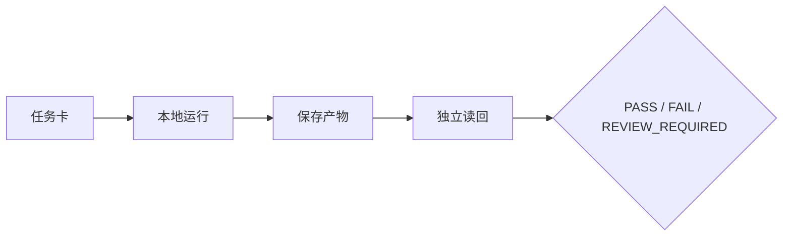
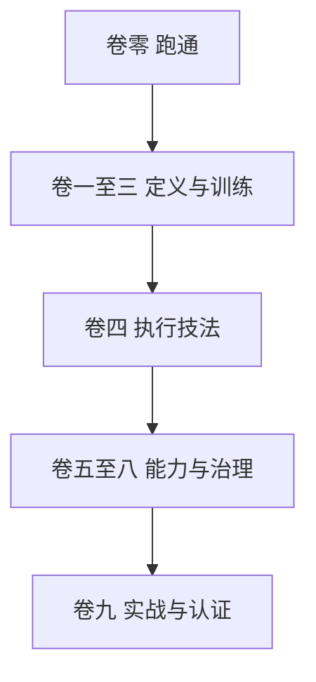

# 卷零　先跑起来一个可检查的 Agent

> 本卷只提供理解全书所需的最小实践入口，不替代 OpenClaw、Hermes 或其他产品的安装与运维手册。命令按 OpenClaw `2026.9.6` 本机 `--help` 在 2026-10-01 复核；不同版本先看相应官方文档。

**图 0-1　卷零最小闭环（本书绘制）**



图 0-1 展示第一次运行也必须经历任务、行动、产物、读回与裁决；聊天返回只处在链条中间。

## 0.1 这一小时要得到什么

你不需要先理解 Gateway、MCP、Handoff 或记忆生命周期。卷零只要求得到四个可见结果：

1. 确认本机是否已有可运行的 Agent 环境；
2. 在不外发、不删改生产数据的前提下完成一次本地任务；
3. 保存任务、输出和一次独立检查；
4. 能说清“模型回答了”和“Agent 完成了工作”之间的差别。

若你是管理者，可以不执行命令，直接让工程同事演示同一条链；你负责看终态、证据和责任。若你是 Agent，必须把本卷当作低风险演练，不得自行安装软件、修改系统配置、读取秘密或连接真实业务通道。

### 最小成功标准

“跑起来”不是屏幕出现一段文字。最小成功包含三面：技术执行有返回，结果被保存为可读取产物，预期环境状态经独立读回。若只有聊天回答，本卷练习最多证明模型能够响应。

## 0.2 安全地检查环境

先运行只读检查：

```bash
openclaw --version
openclaw --help
openclaw agent --help
```

固定基线的期望版本前缀是 `OpenClaw 2026.9.6 (eb377ac)`。若命令不存在、版本不同或帮助页没有相应选项，停止复制后续命令，转到当前版本官方文档。不要为了完成练习执行 `reset`、`uninstall`、`doctor --fix`、全局 `chmod`、删除状态目录或连接真实消息通道。

接着检查服务和模型状态。以下命令可能因尚未配置而返回未就绪，这本身是有效结果：

```bash
openclaw status
openclaw models status
openclaw health
```

把输出中的令牌、邮箱、手机号、内部地址和客户信息去除后，再保存到练习证据包。若需要配置模型或 Gateway，使用当前版本的 `openclaw onboard` 或组织自己的安装流程；本书不保存密钥，也不把配置步骤当成训练学原理。

## 0.3 Hello Agent：一次不外发的本地任务

选择一个没有隐私、没有真实凭证、不会改变外部系统的任务，例如：

> 阅读下列三句话，输出一个三列表格：事实、推断、仍需验证。不要访问网络，不要发送消息；信息不足时明确写“仍需验证”。

把三句话换成你自己编写的合成材料。若本机已完成模型配置，可运行：

```bash
openclaw agent --local --message "阅读这三句话并区分事实、推断和仍需验证：甲公司发布了产品说明；一位用户称速度提高；我们尚未看到独立测试。不要联网，不要外发。" --json
```

这里故意不使用 `--deliver`，因为本卷不测试消息外发。若 `--local` 路径在你的配置中不可用，可通过已配置 Gateway 执行同一低风险任务，但仍不得选择真实外发目标。

运行失败时，先保存完整错误类别，再查当前版本帮助；不要连续盲重试。常见分支只有四类：未配置模型、Gateway 未就绪、Agent ID/路由不匹配、权限或网络不可用。每类问题都应转成一个明确待办，而不是把所有问题归为“Agent 不行”。

## 0.4 给第一次运行加一个任务卡

在任意临时工作目录新建任务记录，至少写：

```yaml
task:
  id: HELLO-AGENT-001
  objective: "把三句话分为事实、推断和仍需验证"
  in_scope: ["用户提供的合成文本", "本地输出"]
  out_of_scope: ["联网", "真实客户数据", "外发", "修改配置"]
  deliverable: "result.md 或 JSON 输出"
  environment_terminal: "独立读取产物，确认三类均出现且没有外部动作"
  budget: {turns: 1, retries: 1, human_minutes: 15}
  stop_if: ["要求凭证", "试图联网", "试图外发", "版本/命令不匹配"]
```

执行完成后，把输出保存到一个明确文件，再由人或另一个只读过程打开它，检查三件事：输出能否读取；每条内容能否落入三类之一；运行中是否发生越界动作。若模型把用户声称的性能提升写成事实，结果应是 `FAIL`；若运行轨迹或外部状态无法确认，结果是 `REVIEW_REQUIRED`。

这个练习已经包含全书最小闭环：目标、范围、动作、产物、环境终态、失败和验收。后续章节只是把这些对象扩展到长期任务、多工具、多 Agent 和真实组织。

## 0.5 第一个 Agent 为什么还不“强”

一次成功只证明一个具体配置在一个输入上完成了一个低风险任务。它尚未证明：换材料还能做对；输入有恶意指令时能守住边界；长任务中不会忘记；工具失败时能恢复；多个 Agent 能交接；成本可接受；输出对业务真的有用。

本书用七个维度描述强：质量、泛化、安全、稳定、效率、协作、可治理。你可以用本次运行做第一次自评：

| 维度 | 目前有什么证据 | 不能声称什么 |
| --- | --- | --- |
| 质量 | 一次三分类结果 | 长期准确率 |
| 泛化 | 无或极少 | 跨任务能力 |
| 安全 | 任务声明禁止外发 | 运行时一定能阻断 |
| 稳定 | 一次运行 | 多轮、重启、换模型稳定 |
| 效率 | 本次耗时/调用 | 同质量下的最优成本 |
| 协作 | 人工读回 | 多 Agent 交接能力 |
| 可治理 | 有任务卡和三态结论 | 已达到生产问责标准 |

这张表的作用是建立证据纪律。不要贬低一次成功，也不要把它扩大成“已经胜任”。

## 0.6 四个根问题

现在用四个问题检查你的最小 Agent：

1. **我是谁**：它的职责和非目标是什么？如果身份只写“万能助手”，后续很难判断越界。
2. **我为谁服务**：谁提出目标，谁受影响，谁有权接受结果？用户并不总等于唯一利益相关者。
3. **我能做什么**：模型、工具、状态、环境和权限分别允许什么？自然语言承诺不能替代系统控制。
4. **我如何改进**：失败如何进入评测和训练，改动怎样回归、留出、批准和回滚？一次纠正不能自动进入长期记忆或 Skill。

四问贯穿全书。卷一定义对象和强者标准；卷二建立岗位、契约与运行容器；卷三建立评测、训练和工作交互；卷四补足真正让 Agent 会执行复杂任务的技法；卷五到卷八处理记忆、工具、主动性、组织、安全和治理；卷九用训练营、案例和认证收口。

## 0.7 新手最容易犯的十个错误

1. **把版本不匹配当成能力失败。** 先看 `--version` 和当前帮助。
2. **一开始就连接真实通道。** 先用本地、合成、无副作用环境。
3. **把 prompt 当作权限。** “请勿外发”是声明，工具策略和审批才是执行控制。
4. **把输出当终态。** 文件、消息、数据库和业务对象都要独立读回。
5. **遇错连续重试。** 先分类错误并判断幂等、预算和副作用。
6. **把所有历史塞进上下文。** 先给目标、边界、当前状态和索引，按需加载。
7. **把临时笔记写进长期记忆。** 先验证、归因、去敏和审批。
8. **过早使用多 Agent。** 单体任务和产物合同尚不清楚时，多 Agent 只增加通信税。
9. **只保存成功。** 失败、停止、未知和恢复是最重要的训练材料之一。
10. **把 `PASS` 当永久证书。** 版本、模型、工具、数据或权限重大变化后必须重测。

**图 0-2　卷零到九卷的学习路线（本书绘制）**



图 0-2 把全书阅读顺序压缩为五个阶段；读者可以按角色跳转，但执行技法位于能力基础设施之前。

## 0.8 从这里进入全书

- 想理解为什么 Agent 是系统而非模型：读 C01—C03。
- 想把一个岗位建成可训练 Agent：读 C04—C09。
- 想让 Agent 真正会拆解、续作、验证和委派：读 C10—C12。
- 想处理记忆、工具与能力供应链：读 C13—C15。
- 想建立主动性与授权：读 C16—C18。
- 想组织多个 Agent：读 C19—C21。
- 想进入生产：读 C22—C24。
- 想按 30 天训练并认证：读 C25—C27。

Agent 不应一次加载全书。先读任务相关章节的导航、产物和停止条件，再按需加载正文和附录。人类读者也无需从第一页一直读到底：先完成卷零，用一个真实问题选择路线。

卷零结束时，你应拥有一个小而完整的证据包：环境快照、任务卡、运行输出、独立读回和三态结论。它不是生产能力，却是训练学的第一块地基。
